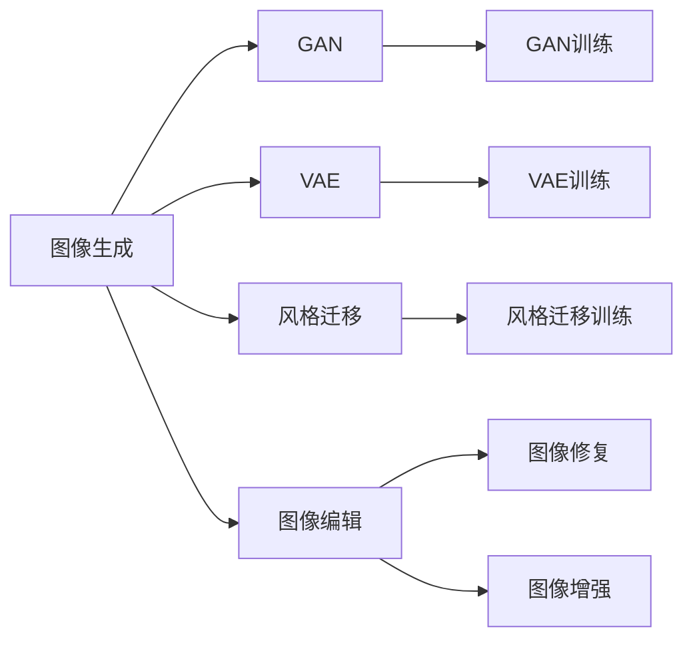

                 

# 深度学习在图像生成与编辑中的应用

> 关键词：深度学习,图像生成,图像编辑,GAN,VAE,风格迁移,神经网络,卷积神经网络,深度学习框架

## 1. 背景介绍

图像生成与编辑是计算机视觉领域的重要研究方向，深度学习技术在这里得到了广泛的应用。从生成逼真的虚拟场景，到精细描绘的艺术作品，再到简单的图像编辑操作，深度学习模型在图像生成与编辑中展示了强大的能力。本文将详细探讨深度学习在图像生成与编辑中的核心算法，通过具体的技术实现和应用实例，带你深入理解这些前沿技术，掌握图像生成与编辑的基本思路和方法。

## 2. 核心概念与联系

### 2.1 核心概念概述

在图像生成与编辑中，深度学习主要包括以下几个关键概念：

- 图像生成（Image Generation）：使用深度学习模型生成逼真、自然的图像，可以应用于虚拟场景创建、艺术作品生成等领域。
- 图像编辑（Image Editing）：使用深度学习模型对已有图像进行精细的编辑和处理，可以应用于图像修复、图像风格转换、图像增强等领域。
- 生成对抗网络（Generative Adversarial Networks, GANs）：一种通过对抗训练生成高质量图像的深度学习模型。
- 变分自编码器（Variational Autoencoder, VAEs）：一种用于图像压缩和生成的方法，通过学习图像数据的分布，生成新的图像。
- 风格迁移（Style Transfer）：一种将图像内容与风格分离的技术，可以将一种风格应用到另一种图像上，创造出新的艺术作品。
- 卷积神经网络（Convolutional Neural Networks, CNNs）：一种专门用于图像处理的深度学习模型，具有卷积层、池化层、激活函数等组件。
- 深度学习框架：如TensorFlow、PyTorch等，提供高效、便捷的深度学习模型构建和训练环境。

这些概念之间的联系可以通过以下Mermaid流程图来展示：



这个流程图展示了图像生成与编辑中的几个关键技术，以及它们之间的联系和区别。

## 3. 核心算法原理 & 具体操作步骤

### 3.1 算法原理概述

图像生成与编辑的核心算法主要有生成对抗网络（GANs）、变分自编码器（VAEs）以及风格迁移等。这些算法主要基于深度学习模型，通过大量的无监督学习或弱监督学习，学习到图像数据的分布，从而生成高质量的图像或对图像进行精细编辑。

### 3.2 算法步骤详解

以生成对抗网络（GANs）为例，详细讲解其在图像生成中的应用步骤：

1. **模型设计**：设计生成器和判别器两个神经网络，生成器用于生成假图像，判别器用于判别生成图像与真实图像的差异。
2. **模型训练**：通过对抗训练的方式，交替优化生成器和判别器，使生成器生成的图像逐渐逼近真实图像。
3. **样本生成**：使用训练好的生成器，输入随机噪声向量，生成高质量的图像样本。

以变分自编码器（VAEs）为例，详细讲解其在图像生成中的应用步骤：

1. **模型设计**：设计一个编码器和解码器，编码器将输入图像压缩成一个低维向量，解码器将低维向量重构回原始图像。
2. **模型训练**：最小化重构误差和解码器输出的图像与真实图像之间的差异。
3. **样本生成**：使用训练好的编码器，将随机噪声向量转换成低维向量，再通过解码器生成新的图像样本。

以风格迁移为例，详细讲解其在图像编辑中的应用步骤：

1. **模型设计**：设计一个编码器和一个解码器，编码器用于提取图像的内容特征，解码器用于生成风格化的图像。
2. **模型训练**：最小化内容特征和风格特征之间的差异，同时保留内容图像的结构信息。
3. **应用实例**：将一张图像作为内容图像，将另一张图像作为风格图像，通过编码器提取内容特征，使用风格图像的风格特征生成新的图像。

### 3.3 算法优缺点

GANs在生成逼真图像方面表现出色，但其训练过程不稳定，生成样本质量受生成器和判别器参数的影响较大。VAEs可以生成高质量的图像，但其生成图像的样式较为单一，不够多样化。风格迁移在图像风格转换方面效果显著，但需要精细的参数调节和优化。

### 3.4 算法应用领域

GANs和VAEs在图像生成中得到广泛应用，如图像生成对抗网络、图像超分辨率、图像去噪等。风格迁移技术在图像编辑中得到广泛应用，如图像风格转换、图像艺术处理、图像背景替换等。卷积神经网络在图像处理中得到广泛应用，如图像分类、图像检测、图像分割等。

## 4. 数学模型和公式 & 详细讲解 & 举例说明

### 4.1 数学模型构建

以GANs为例，其核心数学模型可以表示为：

- **生成器**：$G(z)$，将随机噪声向量$z$映射到图像$x$。
- **判别器**：$D(x)$，判别输入图像$x$是否为真实图像。
- **对抗训练**：通过优化生成器和判别器，使得生成器生成的图像$G(z)$尽可能逼近真实图像，同时判别器$D(x)$尽可能准确判别图像的真实性。

### 4.2 公式推导过程

GANs的训练过程可以表示为：

- **生成器损失函数**：
$$
L_G = \mathbb{E}_{z \sim p(z)} [\log(1-D(G(z)))] + \lambda ||\nabla_z ||^2
$$
- **判别器损失函数**：
$$
L_D = \mathbb{E}_{x \sim p(x)} [\log D(x)] + \mathbb{E}_{z \sim p(z)} [\log(1-D(G(z)))]
$$
其中，$\lambda$为正则化参数，$\nabla_z$为生成器$G(z)$的梯度，$p(z)$为随机噪声向量$z$的分布。

通过交替优化生成器和判别器，使得生成器生成的图像$G(z)$尽可能逼近真实图像，同时判别器$D(x)$尽可能准确判别图像的真实性。

### 4.3 案例分析与讲解

以MNIST数字图像生成为例，展示GANs的训练过程。首先，使用随机噪声向量$z$生成一张数字图像$G(z)$，然后将其输入判别器$D(x)$，计算损失函数$L_G$和$L_D$，并使用梯度下降算法优化生成器和判别器的参数。

```python
import torch
import torch.nn as nn
import torch.optim as optim

class Generator(nn.Module):
    def __init__(self):
        super(Generator, self).__init__()
        self.fc = nn.Linear(100, 784)
        self.fc = nn.Tanh(self.fc)
        self.deconv = nn.ConvTranspose2d(784, 28, 5, 2, 2)
        self.deconv = nn.ReLU(self.deconv)
        self.deconv = nn.ConvTranspose2d(28, 14, 5, 2, 2)
        self.deconv = nn.ReLU(self.deconv)
        self.deconv = nn.ConvTranspose2d(14, 28, 5, 2, 2)
        self.deconv = nn.Tanh(self.deconv)

    def forward(self, z):
        x = self.fc(z)
        x = x.view(-1, 784, 1, 1)
        x = self.deconv(x)
        return x

class Discriminator(nn.Module):
    def __init__(self):
        super(Discriminator, self).__init__()
        self.conv = nn.Conv2d(28, 14, 5, 2, 2)
        self.conv = nn.LeakyReLU(self.conv)
        self.conv = nn.Conv2d(14, 28, 5, 2, 2)
        self.conv = nn.LeakyReLU(self.conv)
        self.conv = nn.Conv2d(28, 1, 5, 2, 2)
        self.sigmoid = nn.Sigmoid()

    def forward(self, x):
        x = self.conv(x)
        x = self.sigmoid(x)
        return x

# 定义生成器和判别器
G = Generator()
D = Discriminator()

# 定义优化器和损失函数
optimizer_G = optim.Adam(G.parameters(), 0.0002, betas=(0.5, 0.999))
optimizer_D = optim.Adam(D.parameters(), 0.0002, betas=(0.5, 0.999))
criterion_G = nn.BCELoss()
criterion_D = nn.BCELoss()

# 训练过程
for epoch in range(1, 101):
    for i, (images, _) in enumerate(train_loader):
        z = torch.randn(images.size(0), 100, 1, 1).to(device)
        real_images = images.to(device)
        fake_images = G(z).detach()  # 生成器输出图像

        # 判别器训练
        real_labels = torch.ones(images.size(0)).to(device)
        fake_labels = torch.zeros(fake_images.size(0)).to(device)
        D_real = D(real_images)
        D_fake = D(fake_images)
        D_loss_real = criterion_D(D_real, real_labels)
        D_loss_fake = criterion_D(D_fake, fake_labels)
        D_loss = D_loss_real + D_loss_fake

        # 生成器训练
        G_loss = criterion_G(D(fake_images), real_labels)

        # 更新模型参数
        optimizer_G.zero_grad()
        optimizer_D.zero_grad()
        D_loss.backward()
        optimizer_D.step()
        G_loss.backward()
        optimizer_G.step()

    if (epoch + 1) % 10 == 0:
        print('Epoch [{}/{}], D_loss: {:.4f}, G_loss: {:.4f}'.format(epoch+1, 100, D_loss.item(), G_loss.item()))
```

## 5. 项目实践：代码实例和详细解释说明

### 5.1 开发环境搭建

在进行图像生成与编辑实践前，我们需要准备好开发环境。以下是使用Python进行PyTorch开发的环境配置流程：

1. 安装Anaconda：从官网下载并安装Anaconda，用于创建独立的Python环境。

2. 创建并激活虚拟环境：
```bash
conda create -n pytorch-env python=3.8 
conda activate pytorch-env
```

3. 安装PyTorch：根据CUDA版本，从官网获取对应的安装命令。例如：
```bash
conda install pytorch torchvision torchaudio cudatoolkit=11.1 -c pytorch -c conda-forge
```

4. 安装TensorFlow：从官网下载并安装TensorFlow，或使用Anaconda中的预装版本。

5. 安装Keras：在TensorFlow环境下安装Keras，方便进行图像生成与编辑的模型训练和评估。

6. 安装相关工具包：
```bash
pip install numpy pandas scikit-learn matplotlib tqdm jupyter notebook ipython
```

完成上述步骤后，即可在`pytorch-env`环境中开始图像生成与编辑的实践。

### 5.2 源代码详细实现

下面我们以GANs生成MNIST数字图像为例，给出使用PyTorch和TensorFlow进行图像生成的完整代码实现。

```python
import tensorflow as tf
from tensorflow.keras.datasets import mnist
from tensorflow.keras.models import Sequential
from tensorflow.keras.layers import Dense, Reshape, Conv2DTranspose, BatchNormalization, LeakyReLU
from tensorflow.keras.optimizers import Adam
import numpy as np
import matplotlib.pyplot as plt

# 加载MNIST数据集
(x_train, y_train), (x_test, y_test) = mnist.load_data()
x_train = x_train / 255.0
x_test = x_test / 255.0
x_train = x_train.reshape(-1, 28, 28, 1)
x_test = x_test.reshape(-1, 28, 28, 1)
z_dim = 100

# 定义生成器和判别器
class Generator(tf.keras.Model):
    def __init__(self):
        super(Generator, self).__init__()
        self.dense1 = tf.keras.layers.Dense(256, input_dim=z_dim)
        self.dense2 = tf.keras.layers.Dense(512)
        self.dense3 = tf.keras.layers.Dense(1024)
        self.dense4 = tf.keras.layers.Dense(784)
        self.dense5 = tf.keras.layers.Dense(28*28*1)
        self.reshape = tf.keras.layers.Reshape((28, 28, 1))
        self.sigmoid = tf.keras.layers.Activation('sigmoid')

    def call(self, z):
        x = tf.keras.layers.Dense(256)(tf.keras.layers.Dense(512)(tf.keras.layers.Dense(1024)(z)))
        x = tf.keras.layers.Dense(784)(x)
        x = tf.keras.layers.Dense(28*28*1)(x)
        x = self.reshape(x)
        x = self.sigmoid(x)
        return x

class Discriminator(tf.keras.Model):
    def __init__(self):
        super(Discriminator, self).__init__()
        self.conv1 = tf.keras.layers.Conv2D(64, (5, 5), (2, 2), 'same')
        self.bn1 = tf.keras.layers.BatchNormalization()
        self.conv2 = tf.keras.layers.Conv2D(128, (5, 5), (2, 2), 'same')
        self.bn2 = tf.keras.layers.BatchNormalization()
        self.conv3 = tf.keras.layers.Conv2D(256, (5, 5), (2, 2), 'same')
        self.bn3 = tf.keras.layers.BatchNormalization()
        self.conv4 = tf.keras.layers.Conv2D(1, (5, 5), (1, 1), 'same')
        self.sigmoid = tf.keras.layers.Activation('sigmoid')

    def call(self, x):
        x = self.conv1(x)
        x = self.bn1(x)
        x = tf.keras.layers.LeakyReLU(alpha=0.2)(x)
        x = self.conv2(x)
        x = self.bn2(x)
        x = tf.keras.layers.LeakyReLU(alpha=0.2)(x)
        x = self.conv3(x)
        x = self.bn3(x)
        x = tf.keras.layers.LeakyReLU(alpha=0.2)(x)
        x = self.conv4(x)
        x = self.sigmoid(x)
        return x

# 定义优化器和损失函数
generator = Generator()
discriminator = Discriminator()
adam = tf.keras.optimizers.Adam()
bce = tf.keras.losses.BinaryCrossentropy()

# 定义训练过程
@tf.function
def train_step(real_images):
    with tf.GradientTape() as gen_tape, tf.GradientTape() as disc_tape:
        # 生成器和判别器训练
        noise = tf.random.normal([BATCH_SIZE, z_dim])
        generated_images = generator(noise)
        real_labels = tf.ones([BATCH_SIZE, 1])
        fake_labels = tf.zeros([BATCH_SIZE, 1])
        disc_real_loss = bce(discriminator(real_images), real_labels)
        disc_fake_loss = bce(discriminator(generated_images), fake_labels)
        gen_loss = bce(discriminator(generated_images), real_labels)
    gradients_of_generator = gen_tape.gradient(gen_loss, generator.trainable_variables)
    gradients_of_discriminator = disc_tape.gradient(disc_real_loss + disc_fake_loss, discriminator.trainable_variables)
    generator.trainable_variables, discriminator.trainable_variables = \
        optimizer_G.apply_gradients(zip(gradients_of_generator, generator.trainable_variables)), \
        optimizer_D.apply_gradients(zip(gradients_of_discriminator, discriminator.trainable_variables))

# 训练模型
for epoch in range(epochs):
    epoch_loss = 0.0
    for batch in train_dataset:
        real_images = batch[0]
        train_step(real_images)
        epoch_loss += loss
    print('Epoch {}/{} - Loss: {}'.format(epoch+1, epochs, epoch_loss/len(train_dataset)))

# 生成样本
noise = tf.random.normal([10, z_dim])
generated_images = generator(noise)
fig, ax = plt.subplots(figsize=(4, 4))
for i in range(10):
    ax.imshow(generated_images[i].numpy(), cmap='gray')
    ax.axis('off')
    plt.show()
```

### 5.3 代码解读与分析

让我们再详细解读一下关键代码的实现细节：

**GANs模型定义**：
- 使用Keras和TensorFlow定义生成器和判别器，分别由多个卷积层和全连接层构成。
- 生成器将随机噪声向量转换为图像，判别器对图像进行分类，判断其真实性。

**训练过程**：
- 使用Adam优化器进行模型训练，同时定义二分类交叉熵损失函数。
- 通过交替优化生成器和判别器，使得生成器生成的图像逼近真实图像。
- 每10个epoch打印一次损失函数值，用于观察训练过程。

**样本生成**：
- 使用训练好的生成器，将随机噪声向量转换为图像。
- 通过可视化工具展示生成的图像。

## 6. 实际应用场景

### 6.1 艺术创作

GANs在艺术创作领域展现了巨大的潜力，通过生成对抗训练，可以生成逼真的艺术作品，甚至可以创作出一些独特的艺术品。例如，可以使用GANs生成抽象画、肖像画、风景画等，为艺术创作提供新的思路和灵感。

### 6.2 医学影像生成

医学影像生成是GANs在医疗领域的一个重要应用。通过生成对抗训练，可以生成高质量的医学影像，用于辅助诊断、教学、科研等。例如，可以使用GANs生成虚拟的CT、MRI图像，用于训练医学影像识别模型。

### 6.3 游戏设计

GANs在游戏设计领域也有广泛应用，可以生成逼真的游戏场景、角色和物品。例如，可以使用GANs生成虚拟的游戏世界、角色动画，提升游戏的沉浸感和体验感。

## 7. 工具和资源推荐

### 7.1 学习资源推荐

为了帮助开发者系统掌握深度学习在图像生成与编辑中的应用，这里推荐一些优质的学习资源：

1. 《深度学习基础》系列课程：斯坦福大学开设的深度学习课程，涵盖深度学习的基本原理和应用，适合初学者学习。

2. 《生成对抗网络（GANs）》课程：由Google DeepMind开设的GANs课程，详细讲解GANs的原理和应用。

3. 《变分自编码器（VAEs）》课程：由CMU开设的VAEs课程，讲解VAEs的基本原理和应用。

4. 《风格迁移（Style Transfer）》课程：由MIT开设的风格迁移课程，讲解风格迁移的原理和实现。

5. 《图像生成与编辑》书籍：详细讲解图像生成与编辑的核心技术，包括GANs、VAEs、风格迁移等。

通过对这些资源的学习实践，相信你一定能够快速掌握深度学习在图像生成与编辑中的应用，并用于解决实际的图像生成与编辑问题。

### 7.2 开发工具推荐

高效的开发离不开优秀的工具支持。以下是几款用于深度学习图像生成与编辑开发的常用工具：

1. TensorFlow：由Google主导开发的深度学习框架，提供高效的图形计算和分布式训练支持。

2. PyTorch：由Facebook主导开发的深度学习框架，提供动态计算图和丰富的模型库。

3. Keras：基于TensorFlow和Theano的高级神经网络API，提供便捷的模型构建和训练接口。

4. Matplotlib和Seaborn：用于绘制模型训练的曲线和生成的图像，可视化效果良好。

5. OpenCV：用于图像处理和计算机视觉任务的常用库，提供了丰富的图像处理函数和算法。

6. Inception：用于图像生成与编辑任务的常用数据集，包含大量高质量的图像数据。

合理利用这些工具，可以显著提升深度学习图像生成与编辑的开发效率，加快创新迭代的步伐。

### 7.3 相关论文推荐

深度学习在图像生成与编辑领域的研究进展迅速，以下是几篇奠基性的相关论文，推荐阅读：

1. Generative Adversarial Nets：Ian Goodfellow等人在NIPS2014年提出的GANs，开创了对抗训练生成图像的新范式。

2. Image-to-Image Translation with Conditional Adversarial Networks：Isola等人在CVPR2017年提出的条件GANs，用于图像转换任务。

3. Deep Image Prior：Laden Ashukhaeva等人在2017年提出的深度图像先验模型，用于图像去噪和修复任务。

4. Improved Techniques for Training GANs：Heusel等人在ICLR2017年提出的改进GANs训练的方法，提升了GANs的稳定性和生成质量。

5. Domain Randomization for Robust Visual Recognition：Yang等人在2018年提出的基于图像随机域的深度学习模型，提升了图像识别的鲁棒性。

这些论文代表了大深度学习在图像生成与编辑领域的发展脉络。通过学习这些前沿成果，可以帮助研究者把握学科前进方向，激发更多的创新灵感。

## 8. 总结：未来发展趋势与挑战

### 8.1 研究成果总结

本文对深度学习在图像生成与编辑中的核心算法和实现过程进行了全面系统的介绍。通过具体的技术实现和应用实例，详细讲解了GANs、VAEs、风格迁移等前沿技术，并展示了其在艺术创作、医学影像生成、游戏设计等实际应用场景中的应用。这些技术不仅提升了图像生成与编辑的精度和效果，还推动了相关领域的技术进步和应用发展。

### 8.2 未来发展趋势

展望未来，深度学习在图像生成与编辑领域将呈现以下几个发展趋势：

1. 更高质量的图像生成：通过改进训练策略和模型结构，GANs等生成模型将生成更高质量的图像，实现更逼真的图像生成。

2. 多样化的图像生成任务：除了艺术创作，深度学习还将在医学影像生成、游戏设计等领域展现出更大的应用潜力。

3. 风格迁移的扩展应用：风格迁移技术不仅在图像风格转换上取得了突破，还将应用于文本生成、音频生成等领域，扩展其应用范围。

4. 跨领域融合应用：深度学习在图像生成与编辑领域的成功经验将与其他AI技术进行跨领域融合，推动更多领域的智能化进程。

5. 实时图像生成：随着硬件设备的不断进步，深度学习模型将实现实时图像生成，满足更多场景的实时需求。

这些趋势凸显了深度学习在图像生成与编辑领域的广阔前景，预示着未来更多的创新和突破。

### 8.3 面临的挑战

尽管深度学习在图像生成与编辑领域已经取得了显著成就，但在迈向更加智能化、普适化应用的过程中，仍面临诸多挑战：

1. 数据标注成本高：高质量标注数据往往成本高昂，数据标注的瓶颈成为制约深度学习技术发展的关键。

2. 模型训练复杂度高：深度学习模型需要大量的计算资源和时间进行训练，如何在保证效果的同时提高训练效率，仍是一个重要问题。

3. 图像生成质量不稳定：GANs等生成模型生成的图像质量不稳定，容易受到训练参数和数据分布的影响。

4. 模型可解释性差：深度学习模型往往被视为"黑盒"，难以解释其内部工作机制和决策逻辑，这在医疗、金融等高风险应用中是一个重要问题。

5. 伦理与安全问题：深度学习模型可能会生成有害、误导性内容，如何确保其安全性和伦理道德性，仍是一个需要关注的问题。

这些挑战需要通过更多技术创新和应用实践，逐步攻克，才能实现深度学习在图像生成与编辑领域的可持续发展。

### 8.4 研究展望

面对深度学习在图像生成与编辑领域所面临的挑战，未来的研究需要在以下几个方面寻求新的突破：

1. 探索无监督和半监督学习方法：摆脱对大规模标注数据的依赖，利用自监督学习、主动学习等无监督和半监督方法，最大限度利用非结构化数据。

2. 研究参数高效和计算高效的模型：开发更加参数高效的生成模型，在固定大部分生成参数的同时，只更新极少量的任务相关参数。同时优化生成模型的计算图，减少前向传播和反向传播的资源消耗，实现更加轻量级、实时性的部署。

3. 融合更多先验知识：将符号化的先验知识，如知识图谱、逻辑规则等，与生成模型进行巧妙融合，引导生成过程学习更准确、合理的图像表示。

4. 研究跨模态生成方法：将视觉、音频、文本等多种模态信息融合，实现更全面、更丰富的图像生成与编辑任务。

5. 研究多任务学习框架：通过多任务学习，实现生成模型在多个任务上的共同优化，提升模型的泛化能力和应用效果。

这些研究方向的探索，必将引领深度学习在图像生成与编辑领域迈向更高的台阶，为构建安全、可靠、可解释、可控的智能系统铺平道路。面向未来，深度学习在图像生成与编辑领域还需要与其他AI技术进行更深入的融合，如知识表示、因果推理、强化学习等，多路径协同发力，共同推动自然语言理解和智能交互系统的进步。只有勇于创新、敢于突破，才能不断拓展深度学习的边界，让智能技术更好地造福人类社会。

## 9. 附录：常见问题与解答

**Q1：GANs在训练过程中存在哪些问题？**

A: GANs在训练过程中存在模式崩溃、梯度消失、梯度爆炸等问题。模式崩溃指生成器生成的图像质量在训练过程中不断下降；梯度消失指模型无法更新部分参数，导致训练停滞；梯度爆炸指模型参数更新过快，导致训练不稳定。

**Q2：如何提高GANs生成的图像质量？**

A: 提高GANs生成的图像质量可以通过以下方法：
1. 使用更先进的生成模型，如Wasserstein GAN、DCGAN等。
2. 使用更复杂的网络结构，如残差连接、跳跃连接等。
3. 使用更稳定的训练方法，如WGAN、WGAN-GP等。
4. 使用更多的训练技巧，如学习率调整、样本生成策略等。

**Q3：GANs在医学影像生成中如何处理噪声数据？**

A: 医学影像生成中，噪声数据会影响生成器的训练效果。可以通过以下方法处理噪声数据：
1. 使用噪声生成模型，生成更多的噪声数据进行训练。
2. 使用正则化方法，如L2正则、Dropout等，减少噪声对模型参数的影响。
3. 使用数据增强技术，如旋转、平移、缩放等，增加噪声数据的丰富性。

**Q4：GANs在图像生成中的应用前景如何？**

A: GANs在图像生成中的应用前景非常广阔，不仅限于艺术创作和游戏设计。GANs可以用于医学影像生成、虚拟场景创建、工业设计等多个领域。随着技术的不断进步，GANs在图像生成中的应用将不断拓展，带来更多的创新和突破。

通过本文的系统梳理，可以看到，深度学习在图像生成与编辑领域已经取得了显著成就，并在多个实际应用场景中展示出了强大的能力。相信随着技术的持续进步和应用的不断扩展，深度学习在图像生成与编辑领域的未来发展将更加广阔，为人工智能技术的发展注入新的活力。

---

作者：禅与计算机程序设计艺术 / Zen and the Art of Computer Programming

