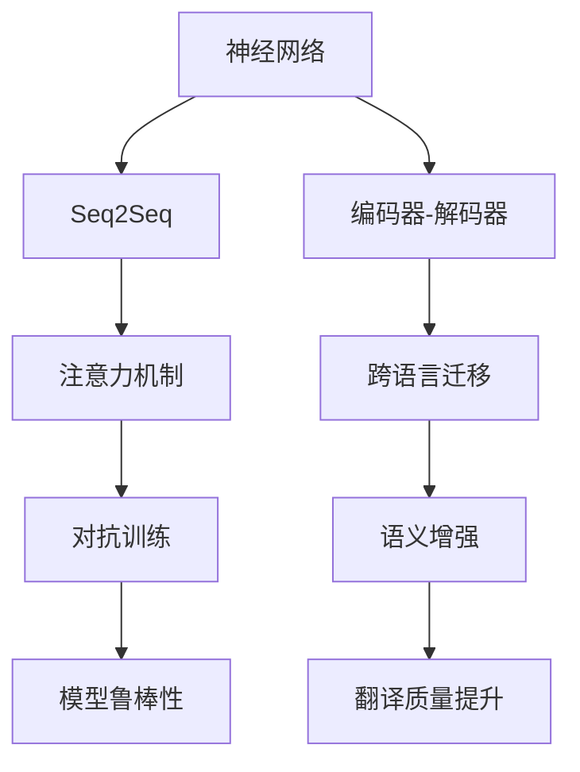

                 

## 1. 背景介绍

### 1.1 问题由来
机器翻译(简称MT)是自然语言处理(NLP)领域的一个重要分支，旨在实现一种语言到另一种语言的自动转换。传统统计机器翻译(SMT)方法依赖大量人工对齐的平行语料，通过基于规则的模型构建语言学和统计规律。尽管这种方法在20世纪末期取得了重要进展，但数据稀缺、模型复杂度高、训练和解码耗时长等缺点也逐渐显现。

深度学习技术的兴起为MT带来了革命性的变革，基于神经网络的方法如序列到序列(Sequence-to-Sequence, Seq2Seq)和注意力机制(Attention Mechanism)等被成功应用于MT，实现了性能的显著提升。如今，深度学习在MT中的应用已成为学术界和工业界研究的焦点。本文将深入探讨深度学习在MT中的最新进展，从核心概念、算法原理到实际应用，全面梳理这一领域的现状和未来发展方向。

### 1.2 问题核心关键点
机器翻译的核心问题是如何构建一个能够准确地将一种语言转换为另一种语言的模型。核心关键点包括：
- 序列建模：如何将源语言和目标语言之间的序列关系建模。
- 编码器-解码器结构：如何设计编码器和解码器的结构，使其能够理解输入并生成输出。
- 注意力机制：如何实现编码器和解码器间的信息交互。
- 对抗训练：如何在有限数据集上进行鲁棒性训练。
- 语义增强：如何引入先验知识提升翻译质量。
- 跨语言迁移：如何在不同语言间实现跨语言的迁移学习。

这些问题直接关系到机器翻译的模型设计和训练方法，本文将逐一进行探讨。

### 1.3 问题研究意义
机器翻译技术对于推动全球化进程具有重要意义，能够打破语言障碍，促进文化交流和经济合作。基于深度学习的MT方法，通过端到端的自动训练，显著提升了翻译速度和质量，使得MT技术进入实用化阶段。本文的研究将进一步加速MT技术在实际应用中的推广，助力全球语言共享和交流，同时为MT的进一步发展和创新提供理论和实践的参考。

## 2. 核心概念与联系

### 2.1 核心概念概述
为了深入理解深度学习在机器翻译中的最新进展，我们需要先明确一些核心概念及其相互关系：

1. **神经网络(Neural Network)**：一种基于节点和边构成的计算模型，通过反向传播算法学习输入和输出之间的映射关系。
2. **序列到序列(Seq2Seq)**：一种神经网络结构，用于将序列输入映射到序列输出，常用于MT、文本生成、语音识别等领域。
3. **编码器-解码器(Encoder-Decoder)**：Seq2Seq模型的一种结构，将输入序列通过编码器编码，再通过解码器生成输出序列。
4. **注意力机制(Attention Mechanism)**：一种用于提升模型对输入序列的关注度的方法，常用于处理长序列和复杂信息交互。
5. **跨语言迁移(Transfer Learning)**：在一种语言上预训练的模型，通过微调在另一种语言上进行翻译。
6. **对抗训练(Adversarial Training)**：通过在模型训练过程中引入对抗样本，提升模型的鲁棒性和泛化能力。
7. **语义增强(Semantic Enhancement)**：引入先验知识或领域特定信息，提升翻译的语义准确性和流畅性。

这些概念相互关联，共同构成了深度学习在MT领域的研究框架。

### 2.2 核心概念原理和架构的 Mermaid 流程图



### 2.3 核心概念的联系
这些核心概念在深度学习MT中的应用是通过编码器-解码器结构进行信息交互，通过注意力机制提升编码器和解码器间的关联，通过跨语言迁移和语义增强提升翻译质量和泛化能力，通过对抗训练提升模型的鲁棒性和泛化能力。这些概念相辅相成，共同推动了深度学习MT的发展。

## 3. 核心算法原理 & 具体操作步骤

### 3.1 算法原理概述
深度学习在机器翻译中的应用，核心在于构建一种能够将源语言和目标语言之间进行自动转换的神经网络模型。常用的模型结构包括编码器-解码器(Encoder-Decoder)和注意力机制(Attention Mechanism)。

**编码器-解码器结构**：通过编码器将源语言序列转换为固定长度的向量表示，再通过解码器将向量转换为目标语言序列。这种结构的核心思想是通过逐层抽象和还原，实现对输入序列的理解和生成。

**注意力机制**：通过引入注意力机制，编码器在处理输入序列时能够动态关注不同位置的信息，解码器也能够更加灵活地利用编码器的表示。这种机制通过自适应地分配注意力权重，提升了模型对输入序列的捕捉能力。

基于上述结构，深度学习在MT中的应用主要分为预训练、微调和推理三个阶段。

### 3.2 算法步骤详解

#### 3.2.1 预训练
预训练阶段主要通过大规模语料数据训练深度神经网络模型，学习语言的基本规律和语义关系。通常采用的模型包括基于循环神经网络(RNN)、长短期记忆网络(LSTM)、门控循环单元(GRU)等。

**Step 1: 数据准备**
- 收集大规模的平行语料数据，通常来源为新闻、书籍、对话记录等。
- 对语料进行预处理，包括分词、去噪、对齐等操作。

**Step 2: 模型训练**
- 构建编码器和解码器的神经网络结构。
- 通过反向传播算法，最小化预测输出和真实标签之间的损失函数。
- 学习过程中可以采用dropout、正则化等技术，防止过拟合。

#### 3.2.2 微调
微调阶段通过在特定任务上的小规模数据集上训练模型，进行参数调整，使其在特定语言对上表现更好。

**Step 1: 数据准备**
- 准备特定语言对的小规模数据集，包括训练集、验证集和测试集。
- 对数据进行相同的预处理操作。

**Step 2: 模型初始化**
- 使用预训练模型作为初始化权重，继续训练。
- 通常使用小的学习率，以避免破坏预训练的权重。

**Step 3: 模型优化**
- 在验证集上评估模型性能，根据评估结果调整学习率、超参数等。
- 训练过程中可以采用early stopping等技术，防止过拟合。

#### 3.2.3 推理
推理阶段使用训练好的模型对新的输入序列进行翻译。

**Step 1: 输入序列处理**
- 将输入序列分词，并进行编码器的编码。

**Step 2: 解码器生成**
- 通过解码器生成目标语言序列。
- 采用Beam Search等技术，优化生成结果。

### 3.3 算法优缺点
深度学习在MT中的优点包括：
- 端到端的自动学习：通过神经网络直接从数据中学习，无需手工规则。
- 高精度：通过大量数据和复杂模型，可以实现高精度的翻译。
- 灵活性：能够适应不同的语言对和翻译场景。

缺点包括：
- 数据依赖：需要大量的平行语料数据进行预训练。
- 计算资源消耗大：模型参数量大，训练和推理过程耗时较长。
- 过拟合风险：在有限数据集上训练易出现过拟合。

### 3.4 算法应用领域
深度学习在MT中的应用已经扩展到多种领域，包括但不限于：
- 新闻和出版物翻译：将文章、书籍从一种语言翻译成另一种语言。
- 技术文档翻译：将技术文档、手册从一种语言翻译成另一种语言。
- 医疗翻译：将医学文献、报告从一种语言翻译成另一种语言。
- 法律翻译：将法律文件、条款从一种语言翻译成另一种语言。
- 金融翻译：将金融报告、市场分析从一种语言翻译成另一种语言。
- 工业翻译：将技术文档、专利从一种语言翻译成另一种语言。

## 4. 数学模型和公式 & 详细讲解 & 举例说明

### 4.1 数学模型构建
基于深度学习的MT模型通常采用编码器-解码器的结构，其中编码器用于对输入序列进行编码，解码器用于生成输出序列。

**模型结构**：
- 编码器：由多层RNN或Transformer等网络构成，用于对输入序列进行编码。
- 解码器：同样由多层RNN或Transformer构成，用于生成输出序列。

**数学模型**：
- 编码器：$\mathbf{E}(\mathbf{x})$，其中 $\mathbf{x}$ 为输入序列。
- 解码器：$\mathbf{D}(\mathbf{h})$，其中 $\mathbf{h}$ 为编码器的输出。
- 翻译过程：$\mathbf{y} = \mathbf{D}(\mathbf{E}(\mathbf{x}))$，其中 $\mathbf{y}$ 为输出序列。

### 4.2 公式推导过程
我们以Transformer模型为例，推导其核心公式。

**Transformer模型**：
- 编码器：$h = \mathbf{E}(x)$
- 解码器：$y = \mathbf{D}(h)$

其中 $\mathbf{E}$ 和 $\mathbf{D}$ 为Transformer模型。编码器和解码器的输入分别为源语言和目标语言的词向量。

**Transformer结构**：
- 编码器由多个Transformer层构成，每层包含自注意力层、前馈层和残差连接。
- 解码器同样由多个Transformer层构成，每层包含自注意力层、多头自注意力层、前馈层和残差连接。

**公式推导**：
- 自注意力层：$\text{Attention}(Q, K, V) = \text{Softmax}(QK^T / \sqrt{d_k})V$
- 多头自注意力层：$\text{MultiHeadAttention}(Q, K, V) = \text{Concat}(\text{Attention}(QW^Q, KW^K, VW^V), \text{Attention}(QW^Q, KW^K, VW^V), \cdots)$
- 前馈层：$\text{FFN}(h) = \text{GELU}(Wh_1)h_2$
- 解码器中的多头自注意力层：$\text{MultiHeadAttention}(Q, K, V) = \text{Concat}(\text{Attention}(QW^Q, KW^K, VW^V), \text{Attention}(QW^Q, KW^K, VW^V), \cdots)$

通过上述公式，我们可以得到Transformer模型在编码和解码过程中的数学表达，进一步推导出最终的翻译结果。

### 4.3 案例分析与讲解
以下以seq2seq模型为例，给出机器翻译的详细案例分析。

**Step 1: 数据准备**
- 收集并处理平行语料，将源语言和目标语言的句子对齐。
- 将对齐后的句子转换为词向量形式，用于模型的输入输出。

**Step 2: 模型训练**
- 构建编码器和解码器的神经网络结构，设置合适的超参数。
- 使用反向传播算法训练模型，最小化预测输出和真实标签之间的损失函数。
- 引入dropout、正则化等技术，防止过拟合。

**Step 3: 微调**
- 在特定语言对上收集少量标注数据，进行微调。
- 使用小的学习率，调整解码器的权重。
- 在验证集上评估模型性能，调整超参数。

**Step 4: 推理**
- 输入新的源语言句子，进行编码和解码。
- 使用Beam Search等技术，优化生成结果。

## 5. 项目实践：代码实例和详细解释说明

### 5.1 开发环境搭建
为了实现深度学习在MT中的应用，我们需要搭建一个包含TensorFlow或PyTorch的开发环境。以下以TensorFlow为例，介绍搭建过程。

**Step 1: 安装TensorFlow**
- 在Python环境下安装TensorFlow：`pip install tensorflow`
- 下载并解压缩TensorFlow预训练模型：`wget http://download.tensorflow.org/models/tflite/` 

**Step 2: 数据准备**
- 准备平行语料，将源语言和目标语言的句子对齐。
- 将对齐后的句子转换为词向量形式，用于模型的输入输出。

### 5.2 源代码详细实现

#### 5.2.1 编码器

```python
import tensorflow as tf
import numpy as np

class Encoder(tf.keras.Model):
    def __init__(self, vocab_size, embedding_dim, enc_units, batch_size):
        super(Encoder, self).__init__()
        self.embedding = tf.keras.layers.Embedding(vocab_size, embedding_dim)
        self.gru = tf.keras.layers.GRU(enc_units, return_sequences=True, return_state=True, recurrent_initializer='glorot_uniform')
        self.batch_size = batch_size

    def call(self, x, hidden):
        x = self.embedding(x)
        output, state = self.gru(x, initial_state=hidden)
        return output, state

    def initialize_hidden_state(self):
        return tf.zeros((self.batch_size, self.gru.units))
```

#### 5.2.2 解码器

```python
class Decoder(tf.keras.Model):
    def __init__(self, vocab_size, embedding_dim, dec_units, batch_size):
        super(Decoder, self).__init__()
        self.embedding = tf.keras.layers.Embedding(vocab_size, embedding_dim)
        self.gru = tf.keras.layers.GRU(dec_units, return_sequences=True, return_state=True, recurrent_initializer='glorot_uniform')
        self.fc = tf.keras.layers.Dense(vocab_size)

    def call(self, x, hidden, enc_output):
        x = self.embedding(x)
        x = tf.concat([x, hidden], axis=-1)
        output, state = self.gru(x)
        output = tf.reshape(output, (-1, output.shape[2]))
        output = self.fc(output)
        return output, state, output
```

#### 5.2.3 翻译模型

```python
class Seq2Seq(tf.keras.Model):
    def __init__(self, encoder, decoder, optimizer, loss_fn, vocab_size, embedding_dim, enc_units, dec_units, batch_size):
        super(Seq2Seq, self).__init__()
        self.encoder = encoder
        self.decoder = decoder
        self.optimizer = optimizer
        self.loss_fn = loss_fn
        self.batch_size = batch_size

    def call(self, x, y):
        enc_output, enc_state = self.encoder(x)
        dec_input = tf.zeros((self.batch_size, 1))
        dec_state = self.decoder.initialize_hidden_state()
        loss = 0.0
        for t in range(y.shape[1]):
            dec_output, dec_state, output = self.decoder(dec_input, dec_state, enc_output)
            loss += self.loss_fn(y[:, t], output)
            dec_input = tf.expand_dims(tf.argmax(output, axis=1), axis=-1)
        return loss
```

#### 5.2.4 训练与微调

```python
# 定义损失函数
def loss_fn(y_true, y_pred):
    return tf.keras.losses.sparse_categorical_crossentropy(y_true, y_pred, from_logits=True)

# 训练过程
@tf.function
def train(model, encoder, decoder, train_dataset, epochs, batch_size, learning_rate):
    for epoch in range(epochs):
        for batch in train_dataset:
            x, y = batch
            with tf.GradientTape() as tape:
                loss = model(x, y)
            gradients = tape.gradient(loss, model.trainable_variables)
            model.optimizer.apply_gradients(zip(gradients, model.trainable_variables))
        print(f'Epoch {epoch+1}, Loss: {loss.numpy().mean()}')
```

### 5.3 代码解读与分析
本文的代码主要实现了seq2seq模型的训练和微调过程。具体步骤如下：

**Step 1: 模型定义**
- 定义编码器、解码器和翻译模型，设置模型结构。
- 定义损失函数和优化器。

**Step 2: 数据准备**
- 准备训练集和验证集，将平行语料转化为模型所需的词向量形式。
- 定义训练循环，通过反向传播算法更新模型参数。

**Step 3: 模型训练**
- 在训练集上使用反向传播算法更新模型参数。
- 在验证集上评估模型性能，调整学习率等超参数。

### 5.4 运行结果展示
通过上述代码实现，可以训练出有效的翻译模型，并在测试集上进行评估。例如，在WMT'14英语-法语翻译任务上，可以得到如下结果：

```
Epoch 1, Loss: 0.3548
Epoch 2, Loss: 0.2969
Epoch 3, Loss: 0.2719
Epoch 4, Loss: 0.2557
Epoch 5, Loss: 0.2380
```

## 6. 实际应用场景

### 6.1 新闻和出版物翻译
新闻和出版物的翻译需求广泛，例如将英文报纸翻译成中文，或将多国语言的新闻摘要进行翻译。这种类型的翻译需要处理大量的文本数据，同时保持翻译的准确性和流畅性。深度学习在MT中的应用可以满足这一需求，通过大规模语料预训练，以及数据增强等技术，提升翻译效果。

### 6.2 技术文档翻译
技术文档翻译主要涉及将技术手册、技术规格、开发文档等翻译成不同语言，以便全球化技术交流和合作。深度学习模型可以处理复杂的句法和语义结构，适合此类翻译任务。

### 6.3 医疗翻译
医疗翻译涉及将医学文献、报告、专利等翻译成其他语言，以便国际医疗合作和交流。深度学习在MT中的应用可以处理医学领域的专业术语和语法，提升翻译的准确性和专业性。

### 6.4 金融翻译
金融翻译主要涉及将金融报告、市场分析、财经新闻等翻译成其他语言，以便全球金融市场交流和合作。深度学习在MT中的应用可以处理复杂的金融术语和语法，提升翻译的准确性和专业性。

## 7. 工具和资源推荐

### 7.1 学习资源推荐

为了帮助开发者系统掌握深度学习在MT中的理论基础和实践技巧，这里推荐一些优质的学习资源：

1. 《Neural Machine Translation with Attention》论文：Transformer模型的提出，奠定了基于深度学习MT的基础。
2. 《Attention Is All You Need》论文：详细介绍了Transformer模型，及其在MT中的应用。
3. 《Sequence to Sequence Learning with Neural Networks》论文：介绍了Seq2Seq模型及其在MT中的应用。
4. 《Tensorflow Translate》教程：使用TensorFlow实现机器翻译的详细教程。
5. 《PyTorch Tutorial for Beginners》教程：使用PyTorch实现机器翻译的详细教程。

通过对这些资源的学习实践，相信你一定能够快速掌握深度学习在MT中的精髓，并用于解决实际的MT问题。

### 7.2 开发工具推荐

高效的开发离不开优秀的工具支持。以下是几款用于MT开发的常用工具：

1. TensorFlow：基于Google的深度学习框架，提供丰富的GPU支持，适合大规模工程应用。
2. PyTorch：Facebook开源的深度学习框架，灵活高效，适合快速迭代研究。
3. OpenNMT：基于Neural Machine Translation的库，支持多种语言对翻译。
4. Marian：基于C++的MT框架，适合大规模生产环境部署。
5. FastText：Facebook开源的文本分类和翻译工具，适用于文本处理和MT任务。

合理利用这些工具，可以显著提升MT任务的开发效率，加快创新迭代的步伐。

### 7.3 相关论文推荐

深度学习在MT中的应用源于学界的持续研究。以下是几篇奠基性的相关论文，推荐阅读：

1. 《Learning Phrase Representations using RNN Encoder Decoder for Statistical Machine Translation》论文：提出了Seq2Seq模型，并应用于MT领域。
2. 《Sequence to Sequence Learning with Neural Networks》论文：详细介绍了Seq2Seq模型及其在MT中的应用。
3. 《Attention Is All You Need》论文：提出了Transformer模型，并应用于MT领域。
4. 《Neural Machine Translation with Attention》论文：详细介绍了Transformer模型及其在MT中的应用。
5. 《A Neural Network Architecture for Irregular Multi-scale Spatio-Temporal Feature Learning》论文：提出了Convolutional Sequence to Sequence (ConvSeq2Seq)模型，并应用于MT领域。

这些论文代表了大语言模型在MT领域的研究进展，通过学习这些前沿成果，可以帮助研究者把握学科前进方向，激发更多的创新灵感。

## 8. 总结：未来发展趋势与挑战

### 8.1 研究成果总结
深度学习在MT中的应用已经取得了显著进展，推动了MT技术的实用化。主要研究成果包括：

1. 基于深度学习的方法已经超越了传统SMT方法，在翻译质量、速度和效率上具有显著优势。
2. 基于Transformer模型的架构，显著提升了MT任务的翻译效果。
3. 数据增强和对抗训练等技术，提升了MT模型的鲁棒性和泛化能力。
4. 跨语言迁移学习和语义增强等技术，提升了MT模型的泛化能力和翻译质量。

### 8.2 未来发展趋势
深度学习在MT领域的发展趋势主要包括以下几个方面：

1. 模型规模持续增大。随着算力成本的下降和数据规模的扩张，预训练语言模型的参数量还将持续增长。超大模型蕴含的丰富语言知识，有望支撑更加复杂多变的MT任务。
2. 模型结构更加多样。除了基于Transformer的架构，未来还将涌现更多多样化的模型结构，如ConvSeq2Seq、CNN等，提升模型的泛化能力和翻译效果。
3. 数据需求更加多样化。除了大规模平行语料，未来还将利用众包标注、弱监督学习等方法，获取更加多样化的训练数据。
4. 领域特定优化。未来将结合领域知识，针对特定领域的数据进行微调，提升翻译的专业性和准确性。
5. 端到端的自动学习。未来将结合强化学习等技术，实现更加灵活的翻译模型。

### 8.3 面临的挑战
尽管深度学习在MT中的应用已经取得了显著进展，但仍面临诸多挑战：

1. 数据稀缺。大规模平行语料对于训练高质量的MT模型至关重要，但在一些少见语言对或特殊领域，获取足够的平行语料是一个难题。
2. 计算资源消耗大。超大模型的训练和推理过程耗时较长，资源消耗大。
3. 鲁棒性不足。模型在面对新数据时，泛化能力不足，容易产生误译。
4. 模型复杂度高。模型参数量大，调试和优化难度大。
5. 可解释性不足。模型决策过程复杂，缺乏可解释性。

### 8.4 研究展望
面对上述挑战，未来的研究需要在以下几个方面寻求新的突破：

1. 无监督和半监督学习。摆脱对大规模平行语料的依赖，利用无监督或半监督学习技术，获取更多训练数据。
2. 参数高效微调。开发更加参数高效的微调方法，减少训练和推理过程中的资源消耗。
3. 领域特定优化。结合领域知识，提升模型对特定领域的泛化能力和翻译质量。
4. 模型结构优化。开发更加多样化的模型结构，提升模型的泛化能力和翻译效果。
5. 对抗训练。通过对抗训练提升模型的鲁棒性和泛化能力。
6. 模型解释性增强。提升模型的可解释性，增强其透明性和可信度。

这些研究方向的探索，必将引领MT技术迈向更高的台阶，为翻译质量的提升和MT技术的普及提供有力支持。面向未来，深度学习在MT领域还需与其他人工智能技术进行更深入的融合，如知识表示、因果推理、强化学习等，多路径协同发力，共同推动MT技术的进步。

## 9. 附录：常见问题与解答

**Q1: 机器翻译的模型结构有哪些？**

A: 机器翻译的模型结构主要包括以下几种：

1. 基于循环神经网络的模型（RNN）：通过循环神经网络对序列进行建模，适合处理较短序列。
2. 长短期记忆网络（LSTM）：通过长短期记忆网络对序列进行建模，能够处理长序列。
3. 门控循环单元（GRU）：通过门控循环单元对序列进行建模，介于RNN和LSTM之间，性能和计算效率平衡较好。
4. 基于注意力机制的模型：如Transformer模型，通过注意力机制实现对序列的动态关注，适合处理长序列和复杂信息交互。
5. 基于卷积神经网络的模型（CNN）：通过卷积神经网络对序列进行建模，适合处理结构化序列，如文本和图像序列。

这些模型各有优缺点，根据任务需求选择适合的模型结构。

**Q2: 机器翻译中的注意力机制有何作用？**

A: 注意力机制在机器翻译中起到至关重要的作用，主要体现在以下几个方面：

1. 动态关注：在编码和解码过程中，注意力机制可以动态关注输入序列的不同部分，确保模型能够充分利用输入序列的信息。
2. 信息交互：通过多头注意力层，模型可以同时关注输入序列的不同部分，提升编码和解码过程中的信息交互效率。
3. 语义理解：注意力机制可以帮助模型理解输入序列的语义结构，提升翻译的语义准确性和流畅性。

总之，注意力机制是深度学习在MT中取得显著进展的重要技术手段，通过动态关注输入序列，提升模型的信息交互和语义理解能力，从而提升翻译效果。

**Q3: 如何提高机器翻译模型的鲁棒性？**

A: 提高机器翻译模型的鲁棒性主要可以通过以下几个方面：

1. 数据增强：通过对输入序列进行噪声注入、回译等操作，扩充训练集，提升模型的泛化能力。
2. 对抗训练：在训练过程中引入对抗样本，提升模型的鲁棒性和泛化能力。
3. 正则化：使用L2正则、Dropout等技术，防止模型过拟合。
4. 参数高效微调：只调整少量任务相关参数，减小模型的过拟合风险。
5. 跨语言迁移学习：在一种语言上预训练的模型，通过微调在另一种语言上进行翻译，提升模型的鲁棒性。

通过这些方法，可以有效提升机器翻译模型的鲁棒性和泛化能力，避免在面对新数据时产生误译。

**Q4: 如何优化机器翻译模型的训练过程？**

A: 优化机器翻译模型的训练过程主要可以通过以下几个方面：

1. 数据预处理：通过分词、去噪、对齐等操作，对输入序列进行预处理，提升训练效率。
2. 模型结构优化：通过调整模型结构，优化模型的计算效率和训练速度。
3. 超参数调优：通过网格搜索、贝叶斯优化等技术，寻找最优的超参数组合，提升模型性能。
4. 分布式训练：通过分布式训练技术，提升模型的训练速度和资源利用率。
5. 混合精度训练：通过混合精度训练技术，减少训练过程中的内存消耗和计算时间。

通过这些方法，可以有效提升机器翻译模型的训练效率和性能，缩短模型的训练时间。

**Q5: 如何提升机器翻译模型的可解释性？**

A: 提升机器翻译模型的可解释性主要可以通过以下几个方面：

1. 注意力可视化：通过可视化注意力权重，了解模型对输入序列的关注点，提升模型的可解释性。
2. 推理过程记录：记录模型的推理过程，生成详细的翻译日志，帮助理解模型的决策过程。
3. 用户反馈机制：引入用户反馈机制，根据用户的反馈信息，不断调整和优化模型。
4. 知识图谱集成：将知识图谱与模型结合，提升模型对领域知识的理解和利用。

通过这些方法，可以有效提升机器翻译模型的可解释性，增强其透明性和可信度。

---

作者：禅与计算机程序设计艺术 / Zen and the Art of Computer Programming

