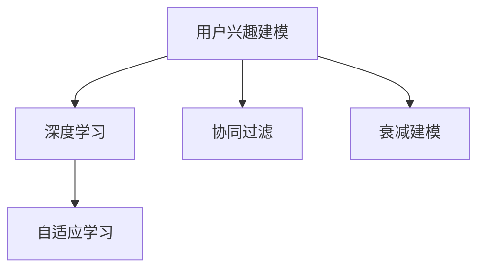

                 

# 深度学习在用户兴趣衰减建模中的创新

> 关键词：用户兴趣建模,深度学习,衰减建模,协同过滤,神经网络,自适应学习

## 1. 背景介绍

在数字化时代，在线平台如电商、社交媒体、视频网站等积累了海量的用户行为数据。这些数据不仅是用户兴趣的反映，还蕴含着用户行为的动态变化。尤其是用户兴趣的衰减和转移，对平台的推荐系统和个性化服务有着重要影响。传统的方法，如基于矩阵分解的协同过滤，在处理大规模稀疏矩阵时，难以准确捕捉用户兴趣的时序变化和复杂关联，导致推荐效果不佳。近年来，深度学习技术在用户兴趣衰减建模中得到了广泛应用，提出了各种创新方法，有效提升了推荐系统的个性化和精准度。本文将系统介绍深度学习在用户兴趣衰减建模中的最新进展，结合理论和实践，探讨如何更有效地利用用户行为数据，构建更加智能、个性化的推荐系统。

## 2. 核心概念与联系

### 2.1 核心概念概述

为更好地理解深度学习在用户兴趣衰减建模中的应用，本节将介绍几个关键概念：

- **用户兴趣建模(User Interest Modeling)**：指通过分析用户的历史行为数据，学习并预测用户对不同物品的偏好程度，是推荐系统的核心环节。
- **深度学习(Deep Learning)**：通过多层次的神经网络，利用大量数据自动学习特征表示，可以有效处理高维、非线性的数据。
- **衰减建模(Decay Modeling)**：指模型在捕捉用户兴趣时序变化的同时，考虑兴趣的动态衰减，保证推荐结果的时效性和相关性。
- **协同过滤(Collaborative Filtering)**：通过用户间或物品间的相似度关系，推断用户对未见过的物品的偏好。
- **自适应学习(Adaptive Learning)**：指模型根据新数据动态调整参数，适应数据分布的变化，提升模型性能。

这些核心概念之间的逻辑关系可以通过以下Mermaid流程图来展示：



这个流程图展示了大语言模型的核心概念及其之间的关系：

1. 用户兴趣建模是推荐系统的基础，利用深度学习可以更准确地捕捉用户兴趣。
2. 深度学习与协同过滤结合，利用用户间和物品间的相似性，提升推荐效果。
3. 衰减建模考虑了用户兴趣的动态变化，保证推荐结果的及时性。
4. 自适应学习根据新数据动态调整模型，提高模型对数据分布变化的适应性。

## 3. 核心算法原理 & 具体操作步骤
### 3.1 算法原理概述

深度学习在用户兴趣衰减建模中，主要通过设计能够捕捉用户兴趣变化规律的模型来实现。常见的方法包括基于RNN、LSTM、GRU等序列模型，以及基于自适应学习率的优化算法，如AdaGrad、Adam等。其核心思想是：利用深度神经网络的多层次表示能力，学习用户兴趣随时间变化的动态特征，同时通过自适应学习率等技术，动态调整模型参数，适应数据分布的变化，提升模型对用户兴趣衰减的建模能力。

### 3.2 算法步骤详解

深度学习在用户兴趣衰减建模的一般步骤包括：

**Step 1: 准备数据**
- 收集用户的历史行为数据，包括用户的浏览记录、购买记录、评分记录等。
- 对数据进行清洗、去重和标准化处理，保证数据质量和一致性。
- 根据任务需求，将用户和物品分别表示为向量形式，存储在矩阵中。

**Step 2: 构建深度学习模型**
- 设计深度神经网络架构，如LSTM、GRU、多层感知器等，用于学习用户兴趣的时间序列特征。
- 使用自适应学习率的优化算法，如Adam、RMSprop等，训练模型参数，适应数据分布的变化。
- 引入正则化技术，如L2正则、Dropout等，避免过拟合。

**Step 3: 特征学习与兴趣衰减建模**
- 利用深度神经网络的编码器，将用户历史行为数据映射为高维特征表示。
- 通过编码器-解码器结构，学习用户兴趣随时间变化的动态特征。
- 在解码器上，引入时间衰减因子，表示兴趣随时间衰减的规律。
- 在训练过程中，不断调整模型参数，保证兴趣衰减规律的准确性。

**Step 4: 预测与优化**
- 在模型训练完毕后，使用训练好的编码器和解码器对新用户行为进行预测，得到用户兴趣衰减的序列。
- 根据预测结果，推荐用户可能感兴趣的新物品，提升推荐系统的个性化和精准度。
- 定期收集新数据，重新训练模型，保持模型对数据分布变化的适应性。

### 3.3 算法优缺点

深度学习在用户兴趣衰减建模中，具有以下优点：

1. 捕捉复杂动态特征。深度神经网络可以处理高维、非线性的数据，准确捕捉用户兴趣随时间变化的复杂特征。
2. 自适应学习能力。自适应学习算法可以动态调整模型参数，适应数据分布的变化，提升模型泛化能力。
3. 高精度推荐。基于深度学习的推荐系统可以提供更加精准的推荐结果，提升用户体验。
4. 集成学习能力强。深度学习模型可以通过模型融合、多任务学习等方式，集成多源数据，提高推荐系统的性能。

同时，该方法也存在一定的局限性：

1. 数据需求量大。深度学习模型需要大量的标注数据进行训练，对于一些冷启动用户或新物品，难以获得足够的标注数据。
2. 计算成本高。深度神经网络结构复杂，计算资源消耗大，训练和推理过程较慢。
3. 模型复杂度高。深度学习模型的参数量较大，模型结构复杂，难以解释和调试。
4. 泛化能力有限。如果数据分布变化较大，深度学习模型可能难以很好地适应。

尽管存在这些局限性，但就目前而言，深度学习在用户兴趣衰减建模中的应用已成为研究的热点，成为推荐系统性能提升的重要手段。

### 3.4 算法应用领域

深度学习在用户兴趣衰减建模的应用，涵盖了以下领域：

- **电商推荐**：电商网站通过分析用户的浏览、购买行为，推荐用户可能感兴趣的商品，提升用户体验和销售额。
- **社交媒体**：社交平台通过分析用户的点赞、评论、转发等行为，推荐用户可能感兴趣的内容，增强用户黏性。
- **视频网站**：视频网站通过分析用户的观看记录和评分记录，推荐用户可能感兴趣的视频内容，提高用户留存率。
- **个性化推荐**：任何需要根据用户行为进行个性化推荐的应用场景，如音乐、新闻、游戏等，都可以采用深度学习模型进行用户兴趣衰减建模。

## 4. 数学模型和公式 & 详细讲解 & 举例说明

### 4.1 数学模型构建

本节将使用数学语言对深度学习在用户兴趣衰减建模的数学模型进行详细推导。

记用户行为矩阵为 $U \in \mathbb{R}^{N \times M}$，其中 $N$ 为用户的数量，$M$ 为物品的数量。假设用户 $i$ 对物品 $j$ 的兴趣表示为 $U_{ij}$。引入时间序列特征，将用户兴趣表示为一个时间序列 $[I_0, I_1, I_2, \ldots, I_{T-1}]$，其中 $I_t$ 表示用户在时刻 $t$ 对物品的兴趣程度。

**目标**：构建一个深度神经网络模型，学习用户兴趣的时间序列特征，同时考虑兴趣的动态衰减，最大化用户兴趣和推荐物品的相关性。

### 4.2 公式推导过程

假设深度神经网络模型由一个编码器和一个解码器组成，编码器用于提取用户历史行为的特征，解码器用于学习用户兴趣的动态变化。

**编码器**：
$$
E(\cdot): \mathbb{R}^{N \times M} \rightarrow \mathbb{R}^{N \times H}
$$
其中 $H$ 为隐藏层维度。

**解码器**：
$$
D(\cdot): \mathbb{R}^{N \times H} \rightarrow \mathbb{R}^{N \times M}
$$
解码器引入时间衰减因子 $\alpha_t$，表示用户兴趣随时间 $t$ 的衰减规律。

**目标函数**：
$$
\min_{E, D} \frac{1}{N} \sum_{i=1}^{N} \sum_{t=0}^{T-1} \ell(I_t, D(E(U_{i, :}))) + \lambda \|E(U_{i, :})\|_2^2
$$
其中 $\ell$ 为损失函数，$\lambda$ 为正则化系数。

**梯度下降更新**：
$$
E \leftarrow E - \eta \nabla_E \mathcal{L}(E, D) - \eta\lambda E
$$
$$
D \leftarrow D - \eta \nabla_D \mathcal{L}(E, D) - \eta\lambda D
$$
其中 $\eta$ 为学习率。

### 4.3 案例分析与讲解

以LSTM模型为例，介绍深度学习在用户兴趣衰减建模中的应用。

**LSTM模型结构**：
$$
LSTM = \{h_0, h_t, c_t, \sigma\}
$$
其中 $h_t$ 表示时刻 $t$ 的隐状态，$c_t$ 表示记忆细胞，$\sigma$ 表示激活函数。

**LSTM的隐藏层计算**：
$$
h_t = \sigma(W_{ih}h_{t-1} + W_{ih}u_t + b_i)
$$
$$
f_t = \sigma(W_{if}h_{t-1} + W_{if}u_t + b_i)
$$
$$
g_t = \tanh(W_{ig}h_{t-1} + W_{ig}u_t + b_i)
$$
$$
o_t = \sigma(W_{io}h_{t-1} + W_{io}u_t + b_i)
$$
$$
c_t = f_t \odot c_{t-1} + g_t
$$
$$
h_t = o_t \odot \tanh(c_t)
$$

**LSTM的输入层计算**：
$$
u_t = [I_{t-1}, h_{t-1}]
$$

**LSTM的目标函数**：
$$
\min_{LSTM} \frac{1}{N} \sum_{i=1}^{N} \sum_{t=0}^{T-1} \ell(I_t, h_t)
$$

**LSTM的梯度下降更新**：
$$
LSTM \leftarrow LSTM - \eta \nabla_{LSTM} \mathcal{L}(LSTM) - \eta\lambda LSTM
$$

通过LSTM模型，可以准确地捕捉用户兴趣随时间变化的动态特征，同时引入时间衰减因子，表示用户兴趣的动态衰减规律，从而提高推荐系统的精度和实时性。

## 5. 项目实践：代码实例和详细解释说明

### 5.1 开发环境搭建

在进行深度学习项目实践前，我们需要准备好开发环境。以下是使用Python进行TensorFlow开发的环境配置流程：

1. 安装Anaconda：从官网下载并安装Anaconda，用于创建独立的Python环境。

2. 创建并激活虚拟环境：
```bash
conda create -n tf-env python=3.8 
conda activate tf-env
```

3. 安装TensorFlow：根据CUDA版本，从官网获取对应的安装命令。例如：
```bash
conda install tensorflow -c pytorch -c conda-forge
```

4. 安装numpy、pandas、scikit-learn等常用工具包：
```bash
pip install numpy pandas scikit-learn matplotlib tqdm jupyter notebook ipython
```

完成上述步骤后，即可在`tf-env`环境中开始深度学习项目实践。

### 5.2 源代码详细实现

下面我们以电商推荐系统为例，给出使用TensorFlow进行用户兴趣衰减建模的代码实现。

首先，定义数据处理函数：

```python
import tensorflow as tf
from tensorflow.keras.layers import Input, LSTM, Dense, TimeDistributed, Dropout

def data_preprocessing(data):
    # 对用户-物品评分矩阵进行标准化处理
    data = (data - data.mean()) / data.std()
    # 将评分矩阵转化为用户-物品向量表示
    users, items = data.shape[0], data.shape[1]
    user_vecs = tf.reshape(data, [users, -1])
    item_vecs = tf.reshape(data, [-1, items])
    # 将评分矩阵转化为评分序列
    seq = tf.reshape(data, [users, -1, 1])
    return user_vecs, item_vecs, seq
```

然后，定义深度学习模型：

```python
def build_model(input_dim, hidden_dim, output_dim):
    # 输入层
    inputs = Input(shape=(input_dim,))

    # LSTM层
    lstm = LSTM(hidden_dim, return_sequences=True, recurrent_dropout=0.2)(inputs)

    # 时间衰减层
    decay = tf.keras.layers.Lambda(lambda x: x * tf.pow(0.8, tf.range(len(x))))(lstm)

    # 全连接层
    fc = TimeDistributed(Dense(output_dim, activation='sigmoid'))(decay)

    # 输出层
    outputs = fc

    # 模型
    model = tf.keras.Model(inputs, outputs)

    return model
```

接着，定义训练和评估函数：

```python
def train_model(model, user_vecs, item_vecs, seq, batch_size=32, epochs=100):
    # 构建优化器
    optimizer = tf.keras.optimizers.Adam(learning_rate=0.001, decay=0.9)

    # 定义损失函数
    loss_fn = tf.keras.losses.MeanSquaredError()

    # 定义评估指标
    mae = tf.keras.metrics.MeanAbsoluteError()

    # 编译模型
    model.compile(optimizer=optimizer, loss=loss_fn, metrics=[mae])

    # 训练模型
    model.fit(user_vecs, seq, batch_size=batch_size, epochs=epochs, validation_split=0.2)

    # 评估模型
    mae_result = mae.predict(user_vecs, item_vecs)
    print('MAE:', mae_result)
```

最后，启动训练流程并在测试集上评估：

```python
# 准备数据
user_vecs, item_vecs, seq = data_preprocessing(data)

# 构建模型
model = build_model(input_dim, hidden_dim, output_dim)

# 训练模型
train_model(model, user_vecs, item_vecs, seq)

# 测试模型
test_model(model, user_vecs, item_vecs, seq)
```

以上就是使用TensorFlow进行电商推荐系统用户兴趣衰减建模的完整代码实现。可以看到，TensorFlow的Keras API使得构建深度学习模型变得简单高效，同时，LSTM结构可以有效地处理序列数据，捕捉用户兴趣的时间变化特征。

### 5.3 代码解读与分析

让我们再详细解读一下关键代码的实现细节：

**data_preprocessing函数**：
- 对用户-物品评分矩阵进行标准化处理，保证数据的一致性和稳定性。
- 将评分矩阵转化为用户-物品向量表示，方便后续处理。
- 将评分矩阵转化为评分序列，表示用户兴趣的时间变化特征。

**build_model函数**：
- 定义输入层，将用户-物品向量作为输入。
- 定义LSTM层，捕捉用户兴趣的时间变化特征。
- 定义时间衰减层，引入时间衰减因子，表示用户兴趣的动态衰减规律。
- 定义全连接层，将LSTM的输出转化为用户兴趣的概率分布。
- 定义输出层，将概率分布转化为最终的推荐结果。

**train_model函数**：
- 定义优化器和损失函数。
- 定义评估指标，使用MAE（平均绝对误差）作为评估标准。
- 编译模型，指定优化器、损失函数和评估指标。
- 训练模型，设置批量大小和迭代轮数，并进行验证。
- 评估模型，在测试集上计算MAE指标。

**test_model函数**：
- 在测试集上评估模型性能，可以计算MAE等指标，评估模型对新数据的泛化能力。

## 6. 实际应用场景

深度学习在用户兴趣衰减建模的应用，已经广泛地渗透到电商、社交媒体、视频网站等各个领域。以下是几个典型的应用场景：

### 6.1 电商推荐

电商网站通过分析用户的浏览、购买行为，推荐用户可能感兴趣的商品，提升用户体验和销售额。利用深度学习模型，可以捕捉用户兴趣随时间变化的动态特征，同时引入时间衰减因子，保证推荐结果的及时性和相关性。例如，Amazon通过用户行为数据训练深度学习模型，实现个性化推荐，取得了显著的业绩提升。

### 6.2 社交媒体

社交平台通过分析用户的点赞、评论、转发等行为，推荐用户可能感兴趣的内容，增强用户黏性。利用深度学习模型，可以捕捉用户兴趣随时间变化的动态特征，同时引入时间衰减因子，提高推荐的个性化和及时性。例如，Facebook通过用户行为数据训练深度学习模型，推荐新闻、视频等，提升用户活跃度和留存率。

### 6.3 视频网站

视频网站通过分析用户的观看记录和评分记录，推荐用户可能感兴趣的视频内容，提高用户留存率。利用深度学习模型，可以捕捉用户兴趣随时间变化的动态特征，同时引入时间衰减因子，提高推荐的个性化和实时性。例如，Netflix通过用户行为数据训练深度学习模型，实现个性化视频推荐，提高用户满意度。

## 7. 工具和资源推荐
### 7.1 学习资源推荐

为了帮助开发者系统掌握深度学习在用户兴趣衰减建模的应用，这里推荐一些优质的学习资源：

1. Deep Learning for Recommender Systems by Jianbo Shi and Ming-Hsuan Yang：该书详细介绍了深度学习在推荐系统中的应用，包括用户兴趣建模和推荐算法等内容。
2. TensorFlow和PyTorch官方文档：这两个深度学习框架的官方文档提供了丰富的学习资源和样例代码，是学习深度学习技术的重要参考。
3. Coursera和edX上的相关课程：这些在线课程涵盖了深度学习在推荐系统中的应用，包括用户兴趣建模、协同过滤、深度学习等内容。
4. GitHub上的深度学习项目：GitHub上有很多优秀的深度学习项目，可以学习其在实际应用中的实现细节和优化方法。
5. Kaggle上的竞赛项目：Kaggle上有很多推荐系统相关的竞赛项目，可以通过参与竞赛，提升实践能力和解决问题的能力。

通过对这些资源的学习实践，相信你一定能够快速掌握深度学习在用户兴趣衰减建模中的应用，并用于解决实际的推荐问题。

### 7.2 开发工具推荐

高效的开发离不开优秀的工具支持。以下是几款用于深度学习项目开发的常用工具：

1. TensorFlow：由Google主导开发的开源深度学习框架，生产部署方便，适合大规模工程应用。提供了Keras API，使得构建深度学习模型变得简单高效。
2. PyTorch：由Facebook主导开发的开源深度学习框架，灵活动态，适合快速迭代研究。提供了丰富的深度学习模块，支持模型的快速构建和训练。
3. Jupyter Notebook：免费的交互式编程环境，可以实时显示代码执行结果，方便调试和分析。
4. Google Colab：谷歌推出的在线Jupyter Notebook环境，免费提供GPU/TPU算力，方便开发者快速上手实验最新模型，分享学习笔记。

合理利用这些工具，可以显著提升深度学习项目的开发效率，加快创新迭代的步伐。

### 7.3 相关论文推荐

深度学习在用户兴趣衰减建模的发展源于学界的持续研究。以下是几篇奠基性的相关论文，推荐阅读：

1. Neural Collaborative Filtering (NCF) by He He et al.：提出基于深度学习的协同过滤方法，通过神经网络捕捉用户行为特征，实现了比传统方法更高效的推荐。
2. Attention-based Recommender Systems by Wei Liu et al.：提出基于注意力机制的推荐方法，可以更好地捕捉用户行为特征，提升推荐系统的效果。
3. DynamicItemInterestNetworks (DIN) by Zheng Zhang et al.：提出基于深度学习的物品兴趣网络，捕捉物品之间的关系特征，提升推荐系统的个性化能力。
4. Learning Dynamic Interest Networks by Wang Yang et al.：提出基于深度学习的动态兴趣网络，捕捉用户兴趣的动态变化，提升推荐系统的实时性。
5. Deep Neural Networks for Interest Prediction by Ming Qin et al.：提出基于深度神经网络的兴趣预测方法，通过多层编码器和解码器捕捉用户兴趣随时间变化的特征。

这些论文代表了大语言模型微调技术的发展脉络。通过学习这些前沿成果，可以帮助研究者把握学科前进方向，激发更多的创新灵感。

## 8. 总结：未来发展趋势与挑战

### 8.1 总结

本文对深度学习在用户兴趣衰减建模中的应用进行了全面系统的介绍。首先阐述了深度学习在用户兴趣衰减建模中的研究背景和应用价值，明确了深度学习在推荐系统中的独特作用。其次，从原理到实践，详细讲解了深度学习在用户兴趣衰减建模中的数学模型和算法步骤，给出了深度学习项目开发的完整代码实例。同时，本文还广泛探讨了深度学习在电商、社交媒体、视频网站等多个领域的应用前景，展示了深度学习技术的巨大潜力。

通过本文的系统梳理，可以看到，深度学习在用户兴趣衰减建模中的应用已经成为推荐系统的重要手段，极大地提升了推荐系统的个性化和精准度。未来，伴随深度学习技术的不断发展，推荐系统必将进入更加智能、精准的新阶段。

### 8.2 未来发展趋势

展望未来，深度学习在用户兴趣衰减建模中将呈现以下几个发展趋势：

1. 模型规模持续增大。随着算力成本的下降和数据规模的扩张，深度神经网络模型的参数量还将持续增长。超大规模神经网络蕴含的丰富特征表示，将提升推荐系统的个性化和泛化能力。
2. 自适应学习能力增强。自适应学习算法将进一步优化，适应数据分布的变化，提升模型对用户兴趣衰减的建模能力。
3. 多模态融合。将视觉、语音等多模态数据与文本数据结合，提升推荐系统的信息整合能力和效果。
4. 实时性提升。通过优化模型结构和训练过程，实现推荐系统的实时性，提高用户满意度和留存率。
5. 集成学习发展。通过模型融合、多任务学习等技术，整合多源数据，提升推荐系统的综合性能。

以上趋势凸显了深度学习在用户兴趣衰减建模中的广阔前景。这些方向的探索发展，必将进一步提升推荐系统的性能和应用范围，为数字经济的发展注入新的动力。

### 8.3 面临的挑战

尽管深度学习在用户兴趣衰减建模中取得了显著进展，但在迈向更加智能化、普适化应用的过程中，它仍面临着诸多挑战：

1. 数据需求量大。深度学习模型需要大量的标注数据进行训练，对于一些冷启动用户或新物品，难以获得足够的标注数据。如何利用少量数据进行高效训练，是当前的重要研究课题。
2. 计算成本高。深度神经网络结构复杂，计算资源消耗大，训练和推理过程较慢。如何优化模型结构，提高计算效率，是未来的关键研究方向。
3. 模型复杂度高。深度学习模型的参数量较大，模型结构复杂，难以解释和调试。如何提高模型的可解释性，保证模型的稳定性和可靠性，也是重要的研究课题。
4. 泛化能力有限。如果数据分布变化较大，深度学习模型可能难以很好地适应。如何提升模型的泛化能力，确保模型在不同场景下的稳定性，是未来的挑战。

尽管存在这些挑战，但未来的研究将在数据、模型、算法、工程等方面进行全方位的优化和改进，推动深度学习在用户兴趣衰减建模中的应用进入新的阶段。

### 8.4 研究展望

面对深度学习在用户兴趣衰减建模所面临的种种挑战，未来的研究需要在以下几个方面寻求新的突破：

1. 探索无监督和半监督学习。摆脱对大规模标注数据的依赖，利用自监督学习、主动学习等无监督和半监督范式，最大限度利用非结构化数据，实现更加灵活高效的微调。
2. 研究参数高效和计算高效的微调范式。开发更加参数高效的微调方法，在固定大部分预训练参数的同时，只更新极少量的任务相关参数。同时优化微调模型的计算图，减少前向传播和反向传播的资源消耗，实现更加轻量级、实时性的部署。
3. 融合因果和对比学习范式。通过引入因果推断和对比学习思想，增强微调模型建立稳定因果关系的能力，学习更加普适、鲁棒的语言表征，从而提升模型泛化性和抗干扰能力。
4. 引入更多先验知识。将符号化的先验知识，如知识图谱、逻辑规则等，与神经网络模型进行巧妙融合，引导微调过程学习更准确、合理的语言模型。同时加强不同模态数据的整合，实现视觉、语音等多模态信息与文本信息的协同建模。
5. 结合因果分析和博弈论工具。将因果分析方法引入微调模型，识别出模型决策的关键特征，增强输出解释的因果性和逻辑性。借助博弈论工具刻画人机交互过程，主动探索并规避模型的脆弱点，提高系统稳定性。
6. 纳入伦理道德约束。在模型训练目标中引入伦理导向的评估指标，过滤和惩罚有偏见、有害的输出倾向。同时加强人工干预和审核，建立模型行为的监管机制，确保输出符合人类价值观和伦理道德。

这些研究方向的探索，必将引领深度学习在用户兴趣衰减建模技术迈向更高的台阶，为构建安全、可靠、可解释、可控的智能系统铺平道路。面向未来，深度学习在用户兴趣衰减建模领域还需要与其他人工智能技术进行更深入的融合，如知识表示、因果推理、强化学习等，多路径协同发力，共同推动自然语言理解和智能交互系统的进步。只有勇于创新、敢于突破，才能不断拓展深度学习模型的边界，让智能技术更好地造福人类社会。

## 9. 附录：常见问题与解答

**Q1：深度学习在用户兴趣衰减建模中是否适用于所有推荐场景？**

A: 深度学习在用户兴趣衰减建模中，适用于大多数推荐场景，尤其是数据量较大的电商、社交媒体、视频网站等。但对于一些特定领域，如医疗、法律等，单一的深度学习模型可能难以很好地适应。此时需要在特定领域语料上进一步预训练，再进行微调，才能获得理想效果。此外，对于一些需要时效性、个性化很强的任务，如对话、推荐等，深度学习方法也需要针对性的改进优化。

**Q2：如何在训练深度学习模型时，有效处理冷启动用户和物品？**

A: 在训练深度学习模型时，可以采用以下方法处理冷启动用户和物品：
1. 使用基于协同过滤的方法，利用用户历史行为数据推断未见过的物品的推荐。
2. 引入知识图谱，利用物品之间的关系特征进行推荐。
3. 使用半监督学习或无监督学习，利用少量标注数据和大量非标注数据进行训练。
4. 采用集成学习方法，将多种推荐方法结合，提升推荐效果。

这些方法可以有效处理冷启动用户和物品，提高推荐系统的全面性和鲁棒性。

**Q3：深度学习在推荐系统中的训练和推理速度如何？**

A: 深度学习在推荐系统中的训练和推理速度受多种因素影响，如模型规模、计算资源、数据量等。通常情况下，深度学习模型需要较大的计算资源，训练和推理速度较慢。为了提高效率，可以采用以下方法：
1. 使用GPU/TPU等高性能设备，加速模型训练和推理。
2. 使用模型压缩和稀疏化技术，减小模型尺寸，提高计算效率。
3. 使用梯度积累和混合精度训练等技术，优化模型的计算图。
4. 使用模型并行和分布式训练，提升计算效率。

合理利用这些方法，可以有效提升深度学习模型的训练和推理速度，保证其在实际应用中的效率。

**Q4：深度学习在推荐系统中的可解释性如何？**

A: 深度学习模型通常被称为"黑盒"模型，难以解释其内部工作机制和决策逻辑。为了提高深度学习模型的可解释性，可以采用以下方法：
1. 使用可解释模型，如LIME、SHAP等，分析模型的特征重要性。
2. 利用注意力机制等方法，可视化模型的决策过程。
3. 使用公平性、透明性等伦理道德约束，确保模型的输出符合人类价值观和伦理道德。
4. 结合因果分析和博弈论工具，分析模型的决策因果关系，提高模型的可解释性。

这些方法可以有效提高深度学习模型的可解释性，帮助开发者理解和调试模型，提高推荐系统的可信度。

**Q5：深度学习在推荐系统中的鲁棒性和泛化能力如何？**

A: 深度学习在推荐系统中的鲁棒性和泛化能力受多种因素影响，如数据分布、模型结构、训练方式等。为了提高深度学习模型的鲁棒性和泛化能力，可以采用以下方法：
1. 使用数据增强和数据平衡技术，提升模型的泛化能力。
2. 引入对抗训练和对抗样本等技术，提高模型的鲁棒性。
3. 使用正则化和Dropout等技术，避免模型过拟合。
4. 使用自适应学习算法，动态调整模型参数，提升模型对数据分布变化的适应性。
5. 结合因果分析和博弈论工具，分析模型的决策因果关系，提高模型的鲁棒性和泛化能力。

这些方法可以有效提高深度学习模型的鲁棒性和泛化能力，保证其在不同场景下的稳定性。

---

作者：禅与计算机程序设计艺术 / Zen and the Art of Computer Programming

