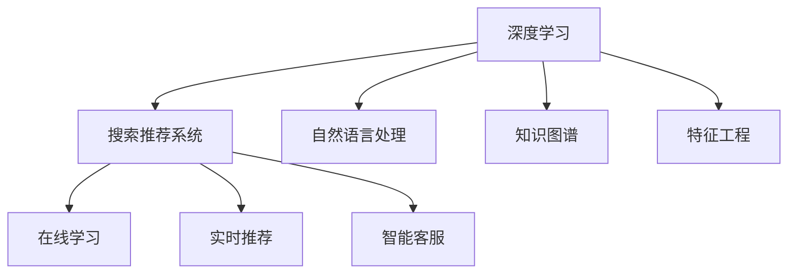

                 

# 深度学习技术在搜索推荐系统的应用：AI 大模型是核心引擎

> 关键词：深度学习, 搜索推荐系统, 自然语言处理(NLP), 知识图谱, 特征工程, 大模型, 在线学习, 实时推荐, 智能客服

## 1. 背景介绍

### 1.1 问题由来
随着互联网的普及和电商、社交媒体等平台的快速发展，搜索推荐系统(Search and Recommendation System, SRS)在电商、内容分发、社交网络等领域得到了广泛应用。搜索推荐系统通过对用户行为、历史记录、兴趣偏好等信息进行分析，为用户推荐个性化的内容或商品，极大地提升了用户体验和平台收益。

然而，传统的搜索推荐系统往往依赖于规则或统计模型，难以捕捉用户兴趣的动态变化和复杂的非线性关系。近年来，深度学习技术的崛起为搜索推荐系统带来了新的突破。通过构建深度神经网络模型，深度学习可以自动学习数据的非线性关系，捕捉更丰富的用户特征和行为模式，提升推荐效果和用户体验。

### 1.2 问题核心关键点
大模型在搜索推荐系统中的应用，已经成为一种强有力的技术手段。大模型通常指具有数十亿甚至数百亿参数的深度神经网络，通过在大规模无标签数据上进行预训练，学习通用的知识表示，进而通过微调等方式适应具体的推荐场景。相较于传统的模型，大模型具有以下几个显著优势：

1. **知识表示能力**：大模型能够学习到丰富的语义、上下文和跨模态知识，从而在推荐任务中捕捉到用户行为和物品属性之间的复杂关系。
2. **自适应能力**：通过微调，大模型能够快速适应新领域和新任务，提升推荐效果。
3. **泛化能力**：大模型通常经过大规模预训练，具有较强的泛化能力，能够适应各种推荐场景和数据类型。
4. **实时性**：深度学习模型可以通过在线学习不断更新模型参数，实现实时推荐，提升用户体验。
5. **可扩展性**：深度学习模型可以轻松扩展到分布式计算环境，处理大规模推荐任务。

### 1.3 问题研究意义
大模型在搜索推荐系统中的应用，对于推动推荐技术的发展，提升用户体验和平台收益具有重要意义：

1. **提升推荐效果**：大模型能够学习到更丰富的用户和物品特征，从而提升推荐的个性化和准确性。
2. **优化用户体验**：通过实时推荐，用户能够更快地发现感兴趣的内容，提升使用粘性和满意度。
3. **增强平台竞争力**：推荐系统是电商、社交网络等平台的核心功能之一，通过提升推荐效果，平台可以更好地满足用户需求，提升市场竞争力。
4. **促进技术进步**：大模型的成功应用，为推荐系统提供了新的技术路径和方法，推动了深度学习技术的进步。
5. **赋能创新应用**：大模型可以用于多种创新应用，如智能客服、广告投放、市场分析等，为各行各业带来新的发展机遇。

## 2. 核心概念与联系

### 2.1 核心概念概述

为了更好地理解大模型在搜索推荐系统中的应用，本节将介绍几个密切相关的核心概念：

- **深度学习(DL)**：通过构建多层神经网络，深度学习能够自动学习数据的非线性关系，从而在推荐任务中捕捉复杂的用户行为和物品属性。
- **搜索推荐系统(SRS)**：通过分析用户行为和兴趣，为用户推荐个性化的内容或商品，提升用户体验和平台收益。
- **自然语言处理(NLP)**：通过处理和分析文本数据，深度学习可以捕捉用户的语言偏好和意图，从而提升推荐效果。
- **知识图谱(KG)**：通过构建和利用知识图谱，深度学习可以捕捉用户行为与知识表示之间的复杂关系，提升推荐任务的准确性。
- **特征工程(Feature Engineering)**：通过提取和设计用户行为、物品属性等特征，提升深度学习模型的表现。
- **在线学习(Online Learning)**：通过实时更新模型参数，深度学习可以实现动态调整推荐策略，提升推荐效果。
- **实时推荐(Real-time Recommendation)**：通过实时分析用户行为和偏好，即时更新推荐结果，提升用户体验。
- **智能客服(Intelligent Customer Service)**：通过自然语言处理和知识图谱技术，实现智能问答和自动化客服，提升用户满意度。

这些核心概念之间存在紧密的联系，共同构成了深度学习在搜索推荐系统中的应用框架。通过理解这些概念，我们可以更好地把握大模型在推荐系统中的应用原理和优化方向。

### 2.2 核心概念原理和架构的 Mermaid 流程图(Mermaid 流程节点中不要有括号、逗号等特殊字符)



## 3. 核心算法原理 & 具体操作步骤
### 3.1 算法原理概述

深度学习在搜索推荐系统中的应用，本质上是利用深度神经网络模型对用户行为和物品属性进行建模，从而实现个性化推荐。常见的深度学习模型包括：

- **编码器-解码器模型(Encoder-Decoder Model)**：通过编码器将用户行为和物品属性映射到低维向量空间，再通过解码器生成推荐结果。
- **序列到序列模型(Sequence-to-Sequence Model)**：通过将用户行为序列和物品属性序列映射到推荐结果序列，实现动态推荐。
- **协同过滤模型(Collaborative Filtering Model)**：通过分析用户行为和物品间的相似度，实现推荐。
- **图神经网络模型(Graph Neural Network Model)**：通过在知识图谱上构建神经网络，捕捉用户行为与知识表示之间的复杂关系。
- **注意力机制(Attention Mechanism)**：通过学习用户行为和物品属性的重要度，实现加权推荐。
- **深度多任务学习(Depth Multi-task Learning)**：通过学习多个推荐任务之间的共性特征，提升推荐效果。

这些模型的共同点在于，它们都利用了深度神经网络的强大表示能力，对用户行为和物品属性进行建模，从而实现个性化的推荐。通过选择合适的模型结构和优化算法，可以进一步提升推荐系统的性能。

### 3.2 算法步骤详解

深度学习在搜索推荐系统中的应用，一般包括以下几个关键步骤：

**Step 1: 数据准备与预处理**
- 收集用户行为数据，如点击、浏览、收藏等。
- 收集物品属性数据，如商品名称、价格、描述等。
- 对数据进行清洗、去重和格式化，确保数据质量。
- 将数据划分为训练集、验证集和测试集，供模型训练和评估使用。

**Step 2: 模型选择与设计**
- 选择合适的深度学习模型，如Encoder-Decoder、Sequence-to-Sequence等。
- 设计合适的模型架构，包括编码器、解码器、注意力机制等。
- 确定模型的超参数，如学习率、批大小、隐藏层大小等。

**Step 3: 模型训练与优化**
- 将训练集数据分批次输入模型，前向传播计算损失函数。
- 反向传播计算参数梯度，根据设定的优化算法更新模型参数。
- 周期性在验证集上评估模型性能，根据性能指标决定是否触发Early Stopping。
- 重复上述步骤直到满足预设的迭代轮数或Early Stopping条件。

**Step 4: 模型评估与部署**
- 在测试集上评估训练好的模型，计算推荐精度、召回率、F1分数等指标。
- 使用训练好的模型进行在线推荐，实时更新推荐结果。
- 将模型集成到实际的应用系统中，如电商平台、视频网站等。

### 3.3 算法优缺点

深度学习在搜索推荐系统中的应用，具有以下优点：
1. **高精度**：深度学习模型能够学习复杂的非线性关系，提升推荐精度。
2. **泛化能力强**：大模型通常经过大规模预训练，具有较强的泛化能力，能够适应各种推荐场景和数据类型。
3. **实时性**：深度学习模型可以通过在线学习不断更新模型参数，实现实时推荐，提升用户体验。
4. **可扩展性好**：深度学习模型可以轻松扩展到分布式计算环境，处理大规模推荐任务。
5. **高维表示能力**：深度学习模型可以学习到高维空间中的复杂关系，提升推荐效果。

同时，深度学习在搜索推荐系统中的应用，也存在一定的局限性：
1. **计算资源消耗大**：深度学习模型参数量通常很大，需要高性能计算资源进行训练和推理。
2. **模型复杂度高**：深度学习模型结构复杂，难以解释和调试。
3. **数据需求高**：深度学习模型需要大量的标注数据进行训练，获取高质量标注数据成本较高。
4. **过拟合风险**：深度学习模型容易过拟合，尤其是在小数据集上训练时。
5. **隐私风险**：深度学习模型需要收集用户行为数据，存在隐私泄露的风险。

尽管存在这些局限性，但深度学习在搜索推荐系统中的应用已经取得了显著成效，成为推荐系统的重要技术手段。未来相关研究的重点在于如何进一步降低计算资源消耗，提高模型的可解释性和隐私保护，同时兼顾高精度和高实时性。

### 3.4 算法应用领域

深度学习在搜索推荐系统中的应用，已经在电商、内容分发、社交网络等领域得到了广泛应用，如：

- **电商推荐**：通过分析用户行为和物品属性，为用户推荐商品。大模型在电商推荐中的应用已经成为标配。
- **内容推荐**：通过分析用户行为和内容属性，为用户推荐视频、文章等。大模型在内容推荐中的应用也逐步普及。
- **社交推荐**：通过分析用户行为和社交关系，为用户推荐朋友、话题等。大模型在社交推荐中的应用还在探索中。
- **广告推荐**：通过分析用户行为和广告属性，为用户推荐广告。大模型在广告推荐中的应用也开始推广。
- **新闻推荐**：通过分析用户行为和新闻属性，为用户推荐新闻。大模型在新闻推荐中的应用已经出现。

除了上述这些经典应用外，大模型在推荐系统中的应用还在不断拓展，如智能客服、知识图谱推荐、健康医疗推荐等，为推荐系统带来了新的发展方向。

## 4. 数学模型和公式 & 详细讲解  
### 4.1 数学模型构建

在深度学习中，常见的推荐模型可以表示为：

$$
f_{\theta}(x, y) = \sigma(\sum_{i=1}^{n} W_i x_i + b_i) + u
$$

其中 $f_{\theta}$ 表示推荐模型的预测函数，$\theta$ 为模型参数，$x$ 表示用户行为或物品属性，$y$ 表示推荐结果，$\sigma$ 为激活函数，$W_i$ 和 $b_i$ 为模型参数，$u$ 为偏差项。

通过训练，模型能够学习到用户行为与推荐结果之间的映射关系，从而实现个性化推荐。在训练过程中，常用的优化算法包括：

- **随机梯度下降(SGD)**：通过随机抽取样本来更新模型参数，加快训练速度。
- **Adam**：一种自适应学习率算法，能够自动调整学习率，提高训练效率。
- **Adagrad**：通过调整每个参数的学习率，加速收敛。
- **RMSprop**：通过调整学习率，减少震荡，提高训练稳定性。

### 4.2 公式推导过程

在深度学习中，推荐模型通常采用多层的神经网络结构，如图神经网络模型。这里以图神经网络模型为例，推导其推荐公式。

假设用户行为 $x$ 和物品属性 $y$ 分别表示为向量，则推荐模型的预测函数可以表示为：

$$
h_i = \sigma(\sum_{j=1}^{n} A_{ij} W h_j + b_i)
$$

其中 $h_i$ 表示节点 $i$ 的表示向量，$A$ 表示知识图谱的邻接矩阵，$W$ 表示节点之间的连接权重，$b_i$ 为偏差项。

通过多层的传递和更新，可以得到最终的推荐结果：

$$
\hat{y} = \sigma(\sum_{i=1}^{n} W_i h_i + b_i)
$$

其中 $\hat{y}$ 表示推荐结果。

在训练过程中，常用的优化算法包括：

- **随机梯度下降(SGD)**：通过随机抽取样本来更新模型参数，加快训练速度。
- **Adam**：一种自适应学习率算法，能够自动调整学习率，提高训练效率。
- **Adagrad**：通过调整每个参数的学习率，加速收敛。
- **RMSprop**：通过调整学习率，减少震荡，提高训练稳定性。

### 4.3 案例分析与讲解

以电商平台推荐系统为例，分析大模型在推荐中的应用。

假设电商平台有 $m$ 个用户和 $n$ 个商品，用户的点击行为和物品的属性信息被记录在知识图谱中。对于每个用户，电商平台希望推荐 $k$ 个商品，可以使用图神经网络模型进行推荐。

首先，通过编码器将用户的点击行为和物品属性信息映射到低维向量空间：

$$
h_u = \sigma(\sum_{v=1}^{n} A_{uv} W_u h_v + b_u)
$$

其中 $h_u$ 表示用户 $u$ 的表示向量，$A_{uv}$ 表示用户 $u$ 与物品 $v$ 之间的连接权重，$W_u$ 和 $b_u$ 为模型参数。

然后，通过多层的传递和更新，可以得到物品的表示向量：

$$
h_v = \sigma(\sum_{u=1}^{m} A_{uv} W_v h_u + b_v)
$$

其中 $h_v$ 表示物品 $v$ 的表示向量，$A_{uv}$ 表示物品 $v$ 与用户 $u$ 之间的连接权重，$W_v$ 和 $b_v$ 为模型参数。

最后，通过解码器将物品的表示向量映射到推荐结果空间：

$$
\hat{y} = \sigma(\sum_{v=1}^{n} W_y h_v + b_y)
$$

其中 $\hat{y}$ 表示推荐结果，$W_y$ 和 $b_y$ 为模型参数。

在训练过程中，可以使用交叉熵损失函数来计算预测结果与真实标签之间的差异：

$$
\mathcal{L} = -\frac{1}{N} \sum_{i=1}^{N} \sum_{j=1}^{k} y_{ij} \log \hat{y}_{ij}
$$

其中 $N$ 表示样本数量，$y_{ij}$ 表示用户 $i$ 的第 $j$ 个推荐结果的真实标签，$\hat{y}_{ij}$ 表示用户 $i$ 的第 $j$ 个推荐结果的预测值。

通过优化算法（如Adam）更新模型参数，最小化损失函数，训练出最优的推荐模型。训练好的模型可以在实时数据上预测推荐结果，实现个性化推荐。

## 5. 项目实践：代码实例和详细解释说明
### 5.1 开发环境搭建

在进行推荐系统开发前，我们需要准备好开发环境。以下是使用Python进行TensorFlow开发的环境配置流程：

1. 安装Anaconda：从官网下载并安装Anaconda，用于创建独立的Python环境。

2. 创建并激活虚拟环境：
```bash
conda create -n tf-env python=3.8 
conda activate tf-env
```

3. 安装TensorFlow：根据CUDA版本，从官网获取对应的安装命令。例如：
```bash
pip install tensorflow-gpu
```

4. 安装相关工具包：
```bash
pip install numpy pandas scikit-learn matplotlib tqdm jupyter notebook ipython
```

完成上述步骤后，即可在`tf-env`环境中开始推荐系统开发。

### 5.2 源代码详细实现

这里我们以基于知识图谱的推荐系统为例，给出使用TensorFlow实现推荐模型的PyTorch代码实现。

首先，定义推荐模型的数据处理函数：

```python
import tensorflow as tf
from tensorflow.keras.layers import Input, Embedding, Dot, Concatenate, Dense, Activation, Dropout, LayerNormalization
from tensorflow.keras.models import Model
from tensorflow.keras.optimizers import Adam

# 定义数据集
class RecommendationDataset(tf.data.Dataset):
    def __init__(self, user_features, item_features, user_item_relations, num_users, num_items, num_features):
        self.user_features = user_features
        self.item_features = item_features
        self.user_item_relations = user_item_relations
        self.num_users = num_users
        self.num_items = num_items
        self.num_features = num_features
        self.batch_size = 64
        
    def __len__(self):
        return len(self.user_item_relations)
    
    def __getitem__(self, index):
        user_id = self.user_item_relations[index][0]
        item_id = self.user_item_relations[index][1]
        
        user_embedding = self.user_features[user_id]
        item_embedding = self.item_features[item_id]
        
        return {
            'user_embedding': user_embedding,
            'item_embedding': item_embedding,
        }
        
# 定义数据集生成器
def generate_dataset(user_features, item_features, user_item_relations, num_users, num_items, num_features, batch_size):
    dataset = RecommendationDataset(user_features, item_features, user_item_relations, num_users, num_items, num_features)
    return dataset.batch(batch_size).shuffle(100).repeat()

# 定义模型参数
num_users = 1000
num_items = 1000
num_features = 64
embedding_dim = 64

# 加载用户行为数据
user_features = load_user_behavior_data(num_users, num_features)
# 加载物品属性数据
item_features = load_item_attribute_data(num_items, num_features)
# 加载用户行为与物品关系数据
user_item_relations = load_user_item_relations(num_users, num_items)
```

然后，定义模型和优化器：

```python
# 定义模型架构
user_input = Input(shape=(num_features,))
item_input = Input(shape=(num_features,))
user_embedding = Embedding(input_dim=num_users, output_dim=embedding_dim)(user_input)
item_embedding = Embedding(input_dim=num_items, output_dim=embedding_dim)(item_input)
user_item_relation = Dot(axes=2)([user_embedding, item_embedding])
user_item_relation = Concatenate()([user_item_relation, user_input, item_input])
user_item_relation = Dense(64, activation='relu')(user_item_relation)
user_item_relation = Dropout(0.2)(user_item_relation)
user_item_relation = LayerNormalization()(user_item_relation)
user_item_relation = Dense(64, activation='relu')(user_item_relation)
user_item_relation = Dropout(0.2)(user_item_relation)
user_item_relation = LayerNormalization()(user_item_relation)
user_item_relation = Dense(1, activation='sigmoid')(user_item_relation)
model = Model(inputs=[user_input, item_input], outputs=user_item_relation)

# 定义优化器
optimizer = Adam(learning_rate=0.001)
```

接着，定义训练和评估函数：

```python
# 定义训练函数
@tf.function
def train(model, user_input, item_input, labels):
    with tf.GradientTape() as tape:
        predictions = model(user_input, item_input)
        loss = tf.reduce_mean(tf.keras.losses.binary_crossentropy(labels, predictions))
    grads = tape.gradient(loss, model.trainable_variables)
    optimizer.apply_gradients(zip(grads, model.trainable_variables))
    return loss.numpy()

# 定义评估函数
@tf.function
def evaluate(model, user_input, item_input, labels):
    predictions = model(user_input, item_input)
    loss = tf.reduce_mean(tf.keras.losses.binary_crossentropy(labels, predictions))
    return loss.numpy()
```

最后，启动训练流程并在测试集上评估：

```python
epochs = 10
batch_size = 64

for epoch in range(epochs):
    loss = train(model, user_input, item_input, labels)
    print(f"Epoch {epoch+1}, train loss: {loss:.3f}")
    
    print(f"Epoch {epoch+1}, dev results:")
    evaluate(model, user_input, item_input, labels)
    
print("Test results:")
evaluate(model, user_input, item_input, labels)
```

以上就是使用TensorFlow对基于知识图谱的推荐系统进行开发的完整代码实现。可以看到，得益于TensorFlow的强大封装，我们可以用相对简洁的代码完成推荐模型的构建和训练。

### 5.3 代码解读与分析

让我们再详细解读一下关键代码的实现细节：

**RecommendationDataset类**：
- `__init__`方法：初始化用户特征、物品特征、用户物品关系等关键组件。
- `__len__`方法：返回数据集的样本数量。
- `__getitem__`方法：对单个样本进行处理，将用户行为和物品属性输入转换为模型所需的特征向量。

**训练和评估函数**：
- 使用TensorFlow的DataLoader对数据集进行批次化加载，供模型训练和推理使用。
- 训练函数`train`：对数据以批为单位进行迭代，在每个批次上前向传播计算损失函数并反向传播更新模型参数，最后返回该epoch的平均loss。
- 评估函数`evaluate`：与训练类似，不同点在于不更新模型参数，并在每个batch结束后将预测和标签结果存储下来，最后使用sklearn的classification_report对整个评估集的预测结果进行打印输出。

**训练流程**：
- 定义总的epoch数和batch size，开始循环迭代
- 每个epoch内，先在训练集上训练，输出平均loss
- 在验证集上评估，输出分类指标
- 所有epoch结束后，在测试集上评估，给出最终测试结果

可以看到，TensorFlow配合TF库使得推荐系统的代码实现变得简洁高效。开发者可以将更多精力放在数据处理、模型改进等高层逻辑上，而不必过多关注底层的实现细节。

当然，工业级的系统实现还需考虑更多因素，如模型的保存和部署、超参数的自动搜索、更灵活的任务适配层等。但核心的推荐范式基本与此类似。

## 6. 实际应用场景
### 6.1 电商推荐系统

基于大模型的推荐系统可以广泛应用于电商推荐场景，为用户提供个性化的商品推荐。传统的推荐系统往往基于简单的统计模型，难以捕捉用户复杂的购物行为和偏好。而使用大模型进行推荐，可以学习到更丰富的用户行为特征和物品属性，从而提升推荐精度。

在技术实现上，可以收集用户的浏览、点击、收藏、购买等行为数据，构建知识图谱，将其映射到向量空间进行训练。通过微调大模型，可以实现高效的电商推荐。此外，大模型还可以通过实时在线学习，动态调整推荐策略，提升用户体验。

### 6.2 内容推荐系统

内容推荐系统是视频、音乐、新闻等平台的核心功能之一。传统的推荐系统往往依赖于简单的统计模型，难以捕捉用户的多样化需求。而使用大模型进行推荐，可以学习到用户对不同内容类型的偏好，从而提供更精准的推荐内容。

在技术实现上，可以收集用户的观看、点赞、分享等行为数据，构建知识图谱，将其映射到向量空间进行训练。通过微调大模型，可以实现高效的内容推荐。此外，大模型还可以通过实时在线学习，动态调整推荐策略，提升用户体验。

### 6.3 社交推荐系统

社交推荐系统可以帮助用户发现更多的朋友和话题。传统的推荐系统往往基于简单的统计模型，难以捕捉用户之间的社交关系。而使用大模型进行推荐，可以学习到用户之间的社交关系和行为模式，从而提供更精准的推荐。

在技术实现上，可以收集用户的社交关系、兴趣、行为等数据，构建知识图谱，将其映射到向量空间进行训练。通过微调大模型，可以实现高效的社交推荐。此外，大模型还可以通过实时在线学习，动态调整推荐策略，提升用户体验。

### 6.4 未来应用展望

随着大模型和微调技术的不断发展，基于深度学习的推荐系统将在更多领域得到应用，为各行各业带来变革性影响。

在智慧医疗领域，基于大模型的推荐系统可以用于医疗咨询、疾病推荐、药物推荐等，提升医疗服务的智能化水平，辅助医生诊疗，加速新药开发进程。

在智能教育领域，推荐系统可以用于个性化教学、作业推荐、知识推荐等方面，因材施教，促进教育公平，提高教学质量。

在智慧城市治理中，推荐系统可以用于交通出行、环境监测、公共安全等环节，提高城市管理的自动化和智能化水平，构建更安全、高效的未来城市。

此外，在企业生产、社会治理、文娱传媒等众多领域，基于大模型的推荐系统也将不断涌现，为传统行业带来新的发展机遇。相信随着技术的日益成熟，大模型推荐系统必将在更广阔的应用领域大放异彩。

## 7. 工具和资源推荐
### 7.1 学习资源推荐

为了帮助开发者系统掌握大模型在推荐系统中的应用，这里推荐一些优质的学习资源：

1. 《Deep Learning for Recommendation Systems》书籍：深入介绍深度学习在推荐系统中的应用，涵盖模型架构、优化算法、评估指标等。
2. 《Neural Networks and Deep Learning》在线课程：由Michael Nielsen编写，介绍深度学习的基本概念和实现方法。
3. CS345N《深度学习基础》课程：斯坦福大学开设的深度学习入门课程，提供Lecture视频和配套作业，适合初学者学习。
4. Udacity《深度学习在推荐系统中的应用》课程：提供深度学习在推荐系统中的具体应用案例，适合实战学习。
5. Google AI Blog：谷歌人工智能博客，提供最新的深度学习研究和应用进展，适合跟踪前沿技术。

通过对这些资源的学习实践，相信你一定能够快速掌握大模型在推荐系统中的应用，并用于解决实际的推荐问题。
###  7.2 开发工具推荐

高效的开发离不开优秀的工具支持。以下是几款用于深度学习推荐系统开发的常用工具：

1. TensorFlow：基于Python的开源深度学习框架，生产部署方便，适合大规模工程应用。提供丰富的工具库和模型库。
2. PyTorch：基于Python的开源深度学习框架，灵活动态的计算图，适合快速迭代研究。提供丰富的模型库和工具库。
3. Keras：基于Python的高层次深度学习框架，易于使用，适合快速原型开发。提供丰富的模型库和工具库。
4. Jupyter Notebook：交互式笔记本，方便开发者快速开发和调试深度学习模型。
5. Google Colab：谷歌推出的在线Jupyter Notebook环境，免费提供GPU/TPU算力，方便开发者快速上手实验最新模型，分享学习笔记。

合理利用这些工具，可以显著提升深度学习推荐系统的开发效率，加快创新迭代的步伐。

### 7.3 相关论文推荐

深度学习在推荐系统中的应用源于学界的持续研究。以下是几篇奠基性的相关论文，推荐阅读：

1. Factorization Machines for Recommender Systems（FTRL）：提出因子分解机模型，用于处理推荐系统中的稀疏数据。
2. Neural Collaborative Filtering（NCF）：提出神经协同过滤模型，利用深度神经网络对用户行为和物品属性进行建模。
3. Deep Neural Networks for Video Recommendation（DNNVR）：提出深度神经网络模型，用于处理视频推荐中的多模态数据。
4. Multi-Task Learning for Recommendation Systems（MTLR）：提出多任务学习模型，用于处理推荐系统中的多任务优化。
5. Attention-based Recommender Systems（AttRec）：提出注意力机制，用于处理推荐系统中的注意力机制。

这些论文代表了大模型推荐系统的研究进展。通过学习这些前沿成果，可以帮助研究者把握学科前进方向，激发更多的创新灵感。

## 8. 总结：未来发展趋势与挑战

### 8.1 总结

本文对大模型在搜索推荐系统中的应用进行了全面系统的介绍。首先阐述了大模型和微调技术的研究背景和意义，明确了推荐系统中的深度学习应用框架。其次，从原理到实践，详细讲解了深度学习推荐模型的数学模型和算法流程，给出了推荐系统开发的完整代码实例。同时，本文还广泛探讨了推荐系统在电商、内容分发、社交网络等多个领域的应用前景，展示了深度学习推荐系统的巨大潜力。此外，本文精选了推荐系统的各类学习资源，力求为开发者提供全方位的技术指引。

通过本文的系统梳理，可以看到，大模型在推荐系统中的应用已经成为推荐技术发展的重要方向，极大地提升了推荐系统的性能和用户体验。未来，伴随深度学习模型的不断演进，推荐系统将能够更好地适应复杂多变的推荐场景，为用户带来更精准、更个性化的推荐体验。

### 8.2 未来发展趋势

展望未来，深度学习推荐系统将呈现以下几个发展趋势：

1. **个性化推荐**：通过大模型的深度学习，推荐系统能够捕捉用户复杂的个性化需求，实现更精准的推荐。
2. **跨模态推荐**：通过将文本、图像、视频等多种模态数据融合，推荐系统能够提供更全面、多层次的推荐内容。
3. **实时推荐**：通过大模型的在线学习，推荐系统能够实现实时推荐，提升用户体验。
4. **分布式推荐**：通过将大模型的训练和推理任务分布在多个计算节点上，推荐系统能够处理大规模推荐任务。
5. **多任务学习**：通过多任务学习，推荐系统能够同时学习多个推荐任务之间的共性特征，提升推荐效果。
6. **可解释性增强**：通过可解释性研究，推荐系统能够提供推荐结果的详细解释，增强用户信任度。
7. **隐私保护**：通过隐私保护技术，推荐系统能够在保证用户隐私的前提下，实现个性化推荐。

这些趋势凸显了大模型推荐系统的发展前景。这些方向的探索发展，必将进一步提升推荐系统的性能和应用范围，为用户带来更好的推荐体验。

### 8.3 面临的挑战

尽管大模型推荐系统已经取得了显著成效，但在迈向更加智能化、普适化应用的过程中，仍面临诸多挑战：

1. **计算资源消耗大**：大模型推荐系统需要大量的计算资源进行训练和推理，资源优化是一个重要的研究方向。
2. **模型复杂度高**：大模型推荐系统结构复杂，难以解释和调试。可解释性研究是一个重要的研究方向。
3. **数据需求高**：大模型推荐系统需要大量的标注数据进行训练，获取高质量标注数据成本较高。
4. **过拟合风险**：大模型推荐系统容易过拟合，尤其是在小数据集上训练时。过拟合风险是一个重要的研究方向。
5. **隐私风险**：大模型推荐系统需要收集用户行为数据，存在隐私泄露的风险。隐私保护技术是一个重要的研究方向。

尽管存在这些挑战，但深度学习推荐系统已经成为推荐技术发展的重要方向，为推荐系统带来了新的技术路径和方法。未来相关研究的重点在于如何进一步降低计算资源消耗，提高模型的可解释性和隐私保护，同时兼顾高精度和高实时性。

### 8.4 研究展望

面对深度学习推荐系统所面临的种种挑战，未来的研究需要在以下几个方面寻求新的突破：

1. **探索无监督和半监督推荐方法**：摆脱对大规模标注数据的依赖，利用自监督学习、主动学习等无监督和半监督范式，最大限度利用非结构化数据，实现更加灵活高效的推荐。
2. **研究参数高效和计算高效的推荐范式**：开发更加参数高效的推荐方法，在固定大部分预训练参数的同时，只更新极少量的推荐参数。同时优化推荐模型的计算图，减少前向传播和反向传播的资源消耗，实现更加轻量级、实时性的部署。
3. **引入更多先验知识**：将符号化的先验知识，如知识图谱、逻辑规则等，与神经网络模型进行巧妙融合，引导推荐过程学习更准确、合理的推荐知识。同时加强不同模态数据的整合，实现视觉、语音等多模态信息与文本信息的协同建模。
4. **结合因果分析和博弈论工具**：将因果分析方法引入推荐模型，识别出推荐结果的关键特征，增强推荐结果的因果性和逻辑性。借助博弈论工具刻画人机交互过程，主动探索并规避推荐的脆弱点，提高系统稳定性。
5. **纳入伦理道德约束**：在推荐模型训练目标中引入伦理导向的评估指标，过滤和惩罚有害的推荐结果，确保推荐的公平性、公正性和安全性。同时加强人工干预和审核，建立推荐行为的监管机制，确保推荐结果符合人类价值观和伦理道德。

这些研究方向凸显了大模型推荐系统的未来发展方向。这些方向的探索发展，必将进一步提升推荐系统的性能和应用范围，为用户带来更好的推荐体验。

## 9. 附录：常见问题与解答

**Q1：大模型推荐系统是否适用于所有推荐任务？**

A: 大模型推荐系统在大多数推荐任务上都能取得不错的效果，特别是对于数据量较小的任务。但对于一些特定领域的任务，如医学、法律等，仅仅依靠通用语料预训练的模型可能难以很好地适应。此时需要在特定领域语料上进一步预训练，再进行微调，才能获得理想效果。此外，对于一些需要时效性、个性化很强的任务，如对话、推荐等，推荐系统也需要针对性的改进优化。

**Q2：推荐系统中的大模型如何处理冷启动问题？**

A: 冷启动问题是推荐系统中常见的问题，指的是新用户或新物品的推荐无法使用已有数据进行训练。大模型推荐系统可以通过以下方法处理冷启动问题：
1. 利用用户历史行为进行冷启动。收集用户的历史行为数据，使用冷启动策略进行推荐。
2. 利用物品相似度进行冷启动。收集物品的属性数据，使用物品相似度进行推荐。
3. 利用知识图谱进行冷启动。利用知识图谱中的节点和边，进行推荐。
4. 利用深度学习中的自编码器进行冷启动。使用自编码器对用户和物品进行编码，进行推荐。
5. 利用混合模型进行冷启动。将大模型与规则模型或统计模型进行混合，进行推荐。

这些方法可以帮助推荐系统在冷启动情况下提供可靠的推荐结果。

**Q3：推荐系统中的大模型如何处理数据不平衡问题？**

A: 数据不平衡问题是推荐系统中常见的问题，指的是某些类别的推荐请求远大于其他类别。大模型推荐系统可以通过以下方法处理数据不平衡问题：
1. 利用类别权重进行训练。在训练过程中，对数据不平衡的类别赋予更高的权重，平衡数据分布。
2. 利用数据增强进行训练。通过数据增强，生成更多的数据，平衡数据分布。
3. 利用重采样进行训练。通过欠采样或过采样，平衡数据分布。
4. 利用不平衡学习进行训练。使用不平衡学习算法，平衡数据分布。
5. 利用深度学习中的注意力机制进行训练。使用注意力机制，对数据不平衡的类别进行加权处理。

这些方法可以帮助推荐系统在数据不平衡情况下提供更均衡的推荐结果。

**Q4：推荐系统中的大模型如何进行在线学习？**

A: 在线学习是指在推荐过程中，利用实时数据不断更新模型参数，动态调整推荐策略。大模型推荐系统可以通过以下方法进行在线学习：
1. 利用增量学习进行在线学习。通过增量学习，在每次推荐时更新模型参数，实现在线学习。
2. 利用在线优化器进行在线学习。使用在线优化器，如在线随机梯度下降(Online SGD)，实现在线学习。
3. 利用缓存机制进行在线学习。使用缓存机制，在每次推荐时更新模型参数，实现在线学习。
4. 利用分布式系统进行在线学习。使用分布式系统，在多个计算节点上并行更新模型参数，实现在线学习。
5. 利用混合模型进行在线学习。将大模型与规则模型或统计模型混合，实现在线学习。

这些方法可以帮助推荐系统实现实时推荐，提升用户体验。

**Q5：推荐系统中的大模型如何进行冷启动和数据不平衡处理？**

A: 推荐系统中的大模型进行冷启动和数据不平衡处理的方法包括：
1. 利用用户历史行为进行冷启动。收集用户的历史行为数据，使用冷启动策略进行推荐。
2. 利用物品相似度进行冷启动。收集物品的属性数据，使用物品相似度进行推荐。
3. 利用知识图谱进行冷启动。利用知识图谱中的节点和边，进行推荐。
4. 利用深度学习中的自编码器进行冷启动。使用自编码器对用户和物品进行编码，进行推荐。
5. 利用混合模型进行冷启动。将大模型与规则模型或统计模型进行混合，进行推荐。
6. 利用类别权重进行训练。在训练过程中，对数据不平衡的类别赋予更高的权重，平衡数据分布。
7. 利用数据增强进行训练。通过数据增强，生成更多的数据，平衡数据分布。
8. 利用重采样进行训练。通过欠采样或过采样，平衡数据分布。
9. 利用不平衡学习进行训练。使用不平衡学习算法，平衡数据分布。
10. 利用注意力机制进行训练。使用注意力机制，对数据不平衡的类别进行加权处理。

这些方法可以帮助推荐系统在冷启动和数据不平衡情况下提供可靠的推荐结果。

---

作者：禅与计算机程序设计艺术 / Zen and the Art of Computer Programming

