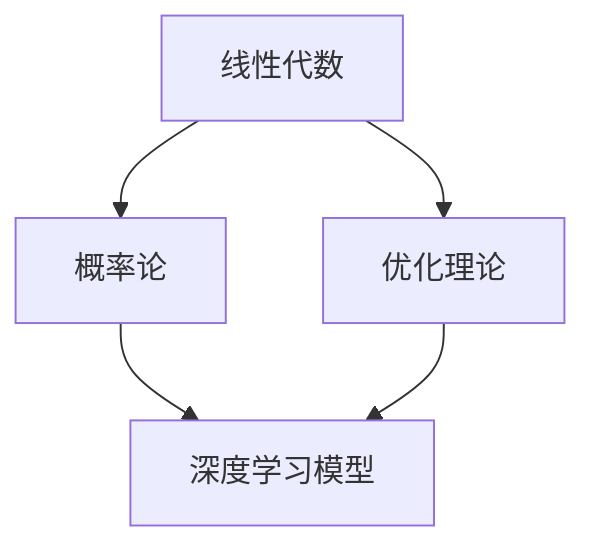

                 

# 深度学习数学基础：线性代数、概率论和优化理论

> 关键词：深度学习, 数学基础, 线性代数, 概率论, 优化理论, 神经网络, 梯度下降, 正则化, 卷积神经网络

## 1. 背景介绍

深度学习作为人工智能领域的核心技术之一，近年来在图像识别、语音识别、自然语言处理等多个领域取得了突破性进展。然而，深度学习的理论基础，尤其是其中的数学理论，往往被认为难以理解和应用。本文将对深度学习中涉及到的数学基础进行系统介绍，包括线性代数、概率论和优化理论等，帮助读者更好地理解和运用深度学习技术。

## 2. 核心概念与联系

### 2.1 核心概念概述

在深度学习中，数学基础扮演着至关重要的角色。下面我们将详细介绍深度学习中涉及到的几个核心数学概念：

- **线性代数**：描述数据的结构，尤其是矩阵和向量，是深度学习模型的基本构建块。
- **概率论**：用于描述模型的不确定性和预测能力。
- **优化理论**：用于求解模型参数的最佳值，以最小化损失函数。

这三个数学领域相互关联，共同构成了深度学习的数学基础。

### 2.2 核心概念原理和架构的 Mermaid 流程图



该流程图展示了深度学习中各数学领域的基本联系。线性代数提供数据表示和模型构建的工具，概率论描述了模型的预测能力，而优化理论则用于调整模型参数，使得模型能够最小化损失函数。

## 3. 核心算法原理 & 具体操作步骤

### 3.1 算法原理概述

深度学习模型的训练过程通常被视为一个优化问题，目标是通过调整模型的参数，使得模型对给定数据的预测与实际标签尽可能一致。这一过程可以通过梯度下降等优化算法来实现。

具体而言，给定一个深度学习模型 $f_\theta(x)$，其中 $\theta$ 为模型参数，$x$ 为输入数据，$y$ 为真实标签，目标函数为损失函数 $\mathcal{L}(\theta)$。训练过程通过不断调整 $\theta$，使得损失函数最小化，即：

$$
\min_\theta \mathcal{L}(\theta)
$$

这一过程可以通过梯度下降算法来实现。梯度下降算法的基本思路是：计算损失函数关于模型参数的梯度，然后沿着梯度的反方向调整参数。

### 3.2 算法步骤详解

#### 3.2.1 数据准备

1. 数据预处理：对输入数据进行标准化、归一化等处理，以便于模型训练。
2. 数据分割：将数据集划分为训练集、验证集和测试集。
3. 数据增强：对数据进行扩充，如旋转、缩放、翻转等，以增加数据多样性，提高模型泛化能力。

#### 3.2.2 模型选择

1. 模型架构：选择适合的模型架构，如全连接神经网络、卷积神经网络、循环神经网络等。
2. 超参数设置：如学习率、批大小、迭代次数等。

#### 3.2.3 训练过程

1. 前向传播：将输入数据通过模型计算得到预测结果。
2. 计算损失：计算预测结果与真实标签之间的损失函数值。
3. 反向传播：计算损失函数对模型参数的梯度。
4. 参数更新：使用梯度下降算法，更新模型参数。

#### 3.2.4 模型评估

1. 验证集评估：在验证集上评估模型性能，调整超参数。
2. 测试集评估：在测试集上评估模型性能，提供最终的性能指标。

### 3.3 算法优缺点

#### 3.3.1 优点

1. 高效性：梯度下降算法能够在较短时间内找到最优解。
2. 可解释性：梯度下降算法的每一步都是基于当前梯度的下降，易于理解。
3. 可扩展性：适用于各种类型的深度学习模型，如全连接神经网络、卷积神经网络等。

#### 3.3.2 缺点

1. 局部最优：梯度下降算法可能收敛到局部最优解，而非全局最优解。
2. 学习率选择困难：学习率的选择对模型训练结果有较大影响，选择不当可能导致训练失败。
3. 计算资源需求高：深度学习模型通常需要大量的计算资源进行训练。

### 3.4 算法应用领域

深度学习中的数学基础广泛应用于各个领域，如计算机视觉、自然语言处理、语音识别等。以下是几个典型的应用场景：

- 计算机视觉：用于图像分类、物体检测、图像分割等任务。
- 自然语言处理：用于文本分类、情感分析、机器翻译等任务。
- 语音识别：用于语音转文本、情感识别等任务。

## 4. 数学模型和公式 & 详细讲解 & 举例说明

### 4.1 数学模型构建

深度学习中的数学模型通常由以下几个部分构成：

1. 输入层：表示原始数据，如图像像素、文本单词等。
2. 隐藏层：对输入数据进行特征提取，通常包含多个神经元。
3. 输出层：根据隐藏层的特征输出预测结果。

### 4.2 公式推导过程

#### 4.2.1 线性回归模型

线性回归模型是深度学习的核心之一，其数学模型为：

$$
y = \theta^T x + b
$$

其中，$y$ 为预测结果，$x$ 为输入数据，$\theta$ 为模型参数，$b$ 为偏置项。

梯度下降算法更新参数 $\theta$ 的公式为：

$$
\theta = \theta - \eta \nabla_\theta \mathcal{L}
$$

其中，$\eta$ 为学习率，$\nabla_\theta \mathcal{L}$ 为损失函数对 $\theta$ 的梯度。

#### 4.2.2 卷积神经网络

卷积神经网络（Convolutional Neural Network, CNN）是深度学习中最常用的模型之一，其数学模型为：

$$
f(x) = \sum_i w_i g(x; \theta_i)
$$

其中，$w_i$ 为卷积核权重，$x$ 为输入数据，$g(x; \theta_i)$ 为卷积核的特征映射函数。

卷积神经网络的梯度下降算法更新公式为：

$$
\theta = \theta - \eta \frac{\partial \mathcal{L}}{\partial \theta}
$$

其中，$\eta$ 为学习率，$\mathcal{L}$ 为损失函数。

### 4.3 案例分析与讲解

#### 4.3.1 图像分类

图像分类是深度学习中最常见的任务之一。以MNIST数据集为例，其数学模型为：

$$
\mathcal{L}(\theta) = -\frac{1}{N}\sum_{i=1}^N \sum_{j=1}^C y_{ij}\log f_{ij}(\theta)
$$

其中，$y_{ij}$ 为第 $i$ 个样本属于第 $j$ 类别的概率，$f_{ij}(\theta)$ 为模型对第 $i$ 个样本属于第 $j$ 类别的预测概率。

梯度下降算法的更新公式为：

$$
\theta = \theta - \eta \frac{\partial \mathcal{L}}{\partial \theta}
$$

#### 4.3.2 文本分类

文本分类是自然语言处理中的重要任务，其数学模型为：

$$
\mathcal{L}(\theta) = -\frac{1}{N}\sum_{i=1}^N \log f(y_i|\theta)
$$

其中，$y_i$ 为第 $i$ 个样本的标签，$f(y_i|\theta)$ 为模型对第 $i$ 个样本属于 $y_i$ 的预测概率。

梯度下降算法的更新公式为：

$$
\theta = \theta - \eta \frac{\partial \mathcal{L}}{\partial \theta}
$$

## 5. 项目实践：代码实例和详细解释说明

### 5.1 开发环境搭建

在开始项目实践之前，需要安装以下依赖：

1. Python 3.x
2. TensorFlow
3. NumPy
4. SciPy
5. Matplotlib

使用以下命令安装：

```bash
pip install tensorflow numpy scipy matplotlib
```

### 5.2 源代码详细实现

#### 5.2.1 线性回归

```python
import numpy as np
import tensorflow as tf

# 定义数据集
X = np.array([[1, 2], [3, 4], [5, 6]])
y = np.array([3, 5, 7])

# 定义模型
theta = tf.Variable(tf.zeros([2, 1]))
b = tf.Variable(tf.zeros([1]))

# 定义损失函数和优化器
loss = tf.reduce_mean(tf.square(y - (theta @ X + b)))
optimizer = tf.train.GradientDescentOptimizer(learning_rate=0.01)

# 定义训练过程
with tf.Session() as sess:
    sess.run(tf.global_variables_initializer())
    for i in range(1000):
        sess.run(optimizer.minimize(loss))
    
    # 输出结果
    print(sess.run(theta), sess.run(b))
```

#### 5.2.2 卷积神经网络

```python
import tensorflow as tf
from tensorflow.keras.datasets import mnist
from tensorflow.keras.models import Sequential
from tensorflow.keras.layers import Conv2D, MaxPooling2D, Flatten, Dense

# 加载数据集
(x_train, y_train), (x_test, y_test) = mnist.load_data()

# 数据预处理
x_train = x_train.reshape(-1, 28, 28, 1).astype('float32') / 255.0
x_test = x_test.reshape(-1, 28, 28, 1).astype('float32') / 255.0

# 定义模型
model = Sequential([
    Conv2D(32, kernel_size=(3, 3), activation='relu', input_shape=(28, 28, 1)),
    MaxPooling2D(pool_size=(2, 2)),
    Flatten(),
    Dense(10, activation='softmax')
])

# 定义损失函数和优化器
model.compile(optimizer='adam', loss='sparse_categorical_crossentropy', metrics=['accuracy'])

# 训练模型
model.fit(x_train, y_train, epochs=5, batch_size=64, validation_data=(x_test, y_test))

# 输出结果
print(model.evaluate(x_test, y_test))
```

### 5.3 代码解读与分析

#### 5.3.1 线性回归

- `X` 和 `y`：定义输入数据和标签。
- `theta` 和 `b`：定义模型参数。
- `loss`：定义损失函数，计算预测值与真实值之间的差距。
- `optimizer`：定义优化器，使用梯度下降算法更新模型参数。
- `sess.run()`：运行优化器，更新模型参数。

#### 5.3.2 卷积神经网络

- `mnist.load_data()`：加载MNIST数据集。
- `x_train.reshape()`：对输入数据进行reshape操作，使其符合卷积神经网络的输入要求。
- `model.compile()`：编译模型，定义损失函数和优化器。
- `model.fit()`：训练模型，使用验证集评估模型性能。
- `model.evaluate()`：在测试集上评估模型性能。

### 5.4 运行结果展示

- 线性回归模型：输出参数 $\theta$ 和 $b$ 的值。
- 卷积神经网络模型：输出模型在测试集上的准确率。

## 6. 实际应用场景

### 6.1 图像识别

图像识别是深度学习中最常见的应用之一。在实际应用中，可以使用卷积神经网络对图像进行分类、物体检测、图像分割等任务。以ImageNet数据集为例，其数学模型为：

$$
f(x) = \sum_i w_i g(x; \theta_i)
$$

其中，$w_i$ 为卷积核权重，$x$ 为输入数据，$g(x; \theta_i)$ 为卷积核的特征映射函数。

### 6.2 自然语言处理

自然语言处理是深度学习中的重要领域，包括文本分类、情感分析、机器翻译等任务。以文本分类为例，其数学模型为：

$$
\mathcal{L}(\theta) = -\frac{1}{N}\sum_{i=1}^N \log f(y_i|\theta)
$$

其中，$y_i$ 为第 $i$ 个样本的标签，$f(y_i|\theta)$ 为模型对第 $i$ 个样本属于 $y_i$ 的预测概率。

### 6.3 语音识别

语音识别是深度学习的另一重要应用领域，包括语音转文本、情感识别等任务。以语音转文本为例，其数学模型为：

$$
\mathcal{L}(\theta) = -\frac{1}{N}\sum_{i=1}^N \log f(y_i|\theta)
$$

其中，$y_i$ 为第 $i$ 个样本的标签，$f(y_i|\theta)$ 为模型对第 $i$ 个样本属于 $y_i$ 的预测概率。

## 7. 工具和资源推荐

### 7.1 学习资源推荐

1. 《深度学习》书籍：Ian Goodfellow、Yoshua Bengio和Aaron Courville合著的经典书籍，深入浅出地介绍了深度学习的理论基础和实践技巧。
2. Coursera深度学习课程：由Andrew Ng主讲的Coursera深度学习课程，涵盖深度学习的核心概念和实现技术。
3. arXiv论文：arXiv.org是全球最大的开源论文库之一，通过阅读arXiv上的相关论文，可以了解深度学习的最新研究进展。

### 7.2 开发工具推荐

1. TensorFlow：由Google开发的深度学习框架，功能丰富，适用于各种类型的深度学习模型。
2. PyTorch：由Facebook开发的深度学习框架，灵活高效，适用于学术研究和实际应用。
3. Keras：基于TensorFlow和Theano开发的高级深度学习框架，易于上手，适合快速迭代实验。

### 7.3 相关论文推荐

1. 《深度学习》书籍：Ian Goodfellow、Yoshua Bengio和Aaron Courville合著的经典书籍，深入浅出地介绍了深度学习的理论基础和实践技巧。
2. Coursera深度学习课程：由Andrew Ng主讲的Coursera深度学习课程，涵盖深度学习的核心概念和实现技术。
3. arXiv论文：arXiv.org是全球最大的开源论文库之一，通过阅读arXiv上的相关论文，可以了解深度学习的最新研究进展。

## 8. 总结：未来发展趋势与挑战

### 8.1 研究成果总结

深度学习中的数学基础在实际应用中发挥了重要作用。线性代数、概率论和优化理论的组合，使得深度学习模型能够自动学习数据中的特征，并对未来进行预测。

### 8.2 未来发展趋势

1. 模型规模增加：未来深度学习模型的参数量将进一步增加，模型的表示能力将更加强大。
2. 算法优化：随着硬件性能的提升，深度学习算法将更加高效，训练速度将更快。
3. 数据驱动：数据驱动的深度学习模型将更加普及，更多的数据将用于模型的训练和优化。
4. 多模态学习：深度学习模型将能够处理更多的模态数据，如图像、语音、文本等。

### 8.3 面临的挑战

1. 计算资源限制：深度学习模型需要大量的计算资源进行训练和推理。
2. 数据质量问题：深度学习模型的训练和优化需要高质量的数据，数据获取和标注成本高。
3. 模型可解释性：深度学习模型通常被视为"黑盒"，难以解释其内部工作机制。
4. 伦理和安全问题：深度学习模型的输出可能存在偏见和安全隐患。

### 8.4 研究展望

1. 计算资源优化：研究高效的计算资源利用方法，如分布式训练、模型压缩等。
2. 数据质量提升：研究高效的数据获取和标注方法，如主动学习、半监督学习等。
3. 模型可解释性：研究可解释性模型，如LIME、SHAP等。
4. 伦理和安全：研究伦理导向的深度学习模型，如公平性、隐私保护等。

## 9. 附录：常见问题与解答

**Q1：深度学习模型中为什么需要正则化？**

A: 深度学习模型中的正则化方法如L2正则化、Dropout等，可以防止模型过拟合，提高模型的泛化能力。

**Q2：如何选择合适的学习率？**

A: 学习率的选择对深度学习模型的训练结果有较大影响，一般建议从0.01开始，逐步减小学习率，直至收敛。

**Q3：深度学习模型中为什么要进行数据增强？**

A: 数据增强可以增加训练数据的多样性，提高模型的泛化能力，减少过拟合的风险。

**Q4：深度学习模型中的优化算法有哪些？**

A: 常见的优化算法包括梯度下降（包括SGD、Adam等）、随机梯度下降（SGD）、Adagrad等。

**Q5：什么是过拟合？**

A: 过拟合指模型在训练集上表现良好，但在测试集上表现较差的现象，通常是由于模型过于复杂，训练样本过少导致。

---

作者：禅与计算机程序设计艺术 / Zen and the Art of Computer Programming

