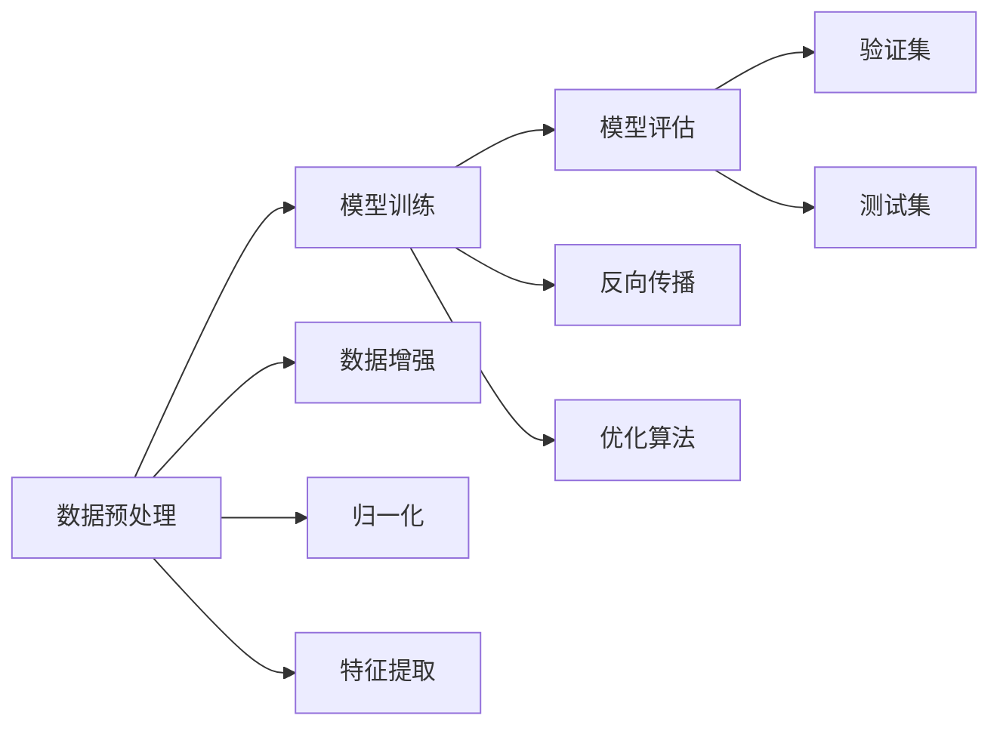

                 

# 深度学习框架比较：TensorFlow vs PyTorch vs Keras

## 1. 背景介绍

深度学习技术的兴起，使得全球科技界刮起了一阵“AI热潮”。各大深度学习框架应运而生，如TensorFlow、PyTorch、Keras等，它们为机器学习模型的构建提供了强大的技术支持。本文将通过比较这三种主流的深度学习框架，探讨它们各自的优缺点和适用场景，为深度学习爱好者提供有益的参考。

## 2. 核心概念与联系

### 2.1 核心概念概述

在深度学习中，数据处理、模型训练、模型评估是不可或缺的三个步骤。以下是三个核心概念的详细解释：

- **数据预处理**：对原始数据进行清洗、归一化、增强等预处理，以减少噪声，提高模型的稳定性和泛化能力。
- **模型训练**：通过反向传播算法和优化算法，对模型参数进行迭代优化，以最小化损失函数。
- **模型评估**：通过验证集和测试集对模型性能进行评估，选择最优模型进行部署。

以上三个步骤都是深度学习项目中的重要环节，不同的框架在实现这些步骤时具有不同的优势。

### 2.2 核心概念原理和架构的 Mermaid 流程图



此图展示了一个深度学习项目的基本流程，其中数据预处理和模型训练是最关键的环节。各个步骤的具体实现依赖于不同的深度学习框架。

## 3. 核心算法原理 & 具体操作步骤

### 3.1 算法原理概述

深度学习框架的核心功能是支持深度神经网络的构建、训练和评估。它们的原理主要基于反向传播算法和优化算法。

- **反向传播算法**：通过链式法则，计算损失函数对模型参数的梯度，以进行参数更新。
- **优化算法**：如梯度下降法、Adam、RMSprop等，用于更新模型参数以最小化损失函数。

### 3.2 算法步骤详解

不同的框架在实现这些算法时具有不同的特点，以下是三个框架的主要步骤：

#### TensorFlow

1. **张量操作**：TensorFlow基于张量操作，通过构建计算图，自动进行梯度计算和优化。
2. **自动求导**：TensorFlow支持静态图和动态图，用户可以选择不同的计算方式。
3. **分布式训练**：TensorFlow具有强大的分布式训练能力，可以方便地进行多GPU、多机群训练。

#### PyTorch

1. **动态图**：PyTorch采用动态图，通过定义操作序列来构建计算图，易于调试和可视化。
2. **自动求导**：PyTorch内置自动求导功能，便于使用。
3. **丰富的工具**：PyTorch提供丰富的工具和库，如torchvision、torchtext等，适用于各种任务。

#### Keras

1. **高级接口**：Keras提供了高级的API，简单易用，可以快速构建和训练模型。
2. **模型构建**：Keras支持多种模型构建方式，包括序列模型、函数式模型等。
3. **跨框架兼容性**：Keras可以运行在TensorFlow、Theano、CNTK等后端上，具有高度的灵活性。

### 3.3 算法优缺点

- **TensorFlow**：
  - **优点**：强大的分布式训练能力，丰富的社区支持和工具，广泛的应用场景。
  - **缺点**：学习曲线陡峭，API设计复杂，缺乏易用性。

- **PyTorch**：
  - **优点**：动态图设计灵活，易于调试和可视化，丰富的工具和库支持。
  - **缺点**：社区支持相对较少，分布式训练能力较弱。

- **Keras**：
  - **优点**：易用性高，构建模型快捷，支持多种后端。
  - **缺点**：灵活性不足，部分高级功能需要依赖后端框架。

### 3.4 算法应用领域

不同框架适用于不同的应用场景，具体如下：

- **TensorFlow**：适用于大规模、高并发的深度学习项目，如自动驾驶、自然语言处理、图像识别等。
- **PyTorch**：适用于需要快速原型设计、研究和调试的场景，如计算机视觉、语音识别等。
- **Keras**：适用于快速原型设计和模型构建，如初学者入门、快速原型开发等。

## 4. 数学模型和公式 & 详细讲解

### 4.1 数学模型构建

假设有一个简单的线性回归问题，输入为 $x$，输出为 $y$，目标是最小化损失函数 $L$。

$$ L = \frac{1}{2n} \sum_{i=1}^n (y_i - \theta_0 - \theta_1 x_i)^2 $$

其中 $\theta_0$ 和 $\theta_1$ 为模型参数。

### 4.2 公式推导过程

损失函数对参数的偏导数为：

$$ \frac{\partial L}{\partial \theta_0} = \frac{1}{n} \sum_{i=1}^n (y_i - \theta_0 - \theta_1 x_i) $$
$$ \frac{\partial L}{\partial \theta_1} = \frac{1}{n} \sum_{i=1}^n -2x_i (y_i - \theta_0 - \theta_1 x_i) $$

使用梯度下降法，模型参数的更新公式为：

$$ \theta_0 \leftarrow \theta_0 - \eta \frac{\partial L}{\partial \theta_0} $$
$$ \theta_1 \leftarrow \theta_1 - \eta \frac{\partial L}{\partial \theta_1} $$

其中 $\eta$ 为学习率。

### 4.3 案例分析与讲解

以Keras为例，使用TensorFlow后端实现上述线性回归问题。

```python
import tensorflow as tf
from tensorflow import keras

# 构建模型
model = keras.Sequential([
    keras.layers.Dense(1, input_shape=[1])
])

# 编译模型
model.compile(optimizer='sgd', loss='mean_squared_error')

# 训练模型
model.fit(x_train, y_train, epochs=10, verbose=0)

# 评估模型
loss = model.evaluate(x_test, y_test)
```

上述代码展示了Keras的易用性，只需几行代码即可实现模型构建、编译和训练。

## 5. 项目实践：代码实例和详细解释说明

### 5.1 开发环境搭建

在开始项目实践前，需要安装所需的深度学习框架和依赖库。

- **TensorFlow**：安装命令为 `pip install tensorflow`
- **PyTorch**：安装命令为 `pip install torch torchvision torchtext`
- **Keras**：安装命令为 `pip install keras`

### 5.2 源代码详细实现

以TensorFlow为例，实现一个简单的图像分类任务。

```python
import tensorflow as tf
from tensorflow import keras

# 加载数据
(x_train, y_train), (x_test, y_test) = keras.datasets.mnist.load_data()

# 数据预处理
x_train = x_train / 255.0
x_test = x_test / 255.0

# 构建模型
model = keras.Sequential([
    keras.layers.Flatten(input_shape=(28, 28)),
    keras.layers.Dense(128, activation='relu'),
    keras.layers.Dense(10, activation='softmax')
])

# 编译模型
model.compile(optimizer='adam', loss='sparse_categorical_crossentropy', metrics=['accuracy'])

# 训练模型
model.fit(x_train, y_train, epochs=10, validation_data=(x_test, y_test))

# 评估模型
test_loss, test_acc = model.evaluate(x_test, y_test)
print('Test accuracy:', test_acc)
```

上述代码展示了TensorFlow的模型构建、编译、训练和评估流程。

### 5.3 代码解读与分析

**模型构建**：使用 `keras.Sequential` 来构建模型，包含两个全连接层。

**数据预处理**：将数据归一化到 [0, 1] 范围内。

**模型编译**：使用 `keras.Model.compile` 来编译模型，指定优化器和损失函数。

**模型训练**：使用 `keras.Model.fit` 来训练模型，指定训练数据和验证数据。

**模型评估**：使用 `keras.Model.evaluate` 来评估模型性能。

### 5.4 运行结果展示

训练过程中，可以看到损失函数和准确率的变化情况。训练完成后，评估模型在测试集上的表现。

## 6. 实际应用场景

### 6.1 图像识别

深度学习框架在图像识别任务中得到了广泛应用，如TensorFlow的Inception模型、PyTorch的ResNet模型等。

### 6.2 自然语言处理

深度学习框架在NLP任务中同样表现出色，如TensorFlow的BERT模型、PyTorch的GPT模型等。

### 6.3 生成对抗网络

GANs是一种生成模型，深度学习框架在GANs中也表现出色，如TensorFlow的GAN模型、PyTorch的GAN模型等。

### 6.4 未来应用展望

未来深度学习框架将更加注重跨框架兼容性和易用性，同时提高分布式训练和优化算法的效率。预计在医疗、金融、自动驾驶等领域，深度学习框架将得到更广泛的应用。

## 7. 工具和资源推荐

### 7.1 学习资源推荐

1. **TensorFlow官方文档**：详细介绍了TensorFlow的使用方法和API。
2. **PyTorch官方文档**：提供了PyTorch的详细教程和API参考。
3. **Keras官方文档**：提供了Keras的详细教程和API参考。
4. **深度学习课程**：如吴恩达的《Deep Learning》课程，涵盖深度学习的基本理论和实现方法。
5. **书籍**：如《Python深度学习》、《深度学习》等书籍，详细讲解深度学习的理论和实践。

### 7.2 开发工具推荐

1. **Jupyter Notebook**：用于编写和调试深度学习代码，支持多种编程语言。
2. **Google Colab**：提供了免费的GPU资源，方便快速测试深度学习代码。
3. **PyCharm**：Python开发工具，支持多种深度学习框架。

### 7.3 相关论文推荐

1. **TensorFlow论文**：《Large-Scale Distributed Deep Learning with TensorFlow》。
2. **PyTorch论文**：《PyTorch: Tensors and Dynamic neural networks in Python with strong GPU acceleration》。
3. **Keras论文**：《Keras: Deep Learning for humans》。

## 8. 总结：未来发展趋势与挑战

### 8.1 研究成果总结

深度学习框架经过多年的发展，已经成为深度学习项目的重要工具。TensorFlow、PyTorch、Keras等框架各有优势，适用于不同的应用场景。

### 8.2 未来发展趋势

1. **跨框架兼容性**：未来深度学习框架将更加注重跨框架兼容性，方便开发者进行无缝切换。
2. **分布式训练**：分布式训练将成为深度学习框架的重要发展方向，支持大规模、高并发的深度学习项目。
3. **自动化**：自动化优化、自动调参等技术将进一步提升深度学习框架的易用性。
4. **易用性**：框架将更加注重易用性，提供更直观的API和更丰富的工具。

### 8.3 面临的挑战

1. **性能瓶颈**：随着深度学习模型的复杂度增加，计算资源的需求不断上升，如何优化深度学习框架的性能是一个重要挑战。
2. **易用性**：如何平衡易用性和性能，是一个值得探索的问题。
3. **模型可解释性**：深度学习模型的复杂性使得其结果难以解释，如何提高模型的可解释性是一个重要的研究方向。

### 8.4 研究展望

未来深度学习框架的研究将集中在以下几个方面：

1. **高效优化算法**：开发更高效的优化算法，以支持更大规模、更复杂的深度学习模型。
2. **跨框架工具**：开发跨框架的工具，方便开发者在不同框架间进行切换。
3. **模型可解释性**：探索如何提高深度学习模型的可解释性，增强其透明性和可靠性。

## 9. 附录：常见问题与解答

**Q1: 如何选择深度学习框架？**

A: 根据项目需求和团队技术栈，选择合适的深度学习框架。如需要分布式训练，可以选择TensorFlow；需要快速原型设计，可以选择Keras。

**Q2: TensorFlow、PyTorch和Keras在性能上有何差异？**

A: TensorFlow适合大规模、高并发的深度学习项目，PyTorch适合需要快速原型设计和研究的场景，Keras则适合快速原型设计和模型构建。

**Q3: 如何在不同框架之间切换？**

A: 使用Keras作为跨框架工具，支持在不同框架间进行切换，方便开发者进行模型迁移和优化。

**Q4: 如何提高深度学习框架的性能？**

A: 优化模型结构、提高计算效率、使用分布式训练等方法，可以提升深度学习框架的性能。

**Q5: 如何提高深度学习框架的易用性？**

A: 提供更直观的API、更丰富的工具、自动化优化和调参等技术，可以提升框架的易用性。

---

作者：禅与计算机程序设计艺术 / Zen and the Art of Computer Programming

