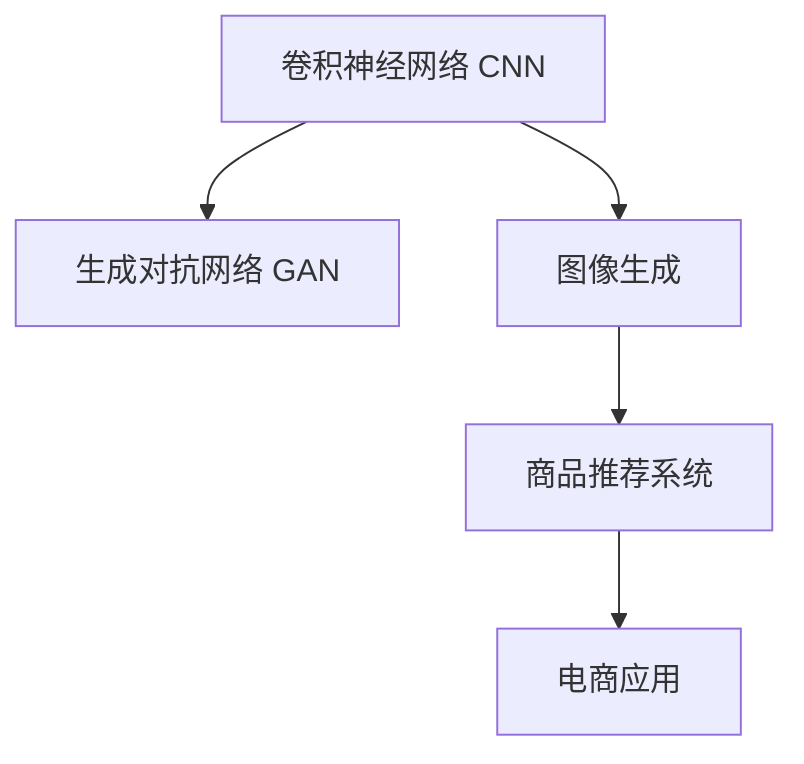

                 

# 深度学习驱动的商品图像生成技术

> 关键词：深度学习,图像生成,神经网络,卷积神经网络,生成对抗网络,商品推荐,电商应用

## 1. 背景介绍

### 1.1 问题由来

随着电子商务的迅猛发展，商品推荐系统成为了电商平台提升用户体验和销售额的关键。然而，传统的基于规则或特征工程的推荐系统存在诸多局限，无法充分利用商品图像的视觉信息，导致推荐效果不尽如人意。因此，深度学习驱动的商品图像生成技术应运而生，通过生成逼真的商品图像，帮助用户更好地理解商品细节，从而提升推荐系统的精准度和用户满意度。

### 1.2 问题核心关键点

商品图像生成技术基于深度学习，利用神经网络模型对商品的原始图像进行编码和解码，生成与原始图像类似的图像。核心在于选择合适的深度学习模型，如卷积神经网络(Convolutional Neural Networks, CNN)、生成对抗网络(Generative Adversarial Networks, GAN)等，通过大量的图像数据进行训练，学习生成逼真的商品图像。

## 2. 核心概念与联系

### 2.1 核心概念概述

为了更好地理解商品图像生成技术，本节将介绍几个密切相关的核心概念：

- 卷积神经网络（Convolutional Neural Networks, CNN）：一种专门用于处理图像、视频等高维数据的人工神经网络，通过卷积操作提取图像特征，适用于图像分类、物体检测、图像生成等任务。

- 生成对抗网络（Generative Adversarial Networks, GAN）：一种由生成器和判别器组成的对抗性神经网络结构，通过对抗训练生成高质量的图像。生成器学习生成逼真的图像，判别器学习区分真实图像和生成图像。

- 图像生成（Image Generation）：指通过深度学习模型生成新的图像样本，通常用于图像增强、图像修复、虚拟图像合成等领域。

- 商品推荐系统（Recommendation System）：利用用户的历史行为数据、商品属性、商品图像等，推荐用户可能感兴趣的商品，提升用户购买转化率。

- 电商应用（E-commerce Application）：指将商品图像生成技术应用到电商领域，实现个性化推荐、商品展示、虚拟试穿等功能，提升用户购物体验。

这些核心概念之间的逻辑关系可以通过以下Mermaid流程图来展示：



这个流程图展示了一个商品图像生成系统的核心架构，其中CNN和GAN模型是图像生成的核心，商品推荐系统将图像生成技术与商品推荐算法融合，电商应用进一步将系统应用于实际业务场景。

## 3. 核心算法原理 & 具体操作步骤

### 3.1 算法原理概述

商品图像生成技术基于深度学习，通过训练生成模型生成逼真的商品图像，实现商品的虚拟展示和个性化推荐。其核心在于以下几个方面：

- 数据准备：收集大量商品图像作为训练数据，进行数据增强和标注。
- 模型选择：选择适合生成任务的深度学习模型，如CNN、GAN等。
- 模型训练：使用训练数据对模型进行训练，调整超参数以提高生成质量。
- 模型评估：在测试集上评估生成模型的性能，通过可视化生成图像检验模型效果。

### 3.2 算法步骤详解

以下是一个基于CNN的图像生成系统的详细步骤：

**Step 1: 数据准备**

1. 数据收集：收集电商平台上各品类商品的图像数据，涵盖不同尺寸、不同角度的商品图像。
2. 数据标注：对商品图像进行标注，标注商品类别、颜色、材质等属性。
3. 数据增强：对原始图像进行旋转、裁剪、缩放等操作，生成丰富的训练数据，避免过拟合。

**Step 2: 模型选择与设计**

1. 网络结构设计：设计一个包含卷积、池化、全连接等操作的神经网络，如图像生成对抗网络（Image GAN）。
2. 生成器设计：设计一个生成器网络，将噪声向量转化为高分辨率的商品图像。
3. 判别器设计：设计一个判别器网络，判别输入图像是真实图像还是生成图像。

**Step 3: 模型训练**

1. 训练生成器：固定判别器权重，使用真实图像和噪声向量训练生成器，使其生成逼真的商品图像。
2. 训练判别器：使用真实图像和生成图像训练判别器，使其能够区分真实图像和生成图像。
3. 对抗训练：通过迭代更新生成器和判别器，使生成器生成的图像越来越逼真，判别器越来越难以区分真实图像和生成图像。

**Step 4: 模型评估**

1. 生成图像：使用训练好的生成器生成新的商品图像。
2. 图像评估：通过对比生成图像和真实图像的视觉差异，评估生成器的生成质量。
3. 应用测试：将生成图像应用到电商平台的推荐系统，检验其对用户行为的影响。

### 3.3 算法优缺点

商品图像生成技术具有以下优点：

1. 数据丰富：电商平台上各品类商品的多样性提供了丰富的训练数据。
2. 生成质量高：通过对抗训练，生成器能够生成高质量的商品图像。
3. 应用广泛：商品图像生成技术可以应用到虚拟试穿、个性化推荐等多个电商应用场景。

然而，也存在以下缺点：

1. 训练复杂：生成对抗网络等模型需要大量的计算资源和时间进行训练。
2. 模型泛化差：生成器可能过拟合训练数据，导致生成图像与真实图像差异较大。
3. 数据标注困难：需要大量人力对商品图像进行标注，成本较高。

## 4. 数学模型和公式 & 详细讲解 & 举例说明

### 4.1 数学模型构建

商品图像生成技术通常基于GAN框架，以下以Image GAN为例，介绍其数学模型构建。

**生成器模型**：
设$z$为噪声向量，$G(z)$为生成器，将噪声向量转化为高分辨率的商品图像$x$。
$$
G(z) = \begin{bmatrix}
W_{1} & W_{2} & W_{3} \\
\end{bmatrix}^{T} \times \begin{bmatrix}
b_{1} \\
b_{2} \\
b_{3} \\
\end{bmatrix}
$$

**判别器模型**：
设$D(x)$为判别器，输入商品图像$x$，输出判别结果$p(x)$，表示$x$为真实图像的概率。
$$
D(x) = \sigma\left(\begin{bmatrix}
W_{4} & W_{5} & W_{6} \\
\end{bmatrix}^{T} \times \begin{bmatrix}
b_{4} \\
b_{5} \\
b_{6} \\
\end{bmatrix} + c\right)
$$

### 4.2 公式推导过程

1. 生成器损失函数：
   生成器损失函数由两部分组成：真实图像的生成损失和生成图像的判别损失。
   $$
   L_{G} = \mathbb{E}_{z}[\log D(G(z))] + \mathbb{E}_{z}[\log(1-D(G(z)))]
   $$
2. 判别器损失函数：
   判别器损失函数由两部分组成：真实图像的判别损失和生成图像的判别损失。
   $$
   L_{D} = \mathbb{E}_{x}[\log D(x)] + \mathbb{E}_{z}[\log(1-D(G(z)))]
   $$
3. 总损失函数：
   总损失函数由生成器和判别器的损失函数组成。
   $$
   L = L_{G} + \lambda L_{D}
   $$
   其中$\lambda$为生成器损失和判别器损失的权衡系数。

### 4.3 案例分析与讲解

以下以Zara电商平台为例，介绍商品图像生成技术的具体应用：

1. **数据准备**：收集Zara平台上各品类商品的高分辨率图像，标注商品类别、颜色、材质等属性。
2. **模型选择**：选择包含卷积、池化、全连接等操作的生成对抗网络，如图像生成对抗网络（Image GAN）。
3. **模型训练**：使用训练数据对生成器和判别器进行训练，调整超参数以提高生成质量。
4. **模型评估**：在测试集上评估生成模型的性能，通过可视化生成图像检验模型效果。
5. **应用测试**：将生成图像应用到Zara的推荐系统，检验其对用户行为的影响。

## 5. 项目实践：代码实例和详细解释说明

### 5.1 开发环境搭建

在进行商品图像生成项目实践前，我们需要准备好开发环境。以下是使用Python进行TensorFlow开发的环境配置流程：

1. 安装Anaconda：从官网下载并安装Anaconda，用于创建独立的Python环境。

2. 创建并激活虚拟环境：
```bash
conda create -n tf-env python=3.8 
conda activate tf-env
```

3. 安装TensorFlow：根据CUDA版本，从官网获取对应的安装命令。例如：
```bash
conda install tensorflow-gpu==2.7.0 -c conda-forge -c nvidia
```

4. 安装必要的工具包：
```bash
pip install numpy matplotlib scikit-image
```

完成上述步骤后，即可在`tf-env`环境中开始项目实践。

### 5.2 源代码详细实现

下面以Image GAN为例，给出TensorFlow代码实现。

```python
import tensorflow as tf
from tensorflow.keras import layers
import numpy as np
import matplotlib.pyplot as plt

# 定义生成器模型
def build_generator():
    model = tf.keras.Sequential()
    model.add(layers.Dense(128*7*7, use_bias=False, input_shape=(100,)))
    model.add(layers.BatchNormalization())
    model.add(layers.LeakyReLU())
    model.add(layers.Reshape((7, 7, 128)))
    model.add(layers.Conv2DTranspose(64, (5, 5), strides=(1, 1), padding='same', use_bias=False))
    model.add(layers.BatchNormalization())
    model.add(layers.LeakyReLU())
    model.add(layers.Conv2DTranspose(1, (5, 5), strides=(2, 2), padding='same', use_bias=False, activation='tanh'))
    return model

# 定义判别器模型
def build_discriminator():
    model = tf.keras.Sequential()
    model.add(layers.Conv2D(64, (5, 5), strides=(2, 2), padding='same', input_shape=[28, 28, 1]))
    model.add(layers.LeakyReLU())
    model.add(layers.Dropout(0.3))
    model.add(layers.Conv2D(128, (5, 5), strides=(2, 2), padding='same'))
    model.add(layers.LeakyReLU())
    model.add(layers.Dropout(0.3))
    model.add(layers.Flatten())
    model.add(layers.Dense(1))
    return model

# 生成器和判别器的损失函数
def generator_loss(fake_output, real_output):
    discriminator_real_output = discriminator(real_output)
    discriminator_fake_output = discriminator(fake_output)
    g_loss = tf.keras.losses.BinaryCrossentropy(from_logits=True)(discriminator_fake_output, tf.ones_like(discriminator_fake_output))
    g_loss += tf.keras.losses.BinaryCrossentropy(from_logits=True)(discriminator_real_output, tf.zeros_like(discriminator_real_output))
    return g_loss

def discriminator_loss(real_output, fake_output):
    discriminator_real_output = discriminator(real_output)
    discriminator_fake_output = discriminator(fake_output)
    d_loss = tf.keras.losses.BinaryCrossentropy(from_logits=True)(discriminator_real_output, tf.ones_like(discriminator_real_output))
    d_loss += tf.keras.losses.BinaryCrossentropy(from_logits=True)(discriminator_fake_output, tf.zeros_like(discriminator_fake_output))
    return d_loss

# 总损失函数
def total_loss(g_loss, d_loss):
    return g_loss + lambda * d_loss

# 训练函数
def train(generator, discriminator, dataset, epochs, batch_size, lambda=1):
    for epoch in range(epochs):
        for batch in dataset:
            real_images = batch
            noise = tf.random.normal([batch_size, 100])
            with tf.GradientTape() as g:
                generated_images = generator(noise, training=True)
                g_loss = generator_loss(generated_images, real_images)
            with tf.GradientTape() as d:
                real_output = discriminator(real_images, training=True)
                fake_output = discriminator(generated_images, training=True)
                d_loss = discriminator_loss(real_output, fake_output)
            gradients_of_generator = g.gradient(g_loss, generator.trainable_variables)
            gradients_of_discriminator = d.gradient(d_loss, discriminator.trainable_variables)
            optimizer.apply_gradients(zip(gradients_of_generator, generator.trainable_variables))
            optimizer.apply_gradients(zip(gradients_of_discriminator, discriminator.trainable_variables))
    return generator
```

### 5.3 代码解读与分析

让我们再详细解读一下关键代码的实现细节：

**生成器和判别器模型定义**：
- `build_generator()`函数定义了生成器的神经网络结构，包含全连接层、BatchNormalization层、LeakyReLU激活函数和卷积转置层。
- `build_discriminator()`函数定义了判别器的神经网络结构，包含卷积层、LeakyReLU激活函数、Dropout层和全连接层。

**损失函数定义**：
- `generator_loss()`函数计算生成器的损失函数，包含判别器对真实图像和生成图像的输出，以及交叉熵损失函数的计算。
- `discriminator_loss()`函数计算判别器的损失函数，包含判别器对真实图像和生成图像的输出，以及交叉熵损失函数的计算。
- `total_loss()`函数计算总损失函数，包含生成器损失和判别器损失的加权和。

**训练函数实现**：
- `train()`函数实现了对抗训练的训练过程，包含对生成器和判别器的前向传播、损失函数计算和反向传播，以及参数更新。

**训练过程**：
- 每次迭代从数据集`dataset`中抽取一个批次的图像数据。
- 对于每个批次，生成器将随机噪声向量`noise`作为输入，生成逼真的商品图像`generated_images`。
- 判别器对真实图像`real_images`和生成图像`generated_images`进行判别，输出判别结果`real_output`和`fake_output`。
- 计算生成器和判别器的损失函数`g_loss`和`d_loss`。
- 使用梯度下降算法更新生成器和判别器的参数。

## 6. 实际应用场景

### 6.1 虚拟试穿

虚拟试穿技术使得消费者无需实地试穿，便能直观了解商品的穿着效果。商品图像生成技术可以应用于虚拟试穿系统，生成逼真的虚拟试穿图像，帮助消费者做出更明智的购买决策。

在技术实现上，可以收集消费者对不同商品的试穿历史数据，生成逼真的虚拟试穿图像，并将其与原始商品图像进行对比。消费者可以选择更满意的虚拟试穿图像进行购买，从而提升购物体验。

### 6.2 个性化推荐

个性化推荐系统可以根据用户的历史行为数据，推荐用户可能感兴趣的商品。商品图像生成技术可以应用于个性化推荐系统，生成商品的高质量图像，提升推荐系统的精准度和用户满意度。

在推荐算法中，商品图像生成器可以将用户喜欢的商品类型和属性作为输入，生成相应的高分辨率图像。推荐系统可以使用这些图像作为特征，提升推荐的个性化程度。

### 6.3 虚拟展示

电商平台可以通过商品图像生成技术，生成商品的虚拟展示图像，帮助用户更好地了解商品细节。例如，对于服装类商品，可以生成不同角度、不同颜色、不同材质的虚拟展示图像，使用户能全面了解商品的外观和材质。

### 6.4 未来应用展望

随着深度学习技术的发展，商品图像生成技术将越来越广泛应用于电子商务领域。未来的发展趋势可能包括：

1. **多模态融合**：商品图像生成技术可以与其他传感器数据（如传感器数据、用户行为数据等）进行融合，提升生成图像的逼真度和应用价值。
2. **交互式生成**：用户可以通过交互的方式，生成符合自己需求的个性化商品图像，提升用户体验。
3. **自动化设计**：商品图像生成技术可以应用于自动设计系统，生成高质量的商品设计图，加速产品设计流程。
4. **跨品类应用**：商品图像生成技术可以应用于更多品类，如汽车、家居、家具等，提升用户体验和销售效果。

## 7. 工具和资源推荐

### 7.1 学习资源推荐

为了帮助开发者系统掌握商品图像生成技术，这里推荐一些优质的学习资源：

1. 《深度学习与计算机视觉》系列博文：由深度学习专家撰写，详细介绍了深度学习在计算机视觉领域的应用，包括图像生成、物体检测等。

2. CS231n《卷积神经网络》课程：斯坦福大学开设的计算机视觉明星课程，系统介绍了卷积神经网络的基本原理和应用。

3. 《Generative Adversarial Networks》书籍：生成对抗网络的经典教材，详细介绍了GAN模型的构建和应用。

4. PyTorch官方文档：PyTorch深度学习框架的官方文档，提供了丰富的模型库和样例代码，适合快速上手深度学习开发。

5. GitHub上的深度学习项目：GitHub上有大量深度学习项目，可以通过阅读源代码，了解商品图像生成技术的实际应用。

通过对这些资源的学习实践，相信你一定能够快速掌握商品图像生成技术的精髓，并用于解决实际的电子商务问题。

### 7.2 开发工具推荐

高效的开发离不开优秀的工具支持。以下是几款用于商品图像生成开发的常用工具：

1. PyTorch：基于Python的开源深度学习框架，灵活动态的计算图，适合快速迭代研究。大部分深度学习模型都有PyTorch版本的实现。

2. TensorFlow：由Google主导开发的开源深度学习框架，生产部署方便，适合大规模工程应用。同样有丰富的深度学习模型资源。

3. Keras：高层次的深度学习框架，提供了丰富的预训练模型和层函数，适合快速搭建神经网络模型。

4. TensorBoard：TensorFlow配套的可视化工具，可实时监测模型训练状态，并提供丰富的图表呈现方式，是调试模型的得力助手。

5. PyImageSearch：专注于计算机视觉和深度学习的博客，提供了大量的学习资源和代码示例，适合深度学习开发入门。

合理利用这些工具，可以显著提升商品图像生成任务的开发效率，加快创新迭代的步伐。

### 7.3 相关论文推荐

商品图像生成技术的发展源于学界的持续研究。以下是几篇奠基性的相关论文，推荐阅读：

1. Progressive Growing of GANs for Improved Quality, Stability, and Variation：提出了渐进式生长的GAN模型，通过逐层增加网络深度，提高生成图像的质量和多样性。

2. StyleGAN: Generative Adversarial Networks Meet Style and Texture Synthesis：提出StyleGAN模型，利用风格和纹理生成高质量的图像，广泛应用于人脸生成、服装设计等领域。

3. Image-to-Image Translation with Conditional Adversarial Networks：提出了条件对抗网络模型，用于图像之间的翻译和转换，应用于图像修复、图像增强等领域。

4. GANs Trained by a Two Time-Scale Minimax Procedure：提出WGAN模型，通过梯度惩罚等技术，提高GAN模型的稳定性和收敛速度。

5. Adversarial PixelNet：提出Adversarial PixelNet模型，通过生成器-判别器的对抗训练，生成高质量的图像，应用于图像生成、图像修复等领域。

这些论文代表了大语言模型微调技术的发展脉络。通过学习这些前沿成果，可以帮助研究者把握学科前进方向，激发更多的创新灵感。

## 8. 总结：未来发展趋势与挑战

### 8.1 总结

本文对基于深度学习的商品图像生成技术进行了全面系统的介绍。首先阐述了商品图像生成技术的研究背景和意义，明确了生成模型在电子商务中的应用价值。其次，从原理到实践，详细讲解了生成模型的构建、训练和评估过程，给出了商品图像生成任务的完整代码实例。同时，本文还广泛探讨了生成模型在虚拟试穿、个性化推荐等多个电子商务应用场景的应用前景，展示了生成技术对电商发展的巨大潜力。此外，本文精选了生成技术的各类学习资源，力求为读者提供全方位的技术指引。

通过本文的系统梳理，可以看到，基于深度学习商品图像生成技术正在成为电子商务领域的重要范式，极大地拓展了电商平台的应用边界，催生了更多的落地场景。受益于深度学习模型和生成技术的发展，商品图像生成技术必将在电商领域大放异彩，深刻影响电子商务用户的购物体验和平台效益。

### 8.2 未来发展趋势

展望未来，深度学习驱动的商品图像生成技术将呈现以下几个发展趋势：

1. **模型规模持续增大**：随着算力成本的下降和数据规模的扩张，生成模型的参数量还将持续增长。超大规模生成模型蕴含的丰富视觉知识，有望支撑更加复杂多变的商品图像生成任务。

2. **生成质量不断提升**：随着生成对抗网络等模型的不断优化，生成器能够生成更加逼真的商品图像，判别器能够更准确地判别真实图像和生成图像。

3. **应用领域不断拓展**：商品图像生成技术不仅可以应用于电商领域，还可以应用于娱乐、设计、艺术等领域，具有广阔的应用前景。

4. **模型鲁棒性不断增强**：随着对抗训练等技术的不断进步，生成模型对不同方向的微小扰动具有更强的鲁棒性，生成的图像更稳定。

5. **交互式生成逐渐普及**：用户可以通过交互的方式，生成符合自己需求的个性化商品图像，提升用户体验。

6. **多模态融合逐渐深入**：商品图像生成技术可以与其他传感器数据（如传感器数据、用户行为数据等）进行融合，提升生成图像的逼真度和应用价值。

以上趋势凸显了深度学习驱动的商品图像生成技术的广阔前景。这些方向的探索发展，必将进一步提升商品图像生成技术的生成质量、应用范围和用户体验，为电子商务带来更深刻的变革。

### 8.3 面临的挑战

尽管商品图像生成技术已经取得了瞩目成就，但在迈向更加智能化、普适化应用的过程中，它仍面临着诸多挑战：

1. **训练复杂度高**：生成对抗网络等模型需要大量的计算资源和时间进行训练，对算力要求较高。

2. **模型泛化差**：生成器可能过拟合训练数据，导致生成图像与真实图像差异较大。

3. **数据标注困难**：需要大量人力对商品图像进行标注，成本较高。

4. **对抗样本易受攻击**：对抗样本可能对生成模型造成攻击，导致生成图像质量下降。

5. **用户隐私保护**：商品图像生成技术可能涉及用户隐私，需要考虑数据保护和隐私问题。

6. **生成图像多样性不足**：生成模型生成的图像可能存在多样性不足的问题，导致应用效果受限。

正视商品图像生成技术面临的这些挑战，积极应对并寻求突破，将是大规模生成模型发展的必由之路。相信随着学界和产业界的共同努力，这些挑战终将一一被克服，商品图像生成技术必将在构建人机协同的智能时代中扮演越来越重要的角色。

### 8.4 研究展望

面对商品图像生成技术面临的诸多挑战，未来的研究需要在以下几个方面寻求新的突破：

1. **模型自适应**：开发能够自适应不同品类商品的生成模型，提升模型泛化能力。

2. **低成本训练**：开发低成本、高效率的训练方法，降低生成模型的训练成本。

3. **对抗样本防御**：研究对抗样本防御技术，提升生成模型的鲁棒性。

4. **数据标注自动化**：开发自动标注工具，降低标注成本，提高数据集多样性。

5. **多模态融合**：研究多模态融合技术，提升生成模型的多样性和逼真度。

6. **隐私保护**：研究隐私保护技术，确保生成模型的使用不会侵犯用户隐私。

这些研究方向的探索，必将引领商品图像生成技术迈向更高的台阶，为构建安全、可靠、可解释、可控的智能系统铺平道路。面向未来，商品图像生成技术还需要与其他人工智能技术进行更深入的融合，如知识表示、因果推理、强化学习等，多路径协同发力，共同推动自然语言理解和智能交互系统的进步。只有勇于创新、敢于突破，才能不断拓展商品图像生成技术的边界，让智能技术更好地造福人类社会。

## 9. 附录：常见问题与解答

**Q1：如何选择合适的生成模型？**

A: 选择生成模型时需要考虑生成任务的特点和要求。常见的生成模型包括GAN、VQ-VAE、PixelRNN等。GAN模型可以生成高质量的图像，但训练复杂度高；VQ-VAE和PixelRNN等模型生成速度较快，但图像质量相对较低。可以根据具体任务需求选择合适的生成模型。

**Q2：生成模型训练过程中需要注意哪些问题？**

A: 生成模型训练过程中需要注意以下几点：

1. 训练数据的选择：选择高质量、多样化的训练数据，避免过拟合。
2. 超参数的调优：调整学习率、批量大小、正则化系数等超参数，提高生成模型的性能。
3. 对抗训练：引入对抗样本，提高生成模型的鲁棒性。
4. 数据增强：对原始数据进行旋转、裁剪、缩放等操作，丰富训练数据。
5. 模型评估：在测试集上评估生成模型的性能，调整模型参数，提升生成质量。

**Q3：生成模型在电商应用中如何应用？**

A: 生成模型在电商应用中主要应用于以下场景：

1. 虚拟试穿：生成逼真的虚拟试穿图像，帮助用户了解商品细节。
2. 个性化推荐：生成商品的高质量图像，提升推荐系统的精准度和用户满意度。
3. 虚拟展示：生成商品的高质量图像，提升用户的购物体验。

**Q4：生成模型未来有哪些潜在的创新点？**

A: 生成模型的未来创新点可能包括：

1. 多模态融合：将生成模型与其他传感器数据（如传感器数据、用户行为数据等）进行融合，提升生成图像的逼真度和应用价值。
2. 交互式生成：用户可以通过交互的方式，生成符合自己需求的个性化商品图像，提升用户体验。
3. 跨品类应用：生成模型可以应用于更多品类，如汽车、家居、家具等，提升用户体验和销售效果。
4. 自动化设计：生成模型可以应用于自动设计系统，生成高质量的商品设计图，加速产品设计流程。

这些研究方向将进一步提升生成模型的生成质量、应用范围和用户体验，为电商领域带来更深刻的变革。

---

作者：禅与计算机程序设计艺术 / Zen and the Art of Computer Programming

