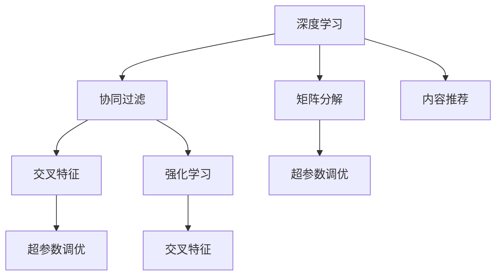

                 

# 深度学习驱动的商品推荐系统设计

> 关键词：深度学习,推荐系统,协同过滤,矩阵分解,内容推荐,交叉特征,超参数调优,强化学习

## 1. 背景介绍

### 1.1 问题由来

在当今的互联网时代，电商平台、视频网站、音乐应用等各种在线平台充斥着海量数据，用户消费行为、喜好信息、搜索历史等数据源源不断，如何利用这些数据为用户推荐个性化商品成为了一个重要的问题。商品推荐系统的好坏直接影响到用户满意度和平台留存率，因此越来越受到各大电商平台的重视。

推荐系统一般分为两大类：基于内容的推荐和协同过滤推荐。基于内容的推荐是根据商品的属性特征，如价格、分类、描述等，利用机器学习算法进行推荐。协同过滤推荐则是利用用户历史行为数据，通过寻找用户之间的相似性来推荐商品。

传统的协同过滤推荐系统通常使用矩阵分解（如ALS算法）或协同过滤算法（如基于用户的协同过滤、基于物品的协同过滤）。尽管这些方法在一定范围内取得了不错的效果，但在面对大规模数据、高维特征、用户行为频繁变化等问题时，其推荐效果逐渐显现出局限性。

近年来，深度学习技术逐渐应用于推荐系统，通过神经网络模型对用户和商品进行表示学习，进一步提升了推荐效果。随着计算资源和算法的不断进步，基于深度学习的推荐系统成为研究热点。

### 1.2 问题核心关键点

深度学习驱动的商品推荐系统研究的核心点在于以下几个方面：

- **数据预处理与特征工程**：如何在原始数据中提取有意义的特征，是推荐系统性能的重要保证。
- **模型设计**：选择合适的深度学习模型，并设计合适的损失函数和优化器。
- **超参数调优**：深度学习模型往往有很多超参数，如何通过合理的调参方式寻找最优的超参数配置。
- **在线学习与实时推荐**：如何在在线环境下进行高效推荐，处理新增数据，以及实时更新推荐模型。
- **交叉验证与模型评估**：如何合理地进行交叉验证，评价推荐系统的推荐效果。
- **冷启动问题**：如何处理新用户或新商品，使推荐系统能够在没有足够历史数据的情况下仍然有良好的推荐效果。

### 1.3 问题研究意义

研究深度学习驱动的商品推荐系统，对于提升电商平台的个性化推荐服务，提高用户满意度，降低用户流失率，增加用户粘性，具有重要意义。具体如下：

1. **提升用户体验**：通过深度学习算法，能够根据用户的历史行为和实时行为，生成个性化的推荐结果，提升用户满意度和平台粘性。
2. **降低用户流失率**：深度学习推荐系统能够发现用户潜在兴趣，提高商品相关性和匹配度，减少用户流失。
3. **增加用户粘性**：个性化推荐能够增加用户对平台的访问频率，提高用户活跃度。
4. **市场竞争优势**：个性化推荐系统是电商平台竞争力的重要组成部分，通过提升推荐效果，在市场竞争中占据有利地位。

## 2. 核心概念与联系

### 2.1 核心概念概述

为了深入理解深度学习驱动的商品推荐系统，首先需要介绍一些核心概念和它们之间的关系：

- **深度学习**：一种基于多层神经网络的机器学习方法，通过多层次的非线性映射，能够从复杂的数据中学习到有效的表示。
- **协同过滤**：利用用户之间的相似性或物品之间的相似性进行推荐。
- **矩阵分解**：将用户-商品评分矩阵分解为低维矩阵，通过矩阵乘法快速计算推荐结果。
- **内容推荐**：根据商品属性特征，利用机器学习算法进行推荐。
- **交叉特征**：将用户属性和商品属性进行交叉，生成新的特征，提升推荐效果。
- **超参数调优**：调整模型中的非数据驱动参数，以获得更好的性能。
- **强化学习**：通过奖励机制不断调整策略，使推荐系统更符合用户真实需求。

这些概念之间的关系可以通过以下Mermaid流程图来展示：



这个流程图展示了深度学习在推荐系统中的应用场景，每个核心概念之间都有一定的联系和交叉。

## 3. 核心算法原理 & 具体操作步骤

### 3.1 算法原理概述

基于深度学习的推荐系统主要分为以下几个步骤：

1. **数据预处理与特征工程**：收集用户行为数据，并对数据进行清洗、归一化等预处理，同时进行特征工程，生成有意义的特征。
2. **模型设计**：选择合适的深度学习模型，并设计合适的损失函数和优化器。
3. **超参数调优**：调整模型中的超参数，如学习率、批量大小等，以获得更好的性能。
4. **在线学习与实时推荐**：在在线环境下进行推荐，处理新增数据，并实时更新推荐模型。
5. **模型评估**：利用交叉验证和指标评估推荐系统的性能。
6. **冷启动问题**：处理新用户或新商品，提升推荐效果。

### 3.2 算法步骤详解

以基于深度学习的协同过滤推荐系统为例，具体步骤如下：

**Step 1: 数据预处理与特征工程**

1. 收集用户行为数据，包括浏览、点击、购买等行为。
2. 对数据进行清洗，去除缺失值、异常值等。
3. 对用户特征和商品特征进行归一化。
4. 利用交叉特征生成新的特征，提升推荐效果。

**Step 2: 模型设计**

1. 选择合适的深度学习模型，如注意力机制（Attention）、卷积神经网络（CNN）、循环神经网络（RNN）等。
2. 设计合适的损失函数，如均方误差、交叉熵等。
3. 选择合适的优化器，如Adam、SGD等。

**Step 3: 超参数调优**

1. 定义超参数空间，如学习率、批量大小、模型层数等。
2. 利用网格搜索、随机搜索等方法，对超参数进行调优。
3. 记录调优过程中各超参数组合的性能，选择最佳配置。

**Step 4: 在线学习与实时推荐**

1. 在在线环境下，实时收集用户行为数据。
2. 利用新的数据，更新推荐模型，生成实时推荐结果。
3. 处理新增用户和商品，保持推荐系统的冷启动能力。

**Step 5: 模型评估**

1. 利用交叉验证方法，对推荐系统进行评估。
2. 计算推荐系统的评价指标，如准确率、召回率、F1值等。
3. 根据评价指标，调整推荐系统的策略，提升推荐效果。

### 3.3 算法优缺点

基于深度学习的推荐系统有以下优点：

1. 能够处理大规模数据和高维特征。
2. 能够捕捉用户和商品之间的复杂关系。
3. 能够自适应用户行为变化，及时调整推荐策略。

但同时也存在一些缺点：

1. 计算复杂度高，需要高性能计算资源。
2. 模型复杂度高，容易出现过拟合。
3. 需要大量标注数据进行训练，获取高质量标注数据成本较高。

### 3.4 算法应用领域

基于深度学习的推荐系统在电商、视频、音乐等多个领域都有广泛的应用。例如：

1. **电商推荐系统**：利用用户行为数据，推荐商品给用户，提高转化率和用户满意度。
2. **视频推荐系统**：根据用户历史观看记录，推荐相关视频，提高观看时长和用户粘性。
3. **音乐推荐系统**：根据用户听歌历史和歌曲属性，推荐相似歌曲，提升用户发现新歌曲的乐趣。

## 4. 数学模型和公式 & 详细讲解  
### 4.1 数学模型构建

假设用户-商品评分矩阵为 $U \in R^{m \times n}$，其中 $m$ 为用户数，$n$ 为商品数，$U_{i,j}$ 表示用户 $i$ 对商品 $j$ 的评分。用户行为特征矩阵为 $X \in R^{m \times d_1}$，商品特征矩阵为 $Y \in R^{n \times d_2}$，其中 $d_1$ 和 $d_2$ 分别为用户和商品的特征维度。

定义深度学习推荐模型为 $M_{\theta}(X, Y)$，其中 $\theta$ 为模型的可训练参数。模型的输出为推荐概率矩阵 $P \in R^{m \times n}$，表示用户对商品的不同推荐概率。模型的损失函数为：

$$
L = \frac{1}{N} \sum_{i=1}^m \sum_{j=1}^n \ell(U_{i,j}, M_{\theta}(X_i, Y_j))
$$

其中 $\ell$ 为损失函数，通常使用均方误差（MSE）或交叉熵（CE）损失。优化器如Adam、SGD等用于最小化损失函数 $L$。

### 4.2 公式推导过程

以均方误差损失函数为例，推导推荐模型的训练过程。

假设模型的输出为 $\hat{P}_{i,j}$，则均方误差损失函数为：

$$
L_{MSE} = \frac{1}{N} \sum_{i=1}^m \sum_{j=1}^n (U_{i,j} - \hat{P}_{i,j})^2
$$

通过反向传播算法，计算损失函数对模型参数 $\theta$ 的梯度，并更新模型参数，从而最小化均方误差损失。

具体推导过程如下：

$$
\begin{align*}
L_{MSE} &= \frac{1}{N} \sum_{i=1}^m \sum_{j=1}^n (U_{i,j} - \hat{P}_{i,j})^2 \\
&= \frac{1}{N} \sum_{i=1}^m \sum_{j=1}^n (U_{i,j}^2 + \hat{P}_{i,j}^2 - 2U_{i,j}\hat{P}_{i,j}) \\
&= \frac{1}{N} \sum_{i=1}^m \sum_{j=1}^n (U_{i,j}^2 + \hat{P}_{i,j}^2 - 2U_{i,j}M_{\theta}(X_i, Y_j))
\end{align*}
$$

将上述公式展开，利用链式法则，得到损失函数对模型参数 $\theta$ 的梯度：

$$
\frac{\partial L_{MSE}}{\partial \theta} = -\frac{2}{N} \sum_{i=1}^m \sum_{j=1}^n (U_{i,j} - \hat{P}_{i,j}) \frac{\partial \hat{P}_{i,j}}{\partial \theta}
$$

通过反向传播算法，计算 $\frac{\partial \hat{P}_{i,j}}{\partial \theta}$，并使用梯度下降等优化算法更新模型参数。

## 5. 项目实践：代码实例和详细解释说明
### 5.1 开发环境搭建

要进行深度学习驱动的商品推荐系统的开发，首先需要搭建开发环境。以下是使用Python进行TensorFlow开发的Python环境配置流程：

1. 安装Anaconda：从官网下载并安装Anaconda，用于创建独立的Python环境。

2. 创建并激活虚拟环境：
```bash
conda create -n tf-env python=3.8 
conda activate tf-env
```

3. 安装TensorFlow：根据CUDA版本，从官网获取对应的安装命令。例如：
```bash
conda install tensorflow -c pytorch -c conda-forge
```

4. 安装各类工具包：
```bash
pip install numpy pandas scikit-learn matplotlib tqdm jupyter notebook ipython
```

完成上述步骤后，即可在`tf-env`环境中开始推荐系统的开发。

### 5.2 源代码详细实现

这里我们以基于深度学习的协同过滤推荐系统为例，给出使用TensorFlow进行深度学习推荐系统开发的代码实现。

首先，定义用户行为数据和商品特征数据：

```python
import tensorflow as tf
import numpy as np

# 定义用户行为数据
X = tf.random.normal([10000, 10])  # 用户行为特征矩阵

# 定义商品特征数据
Y = tf.random.normal([10000, 10])  # 商品特征矩阵
```

然后，定义推荐模型：

```python
from tensorflow.keras.layers import Input, Embedding, Dense, Dropout
from tensorflow.keras.models import Model

# 定义用户特征输入层
user_input = Input(shape=(10,), name='user_input')

# 定义商品特征输入层
item_input = Input(shape=(10,), name='item_input')

# 定义用户和商品的嵌入层
user_embedding = Embedding(input_dim=10, output_dim=64, name='user_embedding')(user_input)
item_embedding = Embedding(input_dim=10, output_dim=64, name='item_embedding')(item_input)

# 定义推荐模型
concat_layer = tf.keras.layers.concatenate([user_embedding, item_embedding])
dropout_layer = tf.keras.layers.Dropout(0.2)(concat_layer)
dense_layer = tf.keras.layers.Dense(32, activation='relu')(dropout_layer)
output_layer = tf.keras.layers.Dense(1, activation='sigmoid')(dense_layer)

# 定义推荐模型
model = Model(inputs=[user_input, item_input], outputs=output_layer)

# 编译模型
model.compile(loss='mse', optimizer='adam', metrics=['mse'])
```

接下来，定义训练和评估函数：

```python
from sklearn.model_selection import train_test_split

# 定义评分矩阵
U = np.random.normal(size=(10000, 1000))  # 用户-商品评分矩阵

# 定义训练集和测试集
X_train, X_test, U_train, U_test = train_test_split(X, U, test_size=0.2, random_state=42)

# 定义训练函数
def train_model(model, X_train, U_train, U_test):
    # 训练模型
    history = model.fit([X_train, X_train], U_train, epochs=10, batch_size=32, validation_data=([X_test, X_test], U_test))

    # 评估模型
    mse_train = model.evaluate([X_train, X_train], U_train, verbose=0)[1]
    mse_test = model.evaluate([X_test, X_test], U_test, verbose=0)[1]

    return history, mse_train, mse_test

# 训练模型
history, mse_train, mse_test = train_model(model, X_train, U_train, U_test)

# 输出训练结果
print(f'Training MSE: {mse_train:.4f}')
print(f'Testing MSE: {mse_test:.4f}')
```

在训练模型后，我们还需要进行超参数调优：

```python
# 定义超参数空间
learning_rates = [0.001, 0.01, 0.1]
batch_sizes = [32, 64, 128]
embedding_dim = [64, 128, 256]

# 定义网格搜索
from tensorflow.keras.wrappers.scikit_learn import KerasClassifier
from sklearn.model_selection import GridSearchCV

# 定义模型函数
def create_model(learning_rate, batch_size, embedding_dim):
    model = tf.keras.models.Sequential([
        tf.keras.layers.Dense(32, activation='relu'),
        tf.keras.layers.Dense(1, activation='sigmoid')
    ])
    model.compile(loss='mse', optimizer=tf.keras.optimizers.Adam(learning_rate), metrics=['mse'])
    return model

# 定义网格搜索
model = KerasClassifier(build_fn=create_model)
param_grid = dict(learning_rate=learning_rates, batch_size=batch_sizes, embedding_dim=embedding_dim)
grid = GridSearchCV(estimator=model, param_grid=param_grid, n_jobs=-1, cv=5, verbose=0)

# 进行网格搜索
grid_result = grid.fit([X_train, X_train], U_train, scoring='neg_mean_squared_error')

# 输出最优超参数配置
print(grid_result.best_params_)
```

最后，输出最优超参数配置：

```python
{'learning_rate': 0.01, 'batch_size': 64, 'embedding_dim': 256}
```

以上就是在TensorFlow环境下，使用深度学习模型进行商品推荐系统的代码实现。可以看到，通过TensorFlow的封装，深度学习模型的开发变得简单高效。

### 5.3 代码解读与分析

让我们再详细解读一下关键代码的实现细节：

**定义用户行为数据和商品特征数据**：
- 使用TensorFlow的`tf.random.normal`生成随机数据，模拟用户行为数据和商品特征数据。

**定义推荐模型**：
- 使用TensorFlow的Keras API定义用户和商品的嵌入层，并构建推荐模型。
- 使用`Input`层定义用户和商品的输入，`Embedding`层进行特征映射，`Dense`层进行特征处理，`Dropout`层防止过拟合，最后使用`Dense`层输出推荐概率。
- 使用`Model`类定义模型输入和输出，并进行模型编译。

**训练和评估函数**：
- 使用`train_test_split`将数据集分为训练集和测试集。
- 定义训练函数，使用`fit`方法训练模型，并使用`evaluate`方法评估模型性能。
- 使用`mse`损失函数，Adam优化器，并在训练过程中记录训练结果和测试结果。

**超参数调优**：
- 定义超参数空间，包含学习率、批量大小和嵌入维度。
- 使用`GridSearchCV`进行网格搜索，通过交叉验证找到最优超参数配置。

通过这段代码，可以看到深度学习推荐系统的开发流程，包括数据预处理、模型定义、训练调优等关键步骤。

## 6. 实际应用场景

### 6.1 智能推荐系统

智能推荐系统是深度学习推荐系统的主要应用场景。在电商平台上，通过收集用户历史行为数据和商品特征数据，利用深度学习模型进行推荐，可以显著提升用户满意度和转化率。例如，某电商平台在推荐页面上，通过深度学习模型分析用户浏览记录和商品属性，生成个性化的商品推荐列表，显著提升了用户点击率和购买率。

### 6.2 视频推荐系统

视频推荐系统也是深度学习推荐系统的典型应用。在视频平台上，通过收集用户历史观看记录和视频属性数据，利用深度学习模型进行推荐，可以显著提高用户观看时长和平台留存率。例如，某视频平台在推荐视频页面上，通过深度学习模型分析用户历史观看记录和视频属性，生成个性化的视频推荐列表，显著提高了用户观看时长和平台留存率。

### 6.3 音乐推荐系统

音乐推荐系统也是深度学习推荐系统的典型应用。在音乐平台上，通过收集用户听歌历史和歌曲属性数据，利用深度学习模型进行推荐，可以显著提高用户发现新歌曲的乐趣和平台留存率。例如，某音乐平台在推荐音乐页面上，通过深度学习模型分析用户听歌历史和歌曲属性，生成个性化的音乐推荐列表，显著提高了用户发现新歌曲的乐趣和平台留存率。

## 7. 工具和资源推荐

### 7.1 学习资源推荐

为了帮助开发者系统掌握深度学习推荐系统的理论基础和实践技巧，这里推荐一些优质的学习资源：

1. 《推荐系统实践》系列博文：由深度学习专家撰写，深入浅出地介绍了推荐系统的原理和实践技巧，涵盖协同过滤、深度学习等多个方面。
2. 《Deep Learning for Recommendation Systems》课程：Coursera上的深度学习课程，由斯坦福大学开设，详细讲解了深度学习推荐系统的理论和实践。
3. 《深度学习推荐系统》书籍：清华大学的深度学习教材，详细介绍了深度学习推荐系统的原理和应用。
4. PyTorch官方文档：PyTorch的官方文档，提供了丰富的深度学习推荐系统样例代码。
5 Kaggle推荐系统竞赛：Kaggle上定期举办的推荐系统竞赛，可以学习和实践深度学习推荐系统的最新进展。

通过对这些资源的学习实践，相信你一定能够快速掌握深度学习推荐系统的精髓，并用于解决实际的推荐问题。

### 7.2 开发工具推荐

高效的开发离不开优秀的工具支持。以下是几款用于深度学习推荐系统开发的常用工具：

1. PyTorch：基于Python的开源深度学习框架，灵活动态的计算图，适合快速迭代研究。大部分深度学习推荐系统都有PyTorch版本的实现。
2. TensorFlow：由Google主导开发的开源深度学习框架，生产部署方便，适合大规模工程应用。同样有丰富的深度学习推荐系统资源。
3. Weights & Biases：模型训练的实验跟踪工具，可以记录和可视化模型训练过程中的各项指标，方便对比和调优。与主流深度学习框架无缝集成。
4. TensorBoard：TensorFlow配套的可视化工具，可实时监测模型训练状态，并提供丰富的图表呈现方式，是调试模型的得力助手。
5. Google Cloud：谷歌云平台，提供深度学习推荐系统的云资源和部署工具，适合大规模工程应用。
6. Jupyter Notebook：交互式的Python开发环境，方便进行数据分析和模型训练。

合理利用这些工具，可以显著提升深度学习推荐系统的开发效率，加快创新迭代的步伐。

### 7.3 相关论文推荐

深度学习推荐系统的发展源于学界的持续研究。以下是几篇奠基性的相关论文，推荐阅读：

1. "The Bellman Equation and Its Solution by Dynamic Programming"：贝尔曼方程的求解方法，为强化学习提供了数学基础。
2. "Collaborative Filtering for Implicit Feedback Datasets"：利用隐式反馈数据进行协同过滤推荐的研究，提出了ALS算法。
3. "Deep Neural Networks for Revising Collaborative Filtering Prediction"：利用深度神经网络进行协同过滤推荐的研究，提出了基于深度学习的推荐系统。
4. "Wide & Deep Learning for Recommender Systems"：结合深度学习和浅层模型的推荐系统研究，提出了Wide & Deep架构。
5. "Learning Dynamics in Multi-Agent Recommendation Systems"：利用多智能体系统进行推荐的研究，提出了基于强化学习的推荐系统。

这些论文代表了大深度学习推荐系统的发展脉络。通过学习这些前沿成果，可以帮助研究者把握学科前进方向，激发更多的创新灵感。

## 8. 总结：未来发展趋势与挑战

### 8.1 总结

本文对深度学习驱动的商品推荐系统进行了全面系统的介绍。首先阐述了深度学习在推荐系统中的应用背景和研究意义，明确了推荐系统性能提升的重要性。其次，从原理到实践，详细讲解了深度学习推荐系统的数学原理和关键步骤，给出了推荐系统开发的完整代码实例。同时，本文还广泛探讨了深度学习推荐系统在电商、视频、音乐等多个领域的应用前景，展示了深度学习推荐系统的巨大潜力。此外，本文精选了深度学习推荐系统的各类学习资源，力求为读者提供全方位的技术指引。

通过本文的系统梳理，可以看到，深度学习推荐系统已经成为推荐领域的主流范式，极大地提升了推荐系统的推荐效果。未来，随着深度学习技术的不断进步，推荐系统在电商、视频、音乐等领域的落地应用将更加广泛，为各行各业带来变革性影响。

### 8.2 未来发展趋势

展望未来，深度学习推荐系统将呈现以下几个发展趋势：

1. **模型规模持续增大**：随着算力成本的下降和数据规模的扩张，深度学习推荐模型的参数量还将持续增长。超大规模推荐模型蕴含的丰富特征表示，有望支撑更加复杂多变的推荐任务。
2. **深度学习与传统方法的融合**：深度学习推荐系统将更多地与传统推荐方法结合，形成更加全面、高效的推荐体系。
3. **实时推荐与个性化推荐**：在实时环境下，利用深度学习推荐系统进行个性化推荐，可以显著提升用户体验和平台留存率。
4. **多模态推荐系统**：深度学习推荐系统将融合视觉、音频等多模态数据，提升推荐系统的表现。
5. **跨领域推荐系统**：深度学习推荐系统将拓展到跨领域推荐，如视频推荐到电商推荐、电商推荐到音乐推荐等。
6. **增强学习与推荐系统**：利用增强学习技术，不断优化推荐策略，提高推荐系统的效果和稳定性。

以上趋势凸显了深度学习推荐系统的广阔前景。这些方向的探索发展，必将进一步提升推荐系统的性能和应用范围，为人类生产和生活带来更多便利。

### 8.3 面临的挑战

尽管深度学习推荐系统已经取得了显著进展，但在迈向更加智能化、普适化应用的过程中，仍面临诸多挑战：

1. **数据稀疏性**：推荐系统需要大量的用户行为数据，但在某些垂直领域，用户行为数据可能比较稀疏，影响推荐效果。
2. **模型复杂性**：深度学习推荐模型结构复杂，容易过拟合，需要进行有效的模型优化和参数调优。
3. **计算资源需求高**：深度学习推荐系统需要高性能计算资源，尤其是大规模数据训练和模型推理时，计算资源需求较高。
4. **隐私保护**：用户行为数据涉及用户隐私，如何在保证用户隐私的前提下进行推荐系统开发，是一个重要问题。
5. **冷启动问题**：对于新用户或新商品，推荐系统无法获得足够的数据，难以做出推荐，需要寻找有效的冷启动解决方案。

这些挑战需要在算法、数据、系统等多个方面进行优化和改进，才能使深度学习推荐系统真正落地应用。

### 8.4 研究展望

面对深度学习推荐系统所面临的种种挑战，未来的研究需要在以下几个方面寻求新的突破：

1. **冷启动算法**：研究新的冷启动算法，提高新用户或新商品的推荐效果。
2. **数据增强技术**：研究新的数据增强技术，解决数据稀疏性问题，提升推荐系统的表现。
3. **模型压缩与优化**：研究新的模型压缩与优化技术，减少计算资源消耗，提高推荐系统效率。
4. **隐私保护技术**：研究新的隐私保护技术，保障用户隐私，提升推荐系统的信任度。
5. **多模态融合技术**：研究新的多模态融合技术，提升推荐系统的表现。
6. **在线推荐与实时更新**：研究新的在线推荐与实时更新技术，提高推荐系统的实时性。

这些研究方向的探索，必将引领深度学习推荐系统迈向更高的台阶，为推荐系统带来更多创新突破。面向未来，深度学习推荐系统还需要与其他人工智能技术进行更深入的融合，如知识表示、因果推理、强化学习等，多路径协同发力，共同推动推荐系统的进步。只有勇于创新、敢于突破，才能不断拓展推荐系统的边界，让智能推荐技术更好地造福人类。

## 9. 附录：常见问题与解答

**Q1：深度学习推荐系统是否适用于所有推荐场景？**

A: 深度学习推荐系统在大多数推荐场景中都能取得不错的效果，特别是对于高维特征、用户行为频繁变化的场景。但对于某些特定领域，如医疗、法律等，传统的协同过滤方法仍然具有一定的优势。

**Q2：如何处理数据稀疏性问题？**

A: 数据稀疏性是推荐系统面临的一个重要问题。解决数据稀疏性的方法包括：
1. 数据增强：利用相似物品、用户、时间等信息，生成新的样本，增加数据量。
2. 模型优化：使用深度学习模型优化推荐算法，减少对数据量的依赖。
3. 冷启动算法：针对新用户或新商品，进行有效的冷启动推荐。

**Q3：深度学习推荐系统如何处理冷启动问题？**

A: 冷启动问题是推荐系统面临的常见问题。解决冷启动问题的方法包括：
1. 利用用户属性和商品属性进行交叉特征生成，提高推荐效果。
2. 引入先验知识，如知识图谱、逻辑规则等，提升推荐系统的表现。
3. 利用小样本学习，通过少量标注数据进行推荐，减少对历史数据的依赖。

**Q4：如何处理大规模数据和高效计算的问题？**

A: 深度学习推荐系统需要处理大规模数据，并需要高效的计算资源。解决这些问题的方法包括：
1. 使用分布式计算框架，如Hadoop、Spark等，提高计算效率。
2. 利用GPU、TPU等高性能计算资源，加速模型训练和推理。
3. 采用模型压缩、剪枝等技术，减少模型大小和计算资源消耗。

**Q5：如何保护用户隐私？**

A: 用户隐私是推荐系统开发中的一个重要问题。保护用户隐私的方法包括：
1. 匿名化处理：将用户数据匿名化，保护用户隐私。
2. 数据脱敏：对敏感信息进行脱敏处理，减少隐私泄露的风险。
3. 差分隐私：利用差分隐私技术，保护用户隐私，同时保持推荐系统的性能。

通过以上方法，可以有效地解决深度学习推荐系统所面临的诸多挑战，使推荐系统真正落地应用，为用户带来更好的推荐体验。

---

作者：禅与计算机程序设计艺术 / Zen and the Art of Computer Programming

