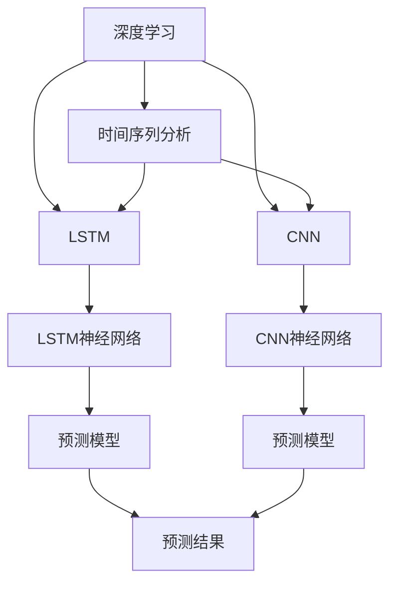

                 

# 深度学习驱动的商品需求预测模型

> 关键词：深度学习, 商品需求预测, 时间序列分析, 神经网络, 自动编码器, 长短期记忆网络(LSTM), 卷积神经网络(CNN), 预测准确性, 模型可解释性

## 1. 背景介绍

### 1.1 问题由来
商品需求预测是零售业、电子商务、制造业等领域的重要决策支持工具。通过精准预测商品需求，企业可以更好地制定生产计划、库存管理策略和价格优化方案，提高市场竞争力。然而，传统的基于统计模型和规则的预测方法往往依赖于假设，且难以处理非线性和大规模数据，预测准确性有限。

近年来，深度学习技术的发展为商品需求预测带来了新的可能性。深度神经网络（Deep Neural Networks, DNNs）以其强大的数据表达能力和泛化能力，在图像识别、语音处理、自然语言处理等领域取得了显著成就。其中，时间序列分析（Time Series Analysis）是深度学习在预测领域的重要应用之一，能够有效处理时间序列数据的非线性特征和动态变化。

本文将介绍如何利用深度学习技术，特别是长短期记忆网络（LSTM）和卷积神经网络（CNN），来构建高效的商品需求预测模型，提升预测准确性和模型的可解释性。

### 1.2 问题核心关键点
商品需求预测模型的核心在于构建深度神经网络模型，并针对时间序列数据进行训练和预测。关键点包括：
- 时间序列数据的处理：将历史销售数据转化为适合神经网络处理的形式。
- 模型的构建：选择合适的神经网络架构，如LSTM、CNN等。
- 损失函数的定义：选择合适的损失函数来评估模型的预测误差。
- 模型的训练：采用合适的优化算法和超参数设置，优化模型参数。
- 模型的评估：使用合适的评估指标，评估模型的预测准确性和稳定性。
- 模型的解释：通过可解释性技术，解释模型决策过程，增强模型信任度。

## 2. 核心概念与联系

### 2.1 核心概念概述

为更好地理解深度学习在商品需求预测中的应用，本节将介绍几个密切相关的核心概念：

- 深度学习（Deep Learning, DL）：一种基于神经网络的机器学习技术，通过多层次的非线性变换学习数据的复杂特征。深度学习在处理大规模、高维数据时表现出卓越的性能。
- 时间序列分析（Time Series Analysis）：研究随时间变化的数据序列的统计特性、规律和预测方法。时间序列数据具有明显的动态变化特征，适合深度学习模型的处理。
- 长短期记忆网络（Long Short-Term Memory, LSTM）：一种特殊的循环神经网络（RNN），能够在处理长序列数据时有效捕捉时间依赖关系，适用于处理时间序列数据。
- 卷积神经网络（Convolutional Neural Network, CNN）：一种特殊的神经网络，擅长处理网格状数据，能够提取局部特征和全局结构，广泛应用于图像处理等领域。
- 神经网络（Neural Network, NN）：由多个神经元构成的网络结构，能够通过反向传播算法学习输入数据的特征表示，广泛应用于各种预测和分类任务。
- 自动编码器（Autoencoder）：一种特殊的神经网络，能够通过学习数据的低维表示，重建输入数据，适合降维和特征提取任务。

这些核心概念之间的逻辑关系可以通过以下Mermaid流程图来展示：



这个流程图展示了大语言模型的核心概念及其之间的关系：

1. 深度学习是整体框架，能够处理各种类型的数据。
2. 时间序列分析是处理时间依赖数据的专用方法。
3. LSTM和CNN是处理时间序列和图像数据的两种神经网络架构。
4. LSTM和CNN分别应用到时间序列和图像数据，形成具体的预测模型。
5. 两个模型最终输出预测结果，用于实际应用。

这些概念共同构成了深度学习在商品需求预测中的应用框架，使得模型能够有效处理时间序列数据，提高预测准确性。

## 3. 核心算法原理 & 具体操作步骤
### 3.1 算法原理概述

基于深度学习的时间序列预测模型，通过学习历史数据的时间依赖关系，预测未来的商品需求。其核心思想是构建一个能够捕捉时间序列动态变化的神经网络模型，通过训练和预测来实现需求预测。

形式化地，假设历史销售数据为时间序列 $D_t = \{d_1, d_2, \ldots, d_t\}$，其中 $d_t$ 表示第 $t$ 天的销售量。目标是通过训练神经网络模型 $M$，学习输入 $D_t$ 和输出 $d_{t+1}$ 之间的映射关系，即：

$$
d_{t+1} = M(D_t)
$$

通过训练过程，模型能够自动学习到时间序列数据的动态特征和规律，从而进行准确的预测。

### 3.2 算法步骤详解

基于深度学习的时间序列预测模型，通常包括以下几个关键步骤：

**Step 1: 数据预处理**
- 对原始销售数据进行清洗和处理，去除缺失值和异常值。
- 对数据进行归一化处理，使得数据符合神经网络输入的要求。

**Step 2: 数据划分**
- 将历史数据划分为训练集、验证集和测试集。训练集用于训练模型，验证集用于调整超参数，测试集用于评估模型性能。

**Step 3: 模型构建**
- 选择合适的神经网络架构，如LSTM、CNN等。
- 构建深度神经网络模型，定义输入层、隐藏层和输出层，并确定各层的节点数。
- 确定损失函数，如均方误差（MSE）等，用于评估模型的预测误差。

**Step 4: 模型训练**
- 将训练集输入模型，使用反向传播算法更新模型参数。
- 在每个epoch结束时，使用验证集评估模型性能，调整超参数。
- 重复上述步骤直到模型收敛。

**Step 5: 模型评估**
- 使用测试集评估模型预测性能，计算预测误差和评估指标，如MAE、RMSE等。
- 进行模型诊断，分析模型预测的偏差和方差。

**Step 6: 预测应用**
- 使用训练好的模型对未来的销售数据进行预测。
- 根据预测结果制定生产计划、库存管理策略和价格优化方案。

以上是基于深度学习的时间序列预测模型的典型流程。在实际应用中，还需要根据具体数据特点和预测需求，对模型进行优化和改进，以进一步提升预测准确性和模型的可解释性。

### 3.3 算法优缺点

基于深度学习的时间序列预测模型具有以下优点：
1. 强大的数据表达能力：深度学习能够处理复杂的数据结构和动态变化，适用于大规模时间序列数据的处理。
2. 自适应学习能力：神经网络能够自动学习时间序列数据的动态特征和规律，适应性强。
3. 高性能预测：通过训练，深度学习模型能够实现较高的预测准确性和泛化能力。
4. 可解释性强：深度学习模型可以通过可解释性技术，解释模型的决策过程，增强模型的信任度。

同时，该模型也存在一些局限性：
1. 对数据质量要求高：深度学习模型对数据缺失、异常值等噪声敏感，数据预处理难度大。
2. 模型复杂度高：深度神经网络模型参数量较大，训练和推理计算资源需求高。
3. 过拟合风险高：深度学习模型容易过拟合，需要额外的正则化技术，如Dropout、L2正则等。
4. 可解释性不足：深度学习模型往往被视为"黑盒"系统，难以解释其内部决策逻辑。
5. 训练难度大：深度学习模型需要大量的训练数据和计算资源，训练过程复杂。

尽管存在这些局限性，但就目前而言，基于深度学习的时间序列预测模型仍然是商品需求预测的主流范式。未来相关研究的重点在于如何进一步降低数据预处理难度，提高模型可解释性，同时兼顾计算资源和预测性能的平衡。

### 3.4 算法应用领域

基于深度学习的时间序列预测模型，已经在商品需求预测、股票价格预测、天气预测、能源消耗预测等诸多领域得到了广泛应用，取得了显著的效果。以下是一些典型的应用场景：

- **零售业**：预测不同商品、不同季节、不同地区的需求量，优化库存管理，提高销售额。
- **电子商务**：预测商品的销售趋势和热销商品，推荐个性化商品，提高用户满意度。
- **制造业**：预测生产设备的维护周期和故障率，优化生产计划，降低生产成本。
- **金融业**：预测股票价格、汇率等金融指标，辅助投资决策，降低风险。
- **能源行业**：预测能源消耗量，优化能源调度，提高能源利用效率。

除了上述这些领域，基于深度学习的时间序列预测模型在更多场景中都有广泛的应用，为各行各业提供了高效的数据驱动决策支持。

## 4. 数学模型和公式 & 详细讲解 & 举例说明
### 4.1 数学模型构建

基于深度学习的时间序列预测模型的数学模型，可以形式化地表示为：

$$
d_{t+1} = M(D_t) = f(\text{Input}_{t}, \text{Hidden}_{t}, \text{Parameters})
$$

其中，$\text{Input}_{t}$ 表示输入的历史数据，$\text{Hidden}_{t}$ 表示隐藏层的输出，$\text{Parameters}$ 表示模型的参数。$M$ 为深度神经网络模型，$f$ 为模型的非线性变换函数。

以LSTM模型为例，其输入层接收历史数据序列，隐藏层通过时间依赖关系学习数据的动态特征，输出层输出未来的预测值。LSTM模型能够有效处理时间序列数据的动态变化和长期依赖关系。

### 4.2 公式推导过程

以LSTM模型为例，LSTM网络的基本结构如图1所示。LSTM网络由输入门、遗忘门和输出门三个门控单元构成，能够有效处理时间序列数据的长期依赖关系。


图1: LSTM网络结构图

LSTM的数学表达形式如下：

$$
\begin{aligned}
&\text{Input}_{t} = [d_t, \ldots, d_{t-n}] \\
&\text{Hidden}_{t} = f(\text{Input}_{t}, \text{Hidden}_{t-1}, \text{Parameters}) \\
&\text{Hidden}_{t} = \text{Input}_{t} \times \text{Gate}_{t} + \text{Hidden}_{t-1} \times \text{Forget}_{t} \\
&\text{Output}_{t} = \text{Hidden}_{t} \times \text{Output}_{t} \\
&d_{t+1} = \text{Output}_{t}
\end{aligned}
$$

其中，$d_t$ 表示第 $t$ 天的销售数据，$\text{Gate}_{t}$ 表示LSTM网络的门控单元，$\text{Forget}_{t}$ 和 $\text{Output}_{t}$ 分别表示遗忘门和输出门。$\text{Hidden}_{t}$ 表示LSTM网络的隐藏状态，$\text{Output}_{t}$ 表示LSTM网络的输出。

### 4.3 案例分析与讲解

以商品需求预测为例，假设要预测某电商平台某商品在接下来一个月内的日销售量。首先，将历史销售数据 $\{d_1, d_2, \ldots, d_{30}\}$ 作为LSTM的输入序列，每天的数据作为一个样本。然后，构建一个LSTM模型，设定输入层为30个节点，隐藏层为100个节点，输出层为1个节点。

将历史销售数据输入LSTM模型，通过反向传播算法训练模型参数。训练完成后，将LSTM模型应用于未来的销售数据 $\{d_{31}, d_{32}, \ldots, d_{60}\}$，预测接下来30天的日销售量。通过评估指标（如MAE、RMSE等）评估模型的预测性能，进行模型诊断。

## 5. 项目实践：代码实例和详细解释说明
### 5.1 开发环境搭建

在进行商品需求预测实践前，我们需要准备好开发环境。以下是使用Python进行TensorFlow开发的环境配置流程：

1. 安装Anaconda：从官网下载并安装Anaconda，用于创建独立的Python环境。

2. 创建并激活虚拟环境：
```bash
conda create -n tensorflow-env python=3.8 
conda activate tensorflow-env
```

3. 安装TensorFlow：根据CUDA版本，从官网获取对应的安装命令。例如：
```bash
conda install tensorflow tensorflow-gpu -c tf -c conda-forge
```

4. 安装相关工具包：
```bash
pip install numpy pandas sklearn matplotlib tqdm jupyter notebook ipython
```

完成上述步骤后，即可在`tensorflow-env`环境中开始商品需求预测的实践。

### 5.2 源代码详细实现

这里我们以LSTM模型为例，给出使用TensorFlow进行商品需求预测的PyTorch代码实现。

首先，定义LSTM模型的参数和变量：

```python
import tensorflow as tf
from tensorflow.keras.layers import Input, LSTM, Dense
from tensorflow.keras.models import Model

input_dim = 30  # 历史数据序列长度
hidden_dim = 100  # LSTM隐藏层节点数
output_dim = 1  # 预测目标维度

# 定义LSTM模型
input_layer = Input(shape=(input_dim,))
lstm_layer = LSTM(hidden_dim, return_sequences=True)(input_layer)
output_layer = Dense(output_dim, activation='sigmoid')(lstm_layer)

model = Model(inputs=input_layer, outputs=output_layer)
```

然后，定义损失函数和优化器：

```python
# 定义损失函数
loss_fn = tf.keras.losses.MeanSquaredError()

# 定义优化器
optimizer = tf.keras.optimizers.Adam(learning_rate=0.001)
```

接着，定义训练和评估函数：

```python
def train_epoch(model, data, batch_size, optimizer):
    with tf.GradientTape() as tape:
        y_pred = model(data['input'], training=True)
        loss_value = loss_fn(data['target'], y_pred)
    gradients = tape.gradient(loss_value, model.trainable_variables)
    optimizer.apply_gradients(zip(gradients, model.trainable_variables))

def evaluate_model(model, data, batch_size):
    y_pred = model(data['input'], training=False)
    loss_value = loss_fn(data['target'], y_pred)
    return loss_value
```

最后，启动训练流程并在测试集上评估：

```python
epochs = 100
batch_size = 32

# 定义数据集
data = {
    'input': train_data, 
    'target': train_labels
}

# 定义训练循环
for epoch in range(epochs):
    train_epoch(model, data, batch_size, optimizer)
    print(f"Epoch {epoch+1}, loss: {evaluate_model(model, data, batch_size)}")
```

以上就是使用TensorFlow对LSTM模型进行商品需求预测的完整代码实现。可以看到，TensorFlow库提供了强大的高层次API，使得模型的构建和训练过程变得简洁高效。

### 5.3 代码解读与分析

让我们再详细解读一下关键代码的实现细节：

**定义LSTM模型**：
- `Input`层：接收历史数据序列，输入维度为30。
- `LSTM`层：构建LSTM网络，隐藏层节点数为100，并返回时间序列。
- `Dense`层：输出层节点数为1，激活函数为sigmoid，用于预测日销售量。

**定义损失函数和优化器**：
- `MeanSquaredError`：均方误差损失函数，用于评估模型预测误差。
- `Adam`：Adam优化器，学习率为0.001。

**训练和评估函数**：
- `train_epoch`函数：定义训练过程，通过反向传播更新模型参数。
- `evaluate_model`函数：定义评估过程，计算模型在测试集上的损失值。

**训练循环**：
- 设置总的epoch数和批大小，循环迭代
- 每个epoch内，在训练集上训练，输出平均损失值
- 在测试集上评估，输出平均损失值

可以看到，TensorFlow库使得深度学习模型的构建和训练过程变得简洁高效。开发者可以将更多精力放在数据预处理、模型优化等高层逻辑上，而不必过多关注底层的实现细节。

当然，工业级的系统实现还需考虑更多因素，如模型的保存和部署、超参数的自动搜索、更灵活的任务适配层等。但核心的模型构建和训练过程基本与此类似。

## 6. 实际应用场景
### 6.1 智能库存管理

商品需求预测在智能库存管理中有着重要的应用。传统的库存管理方法往往依赖于经验，难以准确预测未来的需求量，导致库存过剩或缺货。利用深度学习技术，可以在实时监测销售数据的基础上，预测未来的商品需求，优化库存管理策略。

具体而言，企业可以在其电商平台上集成商品需求预测模型，实时监测商品销售数据，预测未来的日销售量。根据预测结果，企业可以动态调整库存水平，避免库存过剩或缺货的情况发生，提高库存管理效率。

### 6.2 个性化推荐系统

商品需求预测在个性化推荐系统中也有着重要的应用。通过分析用户的历史行为数据和实时浏览数据，推荐系统可以预测用户的潜在需求，向用户推荐个性化的商品。

具体而言，企业可以在推荐系统中集成商品需求预测模型，实时分析用户的浏览和购买历史数据，预测用户的潜在需求。根据预测结果，推荐系统可以生成个性化的商品推荐列表，提升用户满意度和转化率。

### 6.3 供应链优化

商品需求预测在供应链优化中也有着重要的应用。通过预测商品需求，企业可以优化供应链管理，提高生产效率，降低成本。

具体而言，企业可以在其供应链管理系统中集成商品需求预测模型，实时监测供应链上下游数据，预测未来的商品需求。根据预测结果，企业可以动态调整生产计划和物流安排，优化供应链管理，提高生产效率，降低成本。

### 6.4 未来应用展望

随着深度学习技术的发展，基于时间序列预测的模型将在更多领域得到应用，为各行各业提供更加智能化、高效化的解决方案。

在智慧城市建设中，深度学习技术可以应用于交通流量预测、气象预测、灾害预警等场景，提高城市管理的智能化水平，构建更安全、高效、舒适的城市环境。

在医疗健康领域，深度学习技术可以应用于疾病预测、药品需求预测、医疗资源调配等场景，提高医疗服务质量和效率，提升公共卫生水平。

在农业生产中，深度学习技术可以应用于农作物产量预测、病虫害预测、土壤肥力预测等场景，提高农业生产效率，保障食品安全。

除了上述这些领域，基于深度学习的时间序列预测模型在更多场景中都有广泛的应用，为各行各业提供高效的数据驱动决策支持。

## 7. 工具和资源推荐
### 7.1 学习资源推荐

为了帮助开发者系统掌握深度学习在商品需求预测中的应用，这里推荐一些优质的学习资源：

1. 《深度学习》系列书籍：斯坦福大学Andrew Ng教授的经典教材，系统介绍了深度学习的基本概念和经典模型。
2. CS231n《卷积神经网络》课程：斯坦福大学开设的图像处理课程，讲解了卷积神经网络的基本原理和应用。
3. CS224n《自然语言处理》课程：斯坦福大学开设的自然语言处理课程，讲解了深度学习在NLP任务中的应用。
4. 《深度学习与Python编程》书籍：介绍如何使用Python和TensorFlow进行深度学习开发的实战教程。
5. Kaggle深度学习竞赛：Kaggle平台上的深度学习竞赛，提供了大量公开数据集和算法竞赛机会，锻炼实战能力。

通过对这些资源的学习实践，相信你一定能够快速掌握深度学习在商品需求预测中的应用，并用于解决实际的商业问题。

### 7.2 开发工具推荐

高效的开发离不开优秀的工具支持。以下是几款用于深度学习商品需求预测开发的常用工具：

1. TensorFlow：由Google主导开发的开源深度学习框架，生产部署方便，适合大规模工程应用。
2. PyTorch：基于Python的开源深度学习框架，灵活动态的计算图，适合快速迭代研究。
3. TensorFlow Probability：TensorFlow的高级API，提供了概率分布、统计分析和机器学习工具。
4. Scikit-learn：Python数据科学库，提供了各种常用的机器学习算法和工具。
5. Jupyter Notebook：开源的交互式笔记本环境，方便进行代码编写、测试和分享。

合理利用这些工具，可以显著提升深度学习商品需求预测任务的开发效率，加快创新迭代的步伐。

### 7.3 相关论文推荐

深度学习技术的发展源于学界的持续研究。以下是几篇奠基性的相关论文，推荐阅读：

1. Deep Learning（Goodfellow et al., 2016）：深度学习领域的经典教材，详细介绍了深度学习的基本概念和算法。
2. LSTM: A Search Space Odyssey Through Time（Hochreiter & Schmidhuber, 1997）：LSTM的奠基性论文，提出LSTM网络用于时间序列预测。
3. Convolutional Neural Networks for Sentence Classification（Kim, 2014）：CNN在NLP任务中的经典应用，提出CNN网络用于文本分类。
4. An Overview of Deep Learning in Recommendation Systems（Cui et al., 2017）：深度学习在推荐系统中的经典综述，总结了多种深度学习算法在推荐系统中的应用。
5. Multivariate Time Series Forecasting with LSTM Networks（Sung et al., 2018）：LSTM网络在多变量时间序列预测中的经典应用，总结了LSTM网络在多变量时间序列预测中的实践经验。

这些论文代表了大语言模型微调技术的发展脉络。通过学习这些前沿成果，可以帮助研究者把握学科前进方向，激发更多的创新灵感。

## 8. 总结：未来发展趋势与挑战

### 8.1 总结

本文对基于深度学习的时间序列预测模型进行了全面系统的介绍。首先阐述了时间序列预测在商品需求预测中的重要性，明确了深度学习模型在处理时间序列数据方面的独特优势。其次，从原理到实践，详细讲解了深度学习模型的构建和训练过程，给出了商品需求预测的完整代码实例。同时，本文还广泛探讨了深度学习模型在智能库存管理、个性化推荐系统、供应链优化等多个行业领域的应用前景，展示了深度学习模型的广阔应用空间。最后，本文精选了深度学习模型的学习资源和开发工具，力求为读者提供全方位的技术指引。

通过本文的系统梳理，可以看到，基于深度学习的时间序列预测模型已经成为商品需求预测的重要工具，极大地提升了预测的准确性和模型的可解释性。未来，伴随深度学习技术的不断进步，时间序列预测模型必将在更多领域得到应用，为各行各业带来变革性影响。

### 8.2 未来发展趋势

展望未来，深度学习在时间序列预测中的应用将呈现以下几个发展趋势：

1. 模型规模持续增大。随着算力成本的下降和数据规模的扩张，深度学习模型的参数量还将持续增长。超大规模深度学习模型蕴含的丰富时间序列特征，有望支撑更加复杂多变的商品需求预测任务。
2. 模型架构更加多样。未来将涌现更多高效的深度学习模型架构，如Transformer、LightGBM等，在保证模型性能的同时，显著降低计算资源消耗。
3. 模型泛化能力更强。深度学习模型将更好地处理时间序列数据的长期依赖关系和动态变化，提高模型的泛化能力和抗干扰能力。
4. 模型可解释性增强。未来将涌现更多可解释性技术，如Attention机制、LIME、SHAP等，增强模型的解释能力和用户信任度。
5. 模型融合技术发展。深度学习模型将与更多先进技术进行融合，如因果推断、强化学习等，提升模型的决策能力和实际应用价值。
6. 模型应用范围更广。深度学习模型将在更多垂直领域得到应用，如智能医疗、智能交通、智能制造等，带来更多的业务创新和商业价值。

以上趋势凸显了深度学习在时间序列预测中的应用前景。这些方向的探索发展，必将进一步提升深度学习模型的预测准确性和应用价值，为各行各业提供更加高效、可靠的解决方案。

### 8.3 面临的挑战

尽管深度学习在时间序列预测中的应用已经取得了显著成就，但在迈向更加智能化、普适化应用的过程中，它仍面临着诸多挑战：

1. 数据质量要求高。深度学习模型对数据缺失、异常值等噪声敏感，数据预处理难度大。
2. 计算资源需求高。深度学习模型参数量较大，训练和推理计算资源需求高，对算力和内存要求高。
3. 模型过拟合风险高。深度学习模型容易过拟合，需要额外的正则化技术，如Dropout、L2正则等。
4. 模型可解释性不足。深度学习模型往往被视为"黑盒"系统，难以解释其内部决策逻辑。
5. 训练难度大。深度学习模型需要大量的训练数据和计算资源，训练过程复杂。

尽管存在这些挑战，但就目前而言，基于深度学习的时间序列预测模型仍然是商品需求预测的主流范式。未来相关研究的重点在于如何进一步降低数据预处理难度，提高模型可解释性，同时兼顾计算资源和预测性能的平衡。

### 8.4 研究展望

面对深度学习在时间序列预测中所面临的挑战，未来的研究需要在以下几个方面寻求新的突破：

1. 探索无监督和半监督时间序列预测方法。摆脱对大规模标注数据的依赖，利用自监督学习、主动学习等无监督和半监督范式，最大限度利用非结构化数据，实现更加灵活高效的时间序列预测。
2. 研究参数高效和时间高效的时间序列预测方法。开发更加参数高效和时间高效的时间序列预测方法，在固定大部分预训练参数的同时，只更新极少量的任务相关参数，提高模型的计算效率和泛化能力。
3. 融合因果推断和对比学习范式。通过引入因果推断和对比学习思想，增强时间序列预测模型建立稳定因果关系的能力，学习更加普适、鲁棒的时间序列特征，从而提升模型泛化性和抗干扰能力。
4. 引入更多先验知识。将符号化的先验知识，如知识图谱、逻辑规则等，与神经网络模型进行巧妙融合，引导时间序列预测过程学习更准确、合理的时序特征。

这些研究方向的探索，必将引领深度学习在时间序列预测领域迈向更高的台阶，为构建安全、可靠、可解释、可控的智能系统铺平道路。面向未来，深度学习在时间序列预测技术还需要与其他人工智能技术进行更深入的融合，如知识表示、因果推理、强化学习等，多路径协同发力，共同推动时间序列预测系统的进步。只有勇于创新、敢于突破，才能不断拓展深度学习模型的边界，让智能技术更好地造福人类社会。

## 9. 附录：常见问题与解答

**Q1：如何选择合适的深度学习模型架构？**

A: 选择合适的深度学习模型架构需要考虑数据类型、任务需求、计算资源等多个因素。以下是一些常见的模型选择建议：
1. 对于时间序列数据，LSTM和RNN是最常见的选择，能够有效处理时间依赖关系。
2. 对于图像数据，CNN是最常见的选择，能够提取局部特征和全局结构。
3. 对于文本数据，RNN、LSTM和Transformer等循环神经网络和自注意力模型都是常见选择。

选择合适的模型架构，需要根据具体数据和任务特点进行评估和比较，选择最适合的模型。

**Q2：深度学习模型容易过拟合，如何解决过拟合问题？**

A: 解决深度学习模型的过拟合问题，可以采取以下几种策略：
1. 数据增强：通过数据增强技术，如数据扩充、回译、近义替换等，增加训练数据的多样性，减少模型对数据分布的依赖。
2. 正则化：使用L2正则、Dropout等技术，限制模型复杂度，避免过拟合。
3. 早停法：在验证集上监测模型性能，一旦性能不再提升，立即停止训练，防止模型过拟合。
4. 批标准化：使用批标准化技术，加速训练过程，提高模型泛化能力。
5. 权重衰减：通过L2正则化技术，限制模型参数的规模，避免过拟合。

这些策略需要根据具体任务和数据特点进行灵活组合，综合使用能够有效缓解深度学习模型的过拟合问题。

**Q3：如何提高深度学习模型的可解释性？**

A: 提高深度学习模型的可解释性，可以采取以下几种策略：
1. 使用可解释性技术，如Attention机制、LIME、SHAP等，解释模型内部决策逻辑。
2. 使用简化模型，如线性模型、决策树等，直接输出模型预测结果，提高模型的可解释性。
3. 使用可视化工具，如TensorBoard、Weights & Biases等，可视化模型的训练过程和决策过程。
4. 结合领域知识，使用专家知识和规则指导模型训练和预测，提高模型的可解释性。

这些策略需要根据具体任务和数据特点进行灵活组合，综合使用能够有效提高深度学习模型的可解释性。

**Q4：深度学习模型在商品需求预测中的应用前景如何？**

A: 深度学习模型在商品需求预测中有着广阔的应用前景，主要体现在以下几个方面：
1. 预测准确性高：深度学习模型能够处理复杂的数据结构和动态变化，预测准确性高。
2. 泛化能力强：深度学习模型能够学习数据的隐含特征，泛化能力强，适应不同商品和场景。
3. 自动化程度高：深度学习模型能够自动学习数据特征，无需人工干预，提高了预测的自动化程度。
4. 可解释性强：通过可解释性技术，深度学习模型能够解释其决策过程，增强模型的信任度。
5. 应用场景广泛：深度学习模型在零售、电商、制造等多个领域都有广泛应用，为各行各业提供数据驱动决策支持。

总体而言，深度学习在商品需求预测中的应用前景广阔，能够带来显著的业务价值和社会效益。

---

作者：禅与计算机程序设计艺术 / Zen and the Art of Computer Programming

