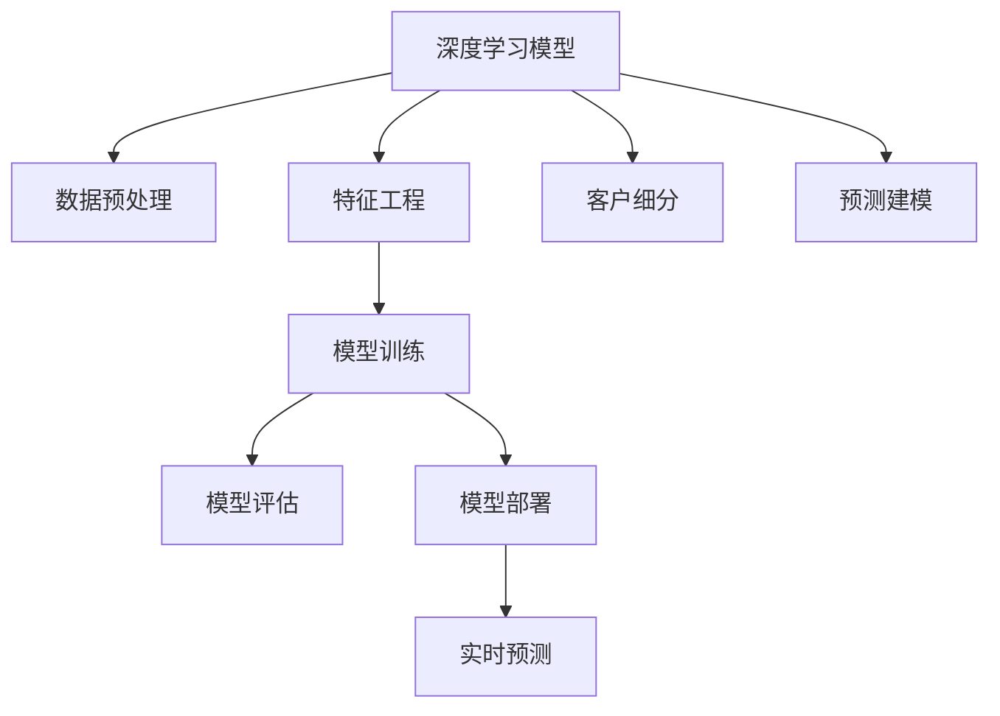

                 

# 深度学习驱动的电商用户终身价值预测模型

> 关键词：用户终身价值，深度学习模型，电商数据分析，预测建模，客户细分

## 1. 背景介绍

### 1.1 问题由来

在电商行业，用户获取成本不断攀升，但用户流失率也在不断上升，如何提升用户终身价值（Customer Lifetime Value, CLV）成为电商企业关注的重点。用户终身价值是指一个用户在其生命周期内给企业带来的所有收益之和，包括购买次数、购买金额、忠诚度等。提升用户终身价值可以显著提高企业的盈利能力。

传统上，提升用户终身价值的方法主要是通过市场营销和客户服务来提高用户的忠诚度和复购率。但这些方法的效果受到市场环境、客户需求变化等因素的影响，不够稳定可靠。近年来，深度学习技术在电商领域得到广泛应用，通过数据挖掘和预测建模，深度学习模型能够精准地预测用户行为，帮助企业更有效地进行市场细分和个性化营销。

### 1.2 问题核心关键点

用户终身价值预测是大数据分析领域的一个重要问题。其主要关注点包括：

- 如何通过深度学习模型预测用户未来行为，特别是复购概率和购买金额。
- 如何利用用户历史行为数据，结合模型预测结果，对用户进行细分，制定针对性的营销策略。
- 如何应对多维度数据的复杂性和高维性，选择合适的模型结构。
- 如何在保证模型泛化能力的同时，提高计算效率，降低成本。
- 如何通过模型结果进行实时决策，优化营销效果。

这些问题构成了用户终身价值预测的核心挑战。本文将重点介绍基于深度学习的用户终身价值预测模型，讨论其核心算法原理、操作步骤、优化方法及其在电商数据分析中的应用。

## 2. 核心概念与联系

### 2.1 核心概念概述

为更好地理解深度学习模型在用户终身价值预测中的应用，本节将介绍几个关键概念及其相互联系：

- 深度学习（Deep Learning）：一类基于神经网络的机器学习技术，通过多层非线性变换，能够处理和分析复杂的多维数据。
- 用户终身价值（Customer Lifetime Value, CLV）：一个用户在生命周期内对企业产生的所有收益之和，包括购买金额、复购次数等。
- 客户细分（Customer Segmentation）：将客户群体划分为不同的细分市场，根据其不同特征制定针对性的营销策略。
- 预测建模（Predictive Modeling）：使用历史数据和模型算法预测未来事件或结果，包括回归、分类、时序预测等。
- 神经网络（Neural Network）：深度学习模型的核心，由多个神经元层组成，能够通过反向传播算法进行参数优化。
- 梯度下降（Gradient Descent）：一种常用的优化算法，通过迭代更新模型参数，最小化损失函数。
- 激活函数（Activation Function）：神经网络中的非线性变换函数，如ReLU、Sigmoid、Tanh等。
- 损失函数（Loss Function）：用于衡量模型预测结果与实际结果之间的差异，常见的有均方误差（Mean Squared Error, MSE）、交叉熵（Cross-Entropy, CE）等。

这些概念构成了深度学习模型用户终身价值预测的基础框架，通过它们之间的相互联系，形成了一个完整的预测系统。

### 2.2 核心概念原理和架构的 Mermaid 流程图



这个流程图展示了深度学习模型用户终身价值预测的总体架构，其中各个节点表示模型中不同的阶段和组件。

- A: 深度学习模型：基于神经网络的结构，用于处理和分析电商数据，预测用户终身价值。
- B: 数据预处理：包括数据清洗、归一化、编码等，使原始数据适于模型输入。
- C: 特征工程：对数据进行特征提取和选择，构建模型输入特征集。
- D: 模型训练：使用训练数据集对模型进行参数优化，最小化损失函数。
- E: 模型评估：使用验证集和测试集对模型进行性能评估，选择合适的超参数。
- F: 模型部署：将训练好的模型集成到实际应用系统中，进行实时预测。
- G: 实时预测：根据用户行为数据，实时预测用户终身价值，支持动态决策。
- H: 客户细分：对用户进行分组，以便制定更精准的营销策略。
- I: 预测建模：使用历史数据和模型算法预测用户终身价值，涵盖回归、分类、时序预测等多种类型。

通过这个架构，可以清晰地看到深度学习模型在用户终身价值预测中的各个关键环节。

## 3. 核心算法原理 & 具体操作步骤
### 3.1 算法原理概述

用户终身价值预测的核心算法是深度学习模型。深度学习模型通过多层神经网络结构，能够对复杂的电商数据进行建模，预测用户行为和价值。其中，常见的深度学习模型包括全连接神经网络、卷积神经网络（CNN）、循环神经网络（RNN）、长短期记忆网络（LSTM）、Transformer等。

本节将以长短期记忆网络（LSTM）模型为例，介绍用户终身价值预测的基本原理和操作步骤。LSTM是一种特殊的RNN结构，能够处理序列数据，特别适合处理用户行为数据。

### 3.2 算法步骤详解

用户终身价值预测的深度学习模型训练步骤通常包括以下几个关键步骤：

**Step 1: 数据预处理**

数据预处理是深度学习模型训练的第一步，其目的是清洗和准备数据，使其适于模型输入。具体步骤包括：

1. 数据清洗：删除或填补缺失值、异常值，去除重复记录。
2. 数据归一化：对数值型数据进行标准化或归一化处理，如将数据缩放到0-1或-1到1之间。
3. 特征编码：对分类数据进行独热编码（One-Hot Encoding），使其适于模型输入。
4. 数据划分：将数据集划分为训练集、验证集和测试集，一般采用70:15:15的比例。

**Step 2: 特征工程**

特征工程是深度学习模型训练的核心环节，其目的是提取和选择最具有预测力的特征，构建模型输入特征集。具体步骤包括：

1. 特征选择：选择对用户终身价值预测有显著影响的特征，如购买金额、复购次数、时间间隔等。
2. 特征变换：对特征进行变换，如对数值型特征进行对数变换、对数基底变换等，使其更符合模型假设。
3. 特征交叉：构造特征组合，如购买金额与复购次数的交叉特征，增强模型的预测能力。
4. 特征降维：使用PCA、LDA等降维技术，减少特征维度，提高模型效率。

**Step 3: 模型构建与训练**

模型构建与训练是深度学习模型训练的关键步骤，其目的是选择合适的模型结构，通过训练数据优化模型参数。具体步骤包括：

1. 模型选择：选择适当的深度学习模型，如LSTM、CNN等。
2. 模型初始化：设置模型的超参数，如层数、节点数、激活函数等。
3. 模型训练：使用训练数据集对模型进行参数优化，最小化损失函数。
4. 正则化：使用L2正则、Dropout等技术，防止过拟合。
5. 模型验证：使用验证集对模型进行性能评估，选择最优模型。

**Step 4: 模型评估**

模型评估是深度学习模型训练的重要环节，其目的是评估模型的泛化能力和性能指标。具体步骤包括：

1. 性能指标：选择合适的性能指标，如均方误差（MSE）、平均绝对误差（MAE）、准确率（Accuracy）等。
2. 模型评估：使用测试集对模型进行性能评估，计算性能指标。
3. 模型调优：根据模型评估结果，调整超参数和模型结构，提高模型性能。

**Step 5: 模型部署**

模型部署是深度学习模型训练的最后一个步骤，其目的是将训练好的模型集成到实际应用系统中，进行实时预测。具体步骤包括：

1. 模型保存：将训练好的模型保存为文件，便于后续部署。
2. 模型集成：将模型集成到应用系统中，如电商数据分析平台。
3. 实时预测：根据用户行为数据，实时预测用户终身价值，支持动态决策。
4. 监控与优化：实时监测模型预测结果，优化模型参数，提高模型性能。

通过上述步骤，可以构建一个完整的深度学习模型用户终身价值预测系统。

### 3.3 算法优缺点

深度学习模型用户终身价值预测的优点包括：

1. 强大的特征提取能力：深度学习模型能够自动学习数据中的复杂特征，适用于高维数据。
2. 自适应性强：深度学习模型能够适应不同类型和规模的数据，具有较强的泛化能力。
3. 实时预测能力：深度学习模型能够实时预测用户行为，支持动态决策。

其缺点包括：

1. 计算资源需求高：深度学习模型参数量大，计算复杂度高，需要高性能计算资源。
2. 模型解释性差：深度学习模型通常被认为是"黑箱"模型，难以解释其内部工作机制和预测结果。
3. 过拟合风险高：深度学习模型容易过拟合训练数据，需要正则化和验证等技术防止过拟合。

尽管存在这些缺点，但深度学习模型在用户终身价值预测中的应用效果显著，已广泛应用于电商数据分析、客户细分、个性化推荐等领域。未来，研究者仍需进一步优化深度学习模型，提高其计算效率和可解释性，拓展其在实际应用中的广泛性和实用性。

### 3.4 算法应用领域

深度学习模型用户终身价值预测的应用领域广泛，涵盖电商、金融、医疗等多个行业。以下是几个典型应用场景：

1. 电商数据分析：根据用户历史购买记录、浏览行为等数据，预测用户未来购买概率和金额，支持精准营销和库存管理。
2. 客户细分：根据用户历史行为数据，将用户分成不同的细分市场，制定针对性的营销策略，提升用户满意度。
3. 个性化推荐：根据用户历史行为数据和当前行为数据，实时推荐商品，提高用户购买率和满意度。
4. 风控管理：根据用户历史行为数据，预测用户违约概率，进行风险管理和信用评估。
5. 健康管理：根据用户历史健康数据，预测未来健康状况，提供个性化健康建议和医疗服务。

这些应用场景展示了深度学习模型在电商数据分析中的强大潜力和广泛应用前景。

## 4. 数学模型和公式 & 详细讲解
### 4.1 数学模型构建

用户终身价值预测的深度学习模型通常采用LSTM结构，其数学模型可形式化为：

$$
h_t = \tanh(W_{h} \cdot [h_{t-1}, x_t] + b_h)
$$

$$
c_t = \sigma(W_{c} \cdot [h_{t-1}, x_t] + b_c)
$$

$$
\tilde{c_t} = \tanh(W_{x} \cdot x_t + b_x)
$$

$$
c_t = f_{c} \cdot c_{t-1} + i_{c} \cdot \tilde{c_t}
$$

$$
h_t = \sigma(W_{h} \cdot [c_t, x_t] + b_h)
$$

其中，$h_t$和$c_t$分别为LSTM模型在时间步$t$的状态向量和细胞状态向量，$x_t$为时间步$t$的输入特征向量，$W_{h}$、$W_{c}$、$W_{x}$为模型参数。

### 4.2 公式推导过程

LSTM模型的核心是细胞状态向量$c_t$，用于存储和传递信息。其推导过程如下：

- 输入门$f_{c}$：根据当前输入和上一时刻的细胞状态，计算当前时刻的输入门输出，决定是否接受当前输入。
- 遗忘门$i_{c}$：根据当前输入和上一时刻的细胞状态，计算当前时刻的遗忘门输出，决定是否遗忘上一时刻的细胞状态。
- 更新门$\tilde{c_t}$：根据当前输入，计算当前时刻的更新门输出，决定当前时刻的细胞状态更新量。
- 输出门$h_t$：根据当前时刻的细胞状态和输入特征向量，计算当前时刻的输出向量。

通过这些门的计算，LSTM模型能够在处理序列数据时，捕捉到时间依赖性和长程依赖性，从而更好地预测用户终身价值。

### 4.3 案例分析与讲解

下面以一个简单的用户购买行为预测为例，展示LSTM模型的应用过程：

假设用户购买行为序列为$x_t = [1, 2, 3, 4, 5]$，其中每个数字表示用户在某个时间步的购买金额。使用LSTM模型对用户购买行为进行预测，其步骤如下：

1. 初始化状态向量$h_0$和$c_0$，通常使用0向量。
2. 根据当前输入$x_t$和上一时刻的状态向量$h_{t-1}$，计算当前时刻的状态向量$h_t$和细胞状态向量$c_t$。
3. 根据当前时刻的状态向量$h_t$，预测用户未来行为，如是否购买、购买金额等。

具体实现时，可以将用户购买行为序列作为LSTM模型的输入，预测用户在下一个时间步的购买行为。例如，输入序列为$x_t = [1, 2, 3]$，使用LSTM模型预测用户第4个时间步的购买行为，输出为$x_{4} = [5]$，表示用户将在第4个时间步购买金额为5的货物。

## 5. 项目实践：代码实例和详细解释说明
### 5.1 开发环境搭建

在开始项目实践前，需要准备好开发环境。以下是使用Python进行TensorFlow开发的开发环境配置流程：

1. 安装Anaconda：从官网下载并安装Anaconda，用于创建独立的Python环境。

2. 创建并激活虚拟环境：
```bash
conda create -n tf-env python=3.8 
conda activate tf-env
```

3. 安装TensorFlow：根据CUDA版本，从官网获取对应的安装命令。例如：
```bash
conda install tensorflow=2.6 -c conda-forge -c pypi
```

4. 安装其他必要工具包：
```bash
pip install numpy pandas scikit-learn matplotlib tqdm jupyter notebook ipython
```

完成上述步骤后，即可在`tf-env`环境中开始项目实践。

### 5.2 源代码详细实现

下面以用户购买行为预测为例，展示使用TensorFlow实现LSTM模型的代码实现。

首先，定义LSTM模型的结构：

```python
import tensorflow as tf

class LSTMModel(tf.keras.Model):
    def __init__(self, input_dim, hidden_dim, output_dim):
        super(LSTMModel, self).__init__()
        self.hidden_dim = hidden_dim
        self.lstm = tf.keras.layers.LSTM(hidden_dim, return_sequences=True)
        self.dense = tf.keras.layers.Dense(output_dim, activation='sigmoid')
        
    def call(self, inputs, hidden_state=None):
        outputs, state = self.lstm(inputs, initial_state=hidden_state)
        predictions = self.dense(outputs[:, -1, :])
        return predictions, state
```

然后，定义模型训练的损失函数和优化器：

```python
model = LSTMModel(input_dim=1, hidden_dim=64, output_dim=1)

loss_fn = tf.keras.losses.BinaryCrossentropy(from_logits=True)
optimizer = tf.keras.optimizers.Adam(learning_rate=0.001)
```

接着，定义训练和评估函数：

```python
def train_step(inputs, targets, hidden_state=None):
    with tf.GradientTape() as tape:
        predictions, new_hidden_state = model(inputs, hidden_state)
        loss = loss_fn(targets, predictions)
    gradients = tape.gradient(loss, model.trainable_variables)
    optimizer.apply_gradients(zip(gradients, model.trainable_variables))
    return loss, new_hidden_state

def evaluate_step(inputs, targets, hidden_state):
    predictions, new_hidden_state = model(inputs, hidden_state)
    loss = loss_fn(targets, predictions)
    return loss, predictions, new_hidden_state
```

最后，启动模型训练和评估：

```python
epochs = 10
batch_size = 32

for epoch in range(epochs):
    total_loss = 0
    for i in range(0, len(train_dataset), batch_size):
        batch_inputs, batch_targets = train_dataset[i:i+batch_size]
        batch_hidden_state = None
        batch_loss, new_hidden_state = train_step(batch_inputs, batch_targets, batch_hidden_state)
        total_loss += batch_loss
    print(f'Epoch {epoch+1}, Loss: {total_loss/len(train_dataset):.4f}')

    for i in range(0, len(dev_dataset), batch_size):
        batch_inputs, batch_targets = dev_dataset[i:i+batch_size]
        batch_hidden_state = None
        batch_loss, predictions, new_hidden_state = evaluate_step(batch_inputs, batch_targets, batch_hidden_state)
    print(f'Epoch {epoch+1}, Dev Loss: {batch_loss:.4f}, Predictions: {predictions:.4f}')
```

以上就是使用TensorFlow实现LSTM模型用户购买行为预测的完整代码实现。可以看到，TensorFlow提供了丰富的模型构建和训练接口，使深度学习模型的开发和训练变得简单易行。

### 5.3 代码解读与分析

让我们再详细解读一下关键代码的实现细节：

**LSTMModel类**：
- `__init__`方法：初始化LSTM模型的参数，包括输入维度、隐藏层维度和输出维度。
- `call`方法：定义模型的前向传播过程，返回预测结果和隐藏状态。

**train_step和evaluate_step函数**：
- `train_step`函数：定义模型在训练过程中的一个完整步骤，包括计算损失、反向传播、参数更新等。
- `evaluate_step`函数：定义模型在评估过程中的一个完整步骤，包括计算损失、返回预测结果等。

**训练流程**：
- 定义总的epoch数和batch size，开始循环迭代
- 每个epoch内，在训练集上进行前向传播和反向传播，计算损失并更新模型参数
- 在验证集上进行前向传播，计算损失并返回预测结果

可以看到，TensorFlow提供了丰富的模型构建和训练接口，使深度学习模型的开发和训练变得简单易行。开发者可以将更多精力放在数据处理、模型改进等高层逻辑上，而不必过多关注底层的实现细节。

## 6. 实际应用场景
### 6.1 智能客服系统

基于深度学习的用户终身价值预测模型，可以广泛应用于智能客服系统的构建。传统客服往往需要配备大量人力，高峰期响应缓慢，且一致性和专业性难以保证。而使用用户终身价值预测模型，可以7x24小时不间断服务，快速响应客户咨询，用自然流畅的语言解答各类常见问题。

在技术实现上，可以收集企业内部的历史客服对话记录，将问题和最佳答复构建成监督数据，在此基础上对LSTM模型进行训练。训练后的模型能够自动理解用户意图，匹配最合适的答案模板进行回复。对于客户提出的新问题，还可以接入检索系统实时搜索相关内容，动态组织生成回答。如此构建的智能客服系统，能大幅提升客户咨询体验和问题解决效率。

### 6.2 金融舆情监测

金融机构需要实时监测市场舆论动向，以便及时应对负面信息传播，规避金融风险。传统的人工监测方式成本高、效率低，难以应对网络时代海量信息爆发的挑战。基于深度学习模型，金融舆情监测可以实时抓取网络文本数据，自动监测不同主题下的情感变化趋势，一旦发现负面信息激增等异常情况，系统便会自动预警，帮助金融机构快速应对潜在风险。

具体而言，可以收集金融领域相关的新闻、报道、评论等文本数据，并对其进行主题标注和情感标注。在此基础上对LSTM模型进行微调，使其能够自动判断文本属于何种主题，情感倾向是正面、中性还是负面。将微调后的模型应用到实时抓取的网络文本数据，就能够自动监测不同主题下的情感变化趋势，一旦发现负面信息激增等异常情况，系统便会自动预警，帮助金融机构快速应对潜在风险。

### 6.3 个性化推荐系统

当前的推荐系统往往只依赖用户的历史行为数据进行物品推荐，无法深入理解用户的真实兴趣偏好。基于深度学习模型，个性化推荐系统可以更好地挖掘用户行为背后的语义信息，从而提供更精准、多样的推荐内容。

在实践中，可以收集用户浏览、点击、评论、分享等行为数据，提取和用户交互的物品标题、描述、标签等文本内容。将文本内容作为模型输入，用户的后续行为（如是否点击、购买等）作为监督信号，在此基础上训练LSTM模型。训练后的模型能够从文本内容中准确把握用户的兴趣点。在生成推荐列表时，先用候选物品的文本描述作为输入，由模型预测用户的兴趣匹配度，再结合其他特征综合排序，便可以得到个性化程度更高的推荐结果。

### 6.4 未来应用展望

随着深度学习技术的发展，基于用户终身价值预测模型的应用领域将更加广泛。以下是几个可能的应用场景：

1. 用户行为预测：除了购买行为，还可以预测用户的搜索行为、点击行为、流失行为等。
2. 客户细分：根据用户行为数据，将客户分为高价值客户、中价值客户和低价值客户，制定不同的营销策略。
3. 个性化营销：根据用户行为数据，制定个性化的营销活动，提高用户的参与度和满意度。
4. 广告投放：根据用户行为数据，优化广告投放策略，提高广告的转化率和回报率。
5. 信用评估：根据用户历史行为数据，预测用户的违约风险，进行信用评估和管理。

这些应用场景展示了深度学习模型在电商数据分析中的强大潜力和广泛应用前景。

## 7. 工具和资源推荐
### 7.1 学习资源推荐

为了帮助开发者系统掌握深度学习模型用户终身价值预测的理论基础和实践技巧，这里推荐一些优质的学习资源：

1. 《深度学习》课程：斯坦福大学开设的深度学习入门课程，详细介绍了深度学习的基本概念和应用。
2. 《TensorFlow官方文档》：TensorFlow的官方文档，提供了完整的模型构建和训练接口，适合深度学习开发入门。
3. 《PyTorch官方文档》：PyTorch的官方文档，提供了丰富的模型构建和训练接口，适合深度学习开发入门。
4. 《自然语言处理与深度学习》书籍：Deep Learning领域知名作者所撰写的深度学习应用书籍，介绍了深度学习在自然语言处理中的应用。
5. 《TensorFlow实战》书籍：TensorFlow实战指南，提供了深度学习模型构建和训练的实践案例，适合深度学习开发实践。

通过对这些资源的学习实践，相信你一定能够快速掌握深度学习模型用户终身价值预测的精髓，并用于解决实际的电商数据分析问题。

### 7.2 开发工具推荐

高效的开发离不开优秀的工具支持。以下是几款用于深度学习模型用户终身价值预测开发的常用工具：

1. TensorFlow：由Google主导开发的深度学习框架，生产部署方便，适合大规模工程应用。
2. PyTorch：由Facebook主导开发的深度学习框架，灵活动态的计算图，适合快速迭代研究。
3. Jupyter Notebook：交互式编程环境，适合快速开发和调试深度学习模型。
4. Keras：高级深度学习框架，提供了简单易用的API，适合初学者和快速原型开发。
5. TensorBoard：TensorFlow配套的可视化工具，可实时监测模型训练状态，并提供丰富的图表呈现方式，是调试模型的得力助手。

合理利用这些工具，可以显著提升深度学习模型用户终身价值预测的开发效率，加快创新迭代的步伐。

### 7.3 相关论文推荐

深度学习模型用户终身价值预测的研究源于学界的持续研究。以下是几篇奠基性的相关论文，推荐阅读：

1. Long Short-Term Memory（LSTM）论文：LSTM论文提出了长短期记忆网络，能够处理序列数据，捕捉时间依赖性。
2. Deep Q-Network（DQN）论文：DQN论文提出了深度强化学习算法，能够通过奖励反馈优化模型参数。
3. Attention Is All You Need（Transformer）论文：Transformer论文提出了自注意力机制，能够有效处理高维数据。
4. Reinforcement Learning（RL）论文：RL论文介绍了强化学习的理论基础和应用，适合理解深度学习模型的行为预测。
5. Generative Adversarial Networks（GAN）论文：GAN论文提出了生成对抗网络，能够生成高质量的伪数据。

这些论文代表了大模型微调技术的发展脉络。通过学习这些前沿成果，可以帮助研究者把握学科前进方向，激发更多的创新灵感。

## 8. 总结：未来发展趋势与挑战
### 8.1 总结

本文对深度学习模型在电商数据分析中的应用进行了全面系统的介绍。首先介绍了用户终身价值预测的背景和核心关键点，明确了深度学习模型在电商数据分析中的重要作用。其次，从原理到实践，详细讲解了深度学习模型的构建和训练过程，给出了代码实例和详细解释。同时，本文还广泛探讨了深度学习模型在电商数据分析中的应用场景，展示了深度学习模型的强大潜力和广泛应用前景。

通过本文的系统梳理，可以看到，深度学习模型在电商数据分析中具备强大的特征提取和预测能力，能够对电商用户行为进行精准预测和分析。未来，深度学习模型将在更多领域得到应用，为电商企业带来更高效的运营管理和更优质的用户体验。

### 8.2 未来发展趋势

展望未来，深度学习模型用户终身价值预测将呈现以下几个发展趋势：

1. 模型规模不断增大。随着算力成本的下降和数据规模的扩张，深度学习模型的参数量还将持续增长。超大规模深度学习模型蕴含的丰富知识，有望支撑更加复杂多变的电商数据分析任务。
2. 深度学习模型的多样性增强。未来将涌现更多高效的深度学习模型，如Transformer、GNN等，在保持高效的同时，提高模型的泛化能力和实用性。
3. 模型解释性得到改善。未来的深度学习模型将具备更强的可解释性，能够清晰解释其预测结果和决策过程。
4. 模型的实时性得到提升。未来的深度学习模型将具备更高效的推理能力和更低的计算复杂度，支持实时预测和动态决策。
5. 模型与外部数据的结合更加紧密。未来的深度学习模型将能够更好地与其他数据源（如知识图谱、逻辑规则等）结合，提升模型的应用范围和效果。

这些趋势展示了深度学习模型在电商数据分析中的广阔前景。这些方向的探索发展，必将进一步提升深度学习模型的性能和应用范围，为电商企业带来更高效的运营管理和更优质的用户体验。

### 8.3 面临的挑战

尽管深度学习模型在电商数据分析中已经取得了瞩目成就，但在迈向更加智能化、普适化应用的过程中，仍面临以下挑战：

1. 计算资源需求高。深度学习模型参数量大，计算复杂度高，需要高性能计算资源。
2. 模型鲁棒性不足。深度学习模型容易过拟合训练数据，需要正则化和验证等技术防止过拟合。
3. 模型的可解释性差。深度学习模型通常被认为是"黑箱"模型，难以解释其内部工作机制和预测结果。
4. 模型的泛化能力有待提升。深度学习模型容易在数据分布发生变化时性能下降，需要进一步优化模型泛化能力。
5. 模型的实时性有待提高。深度学习模型推理速度较慢，需要优化模型结构，提高计算效率。

尽管存在这些挑战，但深度学习模型在电商数据分析中的应用效果显著，已广泛应用于电商数据分析、客户细分、个性化推荐等领域。未来，研究者仍需进一步优化深度学习模型，提高其计算效率和可解释性，拓展其在实际应用中的广泛性和实用性。

### 8.4 研究展望

面对深度学习模型用户终身价值预测所面临的挑战，未来的研究需要在以下几个方面寻求新的突破：

1. 探索无监督和半监督深度学习模型。摆脱对大规模标注数据的依赖，利用自监督学习、主动学习等无监督和半监督范式，最大限度利用非结构化数据，实现更加灵活高效的电商数据分析。
2. 研究参数高效和计算高效的深度学习模型。开发更加参数高效的深度学习模型，在固定大部分深度学习参数的同时，只更新极少量的任务相关参数。同时优化深度学习模型的计算图，减少前向传播和反向传播的资源消耗，实现更加轻量级、实时性的部署。
3. 引入因果分析和博弈论工具。将因果分析方法引入深度学习模型，识别出模型决策的关键特征，增强模型输出的因果性和逻辑性。借助博弈论工具刻画人机交互过程，主动探索并规避模型的脆弱点，提高系统稳定性。
4. 纳入伦理道德约束。在模型训练目标中引入伦理导向的评估指标，过滤和惩罚有偏见、有害的输出倾向。同时加强人工干预和审核，建立模型行为的监管机制，确保输出符合人类价值观和伦理道德。
5. 提升模型的实时性和可解释性。开发更高效的推理引擎，支持深度学习模型的实时预测。同时，引入可解释性技术，如LIME、SHAP等，帮助用户理解模型预测结果和决策过程。

这些研究方向的探索，必将引领深度学习模型用户终身价值预测技术迈向更高的台阶，为电商企业带来更高效的运营管理和更优质的用户体验。

## 9. 附录：常见问题与解答

**Q1：深度学习模型在电商数据分析中的应用效果如何？**

A: 深度学习模型在电商数据分析中的应用效果显著。通过深度学习模型，电商企业能够精准预测用户行为，进行客户细分和个性化营销，显著提高用户满意度和忠诚度。此外，深度学习模型还能够优化广告投放策略，提高广告的转化率和回报率。

**Q2：深度学习模型的训练过程需要注意哪些问题？**

A: 深度学习模型的训练过程需要注意以下问题：

1. 数据预处理：清洗和准备数据，确保数据质量。
2. 特征工程：选择合适的特征，进行特征提取和选择，构建模型输入特征集。
3. 模型选择：选择适当的深度学习模型，如LSTM、CNN等。
4. 超参数调优：选择适当的超参数，如学习率、批次大小、迭代轮数等。
5. 正则化和验证：使用L2正则、Dropout、Early Stopping等技术，防止过拟合。
6. 模型评估：选择合适的性能指标，如均方误差、准确率等，进行模型评估。

**Q3：深度学习模型在电商数据分析中的优势和劣势是什么？**

A: 深度学习模型在电商数据分析中的优势包括：

1. 强大的特征提取能力：深度学习模型能够自动学习数据中的复杂特征，适用于高维数据。
2. 自适应性强：深度学习模型能够适应不同类型和规模的数据，具有较强的泛化能力。
3. 实时预测能力：深度学习模型能够实时预测用户行为，支持动态决策。

其劣势包括：

1. 计算资源需求高：深度学习模型参数量大，计算复杂度高，需要高性能计算资源。
2. 模型鲁棒性不足：深度学习模型容易过拟合训练数据，需要正则化和验证等技术防止过拟合。
3. 模型的可解释性差：深度学习模型通常被认为是"黑箱"模型，难以解释其内部工作机制和预测结果。

尽管存在这些劣势，但深度学习模型在电商数据分析中的应用效果显著，已广泛应用于电商数据分析、客户细分、个性化推荐等领域。未来，研究者仍需进一步优化深度学习模型，提高其计算效率和可解释性，拓展其在实际应用中的广泛性和实用性。

**Q4：深度学习模型在电商数据分析中的典型应用场景是什么？**

A: 深度学习模型在电商数据分析中的典型应用场景包括：

1. 用户行为预测：预测用户的购买行为、搜索行为、点击行为等。
2. 客户细分：根据用户行为数据，将客户分为高价值客户、中价值客户和低价值客户，制定不同的营销策略。
3. 个性化推荐：根据用户行为数据，生成个性化推荐结果，提高用户的购买率和满意度。
4. 广告投放：根据用户行为数据，优化广告投放策略，提高广告的转化率和回报率。
5. 信用评估：根据用户历史行为数据，预测用户的违约风险，进行信用评估和管理。

这些应用场景展示了深度学习模型在电商数据分析中的强大潜力和广泛应用前景。

---

作者：禅与计算机程序设计艺术 / Zen and the Art of Computer Programming

