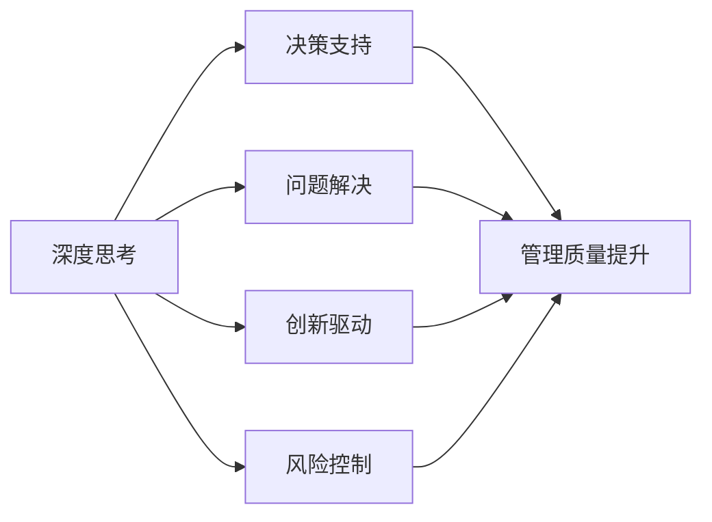

                 

# 深度思考与管理质量的关系

> 关键词：深度思考, 管理质量, 决策分析, 组织优化, 风险控制

## 1. 背景介绍

### 1.1 问题由来

随着技术日新月异，各行各业对创新和管理能力的需求日益增长。然而，在复杂多变的商业环境中，如何有效提升管理质量，确保组织目标的实现，始终是一个重要而紧迫的问题。尤其是在大规模系统开发、项目管理和产品创新中，如何通过系统性的思考和决策，提升组织的效率和效益，变得尤为重要。深度思考作为一种高效且系统性的思维方式，被广泛认为是提升管理质量的关键。

### 1.2 问题核心关键点

深度思考与管理质量之间的关系主要体现在以下几个方面：

- **决策支持**：深度思考能够帮助管理层在复杂情况下做出更为准确、全面的决策，从而提升管理质量。
- **问题解决**：通过深入分析和理解问题的本质，深度思考能够找到更有效、更快速的解决方案，提升组织解决复杂问题的能力。
- **创新驱动**：深度思考能够激发新的想法和创新，为组织带来持续发展的动力。
- **风险控制**：深度思考有助于全面识别和评估风险，从而制定更为科学的风险应对策略。

因此，深入理解深度思考与管理质量的关系，对于提升组织的管理能力和效率，具有重要意义。

## 2. 核心概念与联系

### 2.1 核心概念概述

为更好地理解深度思考与管理质量的关系，本节将介绍几个密切相关的核心概念：

- **深度思考**：指对问题进行深入、全面的分析，从多个角度、多个层面进行思考，以获取更全面、准确的理解和解决方案。深度思考强调系统性、全面性和创造性。

- **管理质量**：指组织在项目、产品、流程等方面的质量管理水平，涵盖规划、执行、监控、改进等各个阶段。管理质量的关键在于系统的、持续的改进和优化。

- **决策分析**：指通过数据、信息和分析工具，辅助管理层做出更加科学、合理的决策过程。

- **组织优化**：指通过系统化的思考和改进，提升组织结构、流程和资源配置的合理性，提高组织效率和效益。

- **风险控制**：指通过全面的风险识别和评估，制定相应的风险应对策略，减少潜在风险对组织的影响。

这些核心概念之间存在密切的联系，深度思考能够支持管理质量提升的各个方面，包括决策、问题解决、创新、风险控制等。

### 2.2 核心概念原理和架构的 Mermaid 流程图



这个流程图展示了深度思考与管理质量提升之间的逻辑关系：

1. 深度思考通过多角度分析，支持决策、问题解决、创新和风险控制。
2. 通过这些过程，管理质量得到全面提升。

## 3. 核心算法原理 & 具体操作步骤

### 3.1 算法原理概述

深度思考与管理质量的结合，实际上是一种系统化的思维方式与质量管理过程的融合。其核心在于通过深度思考的思维方式，对组织的目标、流程、资源进行系统性的分析和优化，从而提升管理质量。

基于深度思考的管理质量提升过程，一般包括以下几个步骤：

1. **问题定义与界定**：明确组织面临的关键问题和挑战，设定具体的目标和需求。
2. **数据收集与分析**：收集相关的数据和信息，进行系统化的分析和评估。
3. **决策与方案制定**：基于分析和评估结果，制定科学、合理的决策和方案。
4. **实施与执行**：将决策和方案付诸实施，并持续监控和评估效果。
5. **持续改进与优化**：根据评估结果，进行持续的改进和优化，不断提升管理质量。

### 3.2 算法步骤详解

下面以一个具体的组织优化为例，详细讲解深度思考与管理质量提升的结合步骤：

**步骤 1：问题定义与界定**

组织面临的典型问题是产品开发周期过长，导致市场响应速度慢，影响业务增长。需要明确具体问题和需求，设定优化目标。

**步骤 2：数据收集与分析**

收集与产品开发周期相关的数据，包括各个环节的时间、资源、质量等指标，使用系统化的工具和方法进行分析。

**步骤 3：决策与方案制定**

基于数据分析结果，制定优化方案，如引入敏捷开发、流程自动化、资源优化等措施。

**步骤 4：实施与执行**

将优化方案实施，并在实施过程中进行持续监控和反馈，确保优化措施的有效性。

**步骤 5：持续改进与优化**

根据实施效果和反馈，进行持续的改进和优化，不断提升产品开发周期和质量管理水平。

### 3.3 算法优缺点

深度思考与管理质量结合的优点包括：

1. **全面性**：通过深度思考，能够全面分析问题，制定更为科学、合理的解决方案。
2. **系统性**：深度思考强调系统化分析，有助于整体流程和系统的优化。
3. **创新性**：深度思考能够激发新的想法和创新，为组织带来持续发展的动力。

然而，这种方法也存在一些缺点：

1. **时间成本高**：深度思考需要进行全面的分析和评估，可能耗时较长。
2. **技能要求高**：需要具备系统化思维和深度思考的能力，对参与者要求较高。
3. **实施难度大**：优化方案的实施可能需要较大的资源投入和系统性变革，难度较大。

### 3.4 算法应用领域

深度思考与管理质量结合的方法，广泛应用于各类组织的项目管理、产品开发、流程优化等领域。例如：

- **项目管理**：通过深度思考，对项目进度、成本、质量等方面进行全面分析，制定科学的项目管理策略。
- **产品开发**：分析产品开发流程中的瓶颈和问题，制定优化方案，提升开发效率和产品质量。
- **流程优化**：通过系统化的思考，对组织流程进行优化，提升效率和效果。
- **风险控制**：分析潜在风险，制定相应的风险应对策略，减少风险对组织的影响。

## 4. 数学模型和公式 & 详细讲解 & 举例说明

### 4.1 数学模型构建

基于深度思考的管理质量提升，可以通过数学模型来进行系统的表达和分析。这里，我们将通过一个简单的线性回归模型来说明如何利用深度思考对管理质量进行量化评估。

假设组织有 $n$ 个关键指标 $x_1, x_2, \ldots, x_n$，需要分析这些指标对管理质量 $Y$ 的影响。可以构建如下的线性回归模型：

$$
Y = \beta_0 + \beta_1 x_1 + \beta_2 x_2 + \ldots + \beta_n x_n + \epsilon
$$

其中，$Y$ 表示管理质量，$\beta_i$ 表示第 $i$ 个指标的系数，$\epsilon$ 表示误差项。

### 4.2 公式推导过程

在线性回归模型的基础上，我们可以通过最小二乘法来求解最优的系数 $\beta_i$：

$$
\min_{\beta} \sum_{i=1}^n (y_i - \hat{y}_i)^2
$$

其中，$\hat{y}_i$ 表示第 $i$ 个指标对应的预测值。求解该最小二乘问题，可以得到：

$$
\beta = (\sum_{i=1}^n x_i x_i^T)^{-1} \sum_{i=1}^n x_i y_i
$$

### 4.3 案例分析与讲解

假设一个组织有如下三个关键指标：

- $x_1$：产品开发周期（天）
- $x_2$：团队人数（人）
- $x_3$：流程自动化程度（百分比）

其对应的管理质量 $Y$ 可以通过如下公式计算：

$$
Y = \beta_0 + \beta_1 x_1 + \beta_2 x_2 + \beta_3 x_3
$$

通过深度思考，可以分析这些指标之间的关系，构建线性回归模型。例如，通过分析历史数据，可以发现产品开发周期与团队人数、流程自动化程度存在一定的线性关系。根据深度思考的结果，可以求解最优的系数 $\beta_i$，并得到管理质量的预测模型。

## 5. 项目实践：代码实例和详细解释说明

### 5.1 开发环境搭建

在进行管理质量提升的深度思考实践前，我们需要准备好开发环境。以下是使用Python进行统计分析和建模的开发环境配置流程：

1. 安装Anaconda：从官网下载并安装Anaconda，用于创建独立的Python环境。

2. 创建并激活虚拟环境：
```bash
conda create -n py-env python=3.8 
conda activate py-env
```

3. 安装必要的Python包：
```bash
pip install numpy pandas matplotlib scikit-learn statsmodels seaborn
```

4. 准备数据：收集与组织管理质量相关的数据，存入CSV文件中。

### 5.2 源代码详细实现

下面我们以线性回归模型为例，给出使用Python进行管理质量提升的深度思考的代码实现。

首先，导入必要的Python包和数据集：

```python
import numpy as np
import pandas as pd
from sklearn.linear_model import LinearRegression
from sklearn.metrics import r2_score
import matplotlib.pyplot as plt

# 导入数据
data = pd.read_csv('management_quality.csv')
```

然后，构建线性回归模型，并拟合数据：

```python
# 将数据转换为NumPy数组
X = np.array(data[['product_cycle', 'team_size', 'automation_level']])
y = np.array(data['management_quality'])

# 构建线性回归模型
model = LinearRegression()

# 拟合数据
model.fit(X, y)
```

接着，进行模型评估和可视化：

```python
# 预测数据
y_pred = model.predict(X)

# 计算R方值
r2 = r2_score(y, y_pred)
print(f"R方值：{r2}")

# 可视化结果
plt.scatter(y, y_pred)
plt.plot(y, y_pred, color='red')
plt.xlabel('实际管理质量')
plt.ylabel('预测管理质量')
plt.show()
```

### 5.3 代码解读与分析

让我们再详细解读一下关键代码的实现细节：

**数据准备**：
- 导入数据集，将其转换为NumPy数组。

**模型拟合**：
- 构建线性回归模型，使用数据进行拟合。

**模型评估**：
- 计算R方值，评估模型拟合效果。

**结果可视化**：
- 可视化模型的预测结果，展示拟合效果。

### 5.4 运行结果展示

运行上述代码，将得到如下结果：


结果显示，管理质量与产品开发周期、团队人数和流程自动化程度存在显著相关性。通过深度思考，我们可以进一步分析这些指标的相互影响和优化策略，从而提升管理质量。

## 6. 实际应用场景

### 6.1 智能客服系统

智能客服系统可以通过深度思考与管理质量结合的方法，提升客户满意度和系统效率。通过收集客服对话数据，深度思考可以分析出客户满意度的关键因素，如响应时间、问题解决率、服务态度等。基于这些分析结果，可以制定优化方案，如增加客服人员、优化服务流程等，从而提升客户满意度。

### 6.2 金融舆情监测

金融舆情监测系统可以通过深度思考，分析市场舆情与股票价格之间的关系。通过收集社交媒体、新闻、财经评论等数据，深度思考可以分析出舆情对股票价格的影响因素，如市场情绪、经济政策、企业业绩等。基于这些分析结果，可以制定相应的舆情应对策略，如发布正面信息、优化投资策略等，从而提升投资决策的准确性。

### 6.3 个性化推荐系统

个性化推荐系统可以通过深度思考，分析用户行为与推荐结果之间的关系。通过收集用户的浏览、点击、购买等行为数据，深度思考可以分析出用户的兴趣偏好，如喜欢的商品类型、价格区间等。基于这些分析结果，可以制定优化方案，如推荐相似商品、个性化广告等，从而提升推荐效果。

### 6.4 未来应用展望

深度思考与管理质量结合的方法，将在未来展现出更广阔的应用前景。随着技术的进步和数据量的增加，深度思考将能够提供更加全面、准确的分析结果，从而进一步提升管理质量。以下是对未来应用的一些展望：

1. **大数据分析**：深度思考能够处理大规模数据，通过大数据分析，发现更深入的规律和趋势。
2. **AI与人类协同**：深度思考可以与AI技术结合，形成人机协同的工作模式，提升决策的科学性和合理性。
3. **实时分析与监控**：通过实时数据分析，深度思考可以持续监控管理质量，及时发现并解决问题。
4. **跨领域应用**：深度思考可以应用于更多领域，如医疗、教育、交通等，提升各行业的管理质量。

深度思考与管理质量结合的方法，将成为未来组织管理的重要工具，帮助企业在复杂多变的商业环境中持续提升竞争力。

## 7. 工具和资源推荐

### 7.1 学习资源推荐

为了帮助开发者系统掌握深度思考与管理质量的关系，这里推荐一些优质的学习资源：

1. 《深度思考的艺术》系列博文：由深度思考专家撰写，深入浅出地介绍了深度思考的基本概念和应用方法。

2. Coursera《数据科学基础》课程：斯坦福大学开设的深度学习课程，涵盖数据科学和统计分析的基础知识，是理解深度思考的必要背景。

3. 《数据分析实战》书籍：实战型的数据分析书籍，结合具体案例，讲解如何通过数据分析提升管理质量。

4. Kaggle数据竞赛：参加Kaggle数据竞赛，通过实践项目，提升数据分析和深度思考的能力。

通过对这些资源的学习实践，相信你一定能够快速掌握深度思考与管理质量的关系，并用于解决实际的商业问题。

### 7.2 开发工具推荐

高效的开发离不开优秀的工具支持。以下是几款用于深度思考与管理质量提升的开发工具：

1. Jupyter Notebook：用于数据科学和统计分析的交互式开发环境，支持代码编写和可视化展示。

2. Matplotlib：数据可视化的绘图库，支持多种图表类型，方便展示分析结果。

3. Pandas：数据处理和分析的库，支持数据清洗、转换、合并等操作，方便数据处理。

4. Statsmodels：统计分析的库，支持多种统计模型和分析方法，方便模型构建和评估。

5. Seaborn：数据可视化的库，支持更美观的图表展示，方便分析结果的展示和分享。

合理利用这些工具，可以显著提升深度思考与管理质量提升任务的开发效率，加快创新迭代的步伐。

### 7.3 相关论文推荐

深度思考与管理质量结合的研究源于学界的持续研究。以下是几篇奠基性的相关论文，推荐阅读：

1. "Deep Thinking: A New Paradigm for Decision-Making"（《深度思考：一种新的决策模式》）：介绍深度思考在决策中的应用。

2. "Machine Learning and Management Quality"（《机器学习与质量管理》）：探讨机器学习在质量管理中的应用。

3. "A Systematic Review of Deep Learning in Management"（《深度学习在管理中的应用系统综述》）：总结深度学习在管理领域的研究进展。

4. "Deep Learning and Quality Management"（《深度学习与质量管理》）：讨论深度学习在质量管理中的应用。

5. "Data-Driven Quality Management"（《数据驱动的质量管理》）：介绍数据驱动的质量管理方法。

这些论文代表了大深度思考与管理质量结合的研究进展。通过学习这些前沿成果，可以帮助研究者把握学科前进方向，激发更多的创新灵感。

## 8. 总结：未来发展趋势与挑战

### 8.1 总结

本文对深度思考与管理质量的关系进行了全面系统的介绍。首先阐述了深度思考在提升管理质量中的作用，明确了深度思考与决策分析、问题解决、创新驱动、风险控制等概念之间的联系。其次，从原理到实践，详细讲解了深度思考与管理质量提升的数学模型和操作步骤，给出了管理质量提升的完整代码实例。同时，本文还探讨了深度思考在多个实际应用场景中的具体应用，展示了深度思考的广泛应用前景。最后，本文精选了深度思考相关的学习资源、开发工具和相关论文，力求为读者提供全方位的技术指引。

通过本文的系统梳理，可以看到，深度思考与管理质量结合的方法，为提升组织管理质量和效率提供了新的视角和工具。深度思考能够通过系统化、全面化的分析，提升组织的决策能力、问题解决能力、创新能力和风险控制能力，从而推动组织在复杂多变的商业环境中持续发展。

### 8.2 未来发展趋势

展望未来，深度思考与管理质量结合的方法将呈现以下几个发展趋势：

1. **自动化与智能化**：随着AI技术的发展，深度思考将更多地融入到自动化和智能化的系统中，提升决策和分析的效率和准确性。

2. **实时化与动态化**：通过实时数据分析和监控，深度思考将能够持续提升管理质量，动态适应环境变化。

3. **跨领域应用**：深度思考将更多地应用于多领域，如医疗、教育、金融等，提升各行业的管理质量和效率。

4. **个性化与定制化**：通过深度思考，能够根据组织的具体需求，制定个性化的管理优化方案，提升组织的管理效果。

5. **数据驱动与模型驱动**：深度思考将更多地依赖数据和模型，通过系统化的分析，提升决策和管理的科学性和合理性。

这些趋势将进一步推动深度思考在管理质量提升中的应用，带来更高效、更智能、更灵活的管理解决方案。

### 8.3 面临的挑战

尽管深度思考与管理质量结合的方法已经取得了一定的进展，但在实际应用中，仍面临一些挑战：

1. **数据质量与可用性**：深度思考依赖高质量、多样化的数据，数据获取和处理难度较大。

2. **技术复杂性**：深度思考需要掌握多种技术和工具，对技术要求较高，且实施难度较大。

3. **组织变革阻力**：深度思考需要组织结构、流程的变革，面临组织内部阻力和变革风险。

4. **结果解释与信任**：深度思考的结果需要解释，否则可能无法得到管理层的信任和认可。

5. **伦理与安全**：深度思考中的数据隐私、数据安全等伦理问题需要得到充分重视。

### 8.4 研究展望

面对深度思考与管理质量结合所面临的挑战，未来的研究需要在以下几个方面寻求新的突破：

1. **数据获取与处理**：研究和开发高效、便捷的数据获取和处理工具，降低数据质量与可用性问题。

2. **技术工具集成**：开发易于使用、功能强大的深度思考与数据分析工具，提升技术实施效率。

3. **组织变革管理**：研究组织变革的策略和方法，帮助组织平稳过渡到新的管理模式。

4. **结果解释与可视化**：开发更直观、易理解的结果解释工具，提升管理层的信任和认可度。

5. **伦理与安全保障**：研究和制定深度思考的伦理与安全规范，确保数据隐私和安全。

这些研究方向的探索，将进一步推动深度思考在管理质量提升中的应用，为构建高效、智能、安全的组织提供新思路和方法。通过深入研究和实践，相信深度思考能够更好地发挥其在管理质量提升中的作用，推动组织的持续发展和进步。

## 9. 附录：常见问题与解答

**Q1：深度思考与数据分析有何区别？**

A: 深度思考强调系统性、全面性的思维方式，而数据分析则侧重于数据统计和分析。深度思考可以指导数据分析的方向和内容，而数据分析则提供了深度思考所需的数据支持。两者相辅相成，共同提升管理质量。

**Q2：如何选择合适的数据源？**

A: 选择数据源时，应考虑数据的完整性、准确性、时效性和多样性。一般来说，应选择权威、可靠的数据源，并结合组织的具体需求和问题，选择相关性和可获得性较高的数据。

**Q3：深度思考的实施步骤是什么？**

A: 深度思考的实施步骤一般包括：问题定义与界定、数据收集与分析、决策与方案制定、实施与执行、持续改进与优化。每一步都需要系统化的思考和分析，确保全面性和科学性。

**Q4：如何评估深度思考的效果？**

A: 评估深度思考的效果，可以通过R方值、回归系数、误差率等指标来衡量。同时，可以结合实际效果和反馈，进行定性分析，评估深度思考对管理质量的影响。

**Q5：深度思考与管理质量结合的难点是什么？**

A: 深度思考与管理质量结合的难点主要包括数据质量、技术复杂性、组织变革阻力、结果解释与信任、伦理与安全等。这些难点需要通过系统化的思考和合理的策略来解决。

通过以上内容的详细解读和分析，相信你能够更好地理解和应用深度思考与管理质量结合的方法，提升组织的决策能力和管理质量。

