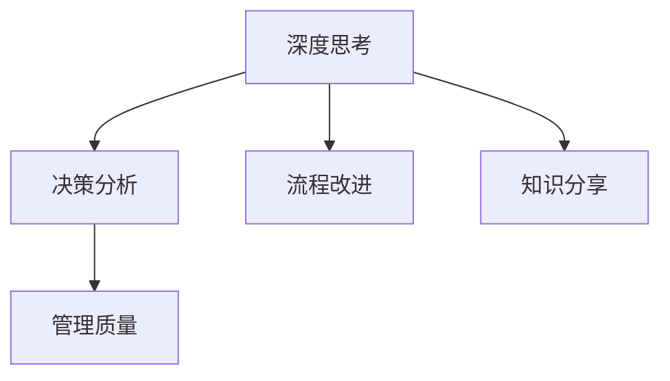

                 

# 深度思考与管理质量的关系

> 关键词：深度思考, 管理质量, 决策分析, 流程改进, 知识分享

## 1. 背景介绍

### 1.1 问题由来
在当今信息爆炸和竞争激烈的时代，企业面临的环境复杂多变，如何在不确定性中做出明智的决策，已经成为企业生存和发展的关键。深度思考，作为企业决策过程中的重要环节，被越来越多的人重视。同时，企业管理的质量，直接决定着企业的绩效和可持续发展能力。因此，如何通过深度思考提高管理质量，成为了众多企业关注的热点。

### 1.2 问题核心关键点
深度思考与管理质量的关系体现在以下几个方面：
- 深度思考帮助企业识别问题本质，制定出更加精准的目标和计划。
- 深度思考促进团队协作，提升管理决策的质量。
- 深度思考有助于提升员工的创造力和问题解决能力，从而提高管理效率。
- 深度思考与企业文化、价值观等紧密相连，对企业发展有长远影响。

### 1.3 问题研究意义
研究深度思考与管理质量的关系，对于提升企业管理水平，增强企业竞争力，具有重要的理论和实践意义：
- 帮助企业从根本上提升决策质量，避免因决策失误造成的损失。
- 提高企业的执行力和创新能力，为企业的可持续发展提供动力。
- 强化企业的知识管理和员工培训，构建更加完善的管理体系。

## 2. 核心概念与联系

### 2.1 核心概念概述

为更好地理解深度思考与管理质量的关系，本节将介绍几个密切相关的核心概念：

- **深度思考**：指通过深入分析、综合考虑各方面因素，做出全面且系统的决策过程。深度思考要求打破常规思维定式，寻找创新的解决方案。

- **管理质量**：指的是企业经营管理过程中的质量标准和控制水平。管理质量涵盖流程改进、质量管理、人力资源管理等多个方面。

- **决策分析**：指通过数据收集、模型构建、算法分析等手段，对复杂问题进行定量和定性分析，辅助决策过程。

- **流程改进**：指通过优化工作流程，减少资源浪费，提升工作效率和质量。

- **知识分享**：指通过团队内部知识交流和经验分享，实现知识积累和传递，提升整体团队水平。

这些核心概念之间的逻辑关系可以通过以下Mermaid流程图来展示：



这个流程图展示了大语言模型的核心概念及其之间的关系：

1. 深度思考通过决策分析和流程改进，为管理质量的提升提供支撑。
2. 知识分享是深度思考和流程改进的基础，有助于提升团队整体素质。
3. 管理质量是深度思考和流程改进的目标，提升整体管理水平。

## 3. 核心算法原理 & 具体操作步骤
### 3.1 算法原理概述

深度思考与管理质量的结合，本质上是通过深度思考提升企业决策和管理的科学性和系统性，从而提升管理质量。其核心思想是：
1. 通过深度思考进行系统分析，识别问题和机会。
2. 利用决策分析工具和方法，制定科学的决策方案。
3. 优化工作流程，减少资源浪费，提升执行效率。
4. 分享知识经验，促进团队协作，提高整体素质。

具体而言，深度思考与管理质量的结合包括以下几个步骤：
1. **问题识别**：通过深度思考，识别出管理过程中存在的问题和挑战。
2. **数据分析**：利用数据挖掘和分析工具，收集和处理相关数据，为决策提供支持。
3. **方案制定**：通过系统分析和模型构建，制定出可行的解决方案。
4. **流程优化**：对现有流程进行改进和优化，确保方案的顺利执行。
5. **知识共享**：通过知识分享，将经验和成果传递给团队成员，提升整体能力。

### 3.2 算法步骤详解

以下我们将详细介绍每个步骤的具体操作方法：

#### 步骤1：问题识别
- **背景调研**：了解行业和企业的现状，收集相关数据和资料。
- **现状分析**：通过问卷调查、访谈等方式，收集员工和客户的反馈信息。
- **数据整理**：对收集到的数据进行整理和分类，找到问题的共性和特殊性。
- **问题定义**：将问题具体化、清晰化，形成问题描述。

#### 步骤2：数据分析
- **数据收集**：根据问题描述，收集相关数据，包括财务、运营、客户满意度等方面的数据。
- **数据清洗**：对数据进行去重、填补缺失值、异常值处理等预处理操作。
- **数据可视化**：利用数据可视化工具，如Tableau、Power BI等，呈现数据规律和趋势。
- **特征分析**：通过特征工程，提取出关键特征和指标。

#### 步骤3：方案制定
- **构建模型**：根据问题特性，选择合适的模型进行构建，如回归分析、分类模型、聚类模型等。
- **模型训练**：利用训练集数据，训练模型，进行参数调优。
- **模型验证**：利用验证集数据，评估模型性能，并进行调整。
- **方案优化**：结合实际需求和模型结果，制定出优化方案。

#### 步骤4：流程优化
- **流程设计**：根据方案，重新设计或优化现有流程。
- **流程实施**：在试点项目中进行流程实施，收集反馈。
- **流程评估**：通过KPI指标，评估流程实施效果，进行持续改进。
- **流程推广**：将优化后的流程在企业内部推广实施。

#### 步骤5：知识共享
- **知识总结**：将优化过程和结果进行总结，形成文档和案例。
- **内部培训**：通过培训、座谈会等方式，将知识传递给团队成员。
- **经验交流**：建立知识共享平台，鼓励员工分享经验和心得。
- **持续改进**：持续收集反馈，不断改进和优化知识共享机制。

### 3.3 算法优缺点

深度思考与管理质量结合的算法具有以下优点：
1. **系统性**：深度思考能够帮助企业从全局角度审视问题，制定出系统性解决方案。
2. **科学性**：通过数据分析和模型构建，决策更具科学性和客观性。
3. **实用性**：优化后的流程和方案，具有可操作性和可行性。
4. **可扩展性**：知识分享机制的建立，有助于企业形成知识积累和传承。

同时，该方法也存在一些局限性：
1. **成本高**：深度思考和数据分析需要耗费大量时间和资源。
2. **复杂度高**：模型构建和流程优化需要较强的专业技能。
3. **人员依赖**：深度思考和知识共享依赖于团队成员的专业水平和沟通能力。
4. **变革阻力**：流程优化可能会触碰到部门利益，面临较大的变革阻力。

尽管存在这些局限性，但就目前而言，深度思考与管理质量的结合方法仍然是大企业中广泛采用的高效管理手段。未来相关研究的重点在于如何进一步降低成本，简化流程，提升人员专业技能，从而更好地应用于实践。

### 3.4 算法应用领域

深度思考与管理质量结合的算法已经在多个行业得到广泛应用，例如：

- **金融行业**：通过深度思考，识别金融市场的风险点，制定风控策略，优化流程，提升服务质量。
- **制造业**：通过深度思考，识别生产流程中的瓶颈，优化供应链管理，提升生产效率。
- **零售行业**：通过深度思考，识别客户需求，优化库存管理，提升销售和服务质量。
- **医疗行业**：通过深度思考，识别病患需求，优化诊疗流程，提升医疗服务质量。
- **教育行业**：通过深度思考，识别教学中的问题，优化教学方案，提升教学效果。

除了这些典型应用外，深度思考与管理质量结合的方法还适用于更多领域，为企业的数字化转型和智能化升级提供支持。

## 4. 数学模型和公式 & 详细讲解 & 举例说明

### 4.1 数学模型构建

为了更好地理解深度思考与管理质量的关系，本节将使用数学语言对相关模型进行详细的描述。

假设企业管理过程中存在一个问题 $P$，需要对其进行优化。通过深度思考，我们得到问题 $P$ 的关键因素 $X_1, X_2, ..., X_n$，并构建出一个目标函数 $f(x)$ 来量化问题 $P$ 的严重程度。同时，我们收集到 $m$ 个样本数据 $D=\{(x_i, y_i)\}_{i=1}^m$，其中 $x_i$ 为特征向量，$y_i$ 为样本标签，$y_i \in \{0,1\}$。我们的目标是最小化目标函数 $f(x)$，即：

$$
\min_{x} f(x) \text{ s.t. } x \in \mathcal{X}
$$

其中 $\mathcal{X}$ 为特征向量 $x$ 的取值范围。

### 4.2 公式推导过程

以下我们以回归模型为例，推导目标函数 $f(x)$ 的计算公式。

假设我们收集到的数据 $D$ 满足线性回归模型，即：

$$
y_i = \theta_0 + \theta_1 x_{i1} + \theta_2 x_{i2} + ... + \theta_n x_{in} + \epsilon_i
$$

其中 $\epsilon_i$ 为误差项，满足 $\mathbb{E}[\epsilon_i] = 0$，$\text{Var}[\epsilon_i] = \sigma^2$。目标函数 $f(x)$ 可以表示为：

$$
f(x) = \frac{1}{2m} \sum_{i=1}^m (y_i - \hat{y}_i)^2
$$

其中 $\hat{y}_i$ 为模型预测值。

根据最小二乘法原理，目标函数的最小值可以通过解以下优化问题得到：

$$
\min_{\theta} \frac{1}{2m} \sum_{i=1}^m (y_i - \hat{y}_i)^2
$$

其中 $\hat{y}_i = \theta_0 + \theta_1 x_{i1} + \theta_2 x_{i2} + ... + \theta_n x_{in}$。

根据梯度下降法，最优解 $\theta^*$ 可以通过以下公式计算得到：

$$
\theta^* = (X^TX)^{-1}X^Ty
$$

其中 $X$ 为特征矩阵，$y$ 为标签向量。

### 4.3 案例分析与讲解

假设一家制造企业通过深度思考，识别出生产流程中的瓶颈是原材料供应不稳定。我们收集到10个生产周期的原材料供应数据和生产效率数据，并构建出一个线性回归模型来量化原材料供应对生产效率的影响。具体步骤如下：

1. **问题识别**：通过问卷调查和访谈，了解到原材料供应不稳定对生产效率有较大影响。
2. **数据分析**：收集10个生产周期的原材料供应量和生产效率数据，并进行预处理。
3. **方案制定**：构建一个线性回归模型，将原材料供应量作为自变量，生产效率作为因变量，进行模型训练和验证。
4. **流程优化**：根据模型结果，优化原材料供应策略，确保生产效率的稳定。
5. **知识共享**：将优化后的原材料供应策略分享给生产部门，并持续收集反馈进行改进。

通过上述过程，制造企业能够有效提升生产效率，减少资源浪费。

## 5. 项目实践：代码实例和详细解释说明

### 5.1 开发环境搭建

在进行深度思考与管理质量结合的实践前，我们需要准备好开发环境。以下是使用Python进行PyTorch开发的环境配置流程：

1. 安装Anaconda：从官网下载并安装Anaconda，用于创建独立的Python环境。

2. 创建并激活虚拟环境：
```bash
conda create -n pytorch-env python=3.8 
conda activate pytorch-env
```

3. 安装PyTorch：根据CUDA版本，从官网获取对应的安装命令。例如：
```bash
conda install pytorch torchvision torchaudio cudatoolkit=11.1 -c pytorch -c conda-forge
```

4. 安装TensorFlow：由Google主导开发的开源深度学习框架，生产部署方便，适合大规模工程应用。同样有丰富的预训练语言模型资源。

5. 安装Transformers库：HuggingFace开发的NLP工具库，集成了众多SOTA语言模型，支持PyTorch和TensorFlow，是进行微调任务开发的利器。

6. 安装各类工具包：
```bash
pip install numpy pandas scikit-learn matplotlib tqdm jupyter notebook ipython
```

完成上述步骤后，即可在`pytorch-env`环境中开始项目实践。

### 5.2 源代码详细实现

下面我们将以线性回归模型为例，给出使用PyTorch进行回归分析的代码实现。

首先，定义线性回归模型的训练函数：

```python
import torch
import torch.nn as nn
import torch.optim as optim

class LinearRegression(nn.Module):
    def __init__(self, input_dim, output_dim):
        super(LinearRegression, self).__init__()
        self.linear = nn.Linear(input_dim, output_dim)
    
    def forward(self, x):
        return self.linear(x)
    
    def loss(self, y_pred, y_true):
        loss_fn = nn.MSELoss()
        loss = loss_fn(y_pred, y_true)
        return loss

def train(model, train_x, train_y, epochs, learning_rate):
    optimizer = optim.SGD(model.parameters(), lr=learning_rate)
    criterion = nn.MSELoss()
    
    for epoch in range(epochs):
        model.train()
        optimizer.zero_grad()
        y_pred = model(train_x)
        loss = criterion(y_pred, train_y)
        loss.backward()
        optimizer.step()
    
    return model

# 假设训练数据
train_x = torch.tensor([[1.0, 2.0, 3.0], [4.0, 5.0, 6.0], [7.0, 8.0, 9.0], [10.0, 11.0, 12.0]])
train_y = torch.tensor([1.0, 2.0, 3.0, 4.0])

# 初始化模型
input_dim = 3
output_dim = 1
model = LinearRegression(input_dim, output_dim)

# 训练模型
epochs = 100
learning_rate = 0.01
trained_model = train(model, train_x, train_y, epochs, learning_rate)

# 评估模型
test_x = torch.tensor([[13.0, 14.0, 15.0]])
test_y = torch.tensor([5.0])

y_pred = trained_model(test_x)
print("Prediction:", y_pred.item())
```

### 5.3 代码解读与分析

让我们再详细解读一下关键代码的实现细节：

**LinearRegression类**：
- `__init__`方法：初始化模型参数。
- `forward`方法：定义前向传播过程。
- `loss`方法：定义损失函数，并返回损失值。

**train函数**：
- 初始化优化器和损失函数。
- 在每个epoch中，进行前向传播、计算损失、反向传播和参数更新。
- 循环进行多个epoch的训练。

**训练和评估流程**：
- 定义训练集和测试集的数据。
- 初始化线性回归模型。
- 调用train函数训练模型。
- 在测试集上评估模型性能。
- 输出预测结果。

可以看到，通过PyTorch进行线性回归模型的训练和评估，使得深度思考与管理质量的结合过程变得简洁高效。开发者可以将更多精力放在模型改进和数据分析上，而不必过多关注底层的实现细节。

## 6. 实际应用场景

### 6.1 智能客服系统

智能客服系统通过深度思考与管理质量结合的方法，能够大幅提升客服服务质量。企业可以通过深度思考，识别客户诉求的关键点，制定出针对性的解决方案，并通过数据分析，优化客服流程，提高服务效率。同时，通过知识共享机制，将最佳实践分享给客服人员，提升整体服务水平。

### 6.2 供应链管理

供应链管理是企业管理的核心环节，通过深度思考与管理质量结合的方法，能够有效提升供应链管理水平。企业可以通过深度思考，识别供应链中的瓶颈和问题，制定出优化方案，并通过数据分析，评估方案的实施效果，持续改进供应链管理。同时，通过知识共享，将供应链优化经验分享给相关部门，提升整体供应链管理能力。

### 6.3 产品设计

产品设计是企业创新和竞争力的重要来源。通过深度思考与管理质量结合的方法，能够更好地理解市场需求和用户痛点，制定出高效的产品设计方案。企业可以通过深度思考，识别产品设计中的关键问题，制定出优化方案，并通过数据分析，评估方案的实施效果，持续改进产品设计。同时，通过知识共享，将产品设计经验分享给设计团队，提升整体设计能力。

### 6.4 未来应用展望

随着深度思考与管理质量结合方法的不断成熟，其在更多领域的应用前景将更加广阔。未来，该方法将进一步深化应用于：

- **营销策划**：通过深度思考，识别市场机会，制定出高效的营销策略，并通过数据分析，优化营销流程，提升营销效果。
- **人力资源管理**：通过深度思考，识别人力资源管理中的瓶颈，制定出优化方案，并通过数据分析，评估方案的实施效果，提升人力资源管理水平。
- **研发管理**：通过深度思考，识别研发过程中的问题，制定出优化方案，并通过数据分析，评估方案的实施效果，提升研发管理能力。
- **项目运营**：通过深度思考，识别项目运营中的问题，制定出优化方案，并通过数据分析，评估方案的实施效果，提升项目运营水平。

## 7. 工具和资源推荐

### 7.1 学习资源推荐

为了帮助开发者系统掌握深度思考与管理质量的关系，这里推荐一些优质的学习资源：

1. 《深度学习》系列博文：由大模型技术专家撰写，深入浅出地介绍了深度学习原理、模型构建、优化算法等前沿话题。

2. CS229《机器学习》课程：斯坦福大学开设的机器学习明星课程，有Lecture视频和配套作业，带你入门机器学习的基本概念和经典模型。

3. 《深度学习与人工智能》书籍：介绍深度学习原理、模型构建、优化算法等基础知识，同时结合实际应用案例进行讲解。

4. PyTorch官方文档：PyTorch的官方文档，提供了丰富的教程和示例，是入门深度学习的绝佳资源。

5. Scikit-Learn官方文档：Scikit-Learn的官方文档，提供了丰富的机器学习算法和工具，方便进行数据分析和建模。

通过对这些资源的学习实践，相信你一定能够快速掌握深度思考与管理质量的精髓，并用于解决实际的业务问题。

### 7.2 开发工具推荐

高效的开发离不开优秀的工具支持。以下是几款用于深度思考与管理质量结合开发的常用工具：

1. PyTorch：基于Python的开源深度学习框架，灵活动态的计算图，适合快速迭代研究。大部分预训练语言模型都有PyTorch版本的实现。

2. TensorFlow：由Google主导开发的开源深度学习框架，生产部署方便，适合大规模工程应用。同样有丰富的预训练语言模型资源。

3. Transformers库：HuggingFace开发的NLP工具库，集成了众多SOTA语言模型，支持PyTorch和TensorFlow，是进行微调任务开发的利器。

4. Weights & Biases：模型训练的实验跟踪工具，可以记录和可视化模型训练过程中的各项指标，方便对比和调优。与主流深度学习框架无缝集成。

5. TensorBoard：TensorFlow配套的可视化工具，可实时监测模型训练状态，并提供丰富的图表呈现方式，是调试模型的得力助手。

6. Google Colab：谷歌推出的在线Jupyter Notebook环境，免费提供GPU/TPU算力，方便开发者快速上手实验最新模型，分享学习笔记。

合理利用这些工具，可以显著提升深度思考与管理质量结合任务的开发效率，加快创新迭代的步伐。

### 7.3 相关论文推荐

深度思考与管理质量的关系研究源于学界的持续研究。以下是几篇奠基性的相关论文，推荐阅读：

1. 《深度学习理论》：介绍深度学习原理、模型构建、优化算法等基础知识，并结合实际应用案例进行讲解。

2. 《深度学习在企业管理中的应用》：讨论深度学习在企业管理中的实际应用，包括供应链管理、营销策划等方面。

3. 《知识共享与团队协作》：探讨知识共享对团队协作和企业管理的影响，提供实际案例和经验分享。

4. 《流程优化与绩效提升》：讨论流程优化对企业绩效提升的影响，提供实际案例和改进策略。

5. 《数据分析在企业管理中的应用》：讨论数据分析对企业管理决策的支持作用，提供实际案例和应用策略。

这些论文代表了大语言模型微调技术的发展脉络。通过学习这些前沿成果，可以帮助研究者把握学科前进方向，激发更多的创新灵感。

## 8. 总结：未来发展趋势与挑战

### 8.1 总结

本文对深度思考与管理质量的关系进行了全面系统的介绍。首先阐述了深度思考和管理质量的研究背景和意义，明确了深度思考在提升企业管理决策和流程优化方面的独特价值。其次，从原理到实践，详细讲解了深度思考与管理质量结合的数学原理和关键步骤，给出了深度思考与管理质量结合的完整代码实例。同时，本文还广泛探讨了深度思考与管理质量结合在智能客服、供应链管理、产品设计等多个行业领域的应用前景，展示了深度思考与管理质量结合的巨大潜力。此外，本文精选了深度思考与管理质量结合的学习资源，力求为读者提供全方位的技术指引。

通过本文的系统梳理，可以看到，深度思考与管理质量结合的方法正在成为企业管理决策的重要手段，极大地提升了企业决策的科学性和系统性。未来，伴随深度学习、数据分析等技术的不断演进，深度思考与管理质量结合方法必将更加高效和智能化，为企业管理带来更多价值。

### 8.2 未来发展趋势

展望未来，深度思考与管理质量结合的方法将呈现以下几个发展趋势：

1. **自动化**：通过引入自动化算法和工具，减少人工干预，提高深度思考与管理质量结合的效率和精度。

2. **智能化**：利用AI技术，提升深度思考的智能化水平，实现更加精准的问题识别和方案制定。

3. **数据驱动**：更多依赖数据驱动的决策方式，通过深度学习和大数据分析，实现更加科学的决策支持。

4. **跨领域融合**：与其他AI技术进行更深入的融合，如知识图谱、因果推理、强化学习等，多路径协同发力，共同提升管理水平。

5. **可解释性**：提升深度思考与管理质量结合的可解释性，使决策过程更加透明和可信。

6. **适应性**：增强深度思考与管理质量结合的适应性，实现更加灵活的流程优化和决策支持。

以上趋势凸显了深度思考与管理质量结合技术的广阔前景。这些方向的探索发展，必将进一步提升深度思考与管理质量结合方法在实际应用中的价值和效果。

### 8.3 面临的挑战

尽管深度思考与管理质量结合方法已经取得了显著成效，但在迈向更加智能化、普适化应用的过程中，它仍面临着诸多挑战：

1. **数据质量**：深度思考与管理质量结合依赖于高质量的数据，但数据获取和处理成本较高，且数据质量难以保证。如何降低数据获取成本，提升数据质量，将是未来的一大挑战。

2. **算法复杂性**：深度思考与管理质量结合方法需要结合深度学习、数据分析等多种技术，算法实现复杂度较高。如何简化算法流程，降低技术门槛，将是未来需要解决的问题。

3. **资源消耗**：深度思考与管理质量结合方法需要消耗大量计算资源，如何降低资源消耗，提升计算效率，将是未来重要的研究方向。

4. **模型可解释性**：深度思考与管理质量结合方法依赖于复杂的模型，模型解释性较差，如何提高模型可解释性，增强决策的透明度和可信度，将是未来需要解决的问题。

5. **持续改进**：深度思考与管理质量结合方法需要持续改进和优化，如何建立高效的反馈机制，持续提升模型性能和决策质量，将是未来需要解决的问题。

6. **跨领域适用性**：深度思考与管理质量结合方法在不同行业领域的应用，存在一定的差异性。如何构建通用的模型和工具，适应不同行业的需求，将是未来需要解决的问题。

这些挑战凸显了深度思考与管理质量结合技术的复杂性和多样性，需要跨学科、跨领域的协同研究和技术创新。只有不断突破技术瓶颈，才能更好地推动深度思考与管理质量结合方法在实际应用中的落地和应用。

### 8.4 研究展望

面向未来，深度思考与管理质量结合技术的研究方向主要包括以下几个方面：

1. **自动化工具的开发**：开发更加自动化、智能化的深度思考与管理质量结合工具，提升工作效率和精度。

2. **数据增强技术**：研究数据增强技术，提升数据质量和数据量，降低数据获取成本。

3. **算法优化**：简化算法流程，降低技术门槛，提升计算效率和模型可解释性。

4. **跨领域应用**：构建通用的深度思考与管理质量结合模型和工具，适应不同行业领域的需求。

5. **知识图谱和符号计算**：引入知识图谱和符号计算技术，提升深度思考与管理质量结合的智能化水平和知识整合能力。

6. **动态决策支持**：研究动态决策支持技术，增强深度思考与管理质量结合的适应性和灵活性。

通过这些研究方向，深度思考与管理质量结合技术将能够更好地应用于实际业务场景，提升企业的决策质量和执行效率，为企业的数字化转型和智能化升级提供有力支持。

## 9. 附录：常见问题与解答

**Q1：深度思考对管理质量提升的作用主要体现在哪些方面？**

A: 深度思考对管理质量提升的作用主要体现在以下几个方面：
1. **问题识别**：通过深度思考，能够识别出管理过程中存在的问题和挑战，制定出有针对性的解决方案。
2. **方案制定**：通过深度思考，能够制定出科学合理的管理方案，提高方案的可行性和实施效果。
3. **流程优化**：通过深度思考，能够优化工作流程，减少资源浪费，提高工作效率和质量。
4. **知识积累**：通过深度思考，能够积累和分享经验知识，提升团队整体素质和能力。

**Q2：如何评估深度思考与管理质量结合的效果？**

A: 评估深度思考与管理质量结合的效果，可以从以下几个方面进行：
1. **目标达成情况**：评估方案实施后的管理目标是否达成，是否解决了管理问题。
2. **关键指标**：通过KPI等关键指标，评估管理质量的提升情况，如生产效率、客户满意度、运营成本等。
3. **员工反馈**：收集员工对管理方案的反馈意见，了解方案实施效果和存在的问题。
4. **持续改进**：根据评估结果，持续优化和改进管理方案，提升管理质量。

**Q3：深度思考与管理质量结合的实施过程中，需要注意哪些关键点？**

A: 深度思考与管理质量结合的实施过程中，需要注意以下几个关键点：
1. **问题识别准确性**：确保问题识别的准确性和全面性，避免因问题识别不准确而导致的方案失误。
2. **数据质量**：确保数据分析所使用的数据质量高，数据处理和预处理过程规范。
3. **方案科学性**：确保方案制定的科学性和可行性，考虑各种可能的影响因素。
4. **流程优化合理性**：确保流程优化方案的合理性和可操作性，避免流程优化带来的额外成本和复杂性。
5. **知识分享效果**：确保知识共享机制的有效性，促进团队成员之间的经验交流和知识传递。
6. **持续改进机制**：建立持续改进机制，根据评估结果不断优化和改进方案。

通过注意这些关键点，深度思考与管理质量结合的实施效果才能得到最大化的提升。

---

作者：禅与计算机程序设计艺术 / Zen and the Art of Computer Programming

