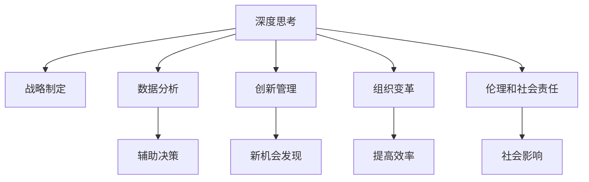

                 

# 深度思考在战略制定中的作用

> 关键词：深度思考,战略制定,决策,组织,创新,数据驱动,人工智能,伦理,执行

## 1. 背景介绍

### 1.1 问题由来

在当今复杂多变的商业环境中，企业的战略制定已成为生存和发展的重要基石。面对激烈的市场竞争、快速的技术变革和不断变化的市场需求，企业需要具备前瞻性、灵活性和创新性。而传统的战略制定方法，如SWOT分析、PEST分析等，已难以适应当前动态变化的商业环境。

为了更好地应对这些挑战，近年来，深度思考作为一种新型的战略制定方法，在企业中的应用日益广泛。深度思考不仅能帮助企业更全面、更深入地理解市场和竞争环境，还能提升企业的创新能力和决策质量，从而在激烈的市场竞争中保持领先。

### 1.2 问题核心关键点

深度思考在战略制定中的核心关键点包括：

- **理解环境变化**：深度思考通过全面、系统地分析市场、技术、政策等环境因素，帮助企业理解当前和未来可能的变化趋势。
- **识别竞争优势**：深度思考能帮助企业识别自身的核心竞争力，并分析其可能的来源和可持续性。
- **制定灵活策略**：深度思考强调灵活性，能根据环境变化动态调整战略，确保企业持续竞争优势。
- **促进创新和变革**：深度思考通过挑战现状、激发创新思维，推动企业不断进步和变革。
- **数据驱动决策**：深度思考强调利用数据分析，辅助决策过程，提高决策的科学性和准确性。

### 1.3 问题研究意义

深度思考在战略制定中的研究意义在于：

- **提升决策质量**：深度思考通过全面分析环境和市场数据，使企业能够做出更科学、更准确的决策。
- **增强创新能力**：深度思考通过激发创新思维，帮助企业发现新机会，保持竞争优势。
- **提高执行效率**：深度思考强调系统性和流程化，有助于提升战略执行的效率和效果。
- **应对不确定性**：深度思考通过系统分析，帮助企业更好地应对市场和环境的不确定性。
- **提升组织文化**：深度思考强调开放、协作和持续学习，有助于提升企业的组织文化。

## 2. 核心概念与联系

### 2.1 核心概念概述

为更好地理解深度思考在战略制定中的应用，本节将介绍几个密切相关的核心概念：

- **深度思考**：一种系统、全面、深入的分析方法，旨在理解问题的本质和环境的变化趋势，从而制定出更具前瞻性和适应性的战略。
- **战略制定**：企业根据自身资源和能力，结合环境分析，制定长远目标和具体行动计划的过程。
- **数据分析**：通过收集、处理和分析数据，辅助决策和战略制定的过程。
- **创新管理**：指企业通过创新思维和实践，实现持续发展和竞争优势的过程。
- **组织变革**：企业通过调整组织结构、优化流程等方式，提高组织效率和竞争力的过程。
- **伦理和社会责任**：企业在制定战略和实施过程中，应考虑其行为对社会和环境的影响，遵循伦理规范和承担社会责任。

这些核心概念之间的逻辑关系可以通过以下Mermaid流程图来展示：



这个流程图展示了几者之间的联系：

1. 深度思考通过全面分析，辅助战略制定。
2. 深度思考强调数据分析，以辅助决策。
3. 深度思考激发创新思维，促进新机会发现。
4. 深度思考涉及组织变革，提高企业效率。
5. 深度思考考虑伦理和社会责任，确保企业行为符合社会期待。

## 3. 核心算法原理 & 具体操作步骤
### 3.1 算法原理概述

深度思考在战略制定中的核心算法原理，是通过系统、全面、深入的分析方法，理解环境变化，识别竞争优势，制定灵活策略，促进创新和变革，确保数据驱动决策。

具体来说，深度思考包括以下几个关键步骤：

1. **数据收集与整理**：收集环境、市场、竞争对手等方面的数据，并进行整理和清洗。
2. **环境分析**：通过PEST分析、SWOT分析等方法，全面分析环境因素，理解当前和未来的变化趋势。
3. **竞争优势识别**：识别企业的核心竞争力，并分析其来源和可持续性。
4. **灵活策略制定**：根据环境变化，动态调整战略，确保灵活性和适应性。
5. **创新思维激发**：通过挑战现状、提出假设，激发创新思维，发现新机会。
6. **数据驱动决策**：利用数据分析，辅助决策过程，提高决策的科学性和准确性。

### 3.2 算法步骤详解

以下是深度思考在战略制定中的具体操作步骤：

**Step 1: 数据收集与整理**

1. 收集环境数据：如市场趋势、技术发展、政策变化等。
2. 收集市场数据：如客户需求、竞争对手信息、市场份额等。
3. 收集内部数据：如财务报表、产品性能、员工满意度等。
4. 数据清洗和预处理：去除噪声、填补缺失值、标准化数据格式。

**Step 2: 环境分析**

1. PEST分析：分析政治、经济、社会和技术等因素对企业的影响。
2. SWOT分析：分析企业的优势、劣势、机会和威胁。
3. 多因素分析：利用多变量分析方法，识别关键驱动因素和趋势。
4. 竞争分析：分析主要竞争对手的策略、市场定位和竞争优势。

**Step 3: 竞争优势识别**

1. 资源基础理论：分析企业的资源和能力，识别核心竞争力。
2. 价值链分析：分析企业价值链，识别关键价值环节。
3. 持续竞争优势理论：分析企业的竞争优势的来源和可持续性。
4. 竞争战略理论：分析企业的竞争战略，识别可能的竞争优势。

**Step 4: 灵活策略制定**

1. 战略规划：制定中长期战略目标，确定关键业务领域。
2. 情景分析：构建多种情景，预测不同情况下的战略效果。
3. 动态调整：根据环境变化，动态调整战略和行动计划。
4. 风险管理：识别和评估潜在风险，制定风险应对策略。

**Step 5: 创新思维激发**

1. 挑战现状：提出挑战现有假设和问题，激发创新思维。
2. 提出假设：基于现有数据和信息，提出可能的假设和解决方案。
3. 原型开发：构建原型，验证假设和解决方案的可行性。
4. 迭代优化：根据反馈，不断迭代和优化原型和解决方案。

**Step 6: 数据驱动决策**

1. 数据分析：利用数据分析工具和方法，辅助决策过程。
2. 可视化展示：使用数据可视化技术，展示关键指标和趋势。
3. 模型预测：构建预测模型，预测未来趋势和效果。
4. 反馈机制：建立反馈机制，不断优化决策过程。

### 3.3 算法优缺点

深度思考在战略制定中的优点包括：

- **全面性和系统性**：通过全面分析和系统方法，帮助企业更全面地理解环境和市场变化。
- **前瞻性和适应性**：通过预测未来趋势，制定前瞻性和适应性的战略。
- **创新性和灵活性**：通过挑战现状和激发创新思维，推动企业不断进步。
- **数据驱动决策**：利用数据分析，提高决策的科学性和准确性。

但深度思考也存在一些缺点：

- **时间和成本高**：数据收集和分析需要大量时间和资源。
- **复杂性高**：需要跨学科知识和多种分析方法，对组织能力要求较高。
- **结果不确定性**：分析结果可能存在不确定性，需结合实际情况进行判断。
- **执行难度大**：战略制定只是第一步，执行过程中可能面临各种挑战。

### 3.4 算法应用领域

深度思考在战略制定中的应用领域广泛，包括但不限于：

- **技术创新**：通过深入分析技术趋势和市场需求，制定技术创新策略。
- **市场拓展**：通过全面分析市场环境和竞争对手，制定市场拓展计划。
- **产品开发**：通过分析客户需求和市场趋势，制定产品开发和迭代策略。
- **组织变革**：通过深入分析组织结构和流程，制定组织变革和优化策略。
- **风险管理**：通过识别和评估潜在风险，制定风险应对策略。

## 4. 数学模型和公式 & 详细讲解 & 举例说明（备注：数学公式请使用latex格式，latex嵌入文中独立段落使用 $$，段落内使用 $)
### 4.1 数学模型构建

深度思考在战略制定中，数学模型主要应用于数据分析和预测模型构建。以下分别介绍两种常见模型：

1. **回归分析**：用于预测数值型变量之间的关系，如销售预测、市场份额预测等。
2. **分类模型**：用于预测分类变量，如客户满意度的分类预测、竞争对手的市场份额分类预测等。

### 4.2 公式推导过程

**回归分析模型**：

假设有一个自变量 $x$ 和因变量 $y$，回归分析模型为：

$$
y = \beta_0 + \beta_1 x + \epsilon
$$

其中，$\beta_0$ 为截距，$\beta_1$ 为斜率，$\epsilon$ 为误差项。

回归模型的最小二乘估计公式为：

$$
\beta_1 = \frac{Cov(x,y)}{Var(x)}
$$

$$
\beta_0 = \bar{y} - \beta_1 \bar{x}
$$

**分类模型**：

假设有一个自变量 $x$ 和一个二分类变量 $y$，逻辑回归模型为：

$$
P(y=1|x) = \frac{1}{1+e^{-\theta^T x}}
$$

其中，$\theta$ 为模型参数，$x$ 为输入变量。

逻辑回归模型的损失函数为交叉熵损失：

$$
L(\theta) = -\frac{1}{N}\sum_{i=1}^N [y_i \log P(y=1|x_i) + (1-y_i) \log (1-P(y=1|x_i))]
$$

利用梯度下降等优化算法，求解最小化损失函数，得到最优参数 $\theta$。

### 4.3 案例分析与讲解

以下以一家制造企业为例，展示如何利用深度思考进行战略制定：

**数据收集与整理**：收集市场趋势、技术发展、政策变化、客户需求、竞争对手信息等数据，并进行清洗和预处理。

**环境分析**：利用PEST分析，理解政治、经济、社会和技术等因素对企业的影响。

**竞争优势识别**：通过资源基础理论和价值链分析，识别企业的核心竞争力和关键价值环节。

**灵活策略制定**：构建多种情景，预测不同情况下的战略效果，制定中长期战略目标和动态调整的行动计划。

**创新思维激发**：挑战现状，提出假设，构建原型，验证假设，迭代优化。

**数据驱动决策**：利用回归分析和逻辑回归模型，预测市场趋势、客户需求和竞争对手行为，辅助战略制定。

## 5. 项目实践：代码实例和详细解释说明
### 5.1 开发环境搭建

在进行深度思考项目实践前，我们需要准备好开发环境。以下是使用Python进行数据分析和机器学习的开发环境配置流程：

1. 安装Anaconda：从官网下载并安装Anaconda，用于创建独立的Python环境。

2. 创建并激活虚拟环境：
```bash
conda create -n pythond-env python=3.8 
conda activate pythond-env
```

3. 安装相关库：
```bash
conda install pandas numpy scikit-learn matplotlib jupyter notebook
```

4. 安装PyTorch和TensorFlow：
```bash
conda install torch torchvision torchaudio
conda install tensorflow
```

完成上述步骤后，即可在`pythond-env`环境中开始深度思考项目实践。

### 5.2 源代码详细实现

这里我们以销售预测为例，展示如何使用Python进行回归分析。

首先，导入相关库：

```python
import pandas as pd
import numpy as np
from sklearn.linear_model import LinearRegression
from sklearn.model_selection import train_test_split
import matplotlib.pyplot as plt

```

然后，加载数据：

```python
# 读取数据集
data = pd.read_csv('sales_data.csv')

# 处理缺失值和异常值
data = data.dropna().drop_duplicates()

```

接着，数据预处理：

```python
# 标准化数据
from sklearn.preprocessing import StandardScaler
scaler = StandardScaler()
data_scaled = scaler.fit_transform(data)

```

然后，划分数据集：

```python
# 划分训练集和测试集
X_train, X_test, y_train, y_test = train_test_split(data_scaled[:, :-1], data_scaled[:, -1], test_size=0.2, random_state=42)

```

接着，构建模型并进行训练：

```python
# 构建线性回归模型
model = LinearRegression()

# 训练模型
model.fit(X_train, y_train)

```

最后，模型评估和预测：

```python
# 评估模型
train_score = model.score(X_train, y_train)
test_score = model.score(X_test, y_test)

# 预测新数据
new_data = np.array([[1.5, 2.5]])
predicted = model.predict(new_data)

print('Train score:', train_score)
print('Test score:', test_score)
print('Prediction:', predicted)
```

以上就是使用Python进行销售预测的完整代码实现。可以看到，通过深度思考方法，企业能够利用数据分析，辅助战略制定和决策过程。

### 5.3 代码解读与分析

让我们再详细解读一下关键代码的实现细节：

**数据预处理**：
- 使用Pandas库读取CSV文件，并处理缺失值和异常值，确保数据质量。
- 使用StandardScaler标准化数据，避免因不同变量量级不同导致的误差。

**模型构建与训练**：
- 使用Scikit-learn库构建线性回归模型，利用训练数据拟合模型参数。
- 使用train_test_split函数划分训练集和测试集，确保模型在未见过的数据上表现良好。
- 利用模型.score()函数评估模型在训练集和测试集上的性能。

**模型评估与预测**：
- 使用模型.predict()函数进行新数据的预测。
- 打印出模型在训练集和测试集上的评分，以及新数据的预测结果，便于评估模型效果。

## 6. 实际应用场景

### 6.1 智能制造

深度思考在智能制造中的应用，能够帮助企业更全面地理解市场需求、技术趋势和竞争环境，制定出更加科学和高效的战略。例如：

- **市场趋势预测**：通过数据分析，预测市场需求的变化趋势，帮助企业及时调整生产计划和库存管理。
- **技术创新策略**：通过分析技术发展趋势，制定技术创新和研发策略，提升企业的产品竞争力。
- **供应链优化**：通过分析供应链数据，识别瓶颈和风险，优化供应链管理，提高效率和降低成本。

### 6.2 零售电商

深度思考在零售电商中的应用，能够帮助企业更好地理解客户需求、市场变化和竞争对手策略，制定出更具竞争力的战略。例如：

- **客户需求分析**：通过分析客户行为数据，识别客户偏好和需求变化，制定个性化营销策略。
- **市场变化预测**：通过分析市场数据，预测市场趋势和变化，提前做好准备和应对措施。
- **竞争对手分析**：通过分析竞争对手的策略和行为，制定针对性的竞争策略。

### 6.3 金融服务

深度思考在金融服务中的应用，能够帮助企业更全面地理解市场变化、客户需求和竞争环境，制定出更加科学和高效的战略。例如：

- **市场趋势预测**：通过数据分析，预测市场趋势和风险，制定投资和资产管理策略。
- **客户需求分析**：通过分析客户行为数据，识别客户需求变化，制定产品和服务创新策略。
- **风险管理**：通过分析金融数据，识别和评估潜在风险，制定风险应对策略。

## 7. 工具和资源推荐
### 7.1 学习资源推荐

为了帮助企业系统掌握深度思考方法，以下推荐一些优质的学习资源：

1. 《深度思考在战略制定中的应用》系列博文：由深度思考专家撰写，深入浅出地介绍了深度思考的基本原理和实际应用。

2. Coursera《数据分析与统计学》课程：由斯坦福大学开设的优质课程，涵盖数据分析的各个方面，包括数据收集、处理、分析和可视化。

3. 《数据分析实战》书籍：作者深入浅出地介绍了数据分析的实践技巧和应用案例，适合实战学习。

4. HuggingFace官方文档：深度思考库的官方文档，提供了丰富的样例代码和工具，方便开发者实践。

5. Kaggle数据科学竞赛：全球最大的数据科学竞赛平台，提供了大量的真实数据集和挑战题目，助力深度思考的实践。

通过对这些资源的学习实践，相信你一定能够系统掌握深度思考的方法，并应用于实际工作中。

### 7.2 开发工具推荐

高效的开发离不开优秀的工具支持。以下是几款用于深度思考项目开发的常用工具：

1. Jupyter Notebook：免费的交互式编程环境，支持Python等多种编程语言，适合数据分析和模型实验。

2. Tableau：强大的数据可视化工具，支持多种数据源和可视化类型，适合数据探索和展示。

3. Scikit-learn：Python的数据挖掘和机器学习库，提供了丰富的模型和算法，方便深度思考的实现。

4. TensorFlow和PyTorch：领先的深度学习框架，支持高效的数据处理和模型训练，适合大规模数据分析和预测模型构建。

5. Keras：简单易用的深度学习库，支持多种模型构建和优化，适合快速原型开发和实验。

合理利用这些工具，可以显著提升深度思考项目的开发效率，加快创新迭代的步伐。

### 7.3 相关论文推荐

深度思考在战略制定中的研究源于学界的持续研究。以下是几篇奠基性的相关论文，推荐阅读：

1. "Thinking, Fast and Slow"：丹尼尔·卡尼曼的心理学著作，介绍了人类思维的两种模式，对于理解深度思考的心理学基础有重要参考价值。

2. "The Art of Thinking Clearly"：罗尔夫·多贝利（Rolf Dobelli）的思考方法学著作，提供了大量实用的思维技巧和案例，适合实战应用。

3. "Superforecasting: The Art and Science of Prediction"：菲利普·泰特洛克（Philip Tetlock）的预测学著作，介绍了如何通过系统性思考提升预测准确性。

4. "Decision Making and Thinking Strategies"：Russell C. Minden的决策与思考策略著作，提供了全面的决策方法和思考工具。

这些论文代表了大深度思考在战略制定中的发展脉络。通过学习这些前沿成果，可以帮助研究者把握学科前进方向，激发更多的创新灵感。

## 8. 总结：未来发展趋势与挑战

### 8.1 总结

本文对深度思考在战略制定中的作用进行了全面系统的介绍。首先阐述了深度思考在战略制定中的重要性，明确了深度思考在理解和预测市场变化、识别竞争优势和制定灵活策略等方面的独特价值。其次，从原理到实践，详细讲解了深度思考的数学模型和操作步骤，给出了深度思考项目开发的完整代码实例。同时，本文还广泛探讨了深度思考方法在智能制造、零售电商、金融服务等多个行业领域的应用前景，展示了深度思考范式的巨大潜力。此外，本文精选了深度思考技术的各类学习资源，力求为读者提供全方位的技术指引。

通过本文的系统梳理，可以看到，深度思考在战略制定中的方法论，不仅可以帮助企业制定更具前瞻性和适应性的战略，还能提升决策质量和创新能力，从而在激烈的市场竞争中保持领先。未来，随着数据科学和人工智能技术的不断发展，深度思考方法将在更多领域得到应用，为企业的决策和战略制定提供更强有力的支撑。

### 8.2 未来发展趋势

展望未来，深度思考在战略制定中的发展趋势包括：

1. **数据驱动决策**：随着大数据和AI技术的发展，深度思考将更依赖于数据驱动的决策分析。
2. **跨学科融合**：深度思考将与心理学、社会学、经济学等学科深度融合，提升决策的全面性和科学性。
3. **自动化和智能化**：深度思考将通过自动化和智能化工具，进一步提升决策的效率和准确性。
4. **伦理和社会责任**：深度思考将更加注重伦理和社会责任，确保决策符合社会价值观和伦理规范。
5. **多模态数据分析**：深度思考将结合视觉、语音、文本等多模态数据，提升分析的全面性和深度。

以上趋势凸显了深度思考方法的广泛应用和持续发展。这些方向的探索发展，必将进一步提升企业决策的科学性和系统性，促进企业持续创新和变革。

### 8.3 面临的挑战

尽管深度思考方法在战略制定中已经取得了显著成效，但在实际应用中也面临诸多挑战：

1. **数据获取困难**：深度思考需要大量高质量的数据，而数据获取和处理往往需要大量时间和资源。
2. **数据质量和一致性**：数据质量和一致性问题，可能导致分析结果的不准确。
3. **模型复杂性高**：深度思考模型往往复杂，需要较高技术水平才能实现。
4. **结果可解释性差**：深度思考模型结果的可解释性较差，可能导致决策过程的不透明。
5. **执行难度大**：战略制定只是第一步，执行过程中可能面临各种挑战，需要综合考虑多方因素。

### 8.4 研究展望

面对深度思考在战略制定中的挑战，未来的研究需要在以下几个方面寻求新的突破：

1. **高效数据获取和处理**：探索更高效的数据获取和处理技术，降低数据获取和处理成本。
2. **提升模型可解释性**：通过可解释性技术，提升深度思考模型的可解释性，确保决策的透明性和可信度。
3. **多模态数据分析**：结合视觉、语音、文本等多种数据源，提升分析的全面性和深度。
4. **伦理和社会责任**：研究如何在深度思考中引入伦理和社会责任，确保决策的道德性和社会性。
5. **自动化工具和平台**：开发更易于使用的自动化工具和平台，降低深度思考方法的门槛，推动其广泛应用。

这些研究方向将进一步推动深度思考方法的发展，使其在战略制定中发挥更大的作用，帮助企业更好地应对市场变化和竞争挑战。总之，深度思考方法需要在理论研究和实际应用中不断探索和优化，才能真正实现其价值和潜力。

## 9. 附录：常见问题与解答

**Q1：深度思考与传统战略制定方法有何不同？**

A: 深度思考与传统战略制定方法的主要不同在于：

1. **全面性和系统性**：深度思考通过全面、系统地分析环境变化，识别竞争优势，制定灵活策略，而传统方法往往基于简单的SWOT分析或PEST分析。
2. **数据驱动决策**：深度思考强调利用数据分析，辅助决策过程，而传统方法往往依赖于经验和直觉。
3. **创新性和灵活性**：深度思考通过激发创新思维，挑战现状，提出假设，验证假设，迭代优化，而传统方法往往缺乏创新和灵活性。

**Q2：深度思考在数据驱动决策中的应用有哪些？**

A: 深度思考在数据驱动决策中的应用包括：

1. **回归分析**：用于预测数值型变量之间的关系，如销售预测、市场份额预测等。
2. **分类模型**：用于预测分类变量，如客户满意度的分类预测、竞争对手的市场份额分类预测等。
3. **时间序列分析**：用于分析时间序列数据，预测未来趋势和变化，如股票价格预测、经济增长预测等。
4. **聚类分析**：用于将数据分组，识别不同群体的特征和行为，如客户分类、市场细分等。

**Q3：如何进行深度思考项目的资源规划？**

A: 进行深度思考项目时，需要综合考虑以下资源：

1. **数据资源**：确定数据需求，获取和处理数据，确保数据质量。
2. **技术资源**：确定技术需求，选择合适的工具和库，确保技术实现。
3. **人力资源**：确定人力需求，分配任务和职责，确保团队协作。
4. **时间资源**：确定项目时间表，规划各阶段任务，确保项目进度。
5. **财务资源**：确定预算需求，分配项目经费，确保项目经费充足。

**Q4：深度思考在智能制造中的应用有哪些？**

A: 深度思考在智能制造中的应用包括：

1. **市场趋势预测**：通过数据分析，预测市场需求的变化趋势，帮助企业及时调整生产计划和库存管理。
2. **技术创新策略**：通过分析技术发展趋势，制定技术创新和研发策略，提升企业的产品竞争力。
3. **供应链优化**：通过分析供应链数据，识别瓶颈和风险，优化供应链管理，提高效率和降低成本。

**Q5：深度思考在金融服务中的应用有哪些？**

A: 深度思考在金融服务中的应用包括：

1. **市场趋势预测**：通过数据分析，预测市场趋势和风险，制定投资和资产管理策略。
2. **客户需求分析**：通过分析客户行为数据，识别客户需求变化，制定产品和服务创新策略。
3. **风险管理**：通过分析金融数据，识别和评估潜在风险，制定风险应对策略。

---

作者：禅与计算机程序设计艺术 / Zen and the Art of Computer Programming

