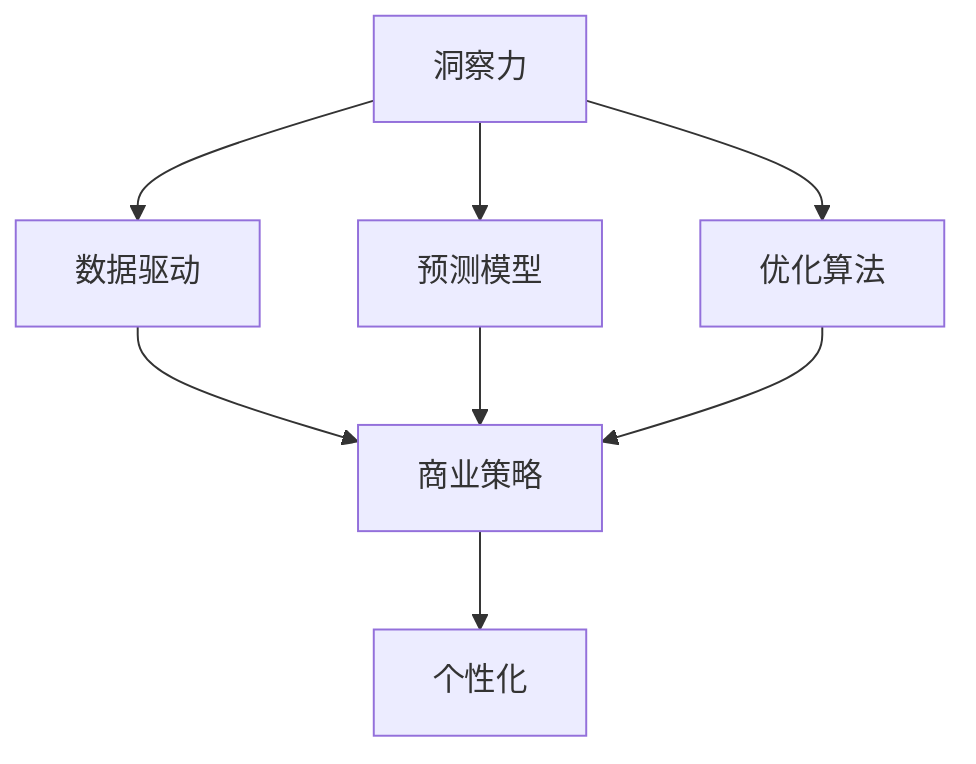

                 

# 理解洞察力的应用：在商业策略中的实践

> 关键词：洞察力,商业策略,数据驱动,人工智能,算法,数据分析,预测模型,决策优化

## 1. 背景介绍

### 1.1 问题由来

在当今信息爆炸的时代，企业需要处理和分析大量复杂的数据，以洞察市场动态、优化产品设计、提升客户体验、增强竞争优势。然而，单纯依靠人工直觉和经验进行商业决策往往存在局限性，特别是在信息量巨大、变化迅猛的现代商业环境中。

为了应对这些挑战，商业领袖和决策者开始引入更加科学、系统的洞察力分析方法。利用数据科学、人工智能等先进技术，能够实现对海量数据的自动化、智能化处理，从而为企业带来精准、及时的商业洞察力。

### 1.2 问题核心关键点

洞察力在商业策略中的应用主要包括以下几个方面：

1. **数据驱动决策**：基于数据和模型的分析，而不是完全依赖直觉和经验。
2. **实时数据处理**：利用实时数据流和流计算技术，及时反映市场变化。
3. **预测与优化**：运用机器学习模型，对未来市场趋势进行预测，并优化业务策略。
4. **个性化营销**：通过大数据分析，实现对不同客户群体进行精准营销。
5. **风险管理**：通过预测和建模，识别潜在风险，制定应对措施。
6. **业务流程自动化**：利用人工智能和自动化技术，提升运营效率。

## 2. 核心概念与联系

### 2.1 核心概念概述

为更好地理解如何在商业策略中应用洞察力，本节将介绍几个关键概念及其之间的联系：

- **洞察力**：指通过分析和解释数据，揭示市场、消费者行为等隐藏趋势和模式的能力。
- **商业策略**：企业根据内外环境，制定长期、中短期目标，并采取相应措施以实现这些目标的过程。
- **数据驱动**：基于数据和统计分析，而非仅凭经验和直觉做决策的方法。
- **预测模型**：通过机器学习算法，对未来市场趋势进行预测的数学模型。
- **优化算法**：运用数学和计算机技术，寻找问题的最优解或近似最优解的算法。
- **个性化**：根据不同客户或情景的特点，定制化产品或服务。

这些概念之间的逻辑关系可以通过以下Mermaid流程图来展示：



这个流程图展示了大数据与商业策略之间的连接过程：

1. 洞察力通过数据分析揭示隐藏的模式和趋势。
2. 数据驱动使商业策略基于事实和统计分析而非直觉。
3. 预测模型基于历史数据预测未来趋势，支持策略制定。
4. 优化算法寻找策略的最优解，提升决策效率。
5. 个性化策略针对不同客户，实现定制化服务。

## 3. 核心算法原理 & 具体操作步骤
### 3.1 算法原理概述

商业策略中的洞察力应用，主要基于数据驱动、机器学习和优化算法三个核心步骤。其核心思想是通过数据分析和机器学习模型，从海量数据中提取有价值的洞察力，并结合优化算法，制定和优化商业策略。

具体来说，商业策略的洞察力应用包括以下几个关键步骤：

1. **数据采集与预处理**：收集相关数据，并进行清洗、归一化、特征提取等预处理操作。
2. **数据建模与分析**：基于历史数据，构建预测模型，进行数据挖掘和模式识别。
3. **策略制定与优化**：将分析结果转化为具体的商业策略，并利用优化算法进行优化。
4. **执行与监控**：将优化后的策略付诸实施，并实时监控其效果，进行动态调整。

### 3.2 算法步骤详解

以下是商业策略中洞察力应用的详细步骤：

#### 步骤1：数据采集与预处理

1. **数据来源**：从企业内部系统、市场调研、社交媒体、公开数据等渠道，收集相关数据。
2. **数据清洗**：去除无效、重复、噪声数据，进行缺失值处理和异常值检测。
3. **数据归一化**：将不同单位、不同尺度的数据转换为标准单位，便于后续分析。
4. **特征工程**：提取、选择、构造特征，形成输入向量。

#### 步骤2：数据建模与分析

1. **历史数据分析**：对历史数据进行统计分析，发现规律和趋势。
2. **预测模型构建**：选择适合的算法，如线性回归、决策树、神经网络等，构建预测模型。
3. **模型评估与优化**：使用交叉验证、网格搜索等方法，对模型进行评估和调优。

#### 步骤3：策略制定与优化

1. **策略制定**：根据分析结果，制定具体的商业策略。
2. **策略模拟与优化**：利用模拟实验或优化算法，对策略进行评估和优化。
3. **策略实施**：将优化后的策略付诸实施，并进行实时监控。

#### 步骤4：执行与监控

1. **策略实施**：执行优化后的商业策略。
2. **效果评估**：实时监控策略实施效果，进行动态调整。
3. **迭代优化**：根据监控结果，不断优化商业策略。

### 3.3 算法优缺点

商业策略中的洞察力应用具有以下优点：

1. **科学性**：基于数据和算法，减少直觉和经验带来的主观偏差。
2. **及时性**：实时数据处理和分析，快速响应市场变化。
3. **精度高**：机器学习模型在数据驱动下，能够提高预测和分析的精度。
4. **可解释性**：基于数据和模型的分析，结果具有较高的可解释性。
5. **灵活性**：算法模型可针对不同场景进行调整，适应性强。

同时，该方法也存在一些缺点：

1. **数据质量要求高**：需要高质量、完整、准确的数据，否则分析结果可能不正确。
2. **算法复杂度高**：复杂的模型可能存在过拟合问题，需要足够的计算资源。
3. **技术门槛高**：需要一定的数据科学和算法知识，非专业人士难以实施。
4. **实施成本高**：数据采集、预处理、模型构建等环节，需要一定的成本投入。

尽管存在这些局限性，但就目前而言，商业策略中的洞察力应用仍是企业获取竞争优势的重要手段。未来相关研究的重点在于如何进一步降低技术门槛，提高算法的效率和鲁棒性，同时兼顾成本和效果之间的平衡。

### 3.4 算法应用领域

商业策略中的洞察力应用已经在多个领域得到了广泛应用，例如：

- **金融**：通过数据分析和预测模型，优化投资策略，防范金融风险。
- **零售**：通过消费者行为数据分析，实现个性化推荐和精准营销。
- **制造**：通过供应链数据分析，优化生产流程，提高效率。
- **医疗**：通过患者数据和病历分析，制定个性化治疗方案。
- **旅游**：通过旅游行为数据分析，实现客户细分和个性化服务。
- **市场营销**：通过市场调研数据，优化广告投放和营销策略。
- **人力资源管理**：通过员工数据和绩效分析，优化招聘和培训策略。

除了上述这些经典领域外，商业策略中的洞察力应用也被创新性地应用到更多场景中，如供应链优化、产品迭代、客户服务优化等，为企业提供了新的增长机会。

## 4. 数学模型和公式 & 详细讲解  
### 4.1 数学模型构建

商业策略中的洞察力应用，通常涉及以下几个数学模型：

- **线性回归模型**：
$$
y = \beta_0 + \beta_1x_1 + \beta_2x_2 + \cdots + \beta_nx_n + \epsilon
$$
- **决策树模型**：
- **神经网络模型**：
- **聚类模型**：
$$
\min_{C} \sum_{i=1}^{n} \sum_{j=1}^{k} (y_{ij} - z_{ij})^2
$$

### 4.2 公式推导过程

以线性回归模型为例，推导其最小二乘法的求解过程：

设训练数据集为 $(x_1, y_1), (x_2, y_2), \cdots, (x_n, y_n)$，其中 $y = \beta_0 + \beta_1x_1 + \beta_2x_2 + \cdots + \beta_nx_n + \epsilon$，目标是最小化损失函数：

$$
\mathcal{L}(\beta) = \frac{1}{n} \sum_{i=1}^{n} (y_i - (\beta_0 + \beta_1x_{i1} + \beta_2x_{i2} + \cdots + \beta_nx_{in}))^2
$$

使用拉格朗日乘子法求解：

$$
\min_{\beta} \frac{1}{n} \sum_{i=1}^{n} (y_i - \beta_0 - \sum_{j=1}^{n} \beta_j x_{ij})^2
$$

通过求解偏导数并令其为0，得到：

$$
\beta_0 = \frac{1}{n} \sum_{i=1}^{n} y_i
$$

$$
\beta_j = \frac{1}{n} \sum_{i=1}^{n} (x_{ij} - \bar{x}_j)(y_i - \bar{y})
$$

其中 $\bar{x}_j$ 和 $\bar{y}$ 分别为 $x_j$ 和 $y$ 的均值。

### 4.3 案例分析与讲解

以金融市场预测为例，分析如何使用线性回归模型进行股市预测：

1. **数据采集**：从金融市场历史数据中，收集股票价格、交易量、公司财务指标等数据。
2. **数据预处理**：进行缺失值处理、归一化等操作。
3. **模型构建**：构建线性回归模型，将股票价格作为目标变量，将财务指标和市场指数作为预测变量。
4. **模型评估与优化**：使用交叉验证、网格搜索等方法，优化模型参数，提高预测精度。
5. **策略制定**：根据模型结果，制定投资策略，如买入、持有、卖出等。
6. **策略实施与监控**：将优化后的策略付诸实施，并实时监控其效果，进行动态调整。

## 5. 项目实践：代码实例和详细解释说明
### 5.1 开发环境搭建

在进行商业策略中的洞察力应用实践前，我们需要准备好开发环境。以下是使用Python进行数据分析和机器学习的开发环境配置流程：

1. 安装Anaconda：从官网下载并安装Anaconda，用于创建独立的Python环境。

2. 创建并激活虚拟环境：
```bash
conda create -n data-env python=3.8 
conda activate data-env
```

3. 安装必要的库：
```bash
conda install numpy pandas scikit-learn matplotlib seaborn statsmodels jupyter notebook ipython
```

完成上述步骤后，即可在`data-env`环境中开始洞察力应用的开发实践。

### 5.2 源代码详细实现

下面我们以金融市场预测为例，给出使用Scikit-learn库进行线性回归模型构建和优化的PyTorch代码实现。

```python
import numpy as np
import pandas as pd
from sklearn.linear_model import LinearRegression
from sklearn.model_selection import train_test_split
from sklearn.metrics import mean_squared_error

# 读取数据
data = pd.read_csv('stock_data.csv')

# 特征工程
X = data[['EPS', 'PE_ratio', 'ROE', 'Payout_ratio', 'Dividend_yield']]
y = data['Price']

# 数据划分
X_train, X_test, y_train, y_test = train_test_split(X, y, test_size=0.2, random_state=42)

# 模型训练
model = LinearRegression()
model.fit(X_train, y_train)

# 模型评估
y_pred = model.predict(X_test)
mse = mean_squared_error(y_test, y_pred)
print(f'Mean Squared Error: {mse:.2f}')

# 策略制定
if mse < 0.01:
    strategy = 'Hold'
else:
    strategy = 'Sell'

# 策略实施与监控
if strategy == 'Hold':
    print('Hold current stocks')
elif strategy == 'Sell':
    print('Sell stocks')
```

以上就是使用Scikit-learn库构建和优化线性回归模型的完整代码实现。可以看到，使用Scikit-learn库进行机器学习模型的开发，代码简洁高效，易于理解。

### 5.3 代码解读与分析

让我们再详细解读一下关键代码的实现细节：

**特征工程**：
- 选择财务指标（EPS、PE_ratio、ROE、Payout_ratio、Dividend_yield）作为预测变量，价格作为目标变量。
- 使用Scikit-learn的`train_test_split`函数，将数据划分为训练集和测试集。

**模型训练与评估**：
- 使用Scikit-learn的`LinearRegression`类，构建线性回归模型。
- 调用`fit`方法进行模型训练。
- 使用`mean_squared_error`函数计算模型在测试集上的均方误差。

**策略制定与实施**：
- 根据均方误差的大小，制定相应的投资策略。
- 使用简单的`if-else`语句，将策略付诸实施。

可以看到，Scikit-learn库使得机器学习模型的构建和优化变得相对容易，开发者可以将更多精力放在特征选择、模型调参等高层逻辑上，而不必过多关注底层的实现细节。

当然，工业级的系统实现还需考虑更多因素，如模型的保存和部署、超参数的自动搜索、更灵活的任务适配层等。但核心的洞察力应用流程基本与此类似。

## 6. 实际应用场景
### 6.1 金融市场预测

商业策略中的洞察力应用在金融市场预测中有着广泛的应用。通过分析历史市场数据和公司财务数据，预测未来股票价格的走势，制定投资策略，可以有效规避风险，提升投资回报。

具体而言，可以收集历史股价、交易量、公司财务数据等，进行数据清洗和特征工程，构建线性回归模型，并使用交叉验证、网格搜索等方法进行模型调优。最终得到预测模型后，根据市场情况和模型结果，制定买入、持有、卖出等策略，并进行实时监控和动态调整。

### 6.2 客户细分与精准营销

商业策略中的洞察力应用可以帮助企业实现客户细分和精准营销。通过分析客户行为数据、购买历史、社交媒体活动等，识别不同客户群体的特征，制定针对性的营销策略，提高客户满意度和忠诚度。

具体而言，可以收集客户购买记录、社交媒体互动数据、网站访问记录等，进行数据清洗和特征工程，构建聚类模型，并使用交叉验证、网格搜索等方法进行模型调优。最终得到聚类模型后，根据客户群体特征，制定个性化的营销策略，并进行实时监控和动态调整。

### 6.3 供应链优化

商业策略中的洞察力应用可以优化供应链管理，提升运营效率，降低成本。通过分析供应链数据、物流信息、生产数据等，预测物资需求，优化库存管理，制定最优的采购和生产计划。

具体而言，可以收集供应链数据、物流信息、生产数据等，进行数据清洗和特征工程，构建预测模型，并使用交叉验证、网格搜索等方法进行模型调优。最终得到预测模型后，根据物资需求预测结果，制定最优的采购和生产计划，并进行实时监控和动态调整。

### 6.4 未来应用展望

随着商业策略中洞察力应用技术的不断发展，未来在更多领域将得到应用，为各行业带来变革性影响。

在智慧医疗领域，通过洞察力分析，可以优化医疗资源配置，提高诊疗效率，提升患者满意度。在智慧城市治理中，通过洞察力分析，可以实现城市事件监测、舆情分析、应急指挥等环节的智能化，提高城市管理的自动化水平。

此外，在企业生产、社会治理、文娱传媒等众多领域，商业策略中的洞察力应用也将不断涌现，为各行业带来新的增长点，推动经济社会的全面发展。

## 7. 工具和资源推荐
### 7.1 学习资源推荐

为了帮助开发者系统掌握商业策略中洞察力应用的理论基础和实践技巧，这里推荐一些优质的学习资源：

1. 《数据科学导论》系列书籍：由国内外知名数据科学专家撰写，涵盖数据科学基础、统计分析、机器学习等核心内容。
2. 《Python数据分析实战》系列课程：通过Python实现数据分析和机器学习，适合初学者入门。
3. Kaggle平台：提供丰富的数据集和竞赛项目，通过实际数据处理和模型构建，提升实战能力。
4. Coursera《数据科学与机器学习》课程：斯坦福大学开设的高级课程，深入讲解数据科学和机器学习的原理与实践。
5. O'Reilly《商业智能》书籍：介绍商业智能技术的应用，包括数据仓库、BI工具、数据可视化等。

通过对这些资源的学习实践，相信你一定能够快速掌握商业策略中洞察力应用的精髓，并用于解决实际的商业问题。

### 7.2 开发工具推荐

高效的开发离不开优秀的工具支持。以下是几款用于商业策略中洞察力应用开发的常用工具：

1. Jupyter Notebook：基于Web的交互式编程环境，支持多语言的代码编写和数据可视化。
2. PyCharm：IDE工具，提供丰富的代码调试和版本控制功能。
3. Visual Studio Code：轻量级的代码编辑器，支持多种语言和扩展。
4. RStudio：专门用于R语言的IDE，提供丰富的数据分析和可视化功能。
5. KNIME：开源的数据分析和机器学习工作流工具，支持流程化编程。

合理利用这些工具，可以显著提升商业策略中洞察力应用任务的开发效率，加快创新迭代的步伐。

### 7.3 相关论文推荐

商业策略中洞察力应用的研究源于学界的持续研究。以下是几篇奠基性的相关论文，推荐阅读：

1. "Data Mining and Statistical Learning" by T. Hastie, R. Tibshirani, and J. Friedman。介绍数据挖掘和统计学习的原理与方法。
2. "Machine Learning Yearning" by A. Ng。介绍机器学习在商业中的应用，包括数据处理、模型构建、结果解释等。
3. "The Elements of Statistical Learning" by T. Hastie, R. Tibshirani, and J. Friedman。介绍统计学习的基础理论和算法。
4. "Predictive Modeling and Data Mining" by D. Hand。介绍预测建模和数据挖掘的实践案例。
5. "Data Mining and Statistical Learning" by G. Brown and G. Maclaren。介绍数据挖掘和统计学习的最新进展。

这些论文代表了大数据和机器学习在商业策略中应用的发展脉络。通过学习这些前沿成果，可以帮助研究者把握学科前进方向，激发更多的创新灵感。

## 8. 总结：未来发展趋势与挑战

### 8.1 总结

本文对商业策略中洞察力应用的方法进行了全面系统的介绍。首先阐述了洞察力在商业策略中的应用背景和重要性，明确了洞察力在商业决策中的关键作用。其次，从原理到实践，详细讲解了洞察力应用的数学模型和操作步骤，给出了商业策略中的洞察力应用的完整代码实例。同时，本文还广泛探讨了洞察力应用在金融、零售、制造等多个行业领域的应用前景，展示了洞察力分析技术的巨大潜力。此外，本文精选了洞察力应用的各类学习资源，力求为读者提供全方位的技术指引。

通过本文的系统梳理，可以看到，商业策略中的洞察力应用已经成为现代企业获取竞争优势的重要手段，极大地提升了决策的科学性和精准度。未来，伴随数据分析和机器学习技术的不断进步，洞察力应用将进一步普及，成为企业数字化转型的核心工具。

### 8.2 未来发展趋势

展望未来，商业策略中的洞察力应用将呈现以下几个发展趋势：

1. **技术集成化**：结合物联网、人工智能、大数据等技术，实现更为全面、智能的洞察力分析。
2. **实时性增强**：利用流计算和实时数据处理技术，提高洞察力分析的及时性，快速响应市场变化。
3. **算法智能化**：引入深度学习、强化学习等高级算法，提高洞察力分析的精度和鲁棒性。
4. **决策自动化**：利用自动化技术，实现洞察力分析结果的自动化决策，提高效率。
5. **模型透明化**：提升模型的可解释性，帮助决策者理解和信任洞察力分析结果。
6. **跨领域应用**：将洞察力分析技术应用于更多领域，如智慧医疗、智慧城市等，推动各行各业的数字化转型。

以上趋势凸显了商业策略中洞察力分析技术的广阔前景。这些方向的探索发展，必将进一步提升洞察力应用的广泛性和深度，为各行业带来新的增长点。

### 8.3 面临的挑战

尽管商业策略中的洞察力应用已经取得了显著进展，但在迈向更加智能化、普适化应用的过程中，它仍面临着诸多挑战：

1. **数据质量问题**：数据缺失、噪声、不一致等问题，可能导致洞察力分析结果不准确。
2. **技术门槛高**：洞察力应用需要一定的数据科学和算法知识，非专业人士难以实施。
3. **隐私和安全问题**：商业策略中洞察力应用涉及大量敏感数据，数据隐私和安全问题不容忽视。
4. **成本问题**：数据采集、预处理、模型构建等环节，需要一定的成本投入。
5. **动态性挑战**：市场环境变化快，洞察力分析模型需要不断更新，以保持其时效性。

尽管存在这些挑战，但商业策略中的洞察力应用在技术进步和应用场景的不断拓展下，将得到进一步提升和完善。

### 8.4 研究展望

面对商业策略中洞察力应用所面临的挑战，未来的研究需要在以下几个方面寻求新的突破：

1. **数据质量提升**：改进数据采集和预处理技术，提高数据质量，减少数据噪音和偏差。
2. **技术普及化**：开发更加易用、易理解的工具和平台，降低技术门槛，推广洞察力应用。
3. **隐私保护机制**：引入数据加密、匿名化等技术，保护用户隐私，确保数据安全。
4. **动态模型构建**：开发自适应模型更新机制，实时调整模型参数，保持洞察力分析的时效性。
5. **跨领域应用探索**：将洞察力分析技术应用于更多领域，推动各行业的数字化转型。

这些研究方向的探索，必将引领商业策略中的洞察力应用技术迈向更高的台阶，为各行各业带来新的增长点。相信随着学界和产业界的共同努力，这些挑战终将一一被克服，洞察力应用必将在构建智能化、数字化商业环境中发挥更大的作用。

## 9. 附录：常见问题与解答

**Q1：商业策略中的洞察力应用是否适用于所有商业领域？**

A: 商业策略中的洞察力应用在大多数商业领域都有应用价值，但具体效果和应用方式会根据不同领域的特点而有所不同。例如，在金融、零售、制造等领域，洞察力应用已经取得了显著成效。而在一些特定领域，如农业、艺术等，其数据特性和业务需求可能与主流商业策略不同，洞察力应用的方式和效果也会有所差异。

**Q2：洞察力应用需要哪些技术支持？**

A: 洞察力应用主要依赖以下几类技术：

1. **数据处理和清洗技术**：数据清洗、特征提取、数据可视化等。
2. **机器学习算法**：线性回归、决策树、随机森林、神经网络等。
3. **统计分析方法**：假设检验、回归分析、时间序列分析等。
4. **流计算技术**：实时数据处理、流式数据集成等。
5. **可视化工具**：数据可视化、仪表盘、报告生成等。

这些技术相互配合，共同构成了商业策略中洞察力应用的基础。

**Q3：洞察力应用如何提升决策质量？**

A: 洞察力应用通过数据分析和模型构建，从海量数据中提取有价值的洞察力，为商业决策提供科学依据。具体来说，洞察力应用能够：

1. **数据驱动**：减少直觉和经验带来的主观偏差，提高决策的客观性和准确性。
2. **预测未来**：通过历史数据分析和预测模型，预测市场趋势和客户行为，指导决策。
3. **优化策略**：利用优化算法，寻找最优决策方案，提高效率和效果。
4. **实时监控**：实时监控决策效果，进行动态调整，保持决策的时效性。

**Q4：洞察力应用如何平衡效率和效果？**

A: 洞察力应用需要综合考虑效率和效果：

1. **数据质量**：确保数据高质量、完整、准确，减少数据噪音和偏差，提高分析效果。
2. **算法优化**：选择适当的算法，进行模型调优，提高预测精度和鲁棒性。
3. **自动化**：引入自动化技术，实现数据处理和模型构建的自动化，提高效率。
4. **迭代改进**：根据实际效果，不断优化模型和算法，平衡效率和效果。

总之，洞察力应用需要根据具体场景和需求，进行综合考虑和优化，才能最大限度地发挥其价值。

**Q5：洞察力应用如何确保隐私和安全？**

A: 洞察力应用涉及大量敏感数据，隐私和安全问题至关重要：

1. **数据匿名化**：对敏感数据进行匿名化处理，保护用户隐私。
2. **数据加密**：使用数据加密技术，确保数据在传输和存储过程中的安全性。
3. **访问控制**：对数据进行严格访问控制，确保只有授权人员可以访问敏感数据。
4. **合规审查**：遵守相关法律法规，确保数据处理合规。

这些措施可以有效保障洞察力应用中的隐私和安全问题。

---

作者：禅与计算机程序设计艺术 / Zen and the Art of Computer Programming

