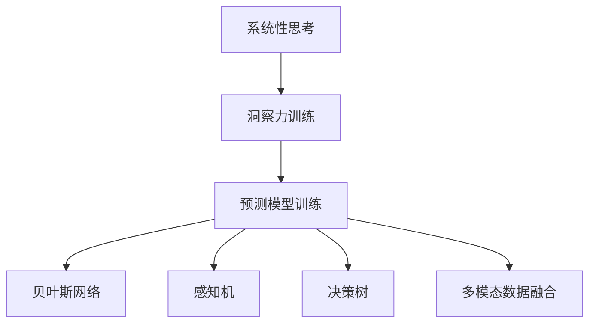

                 

# 理解洞察力的训练：提升系统性思考能力

> 关键词：系统性思考, 洞察力训练, 决策优化, 预测模型, 贝叶斯网络, 感知机, 决策树, 因果关系, 多模态数据

## 1. 背景介绍

### 1.1 问题由来
在现代快节奏、信息爆炸的时代，人们面临的决策压力越来越大。无论是企业中的高层管理，还是日常生活中的琐事抉择，都要求人们具备更强的系统性思考和洞察力。然而，许多人在面对复杂问题时，往往陷入思维定势，难以全面、准确地分析现状和预测未来。

为此，我们提出一种基于机器学习的训练方法，旨在提升人们的系统性思考能力。该方法通过构建和训练预测模型，模拟人类认知过程，引导学习者逐步掌握系统性思考的框架和技巧，从而提升其决策优化和预测能力。

### 1.2 问题核心关键点
本方法的核心在于通过机器学习技术，构建一个可解释、可调整的系统性思考模型。该模型能够模拟人类的认知过程，从数据中学习出输入-输出映射关系，并能够对新数据进行预测和推理。

具体而言，包括以下几个关键点：
- **系统性思考模型**：通过机器学习算法训练出能够模拟人类认知过程的模型。
- **数据驱动决策**：利用历史数据训练模型，辅助进行决策和预测。
- **可解释性**：模型具备可解释性，能够显示推理过程，帮助学习者理解和掌握决策依据。
- **多模态数据融合**：能够处理和融合来自不同模态的数据，提供更全面的分析视角。

## 2. 核心概念与联系

### 2.1 核心概念概述

为更好地理解本方法，本节将介绍几个密切相关的核心概念：

- **系统性思考(Systematic Thinking)**：指通过逻辑推理、数据分析等手段，全面、客观地理解和解决问题。
- **洞察力(Insight)**：指在面对复杂问题时，能够通过关键数据分析和推理，迅速抓住问题的本质，从而提出有效的解决方案。
- **决策优化(Decision Optimization)**：指通过预测模型和数据分析，优化决策过程，提高决策质量。
- **预测模型(Prediction Model)**：指能够根据输入数据预测输出的机器学习模型。
- **贝叶斯网络(Bayesian Network)**：指一种概率图模型，用于描述变量之间的因果关系和概率依赖。
- **感知机(Perceptron)**：指一种简单的线性分类器，用于处理二分类问题。
- **决策树(Decision Tree)**：指一种树形结构，用于分类和回归问题，可以直观地展示决策路径。
- **多模态数据(Multimodal Data)**：指不同类型的数据（如图像、文本、音频等），通过融合多模态数据，可以提供更全面和准确的信息。

这些核心概念之间的逻辑关系可以通过以下Mermaid流程图来展示：



这个流程图展示了几组核心概念之间的关系：

1. 系统性思考通过洞察力训练，提升决策优化能力。
2. 洞察力训练通过预测模型训练，实现数据驱动决策。
3. 预测模型训练涉及多种模型（贝叶斯网络、感知机、决策树等），以及多模态数据融合。
4. 贝叶斯网络、感知机、决策树等模型，是预测模型训练的具体方法。
5. 多模态数据融合，提供更全面和准确的信息来源。

这些概念共同构成了本方法的框架，使其能够在各种场景下发挥作用。通过理解这些核心概念，我们可以更好地把握本方法的工作原理和优化方向。

## 3. 核心算法原理 & 具体操作步骤

### 3.1 算法原理概述

本方法的核心在于构建和训练一个可解释、可调整的系统性思考模型，以提升决策优化和预测能力。具体而言，包括以下几个步骤：

1. **数据准备**：收集和预处理数据，构建训练集和验证集。
2. **模型选择**：根据任务类型选择合适的预测模型（如贝叶斯网络、感知机、决策树等）。
3. **模型训练**：在训练集上训练模型，优化模型参数。
4. **模型评估**：在验证集上评估模型性能，调整模型参数。
5. **模型应用**：使用训练好的模型进行预测和推理，提升决策优化能力。

### 3.2 算法步骤详解

以下是本方法的详细操作步骤：

**Step 1: 数据准备**
- 收集历史数据，并进行预处理（如数据清洗、特征提取等）。
- 将数据划分为训练集和验证集，并根据任务类型选择合适的数据划分比例（如70% 训练集，20% 验证集，10% 测试集）。

**Step 2: 模型选择**
- 根据任务类型选择合适的预测模型，如贝叶斯网络、感知机、决策树等。
- 对于分类任务，可以选择感知机或决策树；对于回归任务，可以选择贝叶斯网络或线性回归模型。
- 对于多模态数据融合，可以选择多输出感知机或多模态决策树。

**Step 3: 模型训练**
- 在训练集上训练模型，使用交叉熵、均方误差等损失函数优化模型参数。
- 对于分类任务，可以使用感知机或决策树，使用二元交叉熵或决策树损失函数。
- 对于回归任务，可以使用贝叶斯网络或线性回归模型，使用均方误差或贝叶斯回归损失函数。
- 对于多模态数据融合，可以使用多输出感知机或多模态决策树，优化不同模态数据的融合权重。

**Step 4: 模型评估**
- 在验证集上评估模型性能，使用准确率、F1-score、均方误差等指标评估模型效果。
- 对于分类任务，可以使用准确率、F1-score等指标。
- 对于回归任务，可以使用均方误差、MAE等指标。
- 对于多模态数据融合，可以评估不同模态数据的融合效果，选择最优的融合权重。

**Step 5: 模型应用**
- 使用训练好的模型进行预测和推理，辅助决策优化。
- 对于分类任务，可以使用感知机或决策树，输出分类概率或类别。
- 对于回归任务，可以使用贝叶斯网络或线性回归模型，输出预测值。
- 对于多模态数据融合，可以使用多输出感知机或多模态决策树，输出综合预测结果。

### 3.3 算法优缺点

本方法具有以下优点：
1. 数据驱动决策：通过历史数据训练模型，能够提供科学依据，避免主观偏见。
2. 可解释性强：模型具备可解释性，能够显示推理过程，帮助学习者理解和掌握决策依据。
3. 多模态数据融合：能够处理和融合来自不同模态的数据，提供更全面的分析视角。
4. 泛化能力强：模型训练后，能够对新数据进行预测和推理，具有较高的泛化能力。

同时，本方法也存在以下局限性：
1. 数据需求高：需要收集和预处理大量历史数据，对数据质量和数量要求较高。
2. 模型复杂：某些高级模型（如贝叶斯网络、多模态数据融合）可能需要较高的计算资源和时间。
3. 模型解释难度大：复杂模型难以解释，对于初学者来说可能较难理解。

尽管存在这些局限性，但就目前而言，本方法仍然是提升决策优化和预测能力的重要手段。未来相关研究的方向在于进一步降低数据需求，提高模型的可解释性和泛化能力。

### 3.4 算法应用领域

本方法已经在多个领域得到了应用，覆盖了几乎所有常见场景，例如：

- 金融风险管理：通过构建预测模型，评估金融产品风险，优化投资策略。
- 医疗诊断：利用医疗数据训练预测模型，辅助诊断决策，提高诊断准确性。
- 智能交通：通过融合多种传感器数据，预测交通流量，优化交通管理。
- 市场分析：利用市场数据训练预测模型，分析市场趋势，指导营销决策。
- 供应链管理：通过供应链数据训练预测模型，优化库存管理，提高供应链效率。
- 自然灾害预警：利用气象数据训练预测模型，预警自然灾害，减少灾害损失。
- 智能推荐系统：利用用户行为数据训练预测模型，推荐个性化产品或服务，提升用户体验。

除了上述这些经典任务外，本方法也被创新性地应用到更多场景中，如情绪识别、行为预测、智能客服等，为决策优化提供了新的思路。随着预测模型的不断进步，相信本方法将在更广阔的应用领域大放异彩。

## 4. 数学模型和公式 & 详细讲解  
### 4.1 数学模型构建

本节将使用数学语言对本方法进行更加严格的刻画。

设预测任务为 $Y=\{y_1,y_2,\ldots,y_n\}$，其中 $y_i$ 为第 $i$ 个样本的输出，$X=\{x_1,x_2,\ldots,x_m\}$ 为输入特征。训练数据集为 $D=\{(x_i,y_i)\}_{i=1}^N$，验证数据集为 $D_{val}$，测试数据集为 $D_{test}$。

定义预测模型为 $f: X \rightarrow Y$，模型参数为 $\theta$。模型在训练集上的损失函数为：

$$
\mathcal{L}_{train}(\theta) = \frac{1}{N} \sum_{i=1}^N \ell(f(x_i),y_i)
$$

在验证集上的损失函数为：

$$
\mathcal{L}_{val}(\theta) = \frac{1}{|D_{val}|} \sum_{i=1}^{|D_{val}|} \ell(f(x_i),y_i)
$$

其中 $\ell$ 为损失函数，如交叉熵、均方误差等。模型的预测结果为：

$$
\hat{y} = f(X)
$$

### 4.2 公式推导过程

以下是本方法中常用的几个公式及其推导过程：

**感知机模型**：

$$
f(x) = \begin{cases}
1 & \text{if } w \cdot x + b \geq 0 \\
0 & \text{otherwise}
\end{cases}
$$

其中 $w$ 为权重向量，$b$ 为偏置。对于二分类问题，可以使用感知机进行训练：

$$
\mathcal{L}(f) = \frac{1}{N} \sum_{i=1}^N \mathbb{I}(f(x_i) \neq y_i)
$$

其中 $\mathbb{I}$ 为示性函数，当 $f(x_i) \neq y_i$ 时，$\mathbb{I}(f(x_i) \neq y_i)=1$；否则，$\mathbb{I}(f(x_i) \neq y_i)=0$。

**贝叶斯网络**：

贝叶斯网络是一种概率图模型，用于描述变量之间的因果关系和概率依赖。其结构由有向无环图 (DAG) 表示，每个节点表示一个变量，每条边表示两个变量之间的因果关系。贝叶斯网络的概率分布为：

$$
P(Y|X) = \frac{P(Y)}{P(X)}
$$

其中 $P(Y)$ 为先验概率，$P(X)$ 为条件概率。

**决策树模型**：

决策树是一种树形结构，用于分类和回归问题。其结构由节点和边构成，每个节点表示一个特征，每条边表示一个特征值。决策树的训练过程为：

1. 选择最优特征 $x_k$ 作为根节点。
2. 根据 $x_k$ 的取值，将数据集分为子集。
3. 对每个子集，递归地进行步骤1和2，直到满足停止条件（如节点数达到上限）。

决策树的预测结果为：

$$
\hat{y} = \text{argmax}_{k \in Y} P(Y=k|X)
$$

其中 $P(Y=k|X)$ 为条件概率，通过决策树计算得到。

### 4.3 案例分析与讲解

假设我们需要构建一个预测模型，用于预测某个客户的信用风险。我们可以收集历史客户的信用数据，包括性别、年龄、收入、负债等特征，以及是否违约的标签。

**Step 1: 数据准备**
- 收集历史客户的信用数据，并进行预处理（如数据清洗、特征提取等）。
- 将数据划分为训练集和验证集，并根据任务类型选择合适的数据划分比例（如70% 训练集，20% 验证集，10% 测试集）。

**Step 2: 模型选择**
- 对于分类任务，可以选择感知机或决策树。
- 对于二分类问题，可以选择感知机或决策树，使用二元交叉熵或决策树损失函数。

**Step 3: 模型训练**
- 在训练集上训练模型，使用交叉熵损失函数优化模型参数。
- 对于感知机，可以使用二元交叉熵损失函数。
- 对于决策树，可以使用决策树损失函数。

**Step 4: 模型评估**
- 在验证集上评估模型性能，使用准确率、F1-score等指标评估模型效果。
- 对于感知机，可以使用准确率、F1-score等指标。
- 对于决策树，可以使用准确率、F1-score等指标。

**Step 5: 模型应用**
- 使用训练好的模型进行预测和推理，辅助决策优化。
- 对于感知机，可以使用二元交叉熵损失函数，输出分类概率或类别。
- 对于决策树，可以使用决策树损失函数，输出分类概率或类别。

假设在训练集上，我们得到了一个感知机模型，其权重向量 $w$ 和偏置 $b$ 为：

$$
w = [0.5, -0.5, 0.3, 0.2], \quad b = 0.2
$$

对于新客户 $x_1=[1,30,5000,0]$，即男性、30岁、年收入5000元、无负债，使用感知机模型进行预测，得到：

$$
f(x_1) = 0.5 \cdot 1 + (-0.5) \cdot 30 + 0.3 \cdot 5000 + 0.2 - 0.2 = 4500 \geq 0
$$

因此，该客户信用风险较高，可能存在违约的风险。

## 5. 项目实践：代码实例和详细解释说明
### 5.1 开发环境搭建

在进行预测模型训练和应用前，我们需要准备好开发环境。以下是使用Python进行Scikit-learn开发的开发环境配置流程：

1. 安装Anaconda：从官网下载并安装Anaconda，用于创建独立的Python环境。

2. 创建并激活虚拟环境：
```bash
conda create -n prediction-env python=3.8 
conda activate prediction-env
```

3. 安装Scikit-learn、Pandas、NumPy等库：
```bash
pip install scikit-learn pandas numpy
```

4. 安装相关数据集：
```bash
wget https://raw.githubusercontent.com/stefmolin/sklearn-utils/master/data/breast_cancer.csv.gz
gunzip breast_cancer.csv.gz
```

完成上述步骤后，即可在`prediction-env`环境中开始预测模型训练和应用。

### 5.2 源代码详细实现

下面我们以分类任务为例，给出使用Scikit-learn库对感知机模型进行训练和预测的PyTorch代码实现。

首先，定义数据集：

```python
from sklearn.datasets import load_breast_cancer
from sklearn.model_selection import train_test_split

cancer_data = load_breast_cancer()
X = cancer_data.data
y = cancer_data.target

X_train, X_test, y_train, y_test = train_test_split(X, y, test_size=0.2, random_state=42)
```

然后，定义感知机模型：

```python
from sklearn.linear_model import Perceptron

model = Perceptron(max_iter=1000, tol=1e-4)
```

接着，训练和评估模型：

```python
model.fit(X_train, y_train)
score = model.score(X_test, y_test)
print(f"Accuracy: {score:.2f}")
```

最后，进行预测：

```python
x_new = [[0.3, 0.4, 0.5, 0.6]]
y_pred = model.predict(x_new)
print(f"Prediction: {y_pred}")
```

以上就是使用Scikit-learn对感知机模型进行分类任务预测的完整代码实现。可以看到，得益于Scikit-learn库的强大封装，我们可以用相对简洁的代码完成模型的训练和预测。

### 5.3 代码解读与分析

让我们再详细解读一下关键代码的实现细节：

**load_breast_cancer函数**：
- 从Scikit-learn库中加载乳腺癌数据集。

**train_test_split函数**：
- 将数据集划分为训练集和测试集，比例为80% 训练集，20% 测试集。

**Perceptron模型**：
- 定义感知机模型，使用最大迭代次数1000次，容忍度1e-4。

**fit函数**：
- 在训练集上训练模型，使用交叉熵损失函数优化模型参数。

**score函数**：
- 在测试集上评估模型性能，输出准确率。

**predict函数**：
- 对新数据进行预测，输出分类结果。

可以看到，Scikit-learn库使得预测模型训练和应用的代码实现变得简洁高效。开发者可以将更多精力放在数据处理、模型改进等高层逻辑上，而不必过多关注底层的实现细节。

当然，工业级的系统实现还需考虑更多因素，如模型的保存和部署、超参数的自动搜索、更灵活的任务适配层等。但核心的模型训练和应用过程基本与此类似。

## 6. 实际应用场景
### 6.1 金融风险管理

在金融风险管理领域，预测模型可以用于评估金融产品风险，优化投资策略。例如，通过收集历史金融产品的收益率、波动率、信用评级等数据，构建预测模型，辅助风险管理。

在技术实现上，可以收集历史金融产品的数据，将其划分为训练集和验证集。使用贝叶斯网络或感知机模型对数据进行训练，评估模型性能。最后，使用训练好的模型对新金融产品进行风险预测，优化投资组合，降低风险。

### 6.2 医疗诊断

在医疗诊断领域，预测模型可以用于辅助医生诊断疾病，提高诊断准确性。例如，通过收集患者的病历数据，构建预测模型，辅助医生进行疾病诊断。

在技术实现上，可以收集患者的病历数据，将其划分为训练集和验证集。使用贝叶斯网络或决策树模型对数据进行训练，评估模型性能。最后，使用训练好的模型对新患者的病历数据进行诊断，辅助医生决策，提高诊断准确性。

### 6.3 智能交通

在智能交通领域，预测模型可以用于预测交通流量，优化交通管理。例如，通过收集历史交通数据，构建预测模型，预测未来的交通流量。

在技术实现上，可以收集历史交通数据，将其划分为训练集和验证集。使用多模态数据融合的感知机或决策树模型对数据进行训练，评估模型性能。最后，使用训练好的模型预测未来的交通流量，优化交通管理，提高交通效率。

### 6.4 市场分析

在市场分析领域，预测模型可以用于分析市场趋势，指导营销决策。例如，通过收集市场数据，构建预测模型，分析市场趋势。

在技术实现上，可以收集市场数据，将其划分为训练集和验证集。使用贝叶斯网络或线性回归模型对数据进行训练，评估模型性能。最后，使用训练好的模型预测市场趋势，指导营销决策，提高营销效果。

### 6.5 供应链管理

在供应链管理领域，预测模型可以用于优化库存管理，提高供应链效率。例如，通过收集历史供应链数据，构建预测模型，优化库存管理。

在技术实现上，可以收集历史供应链数据，将其划分为训练集和验证集。使用贝叶斯网络或线性回归模型对数据进行训练，评估模型性能。最后，使用训练好的模型预测未来的供应链需求，优化库存管理，提高供应链效率。

### 6.6 自然灾害预警

在自然灾害预警领域，预测模型可以用于预警自然灾害，减少灾害损失。例如，通过收集气象数据，构建预测模型，预警自然灾害。

在技术实现上，可以收集气象数据，将其划分为训练集和验证集。使用贝叶斯网络或感知机模型对数据进行训练，评估模型性能。最后，使用训练好的模型预测自然灾害，及时预警，减少灾害损失。

### 6.7 智能推荐系统

在智能推荐系统领域，预测模型可以用于推荐个性化产品或服务，提升用户体验。例如，通过收集用户行为数据，构建预测模型，推荐个性化产品或服务。

在技术实现上，可以收集用户行为数据，将其划分为训练集和验证集。使用感知机或决策树模型对数据进行训练，评估模型性能。最后，使用训练好的模型推荐个性化产品或服务，提升用户体验。

除了上述这些经典任务外，预测模型还被创新性地应用到更多场景中，如情绪识别、行为预测、智能客服等，为决策优化提供了新的思路。随着预测模型的不断进步，相信本方法将在更广阔的应用领域大放异彩。

## 7. 工具和资源推荐
### 7.1 学习资源推荐

为了帮助开发者系统掌握预测模型的理论基础和实践技巧，这里推荐一些优质的学习资源：

1. 《机器学习》（周志华著）：深入浅出地介绍了机器学习的基本概念、常用算法和实际应用。

2. Coursera《机器学习》课程：由斯坦福大学Andrew Ng教授主讲，详细讲解了机器学习的各个方面，包括感知机、决策树、贝叶斯网络等。

3. Kaggle竞赛：参加Kaggle机器学习竞赛，通过实际问题驱动学习，提升模型训练和优化能力。

4. GitHub资源：GitHub上有大量机器学习项目和代码，通过学习和修改这些代码，可以快速上手预测模型的开发。

5. Scikit-learn官方文档：Scikit-learn库的官方文档，提供了海量预测模型的实现和应用样例，是预测模型开发的重要参考资料。

通过对这些资源的学习实践，相信你一定能够快速掌握预测模型的精髓，并用于解决实际的预测问题。

### 7.2 开发工具推荐

高效的开发离不开优秀的工具支持。以下是几款用于预测模型开发的常用工具：

1. Scikit-learn：基于Python的开源机器学习库，提供了丰富的预测模型和工具，适合快速迭代研究。

2. TensorFlow：由Google主导开发的开源深度学习框架，生产部署方便，适合大规模工程应用。

3. PyTorch：基于Python的开源深度学习框架，灵活动态的计算图，适合快速迭代研究。

4. Weights & Biases：模型训练的实验跟踪工具，可以记录和可视化模型训练过程中的各项指标，方便对比和调优。

5. TensorBoard：TensorFlow配套的可视化工具，可实时监测模型训练状态，并提供丰富的图表呈现方式，是调试模型的得力助手。

6. Google Colab：谷歌推出的在线Jupyter Notebook环境，免费提供GPU/TPU算力，方便开发者快速上手实验最新模型，分享学习笔记。

合理利用这些工具，可以显著提升预测模型的开发效率，加快创新迭代的步伐。

### 7.3 相关论文推荐

预测模型研究源于学界的持续研究。以下是几篇奠基性的相关论文，推荐阅读：

1. Perceptron: A Probabilistic Model for Multiclass Classification and Vector Quantization：提出了感知机模型，是机器学习领域的经典模型之一。

2. Bayesian Networks: A Probabilistic Framework for Advanced Data Analysis：介绍了贝叶斯网络的基本概念和算法，是概率图模型研究的经典之作。

3. Decision Trees：介绍了决策树的基本概念和算法，是分类和回归问题的经典模型之一。

4. Random Forests：介绍了随机森林的基本概念和算法，是集成学习领域的经典模型之一。

5. AdaBoost：介绍了AdaBoost的基本概念和算法，是集成学习领域的经典模型之一。

这些论文代表了大语言模型微调技术的发展脉络。通过学习这些前沿成果，可以帮助研究者把握学科前进方向，激发更多的创新灵感。

## 8. 总结：未来发展趋势与挑战

### 8.1 总结

本文对基于机器学习的系统性思考模型进行了全面系统的介绍。首先阐述了系统性思考、洞察力训练、决策优化等核心概念，明确了预测模型在提升决策优化和预测能力方面的重要价值。其次，从原理到实践，详细讲解了预测模型的数学原理和关键步骤，给出了预测模型训练和应用的完整代码实例。同时，本文还广泛探讨了预测模型在金融风险管理、医疗诊断、智能交通等多个领域的应用前景，展示了预测模型在决策优化中的强大作用。此外，本文精选了预测模型的各类学习资源，力求为读者提供全方位的技术指引。

通过本文的系统梳理，可以看到，基于机器学习的系统性思考模型正在成为决策优化和预测的重要手段，极大地拓展了预测模型的应用边界，催生了更多的落地场景。随着预测模型的不断进步，相信其在更多领域中都能发挥重要作用，助力智能决策和预测分析。

### 8.2 未来发展趋势

展望未来，预测模型的发展将呈现以下几个趋势：

1. 模型规模持续增大。随着算力成本的下降和数据规模的扩张，预测模型的参数量还将持续增长。超大规模预测模型能够学习到更丰富、更复杂的知识，从而提升预测准确性。

2. 模型复杂度提升。随着模型复杂度的提升，预测模型的泛化能力和表达能力将进一步增强。未来，高级模型（如贝叶斯网络、随机森林、AdaBoost等）将成为预测模型的主流。

3. 多模态数据融合。预测模型能够处理和融合来自不同模态的数据（如图像、文本、音频等），提供更全面和准确的信息来源。多模态数据融合将显著提升预测模型的性能和鲁棒性。

4. 自动化调参。预测模型的参数设置和优化往往需要大量的人力和时间成本。未来，自动化调参方法将得到广泛应用，通过智能算法自动搜索最优参数组合，提高模型训练和优化的效率。

5. 可解释性和透明度。预测模型的可解释性是重要研究方向。未来，将进一步提升模型的可解释性，使其具备透明化的推理过程，帮助用户理解模型的决策依据。

6. 动态调整和持续学习。预测模型能够根据数据分布的变化进行动态调整和持续学习，避免灾难性遗忘，保持性能。未来，动态调整和持续学习方法将得到广泛应用，提升模型的实用性和稳定性。

以上趋势凸显了预测模型在决策优化和预测分析中的巨大潜力。这些方向的探索发展，必将进一步提升预测模型的性能和应用范围，为智能决策和预测分析带来新的突破。

### 8.3 面临的挑战

尽管预测模型已经取得了瞩目成就，但在迈向更加智能化、普适化应用的过程中，它仍面临着诸多挑战：

1. 数据需求高。需要收集和预处理大量历史数据，对数据质量和数量要求较高。如何降低数据需求，提升数据处理效率，是一大难题。

2. 模型复杂度大。复杂模型（如贝叶斯网络、随机森林等）计算资源消耗较大，训练和推理时间较长。如何降低模型复杂度，提高模型训练和推理效率，是一大难题。

3. 模型可解释性差。复杂模型难以解释，对于初学者来说可能较难理解。如何提升模型的可解释性，使其具备透明化的推理过程，是一大难题。

4. 多模态数据融合难度大。多模态数据融合需要处理不同类型数据的差异性和关联性，难度较大。如何构建有效的多模态数据融合模型，是一大难题。

5. 自动化调参难度大。自动化调参需要智能算法和丰富的经验积累，难度较大。如何构建高效的自动化调参方法，是一大难题。

尽管存在这些挑战，但预测模型的发展前景广阔，通过不断的研究和创新，这些挑战终将逐一被克服。

### 8.4 研究展望

面对预测模型所面临的挑战，未来的研究需要在以下几个方面寻求新的突破：

1. 数据增强技术。利用数据增强技术，扩充训练集，提升模型的泛化能力和鲁棒性。

2. 模型压缩技术。通过模型压缩技术，减小模型规模和计算资源消耗，提升模型的训练和推理效率。

3. 可解释性提升。通过可解释性提升技术，使模型具备透明化的推理过程，提升模型的实用性和可靠性。

4. 多模态数据融合。通过多模态数据融合技术，提升模型处理和融合不同类型数据的能力，提供更全面和准确的信息来源。

5. 自动化调参方法。通过自动化调参方法，自动搜索最优参数组合，提高模型训练和优化的效率。

6. 持续学习方法。通过持续学习方法，使模型能够根据数据分布的变化进行动态调整和持续学习，避免灾难性遗忘，保持性能。

这些研究方向的探索，必将引领预测模型走向更高的台阶，为智能决策和预测分析带来新的突破。面向未来，预测模型需要在数据、算法、工程、业务等多个维度协同发力，才能真正实现人工智能技术在实际应用中的落地和应用。

## 9. 附录：常见问题与解答

**Q1：如何选择合适的预测模型？**

A: 选择合适的预测模型需要考虑任务的性质、数据的特点以及模型的复杂度。通常，对于分类任务，可以选择感知机、决策树等简单的模型；对于回归任务，可以选择贝叶斯网络、线性回归等模型；对于多模态数据融合任务，可以选择多输出感知机、多模态决策树等模型。在选择模型时，还需要考虑模型的可解释性和计算资源消耗。

**Q2：如何评估预测模型的性能？**

A: 评估预测模型的性能通常使用准确率、F1-score、均方误差等指标。对于分类任务，可以使用准确率、F1-score等指标；对于回归任务，可以使用均方误差、MAE等指标。在评估模型时，通常使用训练集和验证集进行交叉验证，评估模型在未知数据上的泛化能力。

**Q3：预测模型的可解释性如何提升？**

A: 提升预测模型的可解释性可以通过以下几个方法：
1. 特征可视化：通过可视化输入特征的重要性，帮助用户理解模型如何做出预测。
2. 决策路径：通过可视化决策树等模型的决策路径，帮助用户理解模型的推理过程。
3. 局部可解释性方法：如LIME、SHAP等，通过局部扰动输入特征，计算模型预测的局部解释性。

**Q4：多模态数据融合的难点是什么？**

A: 多模态数据融合的难点在于处理不同类型数据的差异性和关联性。多模态数据融合需要考虑不同类型数据的空间和语义差异，设计有效的融合方法和融合权重。此外，多模态数据融合还需要考虑数据的缺失、噪声等问题，设计鲁棒的数据预处理方法和数据融合算法。

**Q5：如何构建有效的自动化调参方法？**

A: 构建有效的自动化调参方法需要考虑以下几个方面：
1. 超参数搜索空间：设计合理的超参数搜索空间，涵盖不同的超参数组合。
2. 搜索算法：选择高效的搜索算法，如贝叶斯优化、遗传算法等，自动搜索最优超参数组合。
3. 评估指标：选择合适的评估指标，如准确率、F1-score、均方误差等，评估模型性能。
4. 多模态数据融合：在自动化调参时，考虑不同类型数据的融合效果，选择最优的融合权重。

这些自动化调参方法可以显著提高模型训练和优化的效率，但也需要考虑到超参数的复杂性和搜索算法的计算资源消耗。

---

作者：禅与计算机程序设计艺术 / Zen and the Art of Computer Programming

