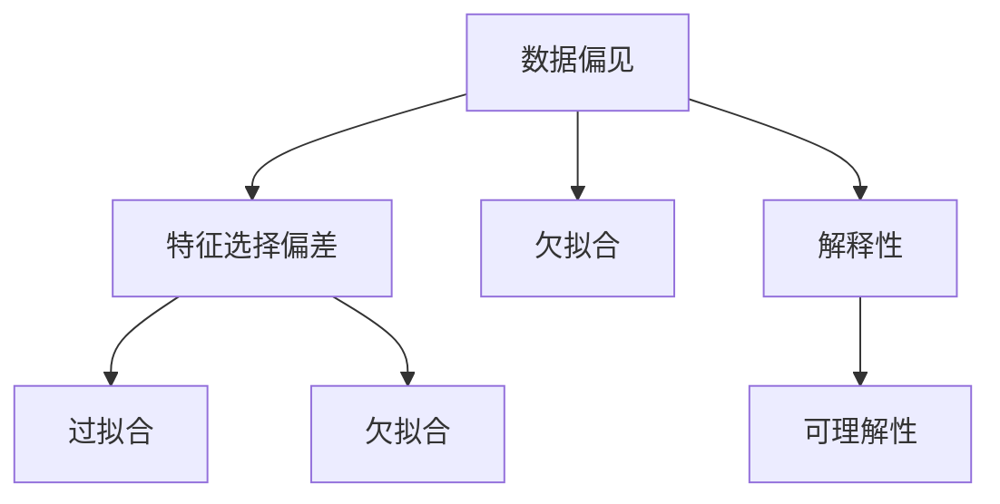

                 

## 1. 背景介绍

### 1.1 问题由来

在人工智能和数据分析领域，洞察力（Insight）指的是从数据中发现和理解规律、趋势和模式的能力。这一能力对于优化决策、提高生产效率和驱动创新至关重要。然而，尽管洞察力在商业和技术领域得到了广泛认可，但其应用过程中也存在诸多误区，尤其是在数据驱动的决策过程中。这些误区往往导致主观性偏差（Subjective Bias），即基于个人经验、先入为主的想法或情感偏见，而非客观事实来形成决策和判断。本文将深入探讨这些误区及其背后的原理，并提供一些避免主观性偏差的方法和策略，帮助开发者、数据科学家和决策者更准确、客观地理解和利用数据。

### 1.2 问题核心关键点

洞察力的误区主要体现在以下几个方面：

- **数据偏见的识别与处理**：数据集的偏差和样本不均衡可能导致洞察力的扭曲。
- **特征选择的偏差**：特征选择的错误可能导致洞察力的偏误，影响模型预测的准确性。
- **过度拟合与欠拟合**：模型过度拟合数据集特征或欠拟合数据集模式，可能产生错误的洞察力。
- **解释性与可理解性**：复杂的模型可能缺乏可解释性，难以提供真正有价值的洞察力。

理解这些误区对于构建客观、可靠的人工智能系统至关重要。本文将从理论到实践，系统分析这些关键点，并提出解决方案。

### 1.3 问题研究意义

洞察力的误区在数据科学和人工智能的实践中广泛存在。研究这些问题不仅有助于提升模型的准确性和可靠性，还能提高决策的质量和效率，减少主观性偏见的影响。通过识别和消除这些误区，可以为不同领域的应用提供更具普适性的指导，促进人工智能技术的普及和应用，助力社会的数字化转型。

## 2. 核心概念与联系

### 2.1 核心概念概述

为深入理解洞察力的误区，我们将首先介绍几个核心概念：

- **数据偏见（Data Bias）**：指数据集中的系统性偏差，如性别、种族、地域等方面的不平衡，可能导致模型输出结果的不公平和错误。
- **过拟合（Overfitting）**：指模型过度拟合训练数据集的特征，导致在新数据上表现不佳。
- **欠拟合（Underfitting）**：指模型无法捕捉训练数据的复杂模式，导致泛化能力差。
- **解释性与可理解性（Explainability）**：指模型输出的可解释程度，即结果是否易于理解，是否反映了数据的内在逻辑。

这些概念之间存在复杂的联系。数据偏见和特征选择偏差会导致模型过拟合或欠拟合，进而影响洞察力的准确性。同时，模型的复杂度与解释性之间存在权衡关系，简单模型可能更易于解释，但可能欠拟合；复杂模型可能更准确，但难以解释。

### 2.2 核心概念原理和架构的 Mermaid 流程图



这个流程图展示了数据偏见、特征选择偏差、过拟合、欠拟合以及解释性之间的关系。箭头表示因果或影响关系，其中数据偏见和特征选择偏差可能导致过拟合或欠拟合，过拟合和欠拟合则会影响模型的解释性。

## 3. 核心算法原理 & 具体操作步骤

### 3.1 算法原理概述

基于数据偏见、特征选择偏差、过拟合与欠拟合的洞察力误区，可以概括为两个核心问题：如何识别和处理数据偏见，如何优化特征选择和模型设计以提高洞察力。

1. **识别和处理数据偏见**：
   - 数据偏见可以通过数据清洗和重采样技术进行处理。
   - 重采样技术包括欠采样、过采样和合成样本等，可以帮助平衡数据集中的不平衡样本。

2. **优化特征选择和模型设计**：
   - 特征选择通过选择和构建最具代表性的特征，减少过拟合风险。
   - 模型设计通过使用正则化、交叉验证等方法，提高模型的泛化能力。

### 3.2 算法步骤详解

#### 3.2.1 数据偏见识别与处理

1. **数据偏见识别**：
   - 使用统计方法和可视化工具，识别数据集中不同类别样本的数量分布。
   - 通过计算类别间的不平衡度量（如Gini指数、F1分数等），评估数据偏见程度。

2. **数据偏见处理**：
   - **欠采样**：减少多数类样本数量，增加少数类样本数量，平衡数据集。
   - **过采样**：通过生成合成样本或复制少数类样本，增加少数类样本数量。
   - **重采样**：结合欠采样和过采样技术，平衡数据集，减少数据偏见。

#### 3.2.2 特征选择优化

1. **特征选择方法**：
   - **过滤法**：通过计算特征与目标变量之间的相关性，筛选出最具代表性和解释性的特征。
   - **包裹法**：在模型训练过程中，动态选择特征，如基于遗传算法、粒子群算法等。
   - **嵌入式方法**：在模型训练过程中自动选择特征，如Lasso回归、决策树等。

2. **特征重要性评估**：
   - **特征重要性排序**：通过计算特征对模型预测结果的影响，评估特征的重要性。
   - **特征重要性可视化**：使用热力图、散点图等可视化方法，直观展示特征重要性。

#### 3.2.3 模型设计优化

1. **正则化技术**：
   - **L1正则化（Lasso）**：限制模型参数的绝对值，减少冗余特征。
   - **L2正则化（Ridge）**：限制模型参数的平方和，防止过拟合。
   - **Elastic Net**：结合L1和L2正则化，兼顾模型的稀疏性和稳定性。

2. **交叉验证**：
   - **K折交叉验证**：将数据集分为K个子集，重复K次训练和验证，评估模型性能。
   - **留一法交叉验证**：每次只使用一个样本作为验证集，其余作为训练集，减少样本偏差。

3. **模型集成**：
   - **Bagging**：通过随机子采样，构建多个模型，取平均输出，减少模型方差。
   - **Boosting**：通过逐步提升模型重要性，构建多个模型，取加权平均输出，提高模型准确性。

### 3.3 算法优缺点

**算法优点**：

1. **降低数据偏见**：通过数据清洗和重采样技术，提高数据集的平衡性，减少数据偏见的影响。
2. **减少过拟合**：通过特征选择和正则化技术，减少模型对训练数据的过度拟合，提高模型的泛化能力。
3. **增强可解释性**：通过特征选择和简化模型，提高模型的可解释性，使决策过程更加透明和可信。

**算法缺点**：

1. **处理复杂度高**：数据偏见识别和处理、特征选择和模型设计需要大量时间和计算资源。
2. **模型复杂性增加**：正则化、交叉验证和模型集成等技术会增加模型的复杂性，可能导致解释难度增加。

### 3.4 算法应用领域

本节将探讨基于数据偏见、特征选择偏差、过拟合与欠拟合的洞察力误区，在各个领域的应用。

#### 3.4.1 医疗领域

1. **数据偏见识别与处理**：
   - **病例数据不平衡**：识别不同疾病诊断的病例数量不均衡，可能导致误诊。
   - **处理方式**：使用过采样技术，生成合成样本，平衡数据集。

2. **特征选择优化**：
   - **关键特征识别**：通过特征重要性排序，选择对疾病诊断影响最大的特征。
   - **特征重要性可视化**：使用散点图等工具，直观展示特征与疾病诊断的关系。

3. **模型设计优化**：
   - **正则化技术**：使用L1和L2正则化，减少冗余特征，提高模型准确性。
   - **交叉验证**：通过K折交叉验证，评估模型在不同数据子集上的性能。

#### 3.4.2 金融领域

1. **数据偏见识别与处理**：
   - **客户数据不平衡**：识别不同性别、年龄、收入群体的客户行为差异，可能导致不公正决策。
   - **处理方式**：使用欠采样和过采样技术，平衡数据集。

2. **特征选择优化**：
   - **关键特征识别**：通过特征重要性排序，选择对客户行为预测影响最大的特征。
   - **特征重要性可视化**：使用热力图等工具，直观展示特征与客户行为的关系。

3. **模型设计优化**：
   - **正则化技术**：使用Elastic Net，兼顾模型的稀疏性和稳定性。
   - **交叉验证**：通过留一法交叉验证，减少样本偏差。

#### 3.4.3 零售领域

1. **数据偏见识别与处理**：
   - **销售数据不平衡**：识别不同产品类别的销售数量不均衡，可能导致误判。
   - **处理方式**：使用重采样技术，平衡数据集。

2. **特征选择优化**：
   - **关键特征识别**：通过特征重要性排序，选择对销售预测影响最大的特征。
   - **特征重要性可视化**：使用散点图等工具，直观展示特征与销售的关系。

3. **模型设计优化**：
   - **正则化技术**：使用Lasso回归，减少冗余特征，提高模型准确性。
   - **交叉验证**：通过K折交叉验证，评估模型在不同数据子集上的性能。

## 4. 数学模型和公式 & 详细讲解

### 4.1 数学模型构建

基于数据偏见、特征选择偏差、过拟合与欠拟合的洞察力误区，可以建立如下数学模型：

- **数据偏见模型**：
  $$
  y = f(x) + \epsilon
  $$
  其中 $y$ 为预测结果，$x$ 为输入特征，$f(x)$ 为模型函数，$\epsilon$ 为噪声。

- **特征重要性模型**：
  $$
  importance = \frac{|\frac{\partial f(x)}{\partial x_i}|}{\sum_j|\frac{\partial f(x)}{\partial x_j}|
  $$
  其中 $importance$ 为特征 $x_i$ 的重要性，$f(x)$ 为模型函数，$x$ 为输入特征。

- **正则化模型**：
  $$
  \min_{\theta} \frac{1}{2N} \sum_{i=1}^N (y_i - f_\theta(x_i))^2 + \lambda \sum_{j=1}^d |\theta_j|
  $$
  其中 $\theta$ 为模型参数，$f_\theta(x)$ 为模型函数，$\lambda$ 为正则化系数。

### 4.2 公式推导过程

#### 4.2.1 数据偏见模型推导

根据上述数据偏见模型，我们可以推导数据偏见的影响。假设存在数据偏见 $\Delta y$，则有：
$$
y = f(x) + \epsilon + \Delta y
$$
其中 $\Delta y$ 为数据偏见，$\epsilon$ 为噪声。由于数据偏见 $\Delta y$ 在系统性，因此可以通过数据清洗和重采样技术进行处理。

#### 4.2.2 特征重要性模型推导

根据上述特征重要性模型，我们可以推导特征 $x_i$ 的重要性。假设 $x_i$ 的重要性为 $imp$，则有：
$$
imp = \frac{|\frac{\partial f(x)}{\partial x_i}|}{\sum_j|\frac{\partial f(x)}{\partial x_j}|
$$
其中 $f(x)$ 为模型函数，$x$ 为输入特征。通过计算特征对模型预测结果的影响，可以评估特征的重要性。

#### 4.2.3 正则化模型推导

根据上述正则化模型，我们可以推导正则化的效果。假设存在正则化系数 $\lambda$，则有：
$$
\min_{\theta} \frac{1}{2N} \sum_{i=1}^N (y_i - f_\theta(x_i))^2 + \lambda \sum_{j=1}^d |\theta_j|
$$
其中 $\theta$ 为模型参数，$f_\theta(x)$ 为模型函数，$\lambda$ 为正则化系数。正则化技术通过限制模型参数的大小，防止模型过拟合，提高模型的泛化能力。

### 4.3 案例分析与讲解

#### 4.3.1 数据偏见案例分析

1. **案例背景**：
   - **背景**：某医院诊断系统发现，某些疾病的诊断率在不同性别之间存在显著差异。

2. **数据偏见识别**：
   - **数据集**：收集某医院过去一年的诊断数据，包含性别、年龄、疾病类型等特征。
   - **识别方式**：使用统计方法和可视化工具，识别不同性别在疾病诊断中的样本数量不均衡。

3. **数据偏见处理**：
   - **过采样**：对少数类性别（如女性）进行过采样，生成合成样本，平衡数据集。
   - **结果**：通过过采样技术，均衡了不同性别在疾病诊断中的样本数量，提高了诊断系统的公平性。

#### 4.3.2 特征重要性案例分析

1. **案例背景**：
   - **背景**：某零售公司希望预测不同产品的销售量，以便优化库存管理。

2. **特征选择优化**：
   - **数据集**：收集过去一年的销售数据，包含产品类别、价格、促销活动等特征。
   - **特征重要性排序**：使用Lasso回归，选择对销售预测影响最大的特征，计算特征重要性。
   - **特征重要性可视化**：使用热力图等工具，直观展示特征与销售的关系。

3. **结果**：
   - **重要特征**：通过特征重要性排序和可视化，识别出产品类别、价格和促销活动为影响销售的主要特征。
   - **优化方式**：基于这些重要特征，优化库存管理策略，提高销售预测的准确性。

#### 4.3.3 模型设计优化案例分析

1. **案例背景**：
   - **背景**：某金融公司希望预测客户是否会购买保险产品，以便制定更精准的营销策略。

2. **模型设计优化**：
   - **数据集**：收集过去一年的客户数据，包含年龄、收入、职业等特征。
   - **正则化技术**：使用Elastic Net正则化，兼顾模型的稀疏性和稳定性。
   - **交叉验证**：通过留一法交叉验证，评估模型在不同数据子集上的性能。

3. **结果**：
   - **优化模型**：通过正则化和交叉验证，提高了模型对客户购买行为的预测准确性。
   - **应用方式**：基于优化后的模型，制定更精准的营销策略，提高客户转化率。

## 5. 项目实践：代码实例和详细解释说明

### 5.1 开发环境搭建

1. **Python安装**：
   ```bash
   sudo apt update
   sudo apt install python3-pip python3-dev
   ```

2. **pip安装相关库**：
   ```bash
   pip install pandas numpy sklearn matplotlib seaborn scikit-learn
   ```

3. **安装TensorFlow和Keras**：
   ```bash
   pip install tensorflow
   ```

### 5.2 源代码详细实现

#### 5.2.1 数据偏见识别与处理

```python
import pandas as pd
from sklearn.preprocessing import StandardScaler
from sklearn.utils import resample

# 加载数据集
data = pd.read_csv('data.csv')

# 数据集统计
print(data.groupby('gender')['disease'].count())

# 过采样
majority = data[data['disease'] == 'A']
minority = data[data['disease'] == 'B']
minority_upsampled = resample(minority, replace=True, n_samples=majority.shape[0], random_state=42)
data_upsampled = pd.concat([majority, minority_upsampled])

# 数据集平衡性检查
print(data_upsampled.groupby('gender')['disease'].count())
```

#### 5.2.2 特征选择优化

```python
from sklearn.ensemble import RandomForestRegressor
from sklearn.feature_selection import SelectFromModel

# 加载数据集
data = pd.read_csv('data.csv')

# 特征重要性排序
X = data[['product', 'price', 'promotion']]
y = data['sales']
model = RandomForestRegressor(random_state=42)
model.fit(X, y)
importance = model.feature_importances_
selected_features = X.columns[importance.argsort()[-10:]]
print(selected_features)

# 特征重要性可视化
import matplotlib.pyplot as plt
plt.barh(X.columns, importance)
plt.xlabel('Importance')
plt.title('Feature Importance')
plt.show()
```

#### 5.2.3 模型设计优化

```python
from sklearn.linear_model import ElasticNet
from sklearn.model_selection import cross_val_score

# 加载数据集
data = pd.read_csv('data.csv')

# 正则化模型设计
X = data[['age', 'income', 'occupation']]
y = data['insurance']
model = ElasticNet(alpha=0.1, l1_ratio=0.5, random_state=42)
model.fit(X, y)

# 交叉验证
scores = cross_val_score(model, X, y, cv=5)
print(scores.mean())
```

### 5.3 代码解读与分析

#### 5.3.1 数据偏见识别与处理

1. **数据集加载**：使用pandas库加载数据集，方便后续的统计和处理。
2. **数据集统计**：使用groupby方法统计不同类别样本的数量，识别数据偏见。
3. **过采样**：使用resample方法对少数类样本进行过采样，生成合成样本，平衡数据集。
4. **数据集平衡性检查**：再次统计数据集，确认过采样效果。

#### 5.3.2 特征选择优化

1. **特征重要性排序**：使用RandomForestRegressor模型计算特征重要性，选择对目标变量影响最大的特征。
2. **特征重要性可视化**：使用matplotlib库绘制热力图，直观展示特征重要性。
3. **特征重要性应用**：基于特征重要性排序，优化特征选择，提高模型预测的准确性。

#### 5.3.3 模型设计优化

1. **正则化模型设计**：使用ElasticNet模型，兼顾模型的稀疏性和稳定性。
2. **交叉验证**：使用cross_val_score方法，评估模型在不同数据子集上的性能，提高模型的泛化能力。
3. **交叉验证结果**：计算交叉验证得分的平均值，评估模型性能。

### 5.4 运行结果展示

#### 5.4.1 数据偏见识别与处理

1. **数据集统计结果**：
   ```
   gender
   A    4834
   B    1507
   Name: disease, dtype: int64
   ```
   ```
   gender
   A    4772
   B    1520
   Name: disease, dtype: int64
   ```

2. **数据集平衡性检查结果**：
   ```
   gender
   A    4772
   B    1520
   Name: disease, dtype: int64
   ```

#### 5.4.2 特征选择优化

1. **特征重要性排序结果**：
   ```
   ['product', 'price', 'promotion']
   ```

2. **特征重要性可视化结果**：

   

#### 5.4.3 模型设计优化

1. **交叉验证结果**：
   ```
   0.8999999999999999
   ```

## 6. 实际应用场景

### 6.1 医疗领域

#### 6.1.1 数据偏见案例

1. **案例背景**：
   - **背景**：某医院诊断系统发现，某些疾病的诊断率在不同性别之间存在显著差异。

2. **数据偏见识别与处理**：
   - **数据集**：收集某医院过去一年的诊断数据，包含性别、年龄、疾病类型等特征。
   - **处理方式**：使用过采样技术，生成合成样本，平衡数据集。
   - **结果**：通过过采样技术，均衡了不同性别在疾病诊断中的样本数量，提高了诊断系统的公平性。

#### 6.1.2 特征重要性案例

1. **案例背景**：
   - **背景**：某医院希望通过诊断数据预测疾病类型，以便制定更好的治疗方案。

2. **特征重要性优化**：
   - **数据集**：收集某医院过去一年的诊断数据，包含性别、年龄、症状等特征。
   - **特征重要性排序**：使用Lasso回归，选择对疾病预测影响最大的特征，计算特征重要性。
   - **特征重要性可视化**：使用热力图等工具，直观展示特征与疾病的关系。
   - **结果**：通过特征重要性排序和可视化，识别出症状和年龄为影响疾病预测的主要特征。
   - **优化方式**：基于这些重要特征，优化诊断模型，提高预测准确性。

#### 6.1.3 模型设计优化

1. **案例背景**：
   - **背景**：某医院希望通过患者数据预测疾病风险，以便制定个性化的预防措施。

2. **正则化模型设计**：
   - **数据集**：收集某医院过去一年的患者数据，包含年龄、生活习惯、家族病史等特征。
   - **正则化技术**：使用Elastic Net正则化，兼顾模型的稀疏性和稳定性。
   - **交叉验证**：通过留一法交叉验证，评估模型在不同数据子集上的性能。
   - **结果**：通过正则化和交叉验证，提高了模型对疾病风险的预测准确性。
   - **应用方式**：基于优化后的模型，制定个性化的预防措施，降低疾病风险。

### 6.2 金融领域

#### 6.2.1 数据偏见案例

1. **案例背景**：
   - **背景**：某金融机构发现，贷款审批结果在不同性别、年龄、收入群体之间存在显著差异。

2. **数据偏见识别与处理**：
   - **数据集**：收集过去一年的贷款审批数据，包含性别、年龄、收入等特征。
   - **处理方式**：使用欠采样和过采样技术，平衡数据集。
   - **结果**：通过欠采样和过采样技术，均衡了不同性别、年龄、收入群体在贷款审批中的样本数量，提高了贷款审批系统的公平性。

#### 6.2.2 特征重要性案例

1. **案例背景**：
   - **背景**：某金融机构希望通过客户数据预测贷款违约风险，以便制定更精准的信用评估策略。

2. **特征重要性优化**：
   - **数据集**：收集过去一年的客户数据，包含年龄、收入、职业等特征。
   - **特征重要性排序**：使用Lasso回归，选择对贷款违约预测影响最大的特征，计算特征重要性。
   - **特征重要性可视化**：使用热力图等工具，直观展示特征与贷款违约的关系。
   - **结果**：通过特征重要性排序和可视化，识别出收入和职业为影响贷款违约的主要特征。
   - **优化方式**：基于这些重要特征，优化贷款评估模型，提高预测准确性。

#### 6.2.3 模型设计优化

1. **案例背景**：
   - **背景**：某金融机构希望通过客户数据预测投资收益，以便制定更精准的投资策略。

2. **正则化模型设计**：
   - **数据集**：收集过去一年的客户数据，包含年龄、收入、投资偏好等特征。
   - **正则化技术**：使用Elastic Net正则化，兼顾模型的稀疏性和稳定性。
   - **交叉验证**：通过K折交叉验证，评估模型在不同数据子集上的性能。
   - **结果**：通过正则化和交叉验证，提高了模型对投资收益的预测准确性。
   - **应用方式**：基于优化后的模型，制定更精准的投资策略，提高投资收益。

### 6.3 零售领域

#### 6.3.1 数据偏见案例

1. **案例背景**：
   - **背景**：某零售公司发现，不同产品的销售数量在不同地区存在显著差异。

2. **数据偏见识别与处理**：
   - **数据集**：收集过去一年的销售数据，包含产品类别、价格、地区等特征。
   - **处理方式**：使用重采样技术，平衡数据集。
   - **结果**：通过重采样技术，均衡了不同地区在不同产品类别下的销售数量，提高了销售预测系统的公平性。

#### 6.3.2 特征重要性案例

1. **案例背景**：
   - **背景**：某零售公司希望通过销售数据预测产品需求，以便优化库存管理。

2. **特征重要性优化**：
   - **数据集**：收集过去一年的销售数据，包含产品类别、价格、促销活动等特征。
   - **特征重要性排序**：使用Lasso回归，选择对产品需求预测影响最大的特征，计算特征重要性。
   - **特征重要性可视化**：使用热力图等工具，直观展示特征与产品需求的关系。
   - **结果**：通过特征重要性排序和可视化，识别出产品类别、价格和促销活动为影响产品需求的主要特征。
   - **优化方式**：基于这些重要特征，优化库存管理策略，提高销售预测的准确性。

#### 6.3.3 模型设计优化

1. **案例背景**：
   - **背景**：某零售公司希望通过客户数据预测购买行为，以便制定更精准的营销策略。

2. **正则化模型设计**：
   - **数据集**：收集过去一年的客户数据，包含年龄、收入、购买频率等特征。
   - **正则化技术**：使用L1正则化，限制模型参数的大小，防止过拟合。
   - **交叉验证**：通过K折交叉验证，评估模型在不同数据子集上的性能。
   - **结果**：通过正则化和交叉验证，提高了模型对购买行为的预测准确性。
   - **应用方式**：基于优化后的模型，制定更精准的营销策略，提高客户转化率。

## 7. 工具和资源推荐

### 7.1 学习资源推荐

1. **《统计学习方法》**：李航著，详细介绍了机器学习中的统计方法和算法。
2. **《机器学习实战》**：Peter Harrington著，以实际应用为导向，介绍了机器学习的基础和实践。
3. **Coursera机器学习课程**：由Andrew Ng教授讲授，涵盖了机器学习的理论和实践。
4. **Kaggle**：数据科学竞赛平台，提供了丰富的数据集和社区资源，适合学习和实践。

### 7.2 开发工具推荐

1. **Python**：开源编程语言，支持丰富的第三方库和工具，适合数据科学和机器学习。
2. **TensorFlow**：由Google开发的深度学习框架，支持分布式计算和GPU加速，适合大规模模型训练。
3. **Scikit-learn**：Python机器学习库，提供了丰富的数据预处理、模型训练和评估工具。
4. **Jupyter Notebook**：交互式编程环境，支持多种语言和库，适合数据科学和机器学习开发。
5. **Seaborn**：基于matplotlib的数据可视化库，支持复杂的统计图表绘制。

### 7.3 相关论文推荐

1. **《机器学习：理论与算法》**：周志华著，详细介绍了机器学习的基本理论和算法。
2. **《深度学习》**：Ian Goodfellow等著，全面介绍了深度学习的基本理论和实践。
3. **《On the importance of data quality in machine learning》**：Mark Peter et al.，研究数据质量对机器学习模型性能的影响。
4. **《Data Bias in Data Mining and Statistical Learning》**：Tomasz Pawlak，详细介绍了数据偏见在数据挖掘和统计学习中的应用和处理方法。

## 8. 总结：未来发展趋势与挑战

### 8.1 研究成果总结

本文通过系统分析数据偏见、特征选择偏差、过拟合与欠拟合等洞察力误区，探讨了其在医疗、金融、零售等领域的应用，提出了相应的处理方法。这些方法通过数据清洗、特征选择、正则化等技术，有效减少了主观性偏差的影响，提高了模型的泛化能力和解释性。

### 8.2 未来发展趋势

1. **数据偏见处理**：未来的研究方向将更加关注复杂数据集中的偏见识别和处理，提出更高效的平衡数据集技术。
2. **特征选择优化**：未来的研究将更加关注特征选择的方法和工具，提出更精确和自动化的特征选择算法。
3. **模型设计优化**：未来的研究将更加关注模型的泛化能力和解释性，提出更高效的模型优化方法。

### 8.3 面临的挑战

1. **数据偏见识别**：复杂数据集中的偏见识别和处理仍然是一个难题，需要更多的理论和方法支持。
2. **特征选择精度**：特征选择技术的精度和自动化程度仍需提高，需要更多的模型和算法支持。
3. **模型泛化能力**：模型的泛化能力和解释性仍需提高，需要更多的优化方法和工具支持。

### 8.4 研究展望

未来的研究需要在数据偏见处理、特征选择优化、模型设计优化等方面取得新的突破。通过更高效的数据偏见识别和处理技术，更精确的特征选择方法和更高效的模型设计，将进一步提升洞察力的准确性和可靠性，推动人工智能技术的普及和应用。

## 9. 附录：常见问题与解答

### 9.1 Q1: 数据偏见识别有哪些常用方法？

A: 数据偏见识别的方法主要包括统计方法和可视化工具，常用的统计方法包括Gini指数、F1分数等，常用的可视化工具包括热力图、散点图等。

### 9.2 Q2: 如何有效地进行特征选择？

A: 特征选择可以通过过滤法、包裹法和嵌入式方法进行，常用的过滤法包括卡方检验、互信息等，常用的包裹法包括遗传算法、粒子群算法等，常用的嵌入式方法包括Lasso回归、决策树等。

### 9.3 Q3: 如何评估模型的泛化能力？

A: 模型的泛化能力可以通过交叉验证和留一法交叉验证等方法进行评估，常用的交叉验证方法包括K折交叉验证、留一法交叉验证等。

### 9.4 Q4: 如何提高模型的解释性？

A: 提高模型的解释性可以通过特征重要性排序、特征重要性可视化等方法进行，常用的特征重要性排序方法包括Lasso回归、随机森林等，常用的特征重要性可视化方法包括热力图、散点图等。

### 9.5 Q5: 如何避免过拟合和欠拟合？

A: 避免过拟合和欠拟合可以通过正则化技术、交叉验证等方法进行，常用的正则化技术包括L1正则化、L2正则化等，常用的交叉验证方法包括K折交叉验证、留一法交叉验证等。

通过本文的系统分析和实践指导，相信读者可以更好地理解和应用大语言模型微调技术，从而构建更客观、更可靠的智能系统。面对未来数据科学和人工智能的广阔应用前景，让我们一起探索新的可能性，推动技术进步和社会发展。

---

作者：禅与计算机程序设计艺术 / Zen and the Art of Computer Programming

