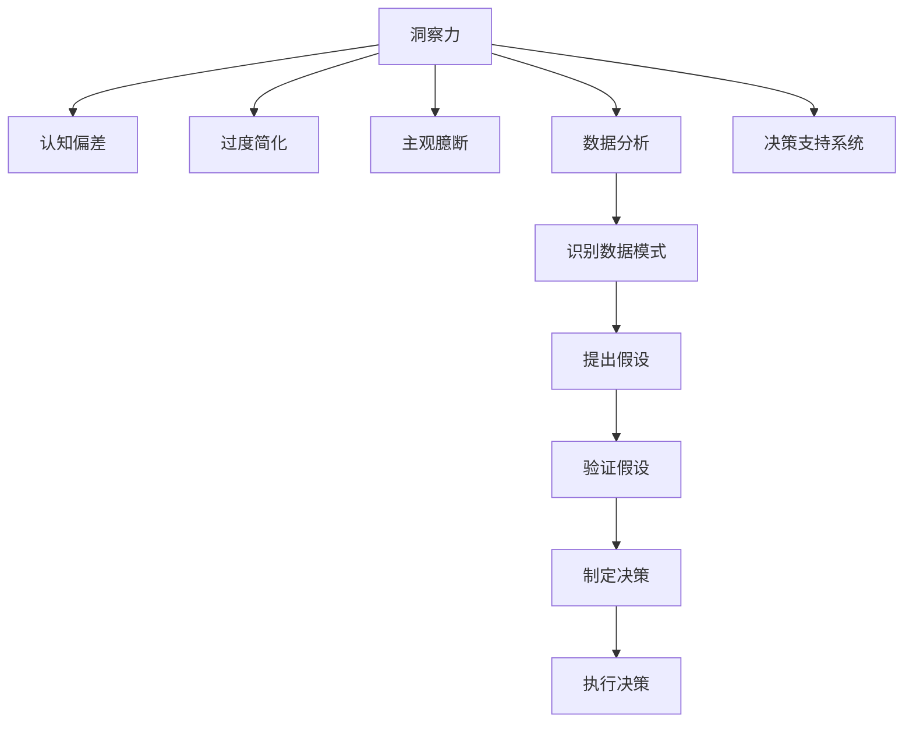

                 

# 理解洞察力的误区：避免过度简化和主观臆断

> 关键词：洞察力,认知偏差,过度简化,主观臆断,数据分析,决策支持

## 1. 背景介绍

在现代社会中，数据驱动决策已经成为一种普遍的趋势。无论是在商业、政治还是科学研究中，数据都被广泛用于分析和决策支持。然而，在利用数据进行决策时，人们常常会陷入各种洞察力的误区，导致决策偏离初衷，甚至产生严重的负面后果。本文将探讨这些误区，并提出一些避免过度简化和主观臆断的方法，以期帮助决策者更好地利用数据进行科学、合理的决策。

## 2. 核心概念与联系

### 2.1 核心概念概述

为了深入理解洞察力的误区，本节将介绍几个密切相关的核心概念：

- **洞察力(Insight)**：指通过对数据进行分析和挖掘，从现象背后揭示隐藏的信息、模式或规律。洞察力是人类思维的重要组成部分，在决策过程中起到至关重要的作用。

- **认知偏差(Cognitive Bias)**：指人们在思考、决策和判断过程中，由于各种心理机制和思维模式的影响，产生的系统性偏差。认知偏差包括但不限于确认偏误、锚定效应、可获得性启发等。

- **过度简化(Over-simplification)**：指在处理复杂问题时，将问题简化到不合理或错误的程度，忽略了问题的细节和复杂性，导致决策失误。

- **主观臆断(Subjective Judgment)**：指在缺乏充分证据和数据支持的情况下，基于个人感受、直觉或偏见进行决策，忽视客观事实和数据证据。

- **数据分析(Data Analysis)**：指利用统计学、计算机科学等手段，对数据进行收集、清洗、处理和分析，揭示数据背后的规律和趋势。数据分析是决策过程中获取洞察力的重要工具。

- **决策支持系统(Decision Support System, DSS)**：指利用信息技术，帮助决策者更好地理解数据，识别问题，制定决策方案的系统。DSS通常包括数据分析、预测、模拟等功能模块。

这些核心概念之间的逻辑关系可以通过以下Mermaid流程图来展示：



这个流程图展示了大数据分析过程中不同概念之间的关系：

1. 洞察力通过数据分析获得。
2. 数据分析过程中，容易受到认知偏差和过度简化、主观臆断的影响。
3. 决策支持系统利用数据分析和洞察力，帮助决策者制定科学决策。

## 3. 核心算法原理 & 具体操作步骤

### 3.1 算法原理概述

在利用数据分析获取洞察力的过程中，避免认知偏差、过度简化和主观臆断是至关重要的。本节将介绍几种常见的洞察力误区及其避免方法。

- **确认偏误(Confirmation Bias)**：指人们在寻找证据时，倾向于寻找支持已有信念的证据，忽略或淡化不支持证据。为避免确认偏误，应保持开放心态，积极寻找反对证据，并在此基础上重新评估信念。

- **锚定效应(Anchoring Bias)**：指人们在对数值进行评估时，容易受到最初看到的信息（锚点）的影响。为避免锚定效应，应在进行数据分析前，对数据进行标准化处理，减少锚点对评估的影响。

- **可获得性启发(Availability Heuristic)**：指人们根据事件发生频率和易获得性（如新闻报道、个人经历等）来判断事件的可能性。为避免可获得性启发，应使用大样本数据进行统计分析，减少个体经历的干扰。

- **过度简化(Over-simplification)**：指在处理复杂问题时，将问题简化到不合理或错误的程度，导致决策失误。为避免过度简化，应采用更复杂的数据模型和分析方法，如机器学习、因果推断等，以更全面、准确地分析问题。

- **主观臆断(Subjective Judgment)**：指在缺乏充分证据和数据支持的情况下，基于个人感受、直觉或偏见进行决策。为避免主观臆断，应建立基于数据和证据的决策流程，如建立规范化的数据收集、分析和验证流程，减少个人偏见对决策的影响。

### 3.2 算法步骤详解

本节将介绍几种避免洞察力误区的具体操作步骤：

#### 步骤1: 数据准备

- 收集数据：确保数据样本足够多，覆盖问题的各个方面。
- 数据清洗：去除缺失值、异常值和噪声，保证数据质量。
- 数据预处理：标准化数据格式，如归一化、中心化等，减少后续分析的偏差。

#### 步骤2: 数据分析

- 探索性数据分析(EDA)：通过绘制图表、计算统计量等方法，初步了解数据分布和趋势。
- 假设验证：提出假设，利用统计学方法（如t检验、卡方检验等）验证假设，判断其合理性。
- 模型训练：选择适当的模型，如线性回归、决策树、神经网络等，训练模型参数，预测结果。

#### 步骤3: 结果验证

- 交叉验证：将数据集划分为训练集和测试集，利用交叉验证评估模型性能。
- 敏感性分析：通过调整模型参数，评估模型对参数的敏感性，确保模型鲁棒性。
- 回溯验证：对历史数据进行回溯验证，评估模型在新数据上的表现。

#### 步骤4: 决策制定

- 数据可视化：利用可视化工具（如Matplotlib、Seaborn等）展示分析结果，辅助决策。
- 决策支持：基于数据分析结果，制定决策方案，并进行多轮评估和优化。
- 实施监控：对决策实施效果进行实时监控和评估，及时调整方案。

### 3.3 算法优缺点

避免洞察力误区的算法有以下优点：

- 提高决策科学性：通过数据分析和模型验证，减少主观臆断和认知偏差，提升决策科学性。
- 增强决策鲁棒性：通过交叉验证和敏感性分析，确保决策模型鲁棒性，避免过度简化。
- 降低决策风险：通过数据验证和回溯评估，降低决策风险，减少决策失误。

同时，该算法也存在一些局限性：

- 数据准备复杂：数据收集和清洗需要耗费大量时间和资源，对数据质量要求高。
- 模型选择困难：不同模型适用于不同类型的数据和问题，选择不当可能导致误导性结果。
- 结果解释困难：复杂模型和高级分析方法，往往难以解释其决策过程，增加了理解难度。

尽管存在这些局限性，但该算法在决策过程中仍具有重要的参考价值，通过系统化、规范化的数据分析和模型验证，可以最大限度地避免洞察力误区，提升决策质量。

### 3.4 算法应用领域

避免洞察力误区的算法在各行各业都有广泛应用，例如：

- 金融投资：利用数据分析和模型预测，制定投资策略，避免过度简化和主观臆断。
- 医疗诊断：利用大数据分析和机器学习模型，诊断疾病，降低误诊率。
- 市场营销：利用市场数据分析，制定精准营销策略，提升广告效果。
- 城市规划：利用数据科学方法，优化交通、环境等城市管理方案，提升城市运行效率。
- 农业生产：利用农业数据分析，优化种植方案，提高产量和质量。

这些领域中，通过避免洞察力误区，可以有效提升决策的科学性和鲁棒性，帮助决策者制定更合理的决策方案。

## 4. 数学模型和公式 & 详细讲解 & 举例说明

### 4.1 数学模型构建

本节将使用数学语言对避免洞察力误区的算法过程进行更加严格的刻画。

假设有一组数据集 $D=\{(x_i,y_i)\}_{i=1}^N$，其中 $x_i$ 为输入特征，$y_i$ 为输出标签。我们希望通过数据分析，建立模型 $f(x)$ 来进行预测。

定义损失函数 $L(f)$，用于衡量模型预测与真实标签之间的差异：

$$
L(f) = \frac{1}{N} \sum_{i=1}^N (f(x_i) - y_i)^2
$$

为避免洞察力误区，我们采用如下步骤进行模型训练和验证：

1. 收集数据集 $D$，划分为训练集 $D_{train}$ 和测试集 $D_{test}$。
2. 对训练集 $D_{train}$ 进行交叉验证，评估模型 $f(x)$ 的性能。
3. 对训练集 $D_{train}$ 进行敏感性分析，确定模型对参数的鲁棒性。
4. 利用测试集 $D_{test}$ 进行回溯验证，评估模型在新数据上的表现。
5. 根据验证结果，调整模型参数，优化模型性能。

### 4.2 公式推导过程

以下我们以回归问题为例，推导最小二乘法的损失函数及其梯度计算公式。

假设模型 $f(x)$ 为线性回归模型，形式为 $f(x)=\beta_0+\beta_1x$，其中 $\beta_0$ 和 $\beta_1$ 为模型参数。则模型在数据集 $D$ 上的损失函数为：

$$
L(\beta) = \frac{1}{N} \sum_{i=1}^N (y_i - f(x_i))^2
$$

对该损失函数求偏导，得：

$$
\frac{\partial L(\beta)}{\partial \beta_0} = -\frac{2}{N} \sum_{i=1}^N (y_i - f(x_i))
$$
$$
\frac{\partial L(\beta)}{\partial \beta_1} = -\frac{2}{N} \sum_{i=1}^N (y_i - f(x_i))x_i
$$

将损失函数的偏导数代入梯度下降算法，得：

$$
\beta \leftarrow \beta - \eta \nabla_{\beta} L(\beta)
$$

其中 $\eta$ 为学习率，$\nabla_{\beta} L(\beta)$ 为损失函数对模型参数的梯度。

在得到梯度后，即可带入梯度下降算法，完成模型参数的更新。重复上述过程直至收敛，最终得到适应数据的线性回归模型。

### 4.3 案例分析与讲解

假设某公司需要评估新产品在不同市场区域的销售潜力，利用历史销售数据进行回归分析，预测市场潜力。

1. 数据收集：收集过去几年的销售数据，包括时间、地区、产品类型、销售金额等。
2. 数据清洗：去除缺失值和异常值，标准化数据格式。
3. 探索性数据分析：绘制销售金额与时间的趋势图，分析销售趋势和季节性影响。
4. 建立回归模型：选择时间、地区、产品类型作为输入特征，利用线性回归模型进行预测。
5. 模型验证：使用交叉验证评估模型性能，并进行敏感性分析，确定模型对参数的鲁棒性。
6. 回溯验证：利用测试集进行回溯验证，评估模型在新数据上的表现。
7. 结果展示：利用数据可视化工具展示分析结果，辅助决策制定。

通过以上步骤，该公司可以科学评估不同市场区域的销售潜力，制定更合理的市场策略，提升销售效果。

## 5. 项目实践：代码实例和详细解释说明

### 5.1 开发环境搭建

在进行数据分析和模型验证的过程中，我们需要准备好开发环境。以下是使用Python进行Scikit-learn开发的环境配置流程：

1. 安装Anaconda：从官网下载并安装Anaconda，用于创建独立的Python环境。

2. 创建并激活虚拟环境：
```bash
conda create -n sklearn-env python=3.8 
conda activate sklearn-env
```

3. 安装Scikit-learn：
```bash
pip install scikit-learn
```

4. 安装numpy、pandas、matplotlib、seaborn等工具包：
```bash
pip install numpy pandas matplotlib seaborn
```

完成上述步骤后，即可在`sklearn-env`环境中开始数据分析和模型验证。

### 5.2 源代码详细实现

下面我们以线性回归为例，给出使用Scikit-learn进行数据分析的PyTorch代码实现。

```python
import numpy as np
import pandas as pd
import matplotlib.pyplot as plt
from sklearn.model_selection import train_test_split
from sklearn.linear_model import LinearRegression
from sklearn.metrics import mean_squared_error

# 读取数据
data = pd.read_csv('sales_data.csv')

# 数据预处理
features = ['time', 'region', 'product']
X = data[features]
y = data['sales']

# 划分训练集和测试集
X_train, X_test, y_train, y_test = train_test_split(X, y, test_size=0.2, random_state=42)

# 建立线性回归模型
model = LinearRegression()

# 训练模型
model.fit(X_train, y_train)

# 预测测试集
y_pred = model.predict(X_test)

# 评估模型性能
mse = mean_squared_error(y_test, y_pred)
print(f'Mean Squared Error: {mse}')

# 数据可视化
plt.scatter(X_test, y_test, label='True Sales')
plt.scatter(X_test, y_pred, label='Predicted Sales')
plt.legend()
plt.show()
```

### 5.3 代码解读与分析

让我们再详细解读一下关键代码的实现细节：

**数据预处理**：
- 使用pandas读取数据文件，将数据集分为输入特征(X)和输出标签(y)。
- 选择时间、地区、产品作为输入特征。
- 使用train_test_split将数据集划分为训练集和测试集。

**模型训练**：
- 使用scikit-learn的LinearRegression模型进行线性回归训练。
- 在训练集上调用fit方法训练模型。

**模型评估**：
- 使用mean_squared_error计算模型预测值与真实值之间的均方误差。
- 将评估结果打印输出。

**数据可视化**：
- 使用matplotlib绘制预测值和真实值之间的散点图，对比分析模型的预测效果。

通过以上代码，实现了线性回归模型的构建和评估，能够科学地预测市场潜力，辅助决策制定。

## 6. 实际应用场景

### 6.1 智能推荐系统

避免洞察力误区的算法在智能推荐系统中得到了广泛应用。传统的推荐系统往往基于简单的统计方法，难以充分理解用户的复杂需求。通过数据分析和模型训练，智能推荐系统可以更全面地了解用户行为和偏好，提供个性化的推荐服务。

在实践中，可以收集用户的浏览、点击、评分等行为数据，利用机器学习算法进行数据分析和模型训练。训练后的模型能够预测用户对不同商品或服务的兴趣，从而推荐符合用户需求的内容。通过持续收集和分析用户反馈，智能推荐系统能够不断优化推荐效果，提升用户体验。

### 6.2 金融风险管理

在金融领域，避免洞察力误区的算法可以用于风险管理。传统的风险评估方法往往依赖人工经验，容易受到认知偏差和过度简化影响。通过数据分析和模型验证，金融系统可以更科学地评估风险，制定合理的风险管理策略。

具体而言，可以收集历史交易数据，利用数据分析工具（如R语言、Python等）进行风险评估。通过建立风险评估模型，对市场动态和交易行为进行实时监测和预测，及时发现潜在的风险因素，制定相应的应对策略。同时，利用回溯验证，评估模型在新数据上的表现，确保风险评估的科学性和鲁棒性。

### 6.3 医疗诊断

在医疗诊断中，避免洞察力误区的算法可以用于疾病预测和诊断。传统的医疗诊断方法往往依赖医生的经验和直觉，容易受到主观臆断和认知偏差影响。通过数据分析和模型训练，医疗系统可以更科学地进行疾病预测和诊断，提高诊断准确率。

具体而言，可以收集患者的病历、检查结果、实验室数据等，利用机器学习算法进行数据分析和模型训练。通过建立疾病预测和诊断模型，对患者的健康状况进行实时监测和预测，及时发现潜在的疾病风险，制定相应的治疗方案。同时，利用回溯验证，评估模型在新数据上的表现，确保疾病预测和诊断的科学性和鲁棒性。

### 6.4 未来应用展望

随着数据分析和机器学习技术的发展，避免洞察力误区的算法将进一步普及应用，为各行各业带来更多的科学决策支持。

在智慧城市治理中，利用大数据分析和机器学习模型，优化城市交通、环境、安全等管理方案，提升城市运行效率。

在智能制造领域，利用数据分析和模型训练，优化生产流程、降低成本、提高产品质量，实现智能制造。

在农业生产中，利用农业数据分析，优化种植方案，提高产量和质量，推动农业现代化。

## 7. 工具和资源推荐

### 7.1 学习资源推荐

为了帮助开发者系统掌握避免洞察力误区的算法，这里推荐一些优质的学习资源：

1. 《数据科学实战》系列书籍：由数据科学家撰写，深入浅出地介绍了数据分析和机器学习的基本概念和方法。

2. 《机器学习实战》课程：由斯坦福大学开设的机器学习课程，提供了系统化的课程内容和实践项目，帮助初学者快速上手。

3. 《Python数据科学手册》：全面介绍了Python在数据科学中的应用，包括数据处理、机器学习、数据可视化等。

4. Kaggle：提供丰富的数据分析竞赛和数据集，帮助开发者练习数据分析和模型训练技能。

5. Coursera：提供多种机器学习和数据分析课程，覆盖从入门到高级的内容，适合不同层次的学习者。

通过对这些资源的学习实践，相信你一定能够快速掌握避免洞察力误区的算法，并用于解决实际的决策问题。

### 7.2 开发工具推荐

高效的开发离不开优秀的工具支持。以下是几款用于数据分析和模型验证的常用工具：

1. Python：基于Python的开源数据分析和机器学习框架，灵活方便，支持多种数据分析和机器学习库。

2. R语言：广泛用于统计分析和数据可视化，拥有丰富的统计分析和机器学习包。

3. Scikit-learn：基于Python的数据科学库，提供多种机器学习算法和工具，适合初学者和专家使用。

4. TensorFlow：由Google主导开发的深度学习框架，支持大规模模型训练和推理，适合高并发和大规模数据处理。

5. PyTorch：基于Python的深度学习框架，灵活方便，支持动态计算图，适合快速迭代和模型实验。

6. Jupyter Notebook：交互式的数据分析和机器学习环境，支持Python、R等多种语言，适合数据科学实践。

合理利用这些工具，可以显著提升数据分析和模型验证的开发效率，加快创新迭代的步伐。

### 7.3 相关论文推荐

避免洞察力误区的算法在学界和工业界都有广泛研究，以下是几篇奠基性的相关论文，推荐阅读：

1. "Bias in Regression Analysis of Variance and Other Correlated Data"（ANOVA的偏误）：介绍ANOVA方法中常见的偏误及其解决方法。

2. "The Elements of Statistical Learning"（《统计学习基础》）：系统介绍统计学习和机器学习的基本概念和方法，适合初学者和专家阅读。

3. "Pattern Recognition and Machine Learning"（《模式识别与机器学习》）：介绍了机器学习的基本原理和算法，适合机器学习领域的从业者阅读。

4. "Understanding Machine Learning: From Theory to Algorithms"（《理解机器学习》）：全面介绍机器学习的基本概念和算法，适合初学者和高级读者阅读。

这些论文代表了大数据分析和机器学习的发展脉络。通过学习这些前沿成果，可以帮助研究者把握学科前进方向，激发更多的创新灵感。

## 8. 总结：未来发展趋势与挑战

### 8.1 总结

本文对避免洞察力误区的算法进行了全面系统的介绍。首先阐述了洞察力误区在数据分析和决策中的重要影响，明确了避免洞察力误区在提升决策科学性和鲁棒性方面的独特价值。其次，从原理到实践，详细讲解了避免洞察力误区的数学原理和关键步骤，给出了数据分析和模型验证的完整代码实现。同时，本文还广泛探讨了避免洞察力误区的算法在金融、医疗、智能推荐等多个行业领域的应用前景，展示了算法的广泛应用潜力。

通过本文的系统梳理，可以看到，避免洞察力误区的算法正在成为数据分析和决策支持的重要工具，极大地提升了决策的科学性和鲁棒性，为各行各业带来显著的收益。未来，伴随数据分析和机器学习技术的持续演进，避免洞察力误区的方法必将更加成熟和完善，为决策者提供更科学、可靠的决策支持。

### 8.2 未来发展趋势

展望未来，避免洞察力误区的算法将呈现以下几个发展趋势：

1. 自动化程度提升：随着自动化工具和技术的不断发展，避免洞察力误区的算法将更加自动化和智能化，减少人为干预。

2. 多模态融合：结合文本、图像、视频等多模态数据，提升数据分析和决策的全面性和准确性。

3. 实时性增强：利用实时数据流和大数据技术，实现数据的实时分析和决策支持，提升决策的及时性。

4. 自适应学习：通过学习用户反馈和环境变化，动态调整算法参数和模型结构，实现更高效的决策支持。

5. 安全性加强：在算法设计和应用过程中，加强数据隐私和安全保护，防止数据泄露和滥用。

6. 可视化增强：利用可视化工具，将数据分析结果和决策支持过程进行可视化展示，增强决策的可理解和可信度。

这些趋势凸显了避免洞察力误区的算法在数据分析和决策支持领域的广阔前景。这些方向的探索发展，必将进一步提升决策的科学性和鲁棒性，为各行各业带来更大的价值。

### 8.3 面临的挑战

尽管避免洞察力误区的算法已经取得了显著成就，但在实际应用过程中，仍面临诸多挑战：

1. 数据质量问题：数据收集和处理过程中，容易出现数据缺失、异常值等问题，影响数据分析的准确性。

2. 模型复杂性：避免洞察力误区的算法需要复杂的模型和计算过程，对算力和资源要求较高。

3. 模型解释性：复杂的算法和模型，往往难以解释其决策过程和结果，增加了理解难度。

4. 算法适用性：不同领域和场景中，需要选择合适的算法和工具，适应性不强可能导致误导性结果。

5. 应用瓶颈：在实际应用中，避免洞察力误区的算法可能需要与现有的系统和流程进行对接，存在一定技术瓶颈。

尽管存在这些挑战，但通过不断优化算法和工具，结合数据科学和领域知识，可以最大限度地发挥算法的优势，实现科学、可靠的决策支持。

### 8.4 研究展望

未来，避免洞察力误区的算法需要在以下几个方面寻求新的突破：

1. 建立通用算法框架：研究通用的数据分析和决策支持算法，适应不同领域和场景的需求。

2. 发展高效算法：开发高效的数据分析和模型训练算法，提升算法效率和鲁棒性。

3. 增强模型解释性：探索更易解释和理解的算法和模型，提升决策的可信度和可解释性。

4. 融合领域知识：结合领域知识和专家经验，提升算法的适用性和实用性。

5. 拓展应用场景：将算法应用于更多领域和场景，提升算法的普适性和可扩展性。

这些研究方向的探索，必将引领避免洞察力误区的算法进入新的高度，为决策者提供更科学、可靠、可解释的决策支持，推动各行各业的发展进步。

## 9. 附录：常见问题与解答

**Q1: 避免洞察力误区的算法在实际应用中是否存在局限性？**

A: 避免洞察力误区的算法在实际应用中确实存在一些局限性。例如，数据质量问题、模型复杂性、模型解释性、算法适用性和应用瓶颈等问题。但通过不断优化算法和工具，结合数据科学和领域知识，可以最大限度地发挥算法的优势，实现科学、可靠的决策支持。

**Q2: 避免洞察力误区的算法是否适用于所有决策问题？**

A: 避免洞察力误区的算法适用于大多数决策问题，特别是数据驱动的决策问题。但在一些需要高度专业知识和人类直觉的场景中，算法可能无法完全取代人工决策。因此，在实际应用中，应结合算法和人工决策，实现最佳决策效果。

**Q3: 如何评估避免洞察力误区的算法的性能？**

A: 评估避免洞察力误区的算法的性能，通常从以下几个方面进行：

1. 准确性：评估模型的预测精度和误差率，确保算法的科学性。

2. 鲁棒性：评估模型对异常值和噪声的鲁棒性，确保算法在复杂环境下的稳定性和可靠性。

3. 可解释性：评估模型的决策过程和结果的可解释性，确保算法的可信度和可理解性。

4. 实时性：评估算法的计算速度和响应时间，确保实时数据分析和决策支持的需求。

5. 可扩展性：评估算法对大规模数据和复杂问题的适应性，确保算法的普适性和可扩展性。

通过以上指标的评估，可以全面了解算法的性能和适用性，确保其在实际应用中的效果。

通过本文的系统梳理，可以看到，避免洞察力误区的算法正在成为数据分析和决策支持的重要工具，极大地提升了决策的科学性和鲁棒性，为各行各业带来显著的收益。未来，伴随数据分析和机器学习技术的持续演进，避免洞察力误区的算法必将更加成熟和完善，为决策者提供更科学、可靠的决策支持。

