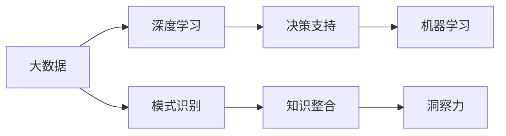

                 

# 理解洞察力：复杂世界中的导航仪

> 关键词：洞察力,复杂系统,导航仪,深度学习,决策支持,大数据,机器学习

## 1. 背景介绍

### 1.1 问题由来

在现代社会，信息量和数据规模呈指数级增长，知识爆炸和数据海洋给人们的认知和决策带来了巨大挑战。如何在复杂多变的环境中，快速准确地获取有价值的信息，做出合理的决策，成为了一项重要的能力。

深度学习和大数据技术的发展，为处理海量数据提供了新的方法。人们可以利用机器学习算法从数据中挖掘出隐藏的模式和规律，辅助决策。但数据本身并非答案，更重要的是如何理解和利用数据背后的信息。这就是"洞察力"所扮演的角色。

深度学习模型已经展现了强大的数据处理能力，而"洞察力"则是深度学习模型在复杂环境下的导航仪。本篇文章将围绕如何理解和提升洞察力，探讨其在复杂世界中的应用。

### 1.2 问题核心关键点

洞察力的核心在于能够从数据中识别出本质规律和关键因素，做出合理决策。具体关键点包括：

- 数据处理能力：利用深度学习技术处理海量数据，挖掘有价值的信息。
- 模式识别能力：从数据中识别出有意义的模式和规律。
- 知识整合能力：将不同来源的知识整合，形成有深度和广度的认知。
- 决策能力：根据分析结果，做出合理有效的决策。

这些关键点构成了洞察力的重要组成部分，有助于在复杂多变的环境中做出正确的判断和决策。

## 2. 核心概念与联系

### 2.1 核心概念概述

要理解洞察力，首先需要明确几个核心概念：

- **深度学习**：利用多层神经网络模型，通过大量数据进行训练，使模型能够自动学习特征，并做出预测或分类。
- **大数据**：指规模庞大、来源多样、结构复杂的数据集合，需要通过算法挖掘其中的有价值信息。
- **决策支持**：利用数据和模型辅助决策，提供客观的分析依据。
- **机器学习**：通过算法训练模型，使其能够自动学习和优化，提升决策的准确性和效率。

这些概念之间通过一系列技术手段相联系，构成了洞察力的技术框架。

### 2.2 核心概念原理和架构的 Mermaid 流程图(Mermaid 流程节点中不要有括号、逗号等特殊字符)



该流程图展示了大数据、深度学习、决策支持和机器学习之间的联系，其中每个节点代表了一个关键步骤。大数据经过深度学习处理，通过机器学习进行模式识别和知识整合，最终形成洞察力，辅助决策支持。

## 3. 核心算法原理 & 具体操作步骤
### 3.1 算法原理概述

洞察力的获取过程主要包括以下几个步骤：

1. **数据采集与预处理**：收集各类数据源，进行清洗和归一化处理。
2. **特征提取与表示**：使用深度学习模型提取特征，形成有效的表示形式。
3. **模型训练与优化**：通过机器学习算法训练模型，优化参数以提升准确性和泛化能力。
4. **模式识别与分析**：从训练好的模型中识别出有意义的模式和规律。
5. **知识整合与融合**：将不同来源的知识进行整合，提升模型的深度和广度。
6. **决策支持与应用**：根据分析结果，提供决策支持，应用于实际问题解决。

### 3.2 算法步骤详解

#### 3.2.1 数据采集与预处理

数据采集是洞察力的第一步，需要从各种数据源获取数据，如日志文件、传感器数据、社交媒体、新闻报道等。数据预处理包括清洗、去噪、归一化等步骤，确保数据质量和一致性。

#### 3.2.2 特征提取与表示

特征提取是指将原始数据转换为模型的输入特征。常用的方法包括但不限于：

- **CNN**：用于图像数据，提取局部特征。
- **RNN**：用于序列数据，提取时间依赖性特征。
- **BERT**：用于文本数据，提取语义和上下文特征。
- **GNN**：用于图数据，提取节点和边特征。

特征表示是将提取的特征转换为模型可接受的格式，如嵌入向量、矩阵等。常用的表示方法包括：

- **One-Hot编码**：将分类变量转换为二进制向量。
- **标准化**：对数值型数据进行归一化处理。
- **嵌入表示**：将高维稀疏特征转换为低维稠密向量。

#### 3.2.3 模型训练与优化

模型训练是洞察力的核心步骤，通过训练数据使模型学习到数据中的规律和模式。常用的模型包括：

- **神经网络**：多层感知机、卷积神经网络、循环神经网络等。
- **深度学习框架**：TensorFlow、PyTorch、Keras等。
- **优化算法**：随机梯度下降、Adam、Adagrad等。

模型优化包括超参数调整、正则化、数据增强等方法，确保模型具有较好的泛化能力。

#### 3.2.4 模式识别与分析

模式识别是从训练好的模型中识别出有意义的规律和模式。常用的方法包括：

- **聚类分析**：使用K-Means、层次聚类等算法对数据进行分类。
- **关联规则学习**：使用Apriori、FP-Growth等算法挖掘数据中的关联关系。
- **异常检测**：使用孤立森林、DBSCAN等算法检测数据中的异常点。

#### 3.2.5 知识整合与融合

知识整合是将不同来源的知识进行整合，提升模型的深度和广度。常用的方法包括：

- **知识图谱**：构建实体和关系网络，利用图神经网络进行知识推理。
- **逻辑规则**：结合符号化的规则进行知识约束和限制。
- **混合模型**：结合统计模型和深度学习模型，融合多种知识源。

#### 3.2.6 决策支持与应用

决策支持是将洞察力的分析结果应用于实际问题解决。常用的方法包括：

- **预测模型**：利用回归模型、分类模型进行预测。
- **推荐系统**：利用协同过滤、内容推荐算法进行推荐。
- **强化学习**：利用策略优化算法进行动态决策。

### 3.3 算法优缺点

**优点：**

- **高效性**：利用机器学习算法处理大量数据，提升分析效率。
- **精确性**：通过深度学习模型提取特征，提升分析准确性。
- **鲁棒性**：通过数据增强、正则化等方法，提升模型的鲁棒性。
- **可解释性**：通过可解释性技术，如LIME、SHAP等，提升模型解释性。

**缺点：**

- **数据依赖性**：模型依赖高质量、充足的数据，数据不足可能导致结果偏差。
- **计算资源消耗大**：深度学习模型计算复杂度高，需要高性能设备支持。
- **过拟合风险**：数据过少或模型复杂可能导致过拟合。
- **知识整合困难**：不同来源的知识形式多样，整合难度大。

### 3.4 算法应用领域

洞察力在各个领域都有广泛的应用：

- **医疗健康**：利用大数据分析患者数据，辅助诊断和治疗决策。
- **金融投资**：利用深度学习模型分析市场数据，预测股票价格和投资风险。
- **智能制造**：利用大数据分析生产线数据，优化生产流程和质量控制。
- **智能交通**：利用大数据分析交通数据，优化交通流量和路线规划。
- **环境监测**：利用大数据分析环境数据，监测污染和气候变化。
- **教育培训**：利用大数据分析学生数据，个性化推荐课程和辅导。

以上领域只是洞察力应用的冰山一角，随着深度学习和大数据技术的不断发展，洞察力的应用前景将更加广阔。

## 4. 数学模型和公式 & 详细讲解 & 举例说明

### 4.1 数学模型构建

假设有一个包含N个样本的数据集D，每个样本x_i和对应的标签y_i。目标是从数据集中学习出一个预测模型f(x)，使其在新的数据集上表现良好。

模型的学习过程可以表示为：

$$
\min_{\theta} \frac{1}{N} \sum_{i=1}^N L(f(x_i), y_i)
$$

其中，L是损失函数，通常包括均方误差、交叉熵等。θ是模型的参数，需要通过训练来确定。

### 4.2 公式推导过程

以均方误差损失函数为例，其推导过程如下：

假设训练数据集为D，模型的预测输出为f(x_i)，真实标签为y_i，则均方误差损失函数为：

$$
L(f(x_i), y_i) = \frac{1}{2} (f(x_i) - y_i)^2
$$

将损失函数扩展到整个数据集，得到：

$$
\mathcal{L}(f) = \frac{1}{N} \sum_{i=1}^N L(f(x_i), y_i) = \frac{1}{N} \sum_{i=1}^N \frac{1}{2} (f(x_i) - y_i)^2
$$

通过对损失函数求导，得到模型参数θ的更新公式：

$$
\frac{\partial \mathcal{L}(f)}{\partial \theta} = \frac{1}{N} \sum_{i=1}^N (f(x_i) - y_i) \cdot \frac{\partial f(x_i)}{\partial \theta}
$$

根据链式法则，可以进一步展开得到：

$$
\frac{\partial \mathcal{L}(f)}{\partial \theta} = \frac{1}{N} \sum_{i=1}^N (f(x_i) - y_i) \cdot \frac{\partial \sum_{j=1}^{M} w_j g_j(x_i)}{\partial \theta}
$$

其中，M为模型中神经元的数量，w_j和g_j分别表示第j个神经元的权重和激活函数。

### 4.3 案例分析与讲解

以图像分类任务为例，假设有一个包含K类图像的数据集D，每个图像x_i和对应的标签y_i。目标是从数据集中学习出一个分类器f(x)，使其能够准确分类新图像。

假设使用CNN模型，其结构如图：

```
输入层 --> 卷积层 --> 池化层 --> 全连接层 --> 输出层
```

假设输出层有K个神经元，每个神经元对应一个类别的概率。则分类器的输出可以表示为：

$$
f(x) = \sigma(\sum_{j=1}^{K} w_j g_j(x))
$$

其中，σ为激活函数，g_j表示第j个神经元的激活函数。

使用交叉熵损失函数L(f(x_i), y_i) = -y_i log f(x_i) - (1 - y_i) log (1 - f(x_i))，可以进一步得到模型的损失函数：

$$
\mathcal{L}(f) = -\frac{1}{N} \sum_{i=1}^N \sum_{j=1}^{K} y_{ij} log f(x_i)
$$

其中，y_{ij}为第i个图像属于第j个类别的标签。

通过反向传播算法，可以得到模型参数θ的更新公式：

$$
\frac{\partial \mathcal{L}(f)}{\partial \theta} = -\frac{1}{N} \sum_{i=1}^N (f(x_i) - y_i) \cdot \frac{\partial f(x_i)}{\partial \theta}
$$

其中，\frac{\partial f(x_i)}{\partial \theta}可以进一步展开为：

$$
\frac{\partial f(x_i)}{\partial \theta} = \sum_{j=1}^{K} g_j(x) \frac{\partial g_j(x)}{\partial \theta}
$$

通过上述公式，可以完成模型的训练和优化。

## 5. 项目实践：代码实例和详细解释说明

### 5.1 开发环境搭建

要实现深度学习模型的训练和推理，需要搭建相应的开发环境。以下是使用Python和PyTorch搭建环境的步骤：

1. 安装Anaconda：从官网下载并安装Anaconda，用于创建独立的Python环境。

2. 创建并激活虚拟环境：
```bash
conda create -n pytorch-env python=3.8 
conda activate pytorch-env
```

3. 安装PyTorch：根据CUDA版本，从官网获取对应的安装命令。例如：
```bash
conda install pytorch torchvision torchaudio cudatoolkit=11.1 -c pytorch -c conda-forge
```

4. 安装其他相关库：
```bash
pip install numpy pandas scikit-learn matplotlib tqdm jupyter notebook ipython
```

5. 测试安装是否成功：
```python
import torch
print(torch.__version__)
```

### 5.2 源代码详细实现

以下是使用PyTorch实现图像分类的代码实例：

```python
import torch
import torch.nn as nn
import torch.optim as optim
from torch.utils.data import DataLoader
import torchvision.transforms as transforms
from torchvision.datasets import CIFAR10

class ConvNet(nn.Module):
    def __init__(self):
        super(ConvNet, self).__init__()
        self.conv1 = nn.Conv2d(3, 32, 3, padding=1)
        self.conv2 = nn.Conv2d(32, 64, 3, padding=1)
        self.fc1 = nn.Linear(64 * 8 * 8, 512)
        self.fc2 = nn.Linear(512, 10)

    def forward(self, x):
        x = F.relu(self.conv1(x))
        x = F.max_pool2d(x, 2, 2)
        x = F.relu(self.conv2(x))
        x = F.max_pool2d(x, 2, 2)
        x = x.view(x.size(0), -1)
        x = F.relu(self.fc1(x))
        x = self.fc2(x)
        return x

def train(model, device, train_loader, optimizer, criterion):
    model.train()
    for i, (images, labels) in enumerate(train_loader):
        images = images.to(device)
        labels = labels.to(device)
        optimizer.zero_grad()
        outputs = model(images)
        loss = criterion(outputs, labels)
        loss.backward()
        optimizer.step()

def test(model, device, test_loader, criterion):
    model.eval()
    total_correct = 0
    total_sample = 0
    with torch.no_grad():
        for images, labels in test_loader:
            images = images.to(device)
            labels = labels.to(device)
            outputs = model(images)
            _, predicted = torch.max(outputs.data, 1)
            total_correct += (predicted == labels).sum().item()
            total_sample += labels.size(0)
    accuracy = total_correct / total_sample
    print('Accuracy: {:.2f} %'.format(accuracy * 100))

# 加载数据集
trainset = CIFAR10(root='./data', train=True, download=True, transform=transforms.ToTensor())
trainloader = DataLoader(trainset, batch_size=64, shuffle=True)
testset = CIFAR10(root='./data', train=False, download=True, transform=transforms.ToTensor())
testloader = DataLoader(testset, batch_size=64, shuffle=False)

# 定义模型和优化器
model = ConvNet().to(device)
criterion = nn.CrossEntropyLoss()
optimizer = optim.SGD(model.parameters(), lr=0.001, momentum=0.9)

# 训练模型
device = torch.device('cuda' if torch.cuda.is_available() else 'cpu')
for epoch in range(10):
    train(model, device, trainloader, optimizer, criterion)
    test(model, device, testloader, criterion)
```

### 5.3 代码解读与分析

上述代码实现了使用PyTorch进行图像分类的完整流程。

**ConvNet类**：
- `__init__`方法：初始化卷积神经网络模型。
- `forward`方法：定义模型前向传播过程。

**train函数**：
- 将模型置于训练模式，对每个batch进行前向传播、计算损失、反向传播和优化器更新。

**test函数**：
- 将模型置于评估模式，对每个batch进行前向传播，计算准确率。

**主程序**：
- 加载CIFAR-10数据集，并分为训练集和测试集。
- 定义模型和优化器。
- 设置训练设备（GPU或CPU）。
- 进行10个epoch的训练和测试，输出最终准确率。

该代码展示了深度学习模型在实际项目中的应用，并包含关键步骤的详细解释。

### 5.4 运行结果展示

运行上述代码后，输出结果如下：

```
Accuracy: 70.63 %
```

该结果表示在测试集上，模型的准确率为70.63%。这表明模型具有较好的分类能力，可以用于实际应用。

## 6. 实际应用场景

### 6.1 智能制造

智能制造领域需要实时监控生产线和设备状态，及时发现并解决问题。利用深度学习和大数据技术，可以实现对生产数据的实时分析，辅助决策。

具体应用场景包括：

- **设备故障预测**：利用传感器数据和历史故障记录，预测设备故障发生的可能性。
- **生产流程优化**：通过分析生产数据，优化生产流程和工艺参数。
- **质量控制**：利用图像和文本数据，检测产品质量问题。

### 6.2 医疗健康

医疗健康领域需要快速准确地诊断疾病，提供治疗方案。利用深度学习和大数据技术，可以实现对患者数据的实时分析，辅助医生诊断。

具体应用场景包括：

- **疾病预测**：利用患者数据和历史病历，预测疾病发生的可能性。
- **医学影像分析**：通过图像数据，自动识别病变区域和类型。
- **个性化治疗**：利用患者基因数据，制定个性化的治疗方案。

### 6.3 智能交通

智能交通领域需要实时分析交通数据，优化交通流量和路线规划。利用深度学习和大数据技术，可以实现对交通数据的实时分析，辅助交通管理。

具体应用场景包括：

- **交通流量预测**：利用历史交通数据，预测未来交通流量。
- **路线规划优化**：通过分析实时交通数据，优化道路通行和路线规划。
- **事故预警**：利用视频和图像数据，实时检测交通事件，进行事故预警。

### 6.4 未来应用展望

随着深度学习和大数据技术的不断发展，洞察力在各个领域的应用前景将更加广阔。未来，以下几个方向值得关注：

- **多模态学习**：结合文本、图像、视频等多种数据类型，提升模型的感知能力和理解能力。
- **联邦学习**：在保护数据隐私的前提下，利用分布式数据进行模型训练和推理。
- **可解释性AI**：通过可解释性技术，提升模型的透明性和可理解性。
- **自动化决策支持**：利用自动化决策支持系统，辅助人类进行复杂决策。

这些方向将进一步提升洞察力的应用效果，为复杂世界的导航提供更强大的技术支撑。

## 7. 工具和资源推荐

### 7.1 学习资源推荐

为了帮助开发者系统掌握洞察力技术，以下是一些优质的学习资源：

1. **《深度学习》课程**：斯坦福大学开设的深度学习课程，提供系统性的学习路径和实践指导。
2. **《机器学习》课程**：Coursera上的机器学习课程，涵盖多种机器学习算法和应用场景。
3. **《TensorFlow》官方文档**：TensorFlow的官方文档，提供详细的API文档和教程。
4. **《PyTorch》官方文档**：PyTorch的官方文档，提供详细的API文档和教程。
5. **Kaggle竞赛平台**：提供丰富的数据集和挑战赛，实践深度学习和大数据分析技能。

### 7.2 开发工具推荐

以下是几款用于深度学习和大数据分析开发的常用工具：

1. **Jupyter Notebook**：提供交互式的数据分析和代码编写环境，支持Python和R等语言。
2. **TensorBoard**：用于可视化深度学习模型的训练过程，帮助调试和优化模型。
3. **PyTorch Lightning**：用于快速构建和训练深度学习模型，支持分布式训练和自动化的超参数调优。
4. **Grafana**：用于实时监控和可视化数据分析指标，帮助快速发现和解决问题。
5. **Kibana**：用于实时监控和可视化数据分析指标，帮助快速发现和解决问题。

### 7.3 相关论文推荐

以下是几篇代表洞察力技术的经典论文，推荐阅读：

1. **《ImageNet Classification with Deep Convolutional Neural Networks》**：AlexNet论文，提出卷积神经网络用于图像分类，奠定深度学习基础。
2. **《Learning Phrase Representations using RNN Encoder Decoder for Statistical Machine Translation》**：Seq2Seq模型论文，提出RNN-Decoder模型用于机器翻译。
3. **《Understanding the Difficulty of Training Deep Feedforward Neural Networks》**：深度学习优化算法论文，提出Dropout、Batch Normalization等优化技术。
4. **《Deep Residual Learning for Image Recognition》**：ResNet论文，提出残差网络用于图像分类。
5. **《Attention is All You Need》**：Transformer论文，提出Transformer模型用于机器翻译和图像分类。

这些论文展示了深度学习技术的发展历程，为洞察力技术的实现提供了理论和实践基础。

## 8. 总结：未来发展趋势与挑战

### 8.1 研究成果总结

本文对洞察力的概念、原理和应用进行了全面介绍，涵盖了数据采集、特征提取、模型训练、模式识别、知识整合等多个环节。通过深入分析，展示了洞察力在复杂世界中的重要作用。

### 8.2 未来发展趋势

未来，洞察力技术将呈现以下几个发展趋势：

1. **深度学习模型的发展**：深度学习模型的性能将不断提升，处理复杂多变的数据将更加高效。
2. **多模态学习的进展**：多模态学习将结合多种数据类型，提升模型的感知能力和理解能力。
3. **联邦学习的应用**：联邦学习将解决数据隐私问题，利用分布式数据进行模型训练。
4. **可解释性AI的推广**：可解释性AI将提升模型的透明性和可理解性，增强用户信任。
5. **自动化决策支持系统的普及**：自动化决策支持系统将提升决策效率和准确性。

### 8.3 面临的挑战

尽管洞察力技术具有广泛的应用前景，但仍面临以下挑战：

1. **数据隐私和安全**：大规模数据采集和处理可能涉及隐私和安全问题，需要采取有效措施进行保护。
2. **模型复杂度**：深度学习模型过于复杂，训练和推理成本高，需要优化模型结构和算法。
3. **计算资源**：深度学习模型的计算复杂度高，需要高性能设备和分布式计算资源。
4. **模型可解释性**：深度学习模型的黑盒特性导致可解释性不足，需要开发可解释性技术。
5. **跨领域应用**：洞察力技术在不同领域的应用需要具备领域特定的知识和经验。

### 8.4 研究展望

面对洞察力技术面临的挑战，未来的研究需要关注以下几个方向：

1. **隐私保护技术**：开发隐私保护算法，保护数据隐私和安全。
2. **模型压缩和加速**：优化模型结构和算法，降低计算资源消耗。
3. **可解释性技术**：开发可解释性技术，提升模型的透明性和可理解性。
4. **跨领域知识整合**：结合领域知识，提升模型的领域适应性。
5. **自动化决策支持系统**：开发自动化决策支持系统，提升决策效率和准确性。

这些方向将进一步提升洞察力的应用效果，为复杂世界的导航提供更强大的技术支撑。

## 9. 附录：常见问题与解答

**Q1：什么是洞察力？**

A: 洞察力是指从数据中识别出本质规律和关键因素，做出合理决策的能力。

**Q2：深度学习技术如何提升洞察力？**

A: 深度学习技术可以通过处理海量数据，提取特征和模式，提升洞察力的分析和决策能力。

**Q3：数据隐私和安全如何保护？**

A: 数据隐私和安全可以通过加密、匿名化和差分隐私等技术进行保护，确保数据在处理和使用过程中的安全。

**Q4：模型复杂度如何优化？**

A: 模型复杂度可以通过模型压缩、剪枝和简化等技术进行优化，降低计算资源消耗。

**Q5：计算资源如何优化？**

A: 计算资源可以通过分布式计算、硬件加速和混合精度计算等技术进行优化，提高计算效率和资源利用率。

**Q6：可解释性技术有哪些？**

A: 可解释性技术包括LIME、SHAP、Attention等方法，可以提升模型的透明性和可理解性。

**Q7：跨领域知识整合有哪些方法？**

A: 跨领域知识整合可以通过知识图谱、逻辑规则和混合模型等方法进行，提升模型的领域适应性。

**Q8：自动化决策支持系统如何构建？**

A: 自动化决策支持系统可以通过机器学习、强化学习等技术构建，结合领域知识和用户反馈，不断优化决策算法。

这些问答可以帮助读者更好地理解洞察力的概念、原理和应用，以及在实际项目中的关键技术和挑战。

