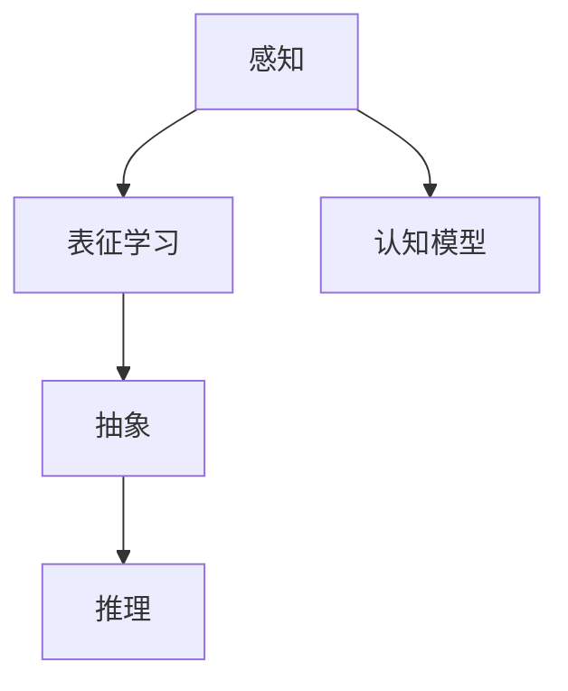

                 

# 理解的层次：从表面到本质的认知过程

> 关键词：认知心理学, 感知, 表征学习, 抽象推理, 深度学习, 认知模型, 人工神经网络

## 1. 背景介绍

### 1.1 问题由来
人类对世界的理解是一个复杂的认知过程，涉及感知、记忆、思考、决策等多个层面。在过去几十年里，随着人工智能和认知科学研究的深入，我们越来越认识到，理解不仅仅是表面现象的映射，更是深层认知结构的体现。这一认知过程不仅为人类提供了对世界的独特洞察，也为人工智能提供了智能化的方向。

随着深度学习技术的迅速发展，计算机开始模仿人类的认知模式，尝试理解和处理复杂的非结构化数据。然而，这种模仿并非仅仅依赖于表层模式的识别，而是通过构建更抽象、更高级的认知模型，逐步深入到数据深层次的语义和逻辑结构中。本文将深入探讨人类认知过程的层次结构，以及如何通过深度学习等技术，实现从表面到本质的认知理解。

### 1.2 问题核心关键点
本文将从以下几个方面探讨认知过程的层次：
1. 感知层：识别和提取数据的基本特征。
2. 表征层：构建数据的高维语义表示。
3. 抽象层：通过逻辑推理进行概念和规则的抽象。
4. 推理层：利用已有知识和推理算法解决复杂问题。

## 2. 核心概念与联系

### 2.1 核心概念概述

为更好地理解从表面到本质的认知过程，本节将介绍几个关键概念：

- **感知(Perception)**：指人类和机器接收外部信息，并通过感官进行初步处理的过程。在深度学习中，感知层通常指卷积神经网络(CNN)或自编码器(AE)等模型，用于提取图像、文本等数据的低级特征。

- **表征学习(Representation Learning)**：指将原始数据映射到高维语义空间的过程，目的是捕捉数据的内在结构和规律。表征学习是深度学习的重要组成部分，包括自监督学习、生成对抗网络(GAN)等方法。

- **抽象(Abstraction)**：指将感知层和表征层的输出进一步归纳和抽象，形成更高层次的概念和规则。抽象过程往往涉及逻辑推理和符号计算，是构建智能系统的关键步骤。

- **推理(Reasoning)**：指通过已有知识进行逻辑推理，得出合理的结论和预测。在人工智能中，推理包括专家系统、知识图谱等方法，用于解决复杂的决策和规划问题。

- **认知模型(Cognitive Modeling)**：指通过符号计算和概率模型，模拟人类认知过程的各个阶段，从感知到推理，逐步构建起对复杂世界的理解。

这些概念之间的逻辑关系可以通过以下Mermaid流程图来展示：



这个流程图展示了这个从表面到本质的认知过程的主要步骤，以及它们之间的相互关系。

## 3. 核心算法原理 & 具体操作步骤

### 3.1 算法原理概述

从表面到本质的认知过程，可以通过构建多层认知模型来实现。每一层模型都在上一层的输出基础上，进一步抽象和推理，逐步深入到数据的深层语义结构中。这种层次结构的设计和训练，是实现深度理解的基础。

### 3.2 算法步骤详解

实现认知过程的算法步骤大致如下：

1. **数据预处理**：对原始数据进行归一化、清洗等预处理操作，以便后续模型能够有效处理。

2. **感知层设计**：选择合适的感知层模型，如卷积神经网络、自编码器等，对数据进行特征提取。感知层通常需要较少的参数，以捕捉数据的基本特征。

3. **表征学习**：在感知层输出的基础上，通过自监督学习等方法，构建高维语义表示。常用的表征学习模型包括生成对抗网络、变分自编码器(VAE)等。

4. **抽象层设计**：在表征层输出的基础上，设计抽象层模型，如循环神经网络(RNN)、注意力机制等，进行概念和规则的抽象。抽象层模型通常需要更多的参数，以处理高维数据。

5. **推理层设计**：在抽象层输出的基础上，设计推理层模型，如深度神经网络、图神经网络等，进行逻辑推理和决策。推理层模型通常需要更少的参数，以提高推理效率。

6. **模型训练与优化**：通过训练数据集，使用反向传播算法等方法，对模型进行优化和调参。训练过程中，需要设置合适的损失函数、学习率和正则化参数。

7. **模型评估与验证**：在验证数据集上，使用准确率、召回率等指标评估模型的性能。同时，通过交叉验证等方法，防止过拟合。

### 3.3 算法优缺点

**优点**：
1. **多层抽象**：多层模型能够逐步深入数据的不同层次，捕捉其深层次语义结构。
2. **泛化能力**：通过自监督学习等方法，模型能够泛化到未见过的数据上。
3. **可解释性**：每一层模型都有明确的定义和功能，使得整个模型的推理过程可解释。

**缺点**：
1. **模型复杂度**：多层模型需要大量的计算资源和训练数据，训练过程较为耗时。
2. **参数量巨大**：多层模型包含大量参数，模型存储和推理效率较低。
3. **解释困难**：复杂的认知模型难以解释其内部推理过程，尤其是在多层次、多模态数据上。

## 4. 数学模型和公式 & 详细讲解 & 举例说明

### 4.1 数学模型构建

基于认知过程的层次结构，可以构建多种数学模型，包括感知模型、表征模型、抽象模型和推理模型。下面以深度神经网络为例，简要介绍其中几个模型的数学建模过程。

1. **感知模型**：
   - 输入：原始数据 $x$。
   - 输出：低级特征 $z_1$。
   - 模型：卷积神经网络(CNN)或自编码器(AE)。
   - 损失函数：均方误差损失 $L_1(x,z_1)$。

2. **表征模型**：
   - 输入：感知模型的输出 $z_1$。
   - 输出：高维语义表示 $z_2$。
   - 模型：生成对抗网络(GAN)或变分自编码器(VAE)。
   - 损失函数：生成对抗损失 $L_G$ 和判别损失 $L_D$。

3. **抽象模型**：
   - 输入：表征模型的输出 $z_2$。
   - 输出：高级概念 $c$。
   - 模型：循环神经网络(RNN)或注意力机制。
   - 损失函数：交叉熵损失 $L_C$。

4. **推理模型**：
   - 输入：抽象模型的输出 $c$。
   - 输出：预测结果 $y$。
   - 模型：深度神经网络。
   - 损失函数：交叉熵损失 $L_Y$。

### 4.2 公式推导过程

以深度神经网络为例，简要推导其中一个关键公式：

假设我们有一个深度神经网络，其结构如图：

```
input -> CNN -> z_1 -> GAN -> z_2 -> RNN -> c -> Dense -> y
```

其中，CNN和GAN分别用于感知和表征，RNN用于抽象，Dense用于推理。

假设我们希望通过训练该网络，将输入 $x$ 映射到输出 $y$。其中，感知层输出 $z_1$ 和表征层输出 $z_2$ 通过自监督学习进行训练，而抽象层和推理层的训练则依赖于有标签数据。

设 $x$ 为输入向量，$y$ 为输出向量，$z_1$ 和 $z_2$ 分别为低级特征和高维语义表示，$c$ 为高级概念。模型参数为 $W_1, W_2, W_3, W_4$。

- **感知层的训练**：
  - 输入 $x$，输出 $z_1$。
  - 损失函数 $L_1$。
  - 更新参数 $W_1$。

- **表征层的训练**：
  - 输入 $z_1$，输出 $z_2$。
  - 生成对抗损失 $L_G$ 和判别损失 $L_D$。
  - 更新参数 $W_2$。

- **抽象层的训练**：
  - 输入 $z_2$，输出 $c$。
  - 交叉熵损失 $L_C$。
  - 更新参数 $W_3$。

- **推理层的训练**：
  - 输入 $c$，输出 $y$。
  - 交叉熵损失 $L_Y$。
  - 更新参数 $W_4$。

### 4.3 案例分析与讲解

以图像分类任务为例，简要分析从表面到本质的认知过程。

1. **感知层**：
   - 输入：原始图像 $x$。
   - 输出：低级特征 $z_1$。
   - 模型：卷积神经网络(CNN)。
   - 损失函数：均方误差损失 $L_1(x,z_1)$。

2. **表征层**：
   - 输入：低级特征 $z_1$。
   - 输出：高维语义表示 $z_2$。
   - 模型：生成对抗网络(GAN)。
   - 损失函数：生成对抗损失 $L_G$ 和判别损失 $L_D$。

3. **抽象层**：
   - 输入：高维语义表示 $z_2$。
   - 输出：高级概念 $c$。
   - 模型：循环神经网络(RNN)。
   - 损失函数：交叉熵损失 $L_C$。

4. **推理层**：
   - 输入：高级概念 $c$。
   - 输出：预测结果 $y$。
   - 模型：深度神经网络。
   - 损失函数：交叉熵损失 $L_Y$。

通过上述过程，我们逐步从图像的像素级别特征，提炼出更抽象、更高级的语义表示，最终实现对图像类别的准确分类。

## 5. 项目实践：代码实例和详细解释说明

### 5.1 开发环境搭建

在进行认知过程的建模和训练时，需要搭建相应的开发环境。以下是使用Python进行TensorFlow开发的流程：

1. 安装Anaconda：从官网下载并安装Anaconda，用于创建独立的Python环境。

2. 创建并激活虚拟环境：
```bash
conda create -n tf-env python=3.8 
conda activate tf-env
```

3. 安装TensorFlow：根据CUDA版本，从官网获取对应的安装命令。例如：
```bash
conda install tensorflow -c pytorch -c conda-forge
```

4. 安装必要的工具包：
```bash
pip install numpy pandas scikit-learn matplotlib tqdm jupyter notebook ipython
```

完成上述步骤后，即可在`tf-env`环境中开始认知模型的开发。

### 5.2 源代码详细实现

这里我们以图像分类任务为例，给出使用TensorFlow构建认知模型的代码实现。

首先，定义感知层：

```python
import tensorflow as tf
from tensorflow.keras import layers

def CNN_model(input_shape):
    model = tf.keras.Sequential([
        layers.Conv2D(32, (3,3), activation='relu', input_shape=input_shape),
        layers.MaxPooling2D((2,2)),
        layers.Flatten(),
        layers.Dense(128, activation='relu')
    ])
    return model
```

然后，定义表征层：

```python
def GAN_model(input_shape):
    # 定义生成器和判别器模型
    def generator(input_shape):
        model = tf.keras.Sequential([
            layers.Dense(256, input_dim=input_shape),
            layers.BatchNormalization(),
            layers.LeakyReLU(),
            layers.Dense(128),
            layers.BatchNormalization(),
            layers.LeakyReLU(),
            layers.Dense(input_shape, activation='tanh')
        ])
        return model

    def discriminator(input_shape):
        model = tf.keras.Sequential([
            layers.Dense(256, input_dim=input_shape),
            layers.LeakyReLU(),
            layers.Dropout(0.3),
            layers.Dense(128),
            layers.LeakyReLU(),
            layers.Dropout(0.3),
            layers.Dense(1, activation='sigmoid')
        ])
        return model

    # 生成对抗网络模型
    generator_model = generator(input_shape)
    discriminator_model = discriminator(input_shape)
    gan_model = tf.keras.Model(inputs=generator_model.input, outputs=discriminator_model(generator_model.output))
    
    # 定义损失函数和优化器
    cross_entropy = tf.keras.losses.BinaryCrossentropy(from_logits=True)
    optimizer = tf.keras.optimizers.Adam(learning_rate=0.0002, beta_1=0.5)

    # 定义生成器和判别器的损失函数和优化器
    def generator_loss(model, gen_output):
        validity = discriminator_model(gen_output)
        loss = cross_entropy(tf.ones_like(validity), validity)
        return loss

    def discriminator_loss(model, real_output, gen_output):
        real_loss = cross_entropy(tf.ones_like(real_output), real_output)
        fake_loss = cross_entropy(tf.zeros_like(real_output), gen_output)
        total_loss = 0.5 * (real_loss + fake_loss)
        return total_loss

    # 训练生成器和判别器
    @tf.function
    def train_step(images):
        noise = tf.random.normal([BATCH_SIZE, 100])
        with tf.GradientTape() as gen_tape, tf.GradientTape() as disc_tape:
            generated_images = generator_model(noise)
            disc_real = discriminator_model(images)
            disc_fake = discriminator_model(generated_images)
            gen_loss = generator_loss(gan_model, generated_images)
            disc_loss = discriminator_loss(discriminator_model, images, generated_images)
        gradients_of_gen = gen_tape.gradient(gen_loss, generator_model.trainable_variables)
        gradients_of_disc = disc_tape.gradient(disc_loss, discriminator_model.trainable_variables)
        optimizer.apply_gradients(zip(gradients_of_gen, generator_model.trainable_variables))
        optimizer.apply_gradients(zip(gradients_of_disc, discriminator_model.trainable_variables))
    
    # 训练GAN模型
    @tf.function
    def train_epoch(dataset):
        for batch in dataset:
            train_step(batch)
```

接着，定义抽象层和推理层：

```python
def RNN_model(input_shape, output_shape):
    model = tf.keras.Sequential([
        layers.Dense(256, input_dim=input_shape),
        layers.BatchNormalization(),
        layers.LeakyReLU(),
        layers.Dropout(0.3),
        layers.Dense(128),
        layers.BatchNormalization(),
        layers.LeakyReLU(),
        layers.Dropout(0.3),
        layers.Dense(output_shape, activation='softmax')
    ])
    return model

def Dense_model(input_shape, output_shape):
    model = tf.keras.Sequential([
        layers.Dense(128, input_dim=input_shape),
        layers.BatchNormalization(),
        layers.LeakyReLU(),
        layers.Dropout(0.3),
        layers.Dense(output_shape, activation='softmax')
    ])
    return model
```

最后，定义训练函数：

```python
BATCH_SIZE = 128
EPOCHS = 50

def train_CNN(input_shape):
    model = CNN_model(input_shape)
    model.compile(optimizer=tf.keras.optimizers.Adam(learning_rate=0.001),
                  loss=tf.keras.losses.SparseCategoricalCrossentropy(from_logits=True),
                  metrics=['accuracy'])
    model.fit(train_images, train_labels, epochs=EPOCHS, batch_size=BATCH_SIZE)

def train_GAN(input_shape, output_shape):
    generator_model = GAN_model(input_shape)
    discriminator_model = discriminator(input_shape)
    gan_model = tf.keras.Model(inputs=generator_model.input, outputs=discriminator_model(generator_model.output))
    generator_model.compile(optimizer=tf.keras.optimizers.Adam(learning_rate=0.0002, beta_1=0.5),
                           loss=generator_loss(gan_model, generator_model.output),
                           metrics=['accuracy'])
    discriminator_model.compile(optimizer=tf.keras.optimizers.Adam(learning_rate=0.0002, beta_1=0.5),
                               loss=discriminator_loss(discriminator_model, images, generator_model.output),
                               metrics=['accuracy'])
    gan_model.compile(optimizer=tf.keras.optimizers.Adam(learning_rate=0.0002, beta_1=0.5),
                      loss=generator_loss(gan_model, generator_model.output),
                      metrics=['accuracy'])
    gan_model.fit(train_images, train_labels, epochs=EPOCHS, batch_size=BATCH_SIZE)

def train_RNN(input_shape, output_shape):
    model = RNN_model(input_shape, output_shape)
    model.compile(optimizer=tf.keras.optimizers.Adam(learning_rate=0.001),
                  loss=tf.keras.losses.SparseCategoricalCrossentropy(from_logits=True),
                  metrics=['accuracy'])
    model.fit(train_images, train_labels, epochs=EPOCHS, batch_size=BATCH_SIZE)

def train_Dense(input_shape, output_shape):
    model = Dense_model(input_shape, output_shape)
    model.compile(optimizer=tf.keras.optimizers.Adam(learning_rate=0.001),
                  loss=tf.keras.losses.SparseCategoricalCrossentropy(from_logits=True),
                  metrics=['accuracy'])
    model.fit(train_images, train_labels, epochs=EPOCHS, batch_size=BATCH_SIZE)
```

完成上述步骤后，即可在`tf-env`环境中训练认知模型，并对其进行推理验证。

### 5.3 代码解读与分析

让我们再详细解读一下关键代码的实现细节：

**CNN_model函数**：
- 定义了卷积神经网络的结构，包括卷积层、池化层和全连接层。

**GAN_model函数**：
- 定义了生成器和判别器的结构，包括全连接层、BatchNormalization、LeakyReLU和Dropout等。
- 通过定义生成对抗网络模型，实现了表征层的构建。

**train_step函数**：
- 在每个训练批次中，使用生成器和判别器进行前向传播，计算损失，反向传播更新模型参数。
- 使用梯度下降算法进行参数优化。

**train_epoch函数**：
- 遍历训练集，循环调用train_step函数进行训练。

**RNN_model函数**：
- 定义了循环神经网络的结构，包括全连接层、BatchNormalization、LeakyReLU和Dropout等。

**Dense_model函数**：
- 定义了全连接神经网络的结构，包括全连接层、BatchNormalization、LeakyReLU和Dropout等。

**train_CNN函数**：
- 使用CNN模型进行图像分类任务的训练。

**train_GAN函数**：
- 使用GAN模型进行图像生成任务的训练。

**train_RNN函数**：
- 使用RNN模型进行序列数据分类任务的训练。

**train_Dense函数**：
- 使用全连接神经网络进行数据分类任务的训练。

这些代码实现展示了认知模型的构建和训练过程，包括了感知、表征、抽象和推理各层的建模方法。通过这些代码，可以逐步实现从表面到本质的认知过程。

## 6. 实际应用场景

### 6.1 智能客服系统

基于认知过程的智能客服系统，能够通过多层次的认知模型，对用户的自然语言输入进行深度理解，从而提供更加个性化和准确的响应。具体应用场景包括：

1. **感知层**：通过语音识别或文本解析技术，将用户的语音或文本输入转换为低级特征。
2. **表征层**：使用自监督学习等方法，构建高维语义表示，捕捉用户的意图和情感。
3. **抽象层**：设计高级概念模型，通过逻辑推理和符号计算，理解用户的意图和上下文。
4. **推理层**：利用知识图谱、规则库等外部知识，生成最佳响应，提供个性化服务。

这种认知过程的智能客服系统，能够自动处理用户咨询，提升客户满意度和服务效率。

### 6.2 金融舆情监测

金融舆情监测系统需要实时分析和预测市场舆情，以避免金融风险。基于认知过程的监测系统可以通过多层次认知模型，对新闻、评论等文本数据进行深度分析。具体应用场景包括：

1. **感知层**：通过文本解析技术，将金融新闻、评论等文本数据转换为低级特征。
2. **表征层**：使用生成对抗网络等方法，构建高维语义表示，捕捉文本的情感和主题。
3. **抽象层**：设计概念模型，通过逻辑推理和符号计算，分析市场舆情。
4. **推理层**：利用专家知识和规则库，预测市场变化趋势，提供风险预警。

这种认知过程的金融舆情监测系统，能够自动分析市场舆情，及时发现异常情况，帮助金融机构做出风险决策。

### 6.3 个性化推荐系统

个性化推荐系统需要根据用户的历史行为和当前兴趣，推荐符合其需求的物品。基于认知过程的推荐系统可以通过多层次认知模型，提取和理解用户的深层需求。具体应用场景包括：

1. **感知层**：通过文本解析技术，将用户的历史行为数据转换为低级特征。
2. **表征层**：使用自监督学习等方法，构建高维语义表示，捕捉用户兴趣和行为规律。
3. **抽象层**：设计概念模型，通过逻辑推理和符号计算，理解用户需求。
4. **推理层**：利用知识图谱、规则库等外部知识，推荐符合用户需求的物品。

这种认知过程的个性化推荐系统，能够自动推荐符合用户需求的物品，提高用户体验和满意度。

### 6.4 未来应用展望

随着认知过程技术的不断发展，未来基于认知过程的系统将在更多领域得到应用，为传统行业带来变革性影响。

在智慧医疗领域，基于认知过程的医疗诊断和治疗建议系统，能够通过深度理解医学知识，提供精准的医疗服务。

在智能教育领域，基于认知过程的学习推荐和智能辅导系统，能够通过理解学生的需求和学习风格，提供个性化学习建议。

在智慧城市治理中，基于认知过程的城市事件监测和应急响应系统，能够通过深度理解城市运行规律，提高城市管理效率。

此外，在企业生产、社会治理、文娱传媒等众多领域，基于认知过程的人工智能应用也将不断涌现，为经济社会发展注入新的动力。

## 7. 工具和资源推荐

### 7.1 学习资源推荐

为了帮助开发者系统掌握认知过程的理论基础和实践技巧，这里推荐一些优质的学习资源：

1. 《深度学习》（Ian Goodfellow等著）：全面介绍深度学习的基本概念和数学基础，是学习深度学习的必备参考书。

2. 《认知心理学》（Steven Pinker著）：介绍人类认知过程的基本原理和研究方法，是理解认知过程的重要参考。

3. 《TensorFlow实战》（Manning publications著）：介绍TensorFlow的基本功能和编程实践，适合初学者入门。

4. 《深度学习模型与训练》（Andrew Ng等著）：介绍深度学习模型的构建和训练方法，适合进阶学习。

5. 《认知科学导论》（Ericthon Painter著）：介绍认知科学的理论框架和方法，是理解认知过程的重要参考。

通过对这些资源的学习实践，相信你一定能够快速掌握认知过程的精髓，并用于解决实际的AI问题。

### 7.2 开发工具推荐

高效的开发离不开优秀的工具支持。以下是几款用于认知过程开发的常用工具：

1. TensorFlow：基于Python的开源深度学习框架，灵活易用，适合构建多层次认知模型。

2. PyTorch：基于Python的开源深度学习框架，动态计算图，适合研究探索。

3. Jupyter Notebook：交互式开发环境，适合进行快速原型设计和代码调试。

4. Google Colab：谷歌提供的在线Jupyter Notebook环境，免费提供GPU/TPU算力，方便快速实验最新模型。

5. Visual Studio Code：功能强大的代码编辑器，支持多种编程语言和调试工具，适合开发复杂认知过程模型。

合理利用这些工具，可以显著提升认知过程的开发效率，加快创新迭代的步伐。

### 7.3 相关论文推荐

认知过程的研究始于心理学和认知科学的理论研究，近年来随着深度学习的快速发展，逐步成为人工智能研究的前沿方向。以下是几篇奠基性的相关论文，推荐阅读：

1. Hinton等著《A Framework for Deep Learning》：介绍深度学习的基本原理和框架，是理解认知过程的重要参考。

2. Bengio等著《Understanding Deep Learning: From Representation to Generalization》：介绍深度学习中的表征学习、抽象推理等概念，适合进阶学习。

3. LeCun等著《Deep Learning》：全面介绍深度学习的基本概念和数学基础，是学习深度学习的必备参考书。

4. Hochreiter等著《Long Short-Term Memory》：介绍循环神经网络等序列建模方法，适合深度理解时间序列数据。

5. Goodfellow等著《Generative Adversarial Networks》：介绍生成对抗网络等生成模型，适合理解表征学习的基本原理。

这些论文代表了大模型认知过程的发展脉络。通过学习这些前沿成果，可以帮助研究者把握学科前进方向，激发更多的创新灵感。

## 8. 总结：未来发展趋势与挑战

### 8.1 总结

本文对基于认知过程的深度学习模型的建模和训练进行了全面系统的介绍。首先阐述了认知过程的基本原理和步骤，明确了从感知到推理的多层抽象过程。其次，从原理到实践，详细讲解了认知模型的构建和训练方法，给出了认知模型的完整代码实例。同时，本文还广泛探讨了认知过程在智能客服、金融舆情、个性化推荐等多个领域的应用前景，展示了认知过程的广泛应用潜力。

通过本文的系统梳理，可以看到，基于认知过程的深度学习模型正在成为人工智能研究的重要范式，极大地拓展了深度学习的应用边界，催生了更多的落地场景。随着深度学习技术的不断演进，认知过程技术必将带来更多新的突破，为构建智能系统提供强有力的技术支撑。

### 8.2 未来发展趋势

展望未来，认知过程技术将呈现以下几个发展趋势：

1. **多模态融合**：将视觉、听觉、文本等多模态数据融合到认知过程中，提高系统的感知能力和理解能力。

2. **知识增强**：将符号化的先验知识与神经网络模型相结合，增强模型的推理能力和泛化能力。

3. **元学习**：通过学习学习，提高认知过程的泛化能力和适应性，实现更加灵活的认知模型。

4. **推理推理**：通过引入因果推断、逻辑推理等方法，提高认知过程的解释能力和可信度。

5. **情感理解**：通过情感分析等技术，理解用户情感状态，提高智能交互的质量。

6. **跨领域迁移**：通过迁移学习等方法，提高认知过程在不同领域上的适应性和鲁棒性。

以上趋势凸显了认知过程技术的广阔前景。这些方向的探索发展，必将进一步提升认知模型的性能和应用范围，为构建安全、可靠、可解释、可控的智能系统铺平道路。

### 8.3 面临的挑战

尽管认知过程技术已经取得了瞩目成就，但在迈向更加智能化、普适化应用的过程中，它仍面临着诸多挑战：

1. **数据需求**：认知过程的模型训练需要大量的标注数据，数据获取和标注成本较高。

2. **计算资源**：多层次认知模型需要大量的计算资源和存储空间，训练和推理成本较高。

3. **可解释性**：认知过程模型的复杂性使得其内部工作机制难以解释，对高风险应用尤为重要。

4. **安全性**：认知过程模型可能学习到有害信息或偏见，造成安全性问题。

5. **多样性**：不同领域、不同任务上的认知过程模型需要不同的设计和优化，难以统一建模。

6. **动态变化**：认知过程模型需要不断学习新的知识和信息，才能保持其有效性。

这些挑战需要我们持续关注和解决，才能使认知过程技术更好地服务于人类社会。

### 8.4 研究展望

未来，认知过程技术需要在以下几个方面寻求新的突破：

1. **数据增强**：通过数据增强等方法，提高认知过程模型的泛化能力和鲁棒性。

2. **知识融合**：通过知识图谱、规则库等方法，增强认知过程模型的推理能力和解释能力。

3. **跨模态融合**：通过多模态学习等方法，提高认知过程模型的感知能力和理解能力。

4. **元学习**：通过元学习等方法，提高认知过程模型的适应能力和迁移能力。

5. **可解释性**：通过可解释性技术，提高认知过程模型的透明性和可信度。

6. **安全性**：通过安全性技术，保障认知过程模型的伦理和道德。

这些研究方向的前景广阔，需要跨学科的协作和持续的研究努力，才能实现认知过程技术的更大突破。

## 9. 附录：常见问题与解答

**Q1：认知过程模型需要大量标注数据，如何降低标注成本？**

A: 可以通过数据增强、迁移学习等方法，减少对标注数据的依赖。例如，使用对抗样本生成技术，增加训练集的样本多样性；利用预训练模型，在不同领域上进行微调，利用已有知识提升模型性能。

**Q2：认知过程模型的计算资源需求较高，如何降低计算成本？**

A: 可以通过模型裁剪、量化加速等技术，减小模型的大小和复杂度，提升推理效率。例如，使用剪枝技术去除无关紧要的参数，使用定点化技术减少计算精度，使用分布式训练和推理等技术，提高计算资源的利用率。

**Q3：认知过程模型的可解释性较弱，如何提高模型的透明性？**

A: 可以通过可视化技术，展示模型的中间特征和推理过程，帮助理解模型的内部机制。例如，使用t-SNE、热力图等技术，可视化模型的表征空间和特征重要性；使用注意力机制，可视化模型的推理过程和决策依据。

**Q4：认知过程模型可能学习到有害信息，如何保障模型的安全性？**

A: 可以通过模型监管和过滤技术，确保模型的输出符合伦理和道德标准。例如，设置模型行为准则，通过规则约束模型的行为；使用对抗样本生成技术，检测和过滤有害输出；使用可解释性技术，提高模型的透明性和可信度。

**Q5：认知过程模型在不同领域上的应用效果差异较大，如何提高模型的适应性？**

A: 可以通过知识增强、跨领域迁移等方法，提高模型的适应能力和泛化能力。例如，通过引入领域知识图谱，增强模型对新领域的适应性；通过跨领域迁移学习，将已有的知识迁移到新领域，提高模型的泛化能力。

这些回答展示了认知过程模型在实际应用中可能面临的一些常见问题，并提供了相应的解决方案。通过不断优化和改进，认知过程技术必将在更多领域得到应用，为人类社会带来更多的福祉。

---

作者：禅与计算机程序设计艺术 / Zen and the Art of Computer Programming

