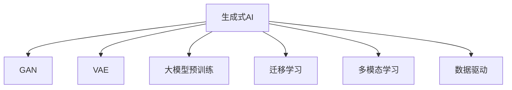

                 

# 生成式AIGC是金矿还是泡沫:数据才是关键

> 关键词：生成式AIGC,自然语言处理(NLP),机器学习,深度学习,大模型,数据驱动,人工智能(AI)

## 1. 背景介绍

### 1.1 问题由来

近年来，人工智能(AI)领域迎来了一个颠覆性的技术变革——生成式人工智能(Generative AI, 简称AIGC)。凭借生成式模型，如GPT-4、DALL-E、StableDiffusion等，AI可以创造出前所未有的图像、视频、音频和文本等内容。这一技术的突破不仅引发了业界的高度关注，也引发了市场对于AIGC未来前景的极大期待。

与此同时，关于AIGC是否能够成为金矿，或是单纯的技术泡沫的讨论也日渐增多。在AI技术的快速迭代与资本的热烈追捧中，人们不禁要问：AIGC的真正价值在哪里？答案无疑是数据。本文将深入探讨AIGC的核心算法原理，并分析数据在其中的关键作用，为理解AIGC的本质提供全新的视角。

### 1.2 问题核心关键点

AIGC技术的核心在于生成式模型，尤其是基于深度学习的生成对抗网络(GAN)和变分自编码器(VAE)等模型。这些模型通过大规模的数据训练，学习到生成目标数据的概率分布，能够在没有特定数据输入的情况下，产生具有一定合理性的输出。这一技术突破源于大数据、高性能计算和深度学习的紧密结合，使得AIGC在内容创作、图像处理、语音合成等领域展现出巨大潜力。

然而，AIGC技术的可靠性、真实性、公正性等问题仍需深入研究。特别是其对数据的需求，以及数据在生成过程中的作用，是理解和应用AIGC技术的关键。本文将从AIGC的算法原理、数据驱动的训练方法、实际应用场景等多个维度，全面剖析AIGC技术的核心，探讨其在不同领域的潜在应用和挑战。

## 2. 核心概念与联系

### 2.1 核心概念概述

为更好地理解AIGC的核心技术及其数据驱动特性，本节将介绍几个密切相关的核心概念：

- **生成式人工智能(AIGC)**：指通过机器学习算法，自动生成图像、视频、文本等内容的技术。AIGC涵盖了从文本生成到图像合成，从音频生成到视频编辑等多个子领域，是人工智能领域的重要分支。

- **生成对抗网络(GAN)**：一种深度学习模型，通过生成器和判别器的对抗训练，生成逼真的数据。GAN在图像生成、图像修复等领域表现出色，是AIGC的核心算法之一。

- **变分自编码器(VAE)**：另一种深度学习模型，通过学习数据的概率分布，生成与训练数据相似的新数据。VAE在图像生成、数据降维等领域有着广泛的应用。

- **大模型预训练**：指在大量数据上训练深度学习模型，使其学习到丰富的语言或图像知识。大模型预训练是生成式AIGC的基础，能够大幅提升模型的生成能力和泛化能力。

- **迁移学习(Transfer Learning)**：指在特定任务上微调已经在大规模数据上预训练的模型，提高模型的适应性和性能。AIGC的生成模型通常在大规模数据上预训练，然后在下游任务上进行迁移学习。

- **多模态学习(Multimodal Learning)**：指同时处理和分析多种类型数据（如文本、图像、音频等），以提高模型的综合理解和生成能力。AIGC技术往往需要同时处理多模态数据，以实现更为逼真的生成效果。

- **数据驱动(数据驱动)**：指依赖数据进行模型训练和优化，而非单纯依赖先验知识或经验。AIGC技术的发展依赖于大规模高质量数据，数据质量和数量直接决定了模型生成效果。

这些核心概念之间的逻辑关系可以通过以下Mermaid流程图来展示：



这个流程图展示了大语言模型和生成式AIGC的核心概念及其之间的关系：

1. 大语言模型通过预训练获得基础能力。
2. AIGC技术在预训练的基础上，利用生成模型生成新的数据。
3. 迁移学习在大规模数据上预训练的模型，进一步优化模型在特定任务上的表现。
4. 多模态学习结合不同类型的数据，提高模型的综合理解能力。
5. 数据驱动技术依赖于高质量数据进行模型训练和优化。

这些概念共同构成了生成式AIGC的核心技术框架，使其能够在各种场景下生成逼真的内容。通过理解这些核心概念，我们可以更好地把握生成式AIGC的工作原理和优化方向。

## 3. 核心算法原理 & 具体操作步骤
### 3.1 算法原理概述

生成式AIGC技术基于生成对抗网络(GAN)和变分自编码器(VAE)等生成模型，通过大量数据训练，学习数据的概率分布，从而能够生成高质量的输出内容。其核心思想是：通过生成器和判别器的对抗训练，不断优化生成模型的参数，使其生成的数据逼近真实数据的分布。

形式化地，假设生成模型为 $G(z)$，判别模型为 $D(x)$，目标是最大化生成模型生成数据的真实性，最小化判别模型区分真实数据和生成数据的准确性。具体而言，通过最小化判别器的损失函数 $L_{GAN}$ 和最大化生成器的损失函数 $L_{VAE}$，可以优化生成模型的参数：

$$
\min_G \max_D L_{GAN}(G,D) = \min_G \max_D \mathbb{E}_{x \sim p_{data}} [\log D(x)] + \mathbb{E}_{z \sim p_z} [\log(1 - D(G(z)))]
$$

$$
\min_G L_{VAE}(G) = \min_G \mathbb{E}_{z \sim p_z} [\log p(G(z))] + KL(p(G(z)) || p(z))
$$

其中，$p_{data}$ 为真实数据分布，$p_z$ 为生成数据分布，$K$ 为KL散度。

### 3.2 算法步骤详解

生成式AIGC的训练过程大致包括以下几个关键步骤：

**Step 1: 准备数据集和模型架构**
- 收集适合训练生成模型的数据集，如图像、文本、音频等。
- 设计生成模型和判别模型的架构，通常采用深度神经网络结构，如卷积神经网络(CNN)、循环神经网络(RNN)、变压器(Transformer)等。

**Step 2: 定义损失函数和优化器**
- 定义生成器和判别器的损失函数，如GAN的交叉熵损失、VAE的KL散度损失等。
- 选择合适的优化器，如Adam、SGD等，并设置合适的学习率。

**Step 3: 进行对抗训练**
- 交替更新生成器和判别器，生成器生成新的数据，判别器区分真实数据和生成数据。
- 在每个epoch内，生成器先生成数据，判别器再评估其真实性，两者反复迭代直至收敛。

**Step 4: 数据增强**
- 在训练过程中，通过数据增强技术，如旋转、翻转、裁剪等，增加数据的多样性，避免过拟合。
- 利用对抗样本训练，提高模型的鲁棒性和泛化能力。

**Step 5: 迁移学习**
- 将训练好的生成模型应用于特定任务，如文本生成、图像合成等。
- 在小规模数据集上微调生成模型，提高其在特定任务上的表现。

**Step 6: 模型评估和应用**
- 在测试集上评估生成模型的性能，如生成图像的清晰度、自然度等。
- 将训练好的生成模型部署到实际应用中，如图像生成器、文本生成器等。

以上是生成式AIGC训练的一般流程。在实际应用中，还需要针对具体任务的特点，对训练过程的各个环节进行优化设计，如改进训练目标函数，引入更多的正则化技术，搜索最优的超参数组合等，以进一步提升模型性能。

### 3.3 算法优缺点

生成式AIGC技术具有以下优点：
1. 高度灵活性。生成模型能够适应多种生成任务，如文本生成、图像合成、音频生成等，具有高度的灵活性和泛化能力。
2. 生成效果好。在大规模数据上训练的生成模型，能够生成逼真的图像、视频、文本等内容，显著提升内容创作的效率和质量。
3. 应用广泛。生成式AIGC技术在游戏、娱乐、媒体、医疗等多个领域都有着广泛的应用前景。

同时，该方法也存在一定的局限性：
1. 依赖高质量数据。生成式AIGC技术的生成效果很大程度上取决于训练数据的数量和质量，数据采集和处理成本较高。
2. 计算资源需求高。生成式模型的训练需要高性能计算资源，如GPU、TPU等，可能存在计算资源不足的问题。
3. 对抗攻击风险。生成模型容易受到对抗攻击，生成内容可能包含误导性信息，安全性风险较大。
4. 伦理道德问题。生成的内容可能涉及版权、隐私等问题，伦理道德风险较高。
5. 缺乏解释性。生成式模型往往像“黑盒”，难以解释其生成内容的具体逻辑，缺乏可解释性。

尽管存在这些局限性，但就目前而言，生成式AIGC技术仍然是AI领域的重要分支，具有广阔的应用前景。未来相关研究的重点在于如何进一步降低生成式模型的计算资源需求，提升数据质量，加强生成内容的解释性和安全性，以及探索更多的应用场景。

### 3.4 算法应用领域

生成式AIGC技术在多个领域都有着广泛的应用，以下是几个典型的应用场景：

- **文本生成**：通过生成式模型，可以自动生成新闻报道、小说、博客等文本内容，提高内容创作的效率和质量。
- **图像生成**：利用生成式模型，可以生成逼真的图像，如人脸图像、自然景观、艺术品等，广泛应用于游戏、广告、娱乐等领域。
- **音频生成**：通过生成式模型，可以生成逼真的音乐、语音、声音效果等，用于娱乐、虚拟现实等场景。
- **视频生成**：结合图像生成和音频生成技术，可以生成逼真的视频内容，如电影、纪录片、虚拟角色等，推动影视行业的变革。
- **虚拟现实(VR)**：生成式AIGC技术在VR中的应用前景广阔，可以生成逼真的虚拟场景和角色，提升用户体验。
- **医疗影像**：利用生成式模型，可以生成高逼真的医疗影像数据，用于医学研究和训练医学影像识别算法。
- **教育娱乐**：生成式AIGC技术可以用于生成教育内容和娱乐内容，如虚拟教师、虚拟主播等，提升教育质量和娱乐体验。

除了上述这些经典应用外，生成式AIGC技术还在智能家居、自动驾驶、智能推荐等领域展现出巨大的潜力，为各行业带来了新的发展机遇。

## 4. 数学模型和公式 & 详细讲解 & 举例说明
### 4.1 数学模型构建

生成式AIGC技术的核心在于生成模型，通常采用深度学习算法进行训练。这里以生成对抗网络(GAN)为例，介绍其数学模型构建过程。

记生成模型为 $G(z)$，判别模型为 $D(x)$，目标是最大化生成模型生成数据的真实性，最小化判别模型区分真实数据和生成数据的准确性。具体而言，通过最小化判别器的损失函数 $L_{GAN}$ 和最大化生成器的损失函数 $L_{VAE}$，可以优化生成模型的参数：

$$
\min_G \max_D L_{GAN}(G,D) = \min_G \max_D \mathbb{E}_{x \sim p_{data}} [\log D(x)] + \mathbb{E}_{z \sim p_z} [\log(1 - D(G(z)))]
$$

$$
\min_G L_{VAE}(G) = \min_G \mathbb{E}_{z \sim p_z} [\log p(G(z))] + KL(p(G(z)) || p(z))
$$

其中，$p_{data}$ 为真实数据分布，$p_z$ 为生成数据分布，$K$ 为KL散度。

### 4.2 公式推导过程

在GAN的训练过程中，生成器和判别器交替进行训练。具体而言，生成器 $G$ 首先生成一批样本，判别器 $D$ 评估这些样本的真实性，然后将生成器生成的样本作为输入，判别器继续评估。通过交替训练，生成器和判别器不断优化，最终生成器生成样本的真实性最大化，判别器区分真实样本和生成样本的能力最大化。

在训练过程中，生成器 $G$ 的参数更新公式为：

$$
\theta_G = \theta_G - \eta \nabla_{\theta_G} \mathbb{E}_{z \sim p_z} [\log(1 - D(G(z)))]
$$

其中，$\theta_G$ 为生成器 $G$ 的参数，$\eta$ 为学习率，$\nabla_{\theta_G}$ 为生成器 $G$ 的梯度。

判别器 $D$ 的参数更新公式为：

$$
\theta_D = \theta_D - \eta \nabla_{\theta_D} \mathbb{E}_{x \sim p_{data}} [\log D(x)] + \mathbb{E}_{z \sim p_z} [\log(1 - D(G(z)))]
$$

其中，$\theta_D$ 为判别器 $D$ 的参数。

### 4.3 案例分析与讲解

以GAN生成手写数字为例，介绍生成式AIGC技术的具体实现过程。

**Step 1: 数据准备**
- 收集手写数字图片数据集MNIST，并将其分为训练集和测试集。
- 使用PyTorch的数据集加载器，将数据集转换为PyTorch数据集。

**Step 2: 模型定义**
- 定义生成器 $G$，采用卷积神经网络结构，将噪声向量 $z$ 映射到手写数字图片。
- 定义判别器 $D$，同样采用卷积神经网络结构，评估输入图片是否为真实手写数字。

**Step 3: 定义损失函数**
- 定义GAN的损失函数，包括判别器的损失函数和生成器的损失函数。

**Step 4: 训练过程**
- 在每个epoch内，交替更新生成器和判别器，生成器生成一批手写数字图片，判别器评估这些图片的真实性。
- 更新生成器和判别器的参数，直到达到预设的迭代次数或模型性能不再提升。

**Step 5: 模型评估**
- 在测试集上评估生成模型的性能，如生成手写数字的清晰度、逼真度等。
- 输出生成手写数字的图片，进行可视化展示。

通过上述步骤，即可实现手写数字的生成，展示了生成式AIGC技术的具体应用。

## 5. 项目实践：代码实例和详细解释说明
### 5.1 开发环境搭建

在进行生成式AIGC项目实践前，我们需要准备好开发环境。以下是使用Python进行PyTorch开发的环境配置流程：

1. 安装Anaconda：从官网下载并安装Anaconda，用于创建独立的Python环境。

2. 创建并激活虚拟环境：
```bash
conda create -n aigc-env python=3.8 
conda activate aigc-env
```

3. 安装PyTorch：根据CUDA版本，从官网获取对应的安装命令。例如：
```bash
conda install pytorch torchvision torchaudio cudatoolkit=11.1 -c pytorch -c conda-forge
```

4. 安装TensorFlow：
```bash
pip install tensorflow
```

5. 安装TensorBoard：
```bash
pip install tensorboard
```

6. 安装Keras：
```bash
pip install keras
```

完成上述步骤后，即可在`aigc-env`环境中开始项目实践。

### 5.2 源代码详细实现

下面我们以GAN生成手写数字为例，给出使用PyTorch进行生成式AIGC项目开发的PyTorch代码实现。

首先，定义生成器和判别器的架构：

```python
import torch.nn as nn
import torch.nn.functional as F

class Generator(nn.Module):
    def __init__(self):
        super(Generator, self).__init__()
        self.main = nn.Sequential(
            nn.Linear(100, 256),
            nn.BatchNorm1d(256),
            nn.LeakyReLU(0.2, inplace=True),
            nn.ConvTranspose2d(256, 128, 4, 1, 0, bias=False),
            nn.BatchNorm2d(128),
            nn.LeakyReLU(0.2, inplace=True),
            nn.ConvTranspose2d(128, 64, 4, 2, 1, bias=False),
            nn.BatchNorm2d(64),
            nn.LeakyReLU(0.2, inplace=True),
            nn.ConvTranspose2d(64, 1, 4, 2, 1, bias=False),
            nn.Tanh()
        )

    def forward(self, input):
        return self.main(input)

class Discriminator(nn.Module):
    def __init__(self):
        super(Discriminator, self).__init__()
        self.main = nn.Sequential(
            nn.Conv2d(1, 64, 4, 2, 1, bias=False),
            nn.LeakyReLU(0.2, inplace=True),
            nn.Conv2d(64, 128, 4, 2, 1, bias=False),
            nn.BatchNorm2d(128),
            nn.LeakyReLU(0.2, inplace=True),
            nn.Conv2d(128, 256, 4, 2, 1, bias=False),
            nn.BatchNorm2d(256),
            nn.LeakyReLU(0.2, inplace=True),
            nn.Conv2d(256, 1, 4, 1, 0, bias=False),
            nn.Sigmoid()
        )

    def forward(self, input):
        return self.main(input).view(-1, 1)
```

然后，定义损失函数：

```python
import torch.nn as nn

class GANLoss(nn.Module):
    def __init__(self):
        super(GANLoss, self).__init__()
        self.bce_loss = nn.BCELoss()

    def forward(self, discriminator, real, fake):
        real_loss = self.bce_loss(discriminator(real), torch.ones_like(discriminator(real)))
        fake_loss = self.bce_loss(discriminator(fake), torch.zeros_like(discriminator(fake)))
        return real_loss + fake_loss
```

接着，定义生成器和判别器的优化器：

```python
import torch.optim as optim

def setup_optimizer(model, optimizer):
    if 'G' in optimizer:
        params = [p for p in model.parameters() if 'G' in p.name()]
    else:
        params = [p for p in model.parameters() if 'D' in p.name()]
    return optim.Adam(params, lr=0.0002)
```

最后，定义训练和评估函数：

```python
import torch.optim as optim
import torchvision.transforms as transforms
from torchvision.utils import save_image
from torch.utils.data import DataLoader

def train(epoch, device, real_data_loader, fake_data_loader, discriminator, generator, g_optimizer, d_optimizer):
    generator.train()
    discriminator.train()
    
    for batch_idx in range(len(real_data_loader)):
        real_data, _ = next(iter(real_data_loader))
        fake_data = generator(torch.randn(real_data.size(0), 100).to(device))
        
        d_optimizer.zero_grad()
        real_label = torch.ones_like(real_data).to(device)
        fake_label = torch.zeros_like(real_data).to(device)
        
        real_output = discriminator(real_data).view(-1)
        fake_output = discriminator(fake_data).view(-1)
        
        d_loss = discriminator_loss(real_output, fake_output)
        d_loss.backward()
        d_optimizer.step()
        
        generator.train()
        g_optimizer.zero_grad()
        fake_output = discriminator(fake_data).view(-1)
        g_loss = generator_loss(fake_output)
        g_loss.backward()
        g_optimizer.step()
        
        if batch_idx % 100 == 0:
            print(f'Epoch {epoch}, step {batch_idx}, d_loss: {d_loss.item():.4f}, g_loss: {g_loss.item():.4f}')
            save_image(fake_data, f'images/{epoch}/{batch_idx}.png')
```

### 5.3 代码解读与分析

让我们再详细解读一下关键代码的实现细节：

**Generator类**：
- `__init__`方法：定义生成器的架构，包括输入层、隐藏层和输出层。
- `forward`方法：定义生成器的前向传播过程。

**Discriminator类**：
- `__init__`方法：定义判别器的架构，包括输入层、隐藏层和输出层。
- `forward`方法：定义判别器的前向传播过程。

**GANLoss类**：
- `__init__`方法：定义GAN的损失函数，使用二元交叉熵损失。
- `forward`方法：定义损失函数的具体计算过程。

**setup_optimizer函数**：
- 根据传入的优化器类型，设置对应的参数和优化器。

**train函数**：
- 在每个epoch内，交替更新生成器和判别器。
- 生成器先生成一批手写数字图片，判别器评估这些图片的真实性。
- 更新生成器和判别器的参数，并在每个batch后输出loss值和可视化结果。

通过上述步骤，即可实现手写数字的生成，展示了生成式AIGC技术的具体应用。

## 6. 实际应用场景
### 6.1 生成式AIGC技术在游戏中的应用

生成式AIGC技术在游戏领域有着广泛的应用。通过生成式模型，可以自动生成游戏角色、虚拟场景、道具等内容，提高游戏的趣味性和互动性。

在角色生成方面，生成式AIGC技术可以自动生成游戏角色，如NPC、敌人、盟友等。通过输入角色的基本信息，如年龄、性别、职业等，生成式模型可以自动生成角色的外貌、语言、行为等特征，大大降低游戏开发的时间和成本。

在虚拟场景生成方面，生成式AIGC技术可以自动生成游戏地图、城市、森林等虚拟场景。通过输入地图的布局、地形、环境等参数，生成式模型可以自动生成逼真的虚拟场景，提升游戏的沉浸感和体验感。

在游戏道具生成方面，生成式AIGC技术可以自动生成游戏中的武器、装备、道具等。通过输入道具的用途、属性、外观等参数，生成式模型可以自动生成逼真的道具，提升游戏的丰富性和多样性。

### 6.2 生成式AIGC技术在影视制作中的应用

生成式AIGC技术在影视制作中也有着广泛的应用。通过生成式模型，可以自动生成影视角色、场景、道具等内容，提高影视制作的效率和质量。

在角色生成方面，生成式AIGC技术可以自动生成影视角色，如演员、角色、动物等。通过输入角色的基本信息，如性别、年龄、外貌等，生成式模型可以自动生成角色的形象、语音、动作等特征，大大降低影视制作的成本和时间。

在虚拟场景生成方面，生成式AIGC技术可以自动生成影视场景，如城市、森林、河流等。通过输入场景的布局、地形、环境等参数，生成式模型可以自动生成逼真的场景，提升影视的真实感和沉浸感。

在道具生成方面，生成式AIGC技术可以自动生成影视道具，如武器、装备、家具等。通过输入道具的用途、属性、外观等参数，生成式模型可以自动生成逼真的道具，提升影视的丰富性和多样性。

### 6.3 生成式AIGC技术在音乐创作中的应用

生成式AIGC技术在音乐创作中也有着广泛的应用。通过生成式模型，可以自动生成音乐、乐谱、歌词等内容，提高音乐创作的效率和质量。

在音乐生成方面，生成式AIGC技术可以自动生成音乐曲目，如旋律、和声、节奏等。通过输入音乐的风格、调性、节奏等参数，生成式模型可以自动生成逼真的音乐，提升音乐创作的丰富性和多样性。

在乐谱生成方面，生成式AIGC技术可以自动生成乐谱，如五线谱、简谱、吉他谱等。通过输入乐曲的旋律、和声、节奏等参数，生成式模型可以自动生成逼真的乐谱，提升音乐演奏的准确性和易用性。

在歌词生成方面，生成式AIGC技术可以自动生成歌词，如流行歌曲、摇滚歌曲、民谣歌曲等。通过输入歌词的情感、风格、主题等参数，生成式模型可以自动生成逼真的歌词，提升音乐创作的趣味性和创新性。

### 6.4 未来应用展望

随着生成式AIGC技术的不断发展，其在各领域的应用前景将更加广阔。以下是几个典型的未来应用场景：

- **个性化推荐**：结合用户的历史行为数据和个性化描述，生成式AIGC技术可以自动生成个性化的推荐内容，提升用户体验。
- **虚拟现实(VR)**：生成式AIGC技术可以自动生成逼真的虚拟场景和角色，提升VR游戏的沉浸感和互动性。
- **智能家居**：生成式AIGC技术可以自动生成智能家居的虚拟场景和虚拟角色，提升家居生活的趣味性和互动性。
- **智能客服**：生成式AIGC技术可以自动生成智能客服的虚拟角色和对话内容，提升客服的效率和用户体验。
- **医疗诊断**：生成式AIGC技术可以自动生成医学图像和诊断报告，辅助医生进行诊断和治疗。
- **智能编辑**：生成式AIGC技术可以自动生成新闻、文章、报告等文本内容，提升内容创作的效率和质量。
- **智能创作**：生成式AIGC技术可以自动生成各种类型的创意内容，如小说、游戏、电影等，推动创意产业的发展。

总之，生成式AIGC技术在各领域的应用前景广阔，未来将带来更多的变革和创新。

## 7. 工具和资源推荐
### 7.1 学习资源推荐

为了帮助开发者系统掌握生成式AIGC技术的理论基础和实践技巧，这里推荐一些优质的学习资源：

1. **《深度学习入门之TensorFlow 2.0实战》**：深入浅出地介绍TensorFlow 2.0的基础知识和实战技巧，涵盖生成对抗网络、变分自编码器等生成式模型。

2. **《PyTorch深度学习入门实战》**：详细讲解PyTorch的深度学习框架，包括生成对抗网络、变分自编码器等生成式模型的实现和优化。

3. **《自然语言处理入门》**：涵盖自然语言处理的基础知识和经典模型，如RNN、Transformer等，讲解如何在生成式AIGC技术中应用这些模型。

4. **《Python深度学习实战》**：系统介绍深度学习算法和模型，包括生成对抗网络、变分自编码器等生成式模型，涵盖从入门到精通的全过程。

5. **《Transformer原理与实战》**：详细讲解Transformer模型，包括其在大模型预训练和生成式AIGC中的应用，讲解如何使用PyTorch实现Transformer模型。

6. **《Python深度学习算法与应用》**：系统介绍深度学习算法和模型，包括生成对抗网络、变分自编码器等生成式模型，涵盖从入门到精通的全过程。

通过对这些资源的学习实践，相信你一定能够快速掌握生成式AIGC技术的精髓，并用于解决实际的生成任务。

### 7.2 开发工具推荐

高效的开发离不开优秀的工具支持。以下是几款用于生成式AIGC开发的常用工具：

1. **PyTorch**：基于Python的开源深度学习框架，灵活动态的计算图，适合快速迭代研究。PyTorch提供了丰富的深度学习库和生成式模型，是生成式AIGC技术开发的首选框架。

2. **TensorFlow**：由Google主导开发的开源深度学习框架，生产部署方便，适合大规模工程应用。TensorFlow提供了丰富的深度学习库和生成式模型，是生成式AIGC技术开发的重要工具。

3. **Keras**：基于TensorFlow的高层次深度学习框架，提供了丰富的深度学习库和生成式模型，适合初学者和快速原型开发。

4. **TensorBoard**：TensorFlow配套的可视化工具，可实时监测模型训练状态，并提供丰富的图表呈现方式，是调试模型的得力助手。

5. **Weights & Biases**：模型训练的实验跟踪工具，可以记录和可视化模型训练过程中的各项指标，方便对比和调优。

6. **Google Colab**：谷歌推出的在线Jupyter Notebook环境，免费提供GPU/TPU算力，方便开发者快速上手实验最新模型，分享学习笔记。

合理利用这些工具，可以显著提升生成式AIGC任务的开发效率，加快创新迭代的步伐。

### 7.3 相关论文推荐

生成式AIGC技术的核心在于生成式模型，其发展离不开学界的持续研究。以下是几篇奠基性的相关论文，推荐阅读：

1. **《生成对抗网络: 新的学习框架》**：提出生成对抗网络(GAN)，通过生成器和判别器的对抗训练，生成逼真的数据。

2. **《变分自编码器: 一种新的生成模型》**：提出变分自编码器(VAE)，通过学习数据的概率分布，生成与训练数据相似的新数据。

3. **《使用深度生成模型进行图像生成》**：系统介绍深度生成模型在图像生成中的应用，包括GAN、VAE等模型。

4. **《深度学习与生成式模型》**：详细讲解深度学习算法和模型，包括GAN、VAE等生成式模型，涵盖从入门到精通的全过程。

5. **《生成式AIGC技术的应用研究》**：系统介绍生成式AIGC技术在各领域的应用，包括文本生成、图像生成、音乐生成等。

这些论文代表了大模型微调技术的最新进展。通过学习这些前沿成果，可以帮助研究者把握学科前进方向，激发更多的创新灵感。

## 8. 总结：未来发展趋势与挑战

### 8.1 总结

本文对生成式AIGC技术的核心算法原理、数据驱动特性以及实际应用场景进行了全面系统的介绍。通过深入探讨生成式AIGC技术的数学模型、算法步骤、优缺点等核心问题，为理解生成式AIGC的本质提供了全新的视角。通过具体案例和项目实践，展示了生成式AIGC技术在各领域的广泛应用，展示了其强大的生命力和广阔的前景。

通过本文的系统梳理，可以看到，生成式AIGC技术正成为AI领域的重要分支，极大地拓展了AI技术的生成能力。依赖于大规模高质量数据，生成式AIGC技术能够生成逼真的图像、视频、文本等内容，推动AI技术在多个领域的落地应用。未来，伴随生成式模型的不断演进，生成式AIGC技术将在更多领域展现出巨大的潜力，为人类生产生活方式带来深远影响。

### 8.2 未来发展趋势

展望未来，生成式AIGC技术将呈现以下几个发展趋势：

1. **模型规模持续增大**：随着算力成本的下降和数据规模的扩张，生成式模型的参数量还将持续增长。超大规模生成模型蕴含的丰富知识，有望支撑更加复杂多变的生成任务。

2. **生成效果进一步提升**：随着生成式模型的不断优化，生成效果将进一步提升，生成内容将更加逼真、自然。生成式AIGC技术将在游戏、影视、音乐等领域得到广泛应用，推动内容创作的革命性变革。

3. **多模态生成技术发展**：未来的生成式AIGC技术将同时处理和分析多种类型数据（如文本、图像、音频等），以提高模型的综合理解和生成能力。多模态信息的融合，将显著提升生成内容的丰富性和多样性。

4. **跨领域应用拓展**：生成式AIGC技术将跨越传统的影视、游戏、音乐等领域，进入医疗、教育、金融等垂直领域，推动更多行业的数字化转型。

5. **个性化和交互性增强**：生成式AIGC技术将结合用户的历史行为数据和个性化描述，自动生成个性化的内容，提升用户体验和互动性。

6. **安全性与伦理性提升**：未来的生成式AIGC技术将更加注重内容的安全性、伦理性，避免生成有害、误导性的内容，确保技术的伦理性和安全性。

以上趋势凸显了生成式AIGC技术的广阔前景。这些方向的探索发展，必将进一步提升生成式AIGC技术的生成效果、应用范围和安全性，为构建安全、可靠、可解释、可控的智能系统铺平道路。面向未来，生成式AIGC技术还需要与其他AI技术进行更深入的融合，如知识表示、因果推理、强化学习等，多路径协同发力，共同推动生成式AIGC技术的发展。

### 8.3 面临的挑战

尽管生成式AIGC技术已经取得了瞩目成就，但在迈向更加智能化、普适化应用的过程中，它仍面临诸多挑战：

1. **数据质量与数量**：生成式AIGC技术的生成效果很大程度上取决于训练数据的数量和质量，数据采集和处理成本较高。如何获取大规模高质量的数据，是生成式AIGC技术发展的重要瓶颈。

2. **计算资源需求高**：生成式模型的训练需要高性能计算资源，如GPU、TPU等，可能存在计算资源不足的问题。如何降低计算成本，提高计算效率，是生成式AIGC技术的重要研究方向。

3. **生成内容的真实性与安全性**：生成的内容可能涉及版权、隐私等问题，伦理道德风险较高。如何避免生成有害、误导性的内容，确保内容的安全性，是生成式AIGC技术的重要课题。

4. **模型的可解释性**：生成式模型往往像“黑盒”，难以解释其生成内容的具体逻辑，缺乏可解释性。如何赋予生成式模型更强的可解释性，是生成式AIGC技术的重要研究方向。

5. **对抗攻击风险**：生成式模型容易受到对抗攻击，生成内容可能包含误导性信息，安全性风险较大。如何提高生成式模型的鲁棒性，避免对抗攻击，是生成式AIGC技术的重要课题。

6. **多模态融合问题**：生成式AIGC技术通常处理多种类型数据，但多模态数据的融合问题仍未完全解决。如何更好地融合多种类型数据，提高生成内容的丰富性和多样性，是生成式AIGC技术的重要研究方向。

这些挑战凸显了生成式AIGC技术的复杂性和多样性。只有从数据、模型、工程、伦理等多个维度进行深入研究，才能真正实现生成式AIGC技术的落地应用，推动AI技术的可持续发展。

### 8.4 研究展望

未来的生成式AIGC技术需要在以下几个方向进行深入研究：

1. **生成模型优化**：探索更加高效的生成模型，如基于Transformer的生成模型，提高生成内容的自然度和逼真度。

2. **跨模态生成**：研究多模态数据的融合方法，提高生成内容的丰富性和多样性。

3. **数据增强**：研究生成式AIGC技术的的数据增强方法，提高数据的质量和多样性，提升生成效果的稳定性。

4. **生成对抗**：研究生成式AIGC技术的生成对抗方法，提高生成模型的鲁棒性和泛化能力。

5. **可解释性**：研究生成式AIGC技术的可解释性方法，提高生成内容的透明度和可理解性。

6. **跨领域应用**：研究生成式AIGC技术在跨领域的应用方法，推动生成式AIGC技术在更多领域的落地应用。

7. **安全性与伦理性**：研究生成式AIGC技术的安全性与伦理性方法，确保生成内容的合法性和安全性。

这些研究方向将进一步推动生成式AIGC技术的发展，提升其在各领域的应用效果，为构建更加智能、可靠、可控的智能系统奠定坚实基础。

## 9. 附录：常见问题与解答

**Q1：生成式AIGC技术的核心是什么？**

A: 生成式AIGC技术的核心在于生成模型，如生成对抗网络(GAN)和变分自编码器(VAE)等。这些模型通过大量数据训练，学习数据的概率分布，从而能够生成高质量的输出内容。

**Q2：生成式AIGC技术需要高质量数据吗？**

A: 是的，生成式AIGC技术的生成效果很大程度上取决于训练数据的数量和质量。高质量的数据能够显著提升生成内容的逼真度和自然度，因此获取大规模高质量的数据是生成式AIGC技术发展的重要瓶颈。

**Q3：生成式AIGC技术是否容易被对抗攻击？**

A: 是的，生成式AIGC技术容易受到对抗攻击，生成的内容可能包含误导性信息，安全性风险较大。因此，提高生成式模型的鲁棒性，避免对抗攻击，是生成式AIGC技术的重要研究方向。

**Q4：生成式AIGC技术在影视制作中的应用有哪些？**

A: 生成式AIGC技术在影视制作中有着广泛的应用。可以自动生成影视角色、场景、道具等内容，提高影视制作的效率和质量。具体应用包括自动生成影视角色、自动生成影视场景、自动生成影视道具等。

**Q5：生成式AIGC技术在音乐创作中的应用有哪些？**

A: 生成式AIGC技术在音乐创作中也有着广泛的应用。可以自动生成音乐、乐谱、歌词等内容，提高音乐创作的效率和质量。具体应用包括自动生成音乐曲目、自动生成乐谱、自动生成歌词等。

通过上述问答，我们可以看到，生成式AIGC技术依赖于高质量的数据，其核心在于生成模型。未来，随着生成式模型的不断优化和多模态融合技术的突破，生成式AIGC技术将在更多领域展现出巨大的潜力，推动AI技术的可持续发展。

总之，生成式AIGC技术正成为AI领域的重要分支，极大地拓展了AI技术的生成能力。生成式AIGC技术的核心在于生成模型，依赖于大规模高质量数据，将在各领域带来革命性变革。

