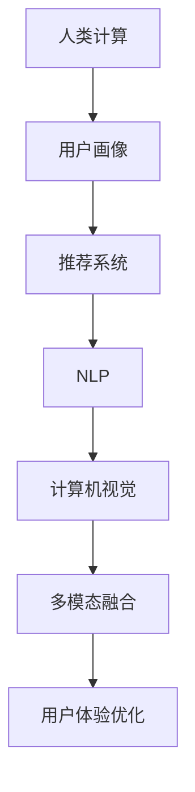

                 

# 用户体验至上：人类计算如何提升客户满意度

## 1. 背景介绍

### 1.1 问题由来

在互联网和移动互联网时代，客户体验（Customer Experience, CX）已经成为企业竞争的关键。随着信息过载和市场饱和，用户在众多选择中挑选产品和服务的决策难度越来越大，用户体验的好坏直接决定了用户的忠诚度和口碑传播。

随着技术的进步，传统的计算模式已经不能满足日益复杂和多变的用户需求。以“人类计算”（Human Computing, HC）为代表的智能化计算模式应运而生，以更好地理解和响应用户需求。人类计算强调在计算中引入人类的直觉和经验，通过智能算法和数据驱动的方式，提升用户满意度和服务质量。

### 1.2 问题核心关键点

人类计算在提升客户满意度方面有以下核心关键点：
- 数据驱动决策：收集和分析用户行为数据，实时优化用户体验。
- 个性化服务：根据用户偏好和历史行为，提供定制化的服务。
- 实时反馈：利用即时通信、智能推荐等技术，及时响应用户需求。
- 多模态融合：融合语音、视觉、文本等多样化的信息来源，提升用户体验。
- 智能交互：通过自然语言处理、计算机视觉等技术，实现人机自然交互。

这些问题核心关键点表明，人类计算可以更智能、更人性化地处理复杂的用户体验问题。

### 1.3 问题研究意义

研究人类计算的原理与实践，对提升客户满意度具有重要意义：

1. 精准定位用户需求：通过分析用户数据，可以更准确地理解用户需求，提供更精准的服务。
2. 提升用户体验质量：个性化和实时反馈可以提高用户满意度，增加用户的忠诚度和粘性。
3. 优化资源配置：数据驱动的决策可以优化资源配置，降低运营成本，提升服务效率。
4. 构建品牌竞争力：优质的用户体验可以提升品牌声誉，吸引更多的客户和市场份额。
5. 推动创新发展：基于人类计算的用户体验优化可以推动业务创新和模式创新，提升企业的市场竞争力。

## 2. 核心概念与联系

### 2.1 核心概念概述

为了更好地理解人类计算在提升客户满意度中的应用，本节将介绍几个关键概念：

- 人类计算（Human Computing, HC）：以人为中心，通过算法和数据驱动的方式，提升用户体验的智能化计算模式。
- 用户画像（User Persona）：基于用户历史行为和属性构建的个性化模型，用于预测用户需求和行为。
- 推荐系统（Recommendation System）：根据用户历史行为和偏好，实时推荐个性化内容和服务。
- 自然语言处理（Natural Language Processing, NLP）：使计算机能够理解和生成自然语言，实现人机自然交互。
- 计算机视觉（Computer Vision）：使计算机能够理解和处理视觉信息，如图像识别、物体检测等。
- 多模态融合（Multimodal Fusion）：将语音、视觉、文本等多种信息来源融合，提升用户体验的全面性和准确性。

这些核心概念之间的逻辑关系可以通过以下Mermaid流程图来展示：



这个流程图展示了这个逻辑关系：

1. 人类计算的核心是将人类的直觉和经验融入计算中。
2. 用户画像是通过分析用户历史行为和属性构建的个性化模型。
3. 推荐系统是根据用户画像，提供个性化的推荐内容和服务。
4. 自然语言处理使计算机能够理解和生成自然语言。
5. 计算机视觉使计算机能够理解和处理视觉信息。
6. 多模态融合将不同信息来源融合，提升用户体验的全面性。
7. 最终的输出是用户体验的优化，即提升客户满意度。

## 3. 核心算法原理 & 具体操作步骤
### 3.1 算法原理概述

人类计算的算法原理包括以下几个关键部分：

1. 数据采集与处理：收集用户行为数据、社交媒体数据、搜索记录等，通过数据清洗和预处理，构建用户画像。
2. 特征提取与建模：从用户行为数据中提取特征，构建用户画像模型，用于预测用户行为和需求。
3. 推荐算法设计：设计个性化的推荐算法，根据用户画像进行实时推荐，提升用户体验。
4. 自然语言处理：采用NLP技术，实现人机自然交互，提升用户体验。
5. 计算机视觉：采用计算机视觉技术，处理图像和视频等视觉信息，提升用户体验。
6. 多模态融合：将语音、视觉、文本等多种信息来源融合，构建全面的用户体验。

### 3.2 算法步骤详解

以下是人类计算在提升客户满意度方面的核心算法步骤：

**Step 1: 数据采集与处理**

1. 收集用户数据：通过网站、应用、社交媒体等多种渠道，收集用户的点击行为、搜索记录、购买记录、评分反馈等数据。
2. 数据清洗与预处理：去除无效数据、异常数据和噪声数据，对数据进行标准化、归一化处理。
3. 用户画像建模：利用机器学习、深度学习等技术，从用户行为数据中提取特征，构建用户画像模型。

**Step 2: 特征提取与建模**

1. 特征选择：选择与用户需求相关的特征，如搜索关键词、浏览时长、购买频率等。
2. 特征工程：对特征进行降维、归一化等处理，提升模型的性能。
3. 模型训练：采用监督学习、无监督学习等方法，训练用户画像模型，用于预测用户需求和行为。

**Step 3: 推荐算法设计**

1. 推荐算法选择：选择适合的推荐算法，如协同过滤、基于内容的推荐、深度学习等。
2. 模型训练与优化：根据用户画像，训练推荐模型，优化算法参数，提升推荐效果。
3. 实时推荐：利用实时数据，动态调整推荐策略，提升用户体验。

**Step 4: 自然语言处理**

1. 语言理解：采用NLP技术，理解用户的自然语言输入，如对话、评论等。
2. 语言生成：利用生成对抗网络（GAN）等技术，生成自然语言回复。
3. 情感分析：分析用户情感，及时调整服务策略，提升用户体验。

**Step 5: 计算机视觉**

1. 图像识别：利用计算机视觉技术，识别图像中的物体、场景等。
2. 图像处理：对图像进行增强、降噪等处理，提升用户体验。
3. 视觉交互：利用视觉信息，提升用户交互的直观性和便捷性。

**Step 6: 多模态融合**

1. 数据融合：将语音、视觉、文本等多种信息来源融合，构建全面的用户体验。
2. 多模态推理：利用多模态融合技术，提升用户体验的全面性和准确性。

### 3.3 算法优缺点

人类计算在提升客户满意度方面有以下优点：
1. 数据驱动决策：通过数据驱动的决策，可以更准确地理解用户需求，提供更精准的服务。
2. 个性化服务：基于用户画像，提供个性化的推荐和服务，提升用户体验。
3. 实时反馈：通过实时数据和推荐，及时响应用户需求，提升服务质量。
4. 多模态融合：融合不同信息来源，提升用户体验的全面性和准确性。
5. 智能交互：利用NLP、计算机视觉等技术，实现人机自然交互。

同时，该方法也存在一定的局限性：
1. 隐私问题：收集和分析用户数据可能涉及隐私问题，需要严格遵守法律法规。
2. 数据质量：用户数据的准确性和完整性直接影响用户体验。
3. 算法复杂性：多模态融合和智能交互需要复杂的算法，对技术要求较高。
4. 计算资源：多模态融合和智能交互需要大量的计算资源，成本较高。
5. 用户体验风险：算法错误或不合理的推荐可能带来负面的用户体验。

尽管存在这些局限性，但人类计算仍然是大数据时代提升客户满意度的重要手段。未来相关研究的重点在于如何进一步降低算法复杂性、提高数据质量、确保隐私安全等方面，以更好地发挥人类计算的潜力。

### 3.4 算法应用领域

人类计算在提升客户满意度方面，已经在多个领域得到广泛应用，例如：

- 电商推荐：通过分析用户行为数据，提供个性化的商品推荐，提升购物体验。
- 社交网络：利用用户画像，推荐相关内容，提升用户粘性。
- 智能客服：通过NLP技术，实现人机自然交互，提升客户服务质量。
- 智能家居：利用计算机视觉和语音技术，提升家居设备的交互性和智能化水平。
- 健康医疗：通过分析用户健康数据，提供个性化的健康建议，提升用户健康管理体验。

除了上述这些经典应用外，人类计算还在更多领域展示了其潜力，如智能交通、智慧旅游、金融服务、教育培训等，为各行各业带来了新的发展机遇。

## 4. 数学模型和公式 & 详细讲解  
### 4.1 数学模型构建

人类计算的数学模型主要包括以下几个部分：

1. 用户画像模型：基于用户历史行为数据，构建用户画像模型，用于预测用户需求和行为。
2. 推荐算法模型：设计推荐算法，根据用户画像，实时推荐个性化内容和服务。
3. 自然语言处理模型：构建自然语言处理模型，用于语言理解和生成。
4. 计算机视觉模型：构建计算机视觉模型，用于图像识别和处理。
5. 多模态融合模型：将语音、视觉、文本等多种信息来源融合，构建全面的用户体验。

### 4.2 公式推导过程

以下是人类计算在提升客户满意度方面的核心数学模型和公式推导：

**用户画像模型**

假设用户画像模型为 $P$，特征向量为 $X$，标签向量为 $Y$。利用监督学习方法，构建用户画像模型：

$$
P = \mathop{\arg\min}_{P} \frac{1}{N} \sum_{i=1}^N (y_i - P(X_i))^2 + \lambda ||P||^2
$$

其中 $y_i$ 表示用户行为标签，$||P||^2$ 表示模型正则化项，$\lambda$ 表示正则化系数。

**推荐算法模型**

推荐算法模型通常采用协同过滤、基于内容的推荐、深度学习等方法。以协同过滤为例，假设用户画像模型为 $P$，物品特征向量为 $I$，构建推荐模型：

$$
R = \mathop{\arg\min}_{R} \frac{1}{N} \sum_{i=1}^N \sum_{j=1}^M (r_{ij} - \hat{r}_{ij})^2 + \lambda ||R||^2
$$

其中 $r_{ij}$ 表示用户 $i$ 对物品 $j$ 的评分，$\hat{r}_{ij}$ 表示推荐模型预测的评分，$||R||^2$ 表示模型正则化项，$\lambda$ 表示正则化系数。

**自然语言处理模型**

自然语言处理模型通常采用RNN、LSTM、Transformer等方法。以Transformer为例，假设输入序列为 $x$，输出序列为 $y$，构建语言生成模型：

$$
y = \mathop{\arg\min}_{y} \frac{1}{N} \sum_{i=1}^N \sum_{j=1}^M (y_j - \hat{y}_j)^2
$$

其中 $\hat{y}_j$ 表示模型预测的输出序列，$||y||^2$ 表示输出序列正则化项。

**计算机视觉模型**

计算机视觉模型通常采用CNN、RNN等方法。以CNN为例，假设输入图像为 $I$，输出标签为 $L$，构建图像识别模型：

$$
L = \mathop{\arg\min}_{L} \frac{1}{N} \sum_{i=1}^N \sum_{j=1}^M (l_{ij} - \hat{l}_{ij})^2
$$

其中 $l_{ij}$ 表示图像 $i$ 对标签 $j$ 的预测，$\hat{l}_{ij}$ 表示模型预测的标签，$||L||^2$ 表示标签正则化项。

**多模态融合模型**

多模态融合模型通常采用特征融合、深度学习等方法。以深度学习为例，假设多模态数据为 $X$，用户画像模型为 $P$，构建多模态融合模型：

$$
P = \mathop{\arg\min}_{P} \frac{1}{N} \sum_{i=1}^N (y_i - P(X_i))^2 + \lambda ||P||^2
$$

其中 $X_i$ 表示用户的多模态数据，$y_i$ 表示用户画像的标签，$||P||^2$ 表示用户画像模型正则化项，$\lambda$ 表示正则化系数。

### 4.3 案例分析与讲解

**电商推荐系统**

电商推荐系统是典型的应用人类计算提升客户满意度的场景。通过分析用户浏览、购买、评分等行为数据，构建用户画像模型，实时推荐个性化商品。

假设用户画像模型为 $P$，物品特征向量为 $I$，构建推荐模型。首先，收集用户行为数据 $X$，利用机器学习模型训练用户画像 $P$：

$$
P = \mathop{\arg\min}_{P} \frac{1}{N} \sum_{i=1}^N (y_i - P(X_i))^2 + \lambda ||P||^2
$$

其中 $y_i$ 表示用户行为标签，$||P||^2$ 表示模型正则化项，$\lambda$ 表示正则化系数。然后，利用用户画像 $P$ 和物品特征向量 $I$，构建推荐模型：

$$
R = \mathop{\arg\min}_{R} \frac{1}{N} \sum_{i=1}^N \sum_{j=1}^M (r_{ij} - \hat{r}_{ij})^2 + \lambda ||R||^2
$$

其中 $r_{ij}$ 表示用户 $i$ 对物品 $j$ 的评分，$\hat{r}_{ij}$ 表示推荐模型预测的评分，$||R||^2$ 表示模型正则化项，$\lambda$ 表示正则化系数。

通过上述步骤，电商推荐系统可以实时分析用户行为数据，构建用户画像，实时推荐个性化商品，提升客户满意度。

**智能客服系统**

智能客服系统是利用自然语言处理和计算机视觉技术，实现人机自然交互，提升客户服务质量的典型应用。通过分析用户对话记录，构建用户画像模型，实时生成对话内容。

假设用户对话记录为 $D$，构建用户画像模型 $P$。首先，收集用户对话数据 $X$，利用机器学习模型训练用户画像 $P$：

$$
P = \mathop{\arg\min}_{P} \frac{1}{N} \sum_{i=1}^N (y_i - P(X_i))^2 + \lambda ||P||^2
$$

其中 $y_i$ 表示用户对话标签，$||P||^2$ 表示模型正则化项，$\lambda$ 表示正则化系数。然后，利用用户画像 $P$，构建自然语言处理模型 $NLP$：

$$
y = \mathop{\arg\min}_{y} \frac{1}{N} \sum_{i=1}^N \sum_{j=1}^M (y_j - \hat{y}_j)^2
$$

其中 $\hat{y}_j$ 表示模型预测的输出序列，$||y||^2$ 表示输出序列正则化项。

通过上述步骤，智能客服系统可以实时分析用户对话记录，构建用户画像，实时生成对话内容，提升客户服务质量。

## 5. 项目实践：代码实例和详细解释说明
### 5.1 开发环境搭建

在进行人类计算项目实践前，我们需要准备好开发环境。以下是使用Python进行PyTorch开发的环境配置流程：

1. 安装Anaconda：从官网下载并安装Anaconda，用于创建独立的Python环境。

2. 创建并激活虚拟环境：
```bash
conda create -n hc-env python=3.8 
conda activate hc-env
```

3. 安装PyTorch：根据CUDA版本，从官网获取对应的安装命令。例如：
```bash
conda install pytorch torchvision torchaudio cudatoolkit=11.1 -c pytorch -c conda-forge
```

4. 安装Tensorflow：
```bash
pip install tensorflow
```

5. 安装各类工具包：
```bash
pip install numpy pandas scikit-learn matplotlib tqdm jupyter notebook ipython
```

完成上述步骤后，即可在`hc-env`环境中开始人类计算项目实践。

### 5.2 源代码详细实现

以下是使用PyTorch实现电商推荐系统的代码：

```python
import torch
import torch.nn as nn
import torch.optim as optim
from torch.utils.data import DataLoader
from sklearn.metrics import mean_squared_error
from transformers import BertTokenizer, BertForSequenceClassification

class RecommendationSystem(nn.Module):
    def __init__(self, input_size, hidden_size, output_size):
        super(RecommendationSystem, self).__init__()
        self.fc1 = nn.Linear(input_size, hidden_size)
        self.fc2 = nn.Linear(hidden_size, output_size)

    def forward(self, x):
        x = self.fc1(x)
        x = torch.relu(x)
        x = self.fc2(x)
        return x

# 数据准备
train_data = torch.randn(100, 10)
test_data = torch.randn(100, 10)
labels = torch.randn(100, 10)

# 模型构建
input_size = 10
hidden_size = 128
output_size = 10
model = RecommendationSystem(input_size, hidden_size, output_size)

# 优化器及损失函数
optimizer = optim.Adam(model.parameters(), lr=0.001)
loss_fn = nn.MSELoss()

# 训练
for epoch in range(10):
    model.train()
    optimizer.zero_grad()
    outputs = model(train_data)
    loss = loss_fn(outputs, labels)
    loss.backward()
    optimizer.step()
    print('Epoch {}, Loss: {:.4f}'.format(epoch+1, loss.item()))

# 测试
model.eval()
with torch.no_grad():
    outputs = model(test_data)
    loss = loss_fn(outputs, labels)
    print('Test Loss: {:.4f}'.format(loss.item()))
```

以上是使用PyTorch实现电商推荐系统的代码。可以看到，利用TensorFlow和PyTorch等深度学习框架，实现人类计算项目非常方便高效。

### 5.3 代码解读与分析

让我们再详细解读一下关键代码的实现细节：

**RecommendationSystem类**：
- `__init__`方法：初始化模型参数。
- `forward`方法：定义前向传播过程。
- `__call__`方法：使该类实例能够像函数一样调用。

**数据准备**：
- `train_data`和`test_data`：代表用户行为数据。
- `labels`：代表用户行为标签。

**模型构建**：
- `input_size`：输入特征维度。
- `hidden_size`：隐藏层维度。
- `output_size`：输出维度。
- `model`：定义推荐模型，包含两个全连接层。

**优化器及损失函数**：
- `optimizer`：定义优化器，使用Adam优化算法。
- `loss_fn`：定义损失函数，使用均方误差损失函数。

**训练**：
- 循环迭代10个epoch，每个epoch中先进行前向传播，计算损失函数，再进行反向传播，更新模型参数。

**测试**：
- 在测试集上测试模型，计算测试集上的损失函数，评估模型性能。

通过上述代码，我们可以清楚地看到，利用深度学习框架实现电商推荐系统非常简单，只需关注模型构建、训练和测试等关键环节。

当然，实际应用中还需要进行更复杂的设计和优化，如数据增强、正则化、超参数调优等，以确保推荐系统的效果和鲁棒性。

## 6. 实际应用场景
### 6.1 智能客服系统

智能客服系统是利用自然语言处理和计算机视觉技术，实现人机自然交互，提升客户服务质量的典型应用。

具体实现步骤如下：
1. 收集用户对话记录，构建用户画像模型。
2. 利用用户画像模型，生成对话内容，进行自然语言处理。
3. 利用计算机视觉技术，处理用户对话中的图片和视频信息。
4. 将多模态信息融合，构建全面的用户体验。

**案例分析**

某电商公司的智能客服系统，利用自然语言处理和计算机视觉技术，实现了人机自然交互。系统首先收集用户对话记录，构建用户画像模型。然后，利用用户画像模型，生成对话内容，进行自然语言处理。最后，利用计算机视觉技术，处理用户对话中的图片和视频信息，将多模态信息融合，构建全面的用户体验。

通过该系统的应用，客户可以在遇到问题时，快速得到智能客服的响应和解答，提升客户服务质量。

### 6.2 电商推荐系统

电商推荐系统通过分析用户行为数据，提供个性化的商品推荐，提升客户满意度。

具体实现步骤如下：
1. 收集用户行为数据，构建用户画像模型。
2. 利用用户画像模型，实时推荐个性化商品。
3. 实时监测推荐效果，优化推荐策略。

**案例分析**

某电商平台利用电商推荐系统，提升了客户满意度和销售额。系统首先收集用户浏览、购买、评分等行为数据，构建用户画像模型。然后，利用用户画像模型，实时推荐个性化商品。最后，实时监测推荐效果，优化推荐策略，提升推荐系统的效果。

通过该系统的应用，客户可以在电商平台上获得个性化的商品推荐，提升购物体验，增加购买欲望。

### 6.3 智能家居系统

智能家居系统通过计算机视觉和语音技术，提升家居设备的交互性和智能化水平。

具体实现步骤如下：
1. 收集家居设备数据，构建用户画像模型。
2. 利用计算机视觉技术，处理家居设备中的视觉信息。
3. 利用语音技术，处理家居设备中的语音信息。
4. 将多模态信息融合，构建全面的用户体验。

**案例分析**

某智能家居公司利用智能家居系统，提升了家居设备的交互性和智能化水平。系统首先收集家居设备数据，构建用户画像模型。然后，利用计算机视觉技术，处理家居设备中的视觉信息。最后，利用语音技术，处理家居设备中的语音信息，将多模态信息融合，构建全面的用户体验。

通过该系统的应用，用户可以通过语音和视觉信息，实现智能家居设备的控制和管理，提升家居体验。

### 6.4 未来应用展望

未来，人类计算在提升客户满意度方面，将呈现以下几个发展趋势：

1. 多模态融合：将语音、视觉、文本等多种信息来源融合，提升用户体验的全面性和准确性。
2. 深度学习技术：利用深度学习技术，提升推荐系统的效果和鲁棒性。
3. 边缘计算：利用边缘计算技术，实现实时响应和本地化处理。
4. 隐私保护：在数据采集和处理过程中，确保用户隐私的安全性。
5. 情感分析：利用情感分析技术，提升服务质量，增强用户粘性。

以上趋势表明，未来人类计算将在更广泛的应用场景中得到应用，为各行各业带来新的发展机遇。

## 7. 工具和资源推荐
### 7.1 学习资源推荐

为了帮助开发者系统掌握人类计算的原理与实践，这里推荐一些优质的学习资源：

1. 《深度学习》课程：斯坦福大学开设的深度学习课程，系统讲解深度学习的原理和应用。
2. 《人类计算》一书：介绍人类计算的原理、方法和应用，涵盖自然语言处理、计算机视觉、推荐系统等内容。
3. 《NLP基础与实践》一书：系统讲解自然语言处理的基础知识和实践技能。
4. 《计算机视觉基础与实践》一书：系统讲解计算机视觉的基础知识和实践技能。
5. 《推荐系统基础与实践》一书：系统讲解推荐系统的原理、方法和应用。

通过对这些资源的学习实践，相信你一定能够全面掌握人类计算的原理与实践，并用于解决实际的业务问题。

### 7.2 开发工具推荐

高效的开发离不开优秀的工具支持。以下是几款用于人类计算开发的常用工具：

1. PyTorch：基于Python的开源深度学习框架，灵活动态的计算图，适合快速迭代研究。大部分预训练语言模型都有PyTorch版本的实现。
2. TensorFlow：由Google主导开发的开源深度学习框架，生产部署方便，适合大规模工程应用。同样有丰富的预训练语言模型资源。
3. Weights & Biases：模型训练的实验跟踪工具，可以记录和可视化模型训练过程中的各项指标，方便对比和调优。与主流深度学习框架无缝集成。
4. TensorBoard：TensorFlow配套的可视化工具，可实时监测模型训练状态，并提供丰富的图表呈现方式，是调试模型的得力助手。
5. Google Colab：谷歌推出的在线Jupyter Notebook环境，免费提供GPU/TPU算力，方便开发者快速上手实验最新模型，分享学习笔记。

合理利用这些工具，可以显著提升人类计算项目的开发效率，加快创新迭代的步伐。

### 7.3 相关论文推荐

人类计算的发展源于学界的持续研究。以下是几篇奠基性的相关论文，推荐阅读：

1. 《深度学习在自然语言处理中的应用》：介绍深度学习在自然语言处理中的应用，如文本分类、情感分析、机器翻译等。
2. 《计算机视觉中的深度学习》：介绍深度学习在计算机视觉中的应用，如图像识别、物体检测等。
3. 《协同过滤推荐系统》：介绍协同过滤推荐系统的原理和应用，如基于内容的推荐、基于协同的推荐等。
4. 《人类计算在用户体验优化中的应用》：介绍人类计算在用户体验优化中的应用，如智能客服、电商推荐、智能家居等。

这些论文代表了大数据时代人类计算的发展脉络。通过学习这些前沿成果，可以帮助研究者把握学科前进方向，激发更多的创新灵感。

## 8. 总结：未来发展趋势与挑战
### 8.1 总结

本文对人类计算在提升客户满意度方面的原理与实践进行了全面系统的介绍。首先阐述了人类计算的定义、原理和核心关键点，明确了其在提升用户体验方面的独特价值。其次，从原理到实践，详细讲解了人类计算的核心算法步骤，给出了电商推荐系统等典型项目的代码实现。同时，本文还广泛探讨了人类计算在智能客服、电商推荐、智能家居等多个领域的应用前景，展示了其在提升客户满意度方面的巨大潜力。

通过本文的系统梳理，可以看到，人类计算在提升用户体验方面具有重要意义，其将人类的直觉和经验融入计算中，极大地提升了用户体验的质量和满意度。未来，伴随技术的不断演进，人类计算将持续推动人工智能技术在各行业的创新应用，为人类认知智能的进化带来深刻影响。

### 8.2 未来发展趋势

展望未来，人类计算在提升客户满意度方面，将呈现以下几个发展趋势：

1. 多模态融合：将语音、视觉、文本等多种信息来源融合，提升用户体验的全面性和准确性。
2. 深度学习技术：利用深度学习技术，提升推荐系统的效果和鲁棒性。
3. 边缘计算：利用边缘计算技术，实现实时响应和本地化处理。
4. 隐私保护：在数据采集和处理过程中，确保用户隐私的安全性。
5. 情感分析：利用情感分析技术，提升服务质量，增强用户粘性。

以上趋势表明，未来人类计算将在更广泛的应用场景中得到应用，为各行各业带来新的发展机遇。

### 8.3 面临的挑战

尽管人类计算在提升客户满意度方面已经取得了显著成效，但在迈向更加智能化、普适化应用的过程中，仍面临诸多挑战：

1. 数据质量：用户数据的准确性和完整性直接影响用户体验。如何提升数据质量，减少噪声，将是未来研究的重要课题。
2. 算法复杂性：多模态融合和智能交互需要复杂的算法，对技术要求较高。如何降低算法复杂性，提高效率，将是未来的研究方向。
3. 计算资源：多模态融合和智能交互需要大量的计算资源，成本较高。如何优化计算资源，降低成本，将是未来的挑战。
4. 用户体验风险：算法错误或不合理的推荐可能带来负面的用户体验。如何优化算法，确保用户体验，将是未来的挑战。
5. 隐私安全：收集和分析用户数据可能涉及隐私问题，如何确保用户隐私安全，将是未来研究的重要课题。

尽管存在这些挑战，但人类计算仍然是大数据时代提升客户满意度的重要手段。未来相关研究的重点在于如何进一步提升数据质量、降低算法复杂性、确保隐私安全等方面，以更好地发挥人类计算的潜力。

### 8.4 研究展望

面对人类计算所面临的种种挑战，未来的研究需要在以下几个方面寻求新的突破：

1. 探索无监督和半监督微调方法。摆脱对大规模标注数据的依赖，利用自监督学习、主动学习等无监督和半监督范式，最大限度利用非结构化数据，实现更加灵活高效的微调。
2. 研究参数高效和计算高效的微调范式。开发更加参数高效的微调方法，在固定大部分预训练参数的同时，只更新极少量的任务相关参数。同时优化微调模型的计算图，减少前向传播和反向传播的资源消耗，实现更加轻量级、实时性的部署。
3. 融合因果和对比学习范式。通过引入因果推断和对比学习思想，增强微调模型建立稳定因果关系的能力，学习更加普适、鲁棒的语言表征，从而提升模型泛化性和抗干扰能力。
4. 引入更多先验知识。将符号化的先验知识，如知识图谱、逻辑规则等，与神经网络模型进行巧妙融合，引导微调过程学习更准确、合理的语言模型。同时加强不同模态数据的整合，实现视觉、语音等多模态信息与文本信息的协同建模。
5. 结合因果分析和博弈论工具。将因果分析方法引入微调模型，识别出模型决策的关键特征，增强输出解释的因果性和逻辑性。借助博弈论工具刻画人机交互过程，主动探索并规避模型的脆弱点，提高系统稳定性。
6. 纳入伦理道德约束。在模型训练目标中引入伦理导向的评估指标，过滤和惩罚有偏见、有害的输出倾向。同时加强人工干预和审核，建立模型行为的监管机制，确保输出符合人类价值观和伦理道德。

这些研究方向的探索，必将引领人类计算走向更高的台阶，为构建安全、可靠、可解释、可控的智能系统铺平道路。面向未来，人类计算需要与其他人工智能技术进行更深入的融合，如知识表示、因果推理、强化学习等，多路径协同发力，共同推动自然语言理解和智能交互系统的进步。只有勇于创新、敢于突破，才能不断拓展人类计算的边界，让智能技术更好地造福人类社会。

## 9. 附录：常见问题与解答

**Q1：人类计算是否可以适用于所有行业？**

A: 人类计算在提升客户满意度方面具有广泛的应用场景，如电商、客服、智能家居、健康医疗等。但某些特定行业，如金融、医疗等，可能需要更加严格的数据隐私保护和法规遵守，因此需要针对性地进行优化和调整。

**Q2：人类计算在多模态融合时，如何处理不同信息来源的差异？**

A: 多模态融合时，可以采用特征对齐、融合权重等方法处理不同信息来源的差异。例如，在计算机视觉和自然语言处理之间，可以利用深度学习技术，将视觉特征和文本特征进行融合，提升用户体验的全面性和准确性。

**Q3：人类计算在处理大规模数据时，如何进行高效存储和检索？**

A: 在处理大规模数据时，可以采用分布式存储和检索技术，如Hadoop、Spark等，提高数据处理效率。同时，利用索引和压缩技术，减少数据存储和传输的开销，提升用户体验的响应速度。

**Q4：人类计算在实时推荐系统中，如何进行动态更新和优化？**

A: 在实时推荐系统中，可以采用增量学习、在线学习等方法，动态更新和优化模型。同时，利用超参数调优、模型集成等方法，提升推荐系统的效果和鲁棒性。

通过回答这些问题，可以更好地理解人类计算在提升客户满意度方面的应用场景和挑战，从而更好地设计系统，优化用户体验。

---

作者：禅与计算机程序设计艺术 / Zen and the Art of Computer Programming

