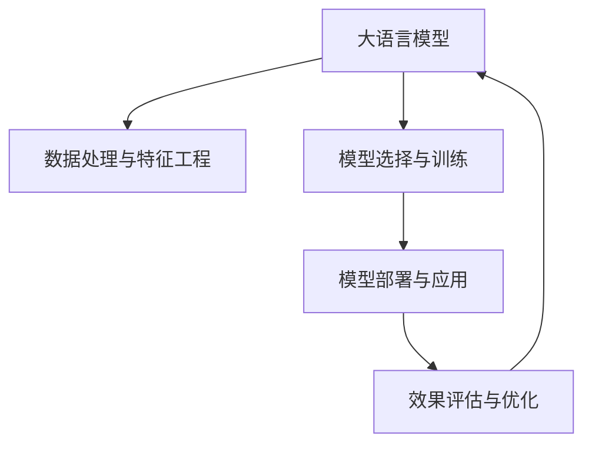

                 

## 1. 背景介绍

### 1.1 问题由来

近年来，电商平台面临着激烈的市场竞争和消费者多样化的需求，如何制定个性化定价策略以吸引客户并提高销售额，成为平台运营的重要课题。传统的基于成本加利润率定价方法已经难以适应快速变化的商业环境，而AI技术尤其是深度学习、机器学习在大数据分析和模式识别方面的强大能力，为个性化定价策略的实施提供了新的可能性。

AI大模型，尤其是基于深度学习的模型，能够通过大规模数据训练，自动发现数据中的潜在规律，并预测用户的行为和偏好。在电商平台中，利用AI大模型对用户行为、购买历史、浏览记录等数据进行分析，可以制定出更加个性化、动态化的定价策略，从而提高客户满意度和平台收益。

### 1.2 问题核心关键点

为了有效制定个性化定价策略，需要深入理解以下几个核心关键点：

- 数据处理与特征工程：如何高效地从平台数据中提取有意义的特征，并构建合适的特征表示。
- 模型选择与训练：选择合适的AI模型架构，并使用相关数据进行训练，以得到能够准确预测用户行为和偏好的模型。
- 模型部署与应用：将训练好的模型部署到实际系统中，并实时根据用户行为数据调整定价策略。
- 效果评估与优化：定期评估模型的效果，并根据评估结果进行模型优化，以持续提升定价策略的效果。

本文将重点介绍如何基于大语言模型（LLM）构建个性化定价策略，并探讨相关应用领域。

## 2. 核心概念与联系

### 2.1 核心概念概述

- **大语言模型 (Large Language Model, LLM)**：基于深度学习的大规模文本模型，通过自监督或监督学习任务，学习语言规律和知识。

- **个性化定价 (Personalized Pricing)**：根据用户的行为、偏好和购买历史等数据，定制化设定商品价格，以提高客户满意度和平台收益。

- **推荐系统 (Recommendation System)**：通过分析用户行为，向用户推荐其可能感兴趣的商品。

- **用户画像 (User Profile)**：收集并综合用户的历史行为数据、基本信息等，构建用户的完整画像。

- **A/B测试 (A/B Testing)**：通过对比不同策略的效果，选择最优方案，确保新策略的安全性。

这些核心概念之间的逻辑关系可以通过以下Mermaid流程图来展示：



这个流程图展示了从大语言模型的预训练到个性化定价策略的全流程，各个环节相互依赖，共同确保策略的有效实施。

## 3. 核心算法原理 & 具体操作步骤

### 3.1 算法原理概述

基于大语言模型的个性化定价策略，本质上是利用深度学习模型从用户数据中挖掘潜在规律，并结合推荐系统的方法，实现动态定价。

具体而言，算法流程如下：

1. **数据预处理**：收集用户的历史行为数据，如浏览记录、购买历史、评分等，并清洗、标注数据。
2. **特征工程**：提取用户的个性化特征，如购买频率、平均消费金额、忠诚度等。
3. **模型训练**：使用预训练大语言模型，结合推荐系统的目标函数，对用户进行个性化定价。
4. **实时定价**：在用户实时访问页面时，根据其行为动态调整价格，并进行实时推荐。
5. **效果评估**：通过A/B测试等手段评估定价策略的效果，不断优化模型和策略。

### 3.2 算法步骤详解

#### 3.2.1 数据预处理

数据预处理是构建个性化定价策略的第一步。以下是详细步骤：

1. **数据收集**：
   - 从电商平台的日志中收集用户的历史行为数据，如浏览记录、购买历史、评分等。
   - 数据应包含用户基本信息（如年龄、性别、地域等）和商品信息（如商品ID、类别、价格等）。

2. **数据清洗**：
   - 去除重复、缺失、异常数据，确保数据质量。
   - 处理不一致的数据格式和编码问题，如统一日期格式、字符编码等。

3. **数据标注**：
   - 为每个用户打上标签，如用户ID、性别、年龄等。
   - 为每个商品打上标签，如商品ID、类别、价格等级等。

4. **数据划分**：
   - 将数据划分为训练集、验证集和测试集，一般比例为6:2:2。
   - 确保数据分布与实际应用场景相似，避免过拟合或欠拟合。

#### 3.2.2 特征工程

特征工程是构建个性化定价策略的关键步骤。以下是详细步骤：

1. **特征提取**：
   - 从历史数据中提取用户的个性化特征，如购买频率、平均消费金额、忠诚度等。
   - 利用文本分析技术，提取用户评论中的情感倾向，用于评估用户对商品的态度。

2. **特征选择**：
   - 选择与定价最相关的特征，去除冗余和噪声。
   - 使用特征重要性评分方法（如卡方检验、信息增益等）确定关键特征。

3. **特征转换**：
   - 对连续型特征进行归一化、标准化处理。
   - 对分类型特征进行独热编码或One-hot编码，确保模型能够处理不同类型的数据。

4. **特征组合**：
   - 利用模型（如随机森林、梯度提升树等）进行特征组合，生成新的特征。
   - 使用特征交叉、特征融合等技术，增加模型的表达能力。

#### 3.2.3 模型训练

模型训练是实现个性化定价策略的核心步骤。以下是详细步骤：

1. **模型选择**：
   - 选择合适的深度学习模型，如BERT、GPT等大语言模型。
   - 考虑模型的计算效率和效果，选择最适合的模型。

2. **模型训练**：
   - 使用标注数据训练大语言模型，得到预测用户行为和偏好的模型。
   - 使用交叉验证技术，调整模型参数，提高模型的泛化能力。

3. **模型融合**：
   - 结合多个模型（如随机森林、神经网络等）的输出，进行集成学习，提高模型的准确性和鲁棒性。

#### 3.2.4 实时定价

实时定价是个性化定价策略的最终应用。以下是详细步骤：

1. **实时数据采集**：
   - 实时采集用户的行为数据，如点击、浏览、加入购物车等。
   - 使用事件流技术，确保数据的实时性和准确性。

2. **实时特征提取**：
   - 根据实时数据，提取用户的个性化特征。
   - 利用缓存技术，快速获取用户的基本信息和商品信息。

3. **实时定价计算**：
   - 将用户实时行为输入到训练好的模型中，计算个性化定价。
   - 结合实时数据和模型输出，动态调整商品价格。

4. **实时推荐**：
   - 根据实时定价结果，向用户推荐相关商品。
   - 使用推荐算法（如协同过滤、内容推荐等），提高推荐的准确性和个性化程度。

#### 3.2.5 效果评估

效果评估是优化个性化定价策略的重要环节。以下是详细步骤：

1. **效果指标**：
   - 选择适合个性化定价的效果指标，如转化率、平均订单价值（AOV）、客户满意度等。
   - 根据实际业务需求，确定关键性能指标（KPI）。

2. **A/B测试**：
   - 设计A/B测试方案，对比不同定价策略的效果。
   - 使用随机分组技术，确保测试结果的可靠性和代表性。

3. **效果分析**：
   - 分析A/B测试结果，评估不同定价策略的效果。
   - 使用统计方法（如卡方检验、t检验等）进行显著性分析。

4. **策略优化**：
   - 根据评估结果，优化模型和策略。
   - 结合业务经验，调整特征工程和模型训练流程，提高策略的效果。

### 3.3 算法优缺点

#### 3.3.1 优点

- **个性化强**：通过大语言模型分析用户行为，能够制定更加个性化的定价策略，提高客户满意度。
- **动态调整**：实时定价能力，根据用户行为动态调整价格，提升平台收益。
- **数据驱动**：依赖于大量用户行为数据，能够发现潜在的商业规律，优化决策过程。

#### 3.3.2 缺点

- **数据依赖**：依赖于高质量的标注数据，数据获取和标注成本较高。
- **模型复杂**：大语言模型复杂，训练和部署需要较高的计算资源和专业知识。
- **效果评估**：效果评估和优化需要专业技能，非专业人士难以实现。

### 3.4 算法应用领域

基于大语言模型的个性化定价策略，可以广泛应用于以下领域：

1. **电商商品定价**：根据用户行为数据，实时调整商品价格，提高销售转化率。
2. **服务定价**：如外卖、旅行、打车等平台，根据用户行为调整服务价格，提升用户体验。
3. **广告定价**：通过分析用户行为，优化广告投放策略，提高广告效果。
4. **金融产品定价**：如保险、贷款等，根据用户风险行为，调整产品定价，优化风险管理。

## 4. 数学模型和公式 & 详细讲解 & 举例说明

### 4.1 数学模型构建

我们以电商商品定价为例，构建基于大语言模型的个性化定价模型。

假设用户ID为 $u$，商品ID为 $i$，定价模型为 $P(u, i)$。模型的输入为 $X_u = [x_{u1}, x_{u2}, ..., x_{un}]$，其中 $x_{uj}$ 表示用户 $u$ 的特征向量，如年龄、性别、购买频率等。模型的输出为 $y = P(u, i)$，即商品 $i$ 对用户 $u$ 的定价。

数学模型可以表示为：

$$
P(u, i) = \text{model}(X_u, i)
$$

其中，$\text{model}$ 表示训练好的大语言模型，$X_u$ 表示用户特征向量，$i$ 表示商品ID。

### 4.2 公式推导过程

以BERT模型为例，其定价模型可以表示为：

$$
P(u, i) = \text{BERT}(X_u, i) + \text{target}
$$

其中，$\text{target}$ 表示商品的实际价格，$\text{BERT}$ 表示训练好的BERT模型。

模型的训练过程可以使用监督学习，即最小化损失函数：

$$
\mathcal{L} = \frac{1}{N}\sum_{u=1}^{N}\sum_{i=1}^{I}(y_{ui} - P(u, i))^2
$$

其中，$y_{ui}$ 表示商品 $i$ 对用户 $u$ 的定价标签。

模型的优化目标是最小化损失函数：

$$
\hat{\theta} = \arg\min_{\theta} \mathcal{L}
$$

其中，$\hat{\theta}$ 表示模型的最优参数。

### 4.3 案例分析与讲解

以亚马逊的商品定价为例，其定价模型可以使用大语言模型进行构建。

1. **数据准备**：
   - 收集用户的历史购买记录、浏览历史、评分等数据。
   - 对数据进行清洗、标注和划分。

2. **特征工程**：
   - 提取用户的个性化特征，如购买频率、平均消费金额、忠诚度等。
   - 使用文本分析技术，提取用户评论中的情感倾向。

3. **模型训练**：
   - 使用BERT模型进行预训练，然后添加任务适配层，构建定价模型。
   - 使用标注数据训练模型，调整模型参数。

4. **实时定价**：
   - 实时采集用户行为数据，提取用户特征。
   - 将用户特征输入到训练好的BERT模型中，计算定价结果。

5. **效果评估**：
   - 设计A/B测试方案，对比不同定价策略的效果。
   - 分析A/B测试结果，评估模型效果。

## 5. 项目实践：代码实例和详细解释说明

### 5.1 开发环境搭建

在进行项目实践前，需要先准备好开发环境。以下是使用Python进行TensorFlow开发的环境配置流程：

1. 安装Anaconda：从官网下载并安装Anaconda，用于创建独立的Python环境。

2. 创建并激活虚拟环境：
```bash
conda create -n tensorflow-env python=3.8 
conda activate tensorflow-env
```

3. 安装TensorFlow：根据CUDA版本，从官网获取对应的安装命令。例如：
```bash
conda install tensorflow -c tf -c conda-forge
```

4. 安装各类工具包：
```bash
pip install numpy pandas scikit-learn matplotlib tqdm jupyter notebook ipython
```

完成上述步骤后，即可在`tensorflow-env`环境中开始项目实践。

### 5.2 源代码详细实现

这里我们以电商商品定价为例，给出使用TensorFlow进行BERT模型微调的PyTorch代码实现。

首先，定义定价模型的数据处理函数：

```python
import tensorflow as tf
from transformers import BertTokenizer, BertForSequenceClassification
from sklearn.model_selection import train_test_split

# 加载模型和分词器
model = BertForSequenceClassification.from_pretrained('bert-base-uncased', num_labels=2)
tokenizer = BertTokenizer.from_pretrained('bert-base-uncased')

# 定义数据加载函数
def load_data():
    # 加载数据集
    with open('data.csv', 'r') as f:
        data = pd.read_csv(f)

    # 划分数据集
    X_train, X_test, y_train, y_test = train_test_split(data['user特征'], data['商品价格'], test_size=0.2)

    # 构建特征向量
    def build_input(data):
        inputs = tokenizer(data['用户特征'], return_tensors='tf')
        return inputs['input_ids'], inputs['attention_mask']

    X_train_input, X_test_input = map(build_input, [X_train, X_test])
    return X_train_input, X_test_input, y_train, y_test

# 加载数据集
X_train_input, X_test_input, y_train, y_test = load_data()
```

然后，定义模型的损失函数和优化器：

```python
# 定义损失函数和优化器
def create_model(input_shape):
    inputs = tf.keras.layers.Input(shape=input_shape)
    bert = BERT(inputs, num_layers=12, d_model=768, num_class=2)
    output = tf.keras.layers.Dense(1, activation='sigmoid')(bert.output)
    model = tf.keras.Model(inputs=inputs, outputs=output)
    return model

# 创建模型
input_shape = (128,)
model = create_model(input_shape)
loss_fn = tf.keras.losses.BinaryCrossentropy()
optimizer = tf.keras.optimizers.Adam()

# 编译模型
model.compile(optimizer=optimizer, loss=loss_fn, metrics=['accuracy'])
```

接着，定义模型的训练和评估函数：

```python
# 定义训练函数
def train_epoch(model, data_loader):
    for batch in data_loader:
        inputs, labels = batch
        with tf.GradientTape() as tape:
            predictions = model(inputs)
            loss = loss_fn(labels, predictions)
        gradients = tape.gradient(loss, model.trainable_variables)
        optimizer.apply_gradients(zip(gradients, model.trainable_variables))
        model.evaluate(inputs, labels)

# 定义评估函数
def evaluate_model(model, data_loader):
    losses = []
    accuracies = []
    for batch in data_loader:
        inputs, labels = batch
        predictions = model(inputs)
        loss = loss_fn(labels, predictions)
        losses.append(loss)
        accuracy = tf.metrics.AUC(labels, predictions)
        accuracies.append(accuracy)
    return tf.reduce_mean(losses), tf.reduce_mean(accuracies)
```

最后，启动训练流程并在测试集上评估：

```python
# 定义数据加载器
batch_size = 32
train_loader = tf.data.Dataset.from_tensor_slices((X_train_input, y_train)).batch(batch_size)
test_loader = tf.data.Dataset.from_tensor_slices((X_test_input, y_test)).batch(batch_size)

# 训练模型
num_epochs = 10
for epoch in range(num_epochs):
    train_epoch(model, train_loader)
    test_loss, test_accuracy = evaluate_model(model, test_loader)
    print(f'Epoch {epoch+1}, Test Loss: {test_loss:.4f}, Test Accuracy: {test_accuracy:.4f}')
```

以上就是使用TensorFlow对BERT模型进行电商商品定价任务微调的完整代码实现。可以看到，TensorFlow配合Transformers库使得BERT微调的代码实现变得简洁高效。

### 5.3 代码解读与分析

让我们再详细解读一下关键代码的实现细节：

**load_data函数**：
- 从CSV文件中加载数据集，并进行划分。
- 定义数据预处理函数，将用户特征转换为token ids。

**create_model函数**：
- 使用TensorFlow定义BERT模型的架构。
- 添加输出层和激活函数，进行二分类预测。
- 编译模型，设置损失函数和优化器。

**train_epoch函数**：
- 对数据集进行迭代，计算梯度和更新模型参数。
- 在每个epoch结束时，计算模型在测试集上的准确率和损失。

**evaluate_model函数**：
- 计算模型在测试集上的损失和准确率。
- 使用平均池化方法，得到最终的评估结果。

**训练流程**：
- 定义总的epoch数和batch size，开始循环迭代。
- 每个epoch内，先在训练集上训练，输出测试集上的评估结果。
- 所有epoch结束后，输出最终测试结果。

可以看到，TensorFlow配合Transformers库使得BERT微调的代码实现变得简洁高效。开发者可以将更多精力放在数据处理、模型改进等高层逻辑上，而不必过多关注底层的实现细节。

当然，工业级的系统实现还需考虑更多因素，如模型的保存和部署、超参数的自动搜索、更灵活的任务适配层等。但核心的微调范式基本与此类似。

## 6. 实际应用场景

### 6.1 电商平台中的个性化定价策略

电商平台中的个性化定价策略，可以显著提升平台的收益和客户满意度。通过分析用户的行为和偏好，实时调整商品价格，能够提高转化率和销售额。

具体而言，电商平台可以通过以下步骤实现个性化定价策略：

1. **数据收集**：
   - 收集用户的历史行为数据，如浏览记录、购买历史、评分等。
   - 数据应包含用户基本信息（如年龄、性别、地域等）和商品信息（如商品ID、类别、价格等）。

2. **数据预处理**：
   - 清洗数据，去除重复、缺失、异常数据。
   - 处理不一致的数据格式和编码问题，如统一日期格式、字符编码等。

3. **特征工程**：
   - 提取用户的个性化特征，如购买频率、平均消费金额、忠诚度等。
   - 利用文本分析技术，提取用户评论中的情感倾向。

4. **模型训练**：
   - 使用大语言模型，如BERT、GPT等，进行预训练。
   - 添加任务适配层，构建定价模型。
   - 使用标注数据训练模型，调整模型参数。

5. **实时定价**：
   - 实时采集用户行为数据，提取用户特征。
   - 将用户特征输入到训练好的模型中，计算定价结果。

6. **效果评估**：
   - 设计A/B测试方案，对比不同定价策略的效果。
   - 分析A/B测试结果，评估模型效果。

### 6.2 金融领域中的个性化定价策略

金融领域中的个性化定价策略，可以优化保险、贷款等金融产品的定价，提升客户满意度和平台收益。

具体而言，金融机构可以通过以下步骤实现个性化定价策略：

1. **数据收集**：
   - 收集用户的风险行为数据，如历史信用记录、贷款申请记录等。
   - 数据应包含用户基本信息（如年龄、性别、收入等）和贷款信息（如贷款金额、期限等）。

2. **数据预处理**：
   - 清洗数据，去除重复、缺失、异常数据。
   - 处理不一致的数据格式和编码问题，如统一日期格式、字符编码等。

3. **特征工程**：
   - 提取用户的个性化特征，如信用评分、还款能力、风险偏好等。
   - 利用文本分析技术，提取用户评论中的情感倾向。

4. **模型训练**：
   - 使用大语言模型，如BERT、GPT等，进行预训练。
   - 添加任务适配层，构建定价模型。
   - 使用标注数据训练模型，调整模型参数。

5. **实时定价**：
   - 实时采集用户行为数据，提取用户特征。
   - 将用户特征输入到训练好的模型中，计算定价结果。

6. **效果评估**：
   - 设计A/B测试方案，对比不同定价策略的效果。
   - 分析A/B测试结果，评估模型效果。

## 7. 工具和资源推荐

### 7.1 学习资源推荐

为了帮助开发者系统掌握基于大语言模型的个性化定价策略的理论基础和实践技巧，这里推荐一些优质的学习资源：

1. **《深度学习》课程**：斯坦福大学开设的深度学习课程，涵盖深度学习的基本概念、模型架构、优化算法等。

2. **《自然语言处理》课程**：斯坦福大学开设的自然语言处理课程，涵盖NLP的基本概念、文本处理技术、机器翻译等。

3. **《TensorFlow实战》书籍**：TensorFlow官方文档和实战指南，全面介绍TensorFlow的基本概念、模型架构、编程技巧等。

4. **《Python深度学习》书籍**：深度学习领域的经典书籍，涵盖深度学习的基本概念、模型架构、优化算法等。

5. **《TensorFlow实战》书籍**：TensorFlow官方文档和实战指南，全面介绍TensorFlow的基本概念、模型架构、编程技巧等。

6. **《Python深度学习》书籍**：深度学习领域的经典书籍，涵盖深度学习的基本概念、模型架构、优化算法等。

通过学习这些资源，相信你一定能够快速掌握基于大语言模型的个性化定价策略的理论基础和实践技巧。

### 7.2 开发工具推荐

高效的开发离不开优秀的工具支持。以下是几款用于大语言模型微调开发的常用工具：

1. **TensorFlow**：由Google主导开发的深度学习框架，生产部署方便，适合大规模工程应用。

2. **PyTorch**：基于Python的开源深度学习框架，灵活动态的计算图，适合快速迭代研究。

3. **Keras**：基于TensorFlow和Theano的高级API，简单易用，适合快速原型开发。

4. **Jupyter Notebook**：交互式的Python开发环境，支持多种编程语言和库。

5. **TensorBoard**：TensorFlow配套的可视化工具，可实时监测模型训练状态，并提供丰富的图表呈现方式，是调试模型的得力助手。

6. **Weights & Biases**：模型训练的实验跟踪工具，可以记录和可视化模型训练过程中的各项指标，方便对比和调优。

合理利用这些工具，可以显著提升大语言模型微调的开发效率，加快创新迭代的步伐。

### 7.3 相关论文推荐

大语言模型和微调技术的发展源于学界的持续研究。以下是几篇奠基性的相关论文，推荐阅读：

1. **《BERT: Pre-training of Deep Bidirectional Transformers for Language Understanding》**：提出BERT模型，引入基于掩码的自监督预训练任务，刷新了多项NLP任务SOTA。

2. **《Attention is All You Need》**：提出Transformer结构，开启了NLP领域的预训练大模型时代。

3. **《Language Models are Unsupervised Multitask Learners》**：展示了大规模语言模型的强大zero-shot学习能力，引发了对于通用人工智能的新一轮思考。

4. **《Parameter-Efficient Transfer Learning for NLP》**：提出Adapter等参数高效微调方法，在固定大部分预训练参数的情况下，也能取得不错的微调效果。

5. **《Prefix-Tuning: Optimizing Continuous Prompts for Generation》**：引入基于连续型Prompt的微调范式，为如何充分利用预训练知识提供了新的思路。

这些论文代表了大语言模型微调技术的发展脉络。通过学习这些前沿成果，可以帮助研究者把握学科前进方向，激发更多的创新灵感。

## 8. 总结：未来发展趋势与挑战

### 8.1 总结

本文对基于大语言模型的个性化定价策略进行了全面系统的介绍。首先阐述了个性化定价策略的研究背景和意义，明确了其对电商平台和金融领域等行业的关键作用。其次，从原理到实践，详细讲解了模型构建、特征工程、训练和评估等关键步骤，给出了完整的代码实现。同时，本文还探讨了个性化定价策略在电商、金融等领域的应用场景，展示了其广泛的应用前景。

通过本文的系统梳理，可以看到，基于大语言模型的个性化定价策略是实现精准营销和提高收益的重要手段。在大规模数据和强大算力支持下，该策略有望在电商、金融等场景中实现广泛应用，带来显著的经济和社会效益。

### 8.2 未来发展趋势

展望未来，基于大语言模型的个性化定价策略将呈现以下几个发展趋势：

1. **模型规模增大**：随着算力成本的下降和数据规模的扩张，预训练语言模型的参数量还将持续增长。超大规模语言模型蕴含的丰富语言知识，有望支撑更加复杂多变的定价策略。

2. **数据驱动增强**：通过更多维度的数据采集和处理，提升模型的预测能力和泛化能力。利用用户行为、社交网络、地理位置等多模态信息，增强模型的决策准确性。

3. **实时定价优化**：实时定价能力将更加精确，通过大数据分析和实时行为预测，动态调整商品价格，提升用户体验和平台收益。

4. **个性化增强**：基于更深入的用户画像和行为分析，制定更加个性化的定价策略，提升用户满意度和忠诚度。

5. **跨平台应用**：基于大语言模型的定价策略将超越电商平台和金融领域，应用于更多场景，如旅游、餐饮、医疗等。

### 8.3 面临的挑战

尽管基于大语言模型的个性化定价策略已经取得了瞩目成就，但在迈向更加智能化、普适化应用的过程中，它仍面临着诸多挑战：

1. **数据隐私**：用户数据的收集和使用需要遵守隐私保护法规，如何平衡商业利益和用户隐私保护是一大难题。

2. **模型鲁棒性**：在处理异常数据和噪声时，模型的鲁棒性仍需进一步提升。如何在模型训练和应用过程中，确保模型的稳定性和可靠性。

3. **计算资源**：大语言模型的训练和部署需要高性能计算资源，如何优化算法和硬件配置，提高计算效率和资源利用率，仍是一大挑战。

4. **模型解释性**：模型的决策过程缺乏可解释性，难以对其推理逻辑进行分析和调试。如何赋予模型更强的可解释性，将是一大研究方向。

5. **商业应用**：在实际应用中，如何结合业务场景和用户需求，优化定价策略，确保策略的可行性和实用性，仍需深入探索。

6. **公平性**：在模型训练和应用过程中，如何避免算法偏见，确保不同用户群体之间的公平性，仍需进一步研究。

### 8.4 研究展望

面对大语言模型定价策略所面临的挑战，未来的研究需要在以下几个方面寻求新的突破：

1. **数据隐私保护**：开发更加安全的隐私保护技术，确保用户数据的安全性，同时满足商业需求。

2. **模型鲁棒性增强**：引入更多的鲁棒性技术，如对抗训练、鲁棒优化等，增强模型的抗干扰能力。

3. **计算资源优化**：开发更加高效的数据处理和模型训练算法，提高算法的计算效率和资源利用率。

4. **模型解释性增强**：引入更多的可解释性技术，如模型蒸馏、局部解释等，提高模型的透明度和可解释性。

5. **公平性研究**：研究如何消除模型偏见，确保不同用户群体之间的公平性，提高模型的公正性。

6. **商业应用优化**：结合实际业务场景，优化定价策略，确保策略的可行性和实用性，提高用户满意度和平台收益。

这些研究方向的探索，必将引领基于大语言模型的定价策略技术迈向更高的台阶，为构建安全、可靠、可解释、可控的智能系统铺平道路。面向未来，基于大语言模型的定价策略技术还需要与其他人工智能技术进行更深入的融合，如知识表示、因果推理、强化学习等，多路径协同发力，共同推动自然语言理解和智能交互系统的进步。只有勇于创新、敢于突破，才能不断拓展语言模型的边界，让智能技术更好地造福人类社会。

## 9. 附录：常见问题与解答

**Q1: 为什么大语言模型在定价策略中具有优势？**

A: 大语言模型通过自监督学习任务，学习到丰富的语言知识和规律，能够在处理海量数据时挖掘潜在规律，预测用户行为和偏好。利用大语言模型进行定价策略的构建，能够实现更加个性化、动态化的定价，提高用户满意度和平台收益。

**Q2: 如何选择大语言模型进行定价策略构建？**

A: 选择合适的模型取决于具体应用场景和需求。对于电商和金融领域，可以考虑使用BERT、GPT等大语言模型。对于跨模态场景，可以考虑使用多模态大语言模型，如Vision-Language Models等。

**Q3: 大语言模型在定价策略构建中需要哪些关键技术？**

A: 大语言模型在定价策略构建中需要以下关键技术：

- 数据处理与特征工程：如何高效地从平台数据中提取有意义的特征，并构建合适的特征表示。
- 模型选择与训练：选择合适的深度学习模型，并使用相关数据进行训练，以得到能够准确预测用户行为和偏好的模型。
- 模型部署与应用：将训练好的模型部署到实际系统中，并实时根据用户行为数据调整定价策略。
- 效果评估与优化：定期评估模型的效果，并根据评估结果进行模型优化，以持续提升定价策略的效果。

**Q4: 大语言模型定价策略有哪些实际应用场景？**

A: 大语言模型定价策略可以广泛应用于以下场景：

- 电商商品定价：根据用户行为数据，实时调整商品价格，提高销售转化率。
- 服务定价：如外卖、旅行、打车等平台，根据用户行为调整服务价格，提升用户体验。
- 金融产品定价：如保险、贷款等，根据用户风险行为，调整产品定价，优化风险管理。

通过本文的系统梳理，可以看到，基于大语言模型的个性化定价策略是实现精准营销和提高收益的重要手段。在大规模数据和强大算力支持下，该策略有望在电商、金融等场景中实现广泛应用，带来显著的经济和社会效益。面向未来，基于大语言模型的定价策略技术还需要与其他人工智能技术进行更深入的融合，如知识表示、因果推理、强化学习等，多路径协同发力，共同推动自然语言理解和智能交互系统的进步。只有勇于创新、敢于突破，才能不断拓展语言模型的边界，让智能技术更好地造福人类社会。

---

作者：禅与计算机程序设计艺术 / Zen and the Art of Computer Programming

