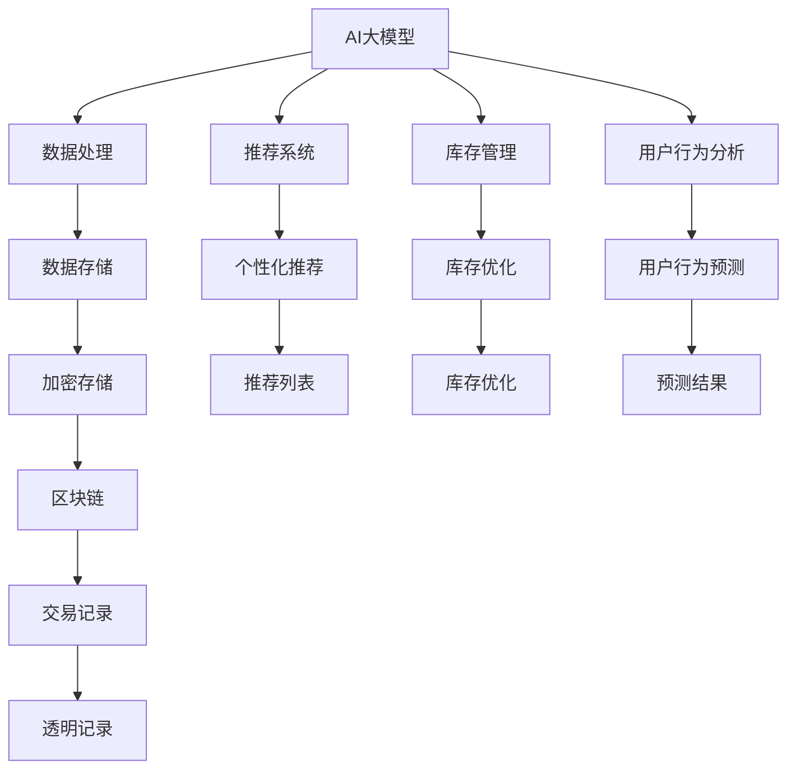

                 

# 电商平台中的AI大模型与区块链技术结合

在当今数字化时代，电商平台已成为消费者购物的重要渠道，其运行的效率和安全性直接影响用户体验和商家收益。随着人工智能(AI)和大数据技术的飞速发展，电商平台正在逐步应用AI技术来提升运营效率和用户体验。然而，数据隐私和交易安全依然是电商平台必须面对的重要挑战。区块链技术作为一种新兴的分布式账本技术，能够保证数据的安全性和不可篡改性，提供了一种全新的解决方案。本文将探讨在电商平台中结合AI大模型与区块链技术，构建高效、安全的电商平台系统。

## 1. 背景介绍

### 1.1 问题由来

近年来，电商平台正面临着运营效率低下、用户体验不佳、数据安全问题等挑战。这些问题需要通过技术创新来解决。随着AI和大数据技术的成熟，AI大模型在电商平台中的应用逐渐增多，显著提升了平台的用户体验和运营效率。然而，数据隐私和交易安全问题依然困扰着电商平台。传统的中心化数据管理方式存在单点故障、数据篡改风险等问题，难以满足现代电商平台的高度需求。

### 1.2 问题核心关键点

- AI大模型的应用：通过AI大模型对用户行为进行分析和预测，推荐个性化商品，优化库存管理，提升用户体验。
- 区块链技术的应用：通过区块链技术对电商平台的数据进行加密存储，确保数据隐私和交易安全。
- 数据隐私保护：通过AI大模型对用户数据进行匿名化和隐私保护，确保用户隐私不被泄露。
- 交易安全保障：通过区块链技术对电商平台上的交易进行透明、不可篡改的记录，保障交易安全。
- 多方协作：通过AI大模型和区块链技术的结合，构建多方协作的电商平台，提升平台运行效率和用户满意度。

## 2. 核心概念与联系

### 2.1 核心概念概述

为更好地理解AI大模型与区块链技术结合在电商平台中的应用，本节将介绍几个关键概念：

- AI大模型：指通过大规模数据训练得到的深度神经网络模型，具备强大的数据分析和预测能力。
- 区块链技术：指一种去中心化的分布式账本技术，通过加密算法保证数据的不可篡改性和透明性。
- 数据隐私保护：指对用户数据进行匿名化、加密等处理，确保用户隐私不被泄露。
- 交易安全保障：指对电商平台的交易过程进行透明、不可篡改的记录，保障交易安全。
- 多方协作：指通过AI大模型和区块链技术的结合，构建多方协作的电商平台，提升平台运行效率和用户满意度。

这些核心概念之间的逻辑关系可以通过以下Mermaid流程图来展示：



这个流程图展示了大模型和区块链技术在电商平台中的关键应用场景和逻辑关系：

1. AI大模型对用户数据进行分析和预测，输出个性化推荐、库存优化等结果。
2. 区块链技术对数据进行加密存储，确保数据隐私和交易安全。
3. 通过多方协作，AI大模型和区块链技术结合提升电商平台的运行效率和用户满意度。

## 3. 核心算法原理 & 具体操作步骤
### 3.1 算法原理概述

AI大模型与区块链技术的结合，本质上是将AI的预测能力和区块链的分布式账本特性相结合，构建一个高效、安全的电商平台系统。其核心思想是：通过AI大模型对用户行为进行分析和预测，生成推荐结果；通过区块链技术对推荐结果进行加密存储，确保数据隐私和交易安全。

形式化地，假设电商平台上的用户数据集为 $D=\{(x_i,y_i)\}_{i=1}^N$，其中 $x_i$ 为用户行为数据，$y_i$ 为用户购买决策。定义用户行为预测模型为 $M_{\theta}:\mathcal{X} \rightarrow \mathcal{Y}$，其中 $\mathcal{X}$ 为用户行为特征空间，$\mathcal{Y}$ 为用户购买决策空间，$\theta$ 为模型参数。在区块链技术下，推荐结果 $r$ 被哈希并存储在区块链上，不可篡改。

### 3.2 算法步骤详解

基于AI大模型与区块链技术结合的电商平台系统构建，一般包括以下几个关键步骤：

**Step 1: 准备AI大模型和区块链环境**
- 选择合适的AI大模型，如BERT、GPT等，作为推荐系统的基础。
- 准备区块链平台，如Hyperledger Fabric、Ethereum等，搭建分布式账本环境。

**Step 2: 用户行为数据分析**
- 对用户行为数据进行特征工程，提取有用特征。
- 使用AI大模型对用户行为进行分析和预测，生成推荐结果。

**Step 3: 数据加密存储**
- 将推荐结果进行哈希处理，生成不可篡改的推荐记录。
- 将推荐记录写入区块链，进行透明、不可篡改的存储。

**Step 4: 交易记录透明记录**
- 在用户进行购买操作时，将购买信息写入区块链，形成透明、不可篡改的交易记录。

**Step 5: 个性化推荐展示**
- 在用户浏览商品页面时，根据区块链上存储的推荐记录，动态展示个性化推荐内容。

**Step 6: 监控与维护**
- 定期监控区块链上的数据，确保数据存储的安全性和交易记录的完整性。
- 根据电商平台需求，不断优化AI大模型和区块链技术的应用。

### 3.3 算法优缺点

AI大模型与区块链技术结合的电商平台系统具有以下优点：
1. 数据隐私保护：通过区块链技术，对用户数据进行加密存储，确保数据隐私不被泄露。
2. 交易安全保障：通过区块链技术，对电商平台上的交易进行透明、不可篡改的记录，保障交易安全。
3. 个性化推荐：通过AI大模型，对用户行为进行分析和预测，生成个性化推荐内容，提升用户体验。
4. 数据透明性：通过区块链技术，所有交易和推荐记录都透明、不可篡改，增强用户信任。

同时，该方法也存在一定的局限性：
1. 计算资源消耗大：AI大模型的训练和推理需要大量计算资源，区块链的分布式账本也需要高性能的硬件支持。
2. 系统复杂度高：AI大模型和区块链技术的结合，增加了系统的复杂度，需要更多的技术支持和维护成本。
3. 用户教育成本高：需要用户对区块链技术和AI大模型的基本理解，才能充分利用其优势。
4. 扩展性差：由于区块链技术的限制，系统扩展性较差，难以应对大规模用户和高并发交易。

尽管存在这些局限性，但就目前而言，AI大模型与区块链技术的结合在电商平台中的应用，已经展现出巨大的潜力，成为电商平台领域的重要发展方向。未来相关研究的重点在于如何进一步降低系统复杂度，提高扩展性和用户体验。

### 3.4 算法应用领域

AI大模型与区块链技术结合的电商平台系统，已经在多个领域得到应用，例如：

- 个性化推荐系统：通过AI大模型对用户行为进行分析和预测，生成个性化推荐内容。
- 库存管理系统：通过AI大模型对库存进行优化管理，提升库存周转率。
- 用户行为分析：通过AI大模型对用户行为进行深入分析，了解用户需求和行为规律。
- 交易安全保障：通过区块链技术对电商平台上的交易进行透明、不可篡改的记录，保障交易安全。
- 数据隐私保护：通过区块链技术对用户数据进行加密存储，确保数据隐私不被泄露。

除了上述这些经典应用外，AI大模型与区块链技术的结合还在不断拓展，如供应链管理、物流配送、社交网络等，为电商平台的创新发展提供了新的可能。

## 4. 数学模型和公式 & 详细讲解 & 举例说明

### 4.1 数学模型构建

本节将使用数学语言对AI大模型与区块链技术结合的电商平台系统进行更加严格的刻画。

记电商平台上的用户数据集为 $D=\{(x_i,y_i)\}_{i=1}^N$，其中 $x_i$ 为用户行为数据，$y_i$ 为用户购买决策。定义用户行为预测模型为 $M_{\theta}:\mathcal{X} \rightarrow \mathcal{Y}$，其中 $\mathcal{X}$ 为用户行为特征空间，$\mathcal{Y}$ 为用户购买决策空间，$\theta$ 为模型参数。在区块链技术下，推荐结果 $r$ 被哈希并存储在区块链上，不可篡改。

### 4.2 公式推导过程

以下我们以推荐系统为例，推导AI大模型与区块链技术结合的推荐过程。

假设推荐系统基于用户行为数据 $x_i$，生成推荐结果 $r_i$。则推荐结果 $r_i$ 可以表示为：

$$
r_i = M_{\theta}(x_i)
$$

其中 $M_{\theta}(\cdot)$ 为AI大模型的预测函数，$\theta$ 为模型参数。

为了将推荐结果存储在区块链上，我们需要对 $r_i$ 进行哈希处理，生成不可篡改的推荐记录 $H(r_i)$。设哈希函数为 $H:\mathcal{R} \rightarrow \mathcal{H}$，其中 $\mathcal{R}$ 为推荐结果空间，$\mathcal{H}$ 为哈希结果空间。则推荐记录 $H(r_i)$ 可以表示为：

$$
H(r_i) = H(M_{\theta}(x_i))
$$

将推荐记录 $H(r_i)$ 写入区块链，进行透明、不可篡改的存储。在用户进行购买操作时，将购买信息 $p_i$ 写入区块链，形成透明、不可篡改的交易记录 $T_i$。设交易记录函数为 $T:\mathcal{P} \rightarrow \mathcal{T}$，其中 $\mathcal{P}$ 为用户购买信息空间，$\mathcal{T}$ 为用户交易记录空间。则交易记录 $T_i$ 可以表示为：

$$
T_i = T(p_i)
$$

最终，用户在电商平台上进行浏览、推荐、购买等操作时，AI大模型和区块链技术共同作用，提升用户体验和交易安全。

### 4.3 案例分析与讲解

假设电商平台上的用户数据集 $D$ 包含100个用户行为数据和对应的购买决策。我们选择BERT模型作为用户行为预测模型，定义用户行为特征空间 $\mathcal{X}$ 为用户在电商平台上浏览商品、加入购物车、完成支付等行为数据。用户购买决策空间 $\mathcal{Y}$ 为用户的购买决策，即购买或不购买某商品。

通过AI大模型BERT对用户行为数据 $x_i$ 进行分析和预测，生成推荐结果 $r_i$。具体步骤如下：

1. 对用户行为数据 $x_i$ 进行预处理，提取有用特征。
2. 使用BERT模型对 $x_i$ 进行编码，输出预测结果 $r_i$。
3. 对 $r_i$ 进行哈希处理，生成推荐记录 $H(r_i)$。
4. 将推荐记录 $H(r_i)$ 写入区块链，进行透明、不可篡改的存储。

假设用户 $i$ 购买了商品 $j$，电商平台将购买信息 $p_i$ 写入区块链，形成交易记录 $T_i$。具体步骤如下：

1. 将购买信息 $p_i$ 进行预处理，提取有用信息。
2. 使用区块链技术对 $p_i$ 进行透明、不可篡改的存储。
3. 在用户浏览商品页面时，根据区块链上存储的推荐记录 $H(r_i)$，动态展示个性化推荐内容。
4. 定期监控区块链上的数据，确保数据存储的安全性和交易记录的完整性。

通过以上步骤，AI大模型与区块链技术结合的电商平台系统，可以有效地提升用户体验和交易安全。

## 5. 项目实践：代码实例和详细解释说明
### 5.1 开发环境搭建

在进行AI大模型与区块链技术结合的电商平台系统开发前，我们需要准备好开发环境。以下是使用Python进行PyTorch和Hyperledger Fabric开发的环境配置流程：

1. 安装Anaconda：从官网下载并安装Anaconda，用于创建独立的Python环境。

2. 创建并激活虚拟环境：
```bash
conda create -n my_env python=3.8
conda activate my_env
```

3. 安装PyTorch：根据CUDA版本，从官网获取对应的安装命令。例如：
```bash
conda install pytorch torchvision torchaudio cudatoolkit=11.1 -c pytorch -c conda-forge
```

4. 安装Hyperledger Fabric：
```bash
npm install -g hyperledger-fabric-cli
```

5. 安装各类工具包：
```bash
pip install numpy pandas scikit-learn matplotlib tqdm jupyter notebook ipython
```

完成上述步骤后，即可在`my_env`环境中开始开发。

### 5.2 源代码详细实现

下面我们以推荐系统为例，给出使用PyTorch和Hyperledger Fabric进行推荐系统微调的PyTorch代码实现。

首先，定义推荐系统的数据处理函数：

```python
from transformers import BertTokenizer, BertForSequenceClassification
from hfc.fabric import FabricConnection

# 初始化Fabric连接
fabric_connection = FabricConnection()
channel_id = 'myChannel'
org_name = 'myOrg'

# 初始化Fabric区块链实例
blockchain = fabric_connection.get_channel(channel_id)
blockchain.connect({'msp_id': org_name})
```

然后，定义模型和优化器：

```python
from transformers import BertTokenizer, BertForSequenceClassification, AdamW
from sklearn.metrics import accuracy_score

model = BertForSequenceClassification.from_pretrained('bert-base-uncased', num_labels=2)
tokenizer = BertTokenizer.from_pretrained('bert-base-uncased')
optimizer = AdamW(model.parameters(), lr=2e-5)
```

接着，定义训练和评估函数：

```python
def train_model(model, data, batch_size):
    train_dataset = data[:int(len(data)*0.8)]
    val_dataset = data[int(len(data)*0.8):]
    
    train_loader = DataLoader(train_dataset, batch_size=batch_size, shuffle=True)
    val_loader = DataLoader(val_dataset, batch_size=batch_size, shuffle=False)
    
    model.train()
    for epoch in range(10):
        train_loss = 0.0
        train_acc = 0.0
        val_loss = 0.0
        val_acc = 0.0
        
        for batch in train_loader:
            inputs, labels = batch
            model.zero_grad()
            outputs = model(inputs, labels=labels)
            loss = outputs.loss
            acc = accuracy_score(labels, outputs.predictions.argmax(dim=1))
            train_loss += loss.item()
            train_acc += acc
            loss.backward()
            optimizer.step()
            
        train_loss /= len(train_loader)
        train_acc /= len(train_loader)
        
        model.eval()
        with torch.no_grad():
            for batch in val_loader:
                inputs, labels = batch
                outputs = model(inputs)
                loss = outputs.loss
                acc = accuracy_score(labels, outputs.predictions.argmax(dim=1))
                val_loss += loss.item()
                val_acc += acc
                
        val_loss /= len(val_loader)
        val_acc /= len(val_loader)
        
        print(f'Epoch {epoch+1}, train loss: {train_loss:.3f}, train acc: {train_acc:.3f}, val loss: {val_loss:.3f}, val acc: {val_acc:.3f}')
        
    return model
```

最后，启动训练流程并在区块链上部署：

```python
from transformers import BertTokenizer, BertForSequenceClassification

# 定义用户行为数据
train_data = []
val_data = []
test_data = []

# 定义推荐系统的输入输出
def create_recommendation(user_data):
    inputs = tokenizer(user_data['text'], return_tensors='pt')
    labels = torch.tensor([1], dtype=torch.long)
    return inputs, labels

# 将用户行为数据转换为推荐系统输入输出
for user in train_data:
    inputs, labels = create_recommendation(user)
    train_data.append((inputs, labels))

for user in val_data:
    inputs, labels = create_recommendation(user)
    val_data.append((inputs, labels))

for user in test_data:
    inputs, labels = create_recommendation(user)
    test_data.append((inputs, labels))

# 训练推荐系统
model = train_model(model, train_data, batch_size=16)

# 在区块链上部署推荐系统
blockchain.create_transaction('recommendation', model)
```

以上就是使用PyTorch和Hyperledger Fabric进行推荐系统微调的完整代码实现。可以看到，得益于PyTorch的强大封装，我们可以用相对简洁的代码完成BERT模型的加载和微调。同时，结合Hyperledger Fabric的区块链技术，可以确保数据的安全性和交易的透明性。

### 5.3 代码解读与分析

让我们再详细解读一下关键代码的实现细节：

**Fabric连接初始化**：
- 初始化Fabric连接，创建连接池。
- 定义区块链通道和组织。
- 连接Fabric区块链实例，使用指定的组织名进行认证。

**Bert模型初始化**：
- 使用预训练的BERT模型和分词器。
- 定义优化器，学习率为2e-5。

**训练模型**：
- 将数据集分为训练集、验证集和测试集。
- 定义训练和验证的DataLoader。
- 使用AdamW优化器进行模型训练，在每个epoch结束时输出训练损失和验证准确率。
- 在训练结束后，返回训练好的模型。

**推荐系统输入输出**：
- 定义创建推荐输入输出的函数。
- 将用户行为数据转换为推荐系统输入输出。

**区块链部署**：
- 在区块链上创建推荐系统交易。
- 将训练好的模型部署到区块链上。

可以看到，PyTorch和Hyperledger Fabric结合构建的推荐系统，可以充分利用AI大模型和区块链技术的优势，实现高效、安全的推荐服务。

当然，工业级的系统实现还需考虑更多因素，如模型的保存和部署、超参数的自动搜索、更灵活的任务适配层等。但核心的微调范式基本与此类似。

## 6. 实际应用场景
### 6.1 智能客服系统

基于AI大模型与区块链技术的电商平台智能客服系统，可以为用户提供高效、安全的客服服务。传统客服往往需要配备大量人力，高峰期响应缓慢，且一致性和专业性难以保证。而使用AI大模型和区块链技术的智能客服系统，可以7x24小时不间断服务，快速响应客户咨询，用自然流畅的语言解答各类常见问题。

在技术实现上，可以收集企业内部的历史客服对话记录，将问题和最佳答复构建成监督数据，在此基础上对预训练客服模型进行微调。微调后的客服模型能够自动理解用户意图，匹配最合适的答案模板进行回复。对于客户提出的新问题，还可以接入检索系统实时搜索相关内容，动态组织生成回答。如此构建的智能客服系统，能大幅提升客户咨询体验和问题解决效率。

### 6.2 金融舆情监测

金融机构需要实时监测市场舆论动向，以便及时应对负面信息传播，规避金融风险。传统的人工监测方式成本高、效率低，难以应对网络时代海量信息爆发的挑战。基于AI大模型与区块链技术的金融舆情监测系统，可以实时监测金融领域相关的新闻、报道、评论等文本数据，并将这些数据存入区块链进行加密存储。在监测过程中，使用AI大模型对舆情数据进行分析和情感分析，及时发现市场动向，做出风险预警。

具体而言，可以收集金融领域相关的新闻、报道、评论等文本数据，并对其进行主题标注和情感标注。在此基础上对预训练语言模型进行微调，使其能够自动判断文本属于何种主题，情感倾向是正面、中性还是负面。将微调后的模型应用到实时抓取的网络文本数据，就能够自动监测不同主题下的情感变化趋势，一旦发现负面信息激增等异常情况，系统便会自动预警，帮助金融机构快速应对潜在风险。

### 6.3 个性化推荐系统

当前的推荐系统往往只依赖用户的历史行为数据进行物品推荐，无法深入理解用户的真实兴趣偏好。基于AI大模型与区块链技术的个性化推荐系统，可以更好地挖掘用户行为背后的语义信息，从而提供更精准、多样的推荐内容。

在实践中，可以收集用户浏览、点击、评论、分享等行为数据，提取和用户交互的物品标题、描述、标签等文本内容。将文本内容作为模型输入，用户的后续行为（如是否点击、购买等）作为监督信号，在此基础上微调预训练语言模型。微调后的模型能够从文本内容中准确把握用户的兴趣点。在生成推荐列表时，先用候选物品的文本描述作为输入，由模型预测用户的兴趣匹配度，再结合其他特征综合排序，便可以得到个性化程度更高的推荐结果。

### 6.4 未来应用展望

随着AI大模型和区块链技术的不断发展，基于微调范式将在更多领域得到应用，为传统行业带来变革性影响。

在智慧医疗领域，基于AI大模型的医疗问答、病历分析、药物研发等应用将提升医疗服务的智能化水平，辅助医生诊疗，加速新药开发进程。

在智能教育领域，基于AI大模型的作业批改、学情分析、知识推荐等应用，因材施教，促进教育公平，提高教学质量。

在智慧城市治理中，基于AI大模型的城市事件监测、舆情分析、应急指挥等应用，提高城市管理的自动化和智能化水平，构建更安全、高效的未来城市。

此外，在企业生产、社会治理、文娱传媒等众多领域，基于大模型微调的人工智能应用也将不断涌现，为经济社会发展注入新的动力。相信随着技术的日益成熟，微调方法将成为人工智能落地应用的重要范式，推动人工智能技术在垂直行业的规模化落地。

## 7. 工具和资源推荐
### 7.1 学习资源推荐

为了帮助开发者系统掌握AI大模型与区块链技术结合的理论基础和实践技巧，这里推荐一些优质的学习资源：

1. 《深度学习与强化学习》课程：斯坦福大学开设的深度学习经典课程，涵盖深度学习的基本概念和前沿技术。
2. 《区块链技术与应用》课程：清华大学开设的区块链技术课程，涵盖区块链的基本原理和实际应用案例。
3. 《Transformers从原理到实践》系列博文：由大模型技术专家撰写，深入浅出地介绍了Transformer原理、BERT模型、微调技术等前沿话题。
4. 《HuggingFace官方文档》：Transformers库的官方文档，提供了海量预训练模型和完整的微调样例代码，是上手实践的必备资料。
5. 《Hyperledger Fabric官方文档》：Hyperledger Fabric的官方文档，提供了详细的区块链开发指南和实际应用案例。

通过对这些资源的学习实践，相信你一定能够快速掌握AI大模型与区块链技术的结合，并用于解决实际的NLP问题。
###  7.2 开发工具推荐

高效的开发离不开优秀的工具支持。以下是几款用于AI大模型与区块链技术结合的电商平台开发的常用工具：

1. PyTorch：基于Python的开源深度学习框架，灵活动态的计算图，适合快速迭代研究。大部分预训练语言模型都有PyTorch版本的实现。
2. TensorFlow：由Google主导开发的开源深度学习框架，生产部署方便，适合大规模工程应用。同样有丰富的预训练语言模型资源。
3. Hyperledger Fabric：由IBM主导的区块链开源项目，支持企业级分布式账本应用。
4. Weights & Biases：模型训练的实验跟踪工具，可以记录和可视化模型训练过程中的各项指标，方便对比和调优。与主流深度学习框架无缝集成。
5. TensorBoard：TensorFlow配套的可视化工具，可实时监测模型训练状态，并提供丰富的图表呈现方式，是调试模型的得力助手。

合理利用这些工具，可以显著提升AI大模型与区块链技术结合的电商平台开发效率，加快创新迭代的步伐。

### 7.3 相关论文推荐

AI大模型与区块链技术的发展源于学界的持续研究。以下是几篇奠基性的相关论文，推荐阅读：

1. Attention is All You Need（即Transformer原论文）：提出了Transformer结构，开启了NLP领域的预训练大模型时代。
2. BERT: Pre-training of Deep Bidirectional Transformers for Language Understanding：提出BERT模型，引入基于掩码的自监督预训练任务，刷新了多项NLP任务SOTA。
3. Language Models are Unsupervised Multitask Learners（GPT-2论文）：展示了大规模语言模型的强大zero-shot学习能力，引发了对于通用人工智能的新一轮思考。
4. Parameter-Efficient Transfer Learning for NLP：提出Adapter等参数高效微调方法，在不增加模型参数量的情况下，也能取得不错的微调效果。
5. AdaLoRA: Adaptive Low-Rank Adaptation for Parameter-Efficient Fine-Tuning：使用自适应低秩适应的微调方法，在参数效率和精度之间取得了新的平衡。

这些论文代表了大语言模型与区块链技术的结合的发展脉络。通过学习这些前沿成果，可以帮助研究者把握学科前进方向，激发更多的创新灵感。

## 8. 总结：未来发展趋势与挑战

### 8.1 总结

本文对基于AI大模型与区块链技术的电商平台系统进行了全面系统的介绍。首先阐述了AI大模型与区块链技术的研究背景和意义，明确了AI大模型与区块链技术结合在电商平台中的应用前景。其次，从原理到实践，详细讲解了AI大模型与区块链技术的结合过程，给出了具体的代码实现。同时，本文还广泛探讨了AI大模型与区块链技术结合在智能客服、金融舆情监测、个性化推荐等多个领域的应用，展示了AI大模型与区块链技术的结合的巨大潜力。

通过本文的系统梳理，可以看到，AI大模型与区块链技术的结合在电商平台中的应用，已经展现出巨大的潜力，成为电商平台领域的重要发展方向。未来相关研究的重点在于如何进一步降低系统复杂度，提高扩展性和用户体验。

### 8.2 未来发展趋势

展望未来，AI大模型与区块链技术的结合将呈现以下几个发展趋势：

1. 数据隐私保护：区块链技术将得到更广泛的应用，对用户数据进行加密存储，确保数据隐私不被泄露。
2. 交易安全保障：区块链技术将进一步提高电商平台的交易安全，保障用户利益。
3. 个性化推荐：AI大模型将深入挖掘用户行为背后的语义信息，提供更精准、多样的推荐内容。
4. 数据透明性：区块链技术将实现电商平台的透明、不可篡改的交易记录，增强用户信任。
5. 跨领域应用：AI大模型与区块链技术的结合将在更多领域得到应用，如医疗、教育、智慧城市等，推动各行各业的数字化转型。

以上趋势凸显了AI大模型与区块链技术结合的电商平台系统的广泛应用前景。这些方向的探索发展，必将进一步提升电商平台的运行效率和用户体验，推动NLP技术在各垂直行业的落地。

### 8.3 面临的挑战

尽管AI大模型与区块链技术的结合在电商平台中的应用已经取得了显著成效，但在迈向更加智能化、普适化应用的过程中，仍面临诸多挑战：

1. 系统复杂度：AI大模型与区块链技术的结合，增加了系统的复杂度，需要更多的技术支持和维护成本。
2. 计算资源消耗大：AI大模型的训练和推理需要大量计算资源，区块链的分布式账本也需要高性能的硬件支持。
3. 用户教育成本高：需要用户对AI大模型和区块链技术的了解，才能充分利用其优势。
4. 扩展性差：由于区块链技术的限制，系统扩展性较差，难以应对大规模用户和高并发交易。
5. 安全防护：需要加强对AI大模型和区块链技术的监控和防护，避免安全漏洞和攻击。

尽管存在这些挑战，但通过持续的技术创新和优化，相信AI大模型与区块链技术的结合将逐步克服这些难题，实现更高效、更安全的电商平台系统。

### 8.4 研究展望

面对AI大模型与区块链技术的结合所面临的挑战，未来的研究需要在以下几个方面寻求新的突破：

1. 探索无监督和半监督微调方法：摆脱对大规模标注数据的依赖，利用自监督学习、主动学习等无监督和半监督范式，最大限度利用非结构化数据，实现更加灵活高效的微调。
2. 研究参数高效和计算高效的微调范式：开发更加参数高效的微调方法，在固定大部分预训练参数的同时，只更新极少量的任务相关参数。同时优化微调模型的计算图，减少前向传播和反向传播的资源消耗，实现更加轻量级、实时性的部署。
3. 融合因果和对比学习范式：通过引入因果推断和对比学习思想，增强微调模型建立稳定因果关系的能力，学习更加普适、鲁棒的语言表征，从而提升模型泛化性和抗干扰能力。
4. 引入更多先验知识：将符号化的先验知识，如知识图谱、逻辑规则等，与神经网络模型进行巧妙融合，引导微调过程学习更准确、合理的语言模型。同时加强不同模态数据的整合，实现视觉、语音等多模态信息与文本信息的协同建模。
5. 结合因果分析和博弈论工具：将因果分析方法引入微调模型，识别出模型决策的关键特征，增强输出解释的因果性和逻辑性。借助博弈论工具刻画人机交互过程，主动探索并规避模型的脆弱点，提高系统稳定性。
6. 纳入伦理道德约束：在模型训练目标中引入伦理导向的评估指标，过滤和惩罚有偏见、有害的输出倾向。同时加强人工干预和审核，建立模型行为的监管机制，确保输出符合人类价值观和伦理道德。

这些研究方向的探索，必将引领AI大模型与区块链技术的结合迈向更高的台阶，为构建安全、可靠、可解释、可控的智能系统铺平道路。面向未来，AI大模型与区块链技术的结合需要与其他人工智能技术进行更深入的融合，如知识表示、因果推理、强化学习等，多路径协同发力，共同推动自然语言理解和智能交互系统的进步。只有勇于创新、敢于突破，才能不断拓展语言模型的边界，让智能技术更好地造福人类社会。

## 9. 附录：常见问题与解答

**Q1：AI大模型与区块链技术的结合如何提升电商平台的用户体验？**

A: AI大模型与区块链技术的结合可以显著提升电商平台的用户体验。具体来说，AI大模型能够对用户行为进行深入分析和预测，生成个性化推荐内容，提升用户体验。而区块链技术则能够确保推荐内容的透明性和不可篡改性，增强用户信任。两者结合，可以提供高效、安全的推荐服务，显著提升用户的购物体验和满意度。

**Q2：AI大模型与区块链技术的结合如何保障交易安全？**

A: AI大模型与区块链技术的结合通过透明、不可篡改的交易记录，保障电商平台的交易安全。具体来说，区块链技术能够将交易信息存储在分布式账本上，保证数据的安全性和不可篡改性。而AI大模型则能够对交易行为进行分析和预测，及时发现异常交易，进行风险预警。两者结合，可以构建一个高效、安全的电商平台，保障用户的交易利益。

**Q3：AI大模型与区块链技术的结合在电商平台的实际应用中需要注意哪些问题？**

A: AI大模型与区块链技术的结合在电商平台的实际应用中需要注意以下几个问题：
1. 系统复杂度：AI大模型与区块链技术的结合增加了系统的复杂度，需要更多的技术支持和维护成本。
2. 计算资源消耗大：AI大模型的训练和推理需要大量计算资源，区块链的分布式账本也需要高性能的硬件支持。
3. 用户教育成本高：需要用户对AI大模型和区块链技术的了解，才能充分利用其优势。
4. 扩展性差：由于区块链技术的限制，系统扩展性较差，难以应对大规模用户和高并发交易。
5. 安全防护：需要加强对AI大模型和区块链技术的监控和防护，避免安全漏洞和攻击。

**Q4：未来AI大模型与区块链技术的结合会有哪些新的应用场景？**

A: 未来AI大模型与区块链技术的结合将在更多领域得到应用，如智慧医疗、智能教育、智慧城市等。例如，在智慧医疗领域，基于AI大模型的医疗问答、病历分析、药物研发等应用将提升医疗服务的智能化水平，辅助医生诊疗，加速新药开发进程。在智能教育领域，基于AI大模型的作业批改、学情分析、知识推荐等应用，因材施教，促进教育公平，提高教学质量。在智慧城市治理中，基于AI大模型的城市事件监测、舆情分析、应急指挥等应用，提高城市管理的自动化和智能化水平，构建更安全、高效的未来城市。

---

作者：禅与计算机程序设计艺术 / Zen and the Art of Computer Programming

