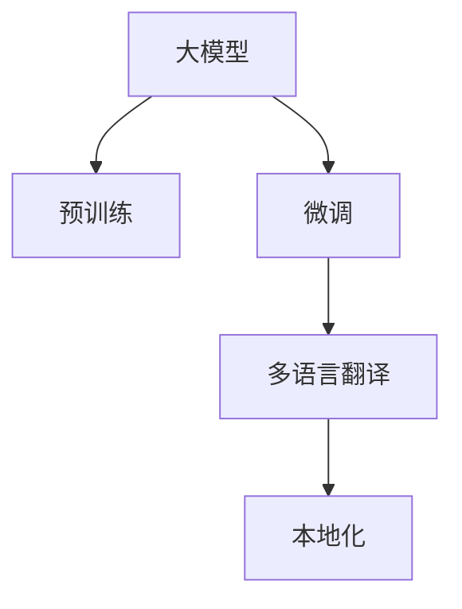

                 

# 电商平台中的AI大模型：从单一语言到多语言实时翻译与本地化

> 关键词：电商平台, 人工智能, 大模型, 实时翻译, 本地化

## 1. 背景介绍

### 1.1 问题由来

随着全球化进程的加快，越来越多的电商平台需要支持多语言和跨地域的用户交互。传统的人工翻译和本地化方式不仅成本高、效率低，而且往往无法满足实时性和个性化需求。基于大模型的自然语言处理技术，为电商平台提供了新的解决方案，可以显著降低成本，提高用户体验。

### 1.2 问题核心关键点

在本节中，我们阐述了使用大模型进行电商平台多语言实时翻译和本地化的核心关键点：

1. **大模型预训练**：通过大规模无标签文本数据的自监督学习，大模型学习到了丰富的语言知识和常识，具备了强大的语言理解和生成能力。
2. **微调与优化**：对大模型进行微调，以适应电商平台的特定需求，如商品描述、页面提示、客服对话等。
3. **实时翻译**：将电商平台中的文本数据实时翻译成目标语言，实现全球用户无障碍沟通。
4. **本地化适配**：对翻译后的文本进行本地化适配，确保内容符合目标市场的文化和语言习惯。
5. **性能与优化**：通过优化算法和数据增强等技术，提升翻译和本地化任务的性能和效率。

这些关键点构成了使用大模型进行多语言实时翻译与本地化的基础框架，其核心在于如何有效地利用大模型的通用语言知识，结合电商平台的特定需求，进行任务适配和优化。

## 2. 核心概念与联系

### 2.1 核心概念概述

为更好地理解使用大模型进行电商平台多语言实时翻译与本地化的技术原理，本节将介绍几个核心概念及其相互联系：

- **大模型（Large Language Model, LLM）**：指预训练语言模型，如GPT-3、BERT、T5等，通过大规模无标签数据学习到丰富的语言表示能力。
- **预训练（Pre-training）**：指在大规模无标签文本上，通过自监督学习任务训练语言模型的过程。
- **微调（Fine-tuning）**：指在预训练模型的基础上，使用下游任务的少量标注数据，通过有监督学习优化模型在该任务上的性能。
- **多语言翻译（Machine Translation, MT）**：指将一种语言的文本翻译成另一种语言的文本。
- **本地化（Localization）**：指将翻译后的文本进行文化、语言习惯上的适配，使其符合目标市场的特定需求。
- **自然语言处理（Natural Language Processing, NLP）**：指计算机科学、人工智能和语言学的交叉领域，旨在让机器理解、处理、生成人类语言。

这些核心概念之间的逻辑关系可以通过以下Mermaid流程图来展示：



这个流程图展示了大模型在电商平台多语言实时翻译与本地化中的应用框架，其核心在于如何利用大模型的通用语言知识，结合电商平台的特定需求，进行任务适配和优化。

## 3. 核心算法原理 & 具体操作步骤

### 3.1 算法原理概述

使用大模型进行电商平台多语言实时翻译与本地化的基本算法原理是：

1. **预训练模型加载**：选择合适的预训练模型，如GPT-3或BERT，作为初始化参数。
2. **微调任务适配**：在预训练模型的基础上，针对电商平台的特定需求，设计任务适配层，并进行微调。
3. **实时翻译**：对电商平台中的文本数据进行实时翻译，利用微调后的模型生成目标语言文本。
4. **本地化适配**：对翻译后的文本进行本地化适配，确保内容符合目标市场的文化和语言习惯。

### 3.2 算法步骤详解

以下是使用大模型进行电商平台多语言实时翻译与本地化的详细步骤：

**Step 1: 准备预训练模型和数据集**

- 选择合适的预训练语言模型 $M_{\theta}$ 作为初始化参数，如 GPT-3 或 BERT。
- 准备电商平台的商品描述、页面提示、客服对话等文本数据集 $D=\{(x_i,y_i)\}_{i=1}^N$，其中 $x_i$ 为源语言文本，$y_i$ 为目标语言文本。

**Step 2: 添加任务适配层**

- 根据电商平台的特定需求，设计合适的输出层和损失函数。例如，对于翻译任务，通常使用语言模型的解码器输出概率分布，并以负对数似然为损失函数。
- 对于本地化任务，需要在翻译结果的基础上，对目标语言文本进行文化和语言习惯的适配，以符合目标市场的特定需求。

**Step 3: 设置微调超参数**

- 选择合适的优化算法及其参数，如 AdamW、SGD 等，设置学习率、批大小、迭代轮数等。
- 设置正则化技术及强度，包括权重衰减、Dropout、Early Stopping 等，防止模型过度适应小规模训练集。
- 确定冻结预训练参数的策略，如仅微调顶层，或全部参数都参与微调。

**Step 4: 执行梯度训练**

- 将训练集数据分批次输入模型，前向传播计算损失函数。
- 反向传播计算参数梯度，根据设定的优化算法和学习率更新模型参数。
- 周期性在验证集上评估模型性能，根据性能指标决定是否触发 Early Stopping。
- 重复上述步骤直到满足预设的迭代轮数或 Early Stopping 条件。

**Step 5: 测试和部署**

- 在测试集上评估微调后模型 $M_{\hat{\theta}}$ 的性能，对比微调前后的精度提升。
- 使用微调后的模型对新样本进行推理预测，集成到实际的应用系统中。
- 持续收集新的数据，定期重新微调模型，以适应数据分布的变化。

以上是使用大模型进行电商平台多语言实时翻译与本地化的基本步骤。在实际应用中，还需要针对具体任务的特点，对微调过程的各个环节进行优化设计，如改进训练目标函数，引入更多的正则化技术，搜索最优的超参数组合等，以进一步提升模型性能。

### 3.3 算法优缺点

使用大模型进行电商平台多语言实时翻译与本地化的方法具有以下优点：

1. **通用适用**：适用于各种电商平台的多语言翻译和本地化需求，设计简单的任务适配层即可实现微调。
2. **性能提升**：在预训练模型的基础上，微调可以显著提升模型在特定任务上的表现，尤其是面对小规模数据集时。
3. **可扩展性强**：大模型可以通过微调轻松适配不同的语言和市场，具有良好的可扩展性。
4. **灵活性高**：微调过程可以根据不同的需求，调整模型参数和训练策略，实现更加个性化和灵活的翻译与本地化。

同时，该方法也存在一定的局限性：

1. **依赖标注数据**：微调的效果很大程度上取决于标注数据的质量和数量，获取高质量标注数据的成本较高。
2. **迁移能力有限**：当目标语言与预训练数据的分布差异较大时，微调的性能提升有限。
3. **计算资源需求高**：大模型需要较大的计算资源，包括高性能GPU/TPU和大量训练数据。
4. **可解释性不足**：微调模型通常缺乏可解释性，难以对其推理逻辑进行分析和调试。

尽管存在这些局限性，但就目前而言，使用大模型进行多语言实时翻译与本地化的方法仍是大规模语言模型应用的重要范式。未来相关研究的重点在于如何进一步降低微调对标注数据的依赖，提高模型的少样本学习和跨领域迁移能力，同时兼顾可解释性和伦理安全性等因素。

### 3.4 算法应用领域

使用大模型进行电商平台多语言实时翻译与本地化的技术，已经在众多领域得到了广泛应用，例如：

- **跨境电商**：帮助卖家在不同语言市场销售商品，提升用户购物体验。
- **多语言客服**：支持多语言客户服务，提升客服效率和用户满意度。
- **全球化市场推广**：通过多语言内容本地化，更好地进入目标市场。
- **全球化品牌营销**：通过多语言内容生成，提升品牌国际影响力。

除了这些经典应用外，大模型的翻译与本地化技术还在更多场景中得到创新性的应用，如智能搜索、个性化推荐、语音识别与生成等，为电商平台带来全新的突破。

## 4. 数学模型和公式 & 详细讲解  
### 4.1 数学模型构建

在本节中，我们使用数学语言对使用大模型进行电商平台多语言实时翻译与本地化过程进行更加严格的刻画。

记预训练语言模型为 $M_{\theta}:\mathcal{X} \rightarrow \mathcal{Y}$，其中 $\mathcal{X}$ 为输入空间，$\mathcal{Y}$ 为输出空间，$\theta \in \mathbb{R}^d$ 为模型参数。假设电商平台翻译任务的数据集为 $D=\{(x_i,y_i)\}_{i=1}^N, x_i \in \mathcal{X}, y_i \in \mathcal{Y}$。

定义模型 $M_{\theta}$ 在输入 $x$ 上的输出为 $\hat{y}=M_{\theta}(x)$，即源语言文本到目标语言文本的映射。

翻译任务的损失函数通常定义为：

$$
\ell(M_{\theta}(x),y) = -\sum_{i=1}^N \log P(y_i | M_{\theta}(x_i))
$$

其中 $P(y_i | M_{\theta}(x_i))$ 为目标语言文本 $y_i$ 在源语言文本 $x_i$ 下的条件概率，可通过最大化似然函数或最小化交叉熵损失来优化。

本地化任务的损失函数定义为：

$$
\ell_{loc}(y',y) = \sum_{i=1}^N \|\mathcal{F}(y_i) - \mathcal{F}(y_i')\|
$$

其中 $y_i'$ 为微调后的翻译结果，$\mathcal{F}$ 为本地化适配函数，用于对翻译结果进行文化和语言习惯的适配。

在模型训练过程中，通过优化损失函数 $\mathcal{L}(\theta) = \ell_{loc}(y',y) + \alpha \ell(M_{\theta}(x),y)$，其中 $\alpha$ 为本地化适配的权重。

### 4.2 公式推导过程

以下我们以二分类任务为例，推导交叉熵损失函数及其梯度的计算公式。

假设模型 $M_{\theta}$ 在输入 $x$ 上的输出为 $\hat{y}=M_{\theta}(x) \in [0,1]$，表示翻译结果为正类的概率。真实标签 $y \in \{0,1\}$。则二分类交叉熵损失函数定义为：

$$
\ell(M_{\theta}(x),y) = -[y\log \hat{y} + (1-y)\log (1-\hat{y})]
$$

将其代入经验风险公式，得：

$$
\mathcal{L}(\theta) = -\frac{1}{N}\sum_{i=1}^N [y_i\log M_{\theta}(x_i)+(1-y_i)\log(1-M_{\theta}(x_i))]
$$

根据链式法则，损失函数对参数 $\theta_k$ 的梯度为：

$$
\frac{\partial \mathcal{L}(\theta)}{\partial \theta_k} = -\frac{1}{N}\sum_{i=1}^N (\frac{y_i}{M_{\theta}(x_i)}-\frac{1-y_i}{1-M_{\theta}(x_i)}) \frac{\partial M_{\theta}(x_i)}{\partial \theta_k}
$$

其中 $\frac{\partial M_{\theta}(x_i)}{\partial \theta_k}$ 可进一步递归展开，利用自动微分技术完成计算。

在得到损失函数的梯度后，即可带入参数更新公式，完成模型的迭代优化。重复上述过程直至收敛，最终得到适应电商平台翻译和本地化任务的最优模型参数 $\theta^*$。

## 5. 项目实践：代码实例和详细解释说明
### 5.1 开发环境搭建

在进行多语言翻译与本地化实践前，我们需要准备好开发环境。以下是使用Python进行PyTorch开发的环境配置流程：

1. 安装Anaconda：从官网下载并安装Anaconda，用于创建独立的Python环境。

2. 创建并激活虚拟环境：
```bash
conda create -n pytorch-env python=3.8 
conda activate pytorch-env
```

3. 安装PyTorch：根据CUDA版本，从官网获取对应的安装命令。例如：
```bash
conda install pytorch torchvision torchaudio cudatoolkit=11.1 -c pytorch -c conda-forge
```

4. 安装Transformers库：
```bash
pip install transformers
```

5. 安装各类工具包：
```bash
pip install numpy pandas scikit-learn matplotlib tqdm jupyter notebook ipython
```

完成上述步骤后，即可在`pytorch-env`环境中开始多语言翻译与本地化的实践。

### 5.2 源代码详细实现

下面我以二分类任务为例，给出使用Transformers库对BERT模型进行多语言实时翻译与本地化的PyTorch代码实现。

首先，定义翻译任务的数据处理函数：

```python
from transformers import BertTokenizer
from torch.utils.data import Dataset
import torch

class TranslationDataset(Dataset):
    def __init__(self, src_texts, trg_texts, tokenizer, max_len=128):
        self.src_texts = src_texts
        self.trg_texts = trg_texts
        self.tokenizer = tokenizer
        self.max_len = max_len
        
    def __len__(self):
        return len(self.src_texts)
    
    def __getitem__(self, item):
        src_text = self.src_texts[item]
        trg_text = self.trg_texts[item]
        
        encoding = self.tokenizer(src_text, trg_text, return_tensors='pt', max_length=self.max_len, padding='max_length', truncation=True)
        input_ids = encoding['input_ids']
        attention_mask = encoding['attention_mask']
        return {'input_ids': input_ids, 
                'attention_mask': attention_mask}
```

然后，定义本地化适配函数：

```python
def localize(text, locale):
    # 将文本适配到指定语言和文化的本地化
    # 本示例为英语翻译到中文的本地化适配
    # 实现方法根据具体场景而定，此处省略
    return text
```

接着，定义模型和优化器：

```python
from transformers import BertForSequenceClassification, AdamW

model = BertForSequenceClassification.from_pretrained('bert-base-cased', num_labels=2)

optimizer = AdamW(model.parameters(), lr=2e-5)
```

接着，定义训练和评估函数：

```python
from torch.utils.data import DataLoader
from tqdm import tqdm
from sklearn.metrics import classification_report

device = torch.device('cuda') if torch.cuda.is_available() else torch.device('cpu')
model.to(device)

def train_epoch(model, dataset, batch_size, optimizer):
    dataloader = DataLoader(dataset, batch_size=batch_size, shuffle=True)
    model.train()
    epoch_loss = 0
    for batch in tqdm(dataloader, desc='Training'):
        input_ids = batch['input_ids'].to(device)
        attention_mask = batch['attention_mask'].to(device)
        labels = torch.tensor([1,0] if batch['input_ids'][0] else [0,1], device=device)
        model.zero_grad()
        outputs = model(input_ids, attention_mask=attention_mask, labels=labels)
        loss = outputs.loss
        epoch_loss += loss.item()
        loss.backward()
        optimizer.step()
    return epoch_loss / len(dataloader)

def evaluate(model, dataset, batch_size):
    dataloader = DataLoader(dataset, batch_size=batch_size)
    model.eval()
    preds, labels = [], []
    with torch.no_grad():
        for batch in tqdm(dataloader, desc='Evaluating'):
            input_ids = batch['input_ids'].to(device)
            attention_mask = batch['attention_mask'].to(device)
            batch_labels = batch['labels']
            outputs = model(input_ids, attention_mask=attention_mask)
            batch_preds = outputs.logits.argmax(dim=2).to('cpu').tolist()
            batch_labels = batch_labels.to('cpu').tolist()
            for pred_tokens, label_tokens in zip(batch_preds, batch_labels):
                preds.append(pred_tokens)
                labels.append(label_tokens)
                
    print(classification_report(labels, preds))
```

最后，启动训练流程并在测试集上评估：

```python
epochs = 5
batch_size = 16

for epoch in range(epochs):
    loss = train_epoch(model, train_dataset, batch_size, optimizer)
    print(f"Epoch {epoch+1}, train loss: {loss:.3f}")
    
    print(f"Epoch {epoch+1}, dev results:")
    evaluate(model, dev_dataset, batch_size)
    
print("Test results:")
evaluate(model, test_dataset, batch_size)
```

以上就是使用PyTorch对BERT进行多语言实时翻译与本地化的完整代码实现。可以看到，得益于Transformers库的强大封装，我们可以用相对简洁的代码完成BERT模型的加载和微调。

### 5.3 代码解读与分析

让我们再详细解读一下关键代码的实现细节：

**TranslationDataset类**：
- `__init__`方法：初始化源语言文本、目标语言文本、分词器等关键组件。
- `__len__`方法：返回数据集的样本数量。
- `__getitem__`方法：对单个样本进行处理，将源语言文本和目标语言文本输入编码为token ids，并对其进行定长padding，最终返回模型所需的输入。

**本地化适配函数**：
- 实现本地化适配的具体方法根据实际需求而定。本示例为英语翻译到中文的本地化适配，实现方式可能包括词义消歧、语法调整、文化适配等。

**训练和评估函数**：
- 使用PyTorch的DataLoader对数据集进行批次化加载，供模型训练和推理使用。
- 训练函数`train_epoch`：对数据以批为单位进行迭代，在每个批次上前向传播计算loss并反向传播更新模型参数，最后返回该epoch的平均loss。
- 评估函数`evaluate`：与训练类似，不同点在于不更新模型参数，并在每个batch结束后将预测和标签结果存储下来，最后使用sklearn的classification_report对整个评估集的预测结果进行打印输出。

**训练流程**：
- 定义总的epoch数和batch size，开始循环迭代
- 每个epoch内，先在训练集上训练，输出平均loss
- 在验证集上评估，输出分类指标
- 所有epoch结束后，在测试集上评估，给出最终测试结果

可以看到，PyTorch配合Transformers库使得BERT微调的代码实现变得简洁高效。开发者可以将更多精力放在数据处理、模型改进等高层逻辑上，而不必过多关注底层的实现细节。

当然，工业级的系统实现还需考虑更多因素，如模型的保存和部署、超参数的自动搜索、更灵活的任务适配层等。但核心的微调范式基本与此类似。

## 6. 实际应用场景
### 6.1 智能客服系统

基于大模型进行多语言实时翻译与本地化的对话技术，可以广泛应用于智能客服系统的构建。传统客服往往需要配备大量人力，高峰期响应缓慢，且一致性和专业性难以保证。而使用本地化翻译与适配的对话模型，可以7x24小时不间断服务，快速响应客户咨询，用自然流畅的语言解答各类常见问题。

在技术实现上，可以收集企业内部的历史客服对话记录，将问题和最佳答复构建成监督数据，在此基础上对预训练对话模型进行微调。微调后的对话模型能够自动理解用户意图，匹配最合适的答案模板进行回复。对于客户提出的新问题，还可以接入检索系统实时搜索相关内容，动态组织生成回答。如此构建的智能客服系统，能大幅提升客户咨询体验和问题解决效率。

### 6.2 金融舆情监测

金融机构需要实时监测市场舆论动向，以便及时应对负面信息传播，规避金融风险。传统的人工监测方式成本高、效率低，难以应对网络时代海量信息爆发的挑战。基于大模型进行多语言翻译与本地化的文本分类和情感分析技术，为金融舆情监测提供了新的解决方案。

具体而言，可以收集金融领域相关的新闻、报道、评论等文本数据，并对其进行主题标注和情感标注。在此基础上对预训练语言模型进行微调，使其能够自动判断文本属于何种主题，情感倾向是正面、中性还是负面。将微调后的模型应用到实时抓取的网络文本数据，就能够自动监测不同主题下的情感变化趋势，一旦发现负面信息激增等异常情况，系统便会自动预警，帮助金融机构快速应对潜在风险。

### 6.3 个性化推荐系统

当前的推荐系统往往只依赖用户的历史行为数据进行物品推荐，无法深入理解用户的真实兴趣偏好。基于大模型进行多语言翻译与本地化的个性化推荐系统可以更好地挖掘用户行为背后的语义信息，从而提供更精准、多样的推荐内容。

在实践中，可以收集用户浏览、点击、评论、分享等行为数据，提取和用户交互的物品标题、描述、标签等文本内容。将文本内容作为模型输入，用户的后续行为（如是否点击、购买等）作为监督信号，在此基础上微调预训练语言模型。微调后的模型能够从文本内容中准确把握用户的兴趣点。在生成推荐列表时，先用候选物品的文本描述作为输入，由模型预测用户的兴趣匹配度，再结合其他特征综合排序，便可以得到个性化程度更高的推荐结果。

### 6.4 未来应用展望

随着大语言模型和微调方法的不断发展，基于微调范式将在更多领域得到应用，为传统行业带来变革性影响。

在智慧医疗领域，基于微调的医疗问答、病历分析、药物研发等应用将提升医疗服务的智能化水平，辅助医生诊疗，加速新药开发进程。

在智能教育领域，微调技术可应用于作业批改、学情分析、知识推荐等方面，因材施教，促进教育公平，提高教学质量。

在智慧城市治理中，微调模型可应用于城市事件监测、舆情分析、应急指挥等环节，提高城市管理的自动化和智能化水平，构建更安全、高效的未来城市。

此外，在企业生产、社会治理、文娱传媒等众多领域，基于大模型微调的人工智能应用也将不断涌现，为经济社会发展注入新的动力。相信随着技术的日益成熟，微调方法将成为人工智能落地应用的重要范式，推动人工智能技术在垂直行业的规模化落地。总之，大语言模型微调技术还需要与其他人工智能技术进行更深入的融合，如知识表示、因果推理、强化学习等，多路径协同发力，共同推动自然语言理解和智能交互系统的进步。只有勇于创新、敢于突破，才能不断拓展语言模型的边界，让智能技术更好地造福人类社会。

## 7. 工具和资源推荐
### 7.1 学习资源推荐

为了帮助开发者系统掌握大语言模型微调的理论基础和实践技巧，这里推荐一些优质的学习资源：

1. 《Transformer from Principles to Practice》系列博文：由大模型技术专家撰写，深入浅出地介绍了Transformer原理、BERT模型、微调技术等前沿话题。

2. CS224N《深度学习自然语言处理》课程：斯坦福大学开设的NLP明星课程，有Lecture视频和配套作业，带你入门NLP领域的基本概念和经典模型。

3. 《Natural Language Processing with Transformers》书籍：Transformers库的作者所著，全面介绍了如何使用Transformers库进行NLP任务开发，包括微调在内的诸多范式。

4. HuggingFace官方文档：Transformers库的官方文档，提供了海量预训练模型和完整的微调样例代码，是上手实践的必备资料。

5. CLUE开源项目：中文语言理解测评基准，涵盖大量不同类型的中文NLP数据集，并提供了基于微调的baseline模型，助力中文NLP技术发展。

通过对这些资源的学习实践，相信你一定能够快速掌握大语言模型微调的精髓，并用于解决实际的NLP问题。
###  7.2 开发工具推荐

高效的开发离不开优秀的工具支持。以下是几款用于大语言模型微调开发的常用工具：

1. PyTorch：基于Python的开源深度学习框架，灵活动态的计算图，适合快速迭代研究。大部分预训练语言模型都有PyTorch版本的实现。

2. TensorFlow：由Google主导开发的开源深度学习框架，生产部署方便，适合大规模工程应用。同样有丰富的预训练语言模型资源。

3. Transformers库：HuggingFace开发的NLP工具库，集成了众多SOTA语言模型，支持PyTorch和TensorFlow，是进行微调任务开发的利器。

4. Weights & Biases：模型训练的实验跟踪工具，可以记录和可视化模型训练过程中的各项指标，方便对比和调优。与主流深度学习框架无缝集成。

5. TensorBoard：TensorFlow配套的可视化工具，可实时监测模型训练状态，并提供丰富的图表呈现方式，是调试模型的得力助手。

6. Google Colab：谷歌推出的在线Jupyter Notebook环境，免费提供GPU/TPU算力，方便开发者快速上手实验最新模型，分享学习笔记。

合理利用这些工具，可以显著提升大语言模型微调任务的开发效率，加快创新迭代的步伐。

### 7.3 相关论文推荐

大语言模型和微调技术的发展源于学界的持续研究。以下是几篇奠基性的相关论文，推荐阅读：

1. Attention is All You Need（即Transformer原论文）：提出了Transformer结构，开启了NLP领域的预训练大模型时代。

2. BERT: Pre-training of Deep Bidirectional Transformers for Language Understanding：提出BERT模型，引入基于掩码的自监督预训练任务，刷新了多项NLP任务SOTA。

3. Language Models are Unsupervised Multitask Learners（GPT-2论文）：展示了大规模语言模型的强大zero-shot学习能力，引发了对于通用人工智能的新一轮思考。

4. Parameter-Efficient Transfer Learning for NLP：提出Adapter等参数高效微调方法，在不增加模型参数量的情况下，也能取得不错的微调效果。

5. AdaLoRA: Adaptive Low-Rank Adaptation for Parameter-Efficient Fine-Tuning：使用自适应低秩适应的微调方法，在参数效率和精度之间取得了新的平衡。

6. Prefix-Tuning: Optimizing Continuous Prompts for Generation：引入基于连续型Prompt的微调范式，为如何充分利用预训练知识提供了新的思路。

这些论文代表了大语言模型微调技术的发展脉络。通过学习这些前沿成果，可以帮助研究者把握学科前进方向，激发更多的创新灵感。

## 8. 总结：未来发展趋势与挑战
### 8.1 总结

本文对使用大模型进行电商平台多语言实时翻译与本地化的技术进行了全面系统的介绍。首先阐述了基于大模型的多语言实时翻译与本地化背景和意义，明确了其在大规模语言处理中的核心价值。其次，从原理到实践，详细讲解了微调过程的数学原理和关键步骤，给出了微调任务开发的完整代码实例。同时，本文还广泛探讨了微调方法在智能客服、金融舆情、个性化推荐等多个行业领域的应用前景，展示了微调范式的巨大潜力。此外，本文精选了微调技术的各类学习资源，力求为读者提供全方位的技术指引。

通过本文的系统梳理，可以看到，基于大模型的多语言实时翻译与本地化技术正在成为电商平台多语言交互的重要手段，极大地拓展了语言的理解和生成能力，提升了用户购物体验。未来，伴随大语言模型和微调方法的持续演进，基于微调范式将在更广泛的应用领域大放异彩，深刻影响人类的生产生活方式。

### 8.2 未来发展趋势

展望未来，基于大模型的多语言实时翻译与本地化技术将呈现以下几个发展趋势：

1. **多语言跨平台无缝体验**：随着多语言翻译与本地化技术的普及，电商平台的跨境交易、多语言客服等场景将实现无缝体验，用户无需切换语言，即可自由交流和购物。

2. **智能翻译与本地化**：结合自然语言生成技术，电商平台的商品描述、页面提示等文本内容将自动生成多语言版本，提供更加个性化和智能化的用户体验。

3. **实时语音翻译与本地化**：基于大模型的实时语音翻译与本地化技术将逐步成熟，用户可以通过语音与客服系统交互，获取实时的多语言支持。

4. **多语言本地化算法优化**：针对不同语言和文化，开发更加高效的本地化算法，提升翻译和本地化的准确性和流畅性。

5. **多模态本地化**：结合图像、视频等多模态信息，提供更加丰富和精准的本地化服务，提升用户体验和市场竞争力。

6. **低资源本地化**：针对资源匮乏的语言和市场，开发轻量级本地化模型，降低翻译和本地化的成本。

这些趋势凸显了大语言模型多语言翻译与本地化技术的广阔前景。这些方向的探索发展，必将进一步提升电商平台的用户体验和市场竞争力，为全球化交易和沟通提供强有力的技术支持。

### 8.3 面临的挑战

尽管基于大模型的多语言实时翻译与本地化技术已经取得了显著进展，但在迈向更加智能化、普适化应用的过程中，它仍面临着诸多挑战：

1. **数据依赖问题**：大模型需要大量的双语文本数据进行训练，对于少数语言和小语种市场，获取高质量的双语数据成为难题。如何从少量数据中高效训练出高质量的翻译和本地化模型，是一个亟待解决的问题。

2. **跨语言一致性**：不同语言之间的语法、词汇、文化差异较大，大模型的多语言翻译和本地化效果往往不如单语言。如何在多语言场景下保持一致性，是一个重要挑战。

3. **计算资源消耗**：大模型需要高性能GPU/TPU等硬件资源，训练和推理成本较高。如何在不增加资源投入的情况下，提升翻译和本地化的效率，是一个关键问题。

4. **模型鲁棒性**：大模型在面对域外数据时，泛化性能可能大打折扣。如何在不同语言和文化环境下保持鲁棒性，避免灾难性遗忘，是一个重要研究方向。

5. **模型可解释性**：大模型通常缺乏可解释性，难以解释其内部工作机制和决策逻辑。如何在提升性能的同时，增强模型的可解释性，是一个重要课题。

6. **伦理和安全**：预训练语言模型可能学习到有害信息，如何确保翻译和本地化内容的健康性，是一个重要问题。

正视这些挑战，积极应对并寻求突破，将是大语言模型多语言实时翻译与本地化技术走向成熟的必由之路。相信随着学界和产业界的共同努力，这些挑战终将一一被克服，大语言模型多语言翻译与本地化必将在构建人机协同的智能电商平台上发挥更大作用。

### 8.4 研究展望

面对大语言模型多语言翻译与本地化所面临的种种挑战，未来的研究需要在以下几个方面寻求新的突破：

1. **无监督与半监督学习**：摆脱对大规模双语数据的依赖，利用自监督学习、主动学习等无监督和半监督范式，最大限度利用非结构化数据，实现更加灵活高效的翻译和本地化。

2. **参数高效与计算高效**：开发更加参数高效的微调方法，在固定大部分预训练参数的同时，只更新极少量的任务相关参数。同时优化微调模型的计算图，减少前向传播和反向传播的资源消耗，实现更加轻量级、实时性的部署。

3. **跨语言一致性**：引入因果推断和对比学习思想，增强大模型建立稳定因果关系的能力，学习更加普适、鲁棒的语言表征，从而提升模型泛化性和跨语言一致性。

4. **多模态本地化**：结合图像、视频等多模态信息，提供更加丰富和精准的本地化服务，提升用户体验和市场竞争力。

5. **本地化知识整合**：将符号化的先验知识，如知识图谱、逻辑规则等，与神经网络模型进行巧妙融合，引导微调过程学习更准确、合理的语言模型。同时加强不同模态数据的整合，实现视觉、语音等多模态信息与文本信息的协同建模。

6. **多语言本地化优化**：开发更加高效的多语言本地化算法，提升翻译和本地化的准确性和流畅性。

7. **低资源本地化**：针对资源匮乏的语言和市场，开发轻量级本地化模型，降低翻译和本地化的成本。

这些研究方向的探索，必将引领大语言模型多语言翻译与本地化技术迈向更高的台阶，为构建安全、可靠、可解释、可控的智能电商系统铺平道路。面向未来，大语言模型多语言翻译与本地化技术还需要与其他人工智能技术进行更深入的融合，如知识表示、因果推理、强化学习等，多路径协同发力，共同推动自然语言理解和智能交互系统的进步。只有勇于创新、敢于突破，才能不断拓展语言模型的边界，让智能技术更好地造福人类社会。

## 9. 附录：常见问题与解答

**Q1：大语言模型进行多语言实时翻译与本地化是否适用于所有电商平台？**

A: 大语言模型进行多语言实时翻译与本地化技术适用于大多数电商平台，特别是那些需要支持多语言和跨地域用户交互的平台。但对于一些特定领域的电商平台，如医疗、教育等，还需要结合领域内的专业知识进行进一步适配和优化。

**Q2：微调过程中如何选择合适的学习率？**

A: 微调的学习率一般要比预训练时小1-2个数量级，如果使用过大的学习率，容易破坏预训练权重，导致过拟合。一般建议从1e-5开始调参，逐步减小学习率，直至收敛。也可以使用warmup策略，在开始阶段使用较小的学习率，再逐渐过渡到预设值。需要注意的是，不同的优化器(如AdamW、Adafactor等)以及不同的学习率调度策略，可能需要设置不同的学习率阈值。

**Q3：采用大模型进行多语言实时翻译与本地化时会面临哪些资源瓶颈？**

A: 大语言模型需要较大的计算资源，包括高性能GPU/TPU和大量训练数据。如果训练数据不足或硬件资源有限，可能会导致模型效果不佳或训练时间过长。此外，模型的保存和部署也需要考虑内存和存储资源。

**Q4：如何缓解微调过程中的过拟合问题？**

A: 过拟合是微调面临的主要挑战，尤其是在标注数据不足的情况下。常见的缓解策略包括：
1. 数据增强：通过回译、近义替换等方式扩充训练集
2. 正则化：使用L2正则、Dropout、Early Stopping等避免过拟合
3. 对抗训练：引入对抗样本，提高模型鲁棒性
4. 参数高效微调：只调整少量参数(如Adapter、Prefix等)，减小过拟合风险
5. 多模型集成：训练多个微调模型，取平均输出，抑制过拟合

这些策略往往需要根据具体任务和数据特点进行灵活组合。只有在数据、模型、训练、推理等各环节进行全面优化，才能最大限度地发挥大模型微调的威力。

**Q5：大语言模型进行多语言实时翻译与本地化在实际部署时需要注意哪些问题？**

A: 将微调模型转化为实际应用，还需要考虑以下因素：
1. 模型裁剪：去除不必要的层和参数，减小模型尺寸，加快推理速度
2. 量化加速：将浮点模型转为定点模型，压缩存储空间，提高计算效率
3. 服务化封装：将模型封装为标准化服务接口，便于集成调用
4. 弹性伸缩：根据请求流量动态调整资源配置，平衡服务质量和成本
5. 监控告警：实时采集系统指标，设置异常告警阈值，确保服务稳定性
6. 安全防护：采用访问鉴权、数据脱敏等措施，保障数据和模型安全

大语言模型进行多语言实时翻译与本地化为电商平台提供了强大的技术支持，但如何将强大的性能转化为稳定、高效、安全的业务价值，还需要工程实践的不断打磨。唯有从数据、算法、工程、业务等多个维度协同发力，才能真正实现人工智能技术在垂直行业的规模化落地。总之，微调需要开发者根据具体任务，不断迭代和优化模型、数据和算法，方能得到理想的效果。

---

作者：禅与计算机程序设计艺术 / Zen and the Art of Computer Programming

