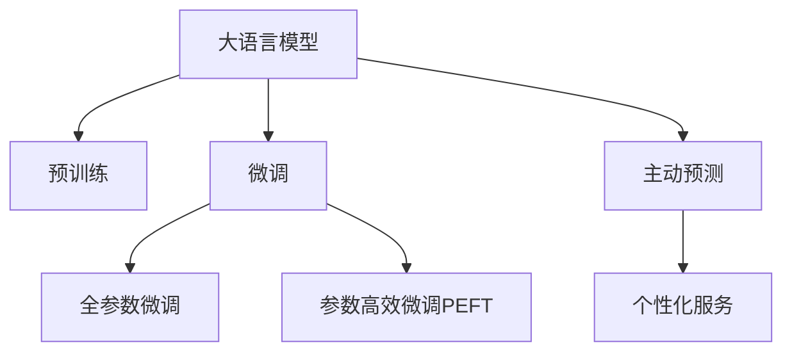

                 

# 电商平台中的AI大模型：从被动响应到主动预测与个性化服务

## 1. 背景介绍

随着电子商务的蓬勃发展，电商平台已成为用户获取商品信息、进行购物决策的主要渠道。然而，在信息爆炸的时代，传统的搜索引擎和推荐系统已经无法满足用户对个性化服务的迫切需求。如何通过AI大模型提升电商平台的购物体验，已成为各大电商平台亟待解决的问题。

### 1.1 问题由来

目前，电商平台主要采用基于搜索和推荐的两阶段购物流程：
1. **搜索**：用户通过关键词或产品分类进行搜索，获取一系列相关产品。
2. **推荐**：根据用户行为历史和兴趣偏好，推荐系统进一步筛选商品，辅助用户决策。

尽管如此，电商平台仍面临以下挑战：
- **个性化不足**：用户搜索和推荐结果往往较为泛化，无法满足用户个性化的需求。
- **互动性欠缺**：搜索和推荐主要依赖静态数据，缺乏用户与系统之间的互动反馈。
- **数据多样性**：用户行为数据多模态，包括搜索行为、浏览记录、购买历史、评价评论等，涉及大量非结构化数据。

大语言模型和大数据技术的结合，为电商平台提供了解决以上问题的全新思路。通过在电商场景下引入大语言模型，结合用户行为数据，电商平台的AI系统可以实现主动预测和个性化服务，显著提升用户购物体验。

## 2. 核心概念与联系

### 2.1 核心概念概述

为更好地理解AI大模型在电商平台中的应用，本节将介绍几个密切相关的核心概念：

- **大语言模型(Large Language Model, LLM)**：以自回归(如GPT)或自编码(如BERT)模型为代表的大规模预训练语言模型。通过在大规模无标签文本语料上进行预训练，学习通用的语言表示，具备强大的语言理解和生成能力。

- **预训练(Pre-training)**：指在大规模无标签文本语料上，通过自监督学习任务训练通用语言模型的过程。常见的预训练任务包括言语建模、遮挡语言模型等。预训练使得模型学习到语言的通用表示。

- **微调(Fine-tuning)**：指在预训练模型的基础上，使用下游任务的少量标注数据，通过有监督地训练来优化模型在特定任务上的性能。通常只需要调整顶层分类器或解码器，并以较小的学习率更新全部或部分的模型参数。

- **迁移学习(Transfer Learning)**：指将一个领域学习到的知识，迁移应用到另一个不同但相关的领域的学习范式。大模型的预训练-微调过程即是一种典型的迁移学习方式。

- **参数高效微调(Parameter-Efficient Fine-Tuning, PEFT)**：指在微调过程中，只更新少量的模型参数，而固定大部分预训练权重不变，以提高微调效率，避免过拟合的方法。

- **主动预测(Proactive Prediction)**：指基于用户的搜索和行为数据，模型能够主动预测用户可能感兴趣的购物物品或活动。

- **个性化服务(Personalized Service)**：指通过用户画像和行为分析，提供针对个人需求和偏好的定制化服务。

这些核心概念之间的逻辑关系可以通过以下Mermaid流程图来展示：



这个流程图展示了大语言模型的核心概念及其之间的关系：

1. 大语言模型通过预训练获得基础能力。
2. 微调是对预训练模型进行任务特定的优化，可以分为全参数微调和参数高效微调（PEFT）。
3. 主动预测是一种基于用户行为数据的主动推理，可用于提前推荐相关商品或活动。
4. 个性化服务是结合用户画像和行为数据，提供定制化的推荐和服务。

这些概念共同构成了电商平台AI系统的工作原理和优化方向。通过理解这些核心概念，我们可以更好地把握大语言模型在电商平台中的应用框架。

## 3. 核心算法原理 & 具体操作步骤
### 3.1 算法原理概述

在电商平台中，AI大模型的应用主要分为两个阶段：
1. **预训练阶段**：利用大规模无标签文本数据，训练一个通用的语言模型，学习语言的表达和理解能力。
2. **微调阶段**：针对电商平台的特定需求，如主动预测和个性化服务，通过微调优化模型，使其能够更好地适应电商场景。

具体来说，基于大语言模型的电商AI系统一般包括以下关键步骤：

- **数据准备**：收集电商平台的搜索、浏览、评价、评论等用户行为数据，并进行预处理和标注。
- **模型选择与初始化**：选择合适的预训练语言模型（如BERT、GPT等），并在电商数据上微调。
- **任务适配层设计**：根据具体应用场景，设计适当的任务适配层，如分类、回归、生成等。
- **超参数设置**：选择合适的优化算法及其参数，如AdamW、SGD等，设置学习率、批大小、迭代轮数等。
- **模型训练与评估**：在电商数据上对模型进行训练，并在验证集上评估性能。
- **部署与迭代优化**：将微调后的模型部署到电商平台，持续收集用户反馈，优化模型性能。

### 3.2 算法步骤详解

**Step 1: 数据准备**
- 数据采集：从电商平台的日志、用户反馈等渠道，收集用户搜索、浏览、评价、评论等行为数据。
- 数据清洗：去除无用数据，处理缺失值和异常值，确保数据质量和一致性。
- 数据标注：将用户行为数据进行标注，如商品ID、类别、评分、评价情感等。

**Step 2: 模型选择与初始化**
- 选择合适的预训练语言模型，如BERT、GPT等，作为初始化参数。
- 使用电商数据对其进行微调，学习电商平台特有的语言表示。

**Step 3: 任务适配层设计**
- 根据电商平台的特定需求，设计任务适配层。如对搜索数据进行分类，对浏览数据进行推荐，对评论数据进行情感分析等。
- 选择合适的损失函数，如交叉熵损失、均方误差损失等，用于衡量模型预测与真实标签之间的差异。

**Step 4: 超参数设置**
- 选择合适的优化算法，如AdamW、SGD等，设置学习率、批大小、迭代轮数等超参数。
- 应用正则化技术，如L2正则、Dropout、Early Stopping等，防止模型过度适应小规模训练集。
- 设置冻结预训练参数的策略，如仅微调顶层，或全部参数都参与微调。

**Step 5: 模型训练与评估**
- 将训练集数据分批次输入模型，前向传播计算损失函数。
- 反向传播计算参数梯度，根据设定的优化算法和学习率更新模型参数。
- 周期性在验证集上评估模型性能，根据性能指标决定是否触发 Early Stopping。
- 重复上述步骤直到满足预设的迭代轮数或 Early Stopping 条件。

**Step 6: 部署与迭代优化**
- 将微调后的模型部署到电商平台，对新用户进行预测和推荐。
- 持续收集用户反馈和行为数据，重新微调模型，优化推荐效果。

### 3.3 算法优缺点

基于大语言模型的电商AI系统具有以下优点：
1. **泛化能力强**：预训练模型具备较强的泛化能力，能够适应不同类型的电商数据。
2. **效率高**：微调过程相对简单，只需少量标注数据即可得到不错的性能提升。
3. **灵活性高**：可以通过任务适配层设计，适配不同的电商需求。
4. **可扩展性高**：模型可以在新的电商数据上快速迭代优化，适应数据分布变化。

同时，该方法也存在一定的局限性：
1. **对标注数据依赖高**：微调的效果很大程度上取决于标注数据的质量和数量，获取高质量标注数据的成本较高。
2. **过度拟合风险**：在小规模数据集上进行微调，容易过拟合，导致泛化能力下降。
3. **实时性不足**：微调过程可能需要较长时间，无法实现实时推荐。
4. **模型复杂度高**：预训练大模型参数量巨大，对硬件资源要求较高。

尽管存在这些局限性，但就目前而言，基于大语言模型的电商AI系统仍是大数据时代电商平台的有效解决方案。未来相关研究的重点在于如何进一步降低对标注数据的依赖，提高模型的实时性和参数效率，同时兼顾可解释性和伦理安全性等因素。

### 3.4 算法应用领域

基于大语言模型的电商AI系统在电商场景中的应用十分广泛，涵盖了几乎所有常见任务，例如：

- **搜索推荐系统**：对用户搜索行为进行分析和预测，推荐相关商品或内容。
- **评论情感分析**：分析用户对商品的评价和评论，获取情感倾向和评价内容。
- **个性化广告投放**：根据用户行为数据，定制化投放广告，提升点击率和转化率。
- **客户服务系统**：利用大语言模型构建智能客服系统，自动回复用户问题。
- **库存管理**：预测商品需求，优化库存配置，降低运营成本。
- **营销活动策划**：分析用户行为，策划个性化营销活动，提升用户参与度和满意度。

除了上述这些经典任务外，大语言模型在电商场景中的应用也在不断拓展，如推荐系统结合知识图谱、商品评论生成、基于对话的推荐等，为电商平台带来了新的创新突破。

## 4. 数学模型和公式 & 详细讲解
### 4.1 数学模型构建

在电商平台中，基于大语言模型的推荐系统可以形式化为以下优化问题：

假设电商平台上的用户搜索数据为 $\{(x_i, y_i)\}_{i=1}^N$，其中 $x_i$ 为搜索关键词，$y_i$ 为与之相关的商品ID。目标是最小化预测值与真实标签之间的差距，即：

$$
\mathcal{L}(\theta) = \frac{1}{N} \sum_{i=1}^N \ell(\hat{y}_i, y_i)
$$

其中 $\theta$ 为预训练模型的参数，$\hat{y}_i = M_{\theta}(x_i)$ 为模型对 $x_i$ 的预测商品ID。$\ell$ 为损失函数，如交叉熵损失、均方误差损失等。

微调的优化目标是最小化经验风险，即找到最优参数：

$$
\theta^* = \mathop{\arg\min}_{\theta} \mathcal{L}(\theta)
$$

在实践中，我们通常使用基于梯度的优化算法（如AdamW、SGD等）来近似求解上述最优化问题。设 $\eta$ 为学习率，$\lambda$ 为正则化系数，则参数的更新公式为：

$$
\theta \leftarrow \theta - \eta \nabla_{\theta}\mathcal{L}(\theta) - \eta\lambda\theta
$$

其中 $\nabla_{\theta}\mathcal{L}(\theta)$ 为损失函数对参数 $\theta$ 的梯度，可通过反向传播算法高效计算。

### 4.2 公式推导过程

以下我们以电商平台的商品推荐系统为例，推导交叉熵损失函数及其梯度的计算公式。

假设电商平台上的商品数据为 $\{(x_i, y_i)\}_{i=1}^N$，其中 $x_i$ 为商品描述，$y_i$ 为与之相关的搜索关键词。目标是最小化预测值与真实标签之间的差距，即：

$$
\mathcal{L}(\theta) = -\frac{1}{N}\sum_{i=1}^N [y_i\log \hat{y}_i+(1-y_i)\log(1-\hat{y}_i)]
$$

将其代入经验风险公式，得：

$$
\mathcal{L}(\theta) = -\frac{1}{N}\sum_{i=1}^N [y_i\log M_{\theta}(x_i)+(1-y_i)\log(1-M_{\theta}(x_i))]
$$

根据链式法则，损失函数对参数 $\theta_k$ 的梯度为：

$$
\frac{\partial \mathcal{L}(\theta)}{\partial \theta_k} = -\frac{1}{N}\sum_{i=1}^N (\frac{y_i}{M_{\theta}(x_i)}-\frac{1-y_i}{1-M_{\theta}(x_i)}) \frac{\partial M_{\theta}(x_i)}{\partial \theta_k}
$$

其中 $\frac{\partial M_{\theta}(x_i)}{\partial \theta_k}$ 可进一步递归展开，利用自动微分技术完成计算。

在得到损失函数的梯度后，即可带入参数更新公式，完成模型的迭代优化。重复上述过程直至收敛，最终得到适应电商推荐任务的最优模型参数 $\theta^*$。

## 5. 项目实践：代码实例和详细解释说明
### 5.1 开发环境搭建

在进行电商平台AI模型开发前，我们需要准备好开发环境。以下是使用Python进行PyTorch开发的环境配置流程：

1. 安装Anaconda：从官网下载并安装Anaconda，用于创建独立的Python环境。

2. 创建并激活虚拟环境：
```bash
conda create -n pytorch-env python=3.8 
conda activate pytorch-env
```

3. 安装PyTorch：根据CUDA版本，从官网获取对应的安装命令。例如：
```bash
conda install pytorch torchvision torchaudio cudatoolkit=11.1 -c pytorch -c conda-forge
```

4. 安装Transformers库：
```bash
pip install transformers
```

5. 安装各类工具包：
```bash
pip install numpy pandas scikit-learn matplotlib tqdm jupyter notebook ipython
```

完成上述步骤后，即可在`pytorch-env`环境中开始电商平台AI模型开发。

### 5.2 源代码详细实现

下面我们以电商平台商品推荐系统为例，给出使用Transformers库对BERT模型进行推荐系统微调的PyTorch代码实现。

首先，定义推荐任务的数据处理函数：

```python
from transformers import BertTokenizer
from torch.utils.data import Dataset
import torch

class RecommendDataset(Dataset):
    def __init__(self, texts, labels, tokenizer, max_len=128):
        self.texts = texts
        self.labels = labels
        self.tokenizer = tokenizer
        self.max_len = max_len
        
    def __len__(self):
        return len(self.texts)
    
    def __getitem__(self, item):
        text = self.texts[item]
        label = self.labels[item]
        
        encoding = self.tokenizer(text, return_tensors='pt', max_length=self.max_len, padding='max_length', truncation=True)
        input_ids = encoding['input_ids'][0]
        attention_mask = encoding['attention_mask'][0]
        
        # 对label进行one-hot编码
        encoded_labels = torch.zeros(1, max_len).to(label)
        encoded_labels[0, label] = 1
        
        return {'input_ids': input_ids, 
                'attention_mask': attention_mask,
                'labels': encoded_labels}

# 标签与id的映射
label2id = {0: 'query', 1: 'recommendation'}
id2label = {v: k for k, v in label2id.items()}

# 创建dataset
tokenizer = BertTokenizer.from_pretrained('bert-base-cased')

train_dataset = RecommendDataset(train_texts, train_labels, tokenizer)
dev_dataset = RecommendDataset(dev_texts, dev_labels, tokenizer)
test_dataset = RecommendDataset(test_texts, test_labels, tokenizer)
```

然后，定义模型和优化器：

```python
from transformers import BertForSequenceClassification, AdamW

model = BertForSequenceClassification.from_pretrained('bert-base-cased', num_labels=len(label2id))

optimizer = AdamW(model.parameters(), lr=2e-5)
```

接着，定义训练和评估函数：

```python
from torch.utils.data import DataLoader
from tqdm import tqdm
from sklearn.metrics import accuracy_score

device = torch.device('cuda') if torch.cuda.is_available() else torch.device('cpu')
model.to(device)

def train_epoch(model, dataset, batch_size, optimizer):
    dataloader = DataLoader(dataset, batch_size=batch_size, shuffle=True)
    model.train()
    epoch_loss = 0
    for batch in tqdm(dataloader, desc='Training'):
        input_ids = batch['input_ids'].to(device)
        attention_mask = batch['attention_mask'].to(device)
        labels = batch['labels'].to(device)
        model.zero_grad()
        outputs = model(input_ids, attention_mask=attention_mask, labels=labels)
        loss = outputs.loss
        epoch_loss += loss.item()
        loss.backward()
        optimizer.step()
    return epoch_loss / len(dataloader)

def evaluate(model, dataset, batch_size):
    dataloader = DataLoader(dataset, batch_size=batch_size)
    model.eval()
    preds, labels = [], []
    with torch.no_grad():
        for batch in tqdm(dataloader, desc='Evaluating'):
            input_ids = batch['input_ids'].to(device)
            attention_mask = batch['attention_mask'].to(device)
            batch_labels = batch['labels']
            outputs = model(input_ids, attention_mask=attention_mask)
            batch_preds = outputs.logits.argmax(dim=2).to('cpu').tolist()
            batch_labels = batch_labels.to('cpu').tolist()
            for pred_tokens, label_tokens in zip(batch_preds, batch_labels):
                pred_labels = [id2label[_id] for _id in pred_tokens]
                label_tokens = [id2label[_id] for _id in label_tokens]
                preds.append(pred_labels[:len(label_tokens)])
                labels.append(label_tokens)
                
    print(accuracy_score(labels, preds))
```

最后，启动训练流程并在测试集上评估：

```python
epochs = 5
batch_size = 16

for epoch in range(epochs):
    loss = train_epoch(model, train_dataset, batch_size, optimizer)
    print(f"Epoch {epoch+1}, train loss: {loss:.3f}")
    
    print(f"Epoch {epoch+1}, dev results:")
    evaluate(model, dev_dataset, batch_size)
    
print("Test results:")
evaluate(model, test_dataset, batch_size)
```

以上就是使用PyTorch对BERT进行电商平台商品推荐系统微调的完整代码实现。可以看到，得益于Transformers库的强大封装，我们可以用相对简洁的代码完成BERT模型的加载和微调。

### 5.3 代码解读与分析

让我们再详细解读一下关键代码的实现细节：

**RecommendDataset类**：
- `__init__`方法：初始化文本、标签、分词器等关键组件。
- `__len__`方法：返回数据集的样本数量。
- `__getitem__`方法：对单个样本进行处理，将文本输入编码为token ids，将标签进行one-hot编码，并对其进行定长padding，最终返回模型所需的输入。

**label2id和id2label字典**：
- 定义了标签与数字id之间的映射关系，用于将标签编码成数字形式。

**训练和评估函数**：
- 使用PyTorch的DataLoader对数据集进行批次化加载，供模型训练和推理使用。
- 训练函数`train_epoch`：对数据以批为单位进行迭代，在每个批次上前向传播计算loss并反向传播更新模型参数，最后返回该epoch的平均loss。
- 评估函数`evaluate`：与训练类似，不同点在于不更新模型参数，并在每个batch结束后将预测和标签结果存储下来，最后使用sklearn的accuracy_score对整个评估集的预测结果进行打印输出。

**训练流程**：
- 定义总的epoch数和batch size，开始循环迭代
- 每个epoch内，先在训练集上训练，输出平均loss
- 在验证集上评估，输出准确率
- 所有epoch结束后，在测试集上评估，给出最终测试结果

可以看到，PyTorch配合Transformers库使得BERT微调的代码实现变得简洁高效。开发者可以将更多精力放在数据处理、模型改进等高层逻辑上，而不必过多关注底层的实现细节。

当然，工业级的系统实现还需考虑更多因素，如模型的保存和部署、超参数的自动搜索、更灵活的任务适配层等。但核心的微调范式基本与此类似。

## 6. 实际应用场景
### 6.1 智能客服系统

基于大语言模型微调的对话技术，可以广泛应用于智能客服系统的构建。传统客服往往需要配备大量人力，高峰期响应缓慢，且一致性和专业性难以保证。而使用微调后的对话模型，可以7x24小时不间断服务，快速响应客户咨询，用自然流畅的语言解答各类常见问题。

在技术实现上，可以收集企业内部的历史客服对话记录，将问题和最佳答复构建成监督数据，在此基础上对预训练对话模型进行微调。微调后的对话模型能够自动理解用户意图，匹配最合适的答案模板进行回复。对于客户提出的新问题，还可以接入检索系统实时搜索相关内容，动态组织生成回答。如此构建的智能客服系统，能大幅提升客户咨询体验和问题解决效率。

### 6.2 金融舆情监测

金融机构需要实时监测市场舆论动向，以便及时应对负面信息传播，规避金融风险。传统的人工监测方式成本高、效率低，难以应对网络时代海量信息爆发的挑战。基于大语言模型微调的文本分类和情感分析技术，为金融舆情监测提供了新的解决方案。

具体而言，可以收集金融领域相关的新闻、报道、评论等文本数据，并对其进行主题标注和情感标注。在此基础上对预训练语言模型进行微调，使其能够自动判断文本属于何种主题，情感倾向是正面、中性还是负面。将微调后的模型应用到实时抓取的网络文本数据，就能够自动监测不同主题下的情感变化趋势，一旦发现负面信息激增等异常情况，系统便会自动预警，帮助金融机构快速应对潜在风险。

### 6.3 个性化推荐系统

当前的推荐系统往往只依赖用户的历史行为数据进行物品推荐，无法深入理解用户的真实兴趣偏好。基于大语言模型微调技术，个性化推荐系统可以更好地挖掘用户行为背后的语义信息，从而提供更精准、多样的推荐内容。

在实践中，可以收集用户浏览、点击、评论、分享等行为数据，提取和用户交互的物品标题、描述、标签等文本内容。将文本内容作为模型输入，用户的后续行为（如是否点击、购买等）作为监督信号，在此基础上微调预训练语言模型。微调后的模型能够从文本内容中准确把握用户的兴趣点。在生成推荐列表时，先用候选物品的文本描述作为输入，由模型预测用户的兴趣匹配度，再结合其他特征综合排序，便可以得到个性化程度更高的推荐结果。

### 6.4 未来应用展望

随着大语言模型微调技术的不断发展，基于微调范式将在更多领域得到应用，为传统行业带来变革性影响。

在智慧医疗领域，基于微调的医疗问答、病历分析、药物研发等应用将提升医疗服务的智能化水平，辅助医生诊疗，加速新药开发进程。

在智能教育领域，微调技术可应用于作业批改、学情分析、知识推荐等方面，因材施教，促进教育公平，提高教学质量。

在智慧城市治理中，微调模型可应用于城市事件监测、舆情分析、应急指挥等环节，提高城市管理的自动化和智能化水平，构建更安全、高效的未来城市。

此外，在企业生产、社会治理、文娱传媒等众多领域，基于大模型微调的人工智能应用也将不断涌现，为经济社会发展注入新的动力。相信随着技术的日益成熟，微调方法将成为人工智能落地应用的重要范式，推动人工智能向更广阔的领域加速渗透。

## 7. 工具和资源推荐
### 7.1 学习资源推荐

为了帮助开发者系统掌握大语言模型微调的理论基础和实践技巧，这里推荐一些优质的学习资源：

1. 《Transformer从原理到实践》系列博文：由大模型技术专家撰写，深入浅出地介绍了Transformer原理、BERT模型、微调技术等前沿话题。

2. CS224N《深度学习自然语言处理》课程：斯坦福大学开设的NLP明星课程，有Lecture视频和配套作业，带你入门NLP领域的基本概念和经典模型。

3. 《Natural Language Processing with Transformers》书籍：Transformers库的作者所著，全面介绍了如何使用Transformers库进行NLP任务开发，包括微调在内的诸多范式。

4. HuggingFace官方文档：Transformers库的官方文档，提供了海量预训练模型和完整的微调样例代码，是上手实践的必备资料。

5. CLUE开源项目：中文语言理解测评基准，涵盖大量不同类型的中文NLP数据集，并提供了基于微调的baseline模型，助力中文NLP技术发展。

通过对这些资源的学习实践，相信你一定能够快速掌握大语言模型微调的精髓，并用于解决实际的NLP问题。
###  7.2 开发工具推荐

高效的开发离不开优秀的工具支持。以下是几款用于大语言模型微调开发的常用工具：

1. PyTorch：基于Python的开源深度学习框架，灵活动态的计算图，适合快速迭代研究。大部分预训练语言模型都有PyTorch版本的实现。

2. TensorFlow：由Google主导开发的开源深度学习框架，生产部署方便，适合大规模工程应用。同样有丰富的预训练语言模型资源。

3. Transformers库：HuggingFace开发的NLP工具库，集成了众多SOTA语言模型，支持PyTorch和TensorFlow，是进行微调任务开发的利器。

4. Weights & Biases：模型训练的实验跟踪工具，可以记录和可视化模型训练过程中的各项指标，方便对比和调优。与主流深度学习框架无缝集成。

5. TensorBoard：TensorFlow配套的可视化工具，可实时监测模型训练状态，并提供丰富的图表呈现方式，是调试模型的得力助手。

6. Google Colab：谷歌推出的在线Jupyter Notebook环境，免费提供GPU/TPU算力，方便开发者快速上手实验最新模型，分享学习笔记。

合理利用这些工具，可以显著提升大语言模型微调任务的开发效率，加快创新迭代的步伐。

### 7.3 相关论文推荐

大语言模型和微调技术的发展源于学界的持续研究。以下是几篇奠基性的相关论文，推荐阅读：

1. Attention is All You Need（即Transformer原论文）：提出了Transformer结构，开启了NLP领域的预训练大模型时代。

2. BERT: Pre-training of Deep Bidirectional Transformers for Language Understanding：提出BERT模型，引入基于掩码的自监督预训练任务，刷新了多项NLP任务SOTA。

3. Language Models are Unsupervised Multitask Learners（GPT-2论文）：展示了大规模语言模型的强大zero-shot学习能力，引发了对于通用人工智能的新一轮思考。

4. Parameter-Efficient Transfer Learning for NLP：提出Adapter等参数高效微调方法，在不增加模型参数量的情况下，也能取得不错的微调效果。

5. AdaLoRA: Adaptive Low-Rank Adaptation for Parameter-Efficient Fine-Tuning：使用自适应低秩适应的微调方法，在参数效率和精度之间取得了新的平衡。

这些论文代表了大语言模型微调技术的发展脉络。通过学习这些前沿成果，可以帮助研究者把握学科前进方向，激发更多的创新灵感。

## 8. 总结：未来发展趋势与挑战

### 8.1 总结

本文对基于大语言模型的电商平台AI系统进行了全面系统的介绍。首先阐述了电商平台对AI系统提出的需求和挑战，明确了电商平台对个性化、主动预测和实时服务的需求。其次，从原理到实践，详细讲解了电商AI系统的核心算法和操作步骤，给出了微调任务开发的完整代码实例。同时，本文还探讨了电商AI系统在智能客服、金融舆情、个性化推荐等诸多实际应用场景中的应用前景，展示了电商AI系统的广泛应用潜力。此外，本文精选了电商AI系统的各类学习资源，力求为读者提供全方位的技术指引。

通过本文的系统梳理，可以看到，基于大语言模型的电商AI系统正在成为电商平台的核心竞争力，极大地提升电商平台的个性化服务和用户体验。未来，伴随大语言模型和微调方法的不断演进，电商AI系统必将在用户行为分析、商品推荐、客户服务等多个方面发挥更大的作用，推动电商平台迈向智能化新纪元。

### 8.2 未来发展趋势

展望未来，大语言模型在电商AI系统中的应用将呈现以下几个发展趋势：

1. **参数高效和计算高效**：开发更加参数高效的微调方法，如Prefix-Tuning、LoRA等，在节省计算资源的同时也能保证微调精度。

2. **实时性和交互性**：借助自然语言处理和计算图优化技术，提升模型的实时响应能力，支持与用户的实时交互。

3. **多模态融合**：结合图像、语音、视频等多模态信息，构建多模态电商AI系统，提升系统的感知和理解能力。

4. **个性化推荐**：利用大语言模型学习用户深度语义信息，结合知识图谱、社交网络等外部数据，提供更加个性化、精准的推荐服务。

5. **数据驱动**：构建电商AI系统的闭环数据反馈机制，通过不断收集用户反馈和行为数据，动态调整模型参数，优化推荐效果。

6. **公平性和可解释性**：引入公平性约束和可解释性工具，确保电商AI系统对所有用户公平对待，提供透明可理解的决策依据。

以上趋势凸显了大语言模型在电商AI系统中的应用前景。这些方向的探索发展，必将进一步提升电商AI系统的性能和应用范围，为电商平台带来更多的创新突破。

### 8.3 面临的挑战

尽管大语言模型在电商AI系统中的应用已经取得了显著进展，但在迈向更加智能化、普适化应用的过程中，它仍面临着诸多挑战：

1. **标注数据依赖高**：微调的效果很大程度上取决于标注数据的质量和数量，获取高质量标注数据的成本较高。如何进一步降低微调对标注数据的依赖，将是一大难题。

2. **实时性不足**：微调过程可能需要较长时间，无法实现实时推荐。如何加速模型训练和推理，提高系统的实时响应能力，还需要更多优化。

3. **模型复杂度高**：预训练大模型参数量巨大，对硬件资源要求较高。如何在保证性能的同时，简化模型结构，提升推理速度，优化资源占用，将是重要的优化方向。

4. **可解释性不足**：电商AI系统往往需要较高的透明度，能够解释其决策依据。如何赋予电商AI系统更强的可解释性，将是亟待攻克的难题。

5. **数据安全和隐私保护**：电商AI系统需要处理大量的用户数据，如何确保数据安全和隐私保护，是一个不容忽视的问题。

6. **用户行为分析**：电商AI系统需要精准地分析用户行为，理解用户的兴趣和需求。如何构建更加全面、深入的用户画像，将是重要的研究课题。

这些挑战将在大语言模型和电商AI系统的实际应用中不断显现，但相信通过学界和产业界的共同努力，这些挑战终将一一被克服，大语言模型在电商AI系统中的应用必将继续深化。

### 8.4 研究展望

面对大语言模型在电商AI系统中的挑战和机遇，未来的研究需要在以下几个方面寻求新的突破：

1. **模型压缩与量化**：研究模型压缩和量化技术，减少大模型的参数量和计算复杂度，提升模型的实时响应能力。

2. **端到端训练**：结合领域知识，设计端到端训练范式，提升模型的业务适配性和表现效果。

3. **多任务联合训练**：将多个电商任务联合训练，提升模型的泛化能力和综合性能。

4. **跨模态融合**：研究跨模态融合技术，结合电商场景中的多模态数据，构建更加全面、精准的电商AI系统。

5. **模型微调机制**：设计灵活的模型微调机制，适应电商场景中的动态变化，提升模型的鲁棒性和适应性。

6. **实时反馈优化**：建立实时反馈机制，持续优化电商AI系统的推荐效果和用户满意度。

这些研究方向将推动大语言模型在电商AI系统中的不断深化，为电商平台带来更多的创新突破。相信随着技术的不断进步，电商AI系统必将在用户行为分析、商品推荐、客户服务等多个方面发挥更大的作用，推动电商平台迈向智能化新纪元。

## 9. 附录：常见问题与解答

**Q1：电商AI系统需要大规模标注数据吗？**

A: 电商AI系统的微调过程需要一定量的标注数据，但相较于传统机器学习模型，其标注数据量要求较低。一般来说，几十到几百条标注数据即可显著提升模型的推荐效果。如何通过数据增强、主动学习等技术，进一步降低标注数据的需求，是大语言模型微调研究的重要方向。

**Q2：电商AI系统如何实现实时推荐？**

A: 电商AI系统实现实时推荐的核心在于模型的推理速度和硬件资源的优化。具体来说，可以通过以下方法实现实时推荐：
1. 使用GPU/TPU等高性能设备，加速模型推理。
2. 优化模型的计算图，减少前向传播和反向传播的资源消耗。
3. 采用梯度积累、混合精度训练等技术，减少内存和计算开销。
4. 通过缓存和异步计算，优化模型的实时响应能力。

**Q3：电商AI系统如何保障用户隐私？**

A: 电商AI系统在处理用户数据时，需要严格遵守数据隐私保护法规，确保用户隐私不被泄露。具体措施包括：
1. 采用差分隐私技术，保护用户隐私的同时不牺牲推荐效果。
2. 实施数据匿名化处理，避免用户数据被直接识别。
3. 设计多级数据访问机制，限制对敏感数据的访问权限。
4. 加强数据安全防护，防止数据泄露和攻击。

**Q4：电商AI系统如何提升可解释性？**

A: 电商AI系统的可解释性是提升用户信任和接受度的重要因素。具体措施包括：
1. 引入可解释性模型，如LIME、SHAP等，提供模型决策的可视化解释。
2. 设计可解释性指标，评估模型的可解释性和鲁棒性。
3. 提供用户友好的解释界面，展示模型的推荐依据和决策过程。
4. 建立用户反馈机制，收集用户对推荐结果的评价和意见，持续优化系统性能。

**Q5：电商AI系统如何提升推荐精度？**

A: 电商AI系统的推荐精度是衡量系统性能的重要指标。具体措施包括：
1. 引入多任务学习，同时优化多个电商任务，提升系统的综合性能。
2. 设计多模态融合模型，结合电商场景中的多模态数据，提高推荐的准确性。
3. 采用知识图谱、协同过滤等技术，提高模型的业务适配性。
4. 定期更新模型参数，适应电商场景中的数据分布变化。

这些常见问题的解答，展示了电商AI系统在应用过程中面临的挑战和解决策略，为读者提供了全面的技术指引。

---

作者：禅与计算机程序设计艺术 / Zen and the Art of Computer Programming

