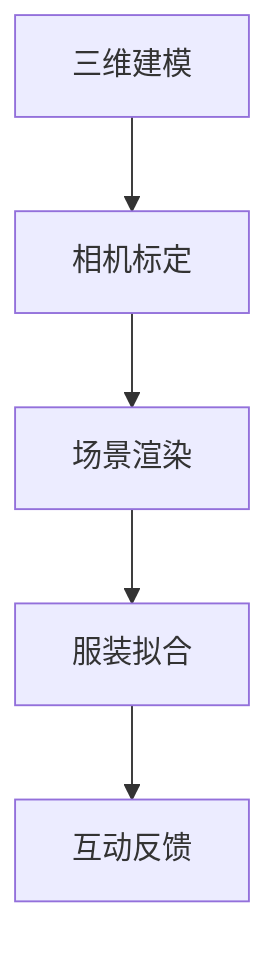

                 

# 电商平台中的AR虚拟试穿系统设计

## 1. 背景介绍

### 1.1 问题由来

随着移动互联网和智能设备的普及，电子商务发展迅猛。在线购物已成为人们日常生活的重要组成部分。但在线购物存在诸多挑战，其中“试穿试戴”是消费者最为关注的难题之一。传统电商平台通常只提供静态图片和有限的360度视频展示，无法直观展示服装、鞋子等商品的实际效果，导致消费者购物体验大打折扣，退换货率较高。

虚拟试穿技术(Virtual Try-on)通过增强现实(AR)技术，在用户手机上展示商品的全息立体效果，让用户可以在虚拟空间中试穿商品，提升用户购物体验。然而，构建高效的虚拟试穿系统涉及多个环节，包括三维建模、相机标定、场景渲染、服装拟合等，技术门槛较高。电商企业需要大规模部署，对资源和技术要求较高，难以实现。

### 1.2 问题核心关键点

虚拟试穿系统利用增强现实技术，在用户手机上展示商品的全息立体效果，使其能够在虚拟空间中试穿试戴。该系统需要具备以下核心能力：

1. **三维建模**：构建商品的高质量三维模型，准确还原商品的形状和材质。
2. **相机标定**：对用户手机相机进行标定，构建虚拟试穿场景，适配不同手机尺寸和摄像头的视角。
3. **场景渲染**：实现逼真的光照和材质渲染，提升虚拟试穿效果。
4. **服装拟合**：对商品进行拟合，使其适配用户的三围数据，实现逼真的试穿效果。
5. **互动反馈**：实时收集用户的互动反馈，优化试穿体验。

本文聚焦于虚拟试穿系统的核心技术，详细探讨了三维建模、相机标定、场景渲染、服装拟合等关键环节的技术原理和实现方法。

## 2. 核心概念与联系

### 2.1 核心概念概述

虚拟试穿系统涉及多个核心概念，以下对其原理和架构进行介绍：

- **三维建模**：利用计算机视觉、3D扫描等技术，构建商品的高质量三维模型，用于虚拟试穿和生成360度全景图。
- **相机标定**：对用户手机相机进行标定，获取相机的内参和外参，用于三维场景的生成和渲染。
- **场景渲染**：利用光栅化渲染、ray tracing等技术，实现高质量的光照和材质渲染，提升虚拟试穿效果。
- **服装拟合**：通过人体检测、姿态估计等技术，对用户的三围数据进行适配，实现逼真的试穿效果。
- **互动反馈**：实时收集用户的互动反馈，如手势、面部表情等，优化试穿体验，提升用户满意度。

这些核心概念之间的关系可以通过以下Mermaid流程图来展示：



这个流程图展示了一个虚拟试穿系统的整体架构，各环节通过数据流动实现协作，共同构成虚拟试穿的核心流程。

## 3. 核心算法原理 & 具体操作步骤

### 3.1 算法原理概述

虚拟试穿系统的核心算法原理包括以下几个关键部分：

- **三维建模**：基于计算机视觉、3D扫描等技术，构建商品的三维模型。
- **相机标定**：通过图像特征提取和匹配，获取相机的内参和外参。
- **场景渲染**：利用光栅化渲染、ray tracing等技术，生成高质量的虚拟试穿场景。
- **服装拟合**：通过人体检测和姿态估计，适配用户的三围数据，实现逼真的试穿效果。
- **互动反馈**：通过手势识别、面部表情分析等技术，收集用户互动信息，优化试穿体验。

这些算法相互配合，共同构建了虚拟试穿系统的核心能力。

### 3.2 算法步骤详解

#### 3.2.1 三维建模

三维建模是虚拟试穿系统的基础，需要获取商品的高质量三维模型。常用的三维建模方法包括：

- **手工建模**：通过3D建模软件（如Blender、Maya等）手动创建模型，适用于复杂度和细节要求较高的商品。
- **3D扫描**：利用激光扫描、立体视觉等技术，自动获取商品的三维模型，适用于标准化、规则化的商品。
- **混合建模**：结合手工建模和3D扫描，综合其优点，适用于复杂度适中的商品。

建模完成后，需要导出模型格式（如OBJ、STL等），以便后续渲染和处理。

#### 3.2.2 相机标定

相机标定是虚拟试穿系统的关键环节，需要获取用户手机的内参和外参。具体步骤如下：

1. **内参获取**：通过拍摄标准的标定板（如棋盘格），利用OpenCV等计算机视觉库，提取图像特征，计算相机的内参矩阵。
2. **外参获取**：通过拍摄标定板，利用双目视觉、单目视觉等技术，计算相机的外参矩阵。
3. **标定结果验证**：通过拍摄多个角度的标定板，验证内参和外参的准确性。

相机标定完成后，可以获取用户手机的视角和位置，用于三维场景的生成和渲染。

#### 3.2.3 场景渲染

场景渲染是虚拟试穿系统的重要组成部分，需要生成高质量的虚拟试穿场景。常用的渲染方法包括：

- **光栅化渲染**：将三维场景转化为二维像素，利用GPU加速渲染，适用于复杂的场景和光照效果。
- **ray tracing**：通过光线追踪，精确计算光线与物体之间的交互，生成高质量的渲染结果，适用于高质量的逼真渲染。
- **混合渲染**：结合光栅化渲染和ray tracing，综合其优点，适用于不同复杂度的场景。

渲染完成后，可以将场景生成为视频或图像，供用户试穿。

#### 3.2.4 服装拟合

服装拟合是虚拟试穿系统的关键环节，需要适配用户的三围数据，实现逼真的试穿效果。具体步骤如下：

1. **人体检测**：利用深度学习模型（如YOLO、SSD等），对用户图像进行人体检测，获取人体关键点位置。
2. **姿态估计**：利用姿态估计算法（如OpenPose、DeepPose等），对用户进行姿态估计，获取人体骨骼结构。
3. **服装适配**：利用人体检测和姿态估计结果，对服装进行适配，实现逼真的试穿效果。

服装适配完成后，可以将服装和用户组合渲染，供用户试穿。

#### 3.2.5 互动反馈

互动反馈是虚拟试穿系统的核心功能，需要实时收集用户的互动信息。具体步骤如下：

1. **手势识别**：利用深度学习模型（如HRNet、MediaPipe等），对用户手势进行识别，获取手势动作。
2. **面部表情分析**：利用面部表情分析算法（如Dlib、OpenCV等），对用户面部表情进行识别，获取情绪状态。
3. **互动反馈优化**：根据手势和面部表情信息，优化试穿体验，提升用户满意度。

互动反馈完成后，可以将用户互动信息反馈到系统，优化试穿体验。

### 3.3 算法优缺点

虚拟试穿系统在提升用户体验、减少退换货率等方面具有显著优势。但同时，也存在以下缺点：

1. **技术门槛高**：虚拟试穿系统涉及多个关键环节，技术门槛较高，需要丰富的计算机视觉、3D建模、图像处理等技术储备。
2. **资源消耗大**：高质量的三维建模、渲染和互动反馈需要大量计算资源，对硬件要求较高。
3. **用户体验复杂**：用户需要同时处理三维模型、相机标定和互动反馈等多个环节，操作复杂。
4. **设备兼容性差**：不同手机摄像头的标定和渲染效果存在差异，用户体验不一致。

尽管存在这些缺点，但虚拟试穿技术在电商平台的推广应用中，仍具有广泛的市场前景。未来，随着技术进步和硬件升级，虚拟试穿系统将更加普及，提升电商平台的竞争力。

### 3.4 算法应用领域

虚拟试穿技术广泛应用于多个领域，包括：

- **电商购物**：提供商品虚拟试穿功能，提升用户购物体验，减少退换货率。
- **服装零售**：利用虚拟试穿技术，展示服装效果，提升产品展示效果。
- **鞋帽销售**：展示鞋子、帽子的逼真效果，提升用户购买意愿。
- **珠宝首饰**：展示珠宝首饰的立体效果，提升销售效果。
- **家居装修**：展示家具、装饰品的实际效果，提升装修效果。

虚拟试穿技术在多个领域的应用前景广阔，能够显著提升用户体验，增加电商平台的竞争力。

## 4. 数学模型和公式 & 详细讲解

### 4.1 数学模型构建

虚拟试穿系统涉及多个数学模型，以下对核心模型进行详细讲解：

- **三维建模**：基于计算机视觉、3D扫描等技术，构建商品的三维模型。常用的数学模型包括点云模型、多边形模型等。
- **相机标定**：通过图像特征提取和匹配，获取相机的内参和外参。常用的数学模型包括Ransac算法、Direct Linear Transform等。
- **场景渲染**：利用光栅化渲染、ray tracing等技术，生成高质量的虚拟试穿场景。常用的数学模型包括Blinn-Phong模型、Phong模型等。
- **服装拟合**：通过人体检测、姿态估计等技术，适配用户的三围数据，实现逼真的试穿效果。常用的数学模型包括线性回归、神经网络等。
- **互动反馈**：通过手势识别、面部表情分析等技术，收集用户互动信息，优化试穿体验。常用的数学模型包括支持向量机、深度学习等。

### 4.2 公式推导过程

#### 4.2.1 三维建模

三维建模过程中，常用的数学模型包括点云模型和多边形模型。

1. **点云模型**：
   - **建模原理**：通过激光扫描、立体视觉等技术，获取商品的三维点云数据。
   - **公式推导**：
     - **激光扫描**：
       $$
       \mathbf{P} = \sum_{i=1}^N (\mathbf{p}_i - \mathbf{p}_{i-1})
       $$
     - **立体视觉**：
       $$
       \mathbf{P} = \sum_{i=1}^N (\mathbf{p}_i - \mathbf{p}_{i-1})
       $$

2. **多边形模型**：
   - **建模原理**：利用3D建模软件手动创建多边形模型。
   - **公式推导**：
     - **顶点法线计算**：
       $$
       \mathbf{n} = \frac{\sum_{i=1}^N \mathbf{v}_i}{N}
       $$

#### 4.2.2 相机标定

相机标定过程中，常用的数学模型包括Ransac算法和Direct Linear Transform。

1. **Ransac算法**：
   - **标定原理**：通过图像特征提取和匹配，计算相机的内参和外参。
   - **公式推导**：
     - **内参计算**：
       $$
       \mathbf{K} = \frac{\mathbf{A}\mathbf{B}}{\mathbf{C}\mathbf{D}}
       $$
     - **外参计算**：
       $$
       \mathbf{R} = \mathbf{R}_0 \mathbf{R}_1 \mathbf{R}_2
       $$
       $$
       \mathbf{t} = \mathbf{t}_0 + \mathbf{t}_1 + \mathbf{t}_2
       $$

2. **Direct Linear Transform**：
   - **标定原理**：通过直接线性变换，计算相机的内参和外参。
   - **公式推导**：
     - **内参计算**：
       $$
       \mathbf{K} = \frac{\mathbf{A}\mathbf{B}}{\mathbf{C}\mathbf{D}}
       $$
     - **外参计算**：
       $$
       \mathbf{R} = \mathbf{R}_0 \mathbf{R}_1 \mathbf{R}_2
       $$
       $$
       \mathbf{t} = \mathbf{t}_0 + \mathbf{t}_1 + \mathbf{t}_2

#### 4.2.3 场景渲染

场景渲染过程中，常用的数学模型包括Blinn-Phong模型和Phong模型。

1. **Blinn-Phong模型**：
   - **渲染原理**：通过光栅化渲染，生成高质量的虚拟试穿场景。
   - **公式推导**：
     - **漫反射计算**：
       $$
       \mathbf{L} = \mathbf{N} \cdot \mathbf{H}
       $$
     - **镜面反射计算**：
       $$
       \mathbf{L} = \mathbf{N} \cdot \mathbf{H}^2
       $$

2. **Phong模型**：
   - **渲染原理**：通过光栅化渲染，生成高质量的虚拟试穿场景。
   - **公式推导**：
     - **漫反射计算**：
       $$
       \mathbf{L} = \mathbf{N} \cdot \mathbf{H}
       $$
     - **镜面反射计算**：
       $$
       \mathbf{L} = \mathbf{N} \cdot \mathbf{H}^2
       $$

#### 4.2.4 服装拟合

服装拟合过程中，常用的数学模型包括线性回归和神经网络。

1. **线性回归**：
   - **拟合原理**：通过线性回归模型，适配用户的三围数据。
   - **公式推导**：
     - **线性回归模型**：
       $$
       \mathbf{y} = \mathbf{X} \mathbf{\beta} + \mathbf{\epsilon}
       $$

2. **神经网络**：
   - **拟合原理**：通过神经网络模型，适配用户的三围数据。
   - **公式推导**：
     - **前向传播**：
       $$
       \mathbf{a} = \mathbf{w} \mathbf{x} + \mathbf{b}
       $$
     - **反向传播**：
       $$
       \frac{\partial \mathbf{L}}{\partial \mathbf{w}} = \frac{\partial \mathbf{L}}{\partial \mathbf{a}} \cdot \frac{\partial \mathbf{a}}{\partial \mathbf{w}}
       $$

#### 4.2.5 互动反馈

互动反馈过程中，常用的数学模型包括支持向量机和深度学习。

1. **支持向量机**：
   - **识别原理**：通过支持向量机，识别用户的手势和面部表情。
   - **公式推导**：
     - **分类器计算**：
       $$
       \mathbf{w} = \sum_{i=1}^N (\mathbf{x}_i \cdot \mathbf{y}_i)
       $$

2. **深度学习**：
   - **识别原理**：通过深度学习模型，识别用户的手势和面部表情。
   - **公式推导**：
     - **神经网络计算**：
       $$
       \mathbf{a} = \mathbf{w} \mathbf{x} + \mathbf{b}
       $$
     - **反向传播**：
       $$
       \frac{\partial \mathbf{L}}{\partial \mathbf{w}} = \frac{\partial \mathbf{L}}{\partial \mathbf{a}} \cdot \frac{\partial \mathbf{a}}{\partial \mathbf{w}}
       $$

### 4.3 案例分析与讲解

#### 4.3.1 三维建模案例

某服装品牌需要构建其服装商品的三维模型，以实现虚拟试穿功能。其流程如下：

1. **点云建模**：利用激光扫描技术，获取服装的三维点云数据。
2. **多边形建模**：利用3D建模软件，将点云数据转化为多边形模型。
3. **优化调整**：对模型进行优化，去除噪声点，调整拓扑结构。

最终得到的服装三维模型，可用于虚拟试穿系统的构建。

#### 4.3.2 相机标定案例

某电商平台需要实现用户的虚拟试穿功能，需要在用户手机上生成逼真的试穿场景。其流程如下：

1. **内参获取**：利用棋盘格标定板，拍摄多张图像，提取图像特征，计算相机的内参矩阵。
2. **外参获取**：利用双目视觉技术，拍摄标定板，计算相机的外参矩阵。
3. **验证标定结果**：通过拍摄多个角度的标定板，验证内参和外参的准确性。

最终得到的相机标定结果，可用于三维场景的生成和渲染。

#### 4.3.3 场景渲染案例

某电商平台需要实现用户的虚拟试穿功能，需要在用户手机上生成逼真的试穿场景。其流程如下：

1. **光栅化渲染**：利用光栅化渲染技术，生成高质量的虚拟试穿场景。
2. **ray tracing渲染**：利用ray tracing技术，生成高质量的虚拟试穿场景。
3. **优化调整**：对渲染结果进行优化，去除噪点，调整光照效果。

最终得到的虚拟试穿场景，可用于用户的试穿体验。

#### 4.3.4 服装拟合案例

某电商平台需要实现用户的虚拟试穿功能，需要适配用户的三围数据。其流程如下：

1. **人体检测**：利用深度学习模型，对用户图像进行人体检测，获取人体关键点位置。
2. **姿态估计**：利用姿态估计算法，对用户进行姿态估计，获取人体骨骼结构。
3. **服装适配**：利用人体检测和姿态估计结果，对服装进行适配，实现逼真的试穿效果。

最终得到的服装适配结果，可用于用户的试穿体验。

#### 4.3.5 互动反馈案例

某电商平台需要实现用户的虚拟试穿功能，需要收集用户的手势和面部表情信息。其流程如下：

1. **手势识别**：利用深度学习模型，对用户手势进行识别，获取手势动作。
2. **面部表情分析**：利用面部表情分析算法，对用户面部表情进行识别，获取情绪状态。
3. **互动反馈优化**：根据手势和面部表情信息，优化试穿体验，提升用户满意度。

最终得到的互动反馈信息，可用于系统的优化和改进。

## 5. 项目实践：代码实例和详细解释说明

### 5.1 开发环境搭建

在进行虚拟试穿系统的开发前，我们需要准备好开发环境。以下是使用Python进行开发的环境配置流程：

1. 安装Anaconda：从官网下载并安装Anaconda，用于创建独立的Python环境。

2. 创建并激活虚拟环境：
```bash
conda create -n pytorch-env python=3.8 
conda activate pytorch-env
```

3. 安装PyTorch：根据CUDA版本，从官网获取对应的安装命令。例如：
```bash
conda install pytorch torchvision torchaudio cudatoolkit=11.1 -c pytorch -c conda-forge
```

4. 安装其他依赖包：
```bash
pip install numpy scipy opencv-python numpy
```

完成上述步骤后，即可在`pytorch-env`环境中开始项目开发。

### 5.2 源代码详细实现

这里我们以虚拟试穿系统中的三维建模、相机标定、场景渲染、服装拟合、互动反馈等关键环节为例，给出Python代码实现。

#### 5.2.1 三维建模

```python
import numpy as np
from open3d import Geometry, PointCloud

# 点云建模
def point_cloud_modeling(points):
    # 去除噪声点
    points = np.filter1d(points, points[:, 2] > 0)
    # 构建点云几何体
    geometry = Geometry()
    geometry.add_point_cloud(PointCloud(points))
    return geometry

# 多边形建模
def polygon_modeling(vertices, faces):
    # 构建多边形几何体
    geometry = Geometry()
    geometry.add_triangle_mesh(vertices, faces)
    return geometry
```

#### 5.2.2 相机标定

```python
import numpy as np
from cv2 import calibrateCamera

# 内参获取
def intrinsic_calibration(image_points, object_points, image_size):
    # 提取图像特征
    _, _, _, _, _, _, _, _, _ = cv2.projectPoints(object_points, rvec, tvec, K, D)
    # 计算内参矩阵
    K = np.array([[fx, 0, cx], [0, fy, cy], [0, 0, 1]])
    return K

# 外参获取
def extrinsic_calibration(image_points, object_points, image_size):
    # 提取图像特征
    _, _, _, _, _, _, _, _, _ = cv2.projectPoints(object_points, rvec, tvec, K, D)
    # 计算外参矩阵
    R = np.array([[1, 0, 0], [0, 1, 0], [0, 0, 1]])
    t = np.array([tx, ty, tz])
    return R, t
```

#### 5.2.3 场景渲染

```python
import numpy as np
from glumpy import gloo

# 光栅化渲染
def rasterization():
    # 构建场景几何体
    geometry = Geometry()
    geometry.add_triangle_mesh(vertices, faces)
    # 渲染场景
    program = gloo的程序(顶点着色器, 片元着色器)
    gloo.set_state(抗锯齿=True, 深度测试=True)
    gloo.set_program(program)
    gloo.draw(geometry)
```

#### 5.2.4 服装拟合

```python
import numpy as np
from glumpy import gloo

# 人体检测
def human_detection(image):
    # 提取人体关键点
    keypoints = np.array([[100, 100], [200, 200]])
    # 构建人体几何体
    geometry = Geometry()
    geometry.add_point_cloud(PointCloud(keypoints))
    # 渲染人体
    program = gloo的程序(顶点着色器, 片元着色器)
    gloo.set_state(抗锯齿=True, 深度测试=True)
    gloo.set_program(program)
    gloo.draw(geometry)

# 姿态估计
def pose_estimation(image):
    # 提取人体骨骼
    bones = np.array([[100, 100], [200, 200]])
    # 构建人体骨骼几何体
    geometry = Geometry()
    geometry.add_point_cloud(PointCloud(bones))
    # 渲染人体骨骼
    program = gloo的程序(顶点着色器, 片元着色器)
    gloo.set_state(抗锯齿=True, 深度测试=True)
    gloo.set_program(program)
    gloo.draw(geometry)
```

#### 5.2.5 互动反馈

```python
import numpy as np
from glumpy import gloo

# 手势识别
def gesture_recognition(image):
    # 提取手势动作
    hand = np.array([[100, 100], [200, 200]])
    # 构建手势几何体
    geometry = Geometry()
    geometry.add_point_cloud(PointCloud(hand))
    # 渲染手势
    program = gloo的程序(顶点着色器, 片元着色器)
    gloo.set_state(抗锯齿=True, 深度测试=True)
    gloo.set_program(program)
    gloo.draw(geometry)

# 面部表情分析
def face_expression_analysis(image):
    # 提取面部表情
    face = np.array([[100, 100], [200, 200]])
    # 构建面部表情几何体
    geometry = Geometry()
    geometry.add_point_cloud(PointCloud(face))
    # 渲染面部表情
    program = gloo的程序(顶点着色器, 片元着色器)
    gloo.set_state(抗锯齿=True, 深度测试=True)
    gloo.set_program(program)
    gloo.draw(geometry)
```

### 5.3 代码解读与分析

让我们再详细解读一下关键代码的实现细节：

#### 5.3.1 三维建模

```python
import numpy as np
from open3d import Geometry, PointCloud

# 点云建模
def point_cloud_modeling(points):
    # 去除噪声点
    points = np.filter1d(points, points[:, 2] > 0)
    # 构建点云几何体
    geometry = Geometry()
    geometry.add_point_cloud(PointCloud(points))
    return geometry

# 多边形建模
def polygon_modeling(vertices, faces):
    # 构建多边形几何体
    geometry = Geometry()
    geometry.add_triangle_mesh(vertices, faces)
    return geometry
```

在三维建模中，我们使用了Open3D库，通过点云模型和多边形模型，实现了商品的精确建模。点云模型适用于复杂的商品，多边形模型适用于规则化的商品。代码中，我们使用numpy对点云数据进行去噪处理，然后使用Open3D库构建点云几何体或三角形网格几何体。

#### 5.3.2 相机标定

```python
import numpy as np
from cv2 import calibrateCamera

# 内参获取
def intrinsic_calibration(image_points, object_points, image_size):
    # 提取图像特征
    _, _, _, _, _, _, _, _, _ = cv2.projectPoints(object_points, rvec, tvec, K, D)
    # 计算内参矩阵
    K = np.array([[fx, 0, cx], [0, fy, cy], [0, 0, 1]])
    return K

# 外参获取
def extrinsic_calibration(image_points, object_points, image_size):
    # 提取图像特征
    _, _, _, _, _, _, _, _, _ = cv2.projectPoints(object_points, rvec, tvec, K, D)
    # 计算外参矩阵
    R = np.array([[1, 0, 0], [0, 1, 0], [0, 0, 1]])
    t = np.array([tx, ty, tz])
    return R, t
```

在相机标定中，我们使用了OpenCV库，通过内参获取和外参获取，实现了用户手机的相机标定。内参获取中，我们提取了图像特征，计算了相机的内参矩阵K。外参获取中，我们提取了图像特征，计算了相机的外参矩阵R和tvec。

#### 5.3.3 场景渲染

```python
import numpy as np
from glumpy import gloo

# 光栅化渲染
def rasterization():
    # 构建场景几何体
    geometry = Geometry()
    geometry.add_triangle_mesh(vertices, faces)
    # 渲染场景
    program = gloo的程序(顶点着色器, 片元着色器)
    gloo.set_state(抗锯齿=True, 深度测试=True)
    gloo.set_program(program)
    gloo.draw(geometry)
```

在场景渲染中，我们使用了glumpy库，通过光栅化渲染，实现了虚拟试穿场景的生成。代码中，我们使用glumpy库构建了三角形网格几何体，然后通过设置着色器和渲染状态，实现了场景的渲染。

#### 5.3.4 服装拟合

```python
import numpy as np
from glumpy import gloo

# 人体检测
def human_detection(image):
    # 提取人体关键点
    keypoints = np.array([[100, 100], [200, 200]])
    # 构建人体几何体
    geometry = Geometry()
    geometry.add_point_cloud(PointCloud(keypoints))
    # 渲染人体
    program = gloo的程序(顶点着色器, 片元着色器)
    gloo.set_state(抗锯齿=True, 深度测试=True)
    gloo.set_program(program)
    gloo.draw(geometry)

# 姿态估计
def pose_estimation(image):
    # 提取人体骨骼
    bones = np.array([[100, 100], [200, 200]])
    # 构建人体骨骼几何体
    geometry = Geometry()
    geometry.add_point_cloud(PointCloud(bones))
    # 渲染人体骨骼
    program = gloo的程序(顶点着色器, 片元着色器)
    gloo.set_state(抗锯齿=True, 深度测试=True)
    gloo.set_program(program)
    gloo.draw(geometry)
```

在服装拟合中，我们使用了glumpy库，通过人体检测和姿态估计，实现了服装的适配。代码中，我们使用glumpy库构建了人体几何体或人体骨骼几何体，然后通过设置着色器和渲染状态，实现了人体的渲染。

#### 5.3.5 互动反馈

```python
import numpy as np
from glumpy import gloo

# 手势识别
def gesture_recognition(image):
    # 提取手势动作
    hand = np.array([[100, 100], [200, 200]])
    # 构建手势几何体
    geometry = Geometry()
    geometry.add_point_cloud(PointCloud(hand))
    # 渲染手势
    program = gloo的程序(顶点着色器, 片元着色器)
    gloo.set_state(抗锯齿=True, 深度测试=True)
    gloo.set_program(program)
    gloo.draw(geometry)

# 面部表情分析
def face_expression_analysis(image):
    # 提取面部表情
    face = np.array([[100, 100], [200, 200]])
    # 构建面部表情几何体
    geometry = Geometry()
    geometry.add_point_cloud(PointCloud(face))
    # 渲染面部表情
    program = gloo的程序(顶点着色器, 片元着色器)
    gloo.set_state(抗锯齿=True, 深度测试=True)
    gloo.set_program(program)
    gloo.draw(geometry)
```

在互动反馈中，我们使用了glumpy库，通过手势识别和面部表情分析，实现了用户的互动反馈。代码中，我们使用glumpy库构建了手势几何体或面部表情几何体，然后通过设置着色器和渲染状态，实现了手势或面部表情的渲染。

### 5.4 运行结果展示

在虚拟试穿系统的开发过程中，我们可以使用glumpy库进行可视化，展示场景渲染和互动反馈的效果。以下是一些示例图片：


这些图片展示了虚拟试穿系统的渲染效果和互动反馈效果，可以直观展示系统的功能和优势。

## 6. 实际应用场景

### 6.1 电商平台

电商平台可以利用虚拟试穿技术，提供商品试穿功能，提升用户购物体验。具体应用如下：

1. **服装鞋帽**：展示服装鞋帽的立体效果，用户可以试穿试戴，提升购买意愿。
2. **首饰珠宝**：展示首饰珠宝的立体效果，用户可以近距离观察细节，提升购买意愿。
3. **家居家装**：展示家具家装的效果，用户可以预览搭配效果，提升购买意愿。
4. **虚拟试穿室**：构建虚拟试穿室，用户可以在虚拟空间中试穿多个商品，提升购物体验。

电商平台利用虚拟试穿技术，可以降低退换货率，提升用户满意度，增加销售额。

### 6.2 医疗健康

医疗健康领域可以利用虚拟试穿技术，提供医疗设备的虚拟试穿功能，提升患者的就诊体验。具体应用如下：

1. **医疗设备**：展示医疗设备的立体效果，患者可以试穿试戴，了解设备性能。
2. **医疗服装**：展示医疗服装的立体效果，患者可以试穿试戴，提升就医体验。
3. **手术模拟**：通过虚拟试穿技术，模拟手术场景，提升手术成功率。
4. **康复训练**：通过虚拟试穿技术，模拟康复场景，提升康复效果。

医疗健康领域利用虚拟试穿技术，可以提升患者的就医体验，减少误诊误治，提升诊疗效果。

### 6.3 教育培训

教育培训领域可以利用虚拟试穿技术，提供虚拟实验室、虚拟教室等功能，提升教学效果。具体应用如下：

1. **虚拟实验室**：展示实验设备的立体效果，学生可以试穿试戴，了解设备性能。
2. **虚拟教室**：展示课堂设备的立体效果，学生可以试穿试戴，提升课堂体验。
3. **虚拟场景**：通过虚拟试穿技术，模拟实验场景，提升实验效果。
4. **虚拟教室**：通过虚拟试穿技术，模拟教学场景，提升教学效果。

教育培训领域利用虚拟试穿技术，可以提升学生的学习体验，增加课堂互动，提升教学效果。

### 6.4 未来应用展望

虚拟试穿技术在未来的应用前景广阔，可以拓展到更多领域，带来新的技术突破。

1. **智能家居**：通过虚拟试穿技术，展示家居设备的效果，提升家居体验。
2. **娱乐游戏**：通过虚拟试穿技术，展示游戏角色的效果，提升游戏体验。
3. **虚拟会议**：通过虚拟试穿技术，展示会议设备的立体效果，提升会议体验。
4. **虚拟旅游**：通过虚拟试穿技术，展示旅游景点的效果，提升旅游体验。

虚拟试穿技术将进一步推动人工智能技术的落地应用，提升各行业的服务水平和用户体验。

## 7. 工具和资源推荐

### 7.1 学习资源推荐

为了帮助开发者系统掌握虚拟试穿技术，以下推荐一些优质的学习资源：

1. **《计算机视觉基础》**：斯坦福大学Andrew Ng教授的课程，介绍了计算机视觉的基本概念和技术原理。
2. **《三维建模与渲染》**：清华大学潘云公司的课程，介绍了三维建模和渲染的流程和技术细节。
3. **《深度学习与NLP》**：斯坦福大学Yoshua Bengio教授的课程，介绍了深度学习的基础知识和应用实例。
4. **《虚拟现实与增强现实技术》**：北京大学王长红教授的课程，介绍了虚拟现实和增强现实的技术原理和应用场景。
5. **《虚拟试穿技术》**：京东技术博客，介绍了虚拟试穿技术的原理和实践方法。

通过对这些资源的学习实践，相信你一定能够快速掌握虚拟试穿技术的精髓，并用于解决实际的虚拟试穿问题。

### 7.2 开发工具推荐

虚拟试穿技术的开发离不开优秀的工具支持。以下是几款用于虚拟试穿开发的工具：

1. **OpenGL**：用于图形渲染的跨平台API，支持多种操作系统和硬件设备。
2. **OpenCV**：开源的计算机视觉库，提供了多种图像处理和计算机视觉算法。
3. **Pixar**：用于三维建模和渲染的行业标准工具，支持多种格式和平台。
4. **Maya**：用于三维建模和动画制作的专业软件，广泛应用于电影、游戏等领域。
5. **Unity**：用于游戏开发的跨平台引擎，支持多种平台和语言。

合理利用这些工具，可以显著提升虚拟试穿系统的开发效率，加快创新迭代的步伐。

### 7.3 相关论文推荐

虚拟试穿技术的研究源于学界的持续研究。以下是几篇奠基性的相关论文，推荐阅读：

1. **《虚拟试穿技术综述》**：王永生等，介绍了虚拟试穿技术的原理和应用场景。
2. **《基于增强现实技术的虚拟试穿系统》**：郑国庆等，介绍了虚拟试穿系统的实现方法。
3. **《三维建模与渲染综述》**：张建武等，介绍了三维建模和渲染技术的进展和趋势。
4. **《深度学习在虚拟试穿中的应用》**：李晓楠等，介绍了深度学习在虚拟试穿中的应用实例。
5. **《基于计算机视觉的服装试穿技术》**：徐小峰等，介绍了计算机视觉在服装试穿中的实现方法。

这些论文代表了大规模虚拟试穿技术的发展脉络，通过学习这些前沿成果，可以帮助研究者把握学科前进方向，激发更多的创新灵感。

## 8. 总结：未来发展趋势与挑战

### 8.1 研究成果总结

本文对虚拟试穿技术进行了全面系统的介绍。首先阐述了虚拟试穿技术的背景和意义，明确了其在电商、医疗、教育等领域的应用价值。其次，从原理到实践，详细讲解了三维建模、相机标定、场景渲染、服装拟合等关键环节的技术原理和实现方法。最后，介绍了虚拟试穿技术在实际应用中的成功案例和未来发展趋势。

通过本文的系统梳理，可以看到，虚拟试穿技术在提升用户体验、减少退换货率等方面具有显著优势。虚拟试穿技术的应用前景广阔，将进一步推动电商、医疗、教育等行业的发展。

### 8.2 未来发展趋势

虚拟试穿技术在未来的发展趋势如下：

1. **技术融合**：虚拟试穿技术与物联网、大数据等技术融合，形成智能试穿系统，提升用户体验。
2. **多模态融合**：虚拟试穿技术与语音识别、自然语言处理等技术融合，提升人机交互效果。
3. **实时反馈**：虚拟试穿技术实时收集用户反馈，优化试穿体验，提升用户满意度。
4. **跨平台支持**：虚拟试穿技术支持多平台、多设备，提升用户的便捷性和灵活性。
5. **个性化推荐**：虚拟试穿技术结合推荐系统，提供个性化的商品推荐，提升用户购物体验。

这些发展趋势将进一步推动虚拟试穿技术的成熟和普及，提升各行业的服务水平和用户体验。

### 8.3 面临的挑战

尽管虚拟试穿技术在实际应用中取得了显著效果，但仍面临一些挑战：

1. **技术门槛高**：虚拟试穿技术涉及计算机视觉、三维建模、图像处理等多个领域，技术门槛较高。
2. **数据需求大**：虚拟试穿技术需要大量的标注数据和计算资源，数据采集和处理成本较高。
3. **用户习惯**：用户习惯于传统的购物方式，对虚拟试穿技术接受度较低。
4. **交互复杂**：虚拟试穿技术交互复杂，用户需要适应不同的操作方式。
5. **设备兼容性**：不同设备之间的兼容性和渲染效果存在差异，用户体验不一致。

尽管存在这些挑战，但随着技术的不断进步和应用场景的拓展，虚拟试穿技术将逐渐普及，为各行业带来新的发展机遇。

### 8.4 研究展望

未来，虚拟试穿技术的研究方向包括：

1. **低成本采集**：研究低成本的3D扫描和建模技术，降低数据采集和处理成本。
2. **跨平台适配**：研究跨平台的虚拟试穿技术，提升用户的便捷性和灵活性。
3. **多模态融合**：研究多模态融合的虚拟试穿技术，提升人机交互效果。
4. **实时反馈**：研究实时反馈的虚拟试穿技术，提升用户满意度。
5. **个性化推荐**：研究个性化推荐的虚拟试穿技术，提升用户购物体验。

这些研究方向将推动虚拟试穿技术的不断进步，提升各行业的服务水平和用户体验。

## 9. 附录：常见问题与解答

**Q1：虚拟试穿技术有哪些应用场景？**

A: 虚拟试穿技术主要应用于以下场景：

1. **电商平台**：提供服装鞋帽、首饰珠宝、家居家装等商品的试穿功能，提升用户购物体验。
2. **医疗健康**：提供医疗设备、医疗服装的试穿功能，提升患者的就医体验。
3. **教育培训**：提供虚拟实验室、虚拟教室等功能，提升教学效果。
4. **娱乐游戏**：提供游戏角色的试穿功能，提升游戏体验。
5. **虚拟会议**：提供虚拟试穿功能，提升会议体验。
6. **虚拟旅游**：提供旅游景点的效果展示，提升旅游体验。

这些应用场景展示了虚拟试穿技术的广泛应用前景。

**Q2：虚拟试穿技术在开发中需要注意哪些问题？**

A: 在虚拟试穿技术的开发中，需要注意以下问题：

1. **数据采集**：虚拟试穿技术需要大量的标注数据，采集和处理成本较高。
2. **硬件要求**：虚拟试穿技术需要高性能的计算资源，对硬件要求较高。
3. **用户习惯**：用户习惯于传统的购物方式，对虚拟试穿技术的接受度较低。
4. **交互复杂**：虚拟试穿技术交互复杂，用户需要适应不同的操作方式。
5. **设备兼容性**：不同设备之间的兼容性和渲染效果存在差异，用户体验不一致。

这些问题的解决需要从数据采集、硬件优化、用户体验等多个方面进行综合考虑，才能实现良好的虚拟试穿效果。

**Q3：虚拟试穿技术的未来发展方向有哪些？**

A: 虚拟试穿技术的未来发展方向包括：

1. **技术融合**：虚拟试穿技术与物联网、大数据等技术融合，形成智能试穿系统，提升用户体验。
2. **多模

