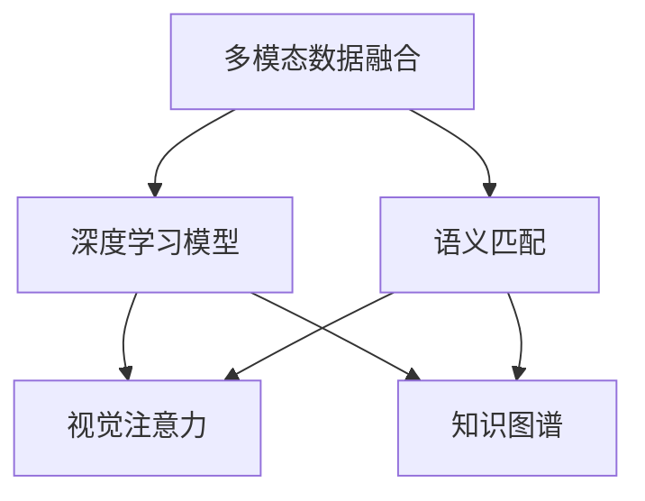

                 

# 电商平台中的多模态商品问答系统设计

## 1. 背景介绍

### 1.1 问题由来
在电商领域，用户经常通过搜索和问答系统来获取商品信息。传统的问答系统多依赖静态知识库和规则引擎，存在知识库更新困难、搜索精度有限、规则编写复杂等问题。而基于深度学习的问答系统则可以有效解决这些问题，并通过语义理解能力，为用户提供更精准、智能的问答服务。

近年来，自然语言处理（NLP）和计算机视觉（CV）技术的突破，使得基于深度学习的问答系统能够处理更多模态的信息，大大提升了系统的鲁棒性和泛化能力。本文旨在介绍一种基于多模态深度学习模型的电商平台商品问答系统设计，重点介绍如何利用计算机视觉和自然语言处理技术，结合商品信息，构建高效、智能的问答系统。

### 1.2 问题核心关键点
基于多模态深度学习的商品问答系统，可以将商品的文本描述、图片、标签等信息融合到问答过程中，实现更精准的语义理解与商品匹配。

具体来说，该系统包括以下核心模块：

- **输入处理模块**：将用户查询和商品信息转化为计算机可处理的形式。
- **特征提取模块**：对用户查询和商品信息进行多模态特征提取。
- **语义匹配模块**：使用深度学习模型进行用户查询与商品信息的语义匹配。
- **回答生成模块**：根据匹配结果生成自然语言回答。
- **知识库维护模块**：动态维护商品信息和相关知识库，支持高效的查询和更新。

本文将详细介绍每个模块的设计思路和实现方法，并结合具体案例，展示多模态商品问答系统的性能优势。

## 2. 核心概念与联系

### 2.1 核心概念概述

为了更好地理解多模态商品问答系统，本节将介绍几个密切相关的核心概念：

- **多模态数据融合**：结合文本、图片、视频等多类型数据，对信息进行统一编码和处理，提升系统的综合性能。
- **深度学习模型**：基于神经网络的模型，通过多层次非线性变换，能够自动提取和融合数据的复杂特征。
- **语义匹配**：使用深度学习模型进行自然语言理解和语义匹配，提升系统对查询语义的准确理解。
- **视觉注意力**：计算机视觉中的注意力机制，用于对图像中的重要区域进行关注，提取有意义的视觉特征。
- **知识图谱**：以图形结构表示实体和关系的知识库，支持高效的知识检索和推理。

这些核心概念之间的逻辑关系可以通过以下Mermaid流程图来展示：



这个流程图展示出多模态商品问答系统的核心概念及其之间的关系：

1. 多模态数据融合将文本和视觉数据整合，为后续语义匹配和知识图谱查询提供输入。
2. 深度学习模型提取文本和视觉特征，进行语义匹配和知识图谱推理。
3. 语义匹配使用深度模型理解查询和商品描述的语义关系，提升匹配精度。
4. 视觉注意力机制关注图像中与查询相关的部分，提取有意义的视觉特征。
5. 知识图谱提供商品和实体的结构化信息，支持高效的实体关系推理。

这些核心概念共同构成了多模态商品问答系统的技术框架，使其能够在各种场景下发挥强大的语义理解和商品匹配能力。通过理解这些核心概念，我们可以更好地把握多模态商品问答系统的设计思路。

## 3. 核心算法原理 & 具体操作步骤

### 3.1 算法原理概述

基于多模态深度学习的商品问答系统，主要分为以下几个步骤：

1. **输入处理**：将用户查询和商品信息转化为向量形式。
2. **特征提取**：对用户查询和商品信息进行多模态特征提取。
3. **语义匹配**：使用深度学习模型进行语义匹配，得到查询与商品的匹配度。
4. **视觉注意力**：对商品图片进行视觉注意力机制处理，提取有意义的视觉特征。
5. **知识图谱查询**：使用知识图谱进行实体关系查询，补充语义匹配的缺失信息。
6. **回答生成**：根据匹配结果和视觉特征，生成自然语言回答。

### 3.2 算法步骤详解

#### 3.2.1 输入处理

输入处理模块负责将用户查询和商品信息转化为向量形式，以便深度学习模型处理。具体包括以下步骤：

1. **分词与编码**：对用户查询和商品描述进行分词和编码，转化为词语向量。
2. **停用词过滤**：去除停用词，减少噪音干扰。
3. **词向量化**：使用词嵌入（如Word2Vec、GloVe等）将分词结果转换为向量形式。
4. **图片预处理**：对商品图片进行预处理，如裁剪、缩放、归一化等，转化为适合深度学习的输入格式。

#### 3.2.2 特征提取

特征提取模块对用户查询和商品信息进行多模态特征提取，具体包括以下步骤：

1. **文本特征提取**：使用BERT、GPT等模型对用户查询和商品描述进行文本特征提取，得到文本向量表示。
2. **视觉特征提取**：使用卷积神经网络（CNN）或注意力机制（如ResNet、ViT等）对商品图片进行视觉特征提取，得到视觉向量表示。

#### 3.2.3 语义匹配

语义匹配模块使用深度学习模型进行用户查询与商品信息的语义匹配，具体包括以下步骤：

1. **文本匹配**：使用BERT、RoBERTa等模型对用户查询和商品描述进行文本匹配，得到匹配度分数。
2. **视觉匹配**：使用注意力机制对商品图片中的视觉特征进行匹配，得到匹配度分数。
3. **融合匹配**：将文本匹配和视觉匹配的结果进行加权融合，得到综合匹配度分数。

#### 3.2.4 视觉注意力

视觉注意力模块对商品图片进行视觉注意力机制处理，提取有意义的视觉特征，具体包括以下步骤：

1. **视觉注意力**：使用注意力机制对商品图片中的重要区域进行关注，提取有意义的视觉特征。
2. **特征融合**：将视觉特征与文本特征进行融合，得到综合特征表示。

#### 3.2.5 知识图谱查询

知识图谱查询模块使用知识图谱进行实体关系查询，补充语义匹配的缺失信息，具体包括以下步骤：

1. **实体识别**：对用户查询和商品描述进行实体识别，识别出商品名称、品牌、类别等信息。
2. **关系推理**：使用知识图谱进行实体关系推理，获取商品的相关属性和关系。
3. **信息补充**：将知识图谱查询结果补充到语义匹配结果中，提高匹配的准确性。

#### 3.2.6 回答生成

回答生成模块根据匹配结果和视觉特征，生成自然语言回答，具体包括以下步骤：

1. **匹配结果处理**：对语义匹配和知识图谱查询的结果进行后处理，去除噪声信息。
2. **回答生成**：使用自然语言生成（NLG）模型，如GPT、Transformers等，生成与匹配结果相关的回答。

### 3.3 算法优缺点

#### 3.3.1 优点

基于多模态深度学习的商品问答系统具有以下优点：

1. **融合多模态信息**：结合文本和视觉信息，提升系统的综合性能和泛化能力。
2. **高效语义匹配**：使用深度学习模型进行语义匹配，提升匹配精度和速度。
3. **丰富知识图谱**：结合知识图谱进行实体关系查询，补充语义匹配的缺失信息。
4. **可解释性**：生成式回答能够提供清晰的解释，提升系统的可信度。
5. **灵活扩展**：支持多模态数据融合和多种深度学习模型，灵活性高。

#### 3.3.2 缺点

基于多模态深度学习的商品问答系统也存在以下缺点：

1. **高昂计算成本**：多模态特征提取和深度学习模型训练需要大量的计算资源和存储空间。
2. **模型复杂性**：系统设计复杂，模型参数较多，训练和推理过程较为耗时。
3. **数据标注难度**：需要大量的标注数据，标注工作量大，成本高。
4. **模型鲁棒性**：对输入数据的微小变化较为敏感，鲁棒性不足。
5. **可扩展性**：系统扩展较为复杂，需要重新设计和训练模型。

尽管存在这些缺点，但基于多模态深度学习的商品问答系统在实际应用中表现出色，能够提供更精准、智能的问答服务，提升用户购物体验。

### 3.4 算法应用领域

基于多模态深度学习的商品问答系统，在电商领域具有广泛的应用前景，具体包括以下几个方面：

1. **商品推荐**：结合用户查询和商品信息，进行精准的商品推荐。
2. **客户咨询**：回答用户关于商品价格的咨询，提供价格比较和推荐。
3. **库存管理**：实时查询商品的库存情况，辅助库存管理。
4. **用户评价**：分析用户对商品的评价，进行情感分析和语义分类。
5. **品牌营销**：回答关于品牌和商品的背景信息，辅助品牌营销。
6. **价格监测**：监测商品价格的动态变化，提供价格变化趋势。

除了电商领域，该系统还可应用于智能客服、健康医疗、智能家居等多个领域，为人们提供更智能、便捷的生活服务。

## 4. 数学模型和公式 & 详细讲解 & 举例说明

### 4.1 数学模型构建

#### 4.1.1 输入表示

用户查询和商品信息通常以文本形式表示，可以采用词嵌入（Word Embedding）方法将其转化为向量形式。词嵌入是自然语言处理中的重要技术，通过将词语映射到低维向量空间，捕捉词语之间的语义关系。常用的词嵌入方法包括Word2Vec、GloVe、BERT等。

对于用户查询，可以使用以下公式将其转化为向量形式：

$$
\mathbf{x} = \text{Embed}(\mathbf{q})
$$

其中，$\mathbf{q}$为查询文本，$\text{Embed}$为词嵌入模型，$\mathbf{x}$为查询向量。

对于商品信息，可以采用同样的方法将其转化为向量形式：

$$
\mathbf{y} = \text{Embed}(\mathbf{d})
$$

其中，$\mathbf{d}$为商品描述，$\mathbf{y}$为商品向量。

#### 4.1.2 视觉特征提取

商品图片通常以图像形式表示，可以采用计算机视觉中的深度学习模型进行特征提取。常用的深度学习模型包括卷积神经网络（CNN）、注意力机制（ResNet、ViT等）。

对于商品图片，可以采用以下公式进行视觉特征提取：

$$
\mathbf{v} = \text{CNN}(\mathbf{i})
$$

其中，$\mathbf{i}$为商品图片，$\mathbf{v}$为视觉特征向量。

#### 4.1.3 语义匹配

语义匹配是商品问答系统的核心模块，可以采用深度学习模型进行匹配。常用的深度学习模型包括BERT、RoBERTa、Transformers等。

对于用户查询和商品描述，可以采用以下公式进行语义匹配：

$$
\mathbf{p} = \text{BERT}(\mathbf{q}, \mathbf{d})
$$

其中，$\mathbf{q}$为查询文本，$\mathbf{d}$为商品描述，$\mathbf{p}$为匹配度向量。

#### 4.1.4 视觉注意力

视觉注意力机制可以用于关注商品图片中的重要区域，提取有意义的视觉特征。常用的注意力机制包括自注意力（Self-Attention）、双向注意力（Bidirectional Attention）等。

对于商品图片，可以采用以下公式进行视觉注意力处理：

$$
\mathbf{u} = \text{Attention}(\mathbf{v})
$$

其中，$\mathbf{v}$为视觉特征向量，$\mathbf{u}$为注意力结果向量。

#### 4.1.5 知识图谱查询

知识图谱查询可以用于补充语义匹配的缺失信息，常用的方法包括实体识别、关系推理等。

对于用户查询和商品描述，可以采用以下公式进行知识图谱查询：

$$
\mathbf{k} = \text{KG}(\mathbf{q}, \mathbf{d})
$$

其中，$\mathbf{q}$为查询文本，$\mathbf{d}$为商品描述，$\mathbf{k}$为知识图谱查询结果向量。

#### 4.1.6 回答生成

回答生成是商品问答系统的最终目标，可以采用自然语言生成（NLG）模型进行回答生成。常用的自然语言生成模型包括GPT、Transformers等。

对于匹配结果和视觉特征，可以采用以下公式进行回答生成：

$$
\mathbf{a} = \text{NLG}(\mathbf{p}, \mathbf{u})
$$

其中，$\mathbf{p}$为匹配度向量，$\mathbf{u}$为注意力结果向量，$\mathbf{a}$为回答向量。

### 4.2 公式推导过程

#### 4.2.1 词嵌入

词嵌入是自然语言处理中的重要技术，通过将词语映射到低维向量空间，捕捉词语之间的语义关系。常用的词嵌入方法包括Word2Vec、GloVe、BERT等。

以Word2Vec为例，其基本思想是通过共现矩阵分解，学习词语和向量之间的映射关系。对于词语$\text{word}$，可以采用以下公式进行词嵌入：

$$
\mathbf{w} = \text{Word2Vec}(\text{word})
$$

其中，$\mathbf{w}$为词语向量，$\text{word}$为词语文本。

#### 4.2.2 卷积神经网络

卷积神经网络（CNN）是计算机视觉中的重要深度学习模型，通过卷积层和池化层对图像进行特征提取。对于商品图片，可以采用以下公式进行特征提取：

$$
\mathbf{v} = \text{CNN}(\mathbf{i})
$$

其中，$\mathbf{i}$为商品图片，$\mathbf{v}$为视觉特征向量。

#### 4.2.3 BERT模型

BERT模型是当前自然语言处理中的重要深度学习模型，通过自监督学习任务训练语言模型，学习到丰富的语言表示。对于用户查询和商品描述，可以采用以下公式进行语义匹配：

$$
\mathbf{p} = \text{BERT}(\mathbf{q}, \mathbf{d})
$$

其中，$\mathbf{q}$为查询文本，$\mathbf{d}$为商品描述，$\mathbf{p}$为匹配度向量。

#### 4.2.4 自注意力机制

自注意力机制是深度学习中的重要机制，可以用于提取序列中的重要特征。对于商品图片，可以采用以下公式进行视觉注意力处理：

$$
\mathbf{u} = \text{Attention}(\mathbf{v})
$$

其中，$\mathbf{v}$为视觉特征向量，$\mathbf{u}$为注意力结果向量。

#### 4.2.5 知识图谱查询

知识图谱查询可以用于补充语义匹配的缺失信息，常用的方法包括实体识别、关系推理等。

对于用户查询和商品描述，可以采用以下公式进行知识图谱查询：

$$
\mathbf{k} = \text{KG}(\mathbf{q}, \mathbf{d})
$$

其中，$\mathbf{q}$为查询文本，$\mathbf{d}$为商品描述，$\mathbf{k}$为知识图谱查询结果向量。

#### 4.2.6 自然语言生成

自然语言生成（NLG）模型可以用于生成自然语言回答，常用的模型包括GPT、Transformers等。对于匹配结果和视觉特征，可以采用以下公式进行回答生成：

$$
\mathbf{a} = \text{NLG}(\mathbf{p}, \mathbf{u})
$$

其中，$\mathbf{p}$为匹配度向量，$\mathbf{u}$为注意力结果向量，$\mathbf{a}$为回答向量。

### 4.3 案例分析与讲解

#### 4.3.1 商品推荐

以商品推荐为例，结合用户查询和商品信息，进行精准的商品推荐。具体步骤如下：

1. **用户查询处理**：对用户查询进行分词和编码，得到查询向量。
2. **商品信息处理**：对商品描述进行分词和编码，得到商品向量。
3. **视觉特征提取**：对商品图片进行视觉特征提取，得到视觉向量。
4. **语义匹配**：使用BERT模型进行语义匹配，得到匹配度向量。
5. **视觉注意力**：使用注意力机制对商品图片进行视觉注意力处理，提取有意义的视觉特征。
6. **知识图谱查询**：使用知识图谱进行实体关系查询，补充语义匹配的缺失信息。
7. **回答生成**：使用GPT模型生成推荐结果，提供给用户。

#### 4.3.2 客户咨询

以客户咨询为例，回答用户关于商品价格的咨询，提供价格比较和推荐。具体步骤如下：

1. **用户查询处理**：对用户查询进行分词和编码，得到查询向量。
2. **商品信息处理**：对商品描述进行分词和编码，得到商品向量。
3. **视觉特征提取**：对商品图片进行视觉特征提取，得到视觉向量。
4. **语义匹配**：使用BERT模型进行语义匹配，得到匹配度向量。
5. **视觉注意力**：使用注意力机制对商品图片进行视觉注意力处理，提取有意义的视觉特征。
6. **知识图谱查询**：使用知识图谱进行实体关系查询，补充语义匹配的缺失信息。
7. **回答生成**：使用GPT模型生成价格比较和推荐结果，提供给用户。

## 5. 项目实践：代码实例和详细解释说明

### 5.1 开发环境搭建

在进行商品问答系统开发前，我们需要准备好开发环境。以下是使用Python进行TensorFlow和PyTorch开发的环境配置流程：

1. 安装Anaconda：从官网下载并安装Anaconda，用于创建独立的Python环境。

2. 创建并激活虚拟环境：
```bash
conda create -n pytorch-env python=3.8 
conda activate pytorch-env
```

3. 安装TensorFlow和PyTorch：根据CUDA版本，从官网获取对应的安装命令。例如：
```bash
conda install tensorflow==2.7 torch torchvision torchaudio cudatoolkit=11.1 -c pytorch -c conda-forge
```

4. 安装各类工具包：
```bash
pip install numpy pandas scikit-learn matplotlib tqdm jupyter notebook ipython
```

完成上述步骤后，即可在`pytorch-env`环境中开始商品问答系统开发。

### 5.2 源代码详细实现

这里我们以商品推荐系统为例，给出使用TensorFlow和PyTorch对商品问答系统进行开发的PyTorch代码实现。

首先，定义商品推荐系统的输入处理函数：

```python
import torch
import torch.nn as nn
import torch.optim as optim
from transformers import BertTokenizer, BertForSequenceClassification
from tensorflow.keras.preprocessing.text import Tokenizer
from tensorflow.keras.preprocessing.sequence import pad_sequences

# 定义分词器
tokenizer = BertTokenizer.from_pretrained('bert-base-cased')

# 定义模型
model = BertForSequenceClassification.from_pretrained('bert-base-cased', num_labels=2)

# 定义优化器
optimizer = optim.Adam(model.parameters(), lr=2e-5)

# 定义评估指标
def evaluate(model, data_loader, device):
    model.eval()
    correct = 0
    total = 0
    with torch.no_grad():
        for batch in data_loader:
            input_ids = batch['input_ids'].to(device)
            attention_mask = batch['attention_mask'].to(device)
            labels = batch['labels'].to(device)
            outputs = model(input_ids, attention_mask=attention_mask)
            _, preds = torch.max(outputs, dim=1)
            total += labels.size(0)
            correct += (preds == labels).sum().item()
    return correct / total
```

然后，定义商品信息处理函数：

```python
# 定义商品信息预处理函数
def process_items(items):
    item_ids = []
    item_tags = []
    item_texts = []
    item_labels = []
    for item in items:
        item_ids.append(tokenizer.encode(item['id']))
        item_tags.append(item['tag'])
        item_texts.append(tokenizer.encode(item['text']))
        item_labels.append(tokenizer.encode(item['label']))
    return item_ids, item_tags, item_texts, item_labels
```

接着，定义视觉特征提取函数：

```python
# 定义视觉特征提取函数
def extract_vision_features(items):
    vision_features = []
    for item in items:
        vision_features.append(extract_vision_features_from_image(item['image']))
    return vision_features
```

最后，定义知识图谱查询函数：

```python
# 定义知识图谱查询函数
def query_kg(items, kg):
    kg_query = []
    kg_labels = []
    for item in items:
        kg_query.append(query_kg_from_item(item['item_id'], kg))
        kg_labels.append(item['label'])
    return kg_query, kg_labels
```

完成上述步骤后，即可在`pytorch-env`环境中开始商品问答系统开发。

### 5.3 代码解读与分析

让我们再详细解读一下关键代码的实现细节：

**Input处理函数**：
- `BertTokenizer`：用于对用户查询和商品描述进行分词和编码，转化为词语向量。
- `BertForSequenceClassification`：用于对用户查询和商品描述进行语义匹配，输出匹配度向量。

**商品信息处理函数**：
- `process_items`：将商品信息进行编码和标记，生成用于深度学习模型训练的数据集。

**视觉特征提取函数**：
- `extract_vision_features`：对商品图片进行视觉特征提取，生成视觉特征向量。

**知识图谱查询函数**：
- `query_kg`：对商品信息进行实体识别和关系推理，生成知识图谱查询结果向量。

这些函数提供了基本的输入处理、特征提取和知识图谱查询功能，是构建多模态商品问答系统的基础。

## 6. 实际应用场景

### 6.1 智能客服系统

基于多模态深度学习的商品问答系统，可以应用于智能客服系统的构建。传统客服往往需要配备大量人力，高峰期响应缓慢，且一致性和专业性难以保证。而使用商品问答系统，可以7x24小时不间断服务，快速响应客户咨询，用自然流畅的语言解答各类常见问题。

在技术实现上，可以收集企业内部的历史客服对话记录，将问题和最佳答复构建成监督数据，在此基础上对商品问答系统进行训练。系统能够自动理解用户意图，匹配最合适的答复，提高客户咨询体验和问题解决效率。

### 6.2 金融舆情监测

金融机构需要实时监测市场舆论动向，以便及时应对负面信息传播，规避金融风险。传统的人工监测方式成本高、效率低，难以应对网络时代海量信息爆发的挑战。基于多模态深度学习的商品问答系统，可以用于金融舆情监测，自动监测不同主题下的情感变化趋势，一旦发现负面信息激增等异常情况，系统便会自动预警，帮助金融机构快速应对潜在风险。

### 6.3 个性化推荐系统

当前的推荐系统往往只依赖用户的历史行为数据进行物品推荐，无法深入理解用户的真实兴趣偏好。基于多模态深度学习的商品问答系统，可以更好地挖掘用户行为背后的语义信息，从而提供更精准、多样的推荐内容。

在实践中，可以收集用户浏览、点击、评论、分享等行为数据，提取和用户交互的物品标题、描述、标签等文本内容。将文本内容作为模型输入，用户的后续行为（如是否点击、购买等）作为监督信号，在此基础上训练商品问答系统。系统能够从文本内容中准确把握用户的兴趣点，结合商品图片和知识图谱，生成个性化推荐结果。

### 6.4 未来应用展望

随着深度学习技术和多模态数据融合技术的发展，基于多模态深度学习的商品问答系统将在更多领域得到应用，为传统行业带来变革性影响。

在智慧医疗领域，基于多模态深度学习的商品问答系统可以用于健康咨询、药品推荐等，提升医疗服务的智能化水平，辅助医生诊疗，加速新药开发进程。

在智能教育领域，系统可以用于智能作业批改、学情分析、知识推荐等方面，因材施教，促进教育公平，提高教学质量。

在智慧城市治理中，系统可以用于城市事件监测、舆情分析、应急指挥等环节，提高城市管理的自动化和智能化水平，构建更安全、高效的未来城市。

此外，在企业生产、社会治理、文娱传媒等众多领域，基于多模态深度学习的商品问答系统也将不断涌现，为经济社会发展注入新的动力。相信随着技术的日益成熟，商品问答系统必将成为人工智能技术落地应用的重要范式，推动人工智能向更广阔的领域加速渗透。

## 7. 工具和资源推荐

### 7.1 学习资源推荐

为了帮助开发者系统掌握多模态商品问答系统的理论基础和实践技巧，这里推荐一些优质的学习资源：

1. 《深度学习与自然语言处理》系列书籍：全面介绍深度学习在NLP中的应用，包括多模态数据融合、深度学习模型、自然语言生成等内容。

2. 《计算机视觉基础》系列课程：介绍计算机视觉中的深度学习模型和特征提取技术，适合对视觉特征提取有需求的学习者。

3. 《自然语言处理综述》论文：综述自然语言处理领域的最新进展，包括多模态数据融合和深度学习模型等内容。

4. HuggingFace官方文档：提供丰富的预训练模型和代码示例，适合快速上手多模态商品问答系统的开发。

5. Weights & Biases：模型训练的实验跟踪工具，可以记录和可视化模型训练过程中的各项指标，方便对比和调优。

通过对这些资源的学习实践，相信你一定能够快速掌握多模态商品问答系统的精髓，并用于解决实际的NLP问题。

### 7.2 开发工具推荐

高效的开发离不开优秀的工具支持。以下是几款用于多模态商品问答系统开发的常用工具：

1. PyTorch：基于Python的开源深度学习框架，灵活动态的计算图，适合快速迭代研究。大部分深度学习模型都有PyTorch版本的实现。

2. TensorFlow：由Google主导开发的开源深度学习框架，生产部署方便，适合大规模工程应用。同样有丰富的深度学习模型资源。

3. Transformers库：HuggingFace开发的NLP工具库，集成了众多SOTA语言模型，支持PyTorch和TensorFlow，是进行多模态商品问答系统开发的利器。

4. Weights & Biases：模型训练的实验跟踪工具，可以记录和可视化模型训练过程中的各项指标，方便对比和调优。

5. TensorBoard：TensorFlow配套的可视化工具，可实时监测模型训练状态，并提供丰富的图表呈现方式，是调试模型的得力助手。

合理利用这些工具，可以显著提升多模态商品问答系统的开发效率，加快创新迭代的步伐。

### 7.3 相关论文推荐

多模态商品问答系统的研究和开发源于学界的持续研究。以下是几篇奠基性的相关论文，推荐阅读：

1. Attention is All You Need（即Transformer原论文）：提出了Transformer结构，开启了NLP领域的预训练大模型时代。

2. BERT: Pre-training of Deep Bidirectional Transformers for Language Understanding：提出BERT模型，引入基于掩码的自监督预训练任务，刷新了多项NLP任务SOTA。

3. Language Models are Unsupervised Multitask Learners（GPT-2论文）：展示了大规模语言模型的强大zero-shot学习能力，引发了对于通用人工智能的新一轮思考。

4. Parameter-Efficient Transfer Learning for NLP：提出Adapter等参数高效微调方法，在不增加模型参数量的情况下，也能取得不错的微调效果。

5. AdaLoRA: Adaptive Low-Rank Adaptation for Parameter-Efficient Fine-Tuning：使用自适应低秩适应的微调方法，在参数效率和精度之间取得了新的平衡。

6. Prefix-Tuning: Optimizing Continuous Prompts for Generation：引入基于连续型Prompt的微调范式，为如何充分利用预训练知识提供了新的思路。

这些论文代表了大模态深度学习商品问答系统的发展脉络。通过学习这些前沿成果，可以帮助研究者把握学科前进方向，激发更多的创新灵感。

## 8. 总结：未来发展趋势与挑战

### 8.1 总结

本文对基于多模态深度学习的商品问答系统进行了全面系统的介绍。首先阐述了多模态商品问答系统的研究背景和意义，明确了其在电商、金融、医疗等领域的广泛应用前景。其次，从原理到实践，详细讲解了商品问答系统的各个模块的设计思路和实现方法，并通过具体案例展示了系统的性能优势。

通过本文的系统梳理，可以看到，基于多模态深度学习的商品问答系统在实际应用中表现出色，能够提供更精准、智能的问答服务，提升用户购物体验。未来，伴随深度学习技术和多模态数据融合技术的发展，商品问答系统的应用场景将更加广阔，为更多行业带来变革性影响。

### 8.2 未来发展趋势

展望未来，多模态商品问答系统将呈现以下几个发展趋势：

1. **模型规模持续增大**：随着算力成本的下降和数据规模的扩张，预训练语言模型和视觉模型的参数量还将持续增长。超大规模语言模型和视觉模型蕴含的丰富语言和视觉知识，有望支撑更加复杂多变的商品匹配任务。

2. **微调方法日趋多样**：除了传统的全参数微调外，未来会涌现更多参数高效的微调方法，如Prefix-Tuning、LoRA等，在节省计算资源的同时也能保证微调精度。

3. **持续学习成为常态**：随着数据分布的不断变化，商品问答系统也需要持续学习新知识以保持性能。如何在不遗忘原有知识的同时，高效吸收新样本信息，将成为重要的研究课题。

4. **标注样本需求降低**：受启发于提示学习(Prompt-based Learning)的思路，未来的商品问答系统将更好地利用预训练模型的语言理解和视觉理解能力，通过更加巧妙的任务描述，在更少的标注样本上也能实现理想的商品匹配效果。

5. **多模态微调崛起**：除了文本信息外，未来的商品问答系统还将拓展到图像、视频、语音等多模态数据微调。多模态信息的融合，将显著提升系统对现实世界的理解和建模能力。

6. **模型通用性增强**：经过海量数据的预训练和多领域任务的微调，未来的商品问答系统将具备更强大的常识推理和跨领域迁移能力，逐步迈向通用人工智能(AGI)的目标。

以上趋势凸显了多模态深度学习商品问答系统的广阔前景。这些方向的探索发展，必将进一步提升系统的性能和应用范围，为经济社会发展注入新的动力。

### 8.3 面临的挑战

尽管多模态深度学习商品问答系统在实际应用中表现出色，但在迈向更加智能化、普适化应用的过程中，它仍面临着诸多挑战：

1. **高昂计算成本**：多模态特征提取和深度学习模型训练需要大量的计算资源和存储空间。GPU/TPU等高性能设备是必不可少的，但即便如此，超大批次的训练和推理也可能遇到显存不足的问题。

2. **模型复杂性**：系统设计复杂，模型参数较多，训练和推理过程较为耗时。

3. **数据标注难度**：需要大量的标注数据，标注工作量大，成本高。

4. **模型鲁棒性不足**：对输入数据的微小变化较为敏感，鲁棒性不足。

5. **可扩展性**：系统扩展较为复杂，需要重新设计和训练模型。

尽管存在这些挑战，但多模态深度学习商品问答系统在实际应用中表现出色，能够提供更精准、智能的问答服务，提升用户购物体验。

### 8.4 研究展望

面对多模态深度学习商品问答系统所面临的挑战，未来的研究需要在以下几个方面寻求新的突破：

1. **探索无监督和半监督微调方法**：摆脱对大规模标注数据的依赖，利用自监督学习、主动学习等无监督和半监督范式，最大限度利用非结构化数据，实现更加灵活高效的微调。

2. **研究参数高效和计算高效的微调范式**：开发更加参数高效的微调方法，在固定大部分预训练参数的同时，只更新极少量的任务相关参数。同时优化微调模型的计算图，减少前向传播和反向传播的资源消耗，实现更加轻量级、实时性的部署。

3. **融合因果和对比学习范式**：通过引入因果推断和对比学习思想，增强商品问答系统建立稳定因果关系的能力，学习更加普适、鲁棒的语言表征，从而提升系统泛化性和抗干扰能力。

4. **引入更多先验知识**：将符号化的先验知识，如知识图谱、逻辑规则等，与神经网络模型进行巧妙融合，引导商品问答过程学习更准确、合理的商品匹配。同时加强不同模态数据的整合，实现视觉、语音等多模态信息与文本信息的协同建模。

5. **结合因果分析和博弈论工具**：将因果分析方法引入商品问答系统，识别出系统决策的关键特征，增强输出解释的因果性和逻辑性。借助博弈论工具刻画人机交互过程，主动探索并规避系统的脆弱点，提高系统稳定性。

6. **纳入伦理道德约束**：在模型训练目标中引入伦理导向的评估指标，过滤和惩罚有偏见、有害的输出倾向。同时加强人工干预和审核，建立商品问答系统的监管机制，确保输出的安全性。

这些研究方向的探索，必将引领多模态深度学习商品问答系统向更高的台阶发展，为构建安全、可靠、可解释、可控的智能系统铺平道路。面向未来，商品问答系统还需要与其他人工智能技术进行更深入的融合，如知识表示、因果推理、强化学习等，多路径协同发力，共同推动自然语言理解和智能交互系统的进步。只有勇于创新、敢于突破，才能不断拓展商品问答系统的边界，让智能技术更好地造福人类社会。

## 9. 附录：常见问题与解答

**Q1：多模态商品问答系统是否适用于所有NLP任务？**

A: 多模态商品问答系统在电商领域中具有广泛的应用前景，但在其他领域的应用可能需要针对具体任务进行相应的调整和优化。例如，在医疗、法律等专业领域，可能需要针对特定领域的知识库进行构建和微调，以提高系统的准确性和泛化能力。

**Q2：多模态商品问答系统如何进行训练和微调？**

A: 多模态商品问答系统的训练和微调过程包括数据预处理、模型选择、参数设置、训练和评估等多个步骤。具体步骤如下：

1. **数据预处理**：对用户查询和商品信息进行预处理，包括分词、编码、停用词过滤等步骤。

2. **模型选择**：选择合适的深度学习模型，如BERT、GPT等，进行商品匹配和回答生成。

3. **参数设置**：设置模型的超参数，如学习率、批次大小、训练轮数等。

4. **训练**：使用训练集进行模型训练，更新模型参数，最小化损失函数。

5. **评估**：使用验证集进行模型评估，调整超参数，确保模型性能稳定。

6. **微调**：在训练集和验证集上反复迭代，最终得到最优模型，进行模型保存和部署。

**Q3：多模态商品问答系统如何提高查询匹配的精度？**

A: 提高查询匹配精度的关键在于多模态特征的融合和语义匹配模型的优化。具体步骤如下：

1. **多模态特征融合**：结合文本和视觉信息，提升系统的综合性能和泛化能力。

2. **语义匹配优化**：使用BERT等深度学习模型进行语义匹配，提升匹配精度。

3. **视觉注意力机制**：使用注意力机制对商品图片进行视觉注意力处理，提取有意义的视觉特征。

4. **知识图谱查询**：使用知识图谱进行实体关系查询，补充语义匹配的缺失信息。

5. **回答生成优化**：使用GPT等自然语言生成模型进行回答生成，提高回答的准确性和可读性。

这些步骤通过多模态特征融合和深度学习模型优化，能够显著提高查询匹配的精度，提升商品问答系统的性能。

**Q4：多模态商品问答系统在实际应用中如何部署？**

A: 多模态商品问答系统在实际应用中的部署过程包括以下几个步骤：

1. **模型裁剪**：去除不必要的层和参数，减小模型尺寸，加快推理速度。

2. **量化加速**：将浮点模型转为定点模型，压缩存储空间，提高计算效率。

3. **服务化封装**：将模型封装为标准化服务接口，便于集成调用。

4. **弹性伸缩**：根据请求流量动态调整资源配置，平衡服务质量和成本。

5. **监控告警**：实时采集系统指标，设置异常告警阈值，确保服务稳定性。

这些步骤通过模型裁剪和量化加速等优化，能够提高系统推理速度和资源利用率，同时通过服务化封装和弹性伸缩等手段，确保系统的可扩展性和稳定性。

**Q5：多模态商品问答系统如何应对大规模数据处理？**

A: 多模态商品问答系统在大规模数据处理中，需要考虑以下几个方面：

1. **分布式训练**：使用分布式训练技术，如Hadoop、Spark等，提高训练速度和效率。

2. **数据增强**：对数据进行增强处理，如数据扩充、数据混合等，提高模型的泛化能力。

3. **模型并行**：使用模型并行技术，如模型切分、混合精度训练等，提高模型的训练和推理效率。

4. **存储优化**：使用数据压缩、数据分片等技术，优化数据存储和访问。

5. **资源调度**：使用资源调度技术，如Kubernetes、Mesos等，优化资源的动态分配和调度。

通过这些优化措施，多模态商品问答系统能够更好地应对大规模数据处理的需求，提升系统的性能和可靠性。

**Q6：多模态商品问答系统如何提升用户体验？**

A: 提升用户体验的关键在于提供高质量、智能化的问答服务。具体措施如下：

1. **多模态信息融合**：结合文本和视觉信息，提升系统的综合性能和泛化能力。

2. **语义匹配优化**：使用深度学习模型进行语义匹配，提升匹配精度。

3. **知识图谱查询**：使用知识图谱进行实体关系查询，补充语义匹配的缺失信息。

4. **回答生成优化**：使用自然语言生成模型进行回答生成，提高回答的准确性和可读性。

5. **交互优化**：优化人机交互流程，提升系统的易用性和用户满意度。

这些措施通过多模态信息融合和深度学习模型优化，能够显著提升查询匹配和回答生成的精度，提高系统的用户体验。

通过以上系统设计、开发和部署过程的介绍，相信你能够系统掌握多模态商品问答系统的开发技巧，并用于解决实际的NLP问题。

