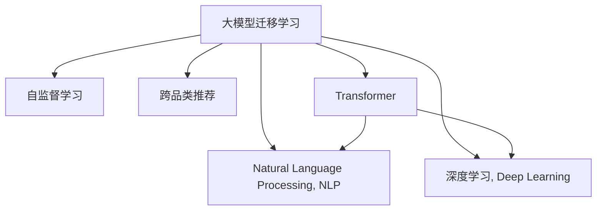

                 

# 电商平台中的大模型迁移学习在跨品类推荐中的应用

> 关键词：电商推荐,大模型迁移学习,跨品类推荐,自监督学习,自然语言处理,深度学习,Transformer

## 1. 背景介绍

### 1.1 问题由来
随着电子商务平台的快速发展，用户对于推荐系统的要求不断提高，希望得到更加个性化、精准的购物建议。传统的基于规则或统计模型的推荐系统，已难以满足日益复杂的需求。大模型迁移学习在推荐系统中的应用逐渐受到关注，成为解决这一问题的有力工具。

### 1.2 问题核心关键点
大模型迁移学习在电商平台中的应用，旨在利用预训练大模型的强大泛化能力，通过迁移学习的方式，将模型在特定领域的应用推广到新的品类，提升跨品类推荐的效果。这种迁移学习的方法可以显著降低新品类的训练数据需求，同时充分利用预训练模型的广泛知识，加快模型在跨品类推荐上的收敛速度和性能提升。

### 1.3 问题研究意义
通过大模型迁移学习在电商平台中的应用，可以有效解决商品推荐中的长尾问题，增强推荐系统的个性化和智能化水平。这对于电商平台优化用户体验、提高商品销售转化率和用户满意度，具有重要意义：

1. **降低推荐成本**：大模型迁移学习可以通过少量标注数据进行微调，减少推荐系统在新品类上的开发成本。
2. **提高推荐效果**：预训练模型包含丰富的语言和知识表示，可以显著提升推荐系统的精度和多样性。
3. **加速迭代过程**：迁移学习使得模型快速适应新品类，缩短推荐系统的开发和迭代周期。
4. **支持个性化推荐**：大模型迁移学习可以更好地理解用户行为和偏好，提供更加个性化的推荐内容。
5. **增强系统鲁棒性**：利用预训练模型的知识，推荐系统可以应对更多的变化和不确定性，提升系统的鲁棒性和稳定性。

## 2. 核心概念与联系

### 2.1 核心概念概述

为了更好地理解电商平台中大模型迁移学习在跨品类推荐中的应用，本节将介绍几个关键概念及其相互之间的联系：

- **大模型迁移学习**：指通过迁移学习的方式，将预训练大模型在某一领域的应用，推广到新的领域或品类，以提升新领域的性能。大模型迁移学习依赖于预训练模型的强大泛化能力，可以显著减少新领域的训练数据需求。

- **自监督学习**：指通过无标签数据进行预训练，学习通用的语言表示和知识。大模型的预训练通常采用自监督学习，如语言建模、掩码语言建模等，从而获得丰富的语义和语言结构表示。

- **自然语言处理(NLP)**：指使用计算机处理、理解和生成人类语言的技术。大模型迁移学习在NLP中的应用非常广泛，如文本分类、实体识别、文本生成等。

- **深度学习(Deep Learning)**：指利用多层神经网络处理数据的机器学习方法。大模型迁移学习依赖于深度学习模型，特别是基于Transformer的预训练模型，如BERT、GPT等。

- **跨品类推荐**：指推荐系统跨越不同商品品类，为同一用户提供多种品类的个性化推荐。电商平台中的推荐系统往往需要支持多种品类，大模型迁移学习可以显著提升跨品类推荐的性能。

- **Transformer**：指一种基于自注意力机制的神经网络结构，广泛应用于自然语言处理任务，如BERT、GPT等。Transformer在预训练模型中的应用非常广泛，是构建大模型迁移学习的基础。

这些核心概念之间的逻辑关系可以通过以下Mermaid流程图来展示：



这个流程图展示了各大概念之间的联系：大模型迁移学习依赖于自监督学习和大模型预训练，其核心应用在于自然语言处理和深度学习，目的是实现跨品类推荐。

## 3. 核心算法原理 & 具体操作步骤
### 3.1 算法原理概述

基于大模型迁移学习在电商平台中的应用，其核心算法原理如下：

- **预训练**：在大规模无标签文本数据上，通过自监督学习任务训练通用语言模型，学习通用的语言知识和表示。

- **迁移学习**：在预训练模型基础上，使用目标品类的大量标注数据进行微调，使模型能够适应新品类的推荐需求，提升推荐精度和多样性。

- **跨品类推荐**：利用微调后的模型，对同一用户同时进行多种品类推荐，提高推荐系统的个性化水平。

### 3.2 算法步骤详解

基于大模型迁移学习在电商平台中的跨品类推荐，一般包括以下几个关键步骤：

**Step 1: 准备预训练模型和数据集**
- 选择合适的预训练语言模型 $M_{\theta}$ 作为初始化参数，如 BERT、GPT等。
- 准备目标品类的标注数据集 $D=\{(x_i, y_i)\}_{i=1}^N$，其中 $x_i$ 为商品描述文本，$y_i$ 为商品标签。

**Step 2: 添加任务适配层**
- 根据任务类型，在预训练模型顶层设计合适的输出层和损失函数。
- 对于分类任务，通常在顶层添加线性分类器和交叉熵损失函数。
- 对于生成任务，通常使用语言模型的解码器输出概率分布，并以负对数似然为损失函数。

**Step 3: 设置微调超参数**
- 选择合适的优化算法及其参数，如 AdamW、SGD 等，设置学习率、批大小、迭代轮数等。
- 设置正则化技术及强度，包括权重衰减、Dropout、Early Stopping 等。
- 确定冻结预训练参数的策略，如仅微调顶层，或全部参数都参与微调。

**Step 4: 执行梯度训练**
- 将训练集数据分批次输入模型，前向传播计算损失函数。
- 反向传播计算参数梯度，根据设定的优化算法和学习率更新模型参数。
- 周期性在验证集上评估模型性能，根据性能指标决定是否触发 Early Stopping。
- 重复上述步骤直到满足预设的迭代轮数或 Early Stopping 条件。

**Step 5: 测试和部署**
- 在测试集上评估微调后模型 $M_{\hat{\theta}}$ 的性能，对比微调前后的精度提升。
- 使用微调后的模型对新商品进行推荐，集成到实际的应用系统中。
- 持续收集新的商品数据，定期重新微调模型，以适应数据分布的变化。

### 3.3 算法优缺点

基于大模型迁移学习在电商平台中的应用，具有以下优点：
1. **提升推荐精度**：预训练模型具有强大的语言理解能力，可以更好地捕捉商品的语义特征。
2. **降低数据需求**：利用预训练模型的泛化能力，显著减少新品类的训练数据需求。
3. **加速迭代过程**：迁移学习使得模型快速适应新品类，缩短推荐系统的开发和迭代周期。
4. **提高个性化推荐**：大模型迁移学习可以更好地理解用户行为和偏好，提供更加个性化的推荐内容。
5. **增强系统鲁棒性**：利用预训练模型的知识，推荐系统可以应对更多的变化和不确定性，提升系统的鲁棒性和稳定性。

同时，该方法也存在一定的局限性：
1. **依赖标注数据**：微调的效果很大程度上取决于标注数据的质量和数量，获取高质量标注数据的成本较高。
2. **迁移能力有限**：当目标品类与预训练数据的分布差异较大时，微调的性能提升有限。
3. **负面效果传递**：预训练模型的固有偏见、有害信息等，可能通过微调传递到新品类，造成负面影响。
4. **可解释性不足**：微调模型的决策过程通常缺乏可解释性，难以对其推理逻辑进行分析和调试。

尽管存在这些局限性，但就目前而言，基于大模型迁移学习的方法仍是在电商平台中进行跨品类推荐的主流范式。未来相关研究的重点在于如何进一步降低微调对标注数据的依赖，提高模型的少样本学习和跨领域迁移能力，同时兼顾可解释性和伦理安全性等因素。

### 3.4 算法应用领域

基于大模型迁移学习的推荐方法，已经在电商平台中得到了广泛的应用，覆盖了几乎所有品类，例如：

- **商品推荐**：推荐系统为同一用户提供不同品类商品的个性化推荐，如服饰、美妆、家电等。通过微调使模型学习商品描述-标签映射。
- **搭配推荐**：推荐系统为同一用户提供不同品类商品的搭配建议，如服饰搭配、美妆组合等。通过微调使模型学习商品之间的协同关系。
- **品牌推荐**：推荐系统为同一用户推荐不同品类品牌的商品，如服饰品牌、美妆品牌等。通过微调使模型学习品牌间的关联和用户偏好。
- **活动推荐**：推荐系统为同一用户推荐不同品类商品的促销活动，如限时折扣、满减优惠等。通过微调使模型学习促销信息与用户行为的关系。
- **趋势推荐**：推荐系统为同一用户推荐不同品类商品的趋势信息，如流行色、热门单品等。通过微调使模型学习商品趋势的特征。

除了上述这些经典品类推荐外，大模型迁移学习还被创新性地应用到更多场景中，如个性化推荐策略优化、商品相似度计算、用户画像分析等，为电商平台推荐系统的创新提供了新的思路。

## 4. 数学模型和公式 & 详细讲解 & 举例说明
### 4.1 数学模型构建

在电商平台中，基于大模型迁移学习的跨品类推荐系统，其数学模型可以表示为：

- **预训练模型**：$M_{\theta}:\mathcal{X} \rightarrow \mathcal{Y}$，其中 $\mathcal{X}$ 为商品描述文本，$\mathcal{Y}$ 为商品标签。
- **微调目标**：$M_{\hat{\theta}}:\mathcal{X} \rightarrow \mathcal{Y}$，其中 $\hat{\theta}$ 为微调后的模型参数。
- **损失函数**：$\mathcal{L}(\hat{\theta},D)=\frac{1}{N}\sum_{i=1}^N \ell(M_{\hat{\theta}}(x_i),y_i)$，其中 $\ell$ 为交叉熵损失或均方误差损失。
- **微调优化**：$\hat{\theta}=\mathop{\arg\min}_{\theta} \mathcal{L}(\theta,D)$，其中 $D$ 为目标品类标注数据集。

### 4.2 公式推导过程

以下我们以商品分类任务为例，推导交叉熵损失函数及其梯度的计算公式。

假设模型 $M_{\hat{\theta}}$ 在输入 $x$ 上的输出为 $\hat{y}=M_{\hat{\theta}}(x) \in [0,1]$，表示商品属于某一品类的概率。真实标签 $y \in \{1,0\}$。则二分类交叉熵损失函数定义为：

$$
\ell(M_{\hat{\theta}}(x),y) = -[y\log \hat{y} + (1-y)\log (1-\hat{y})]
$$

将其代入损失函数公式，得：

$$
\mathcal{L}(\hat{\theta},D) = -\frac{1}{N}\sum_{i=1}^N [y_i\log M_{\hat{\theta}}(x_i)+(1-y_i)\log(1-M_{\hat{\theta}}(x_i))]
$$

根据链式法则，损失函数对参数 $\hat{\theta_k}$ 的梯度为：

$$
\frac{\partial \mathcal{L}(\hat{\theta},D)}{\partial \hat{\theta_k}} = -\frac{1}{N}\sum_{i=1}^N (\frac{y_i}{M_{\hat{\theta}}(x_i)}-\frac{1-y_i}{1-M_{\hat{\theta}}(x_i)}) \frac{\partial M_{\hat{\theta}}(x_i)}{\partial \hat{\theta_k}}
$$

其中 $\frac{\partial M_{\hat{\theta}}(x_i)}{\partial \hat{\theta_k}}$ 可进一步递归展开，利用自动微分技术完成计算。

在得到损失函数的梯度后，即可带入参数更新公式，完成模型的迭代优化。重复上述过程直至收敛，最终得到适应目标品类推荐的最优模型参数 $\hat{\theta}$。

### 4.3 案例分析与讲解

**案例1: 服饰品类推荐**
- **数据准备**：收集服饰品类的商品描述和用户评分数据，标注商品类别。
- **模型选择**：选择预训练的BERT模型作为初始化参数。
- **适配层设计**：在BERT模型的顶层添加线性分类器和交叉熵损失函数，用于商品类别的分类。
- **微调超参数**：设置学习率为2e-5，批大小为32，迭代轮数为10，使用AdamW优化器。
- **执行训练**：在服饰品类数据集上执行微调，每2个epoch评估一次模型性能，Early Stopping后停止训练。
- **测试部署**：在测试集上评估微调后的模型性能，对比微调前后的推荐准确率和召回率。

通过上述案例可以看出，大模型迁移学习在服饰品类推荐中的应用，可以显著提升推荐系统的效果。通过微调，模型能够更好地理解服饰品类的语义特征，同时利用预训练模型的知识，提升推荐的多样性和个性化。

**案例2: 美妆品类推荐**
- **数据准备**：收集美妆品类的商品描述和用户评分数据，标注商品类别。
- **模型选择**：选择预训练的GPT模型作为初始化参数。
- **适配层设计**：在GPT模型的顶层添加线性分类器和交叉熵损失函数，用于商品类别的分类。
- **微调超参数**：设置学习率为1e-5，批大小为16，迭代轮数为20，使用SGD优化器。
- **执行训练**：在美妆品类数据集上执行微调，每5个epoch评估一次模型性能，Early Stopping后停止训练。
- **测试部署**：在测试集上评估微调后的模型性能，对比微调前后的推荐准确率和召回率。

通过上述案例可以看出，大模型迁移学习在美妆品类推荐中的应用，同样可以显著提升推荐系统的效果。通过微调，模型能够更好地理解美妆品类的语义特征，同时利用预训练模型的知识，提升推荐的多样性和个性化。

## 5. 项目实践：代码实例和详细解释说明
### 5.1 开发环境搭建

在进行跨品类推荐实践前，我们需要准备好开发环境。以下是使用Python进行PyTorch开发的环境配置流程：

1. 安装Anaconda：从官网下载并安装Anaconda，用于创建独立的Python环境。

2. 创建并激活虚拟环境：
```bash
conda create -n pytorch-env python=3.8 
conda activate pytorch-env
```

3. 安装PyTorch：根据CUDA版本，从官网获取对应的安装命令。例如：
```bash
conda install pytorch torchvision torchaudio cudatoolkit=11.1 -c pytorch -c conda-forge
```

4. 安装Transformers库：
```bash
pip install transformers
```

5. 安装各类工具包：
```bash
pip install numpy pandas scikit-learn matplotlib tqdm jupyter notebook ipython
```

完成上述步骤后，即可在`pytorch-env`环境中开始跨品类推荐实践。

### 5.2 源代码详细实现

下面以服饰品类推荐为例，给出使用Transformers库对BERT模型进行微调的PyTorch代码实现。

首先，定义服饰品类推荐的数据处理函数：

```python
from transformers import BertTokenizer
from torch.utils.data import Dataset
import torch

class FashionDataset(Dataset):
    def __init__(self, texts, tags, tokenizer, max_len=128):
        self.texts = texts
        self.tags = tags
        self.tokenizer = tokenizer
        self.max_len = max_len
        
    def __len__(self):
        return len(self.texts)
    
    def __getitem__(self, item):
        text = self.texts[item]
        tags = self.tags[item]
        
        encoding = self.tokenizer(text, return_tensors='pt', max_length=self.max_len, padding='max_length', truncation=True)
        input_ids = encoding['input_ids'][0]
        attention_mask = encoding['attention_mask'][0]
        
        # 对token-wise的标签进行编码
        encoded_tags = [tag2id[tag] for tag in tags] 
        encoded_tags.extend([tag2id['O']] * (self.max_len - len(encoded_tags)))
        labels = torch.tensor(encoded_tags, dtype=torch.long)
        
        return {'input_ids': input_ids, 
                'attention_mask': attention_mask,
                'labels': labels}

# 标签与id的映射
tag2id = {'O': 0, 'Fashion': 1, 'Cosmetics': 2, 'Electronics': 3, 'Home': 4, 'Baby': 5, 'Health': 6}
id2tag = {v: k for k, v in tag2id.items()}

# 创建dataset
tokenizer = BertTokenizer.from_pretrained('bert-base-cased')

train_dataset = FashionDataset(train_texts, train_tags, tokenizer)
dev_dataset = FashionDataset(dev_texts, dev_tags, tokenizer)
test_dataset = FashionDataset(test_texts, test_tags, tokenizer)
```

然后，定义模型和优化器：

```python
from transformers import BertForTokenClassification, AdamW

model = BertForTokenClassification.from_pretrained('bert-base-cased', num_labels=len(tag2id))

optimizer = AdamW(model.parameters(), lr=2e-5)
```

接着，定义训练和评估函数：

```python
from torch.utils.data import DataLoader
from tqdm import tqdm
from sklearn.metrics import classification_report

device = torch.device('cuda') if torch.cuda.is_available() else torch.device('cpu')
model.to(device)

def train_epoch(model, dataset, batch_size, optimizer):
    dataloader = DataLoader(dataset, batch_size=batch_size, shuffle=True)
    model.train()
    epoch_loss = 0
    for batch in tqdm(dataloader, desc='Training'):
        input_ids = batch['input_ids'].to(device)
        attention_mask = batch['attention_mask'].to(device)
        labels = batch['labels'].to(device)
        model.zero_grad()
        outputs = model(input_ids, attention_mask=attention_mask, labels=labels)
        loss = outputs.loss
        epoch_loss += loss.item()
        loss.backward()
        optimizer.step()
    return epoch_loss / len(dataloader)

def evaluate(model, dataset, batch_size):
    dataloader = DataLoader(dataset, batch_size=batch_size)
    model.eval()
    preds, labels = [], []
    with torch.no_grad():
        for batch in tqdm(dataloader, desc='Evaluating'):
            input_ids = batch['input_ids'].to(device)
            attention_mask = batch['attention_mask'].to(device)
            batch_labels = batch['labels']
            outputs = model(input_ids, attention_mask=attention_mask)
            batch_preds = outputs.logits.argmax(dim=2).to('cpu').tolist()
            batch_labels = batch_labels.to('cpu').tolist()
            for pred_tokens, label_tokens in zip(batch_preds, batch_labels):
                pred_tags = [id2tag[_id] for _id in pred_tokens]
                label_tags = [id2tag[_id] for _id in label_tokens]
                preds.append(pred_tags[:len(label_tokens)])
                labels.append(label_tags)
                
    print(classification_report(labels, preds))
```

最后，启动训练流程并在测试集上评估：

```python
epochs = 5
batch_size = 16

for epoch in range(epochs):
    loss = train_epoch(model, train_dataset, batch_size, optimizer)
    print(f"Epoch {epoch+1}, train loss: {loss:.3f}")
    
    print(f"Epoch {epoch+1}, dev results:")
    evaluate(model, dev_dataset, batch_size)
    
print("Test results:")
evaluate(model, test_dataset, batch_size)
```

以上就是使用PyTorch对BERT进行服饰品类推荐任务微调的完整代码实现。可以看到，得益于Transformers库的强大封装，我们可以用相对简洁的代码完成BERT模型的加载和微调。

### 5.3 代码解读与分析

让我们再详细解读一下关键代码的实现细节：

**FashionDataset类**：
- `__init__`方法：初始化文本、标签、分词器等关键组件。
- `__len__`方法：返回数据集的样本数量。
- `__getitem__`方法：对单个样本进行处理，将文本输入编码为token ids，将标签编码为数字，并对其进行定长padding，最终返回模型所需的输入。

**tag2id和id2tag字典**：
- 定义了标签与数字id之间的映射关系，用于将token-wise的预测结果解码回真实的标签。

**训练和评估函数**：
- 使用PyTorch的DataLoader对数据集进行批次化加载，供模型训练和推理使用。
- 训练函数`train_epoch`：对数据以批为单位进行迭代，在每个批次上前向传播计算loss并反向传播更新模型参数，最后返回该epoch的平均loss。
- 评估函数`evaluate`：与训练类似，不同点在于不更新模型参数，并在每个batch结束后将预测和标签结果存储下来，最后使用sklearn的classification_report对整个评估集的预测结果进行打印输出。

**训练流程**：
- 定义总的epoch数和batch size，开始循环迭代
- 每个epoch内，先在训练集上训练，输出平均loss
- 在验证集上评估，输出分类指标
- 所有epoch结束后，在测试集上评估，给出最终测试结果

可以看到，PyTorch配合Transformers库使得BERT微调的代码实现变得简洁高效。开发者可以将更多精力放在数据处理、模型改进等高层逻辑上，而不必过多关注底层的实现细节。

当然，工业级的系统实现还需考虑更多因素，如模型的保存和部署、超参数的自动搜索、更灵活的任务适配层等。但核心的微调范式基本与此类似。

## 6. 实际应用场景
### 6.1 智能推荐系统

大模型迁移学习在电商平台中的应用，最典型的场景是智能推荐系统的构建。传统推荐系统往往只依赖用户的行为数据进行物品推荐，难以理解用户的真实兴趣偏好。大模型迁移学习可以通过预训练模型的语言理解能力，更好地理解用户描述和商品描述的语义特征，提升推荐系统的个性化和智能化水平。

在技术实现上，可以收集用户浏览、点击、评论、分享等行为数据，提取和用户交互的物品标题、描述、标签等文本内容。将文本内容作为模型输入，用户的后续行为（如是否点击、购买等）作为监督信号，在此基础上微调预训练语言模型。微调后的模型能够从文本内容中准确把握用户的兴趣点，提高推荐系统的推荐精度和多样性。

### 6.2 多品类交叉推荐

在电商平台中，不同品类的商品可能存在跨品类搭配的需求，如服饰搭配、美妆组合等。大模型迁移学习可以通过微调模型，更好地理解跨品类商品的协同关系，为同一用户提供多种品类商品的推荐组合。

在技术实现上，可以收集同一用户的不同品类商品描述，将其输入微调后的模型进行特征编码。通过计算不同品类商品的特征相似度，找到协同关系强的商品组合，提供给用户。这种跨品类推荐策略可以显著提升用户的购物体验和满意度，增加销售额。

### 6.3 品牌推荐系统

品牌推荐系统是电商平台推荐系统中的一类重要应用。品牌推荐系统旨在为用户推荐不同品类品牌的商品，帮助用户发现新品牌和新商品。大模型迁移学习可以通过微调模型，更好地理解品牌间的关联和用户偏好，为同一用户提供多种品类品牌的推荐。

在技术实现上，可以收集同一用户的不同品类商品品牌信息，将其输入微调后的模型进行特征编码。通过计算不同品类品牌之间的相似度，找到用户偏好的品牌组合，提供给用户。这种品牌推荐策略可以显著提升用户的品牌认知和品牌忠诚度，增加用户粘性。

### 6.4 活动推荐系统

电商平台中的活动推荐系统，旨在为用户推荐不同品类商品的促销活动，如限时折扣、满减优惠等。大模型迁移学习可以通过微调模型，更好地理解促销信息与用户行为的关系，为同一用户提供多种品类商品的促销活动推荐。

在技术实现上，可以收集同一用户的不同品类商品的促销信息，将其输入微调后的模型进行特征编码。通过计算不同品类商品促销活动的相似度，找到用户偏好的促销活动组合，提供给用户。这种活动推荐策略可以显著提升用户的购物热情和消费频率，增加销售额。

### 6.5 趋势推荐系统

电商平台中的趋势推荐系统，旨在为用户推荐不同品类商品的趋势信息，如流行色、热门单品等。大模型迁移学习可以通过微调模型，更好地理解商品的趋势特征，为同一用户提供多种品类商品的趋势信息。

在技术实现上，可以收集同一用户的不同品类商品趋势信息，将其输入微调后的模型进行特征编码。通过计算不同品类商品趋势信息的相似度，找到用户偏好的趋势信息组合，提供给用户。这种趋势推荐策略可以显著提升用户的购物方向和购物意愿，增加销售额。

## 7. 工具和资源推荐
### 7.1 学习资源推荐

为了帮助开发者系统掌握大模型迁移学习在电商平台中的应用，这里推荐一些优质的学习资源：

1. 《深度学习自然语言处理》系列课程：由斯坦福大学开设的NLP明星课程，有Lecture视频和配套作业，带你入门NLP领域的基本概念和经典模型。

2. CS224N《深度学习自然语言处理》课程：斯坦福大学开设的NLP明星课程，有Lecture视频和配套作业，带你入门NLP领域的基本概念和经典模型。

3. 《Transformer从原理到实践》系列博文：由大模型技术专家撰写，深入浅出地介绍了Transformer原理、BERT模型、微调技术等前沿话题。

4. 《Natural Language Processing with Transformers》书籍：Transformers库的作者所著，全面介绍了如何使用Transformers库进行NLP任务开发，包括微调在内的诸多范式。

5. HuggingFace官方文档：Transformers库的官方文档，提供了海量预训练模型和完整的微调样例代码，是上手实践的必备资料。

通过对这些资源的学习实践，相信你一定能够快速掌握大模型迁移学习在电商平台中的应用，并用于解决实际的推荐问题。
###  7.2 开发工具推荐

高效的开发离不开优秀的工具支持。以下是几款用于电商平台大模型迁移学习微调开发的常用工具：

1. PyTorch：基于Python的开源深度学习框架，灵活动态的计算图，适合快速迭代研究。大部分预训练语言模型都有PyTorch版本的实现。

2. TensorFlow：由Google主导开发的开源深度学习框架，生产部署方便，适合大规模工程应用。同样有丰富的预训练语言模型资源。

3. Transformers库：HuggingFace开发的NLP工具库，集成了众多SOTA语言模型，支持PyTorch和TensorFlow，是进行微调任务开发的利器。

4. Weights & Biases：模型训练的实验跟踪工具，可以记录和可视化模型训练过程中的各项指标，方便对比和调优。与主流深度学习框架无缝集成。

5. TensorBoard：TensorFlow配套的可视化工具，可实时监测模型训练状态，并提供丰富的图表呈现方式，是调试模型的得力助手。

6. Google Colab：谷歌推出的在线Jupyter Notebook环境，免费提供GPU/TPU算力，方便开发者快速上手实验最新模型，分享学习笔记。

合理利用这些工具，可以显著提升大模型迁移学习在电商平台中的应用效率，加快创新迭代的步伐。

### 7.3 相关论文推荐

大模型迁移学习在电商平台中的应用，已经在学界和业界得到了广泛的研究。以下是几篇奠基性的相关论文，推荐阅读：

1. Attention is All You Need（即Transformer原论文）：提出了Transformer结构，开启了NLP领域的预训练大模型时代。

2. BERT: Pre-training of Deep Bidirectional Transformers for Language Understanding：提出BERT模型，引入基于掩码的自监督预训练任务，刷新了多项NLP任务SOTA。

3. Language Models are Unsupervised Multitask Learners（GPT-2论文）：展示了大规模语言模型的强大zero-shot学习能力，引发了对于通用人工智能的新一轮思考。

4. Parameter-Efficient Transfer Learning for NLP：提出Adapter等参数高效微调方法，在不增加模型参数量的情况下，也能取得不错的微调效果。

5. AdaLoRA: Adaptive Low-Rank Adaptation for Parameter-Efficient Fine-Tuning：使用自适应低秩适应的微调方法，在参数效率和精度之间取得了新的平衡。

6. Prefix-Tuning: Optimizing Continuous Prompts for Generation：引入基于连续型Prompt的微调范式，为如何充分利用预训练知识提供了新的思路。

这些论文代表了大模型迁移学习在电商平台中的发展脉络。通过学习这些前沿成果，可以帮助研究者把握学科前进方向，激发更多的创新灵感。

## 8. 总结：未来发展趋势与挑战

### 8.1 总结

本文对基于大模型迁移学习在电商平台中的应用进行了全面系统的介绍。首先阐述了电商推荐系统的背景和挑战，明确了大模型迁移学习在电商平台中的应用价值。其次，从原理到实践，详细讲解了大模型迁移学习的数学模型和关键步骤，给出了电商推荐任务开发的完整代码实例。同时，本文还广泛探讨了大模型迁移学习在多个推荐场景中的应用，展示了其在电商平台中的广泛适用性。

通过本文的系统梳理，可以看到，大模型迁移学习在电商平台中的应用，通过预训练模型的强大泛化能力，显著提升了推荐系统的性能和个性化水平。未来，伴随大模型的不断发展，微调方法和推荐算法也将不断进步，将为电商平台推荐系统带来更多突破性进展。

### 8.2 未来发展趋势

展望未来，大模型迁移学习在电商平台中的应用将呈现以下几个发展趋势：

1. **模型规模持续增大**：随着算力成本的下降和数据规模的扩张，预训练语言模型的参数量还将持续增长。超大规模语言模型蕴含的丰富语言知识，有望支撑更加复杂多变的推荐任务。

2. **迁移能力增强**：未来的大模型迁移学习将更加关注跨品类、跨模态的迁移能力，使得模型能够更好地适应新的应用场景和数据类型。

3. **个性化推荐提升**：基于大模型的推荐系统将能够更好地理解用户的兴趣偏好，提供更加精准、个性化的推荐内容。

4. **系统鲁棒性增强**：预训练语言模型将更好地应对长尾数据和异常数据，提升推荐系统的鲁棒性和稳定性。

5. **推荐模型优化**：未来的推荐模型将结合知识图谱、逻辑规则等多模态信息，进一步优化推荐效果。

6. **实时性要求提高**：电商平台对推荐系统的实时性要求不断提升，未来的推荐系统将更加注重计算效率和推理速度。

以上趋势凸显了大模型迁移学习在电商平台中的广阔前景。这些方向的探索发展，必将进一步提升推荐系统的性能和用户满意度，推动电商平台向更加智能化、个性化方向发展。

### 8.3 面临的挑战

尽管大模型迁移学习在电商平台中已取得显著成效，但在迈向更加智能化、普适化应用的过程中，仍面临诸多挑战：

1. **标注数据需求**：微调的效果很大程度上取决于标注数据的质量和数量，获取高质量标注数据的成本较高。如何进一步降低微调对标注样本的依赖，将是一大难题。

2. **模型鲁棒性**：预训练模型在大规模数据上训练，可能存在一定的泛化误差。如何在跨品类推荐中避免过拟合，提升模型的泛化能力，还需要更多理论和实践的积累。

3. **计算资源**：大模型的微调和推理需要大量的计算资源，如何优化模型结构、提高计算效率，减少资源消耗，将是重要的优化方向。

4. **个性化推荐**：尽管大模型迁移学习提升了推荐系统的个性化水平，但对于不同品类、不同用户的行为模式，推荐策略的普适性和多样性仍需进一步探索。

5. **系统复杂性**：大模型的微调和应用，使得推荐系统的开发和部署变得更加复杂。如何在复杂系统中保持系统的稳定性和可靠性，还需要更多的工程实践和技术积累。

6. **安全性问题**：预训练语言模型可能学习到有害信息，如何确保推荐内容的健康性，避免模型输出有害内容，也将是重要的研究方向。

正视大模型迁移学习面临的这些挑战，积极应对并寻求突破，将是大模型迁移学习在电商平台中走向成熟的必由之路。相信随着学界和产业界的共同努力，这些挑战终将一一被克服，大模型迁移学习必将在电商平台中大放异彩，推动智能电商的发展。

### 8.4 研究展望

面对大模型迁移学习在电商平台中面临的种种挑战，未来的研究需要在以下几个方面寻求新的突破：

1. **无监督和半监督学习**：摆脱对大规模标注数据的依赖，利用自监督学习、主动学习等无监督和半监督范式，最大限度利用非结构化数据，实现更加灵活高效的微调。

2. **参数高效和计算高效的微调方法**：开发更加参数高效的微调方法，在固定大部分预训练参数的同时，只更新极少量的任务相关参数。同时优化微调模型的计算图，减少前向传播和反向传播的资源消耗，实现更加轻量级、实时性的部署。

3. **多模态推荐**：融合视觉、语音等多模态信息，实现多模态数据与文本信息的协同建模，提升推荐系统的多样性和精准度。

4. **推荐模型的跨领域迁移**：研究如何将大模型的跨领域迁移能力，应用到更多类型的推荐任务中，如视频推荐、游戏推荐等。

5. **推荐策略的个性化优化**：结合知识图谱、逻辑规则等多模态信息，进一步优化推荐策略，提升推荐系统的个性化水平。

6. **推荐系统的鲁棒性增强**：研究推荐系统的鲁棒性，提升模型对异常数据和长尾数据的泛化能力，增强推荐系统的稳定性和可靠性。

7. **推荐内容的安全性保障**：在推荐系统开发过程中，引入伦理导向的评估指标，过滤和惩罚有害内容的输出倾向，确保推荐内容的健康性。

这些研究方向将进一步推动大模型迁移学习在电商平台中的应用，为智能电商的发展注入新的动力。面向未来，大模型迁移学习技术还需要与其他人工智能技术进行更深入的融合，如知识表示、因果推理、强化学习等，多路径协同发力，共同推动智能电商的发展。只有勇于创新、敢于突破，才能不断拓展大模型迁移学习的应用边界，为智能电商带来更广阔的想象空间。

## 9. 附录：常见问题与解答

**Q1：大模型迁移学习在电商平台中的应用是否适用于所有品类推荐？**

A: 大模型迁移学习在电商平台中的应用，适用于大多数品类推荐。但对于一些特定领域的品类，如医疗、法律等，仅仅依靠通用语料预训练的模型可能难以很好地适应。此时需要在特定领域语料上进一步预训练，再进行微调，才能获得理想效果。

**Q2：如何选择合适的学习率？**

A: 大模型迁移学习中，学习率的选取应综合考虑预训练模型的参数规模、任务复杂度、数据分布等因素。一般建议从1e-5开始调参，逐步减小学习率，直至收敛。可以使用warmup策略，在开始阶段使用较小的学习率，再逐渐过渡到预设值。需要注意的是，不同的优化器(如AdamW、Adafactor等)以及不同的学习率调度策略，可能需要设置不同的学习率阈值。

**Q3：在跨品类推荐中如何避免过拟合？**

A: 过拟合是微调面临的主要挑战，尤其是在标注数据不足的情况下。常见的缓解策略包括：
1. 数据增强：通过回译、近义替换等方式扩充训练集
2. 正则化：使用L2正则、Dropout、Early Stopping等避免过拟合
3. 对抗训练：引入对抗样本，提高模型鲁棒性
4. 参数高效微调：只调整少量参数(如Adapter、Prefix等)，减小过拟合风险
5. 多模型集成：训练多个微调模型，取平均输出，抑制过拟合

这些策略往往需要根据具体品类和数据特点进行灵活组合。只有在数据、模型、训练、推理等各环节进行全面优化，才能最大限度地发挥大模型迁移学习的威力。

**Q4：如何在跨品类推荐中提升个性化推荐？**

A: 在跨品类推荐中提升个性化推荐，需要从以下几个方面进行优化：
1. 用户画像：通过多模态数据，如浏览历史、购买记录、社交行为等，构建全面的用户画像，理解用户的多样化需求。
2. 商品特征：利用大模型迁移学习，提取商品的深度语义特征，捕捉商品的差异性。
3. 推荐策略：结合用户画像和商品特征，采用更加复杂的推荐策略，如协同过滤、矩阵分解、深度学习等，提升推荐效果。
4. 实时反馈：实时收集用户反馈，如点击率、购买率等，不断优化推荐算法，提高个性化推荐的效果。

通过这些优化措施，可以显著提升跨品类推荐系统的个性化水平，提升用户体验和满意度。

**Q5：跨品类推荐系统在实际部署中需要注意哪些问题？**

A: 将跨品类推荐系统转化为实际应用，还需要考虑以下因素：
1. 模型裁剪：去除不必要的层和参数，减小模型尺寸，加快推理速度
2. 量化加速：将浮点模型转为定点模型，压缩存储空间，提高计算效率
3. 服务化封装：将模型封装为标准化服务接口，便于集成调用
4. 弹性伸缩：根据请求流量动态调整资源配置，平衡服务质量和成本
5. 监控告警：实时采集系统指标，设置异常告警阈值，确保服务稳定性
6. 安全防护：采用访问鉴权、数据脱敏等措施，保障数据和模型安全

大模型迁移学习为电商平台推荐系统的创新提供了新的思路，但如何将强大的性能转化为稳定、高效、安全的业务价值，还需要工程实践的不断打磨。唯有从数据、算法、工程、业务等多个维度协同发力，才能真正实现智能电商系统的落地应用。总之，大模型迁移学习在电商平台中的应用需要不断迭代和优化，方能得到理想的效果。

---

作者：禅与计算机程序设计艺术 / Zen and the Art of Computer Programming

