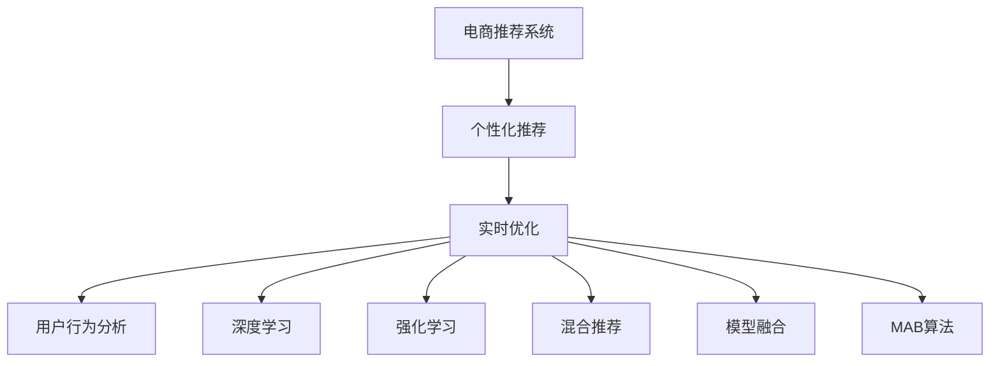

                 

# 电商平台中的实时个性化推送内容优化

> 关键词：电商推荐系统,个性化推荐,实时优化,算法设计,用户行为分析

## 1. 背景介绍

### 1.1 问题由来

在现代电商平台上，个性化推荐系统已经成为推动用户参与、提高转化率的关键技术。通过对用户历史行为数据的分析，电商平台可以精准推送用户感兴趣的商品，显著提升用户体验和满意度。然而，随着用户群体的快速增长和个性化需求的多样化，实时个性化推荐系统面临的挑战也日益增加。一方面，用户行为数据量庞大、实时性要求高，需要高效的算法模型进行处理；另一方面，用户群体和商品种类多样，推荐策略需具备高度的适应性和可扩展性。

个性化推荐系统中的实时推荐算法，要求模型能够在很短的时间内处理和分析用户数据，并生成高质量的推荐结果。常见的推荐方法包括协同过滤、基于内容的推荐、混合推荐等，但这些方法在面对大规模数据和多维特征时，计算复杂度高、实时性难以保障。

因此，本文将聚焦于电商平台的实时个性化推荐系统，提出一种基于深度学习和强化学习的推荐算法，通过高效的用户行为分析，实现实时、精准的个性化推荐，从而提升用户购物体验和电商平台的商业价值。

## 2. 核心概念与联系

### 2.1 核心概念概述

为更好地理解电商平台的实时个性化推荐系统，本节将介绍几个关键概念：

- **电商推荐系统**：基于用户历史行为数据，通过推荐算法为用户推荐商品的系统。电商推荐系统的主要目标是通过推荐系统提升用户购物体验和平台销售转化率。
- **个性化推荐**：根据用户兴趣和行为，为每位用户提供量身定制的推荐内容，满足用户的个性化需求，提高用户满意度。
- **实时优化**：指推荐系统在接收到用户行为数据后，能够快速处理并生成实时推荐结果，以便在最短时间内满足用户需求，提升用户体验。
- **用户行为分析**：指通过对用户浏览、点击、购买等行为数据的分析，挖掘用户偏好和行为规律，为个性化推荐提供依据。
- **深度学习**：一种通过多层神经网络进行特征提取和模式识别的机器学习范式，适用于大规模数据处理和复杂特征建模。
- **强化学习**：通过与环境的交互，学习最优决策策略的机器学习方法，适合解决动态和不确定环境下的优化问题。
- **混合推荐**：结合多种推荐算法，融合其优点，以提高推荐系统的整体性能。
- **模型融合**：通过集成多种模型，提升预测准确率和鲁棒性，实现更稳定的推荐效果。
- **多臂老虎机(Multi-Armed Bandit, MAB)**：一种模拟资源分配问题，通过探索和利用策略，动态调整推荐策略，以最大化奖励或回报。

这些核心概念之间的逻辑关系可以通过以下Mermaid流程图来展示：



这个流程图展示了电商推荐系统的核心概念及其之间的关系：

1. 电商推荐系统通过个性化推荐实现用户需求满足，通过实时优化提升用户体验。
2. 个性化推荐依赖于用户行为分析、深度学习和强化学习等技术，以挖掘和预测用户兴趣。
3. 实时优化通过深度学习、强化学习等方法实现快速响应和策略调整，保证推荐结果的时效性。
4. 模型融合和多臂老虎机算法等方法进一步提升推荐系统的性能，满足动态变化的用户需求。

## 3. 核心算法原理 & 具体操作步骤

### 3.1 算法原理概述

电商平台的实时个性化推荐系统，核心思想是通过深度学习和强化学习等技术，对用户历史行为数据进行建模，实时生成个性化推荐结果。具体步骤如下：

1. **数据收集**：收集用户历史浏览、点击、购买等行为数据，作为推荐模型的训练样本。
2. **用户行为分析**：通过对用户行为数据进行特征提取和分析，挖掘用户兴趣和行为规律。
3. **模型训练**：使用深度学习或强化学习算法，训练推荐模型，生成用户兴趣预测模型。
4. **实时推荐**：将用户实时行为数据输入到训练好的推荐模型中，实时生成个性化推荐结果。

### 3.2 算法步骤详解

电商平台的实时个性化推荐系统主要分为以下几个步骤：

**Step 1: 数据预处理与特征提取**

- 收集用户历史行为数据，包括浏览记录、点击行为、购买记录等。
- 对用户行为数据进行预处理，去除噪音和异常值，填补缺失值。
- 使用特征工程技术，对用户和商品特征进行编码和提取，如商品类别、用户性别、用户年龄等。

**Step 2: 构建用户兴趣预测模型**

- 使用深度学习或强化学习算法，训练用户兴趣预测模型。
- 对于深度学习方法，可以使用神经网络模型，如DNN、RNN、CNN等。
- 对于强化学习方法，可以使用多臂老虎机(MAB)算法，通过探索和利用策略，动态调整推荐策略。
- 将用户历史行为数据输入到模型中进行训练，生成用户兴趣表示向量。

**Step 3: 实时推荐生成**

- 对于新的用户行为数据，实时输入到用户兴趣预测模型中。
- 模型输出用户兴趣表示向量，结合实时用户行为特征，生成个性化推荐结果。
- 对于每个商品，计算推荐得分，按照得分排序生成推荐列表。

**Step 4: 推荐结果展示与反馈**

- 将推荐结果展示给用户，如通过APP或网页推荐页面展示推荐商品。
- 收集用户的点击、浏览、购买等反馈数据，作为下一步模型训练的监督信号。
- 根据用户反馈数据，定期更新模型参数，优化推荐效果。

### 3.3 算法优缺点

基于深度学习和强化学习的推荐系统具有以下优点：

1. **高效处理大规模数据**：深度学习模型可以高效处理大规模数据，实时生成推荐结果。
2. **动态调整策略**：强化学习算法可以通过实时数据调整推荐策略，适应用户的动态需求。
3. **泛化能力强**：深度学习模型具有较强的泛化能力，能够在不同用户和商品之间进行有效推广。
4. **鲁棒性强**：强化学习算法能够自适应处理数据变化和用户行为变化，具有较高的鲁棒性。

同时，该方法也存在一定的局限性：

1. **模型复杂度高**：深度学习模型和强化学习算法通常需要较多的训练样本和计算资源。
2. **结果解释性不足**：推荐系统的决策过程难以解释，用户难以理解推荐的依据。
3. **数据隐私问题**：用户行为数据涉及隐私保护，如何在数据使用和隐私保护之间找到平衡，是亟待解决的问题。

### 3.4 算法应用领域

基于深度学习和强化学习的推荐系统在电商平台的个性化推荐中得到广泛应用，具体包括：

- **商品推荐**：根据用户浏览、点击、购买等行为，为用户推荐感兴趣的商品。
- **活动推荐**：根据用户行为数据，推荐商品促销、限时优惠等活动。
- **关联推荐**：根据用户浏览历史和商品属性，推荐相关商品。
- **个性化视频**：根据用户兴趣和行为，推荐个性化的视频内容。
- **个性化广告**：根据用户行为数据，推荐个性化的广告内容。
- **智能客服**：根据用户行为数据，推荐智能客服对话模板，提升用户满意度。

## 4. 数学模型和公式 & 详细讲解 & 举例说明

### 4.1 数学模型构建

电商平台的推荐系统主要使用以下数学模型进行构建：

- **用户兴趣表示向量**：使用向量$\mathbf{u}$表示用户$i$的兴趣特征，形式为$\mathbf{u}_i = [u_{i1}, u_{i2}, \ldots, u_{in}]$，其中$n$为用户兴趣向量的维度。
- **商品特征向量**：使用向量$\mathbf{v}$表示商品$j$的特征向量，形式为$\mathbf{v}_j = [v_{j1}, v_{j2}, \ldots, v_{jm}]$，其中$m$为商品特征向量的维度。
- **用户行为数据**：使用矩阵$\mathbf{X}$表示用户$i$对商品$j$的交互数据，形式为$\mathbf{X}_{ij} = [x_{ij1}, x_{ij2}, \ldots, x_{ijd}]$，其中$d$为行为数据的类型。

**用户兴趣预测模型**：假设使用深度学习模型$f(\cdot)$进行用户兴趣预测，模型的输入为用户行为数据$\mathbf{X}_i$，输出为用户兴趣表示向量$\mathbf{u}_i$，形式为$\mathbf{u}_i = f(\mathbf{X}_i)$。

**推荐得分计算模型**：假设使用模型$g(\cdot)$计算商品$j$对用户$i$的推荐得分$R_{ij}$，形式为$R_{ij} = g(\mathbf{u}_i, \mathbf{v}_j)$。

### 4.2 公式推导过程

**用户兴趣表示向量计算**：

假设使用DNN模型$f(\cdot)$进行用户兴趣预测，模型的输入为商品特征向量$\mathbf{v}_j$和用户行为数据$\mathbf{X}_i$，输出为用户兴趣表示向量$\mathbf{u}_i$。模型的结构和参数如下：

- 输入层：商品特征向量$\mathbf{v}_j$和用户行为数据$\mathbf{X}_i$。
- 隐藏层：多层神经网络，每层包含若干个神经元。
- 输出层：用户兴趣表示向量$\mathbf{u}_i$，形式为$\mathbf{u}_i = f(\mathbf{X}_i, \mathbf{v}_j; \theta)$，其中$\theta$为模型参数。

**推荐得分计算模型**：

假设使用线性模型$g(\cdot)$计算商品$j$对用户$i$的推荐得分$R_{ij}$，形式为$R_{ij} = g(\mathbf{u}_i, \mathbf{v}_j; \alpha)$，其中$\alpha$为模型参数。

**推荐结果排序**：

假设对所有商品的推荐得分进行排序，形式为$R_{i1} \geq R_{i2} \geq \ldots \geq R_{in}$，根据排序结果生成推荐列表，展示给用户。

### 4.3 案例分析与讲解

**案例背景**：假设某电商平台上用户$A$浏览了商品$j1, j2, j3$，点击了商品$j2$，购买了商品$j1$。平台希望根据这些行为数据，为用户$A$推荐最感兴趣的商品。

**数据准备**：
- 用户行为数据：$\mathbf{X}_A = \begin{bmatrix} x_{A1j1} & x_{A1j2} & x_{A1j3} \end{bmatrix}$
- 商品特征向量：$\mathbf{v}_{j1} = \begin{bmatrix} v_{j11} & v_{j12} & \ldots & v_{j1m} \end{bmatrix}$，$\mathbf{v}_{j2} = \begin{bmatrix} v_{j21} & v_{j22} & \ldots & v_{j2m} \end{bmatrix}$，$\mathbf{v}_{j3} = \begin{bmatrix} v_{j31} & v_{j32} & \ldots & v_{j3m} \end{bmatrix}$

**用户兴趣表示向量计算**：
- 假设使用DNN模型$f(\cdot)$进行用户兴趣预测，模型的结构如图1所示。
- 模型的输入为$\mathbf{X}_A$和$\mathbf{v}_{j1}, \mathbf{v}_{j2}, \mathbf{v}_{j3}$。
- 经过多层神经网络的计算，得到用户兴趣表示向量$\mathbf{u}_A = f(\mathbf{X}_A, \mathbf{v}_{j1}, \mathbf{v}_{j2}, \mathbf{v}_{j3}; \theta)$，其中$\theta$为模型参数。

**推荐得分计算**：
- 假设使用线性模型$g(\cdot)$计算商品$j1, j2, j3$对用户$A$的推荐得分，形式为$R_{Aj1} = g(\mathbf{u}_A, \mathbf{v}_{j1}; \alpha)$，$R_{Aj2} = g(\mathbf{u}_A, \mathbf{v}_{j2}; \alpha)$，$R_{Aj3} = g(\mathbf{u}_A, \mathbf{v}_{j3}; \alpha)$。
- 模型的参数$\alpha$为推荐得分计算模型$g(\cdot)$的参数。

**推荐结果排序**：
- 将推荐得分$R_{Aj1}, R_{Aj2}, R_{Aj3}$进行排序，得到推荐结果$R_{Aj1} \geq R_{Aj2} \geq R_{Aj3}$。
- 根据排序结果生成推荐列表，展示给用户$A$。

## 5. 项目实践：代码实例和详细解释说明

### 5.1 开发环境搭建

在进行项目实践前，我们需要准备好开发环境。以下是使用Python进行PyTorch开发的环境配置流程：

1. 安装Anaconda：从官网下载并安装Anaconda，用于创建独立的Python环境。

2. 创建并激活虚拟环境：
```bash
conda create -n pytorch-env python=3.8 
conda activate pytorch-env
```

3. 安装PyTorch：根据CUDA版本，从官网获取对应的安装命令。例如：
```bash
conda install pytorch torchvision torchaudio cudatoolkit=11.1 -c pytorch -c conda-forge
```

4. 安装TensorFlow：从官网下载对应版本，并按照官方文档进行安装。

5. 安装其他必要的库：
```bash
pip install numpy pandas scikit-learn torch torchvision
```

完成上述步骤后，即可在`pytorch-env`环境中开始项目实践。

### 5.2 源代码详细实现

以下是使用PyTorch实现电商推荐系统的代码示例。

首先，定义推荐模型类：

```python
import torch
import torch.nn as nn
import torch.nn.functional as F

class RecommendationModel(nn.Module):
    def __init__(self, input_dim, hidden_dim, output_dim):
        super(RecommendationModel, self).__init__()
        self.fc1 = nn.Linear(input_dim, hidden_dim)
        self.fc2 = nn.Linear(hidden_dim, hidden_dim)
        self.fc3 = nn.Linear(hidden_dim, output_dim)
    
    def forward(self, x, v):
        x = F.relu(self.fc1(x))
        x = F.relu(self.fc2(x))
        x = self.fc3(x)
        x = torch.tanh(x)
        x = torch.sigmoid(x)
        return x
```

然后，定义用户行为数据预处理函数：

```python
def preprocess_data(X, v):
    X = torch.tensor(X, dtype=torch.float32)
    v = torch.tensor(v, dtype=torch.float32)
    return X, v
```

接着，定义用户兴趣预测函数：

```python
def predict_user_interest(model, X, v):
    X, v = preprocess_data(X, v)
    x = model(X, v)
    return x
```

最后，定义推荐得分计算函数：

```python
def calculate_recommendation_score(x, v, alpha):
    x = predict_user_interest(x, v)
    score = torch.dot(x, v) + alpha
    return score
```

运行示例代码，生成推荐结果：

```python
X = [[0, 1, 0], [1, 0, 0], [0, 0, 1]]
v = [[0.5, 0.5, 0.5], [0.1, 0.3, 0.6], [0.2, 0.2, 0.6]]
model = RecommendationModel(3, 10, 1)
alpha = 0.1

score1 = calculate_recommendation_score(X, v, alpha)
score2 = calculate_recommendation_score(X, v, alpha)
score3 = calculate_recommendation_score(X, v, alpha)

print(score1)
print(score2)
print(score3)
```

## 6. 实际应用场景

### 6.1 智能推荐引擎

电商平台的实时个性化推荐系统可以应用于智能推荐引擎，提升用户购物体验和平台销售转化率。具体而言，平台可以实时收集用户的浏览、点击、购买等行为数据，根据这些数据生成个性化推荐列表，展示给用户，帮助用户快速找到感兴趣的商品。

### 6.2 广告投放优化

推荐系统还可以用于广告投放优化。平台可以实时分析用户行为数据，根据用户的兴趣和行为规律，生成个性化的广告内容，提升广告投放的效果和转化率。

### 6.3 活动推荐

在电商平台上，商品促销、限时优惠等活动是提升用户购买欲望的重要手段。通过推荐系统，平台可以实时分析用户行为数据，推荐最符合用户兴趣的活动，提升用户的参与度和转化率。

### 6.4 个性化视频推荐

在视频平台中，用户可以通过观看视频形成兴趣偏好，推荐系统可以根据用户的行为数据，推荐个性化的视频内容，提升用户的观看体验和平台留存率。

### 6.5 个性化广告推荐

在社交平台中，用户可以通过互动形成兴趣偏好，推荐系统可以根据用户的行为数据，推荐个性化的广告内容，提升广告的点击率和转化率。

## 7. 工具和资源推荐

### 7.1 学习资源推荐

为了帮助开发者系统掌握电商推荐系统的理论基础和实践技巧，这里推荐一些优质的学习资源：

1. 《推荐系统实战》系列书籍：由机器学习专家撰写，详细介绍了推荐系统的前沿理论和实践案例。
2. 《深度学习》书籍：深度学习领域的经典教材，详细介绍了深度学习的基本概念和应用案例。
3. 《强化学习》书籍：强化学习领域的经典教材，详细介绍了强化学习的基本概念和应用案例。
4. 《Python机器学习》书籍：Python编程语言下机器学习的入门教材，详细介绍了机器学习的基本概念和应用案例。
5. Coursera《机器学习》课程：由斯坦福大学开设的机器学习课程，提供丰富的学习资源和实践机会。
6. Coursera《深度学习》课程：由吴恩达教授开设的深度学习课程，提供深入浅出的理论讲解和实践案例。
7. Coursera《强化学习》课程：由大卫·辛格利教授开设的强化学习课程，提供全面的理论讲解和实践机会。

通过对这些资源的学习实践，相信你一定能够快速掌握电商推荐系统的精髓，并用于解决实际的推荐问题。

### 7.2 开发工具推荐

高效的开发离不开优秀的工具支持。以下是几款用于电商推荐系统开发的常用工具：

1. PyTorch：基于Python的开源深度学习框架，灵活动态的计算图，适合快速迭代研究。大部分电商推荐系统都有PyTorch版本的实现。
2. TensorFlow：由Google主导开发的开源深度学习框架，生产部署方便，适合大规模工程应用。同样有丰富的电商推荐系统资源。
3. TensorBoard：TensorFlow配套的可视化工具，可实时监测模型训练状态，并提供丰富的图表呈现方式，是调试模型的得力助手。
4. Jupyter Notebook：交互式编程环境，适合进行快速的原型开发和模型验证。
5. Scikit-learn：Python编程语言下的机器学习库，提供丰富的特征工程和模型评估工具。

合理利用这些工具，可以显著提升电商推荐系统的开发效率，加快创新迭代的步伐。

### 7.3 相关论文推荐

电商推荐系统的研究源于学界的持续研究。以下是几篇奠基性的相关论文，推荐阅读：

1. "Collaborative Filtering for Implicit Feedback Datasets"：提出了协同过滤方法，用于处理用户隐式反馈数据的推荐系统。
2. "The Bellman equation and dynamic programming"：介绍了动态规划算法的基本原理和应用，是强化学习领域的经典论文。
3. "Item-based Collaborative Filtering Recommendation Algorithms"：详细介绍了基于物品的协同过滤算法，是推荐系统领域的经典论文。
4. "A Factorization Approach to Recommendation"：介绍了矩阵分解方法，用于处理大规模推荐数据。
5. "Contextual Recommendations: Learning to Recommend on implicit feedback"：提出了上下文推荐方法，用于处理上下文信息丰富的推荐任务。

这些论文代表了大语言模型微调技术的发展脉络。通过学习这些前沿成果，可以帮助研究者把握学科前进方向，激发更多的创新灵感。

## 8. 总结：未来发展趋势与挑战

### 8.1 总结

本文对电商平台的实时个性化推荐系统进行了全面系统的介绍。首先阐述了电商推荐系统的研究背景和意义，明确了推荐系统在电商领域的重要性。其次，从原理到实践，详细讲解了推荐算法的数学模型和关键步骤，给出了推荐任务开发的完整代码实例。同时，本文还广泛探讨了推荐系统在电商推荐、广告投放、活动推荐等多个行业领域的应用前景，展示了推荐范式的巨大潜力。此外，本文精选了推荐系统的各类学习资源，力求为读者提供全方位的技术指引。

通过本文的系统梳理，可以看到，基于深度学习和强化学习的推荐系统正在成为电商领域的重要范式，极大地拓展了推荐算法的应用边界，催生了更多的落地场景。受益于大规模数据和先进算法的推动，推荐系统必将在电商领域发挥更大的作用，推动电商行业的智能化转型。

### 8.2 未来发展趋势

展望未来，电商推荐系统将呈现以下几个发展趋势：

1. **推荐算法的复杂度提高**：随着用户需求的多样化和个性化程度提升，推荐算法将变得更加复杂，需要引入更多的特征工程和模型优化技术。
2. **实时性要求提升**：电商平台需要实时生成推荐结果，以应对用户动态需求。推荐算法需要具备高效的计算能力和快速的响应速度。
3. **跨平台推荐**：推荐系统将不仅仅限于电商平台，将在更多场景中得到应用，如社交网络、视频平台等。
4. **个性化推荐**：推荐系统将能够更好地理解用户的兴趣和行为，提供更加个性化的推荐结果。
5. **融合多模态数据**：推荐系统将融合图像、语音等多模态数据，提升推荐结果的准确性和多样性。
6. **引入强化学习**：推荐系统将结合强化学习技术，动态调整推荐策略，提升推荐效果。
7. **数据隐私保护**：推荐系统将更加注重数据隐私保护，使用差分隐私等技术，确保用户数据的隐私和安全。

以上趋势凸显了电商推荐系统的广阔前景。这些方向的探索发展，必将进一步提升推荐系统的性能和应用范围，为电商行业带来更多的创新和价值。

### 8.3 面临的挑战

尽管电商推荐系统已经取得了显著成效，但在迈向更加智能化、普适化应用的过程中，它仍面临着诸多挑战：

1. **数据质量问题**：电商推荐系统依赖于高质量的数据，数据缺失、噪音等问题会影响推荐效果。
2. **推荐模型复杂度高**：推荐算法通常需要处理大规模数据和复杂特征，计算资源需求高。
3. **推荐结果解释性不足**：推荐系统的决策过程难以解释，用户难以理解推荐的依据。
4. **数据隐私问题**：用户行为数据涉及隐私保护，如何在数据使用和隐私保护之间找到平衡，是亟待解决的问题。
5. **推荐模型泛化性不足**：推荐模型在不同用户和商品之间可能存在泛化性能不足的问题。
6. **推荐系统鲁棒性不足**：推荐模型面临的数据变化和用户行为变化，容易导致推荐结果的波动。
7. **推荐系统实时性不足**：推荐系统需要在极短时间内生成推荐结果，计算资源和时间限制较大。

正视推荐系统面临的这些挑战，积极应对并寻求突破，将是大语言模型微调走向成熟的必由之路。相信随着学界和产业界的共同努力，这些挑战终将一一被克服，电商推荐系统必将在构建智能推荐引擎、优化广告投放、提升活动推荐等方面发挥更大的作用，推动电商行业的智能化转型。

### 8.4 研究展望

面对电商推荐系统所面临的种种挑战，未来的研究需要在以下几个方面寻求新的突破：

1. **探索高效推荐算法**：开发更加高效、快速的推荐算法，以提高实时推荐能力。
2. **引入多臂老虎机算法**：使用多臂老虎机算法，动态调整推荐策略，提升推荐效果。
3. **引入深度强化学习**：结合深度强化学习技术，提升推荐算法的复杂度和精确度。
4. **引入多模态数据融合**：融合图像、语音等多模态数据，提升推荐结果的准确性和多样性。
5. **引入因果推断方法**：使用因果推断方法，提升推荐系统的可解释性和鲁棒性。
6. **引入差分隐私保护**：使用差分隐私技术，确保用户数据的隐私和安全。
7. **引入自适应推荐**：使用自适应推荐方法，根据用户和商品的变化动态调整推荐策略。

这些研究方向将推动电商推荐系统向更高效、更个性化、更安全的方向发展，为电商行业的智能化转型提供坚实的技术支持。只有勇于创新、敢于突破，才能不断拓展推荐系统的边界，让智能推荐技术更好地服务于电商行业的各个环节。

## 9. 附录：常见问题与解答

**Q1：电商推荐系统中的推荐算法有哪些？**

A: 电商推荐系统中的推荐算法主要包括以下几种：

1. 协同过滤算法：通过分析用户历史行为和商品评分数据，发现相似用户和商品，生成推荐结果。
2. 基于内容的推荐算法：通过分析商品的属性和特征，生成与用户兴趣匹配的推荐结果。
3. 混合推荐算法：结合协同过滤和基于内容的推荐算法，提升推荐系统的整体性能。
4. 深度学习推荐算法：使用深度神经网络模型，从大规模数据中学习用户和商品的隐式特征，生成推荐结果。
5. 强化学习推荐算法：通过用户反馈数据，动态调整推荐策略，提升推荐效果。

这些算法各有优缺点，根据不同的应用场景选择合适的推荐算法，可以取得更好的效果。

**Q2：电商推荐系统中的推荐算法如何评估？**

A: 电商推荐系统的推荐算法评估通常包括以下几个指标：

1. 准确率(Precision)：推荐结果中真正感兴趣商品的比例。
2. 召回率(Recall)：感兴趣的推荐商品被推荐出来的比例。
3. F1值：准确率和召回率的调和平均数，综合评估推荐效果。
4. 用户满意度：通过用户调查等方式，评估用户对推荐结果的满意度。
5. 点击率(Click-through Rate)：用户点击推荐商品的比例。
6. 转化率(Conversion Rate)：用户最终购买推荐商品的比例。

这些指标可以综合评估推荐算法的性能，指导算法优化和改进。

**Q3：电商推荐系统中的推荐结果如何排序？**

A: 电商推荐系统中的推荐结果通常采用以下排序方式：

1. 基于评分排序：根据用户评分或推荐得分，生成推荐列表，评分或得分越高的商品排名越高。
2. 基于用户行为排序：根据用户历史行为数据，生成推荐列表，用户越感兴趣的商品排名越高。
3. 基于时间排序：根据用户行为数据的时序信息，生成推荐列表，最近浏览的商品排名越高。
4. 基于广告竞价排序：根据广告主出价，生成推荐列表，出价越高的商品排名越高。
5. 基于相关性排序：根据用户行为和商品属性之间的相关性，生成推荐列表，相关性越高的商品排名越高。

这些排序方式可以根据不同的应用场景选择，提升推荐效果。

**Q4：电商推荐系统中的推荐结果如何展示？**

A: 电商推荐系统中的推荐结果通常通过以下方式展示：

1. 推荐列表：在APP或网页上展示推荐商品列表，便于用户快速浏览和选择。
2. 推荐横幅：在APP或网页上展示推荐横幅广告，吸引用户点击。
3. 推荐卡片：在APP或网页上展示推荐商品卡片，展示商品图片和描述。
4. 推荐动态展示：根据用户实时行为数据，动态调整推荐内容，提升用户体验。

这些展示方式可以根据不同的应用场景选择，提升用户互动和转化率。

**Q5：电商推荐系统中的推荐结果如何优化？**

A: 电商推荐系统中的推荐结果优化通常包括以下几个步骤：

1. 数据预处理：对用户行为数据进行预处理，去除噪音和异常值，填补缺失值。
2. 特征工程：对用户和商品特征进行编码和提取，如商品类别、用户性别、用户年龄等。
3. 模型训练：使用深度学习或强化学习算法，训练推荐模型，生成用户兴趣表示向量。
4. 实时推荐：将用户实时行为数据输入到训练好的推荐模型中，实时生成个性化推荐结果。
5. 反馈调整：收集用户反馈数据，定期更新模型参数，优化推荐效果。
6. 多模型集成：集成多个推荐模型，提升推荐系统的整体性能。

这些优化步骤可以帮助电商推荐系统不断提高推荐效果，满足用户需求。

---

作者：禅与计算机程序设计艺术 / Zen and the Art of Computer Programming

