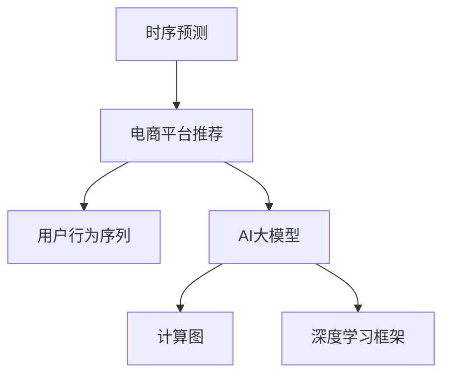

                 

# 电商平台中的时序预测：AI大模型的优势

> 关键词：时序预测, 电商平台, 电商平台推荐, 用户行为预测, 电商数据分析, AI大模型

## 1. 背景介绍

### 1.1 问题由来
随着电商平台的发展，如何精准预测用户行为，优化推荐效果，提高用户满意度和转化率，已成为电商企业关注的焦点。传统的方法依赖于手工规则、统计模型等，难以处理大规模、多变的用户数据，导致推荐效果不尽如人意。而基于人工智能的推荐系统，尤其是时序预测模型，能结合用户历史行为和实时环境，提供个性化、精准的推荐，显著提升用户体验。

### 1.2 问题核心关键点
电商平台的推荐系统主要面临以下挑战：
- 用户行为数据维度高、实时性强，难以直接建模。
- 用户需求变化频繁，模型需要实时调整。
- 实时推荐要求高效的计算能力，以便快速响应用户请求。

这些问题催生了对高效、精准、实时时序预测模型的需求。AI大模型凭借其强大的数据建模能力和计算能力，在电商平台推荐系统中的应用展现出巨大潜力。

### 1.3 问题研究意义
1. **降低推荐成本**：AI大模型可以自动学习用户行为模式，减少人工规则设计的工作量。
2. **提升推荐效果**：大模型能够捕捉用户行为的复杂关系，提供更加精准的推荐。
3. **支持实时推荐**：大模型可以实时响应用户请求，提供个性化的实时推荐。
4. **拓展应用场景**：大模型在电商平台的各个环节，如搜索、浏览、购物车、支付等，都能发挥重要作用。
5. **促进电商创新**：大模型在电商平台的创新应用，如个性化营销、智能客服、智能运营等，能推动电商业务的深度发展。

## 2. 核心概念与联系

### 2.1 核心概念概述

为了更好地理解基于AI大模型的时序预测方法，本节将介绍几个密切相关的核心概念：

- **时序预测(Time Series Prediction)**：预测未来某一时刻的值或状态。时序数据具有时间依赖性，可以通过模型学习历史数据中的规律，对未来数据进行预测。
- **电商平台推荐系统(E-commerce Recommendation System)**：基于用户行为数据，推荐商品或服务的技术系统。旨在提升用户购物体验，提高电商平台的转化率和用户满意度。
- **用户行为序列(Sequence of User Behavior)**：用户在电商平台上的浏览、点击、购买等行为，具有时间序列特征，可以用于预测用户未来的行为。
- **AI大模型(Deep Learning Large Model)**：如Transformer、BERT等，具有大规模参数量、强大的数据建模能力，能处理复杂的时序数据，提供高精度的预测结果。
- **计算图(Computational Graph)**：用于表示模型计算过程的图形结构，可以高效地进行反向传播和模型优化。
- **深度学习框架(Deep Learning Framework)**：如PyTorch、TensorFlow等，提供模型构建、训练、推理的全流程支持。

这些核心概念之间的逻辑关系可以通过以下Mermaid流程图来展示：



这个流程图展示时序预测在电商平台推荐系统中的核心概念及其之间的关系：

1. 时序预测是电商平台推荐系统的基础任务。
2. 用户行为序列是时序预测的数据输入。
3. AI大模型是时序预测的核心模型。
4. 计算图和深度学习框架提供了模型构建、训练、推理的支持。

## 3. 核心算法原理 & 具体操作步骤
### 3.1 算法原理概述

基于AI大模型的时序预测，主要是通过在大规模历史数据上进行预训练，然后利用监督学习（如微调）对模型进行优化，使其能够适应特定场景下的时序预测任务。

具体而言，时序预测过程可以分为以下步骤：

1. **数据预处理**：将原始数据转化为可用于模型训练的格式，如时间序列归一化、缺失值处理等。
2. **特征工程**：设计合适的特征，捕捉时序数据的特征，如滞后特征、滑动窗口、变化率等。
3. **模型构建**：选择或设计适合的模型结构，如RNN、LSTM、GRU、Transformer等，构建时序预测模型。
4. **模型训练**：在标注数据集上，利用监督学习（如微调）对模型进行训练，最小化预测误差。
5. **模型评估**：在验证集上评估模型性能，根据评估结果调整模型参数。
6. **模型部署**：将训练好的模型部署到实际应用场景中，进行实时预测。

### 3.2 算法步骤详解

以下以LSTM模型在电商平台用户行为预测为例，详细讲解基于AI大模型的时序预测过程。

**Step 1: 数据预处理**

电商平台的推荐系统通常包含多个环节，如搜索、浏览、购物车、支付等，每个环节的用户行为数据都具有不同的特征。需要将不同环节的数据统一处理，转化为可用于LSTM模型的输入格式。例如，将用户的浏览行为数据转化为时间序列，每个样本为连续的浏览行为记录。

**Step 2: 特征工程**

对预处理后的时序数据，需要设计合适的特征，以便模型能够更好地捕捉数据中的规律。例如，可以设计滞后特征，表示用户过去的行为对当前行为的影响。还可以设计滑动窗口特征，捕捉短期内的行为模式。

**Step 3: 模型构建**

以LSTM模型为例，构建时序预测模型。LSTM模型能够处理长序列数据，具有记忆能力，能捕捉时序数据中的长期依赖关系。

**Step 4: 模型训练**

在标注数据集上，利用监督学习（如微调）对LSTM模型进行训练。可以采用均方误差（MSE）或平均绝对误差（MAE）作为损失函数，最小化预测误差。训练过程中，需要调整学习率、批大小、迭代轮数等超参数，以获得最优模型。

**Step 5: 模型评估**

在验证集上评估模型性能，可以使用MAE、RMSE等指标来衡量模型的预测准确度。根据评估结果，可以调整模型参数，如LSTM的隐藏层大小、学习率等，以提升模型性能。

**Step 6: 模型部署**

将训练好的LSTM模型部署到实际应用场景中，进行实时预测。可以使用AWS、Google Cloud等云平台进行模型部署，确保实时响应用户请求。

### 3.3 算法优缺点

基于AI大模型的时序预测方法具有以下优点：
1. **强大的数据建模能力**：大模型能够处理高维、复杂的用户行为数据，捕捉数据中的复杂关系。
2. **高精度预测**：通过在大规模数据上进行预训练，模型能够获得高质量的预测结果。
3. **实时预测**：大模型通常采用GPU等高性能设备，能够实时响应用户请求，提供个性化的推荐。

同时，该方法也存在以下局限性：
1. **对数据质量要求高**：模型效果很大程度上依赖于标注数据的质量，需要保证数据的时序性和完整性。
2. **模型复杂度高**：大模型的参数量较大，计算复杂度高，需要高性能设备支持。
3. **泛化能力有限**：模型泛化能力可能受限于预训练数据集的多样性，需要定期重新训练以适应新数据。
4. **模型可解释性不足**：大模型通常是一个"黑盒"系统，难以解释其内部工作机制。
5. **计算资源消耗大**：大模型的训练和推理需要消耗大量的计算资源，包括内存、存储和计算时间。

尽管存在这些局限性，但基于AI大模型的时序预测方法仍是一种高效、精准的推荐系统解决方案。未来相关研究的方向将聚焦于降低计算资源消耗、提升模型可解释性、增强泛化能力等方面。

### 3.4 算法应用领域

基于AI大模型的时序预测方法，在电商平台推荐系统中得到了广泛应用。具体应用领域包括：

- **搜索推荐**：结合用户搜索行为和点击行为，推荐相关商品。
- **浏览推荐**：根据用户浏览历史，推荐相关商品或分类。
- **购物车推荐**：预测用户可能感兴趣的商品，加入购物车。
- **支付推荐**：预测用户支付方式，推荐支付方式。
- **个性化广告**：根据用户行为，推荐个性化广告。

除了推荐系统，时序预测方法还广泛应用于金融、交通、能源等领域，能够提供实时、精准的预测服务，提升决策效率。

## 4. 数学模型和公式 & 详细讲解 & 举例说明

### 4.1 数学模型构建

本节将使用数学语言对基于AI大模型的时序预测过程进行更加严格的刻画。

记时序数据为 $X=\{x_t\}_{t=1}^N$，其中 $x_t$ 为 $t$ 时刻的观测值。设目标变量为 $y_t$，表示 $t$ 时刻的标签或状态。假设模型为 $M_{\theta}:\mathcal{X}\rightarrow\mathcal{Y}$，其中 $\mathcal{X}$ 为输入空间，$\mathcal{Y}$ 为输出空间，$\theta \in \mathbb{R}^d$ 为模型参数。

定义模型 $M_{\theta}$ 在输入 $x_t$ 上的预测结果为 $\hat{y}_t=M_{\theta}(x_t) \in [0,1]$，表示模型预测 $y_t$ 的概率。在电商平台推荐系统中，可以设计合适的损失函数 $\ell(\hat{y}_t,y_t)$，最小化预测误差。

### 4.2 公式推导过程

以下我们以LSTM模型为例，推导基于AI大模型的时序预测过程的数学公式。

假设模型 $M_{\theta}$ 为LSTM模型，输入为 $x_t$，输出为 $\hat{y}_t$。LSTM模型的隐藏状态 $h_t$ 可以表示为：

$$
h_t = \text{LSTM}(h_{t-1}, x_t; \theta)
$$

其中 $\theta$ 为模型参数。LSTM模型的输出 $\hat{y}_t$ 可以表示为：

$$
\hat{y}_t = \text{softmax}(W_h h_t + b_h)
$$

其中 $W_h$ 和 $b_h$ 为线性层参数。

在模型训练过程中，最小化损失函数 $\ell(\hat{y}_t,y_t)$，即：

$$
\theta^* = \mathop{\arg\min}_{\theta} \sum_{t=1}^N \ell(\hat{y}_t,y_t)
$$

其中 $\ell(\hat{y}_t,y_t)$ 为预测误差，可以采用均方误差（MSE）或交叉熵损失（CE）。

在模型评估过程中，使用验证集上的MAE或RMSE等指标评估模型性能，即：

$$
\text{MAE} = \frac{1}{N} \sum_{t=1}^N |\hat{y}_t - y_t|
$$

$$
\text{RMSE} = \sqrt{\frac{1}{N} \sum_{t=1}^N (\hat{y}_t - y_t)^2}
$$

### 4.3 案例分析与讲解

以下通过一个具体案例，展示基于AI大模型的时序预测在电商平台推荐系统中的应用。

假设某电商平台的用户行为数据为 $X=\{x_1,x_2,\cdots,x_1000\}$，其中 $x_t$ 表示用户在 $t$ 时刻的浏览行为记录，包括浏览的网页ID、停留时间等。目标变量 $y_t$ 表示用户在该网页上购买的可能性，为0或1。

可以设计LSTM模型，以用户行为数据 $x_t$ 为输入，预测目标变量 $y_t$。具体而言，可以将用户行为数据转化为LSTM的输入序列，设置合适的隐藏层大小，进行训练和评估。训练过程中，可以使用均方误差作为损失函数，优化模型参数 $\theta$。在模型评估时，可以计算MAE或RMSE指标，衡量模型预测的准确度。

## 5. 项目实践：代码实例和详细解释说明
### 5.1 开发环境搭建

在进行时序预测实践前，我们需要准备好开发环境。以下是使用Python进行PyTorch开发的环境配置流程：

1. 安装Anaconda：从官网下载并安装Anaconda，用于创建独立的Python环境。

2. 创建并激活虚拟环境：
```bash
conda create -n pytorch-env python=3.8 
conda activate pytorch-env
```

3. 安装PyTorch：根据CUDA版本，从官网获取对应的安装命令。例如：
```bash
conda install pytorch torchvision torchaudio cudatoolkit=11.1 -c pytorch -c conda-forge
```

4. 安装TensorFlow：从官网下载并安装TensorFlow。例如：
```bash
conda install tensorflow
```

5. 安装各类工具包：
```bash
pip install numpy pandas scikit-learn matplotlib tqdm jupyter notebook ipython
```

完成上述步骤后，即可在`pytorch-env`环境中开始时序预测实践。

### 5.2 源代码详细实现

下面以LSTM模型在电商平台用户行为预测为例，给出使用PyTorch进行时序预测的PyTorch代码实现。

```python
import torch
import torch.nn as nn
import torch.optim as optim
from torch.utils.data import DataLoader
from sklearn.preprocessing import MinMaxScaler
from sklearn.model_selection import train_test_split

# 数据预处理
class Dataset:
    def __init__(self, data, target):
        self.data = data
        self.target = target
        self.scaler = MinMaxScaler()
        
    def __len__(self):
        return len(self.data)
    
    def __getitem__(self, idx):
        data = self.scaler.fit_transform(self.data[idx])
        target = self.scaler.fit_transform(self.target[idx])
        return torch.tensor(data, dtype=torch.float), torch.tensor(target, dtype=torch.float)

# 定义模型
class LSTM(nn.Module):
    def __init__(self, input_size, hidden_size, output_size):
        super(LSTM, self).__init__()
        self.hidden_size = hidden_size
        self.lstm = nn.LSTM(input_size, hidden_size, batch_first=True)
        self.fc = nn.Linear(hidden_size, output_size)
        
    def forward(self, x, h_0):
        x = x.unsqueeze(1)
        h_0 = (h_0[0].unsqueeze(0), h_0[1].unsqueeze(0))
        out, (h_n, c_n) = self.lstm(x, h_0)
        out = self.fc(out[:, -1, :])
        return out, (h_n[0].detach(), c_n[0].detach())

# 定义损失函数和优化器
def loss_fn(y_hat, y):
    return nn.BCELoss()(y_hat, y)

def train_epoch(model, dataset, batch_size, optimizer):
    model.train()
    total_loss = 0
    for data, target in DataLoader(dataset, batch_size=batch_size, shuffle=True):
        optimizer.zero_grad()
        y_hat, h_0 = model(data)
        loss = loss_fn(y_hat, target)
        loss.backward()
        optimizer.step()
        total_loss += loss.item()
    return total_loss / len(dataset)

# 训练模型
def train_model(model, train_dataset, val_dataset, epochs, batch_size, learning_rate):
    device = torch.device('cuda' if torch.cuda.is_available() else 'cpu')
    model.to(device)
    optimizer = optim.Adam(model.parameters(), lr=learning_rate)
    for epoch in range(epochs):
        train_loss = train_epoch(model, train_dataset, batch_size, optimizer)
        val_loss = evaluate_model(model, val_dataset, batch_size)
        print(f'Epoch {epoch+1}/{epochs}, train loss: {train_loss:.4f}, val loss: {val_loss:.4f}')
    return model

# 评估模型
def evaluate_model(model, test_dataset, batch_size):
    model.eval()
    total_loss = 0
    for data, target in DataLoader(test_dataset, batch_size=batch_size, shuffle=False):
        y_hat, h_0 = model(data)
        loss = loss_fn(y_hat, target)
        total_loss += loss.item()
    return total_loss / len(test_dataset)
```

### 5.3 代码解读与分析

让我们再详细解读一下关键代码的实现细节：

**Dataset类**：
- `__init__`方法：初始化数据和目标变量，并使用MinMaxScaler进行归一化。
- `__len__`方法：返回数据集的样本数量。
- `__getitem__`方法：对单个样本进行处理，将数据和目标变量转化为Tensor，并进行归一化。

**LSTM类**：
- `__init__`方法：初始化LSTM模型的参数。
- `forward`方法：定义前向传播过程。

**train_epoch函数**：
- 在训练阶段，前向传播计算损失，并使用Adam优化器更新模型参数。

**train_model函数**：
- 在每个epoch内，对训练集和验证集进行迭代，计算训练和验证损失，并输出结果。

**evaluate_model函数**：
- 在测试阶段，计算模型在测试集上的损失。

**训练流程**：
- 定义总的epoch数、batch size和learning rate，开始循环迭代
- 每个epoch内，在训练集上训练，输出训练损失
- 在验证集上评估，输出验证损失
- 所有epoch结束后，输出最终的验证损失

可以看到，PyTorch配合TensorFlow提供的高效计算图功能，使得LSTM模型的实现简洁高效。开发者可以轻松地构建和训练LSTM模型，进行时序预测实践。

当然，工业级的系统实现还需考虑更多因素，如模型的保存和部署、超参数的自动搜索、更灵活的任务适配层等。但核心的时序预测范式基本与此类似。

## 6. 实际应用场景
### 6.1 智能推荐系统

基于AI大模型的时序预测方法，在智能推荐系统中得到了广泛应用。推荐系统通过分析用户历史行为数据，预测用户未来的行为，提供个性化的商品推荐，显著提升用户体验和电商平台的转化率。

在技术实现上，可以收集用户在不同环节的浏览、点击、购买等行为数据，结合实时环境（如促销活动、天气等），构建时序预测模型。通过训练和微调，模型能够学习用户行为模式，预测用户可能感兴趣的商品，实时推荐给用户。

### 6.2 实时广告投放

在电商平台的广告投放中，实时预测用户的点击概率，可以优化广告投放策略，提高广告转化率。基于时序预测模型，可以根据用户的行为历史和实时环境（如时间、地理位置等），预测用户的点击概率，动态调整广告投放策略，实现更高效的广告投放。

### 6.3 库存管理

电商平台的库存管理是一个复杂的问题，需要实时预测商品的销售量，避免库存积压或缺货。基于时序预测模型，可以分析历史销售数据，预测未来销量，优化库存管理，提高资金周转率和用户满意度。

### 6.4 未来应用展望

随着时序预测模型在电商平台中的应用不断深入，其前景将更加广阔。

1. **多模态预测**：结合用户的行为数据、文本数据、图片数据等多种模态信息，构建更加全面、精准的预测模型。
2. **联邦学习**：在用户数据隐私保护的前提下，通过联邦学习（Federated Learning）方式，联合多个电商平台的用户数据，提升预测模型的泛化能力。
3. **模型融合**：结合不同时序预测模型的优点，构建模型融合（Model Fusion）系统，提高预测的准确性和鲁棒性。
4. **动态调整**：实时调整时序预测模型的参数，适应用户需求的变化，提高预测的实时性和准确性。
5. **跨平台协同**：构建跨平台的协同预测系统，提高时序预测的覆盖率和准确性，提升用户的整体购物体验。

未来，时序预测模型将更加注重模型可解释性、实时性、鲁棒性等方面的优化，进一步拓展其应用范围，提升电商平台的智能水平。

## 7. 工具和资源推荐
### 7.1 学习资源推荐

为了帮助开发者系统掌握时序预测的理论基础和实践技巧，这里推荐一些优质的学习资源：

1. 《深度学习》课程：由斯坦福大学开设的深度学习课程，提供全面的深度学习知识体系，适合入门学习。
2. 《Python深度学习》书籍：李沐著，介绍深度学习在Python中的实现，包含大量实例代码。
3. 《深度学习框架教程》：介绍PyTorch、TensorFlow等深度学习框架的使用，适合实践操作。
4. Kaggle竞赛：Kaggle提供丰富的时序预测竞赛，通过实践学习，提升预测模型的精度。

通过对这些资源的学习实践，相信你一定能够快速掌握时序预测的精髓，并用于解决实际的电商问题。

### 7.2 开发工具推荐

高效的开发离不开优秀的工具支持。以下是几款用于时序预测开发的常用工具：

1. PyTorch：基于Python的开源深度学习框架，支持动态计算图，适合快速迭代研究。
2. TensorFlow：由Google主导开发的开源深度学习框架，生产部署方便，适合大规模工程应用。
3. H2O.ai：提供简单易用的深度学习平台，支持多种深度学习算法，适合快速建模。
4. Jupyter Notebook：开源的交互式笔记本，支持Python、R等多种语言，适合数据处理和模型训练。
5. Weights & Biases：模型训练的实验跟踪工具，可以记录和可视化模型训练过程中的各项指标，方便对比和调优。

合理利用这些工具，可以显著提升时序预测任务的开发效率，加快创新迭代的步伐。

### 7.3 相关论文推荐

时序预测技术的发展源于学界的持续研究。以下是几篇奠基性的相关论文，推荐阅读：

1. Recurrent Neural Network (RNN)论文：Hochreiter和Schmidhuber提出RNN模型，首次将时序数据引入深度学习中。
2. LSTM: Long Short-Term Memory论文：Hochreiter和Schmidhuber提出LSTM模型，增强了RNN的长期记忆能力。
3. GRU: Gated Recurrent Unit论文：Cho等人提出GRU模型，简化LSTM的计算过程，提高训练效率。
4. Transformer: Attention is All You Need论文：Vaswani等人提出Transformer模型，引入自注意力机制，提升深度学习的计算效率和表现力。
5. Attention Mechanism: The Transformer Model论文：Vaswani等人详细介绍Transformer模型的原理和实现，推动了深度学习的发展。

这些论文代表的时序预测技术的发展脉络，通过学习这些前沿成果，可以帮助研究者把握学科前进方向，激发更多的创新灵感。

## 8. 总结：未来发展趋势与挑战

### 8.1 总结

本文对基于AI大模型的时序预测方法进行了全面系统的介绍。首先阐述了时序预测在电商平台推荐系统中的重要性，明确了AI大模型在处理高维、复杂数据方面的独特优势。其次，从原理到实践，详细讲解了时序预测的数学原理和关键步骤，给出了时序预测任务开发的完整代码实例。同时，本文还广泛探讨了时序预测方法在电商平台的各个环节中的应用前景，展示了时序预测范式的巨大潜力。

通过本文的系统梳理，可以看到，基于AI大模型的时序预测方法正在成为电商平台推荐系统的重要范式，极大地拓展了电商平台的智能化水平。AI大模型凭借其强大的数据建模能力和计算能力，在时序预测任务中展现出巨大优势，成为构建高效、精准、实时推荐系统的关键技术。未来，伴随时序预测方法的不断演进，AI大模型将在电商平台的各个环节发挥更大的作用，推动电商业务的深度发展。

### 8.2 未来发展趋势

展望未来，时序预测技术将呈现以下几个发展趋势：

1. **高精度预测**：AI大模型的参数量和技术水平不断提升，时序预测模型的精度将不断提高。
2. **实时预测**：基于高性能计算设备，时序预测模型能够实时处理用户请求，提供个性化的实时推荐。
3. **跨平台协同**：构建跨平台的协同预测系统，提高时序预测的覆盖率和准确性。
4. **多模态融合**：结合用户的行为数据、文本数据、图片数据等多种模态信息，构建更加全面、精准的预测模型。
5. **联邦学习**：在用户数据隐私保护的前提下，通过联邦学习方式，联合多个电商平台的用户数据，提升预测模型的泛化能力。
6. **模型融合**：结合不同时序预测模型的优点，构建模型融合系统，提高预测的准确性和鲁棒性。

以上趋势凸显了时序预测技术的广阔前景。这些方向的探索发展，将进一步提升时序预测模型的精度和实时性，推动电商平台推荐系统的发展。

### 8.3 面临的挑战

尽管时序预测技术已经取得了显著进展，但在迈向更加智能化、普适化应用的过程中，仍面临诸多挑战：

1. **数据质量问题**：时序预测模型的效果很大程度上依赖于数据的质量，需要保证数据的完整性和准确性。
2. **计算资源消耗大**：大模型的训练和推理需要消耗大量的计算资源，包括内存、存储和计算时间。
3. **模型复杂度高**：时序预测模型的参数量较大，计算复杂度高，需要高性能设备支持。
4. **泛化能力有限**：模型泛化能力可能受限于预训练数据集的多样性，需要定期重新训练以适应新数据。
5. **模型可解释性不足**：时序预测模型通常是一个"黑盒"系统，难以解释其内部工作机制和决策逻辑。
6. **模型实时性要求高**：时序预测模型需要实时响应用户请求，对模型的计算速度和存储效率有较高要求。

尽管存在这些挑战，但时序预测技术仍然具有强大的应用前景和广阔的发展空间。未来研究需要在优化数据处理、提升计算效率、增强模型可解释性等方面寻求新的突破。

### 8.4 研究展望

未来，时序预测技术需要在以下几个方面寻求新的突破：

1. **数据增强**：通过数据增强技术，扩充训练集的多样性，提高模型的泛化能力。
2. **模型压缩**：采用模型压缩技术，减小模型的参数量，提高模型的实时性和可部署性。
3. **可解释性增强**：结合符号化的先验知识，增强模型的可解释性，提高决策的透明度和可理解性。
4. **联邦学习**：通过联邦学习技术，联合多个平台的数据，提升模型的泛化能力。
5. **实时系统优化**：优化模型的计算图，提高模型的推理速度和存储效率，提升系统的实时性。
6. **多模态融合**：结合用户的行为数据、文本数据、图片数据等多种模态信息，构建更加全面、精准的预测模型。

这些研究方向将推动时序预测技术不断演进，拓展其应用范围，提升电商平台的智能化水平。相信在学界和产业界的共同努力下，时序预测技术将不断突破，为电商平台的推荐系统带来新的创新和发展。

## 9. 附录：常见问题与解答

**Q1：时序预测在电商推荐系统中有哪些应用场景？**

A: 时序预测在电商推荐系统中有多种应用场景，包括：
1. **商品推荐**：根据用户浏览历史和购买记录，预测用户可能感兴趣的商品，提供个性化推荐。
2. **广告推荐**：预测用户对广告的点击概率，优化广告投放策略，提高广告转化率。
3. **库存管理**：预测商品未来的销售量，优化库存管理，避免库存积压或缺货。
4. **价格预测**：预测商品的价格走势，优化价格策略，提升用户购买意愿。
5. **促销活动**：预测促销活动的效果，优化促销策略，提高用户参与度。

这些应用场景展示了时序预测在电商平台推荐系统中的广泛应用。

**Q2：时序预测需要哪些数据支持？**

A: 时序预测需要以下数据支持：
1. **用户行为数据**：用户在不同环节的浏览、点击、购买等行为数据。
2. **商品数据**：商品的属性、销量、价格等信息。
3. **环境数据**：实时环境数据，如时间、地理位置、天气等。
4. **用户反馈数据**：用户对商品和服务的评价和反馈数据。
5. **广告数据**：广告的投放记录和效果数据。

这些数据将为时序预测模型提供丰富的输入，帮助模型学习用户行为模式，预测未来的行为。

**Q3：如何提高时序预测模型的泛化能力？**

A: 提高时序预测模型的泛化能力，可以从以下几方面入手：
1. **数据增强**：通过数据增强技术，扩充训练集的多样性，提高模型的泛化能力。
2. **联邦学习**：在用户数据隐私保护的前提下，通过联邦学习方式，联合多个平台的数据，提升模型的泛化能力。
3. **模型融合**：结合不同时序预测模型的优点，构建模型融合系统，提高预测的准确性和鲁棒性。
4. **跨平台协同**：构建跨平台的协同预测系统，提高时序预测的覆盖率和准确性。
5. **多模态融合**：结合用户的行为数据、文本数据、图片数据等多种模态信息，构建更加全面、精准的预测模型。

这些方法可以帮助模型更好地适应新数据，提升模型的泛化能力。

**Q4：时序预测模型在实际应用中需要注意哪些问题？**

A: 时序预测模型在实际应用中需要注意以下问题：
1. **数据质量问题**：时序预测模型的效果很大程度上依赖于数据的质量，需要保证数据的完整性和准确性。
2. **计算资源消耗大**：大模型的训练和推理需要消耗大量的计算资源，包括内存、存储和计算时间。
3. **模型复杂度高**：时序预测模型的参数量较大，计算复杂度高，需要高性能设备支持。
4. **模型实时性要求高**：时序预测模型需要实时响应用户请求，对模型的计算速度和存储效率有较高要求。
5. **模型可解释性不足**：时序预测模型通常是一个"黑盒"系统，难以解释其内部工作机制和决策逻辑。

这些问题需要在模型设计和应用过程中给予充分考虑，确保模型在实际应用中能够稳定运行，提供可靠的服务。

**Q5：时序预测在电商推荐系统中的局限性有哪些？**

A: 时序预测在电商推荐系统中的局限性包括：
1. **数据质量问题**：时序预测模型的效果很大程度上依赖于数据的质量，需要保证数据的完整性和准确性。
2. **计算资源消耗大**：大模型的训练和推理需要消耗大量的计算资源，包括内存、存储和计算时间。
3. **模型复杂度高**：时序预测模型的参数量较大，计算复杂度高，需要高性能设备支持。
4. **模型实时性要求高**：时序预测模型需要实时响应用户请求，对模型的计算速度和存储效率有较高要求。
5. **模型可解释性不足**：时序预测模型通常是一个"黑盒"系统，难以解释其内部工作机制和决策逻辑。

这些问题需要在模型设计和应用过程中给予充分考虑，确保模型在实际应用中能够稳定运行，提供可靠的服务。

---

作者：禅与计算机程序设计艺术 / Zen and the Art of Computer Programming

