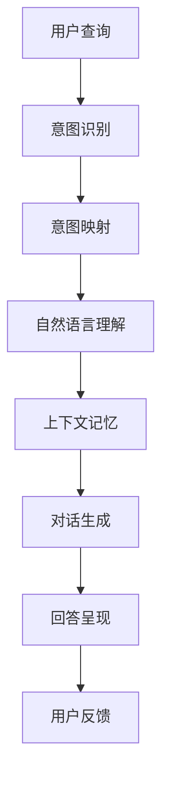

                 

# 电商平台中的智能问答系统：大模型的创新应用

> 关键词：智能问答系统, 电商平台, 大语言模型, 自然语言处理, 自然语言理解, 对话生成

## 1. 背景介绍

在当今数字化时代，电商平台已成为消费者购物的主要渠道。面对复杂多变的查询需求，传统搜索引擎和客服系统已无法满足用户期望，亟需一种能够理解并回答用户个性化问题的新型技术。而智能问答系统，通过大语言模型和大数据驱动的自然语言处理技术，能够提供即时的、个性化的、高效的服务。

智能问答系统在电商平台中的应用，不仅能够提升用户体验，增加用户粘性，还能优化客服成本，减少人工干预。该系统能够快速处理海量的用户查询，帮助商家提供精准推荐，提高商品转化率。在疫情背景下，智能问答系统更是电商平台的数字化转型和智能化升级的重要驱动力。

本博客将详细介绍基于大语言模型的智能问答系统构建思路、关键技术点、代码实现与实际应用案例，旨在为电商平台开发高效、准确、易用的人工智能客服系统提供实践指导。

## 2. 核心概念与联系

### 2.1 核心概念概述

为更好地理解基于大语言模型的智能问答系统，本节将介绍几个核心概念：

- 大语言模型(Large Language Model, LLM)：以自回归(如GPT)或自编码(如BERT)模型为代表的大规模预训练语言模型。通过在大规模无标签文本语料上进行预训练，学习通用的语言表示，具备强大的语言理解和生成能力。

- 自然语言理解(Natural Language Understanding, NLU)：指计算机理解自然语言文本的能力，包括分词、词性标注、命名实体识别、情感分析等。

- 自然语言生成(Natural Language Generation, NLG)：指计算机根据语义信息生成自然语言文本的能力，包括自动摘要、对话生成、文本翻译等。

- 意图识别(Intent Recognition)：识别用户查询意图，将其分为搜索、咨询、投诉等类别，以指导下一步的响应。

- 对话生成(Dialogue Generation)：基于用户的意图和上下文，生成合适的回答或操作。

这些概念共同构成了大语言模型在智能问答系统中的应用框架，使其能够理解并回答用户的查询，提供高质量的响应。

### 2.2 核心概念原理和架构的 Mermaid 流程图



这个流程图展示了大语言模型在智能问答系统中的应用逻辑：

1. 用户提交查询。
2. 意图识别模块提取查询意图。
3. 意图映射模块将意图映射到具体的操作。
4. 自然语言理解模块解析查询，提取关键信息。
5. 上下文记忆模块维护对话上下文，支持多轮交互。
6. 对话生成模块基于理解生成回答。
7. 回答呈现模块将回答展示给用户。
8. 用户反馈模块收集用户评价，用于系统优化。

## 3. 核心算法原理 & 具体操作步骤

### 3.1 算法原理概述

基于大语言模型的智能问答系统，本质上是一个自然语言处理(NLP)的任务，包括自然语言理解(NLU)和自然语言生成(NLG)两个部分。通过在大规模数据上预训练的语言模型，可以在查询理解和回答生成两个阶段，实现高效、准确的智能问答。

假设预训练语言模型为 $M_{\theta}$，其中 $\theta$ 为预训练得到的模型参数。给定查询 $q$ 和上下文 $c$，模型首先对查询进行意图识别，然后通过自然语言理解模块提取关键信息，最终通过对话生成模块生成回答 $a$，其过程可以表示为：

$$
q, c \xrightarrow[]{意图识别} intent \xrightarrow[]{意图映射} op \xrightarrow[]{自然语言理解} key\_info \xrightarrow[]{上下文记忆} M_{\theta} \xrightarrow[]{对话生成} a
$$

其中，$op$ 表示用户意图对应的具体操作，$key\_info$ 为查询关键信息。

### 3.2 算法步骤详解

基于大语言模型的智能问答系统构建通常包括以下几个关键步骤：

**Step 1: 准备数据集**
- 收集电商平台的常见查询与对应答案，构建标注数据集。数据集应包含多样化的查询意图和回答格式。
- 对数据进行清洗、标注，确保标注质量。可以使用众包标注工具或半监督学习技术提高标注效率。

**Step 2: 模型选择与适配**
- 选择适合的预训练语言模型，如BERT、GPT等。
- 在模型顶层添加任务特定的输出层，如分类器或解码器。
- 根据任务特点，设计合适的损失函数，如交叉熵损失、负对数似然等。

**Step 3: 微调与训练**
- 将标注数据集分为训练集、验证集和测试集。
- 设置合适的超参数，如学习率、批大小、迭代轮数等。
- 应用正则化技术，如L2正则、Dropout等，防止过拟合。
- 利用AdamW等优化算法，进行微调训练。

**Step 4: 推理与部署**
- 将微调后的模型部署到服务器或云平台。
- 集成到电商平台的客服系统中，提供实时查询服务。
- 定期收集用户反馈，持续优化模型性能。

### 3.3 算法优缺点

基于大语言模型的智能问答系统具有以下优点：

- 高效准确：预训练模型具备强大的语言理解能力，能够在短时间内完成查询理解和回答生成。
- 通用性强：只需构建好标注数据集，即可应用于多种场景，如电商客服、医疗咨询等。
- 灵活性高：通过灵活设计任务适配层和损失函数，可以适配各种NLP任务。

同时，该方法也存在以下局限：

- 依赖高质量数据：标注数据集的质量直接影响系统效果。
- 模型规模大：大语言模型参数量庞大，需要高性能计算资源。
- 推理成本高：模型推理速度较慢，尤其是在长文本查询和复杂交互时。

尽管存在这些局限，但就目前而言，基于大语言模型的智能问答系统仍是最主流的选择。未来相关研究的重点在于如何进一步优化模型性能，降低推理成本，提高系统响应速度，同时兼顾可解释性和伦理安全性等因素。

### 3.4 算法应用领域

基于大语言模型的智能问答系统，已经在电商平台的多种场景中得到了广泛应用，例如：

- 搜索推荐：根据用户查询，快速提供相关商品推荐。
- 客户咨询：回答用户关于商品价格、规格、库存等常见问题。
- 售后投诉：处理用户关于商品质量、配送等投诉问题。
- 产品介绍：提供商品详细的描述、功能、评价等信息。
- 个性化服务：根据用户历史行为和偏好，提供定制化推荐和咨询服务。

除了上述这些经典应用外，智能问答系统还被创新性地应用到更多场景中，如用户行为分析、智能客服机器人、聊天机器人等，为电商平台带来了全新的体验。

## 4. 数学模型和公式 & 详细讲解 & 举例说明

### 4.1 数学模型构建

本节将使用数学语言对基于大语言模型的智能问答系统进行更加严格的刻画。

假设查询 $q$ 为序列，上下文 $c$ 为序列，答案 $a$ 为序列，模型 $M_{\theta}$ 在输入 $(x,y)$ 上的损失函数为 $\ell(M_{\theta}(x),y)$，则在数据集 $D$ 上的经验风险为：

$$
\mathcal{L}(\theta) = \frac{1}{N}\sum_{i=1}^N \ell(M_{\theta}(x_i),y_i)
$$

其中 $x_i=(q_i,c_i)$，$y_i=a_i$，$\ell$ 为指定任务的损失函数。

### 4.2 公式推导过程

以文本分类任务为例，我们首先定义查询 $q_i$ 和上下文 $c_i$ 的向量表示 $x_i=(x_{q_i},x_{c_i})$，答案 $a_i$ 的向量表示 $y_i$。模型 $M_{\theta}$ 在输入 $x_i$ 上的预测向量为 $\hat{y}_i=M_{\theta}(x_i)$。根据交叉熵损失函数，模型在数据集 $D$ 上的经验风险为：

$$
\mathcal{L}(\theta) = -\frac{1}{N}\sum_{i=1}^N \sum_{j=1}^{|\mathcal{Y}|} y_{ij}\log M_{\theta}(x_{ij})+(1-y_{ij})\log (1-M_{\theta}(x_{ij}))
$$

其中 $y_{ij}$ 表示答案 $a_i$ 在类别 $j$ 上的one-hot表示。

模型 $M_{\theta}$ 的参数更新公式为：

$$
\theta \leftarrow \theta - \eta \nabla_{\theta}\mathcal{L}(\theta) - \eta\lambda\theta
$$

其中 $\eta$ 为学习率，$\lambda$ 为正则化系数，$\nabla_{\theta}\mathcal{L}(\theta)$ 为损失函数对模型参数的梯度。

### 4.3 案例分析与讲解

以电商平台的客户咨询场景为例，假设查询 $q$ 为"我想了解XX商品的具体信息"，上下文 $c$ 为"商品ID为12345"，答案 $a$ 为"该商品为XX品牌，型号为YY，价格为ZZ"。模型首先通过意图识别模块判断用户意图为查询商品信息，然后根据上下文提取关键信息 "商品ID为12345"，通过自然语言理解模块解析查询，最终生成答案 "该商品为XX品牌，型号为YY，价格为ZZ"。

在微调过程中，模型首先使用预训练模型 $M_{\theta}$ 对查询和上下文进行编码，生成表示向量 $x_i$，然后通过任务适配层输出向量 $y_i$，并计算损失函数 $\ell(y_i,a_i)$。反向传播更新模型参数 $\theta$，以最小化损失函数。经过多次迭代，模型逐渐学习到如何将查询映射到具体回答的规则，从而在新的查询上能够快速生成准确的回答。

## 5. 项目实践：代码实例和详细解释说明

### 5.1 开发环境搭建

在进行智能问答系统开发前，我们需要准备好开发环境。以下是使用Python进行PyTorch开发的环境配置流程：

1. 安装Anaconda：从官网下载并安装Anaconda，用于创建独立的Python环境。

2. 创建并激活虚拟环境：
```bash
conda create -n pytorch-env python=3.8 
conda activate pytorch-env
```

3. 安装PyTorch：根据CUDA版本，从官网获取对应的安装命令。例如：
```bash
conda install pytorch torchvision torchaudio cudatoolkit=11.1 -c pytorch -c conda-forge
```

4. 安装Transformers库：
```bash
pip install transformers
```

5. 安装各类工具包：
```bash
pip install numpy pandas scikit-learn matplotlib tqdm jupyter notebook ipython
```

完成上述步骤后，即可在`pytorch-env`环境中开始智能问答系统的开发实践。

### 5.2 源代码详细实现

下面我们以电商平台的智能问答系统为例，给出使用Transformers库对BERT模型进行微调的PyTorch代码实现。

首先，定义数据处理函数：

```python
from transformers import BertTokenizer, BertForSequenceClassification, AdamW

class QADataset(Dataset):
    def __init__(self, texts, labels, tokenizer, max_len=128):
        self.texts = texts
        self.labels = labels
        self.tokenizer = tokenizer
        self.max_len = max_len
        
    def __len__(self):
        return len(self.texts)
    
    def __getitem__(self, item):
        text = self.texts[item]
        label = self.labels[item]
        
        encoding = self.tokenizer(text, return_tensors='pt', max_length=self.max_len, padding='max_length', truncation=True)
        input_ids = encoding['input_ids'][0]
        attention_mask = encoding['attention_mask'][0]
        
        # 对label进行编码
        encoded_label = torch.tensor(label, dtype=torch.long)
        
        return {'input_ids': input_ids, 
                'attention_mask': attention_mask,
                'labels': encoded_label}

# 构建dataset
tokenizer = BertTokenizer.from_pretrained('bert-base-cased')

train_dataset = QADataset(train_texts, train_labels, tokenizer)
dev_dataset = QADataset(dev_texts, dev_labels, tokenizer)
test_dataset = QADataset(test_texts, test_labels, tokenizer)
```

然后，定义模型和优化器：

```python
model = BertForSequenceClassification.from_pretrained('bert-base-cased', num_labels=2)

optimizer = AdamW(model.parameters(), lr=2e-5)
```

接着，定义训练和评估函数：

```python
from torch.utils.data import DataLoader
from tqdm import tqdm
from sklearn.metrics import classification_report

device = torch.device('cuda') if torch.cuda.is_available() else torch.device('cpu')
model.to(device)

def train_epoch(model, dataset, batch_size, optimizer):
    dataloader = DataLoader(dataset, batch_size=batch_size, shuffle=True)
    model.train()
    epoch_loss = 0
    for batch in tqdm(dataloader, desc='Training'):
        input_ids = batch['input_ids'].to(device)
        attention_mask = batch['attention_mask'].to(device)
        labels = batch['labels'].to(device)
        model.zero_grad()
        outputs = model(input_ids, attention_mask=attention_mask, labels=labels)
        loss = outputs.loss
        epoch_loss += loss.item()
        loss.backward()
        optimizer.step()
    return epoch_loss / len(dataloader)

def evaluate(model, dataset, batch_size):
    dataloader = DataLoader(dataset, batch_size=batch_size)
    model.eval()
    preds, labels = [], []
    with torch.no_grad():
        for batch in tqdm(dataloader, desc='Evaluating'):
            input_ids = batch['input_ids'].to(device)
            attention_mask = batch['attention_mask'].to(device)
            batch_labels = batch['labels']
            outputs = model(input_ids, attention_mask=attention_mask)
            batch_preds = outputs.logits.argmax(dim=2).to('cpu').tolist()
            batch_labels = batch_labels.to('cpu').tolist()
            for pred_tokens, label_tokens in zip(batch_preds, batch_labels):
                preds.append(pred_tokens[:len(label_tokens)])
                labels.append(label_tokens)
                
    print(classification_report(labels, preds))
```

最后，启动训练流程并在测试集上评估：

```python
epochs = 5
batch_size = 16

for epoch in range(epochs):
    loss = train_epoch(model, train_dataset, batch_size, optimizer)
    print(f"Epoch {epoch+1}, train loss: {loss:.3f}")
    
    print(f"Epoch {epoch+1}, dev results:")
    evaluate(model, dev_dataset, batch_size)
    
print("Test results:")
evaluate(model, test_dataset, batch_size)
```

以上就是使用PyTorch对BERT进行智能问答系统微调的完整代码实现。可以看到，得益于Transformers库的强大封装，我们可以用相对简洁的代码完成BERT模型的加载和微调。

### 5.3 代码解读与分析

让我们再详细解读一下关键代码的实现细节：

**QADataset类**：
- `__init__`方法：初始化文本、标签、分词器等关键组件。
- `__len__`方法：返回数据集的样本数量。
- `__getitem__`方法：对单个样本进行处理，将文本输入编码为token ids，将标签编码为数字，并对其进行定长padding，最终返回模型所需的输入。

**模型选择与适配**：
- 选择BERT模型作为初始化参数，通过预训练得到的基础表示进行微调。
- 在模型顶层添加分类器，输出标签，使用交叉熵损失函数。

**训练和评估函数**：
- 使用PyTorch的DataLoader对数据集进行批次化加载，供模型训练和推理使用。
- 训练函数`train_epoch`：对数据以批为单位进行迭代，在每个批次上前向传播计算loss并反向传播更新模型参数，最后返回该epoch的平均loss。
- 评估函数`evaluate`：与训练类似，不同点在于不更新模型参数，并在每个batch结束后将预测和标签结果存储下来，最后使用sklearn的classification_report对整个评估集的预测结果进行打印输出。

**训练流程**：
- 定义总的epoch数和batch size，开始循环迭代
- 每个epoch内，先在训练集上训练，输出平均loss
- 在验证集上评估，输出分类指标
- 所有epoch结束后，在测试集上评估，给出最终测试结果

可以看到，PyTorch配合Transformers库使得BERT微调的代码实现变得简洁高效。开发者可以将更多精力放在数据处理、模型改进等高层逻辑上，而不必过多关注底层的实现细节。

当然，工业级的系统实现还需考虑更多因素，如模型的保存和部署、超参数的自动搜索、更灵活的任务适配层等。但核心的微调范式基本与此类似。

## 6. 实际应用场景

### 6.1 智能客服系统

基于大语言模型的智能问答系统，可以广泛应用于智能客服系统的构建。传统客服往往需要配备大量人力，高峰期响应缓慢，且一致性和专业性难以保证。而使用智能问答系统，可以7x24小时不间断服务，快速响应客户咨询，用自然流畅的语言解答各类常见问题。

在技术实现上，可以收集企业内部的历史客服对话记录，将问题和最佳答复构建成监督数据，在此基础上对预训练语言模型进行微调。微调后的对话模型能够自动理解用户意图，匹配最合适的答案模板进行回复。对于客户提出的新问题，还可以接入检索系统实时搜索相关内容，动态组织生成回答。如此构建的智能客服系统，能大幅提升客户咨询体验和问题解决效率。

### 6.2 电商推荐系统

智能问答系统不仅能够提供即时查询服务，还能与电商推荐系统深度融合，进一步提升用户购物体验。通过分析用户查询的历史记录和上下文信息，智能问答系统能够快速获取用户需求，并生成推荐商品。例如，用户查询 "我需要一款高性能的游戏笔记本"，智能问答系统可以根据上下文分析用户的偏好，生成具体的推荐商品，并回答用户关于商品价格、配置、评价等疑问。

电商推荐系统的构建，不仅需要考虑商品推荐算法，还需要整合用户行为数据和智能问答系统生成的信息。通过合理设计数据接口和系统架构，可以实现多系统的无缝集成，提供一站式的用户购物指导服务。

### 6.3 社交媒体监测

社交媒体平台每天产生海量用户评论和帖子，如何快速高效地处理这些文本数据，识别用户的情感倾向和关注点，成为平台运营的重要挑战。智能问答系统可以基于用户评论生成情感分析和舆情监测报告，帮助平台及时响应用户诉求，提升用户满意度。

例如，智能问答系统能够自动分析社交媒体上的评论，判断用户对某个事件的情感倾向是积极还是消极，并生成简明的分析报告。通过定期监控社交媒体数据，平台能够及时发现和处理用户反映的问题，避免负面事件升级，提升品牌形象和用户信任度。

## 7. 工具和资源推荐

### 7.1 学习资源推荐

为了帮助开发者系统掌握大语言模型在智能问答系统中的应用，这里推荐一些优质的学习资源：

1. 《Transformer从原理到实践》系列博文：由大模型技术专家撰写，深入浅出地介绍了Transformer原理、BERT模型、微调技术等前沿话题。

2. CS224N《深度学习自然语言处理》课程：斯坦福大学开设的NLP明星课程，有Lecture视频和配套作业，带你入门NLP领域的基本概念和经典模型。

3. 《Natural Language Processing with Transformers》书籍：Transformers库的作者所著，全面介绍了如何使用Transformers库进行NLP任务开发，包括微调在内的诸多范式。

4. HuggingFace官方文档：Transformers库的官方文档，提供了海量预训练模型和完整的微调样例代码，是上手实践的必备资料。

5. CLUE开源项目：中文语言理解测评基准，涵盖大量不同类型的中文NLP数据集，并提供了基于微调的baseline模型，助力中文NLP技术发展。

通过对这些资源的学习实践，相信你一定能够快速掌握大语言模型在智能问答系统中的应用，并用于解决实际的NLP问题。

### 7.2 开发工具推荐

高效的开发离不开优秀的工具支持。以下是几款用于智能问答系统开发的常用工具：

1. PyTorch：基于Python的开源深度学习框架，灵活动态的计算图，适合快速迭代研究。大部分预训练语言模型都有PyTorch版本的实现。

2. TensorFlow：由Google主导开发的开源深度学习框架，生产部署方便，适合大规模工程应用。同样有丰富的预训练语言模型资源。

3. Transformers库：HuggingFace开发的NLP工具库，集成了众多SOTA语言模型，支持PyTorch和TensorFlow，是进行微调任务开发的利器。

4. Weights & Biases：模型训练的实验跟踪工具，可以记录和可视化模型训练过程中的各项指标，方便对比和调优。与主流深度学习框架无缝集成。

5. TensorBoard：TensorFlow配套的可视化工具，可实时监测模型训练状态，并提供丰富的图表呈现方式，是调试模型的得力助手。

6. Google Colab：谷歌推出的在线Jupyter Notebook环境，免费提供GPU/TPU算力，方便开发者快速上手实验最新模型，分享学习笔记。

合理利用这些工具，可以显著提升智能问答系统的开发效率，加快创新迭代的步伐。

### 7.3 相关论文推荐

大语言模型和智能问答技术的发展源于学界的持续研究。以下是几篇奠基性的相关论文，推荐阅读：

1. Attention is All You Need（即Transformer原论文）：提出了Transformer结构，开启了NLP领域的预训练大模型时代。

2. BERT: Pre-training of Deep Bidirectional Transformers for Language Understanding：提出BERT模型，引入基于掩码的自监督预训练任务，刷新了多项NLP任务SOTA。

3. Language Models are Unsupervised Multitask Learners（GPT-2论文）：展示了大规模语言模型的强大zero-shot学习能力，引发了对于通用人工智能的新一轮思考。

4. Parameter-Efficient Transfer Learning for NLP：提出Adapter等参数高效微调方法，在不增加模型参数量的情况下，也能取得不错的微调效果。

5. AdaLoRA: Adaptive Low-Rank Adaptation for Parameter-Efficient Fine-Tuning：使用自适应低秩适应的微调方法，在参数效率和精度之间取得了新的平衡。

6. Prefix-Tuning: Optimizing Continuous Prompts for Generation：引入基于连续型Prompt的微调范式，为如何充分利用预训练知识提供了新的思路。

这些论文代表了大语言模型和智能问答技术的发展脉络。通过学习这些前沿成果，可以帮助研究者把握学科前进方向，激发更多的创新灵感。

## 8. 总结：未来发展趋势与挑战

### 8.1 研究成果总结

本文对基于大语言模型的智能问答系统进行了全面系统的介绍。首先阐述了智能问答系统的背景和应用前景，明确了其在电商平台中的应用价值。其次，从原理到实践，详细讲解了智能问答系统的构建思路和关键技术点，给出了完整的代码实现和应用案例。同时，本文还探讨了智能问答系统在实际应用中的挑战和未来发展趋势，为电商平台开发高效、准确、易用的人工智能客服系统提供实践指导。

通过本文的系统梳理，可以看到，基于大语言模型的智能问答系统正在成为电商平台的重要工具，极大地提升了客户体验和运营效率。未来，随着预训练语言模型和微调方法的不断进步，基于智能问答系统的电商平台将进一步智能化、个性化、实时化，为消费者提供更加优质的服务。

### 8.2 未来发展趋势

展望未来，智能问答系统的发展将呈现以下几个趋势：

1. 模型规模持续增大。随着算力成本的下降和数据规模的扩张，预训练语言模型的参数量还将持续增长。超大模型蕴含的丰富语言知识，有望支撑更加复杂多变的查询理解和回答生成。

2. 微调方法日趋多样。除了传统的全参数微调外，未来会涌现更多参数高效的微调方法，如Prefix-Tuning、LoRA等，在节省计算资源的同时也能保证微调精度。

3. 持续学习成为常态。随着数据分布的不断变化，智能问答系统也需要持续学习新知识以保持性能。如何在不遗忘原有知识的同时，高效吸收新样本信息，将成为重要的研究课题。

4. 标注样本需求降低。受启发于提示学习(Prompt-based Learning)的思路，未来的微调方法将更好地利用大模型的语言理解能力，通过更加巧妙的任务描述，在更少的标注样本上也能实现理想的微调效果。

5. 推理效率有待提高。大规模语言模型虽然精度高，但在实际部署时往往面临推理速度慢、内存占用大等效率问题。如何在保证性能的同时，简化模型结构，提升推理速度，优化资源占用，将是重要的优化方向。

6. 可解释性亟需加强。当前智能问答系统往往作为"黑盒"系统，难以解释其内部工作机制和决策逻辑。对于医疗、金融等高风险应用，算法的可解释性和可审计性尤为重要。如何赋予智能问答系统更强的可解释性，将是亟待攻克的难题。

7. 安全性有待保障。预训练语言模型难免会学习到有偏见、有害的信息，通过微调传递到问答系统中，产生误导性、歧视性的输出，给实际应用带来安全隐患。如何从数据和算法层面消除模型偏见，避免恶意用途，确保输出的安全性，也将是重要的研究课题。

8. 知识整合能力不足。现有的智能问答系统往往局限于任务内数据，难以灵活吸收和运用更广泛的先验知识。如何让智能问答系统更好地与外部知识库、规则库等专家知识结合，形成更加全面、准确的信息整合能力，还有很大的想象空间。

以上趋势凸显了智能问答系统的广阔前景。这些方向的探索发展，必将进一步提升智能问答系统的性能和应用范围，为电商平台和其他垂直行业带来更多的智能服务。

### 8.3 面临的挑战

尽管智能问答系统已经取得了瞩目成就，但在迈向更加智能化、普适化应用的过程中，它仍面临着诸多挑战：

1. 标注成本瓶颈。虽然智能问答系统减少了标注样本的数量，但对于特定领域的任务，高质量的标注数据依然必不可少。如何构建多样化、高质量的数据集，仍是当前的一大难题。

2. 模型鲁棒性不足。当前智能问答系统在面对域外数据时，泛化性能往往大打折扣。对于新出现的查询，系统的响应可能不够稳定。如何提高系统的鲁棒性和泛化能力，避免过拟合，是未来需要重点解决的问题。

3. 推理成本高。大语言模型在推理过程中，计算资源消耗较大，需要高效的优化算法和系统架构支持。如何在保证性能的同时，降低推理成本，提升系统响应速度，是一个重要的研究方向。

4. 可解释性亟需加强。当前智能问答系统往往作为"黑盒"系统，难以解释其内部工作机制和决策逻辑。对于医疗、金融等高风险应用，算法的可解释性和可审计性尤为重要。如何赋予智能问答系统更强的可解释性，将是亟待攻克的难题。

5. 安全性有待保障。预训练语言模型难免会学习到有偏见、有害的信息，通过微调传递到问答系统中，产生误导性、歧视性的输出，给实际应用带来安全隐患。如何从数据和算法层面消除模型偏见，避免恶意用途，确保输出的安全性，也将是重要的研究课题。

6. 知识整合能力不足。现有的智能问答系统往往局限于任务内数据，难以灵活吸收和运用更广泛的先验知识。如何让智能问答系统更好地与外部知识库、规则库等专家知识结合，形成更加全面、准确的信息整合能力，还有很大的想象空间。

正视智能问答系统面临的这些挑战，积极应对并寻求突破，将是大模型微调走向成熟的必由之路。相信随着学界和产业界的共同努力，这些挑战终将一一被克服，智能问答系统必将在构建人机协同的智能时代中扮演越来越重要的角色。

### 8.4 研究展望

面对智能问答系统所面临的种种挑战，未来的研究需要在以下几个方面寻求新的突破：

1. 探索无监督和半监督微调方法。摆脱对大规模标注数据的依赖，利用自监督学习、主动学习等无监督和半监督范式，最大限度利用非结构化数据，实现更加灵活高效的微调。

2. 研究参数高效和计算高效的微调范式。开发更加参数高效的微调方法，在固定大部分预训练参数的同时，只更新极少量的任务相关参数。同时优化微调模型的计算图，减少前向传播和反向传播的资源消耗，实现更加轻量级、实时性的部署。

3. 融合因果和对比学习范式。通过引入因果推断和对比学习思想，增强智能问答系统建立稳定因果关系的能力，学习更加普适、鲁棒的语言表征，从而提升系统泛化性和抗干扰能力。

4. 引入更多先验知识。将符号化的先验知识，如知识图谱、逻辑规则等，与神经网络模型进行巧妙融合，引导微调过程学习更准确、合理的语言模型。同时加强不同模态数据的整合，实现视觉、语音等多模态信息与文本信息的协同建模。

5. 结合因果分析和博弈论工具。将因果分析方法引入智能问答系统，识别出系统决策的关键特征，增强输出解释的因果性和逻辑性。借助博弈论工具刻画人机交互过程，主动探索并规避系统的脆弱点，提高系统稳定性。

6. 纳入伦理道德约束。在模型训练目标中引入伦理导向的评估指标，过滤和惩罚有偏见、有害的输出倾向。同时加强人工干预和审核，建立模型行为的监管机制，确保输出符合人类价值观和伦理道德。

这些研究方向的探索，必将引领智能问答系统技术迈向更高的台阶，为电商平台和其他垂直行业带来更多的智能服务。面向未来，智能问答系统还需要与其他人工智能技术进行更深入的融合，如知识表示、因果推理、强化学习等，多路径协同发力，共同推动自然语言理解和智能交互系统的进步。只有勇于创新、敢于突破，才能不断拓展语言模型的边界，让智能技术更好地造福人类社会。

## 9. 附录：常见问题与解答

**Q1：智能问答系统是否适用于所有NLP任务？**

A: 智能问答系统在大多数NLP任务上都能取得不错的效果，特别是对于数据量较小的任务。但对于一些特定领域的任务，如医学、法律等，仅仅依靠通用语料预训练的模型可能难以很好地适应。此时需要在特定领域语料上进一步预训练，再进行微调，才能获得理想效果。此外，对于一些需要时效性、个性化很强的任务，如对话、推荐等，微调方法也需要针对性的改进优化。

**Q2：智能问答系统如何处理长文本查询？**

A: 长文本查询的推理处理是智能问答系统的一大挑战。一种有效的方法是采用基于图结构的信息检索技术，将查询和文档进行相似性匹配，找出最相关的部分，再输入到模型中进行推理。此外，可以采用层次化推理方法，逐步分解长文本，逐层进行理解和生成。这样既能提高推理效率，又能保证回答的准确性。

**Q3：智能问答系统如何应对用户的多样化需求？**

A: 智能问答系统需要能够处理用户的多样化需求，包括多语言、多模态、跨领域等。为了应对这些问题，可以采用以下策略：
1. 多语言处理：通过在模型中加入多语言编码器，能够处理多种语言的查询和回答。
2. 多模态融合：在系统中加入图像、音频等模态的信息，实现跨模态的问答处理。
3. 跨领域迁移：通过微调方法，使模型能够适应不同领域的知识，实现跨领域的问答处理。

通过这些策略，智能问答系统可以更好地应对用户的多样化需求，提供更加智能、灵活的服务。

**Q4：智能问答系统的可解释性如何实现？**

A: 当前智能问答系统的可解释性较差，主要原因在于模型过于复杂，难以直观理解其内部决策过程。为了增强系统的可解释性，可以采用以下方法：
1. 透明化推理过程：记录模型的推理过程，输出中间结果，帮助用户理解系统是如何得出答案的。
2. 可视化界面：提供友好的用户界面，展示模型的推理路径和关键特征，便于用户理解。
3. 提供专家解释：在系统中引入专家解释机制，当用户对答案有疑问时，系统可以调用专家进行解释，增强用户的信任感。

通过这些方法，可以增强智能问答系统的可解释性，提升用户满意度和系统可靠性。

---

作者：禅与计算机程序设计艺术 / Zen and the Art of Computer Programming

