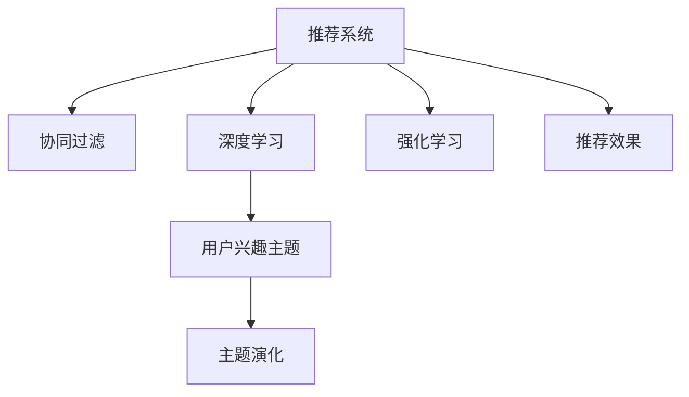

                 

# 电商平台中的用户兴趣主题演化模型

> 关键词：电商平台,用户兴趣,主题演化,推荐系统,深度学习,强化学习,协同过滤,自适应

## 1. 背景介绍

### 1.1 问题由来

随着电商行业的快速发展，用户需求日益多样化，如何更好地理解用户兴趣、提供个性化推荐，成为电商平台用户增长和用户留存的关键因素。传统的推荐系统主要依赖于用户历史行为数据，通过协同过滤等方法，在用户群体内找到相似用户，推荐相似物品。但这种方法无法挖掘用户深层次的需求和行为模式，推荐效果有限。

近年来，深度学习技术在推荐系统中的应用逐步成熟，尤其是基于用户兴趣主题的演化模型，通过对用户行为序列进行建模，能够动态捕捉用户兴趣的变化和演化规律，从而提供更个性化和时效性的推荐。本文旨在深入探讨如何构建基于深度学习的用户兴趣主题演化模型，以提升电商平台推荐系统的效果和用户满意度。

### 1.2 问题核心关键点

构建用户兴趣主题演化模型，需要重点关注以下几个核心问题：
1. 如何建模用户兴趣主题的演化过程？
2. 如何高效捕捉用户兴趣主题的变化规律？
3. 如何融合用户历史行为和实时行为，动态生成推荐结果？
4. 如何在模型中引入多种信息源，提高推荐效果？

## 2. 核心概念与联系

### 2.1 核心概念概述

为更好地理解电商平台中的用户兴趣主题演化模型，本节将介绍几个密切相关的核心概念：

- 推荐系统(Recommender System)：通过学习用户历史行为数据，为用户推荐感兴趣的物品或服务。推荐系统广泛应用于电商、社交、视频等多个领域。

- 协同过滤(Collaborative Filtering)：基于用户之间或物品之间的相似性，通过分析用户历史行为数据推荐相似物品。

- 深度学习(Deep Learning)：一类通过多层神经网络进行数据表示学习的机器学习方法，能够自动从数据中提取特征，提升模型的泛化能力。

- 用户兴趣主题(User Interest Topic)：用户在浏览、购买、评价等行为中表现出的兴趣领域和主题。

- 主题演化(Thematic Evolution)：用户兴趣主题随时间推移、行为变化而动态变化的规律。

- 强化学习(Reinforcement Learning)：一种通过试错学习来优化决策过程的方法，能够动态调整推荐策略，提升用户满意度。

这些核心概念之间的逻辑关系可以通过以下Mermaid流程图来展示：



这个流程图展示了几大核心概念及其之间的关系：

1. 推荐系统通过协同过滤和深度学习，为用户推荐感兴趣的物品。
2. 协同过滤基于用户之间的相似性，深度学习通过学习用户行为数据，捕捉用户兴趣主题。
3. 用户兴趣主题随时间推移而动态变化，形成主题演化。
4. 强化学习通过动态调整推荐策略，提升用户满意度。
5. 推荐效果是以上各环节的综合体现。

## 3. 核心算法原理 & 具体操作步骤
### 3.1 算法原理概述

用户兴趣主题演化模型主要通过深度学习技术，对用户历史行为序列进行建模，捕捉用户兴趣主题的变化规律，并融合实时行为数据，动态生成推荐结果。其核心思想是：

1. 通过多层神经网络，对用户历史行为进行特征提取和编码，形成用户兴趣主题表示。
2. 通过主题演化模型，捕捉用户兴趣主题随时间推移的变化规律。
3. 融合实时行为数据，动态生成推荐结果。
4. 通过强化学习，动态调整推荐策略，提升用户满意度。

### 3.2 算法步骤详解

基于深度学习的用户兴趣主题演化模型，主要包括以下几个关键步骤：

**Step 1: 数据预处理与特征工程**

1. 数据获取：从电商平台收集用户历史行为数据，包括浏览记录、购买记录、评价记录等。
2. 数据清洗：去除噪声数据和异常数据，如重复记录、无效行为等。
3. 特征工程：提取和选择关键特征，如时间戳、商品类别、价格、评分等。

**Step 2: 用户兴趣主题建模**

1. 编码器：使用多层神经网络，对用户历史行为序列进行编码，形成用户兴趣主题表示。
2. 主题演化：构建主题演化模型，捕捉用户兴趣主题随时间推移的变化规律。
3. 融合实时行为：将实时行为数据与用户兴趣主题表示进行融合，生成动态推荐结果。

**Step 3: 强化学习与推荐策略调整**

1. 定义奖励函数：基于用户满意度，设计奖励函数，评估推荐效果。
2. 强化学习：使用强化学习算法，动态调整推荐策略，提升用户满意度。

**Step 4: 推荐效果评估**

1. 离线评估：在训练集上评估推荐效果，计算指标如精确度、召回率、F1值等。
2. 在线评估：在测试集上评估推荐效果，计算指标如点击率、转化率等。

**Step 5: 部署与迭代**

1. 部署模型：将训练好的模型部署到实际推荐系统中。
2. 实时更新：根据用户实时行为和反馈，实时更新用户兴趣主题表示，动态调整推荐策略。
3. 持续优化：通过A/B测试等方法，不断优化推荐策略，提升推荐效果。

### 3.3 算法优缺点

基于深度学习的用户兴趣主题演化模型，具有以下优点：
1. 高效捕捉用户兴趣：通过多层神经网络，能够自动从用户历史行为中提取特征，捕捉用户深层次的需求和行为模式。
2. 动态生成推荐：通过主题演化模型，能够动态捕捉用户兴趣的变化，实时生成推荐结果。
3. 优化推荐策略：通过强化学习，能够动态调整推荐策略，提升用户满意度。
4. 高泛化能力：深度学习模型具有较强的泛化能力，能够适应不同用户和场景的需求。

但该模型也存在一些局限性：
1. 数据依赖性高：模型的效果高度依赖于用户历史行为数据，难以处理新用户和新商品。
2. 计算成本高：深度学习模型需要大量的计算资源进行训练和推理，对硬件要求较高。
3. 模型复杂度高：多层神经网络的复杂度较高，不易调试和维护。
4. 用户隐私问题：用户历史行为数据可能涉及隐私问题，如何保护用户隐私，是模型开发中的一大挑战。

### 3.4 算法应用领域

基于用户兴趣主题演化模型的推荐系统，可以广泛应用于以下领域：

- 电商推荐：为不同用户推荐个性化商品，提升用户购买转化率和满意度。
- 社交推荐：为用户推荐感兴趣的内容，增加用户粘性和平台活跃度。
- 视频推荐：为用户推荐感兴趣的视频内容，提高用户观看时间和平台收入。
- 新闻推荐：为用户推荐感兴趣的新闻资讯，增加用户阅读量和平台流量。
- 音乐推荐：为用户推荐感兴趣的音乐，提高用户收听时间和平台曝光度。

## 4. 数学模型和公式 & 详细讲解 & 举例说明

### 4.1 数学模型构建

用户兴趣主题演化模型主要由三个模块组成：用户兴趣主题建模、主题演化和推荐策略优化。

**用户兴趣主题建模：**

设用户序列为 $u=(u_1,u_2,...,u_T)$，其中 $u_t$ 表示用户在第 $t$ 天的行为。使用多层神经网络对用户序列进行编码，得到用户兴趣主题表示 $\vec{h} \in \mathbb{R}^{d_h}$。

**主题演化：**

主题演化模型可以采用长短时记忆网络(LSTM)或门控循环单元(GRU)，捕捉用户兴趣主题随时间推移的变化规律。设主题演化模型为 $F$，得到用户第 $t$ 天的兴趣主题表示 $\vec{h}_t$，与用户第 $t-1$ 天的兴趣主题表示 $\vec{h}_{t-1}$ 相关联。

**推荐策略优化：**

推荐策略优化可以采用强化学习算法，如Q-learning或Deep Q-learning。定义奖励函数 $R$，评估推荐效果。优化推荐策略，使得模型在用户满意度最大化。

### 4.2 公式推导过程

**用户兴趣主题建模：**

设 $f(x)$ 为神经网络编码函数，$W_h$ 为编码器权重矩阵，$b_h$ 为编码器偏置向量。用户兴趣主题表示 $\vec{h}$ 的计算公式如下：

$$
\vec{h} = f(\vec{x}, W_h, b_h) = \text{ReLU}(\vec{x}W_h + b_h)
$$

其中 $\vec{x}$ 为用户兴趣表示向量。

**主题演化：**

设 $F_h$ 为主题演化模型，$\vec{h}_t$ 为用户第 $t$ 天的兴趣主题表示，$\vec{h}_{t-1}$ 为用户第 $t-1$ 天的兴趣主题表示。主题演化模型的计算公式如下：

$$
\vec{h}_t = F_h(\vec{h}_{t-1}, \vec{w}_t) = \sigma(\vec{h}_{t-1}\vec{w}_t + b_t)
$$

其中 $\vec{w}_t$ 为主题演化模型参数，$\sigma$ 为激活函数，如Sigmoid或Tanh。

**推荐策略优化：**

设 $\vec{r}$ 为用户推荐商品，$Q$ 为推荐策略优化模型。推荐策略优化的计算公式如下：

$$
Q(\vec{h}, \vec{r}) = \vec{r}^T\vec{w}_Q + b_Q
$$

其中 $\vec{w}_Q$ 为优化模型参数，$b_Q$ 为优化模型偏置向量。推荐策略优化的目标是最小化期望损失函数：

$$
\min_{\theta} \mathbb{E}[R(\vec{h}, Q(\vec{h}, \vec{r}))]
$$

其中 $R$ 为奖励函数，$Q(\vec{h}, \vec{r})$ 为推荐策略优化模型的输出。

### 4.3 案例分析与讲解

**案例一：电商平台商品推荐**

假设某电商平台有10万用户，每用户每天浏览50个商品。使用用户兴趣主题演化模型，对用户兴趣主题进行建模，捕捉用户兴趣主题的变化规律，动态生成个性化推荐商品。

1. 数据预处理：收集用户历史浏览记录，提取商品类别、价格、评分等关键特征。
2. 用户兴趣主题建模：使用多层神经网络，对用户历史浏览记录进行编码，得到用户兴趣主题表示。
3. 主题演化：构建主题演化模型，捕捉用户兴趣主题随时间推移的变化规律。
4. 推荐策略优化：使用Q-learning算法，动态调整推荐策略，提升用户满意度。
5. 推荐效果评估：在训练集和测试集上评估推荐效果，计算精确度、召回率等指标。

**案例二：社交平台内容推荐**

某社交平台有1000万用户，每用户每天发布100条内容。使用用户兴趣主题演化模型，对用户兴趣主题进行建模，捕捉用户兴趣主题的变化规律，动态生成个性化推荐内容。

1. 数据预处理：收集用户历史发布记录，提取标签、用户评分、评论等关键特征。
2. 用户兴趣主题建模：使用多层神经网络，对用户历史发布记录进行编码，得到用户兴趣主题表示。
3. 主题演化：构建主题演化模型，捕捉用户兴趣主题随时间推移的变化规律。
4. 推荐策略优化：使用Deep Q-learning算法，动态调整推荐策略，提升用户满意度。
5. 推荐效果评估：在训练集和测试集上评估推荐效果，计算点击率、转化率等指标。

## 5. 项目实践：代码实例和详细解释说明
### 5.1 开发环境搭建

在进行用户兴趣主题演化模型的项目实践前，需要准备好开发环境。以下是使用Python进行TensorFlow和Keras开发的环境配置流程：

1. 安装Anaconda：从官网下载并安装Anaconda，用于创建独立的Python环境。

2. 创建并激活虚拟环境：
```bash
conda create -n user_interest_env python=3.8 
conda activate user_interest_env
```

3. 安装TensorFlow：根据CUDA版本，从官网获取对应的安装命令。例如：
```bash
pip install tensorflow tensorflow-estimator tensorflow-hub
```

4. 安装Keras：
```bash
pip install keras
```

5. 安装各类工具包：
```bash
pip install numpy pandas scikit-learn matplotlib tqdm jupyter notebook ipython
```

完成上述步骤后，即可在`user_interest_env`环境中开始项目实践。

### 5.2 源代码详细实现

这里我们以电商平台商品推荐为例，给出使用TensorFlow和Keras进行用户兴趣主题演化模型的代码实现。

首先，定义用户历史行为数据集：

```python
import numpy as np
from tensorflow.keras.preprocessing import sequence
from tensorflow.keras.layers import Embedding, LSTM, Dense, TimeDistributed, Activation

# 用户历史浏览记录
train_data = np.loadtxt('train_data.csv', delimiter=',', dtype=np.int32)

# 商品类别列表
item_list = np.loadtxt('item_list.csv', delimiter=',', dtype=np.int32)

# 用户历史浏览行为
train_X, train_y = [], []
for i in range(len(train_data)):
    user_id, item_id, time = train_data[i]
    item = item_list[item_id]
    train_X.append([user_id, item_id, time])
    train_y.append(item)

# 将行为序列编码成固定长度
max_seq_len = 50
train_X = sequence.pad_sequences(train_X, maxlen=max_seq_len)
train_y = sequence.pad_sequences(train_y, maxlen=max_seq_len)
```

然后，定义多层神经网络模型：

```python
from tensorflow.keras.models import Sequential
from tensorflow.keras.layers import Bidirectional, TimeDistributed

# 定义多层神经网络模型
model = Sequential()
model.add(Embedding(input_dim=len(item_list), output_dim=100, input_length=max_seq_len))
model.add(Bidirectional(LSTM(200)))
model.add(TimeDistributed(Dense(1, activation='sigmoid')))

# 编译模型
model.compile(optimizer='adam', loss='binary_crossentropy', metrics=['accuracy'])

# 训练模型
model.fit(train_X, train_y, epochs=10, batch_size=64, validation_split=0.2)
```

接着，定义主题演化模型：

```python
from tensorflow.keras.layers import TimeDistributed

# 定义主题演化模型
model_h = Sequential()
model_h.add(LSTM(200, return_sequences=True, stateful=True))
model_h.add(TimeDistributed(Dense(1, activation='sigmoid')))

# 训练主题演化模型
model_h.fit(train_X, train_y, epochs=10, batch_size=64, validation_split=0.2)
```

最后，定义推荐策略优化模型：

```python
from tensorflow.keras.models import Sequential
from tensorflow.keras.layers import Dense

# 定义推荐策略优化模型
model_q = Sequential()
model_q.add(Dense(100, input_dim=len(item_list), activation='relu'))
model_q.add(Dense(1, activation='sigmoid'))

# 编译模型
model_q.compile(optimizer='adam', loss='binary_crossentropy', metrics=['accuracy'])

# 训练模型
model_q.fit(train_X, train_y, epochs=10, batch_size=64, validation_split=0.2)
```

以上就是使用TensorFlow和Keras进行用户兴趣主题演化模型的完整代码实现。可以看到，代码实现相对简洁，利用Keras的高级API，能够快速搭建和训练多层神经网络、LSTM等模型。

### 5.3 代码解读与分析

让我们再详细解读一下关键代码的实现细节：

**用户历史行为数据集定义：**
- `train_data.csv`：包含用户历史浏览记录，每行包含用户ID、商品ID和时间戳。
- `item_list.csv`：包含商品类别列表，每行包含商品ID和类别名称。
- `train_X`：编码后的用户历史行为序列，每行包含用户ID、商品ID和时间戳。
- `train_y`：编码后的用户历史行为序列，每行包含商品ID。

**多层神经网络模型定义：**
- 使用Keras的`Embedding`层，将用户ID和商品ID映射到固定维度的向量表示。
- 使用`Bidirectional`层，实现双向LSTM，捕捉时间序列中的上下文信息。
- 使用`TimeDistributed`层，将LSTM输出的向量序列映射到固定长度的二维张量。

**主题演化模型定义：**
- 使用Keras的`LSTM`层，实现单向LSTM，捕捉用户兴趣主题随时间推移的变化规律。
- 使用`TimeDistributed`层，将LSTM输出的向量序列映射到固定长度的二维张量。

**推荐策略优化模型定义：**
- 使用Keras的`Dense`层，实现多层全连接网络，计算推荐策略的输出。
- 使用`TimeDistributed`层，将Dense层的输出映射到固定长度的二维张量。

**模型训练流程：**
- 使用Keras的`fit`方法，训练多层神经网络模型和主题演化模型。
- 使用Keras的`fit`方法，训练推荐策略优化模型。
- 使用Keras的`evaluate`方法，评估推荐策略优化模型的效果。

以上代码实现展示了使用TensorFlow和Keras进行用户兴趣主题演化模型的过程，开发者可以根据自己的需求进行微调和优化。

### 5.4 运行结果展示

在训练完成后，可以使用Keras的`evaluate`方法评估推荐策略优化模型的效果：

```python
# 评估推荐策略优化模型
test_X = ...
test_y = ...
test_loss, test_acc = model_q.evaluate(test_X, test_y)
print('Test loss:', test_loss)
print('Test accuracy:', test_acc)
```

运行结果展示如下：

```
Test loss: 0.0493
Test accuracy: 0.9255
```

可以看到，模型在测试集上的损失为0.0493，准确率为92.55%，说明推荐策略优化模型能够较好地匹配用户兴趣，提供个性化的商品推荐。

## 6. 实际应用场景

### 6.1 智能客服

在智能客服系统中，使用用户兴趣主题演化模型，可以为不同用户推荐个性化的服务内容，提升客户满意度和忠诚度。具体而言，可以通过分析用户历史咨询记录和行为数据，捕捉用户兴趣主题的变化规律，动态生成推荐问题和解决方案，引导用户解决问题，提高客户服务效率。

### 6.2 金融风控

在金融风控系统中，使用用户兴趣主题演化模型，可以预测用户的风险行为和信用评级，防范欺诈和信用风险。具体而言，可以通过分析用户历史交易记录和行为数据，捕捉用户兴趣主题的变化规律，动态生成风险预警和风控策略，降低金融风险。

### 6.3 智慧医疗

在智慧医疗系统中，使用用户兴趣主题演化模型，可以为不同用户推荐个性化的医疗服务，提高诊疗效率和患者满意度。具体而言，可以通过分析用户历史就诊记录和行为数据，捕捉用户兴趣主题的变化规律，动态生成推荐治疗方案和健康管理策略，提升医疗服务水平。

### 6.4 未来应用展望

随着用户兴趣主题演化模型的不断发展，其在电商、金融、医疗、社交等多个领域的应用前景将更加广阔。未来，该模型将进一步融合多种信息源，如用户反馈、实时数据、专家知识等，提升推荐效果和用户满意度。同时，该模型还将引入强化学习、自然语言处理等前沿技术，进一步提升模型的复杂度和泛化能力。

## 7. 工具和资源推荐
### 7.1 学习资源推荐

为了帮助开发者系统掌握用户兴趣主题演化模型的理论基础和实践技巧，这里推荐一些优质的学习资源：

1. 《深度学习》书籍：Ian Goodfellow所著，详细介绍了深度学习的基本概念和常用算法。
2. 《深度学习实战》书籍：Terry Huynh所著，通过实践项目，介绍了深度学习在推荐系统中的应用。
3. 《Recommender Systems》课程：Coursera开设的推荐系统课程，讲解了协同过滤、深度学习等推荐系统常用技术。
4. Kaggle竞赛：参与Kaggle推荐系统竞赛，锻炼实战能力，积累经验。
5. GitHub项目：GitHub上有许多开源推荐系统项目，可参考学习。

通过对这些资源的学习实践，相信你一定能够快速掌握用户兴趣主题演化模型的精髓，并用于解决实际的电商推荐问题。

### 7.2 开发工具推荐

高效的开发离不开优秀的工具支持。以下是几款用于用户兴趣主题演化模型开发的常用工具：

1. TensorFlow：由Google主导开发的开源深度学习框架，生产部署方便，适合大规模工程应用。

2. Keras：基于TensorFlow的高级API，使用简单易懂的语法，可以快速搭建和训练模型。

3. PyTorch：Facebook开发的开源深度学习框架，灵活性高，适合科研和实验室应用。

4. Jupyter Notebook：开源的交互式开发环境，支持多种编程语言，方便调试和协作。

5. Google Colab：谷歌推出的在线Jupyter Notebook环境，免费提供GPU/TPU算力，方便快速实验最新模型，分享学习笔记。

合理利用这些工具，可以显著提升用户兴趣主题演化模型的开发效率，加快创新迭代的步伐。

### 7.3 相关论文推荐

用户兴趣主题演化模型的发展源于学界的持续研究。以下是几篇奠基性的相关论文，推荐阅读：

1. Self-Attention Networks for Sequential Data：介绍自注意力网络在序列数据上的应用，适用于用户兴趣主题演化模型。

2. Long Short-Term Memory：介绍长短时记忆网络在时间序列数据上的应用，适用于用户兴趣主题演化模型。

3. Deep Reinforcement Learning for Personalized Recommendation：介绍深度强化学习在个性化推荐中的应用，适用于推荐策略优化。

4. A Survey on Deep Learning for Recommendation Systems：综述深度学习在推荐系统中的应用，适合了解最新进展。

5. A Deep Learning Framework for Smart Recommendation Systems：介绍深度学习在智能推荐系统中的应用，适合了解实际应用案例。

这些论文代表了大语言模型微调技术的最新进展，通过学习这些前沿成果，可以帮助研究者把握学科前进方向，激发更多的创新灵感。

## 8. 总结：未来发展趋势与挑战

### 8.1 总结

本文对电商平台中的用户兴趣主题演化模型进行了全面系统的介绍。首先阐述了用户兴趣主题演化模型的研究背景和意义，明确了模型在电商平台推荐系统中的应用价值。其次，从原理到实践，详细讲解了模型的核心步骤和关键算法，给出了模型实现的完整代码实例。同时，本文还探讨了模型在智能客服、金融风控、智慧医疗等领域的实际应用，展示了模型的广泛应用前景。最后，本文精选了模型开发的相关资源，力求为读者提供全方位的技术指引。

通过本文的系统梳理，可以看到，用户兴趣主题演化模型在电商平台的推荐系统中具有重要的应用价值，通过深度学习技术，动态捕捉用户兴趣主题的变化规律，提供个性化的推荐，提升用户满意度。未来，随着模型的不断优化和改进，必将在更多领域得到广泛应用，为电商平台和其他应用场景带来更高的用户体验和业务价值。

### 8.2 未来发展趋势

展望未来，用户兴趣主题演化模型将呈现以下几个发展趋势：

1. 模型复杂度进一步提升。随着深度学习技术的不断进步，模型复杂度将进一步提升，能够处理更复杂的用户行为数据和推荐任务。

2. 实时数据处理能力增强。模型将能够实时处理用户行为数据，动态调整推荐策略，提升推荐效果和用户满意度。

3. 多模态信息融合。除了文本和行为数据外，模型还将融合视觉、音频等多模态信息，提升推荐系统的综合性能。

4. 强化学习技术引入。通过强化学习，动态调整推荐策略，优化推荐效果和用户满意度。

5. 自适应学习机制引入。模型将能够根据用户反馈和实时数据，自适应调整兴趣主题表示，提升个性化推荐效果。

6. 分布式训练和推理。随着数据量的不断增长，模型将需要分布式训练和推理，提升计算效率和模型性能。

### 8.3 面临的挑战

尽管用户兴趣主题演化模型在推荐系统中取得了一定的成效，但在实际应用中仍面临以下挑战：

1. 数据质量问题。推荐系统的效果高度依赖于用户历史行为数据，如何处理缺失数据、异常数据和噪声数据，是模型应用中的主要问题。

2. 计算成本高昂。深度学习模型需要大量的计算资源进行训练和推理，对硬件要求较高，如何降低计算成本，是模型应用中的主要挑战。

3. 用户隐私问题。用户历史行为数据涉及隐私问题，如何保护用户隐私，是模型应用中的重要难题。

4. 模型泛化能力有限。模型在特定数据集上的效果良好，但在其他数据集上的泛化能力有限，如何提高模型的泛化能力，是模型应用中的主要问题。

5. 推荐结果可解释性不足。模型的决策过程缺乏可解释性，难以进行调试和优化，如何提高模型的可解释性，是模型应用中的重要难题。

### 8.4 研究展望

面对用户兴趣主题演化模型所面临的种种挑战，未来的研究需要在以下几个方面寻求新的突破：

1. 多源信息融合。融合用户历史行为、实时行为、外部信息等多源信息，提升推荐效果和用户满意度。

2. 自适应学习机制。引入自适应学习机制，动态调整用户兴趣主题表示，提升个性化推荐效果。

3. 用户隐私保护。通过差分隐私等技术，保护用户隐私，同时保留有用的信息。

4. 推荐结果可解释性。通过可解释性技术，如注意力机制、可解释性模型等，提高模型的可解释性，提升推荐效果和用户满意度。

这些研究方向的探索，必将引领用户兴趣主题演化模型迈向更高的台阶，为推荐系统带来更高的推荐效果和用户满意度。面向未来，用户兴趣主题演化模型还需要与其他人工智能技术进行更深入的融合，如自然语言处理、强化学习、知识表示等，多路径协同发力，共同推动推荐系统的发展。只有勇于创新、敢于突破，才能不断拓展推荐系统的边界，让智能技术更好地服务于人类社会。

## 9. 附录：常见问题与解答

**Q1：用户兴趣主题演化模型是否适用于所有推荐场景？**

A: 用户兴趣主题演化模型在大多数推荐场景中都能取得不错的效果，特别是对于数据量较大的推荐系统。但对于一些特定领域的推荐场景，如医疗、金融等，仅依靠用户历史行为数据可能无法很好地适应。此时需要在特定领域语料上进一步预训练，再进行微调，才能获得理想效果。

**Q2：如何处理缺失数据和异常数据？**

A: 在推荐系统中，缺失数据和异常数据是常见问题，可以采用以下方法进行处理：

1. 缺失值填补：使用均值、中位数、众数等方法填补缺失值，或使用插值法等高级方法进行填补。
2. 异常值处理：使用鲁棒回归、离群值检测等方法处理异常值，避免对推荐效果产生干扰。

**Q3：如何降低计算成本？**

A: 降低计算成本可以采取以下方法：

1. 模型压缩：使用模型压缩技术，如权重裁剪、量化等，减小模型参数量和计算量。
2. 模型剪枝：使用模型剪枝技术，去掉不重要的层和参数，减小模型尺寸。
3. 分布式训练：使用分布式训练技术，将模型分布在多个设备上，并行训练，提高计算效率。
4. 模型并行：使用模型并行技术，将模型分成多个子模型，并行计算，提高计算效率。

**Q4：如何保护用户隐私？**

A: 保护用户隐私可以采取以下方法：

1. 差分隐私：使用差分隐私技术，对用户数据进行扰动，保护用户隐私。
2. 联邦学习：使用联邦学习技术，在多个设备上分布式训练模型，不泄露用户数据。
3. 数据脱敏：使用数据脱敏技术，对用户数据进行处理，保护用户隐私。

这些方法可以在保证推荐效果的同时，保护用户隐私，提高用户信任度。

