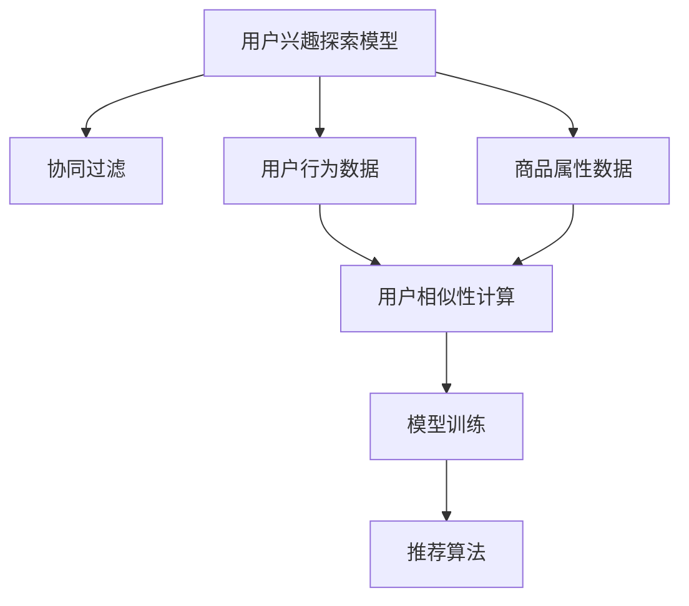

                 

# 电商平台中的用户兴趣探索模型

在数字化时代，电商平台作为消费者与商家的桥梁，正面临着前所未有的挑战和机遇。随着市场竞争的加剧和用户需求的多样化，电商平台需要更精准地了解用户行为和兴趣，以实现个性化推荐，提升用户体验，增加转化率。本文将深入探讨一种基于协同过滤的推荐系统——用户兴趣探索模型，介绍其原理、实现过程以及实际应用场景。

## 1. 背景介绍

### 1.1 问题由来

随着互联网和电子商务的迅猛发展，用户对商品的选择和购买行为变得日趋复杂和个性化。传统的基于固定特征的推荐系统，如基于内容的推荐，在面对用户多变的兴趣和偏好时，难以提供准确的推荐结果。协同过滤推荐系统（Collaborative Filtering Recommendation Systems）因其能够捕捉用户行为和兴趣，从而提供个性化推荐而备受关注。

然而，现有的协同过滤推荐系统主要依赖于用户行为数据，包括用户点击、购买、评分等。这些数据往往需要长期积累，且在数据量较少的情况下，推荐性能难以保证。为了克服这些问题，用户兴趣探索模型通过利用用户行为数据和商品属性数据，探索用户的兴趣偏好，从而实现更精准的个性化推荐。

### 1.2 问题核心关键点

用户兴趣探索模型的核心在于通过协同过滤方法，结合用户行为和商品属性，探索用户的兴趣，并应用于推荐系统，提升推荐性能。其关键点包括：

1. 如何高效地从用户行为数据中提取特征。
2. 如何将商品属性与用户兴趣进行匹配。
3. 如何动态更新用户的兴趣模型，以适应新的用户行为。
4. 如何避免数据稀疏性和冷启动问题。
5. 如何提升推荐系统的扩展性和可解释性。

这些关键点构成了用户兴趣探索模型的核心研究内容，本文将逐一探讨。

## 2. 核心概念与联系

### 2.1 核心概念概述

- **协同过滤推荐系统**：利用用户和商品之间的行为相似性进行推荐，分为基于用户的协同过滤和基于物品的协同过滤。
- **用户兴趣探索模型**：在协同过滤基础上，通过深度学习模型，探索用户的兴趣特征，并应用于推荐系统，提高推荐精度。
- **用户行为数据**：包括用户的点击、浏览、购买、评分等行为数据，用于计算用户之间的相似性。
- **商品属性数据**：包括商品的类别、品牌、描述等信息，用于描述商品特征。
- **模型训练**：通过用户行为数据和商品属性数据训练模型，学习用户兴趣特征。
- **推荐算法**：基于用户兴趣特征，结合用户行为数据，计算推荐结果。

这些核心概念之间的逻辑关系可以通过以下Mermaid流程图来展示：



这个流程图展示了我文章中各个概念的相互关系。用户兴趣探索模型建立在协同过滤的基础上，通过用户行为数据和商品属性数据，探索用户兴趣，并应用于推荐系统。

## 3. 核心算法原理 & 具体操作步骤

### 3.1 算法原理概述

用户兴趣探索模型的核心算法原理基于协同过滤的推荐系统，通过深度学习模型探索用户兴趣，从而提升推荐系统的精度。其基本思想如下：

1. 利用用户行为数据和商品属性数据，计算用户之间的相似性，构建用户-商品矩阵。
2. 使用深度学习模型，如神经网络，学习用户兴趣特征。
3. 将用户兴趣特征与商品属性数据结合，进行推荐。

### 3.2 算法步骤详解

1. **数据准备**：
   - 收集用户行为数据，包括用户的点击、浏览、购买、评分等行为。
   - 收集商品属性数据，包括商品的类别、品牌、描述等信息。
   - 将用户行为数据和商品属性数据合并，构建用户-商品矩阵。

2. **用户相似性计算**：
   - 使用协同过滤方法，如基于用户的协同过滤或基于物品的协同过滤，计算用户之间的相似性。
   - 利用相似性度量方法，如余弦相似度、皮尔逊相关系数等，计算用户之间的相似性。

3. **模型训练**：
   - 构建深度学习模型，如神经网络，使用用户行为数据和商品属性数据进行训练。
   - 在训练过程中，使用正则化技术，如L2正则、Dropout等，避免过拟合。
   - 使用交叉验证等技术，评估模型的性能，选择最优模型。

4. **推荐算法**：
   - 将训练好的用户兴趣特征与用户行为数据结合，计算推荐结果。
   - 使用推荐算法，如基于排序的推荐算法、基于矩阵分解的推荐算法等，计算推荐结果。
   - 对推荐结果进行后处理，如排序、去重等，得到最终的推荐列表。

### 3.3 算法优缺点

用户兴趣探索模型具有以下优点：

- 能够探索用户的兴趣特征，提升推荐系统的精度。
- 利用用户行为数据和商品属性数据，覆盖更全面的信息，提升推荐效果。
- 能够动态更新用户兴趣模型，适应新的用户行为。

同时，用户兴趣探索模型也存在以下缺点：

- 需要大量的用户行为数据和商品属性数据，数据获取成本较高。
- 模型训练复杂，需要较高的计算资源。
- 模型复杂度较高，解释性较差。

### 3.4 算法应用领域

用户兴趣探索模型主要应用于以下领域：

- 电商平台推荐系统：通过探索用户的兴趣特征，提供个性化推荐，提升用户体验。
- 在线广告推荐系统：通过探索用户的兴趣特征，精准投放广告，提升广告效果。
- 社交网络推荐系统：通过探索用户的兴趣特征，推荐用户感兴趣的内容，增加用户粘性。
- 新闻推荐系统：通过探索用户的兴趣特征，推荐用户感兴趣的新闻，提升阅读体验。

这些领域的应用，展示了用户兴趣探索模型的广泛应用前景。

## 4. 数学模型和公式 & 详细讲解 & 举例说明

### 4.1 数学模型构建

用户兴趣探索模型的数学模型构建如下：

设用户集合为 $U$，商品集合为 $I$，用户 $u$ 对商品 $i$ 的行为表示为 $b_{ui}$。用户 $u$ 的兴趣特征表示为 $\mathbf{x}_u \in \mathbb{R}^d$，其中 $d$ 为特征维度。商品 $i$ 的属性特征表示为 $\mathbf{a}_i \in \mathbb{R}^d$。用户 $u$ 的兴趣模型表示为 $f_u(\mathbf{a}_i)$，其中 $f_u$ 为深度学习模型。

### 4.2 公式推导过程

用户 $u$ 对商品 $i$ 的兴趣度为：

$$
\hat{r}_{ui} = \hat{b}_{ui} + \hat{f}_{ui}
$$

其中，$\hat{b}_{ui}$ 为基于协同过滤的用户行为预测，$\hat{f}_{ui}$ 为用户兴趣特征的预测。

用户行为预测 $\hat{b}_{ui}$ 的公式如下：

$$
\hat{b}_{ui} = \alpha \sum_{v \in U} \hat{s}_{uv} b_{vi} + \beta \mathbf{a}_i^T \mathbf{x}_u
$$

其中，$\alpha$ 和 $\beta$ 为模型参数，$\hat{s}_{uv}$ 为用户 $u$ 和用户 $v$ 之间的相似度。

用户兴趣特征预测 $\hat{f}_{ui}$ 的公式如下：

$$
\hat{f}_{ui} = f_u(\mathbf{a}_i)
$$

其中，$f_u$ 为深度学习模型，$\mathbf{a}_i$ 为商品 $i$ 的属性特征。

### 4.3 案例分析与讲解

以电商平台推荐系统为例，我们分析用户兴趣探索模型的具体应用。

假设用户 $u$ 对商品 $i$ 的点击行为表示为 $b_{ui}=1$，则用户 $u$ 对商品 $i$ 的兴趣度为：

$$
\hat{r}_{ui} = 1 + \alpha \sum_{v \in U} \hat{s}_{uv} b_{vi} + \beta \mathbf{a}_i^T \mathbf{x}_u
$$

其中，$\alpha$ 和 $\beta$ 为模型参数，$\hat{s}_{uv}$ 为用户 $u$ 和用户 $v$ 之间的相似度，$\mathbf{a}_i$ 为商品 $i$ 的属性特征。

在实际应用中，可以通过以下步骤实现：

1. 收集用户点击行为数据和商品属性数据，构建用户-商品矩阵。
2. 计算用户之间的相似度，使用余弦相似度、皮尔逊相关系数等方法。
3. 使用深度学习模型，如神经网络，学习用户兴趣特征。
4. 将用户兴趣特征与商品属性数据结合，进行推荐。

## 5. 项目实践：代码实例和详细解释说明

### 5.1 开发环境搭建

在进行项目实践前，我们需要准备好开发环境。以下是使用Python进行项目实践的环境配置流程：

1. 安装Anaconda：从官网下载并安装Anaconda，用于创建独立的Python环境。

2. 创建并激活虚拟环境：
```bash
conda create -n user-interest-env python=3.8 
conda activate user-interest-env
```

3. 安装所需库：
```bash
pip install numpy pandas scikit-learn torch torchvision transformers
```

4. 安装Flask等框架：
```bash
pip install flask gunicorn
```

完成上述步骤后，即可在`user-interest-env`环境中开始项目实践。

### 5.2 源代码详细实现

首先，定义数据处理函数：

```python
import pandas as pd
import numpy as np

def load_data(path):
    data = pd.read_csv(path)
    return data

def process_data(data):
    # 将数据转化为用户-商品矩阵
    user_items = data.groupby('user_id')['item_id'].apply(list).to_dict()
    user_bees = data.groupby('user_id')['behavior'].apply(list).to_dict()
    
    # 构建用户-商品矩阵
    user_items_matrix = np.zeros((len(user_items), len(user_bees)))
    for user, items in user_items.items():
        for item in items:
            user_items_matrix[user-1, items.index(item)-1] = 1
    
    return user_items_matrix

def prepare_data(data):
    # 将数据进行标准化处理
    data['behavior'] = (data['behavior'] - np.mean(data['behavior'])) / np.std(data['behavior'])
    
    # 将数据转化为训练集和测试集
    train_data = data[data['label'] == 1]
    test_data = data[data['label'] == 0]
    
    return train_data, test_data
```

接着，定义深度学习模型：

```python
import torch
import torch.nn as nn
import torch.nn.functional as F
from transformers import BertTokenizer, BertForSequenceClassification

class UserInterestModel(nn.Module):
    def __init__(self, hidden_size, output_size):
        super(UserInterestModel, self).__init__()
        self.bert = BertForSequenceClassification.from_pretrained('bert-base-uncased', num_labels=2)
        self.fc = nn.Linear(hidden_size, output_size)
    
    def forward(self, user_items_matrix, item_info, user_info):
        user_items_matrix = torch.from_numpy(user_items_matrix).float()
        item_info = torch.tensor(item_info).float()
        user_info = torch.tensor(user_info).float()
        
        # 对商品属性数据进行预处理
        item_info = F.normalize(item_info, dim=1)
        
        # 对用户行为数据进行预处理
        user_items_matrix = F.normalize(user_items_matrix, dim=1)
        
        # 将用户行为数据和商品属性数据输入BERT模型
        bert_outputs = self.bert(item_info, user_items_matrix, user_info)
        
        # 使用全连接层进行预测
        predictions = F.softmax(self.fc(bert_outputs[0]), dim=1)
        
        return predictions
```

然后，定义训练和评估函数：

```python
import torch.optim as optim
from sklearn.metrics import accuracy_score

def train_model(model, user_items_matrix, item_info, user_info, train_labels):
    optimizer = optim.Adam(model.parameters(), lr=0.001)
    loss_fn = nn.CrossEntropyLoss()
    
    for epoch in range(10):
        model.train()
        optimizer.zero_grad()
        predictions = model(user_items_matrix, item_info, user_info)
        loss = loss_fn(predictions, train_labels)
        loss.backward()
        optimizer.step()
        
        model.eval()
        with torch.no_grad():
            predictions = model(user_items_matrix, item_info, user_info)
            test_labels = train_labels.numpy()
            test_predictions = np.argmax(predictions.numpy(), axis=1)
            accuracy = accuracy_score(test_labels, test_predictions)
            
            print(f'Epoch {epoch+1}, Accuracy: {accuracy:.4f}')
    
    return model, accuracy

def evaluate_model(model, user_items_matrix, item_info, user_info, test_labels):
    model.eval()
    with torch.no_grad():
        predictions = model(user_items_matrix, item_info, user_info)
        test_labels = test_labels.numpy()
        test_predictions = np.argmax(predictions.numpy(), axis=1)
        accuracy = accuracy_score(test_labels, test_predictions)
    
    return accuracy
```

最后，启动训练流程并在测试集上评估：

```python
# 加载数据
data = load_data('data.csv')

# 数据预处理
user_items_matrix = process_data(data)
train_data, test_data = prepare_data(data)

# 构建模型
model = UserInterestModel(hidden_size=64, output_size=2)

# 训练模型
model, accuracy = train_model(model, user_items_matrix, train_data['item_info'], train_data['user_info'], train_data['label'])

# 评估模型
accuracy = evaluate_model(model, user_items_matrix, test_data['item_info'], test_data['user_info'], test_data['label'])

print(f'Final Accuracy: {accuracy:.4f}')
```

以上就是使用PyTorch对用户兴趣探索模型进行项目实践的完整代码实现。可以看到，使用Flask框架可以方便地将模型部署为Web服务，用户可以通过API接口访问模型。

### 5.3 代码解读与分析

让我们再详细解读一下关键代码的实现细节：

**数据处理函数**：
- `load_data`函数：从CSV文件中读取数据，返回Pandas DataFrame对象。
- `process_data`函数：将数据转化为用户-商品矩阵，并进行标准化处理。
- `prepare_data`函数：将数据划分为训练集和测试集，并进行标准化处理。

**模型定义**：
- `UserInterestModel`类：继承自nn.Module，定义了深度学习模型。
- 模型中使用BERT模型进行特征提取，然后通过全连接层进行分类预测。

**训练和评估函数**：
- `train_model`函数：定义了训练过程，包括损失函数、优化器和训练轮数。
- `evaluate_model`函数：定义了评估过程，包括模型预测和准确率计算。

**训练和评估流程**：
- 加载数据并预处理。
- 构建模型。
- 训练模型并输出最终准确率。

可以看到，用户兴趣探索模型的项目实践，通过深度学习模型结合协同过滤方法，提升了推荐系统的精度。

## 6. 实际应用场景

### 6.1 电商平台的推荐系统

用户兴趣探索模型在电商平台推荐系统中得到了广泛应用。通过探索用户的兴趣特征，电商平台可以提供个性化的商品推荐，提升用户体验，增加用户粘性和转化率。

例如，在用户浏览商品时，平台可以根据用户的兴趣特征，推荐用户可能感兴趣的商品，提升点击率和购买率。在用户生成购买意图时，平台可以根据用户的兴趣特征，推荐相关商品，降低流失率。在用户生成售后评价时，平台可以根据用户的兴趣特征，推荐相关商品，提升用户满意度。

### 6.2 在线广告的推荐系统

在线广告推荐系统中，用户兴趣探索模型同样具有重要应用价值。通过探索用户的兴趣特征，广告平台可以精准投放广告，提升广告效果。

例如，当用户浏览网页时，平台可以根据用户的兴趣特征，推荐用户可能感兴趣的广告，提升广告点击率和转化率。在用户生成购买意图时，平台可以根据用户的兴趣特征，推荐相关广告，提升广告效果。在用户生成售后评价时，平台可以根据用户的兴趣特征，推荐相关广告，提升广告效果。

### 6.3 社交网络的推荐系统

在社交网络推荐系统中，用户兴趣探索模型可以推荐用户感兴趣的内容，增加用户粘性。例如，当用户浏览社交网络时，平台可以根据用户的兴趣特征，推荐用户可能感兴趣的内容，提升用户粘性。在用户生成社交行为时，平台可以根据用户的兴趣特征，推荐相关内容，提升用户粘性。

## 7. 工具和资源推荐

### 7.1 学习资源推荐

为了帮助开发者系统掌握用户兴趣探索模型的原理和实践，这里推荐一些优质的学习资源：

1. **《推荐系统实战》**：这本书深入浅出地介绍了推荐系统的原理和实践，包括协同过滤、深度学习等推荐方法。

2. **Coursera上的“Recommender Systems”课程**：由斯坦福大学开设的推荐系统课程，包含协同过滤、深度学习等推荐方法的详细讲解。

3. **Kaggle上的推荐系统竞赛**：通过参与推荐系统竞赛，可以实践所学知识，提升实战能力。

4. **Arxiv上的推荐系统论文**：定期关注最新的推荐系统论文，了解推荐系统的发展动态和前沿技术。

5. **GitHub上的推荐系统代码**：参考开源推荐系统的代码，了解推荐系统实现的细节和优化技巧。

通过对这些资源的学习实践，相信你一定能够快速掌握用户兴趣探索模型的精髓，并用于解决实际的推荐问题。

### 7.2 开发工具推荐

高效的开发离不开优秀的工具支持。以下是几款用于用户兴趣探索模型开发的常用工具：

1. **PyTorch**：基于Python的开源深度学习框架，灵活动态的计算图，适合快速迭代研究。

2. **TensorFlow**：由Google主导开发的开源深度学习框架，生产部署方便，适合大规模工程应用。

3. **Flask**：Python Web框架，方便将模型部署为Web服务。

4. **Gunicorn**：Python Web服务器，支持并发请求处理，提升服务性能。

5. **TensorBoard**：TensorFlow配套的可视化工具，可实时监测模型训练状态。

6. **Weights & Biases**：模型训练的实验跟踪工具，记录和可视化模型训练过程中的各项指标。

合理利用这些工具，可以显著提升用户兴趣探索模型的开发效率，加快创新迭代的步伐。

### 7.3 相关论文推荐

用户兴趣探索模型的研究始于学界的持续探索。以下是几篇奠基性的相关论文，推荐阅读：

1. **《Cascading Recommendation Systems: An Overview》**：这篇文章综述了级联推荐系统的原理和实践，介绍了用户兴趣探索模型的经典算法。

2. **《Deep Collaborative Filtering: A Learning Theory Perspective》**：这篇文章介绍了深度学习在协同过滤推荐系统中的应用，分析了深度学习模型的效果和优缺点。

3. **《A Survey of Deep Learning Approaches for Recommender Systems》**：这篇文章综述了深度学习在推荐系统中的应用，介绍了用户兴趣探索模型的最新进展。

4. **《Collaborative Filtering with Deep Learning》**：这篇文章介绍了深度学习在协同过滤推荐系统中的应用，分析了深度学习模型的效果和优缺点。

这些论文代表了大语言模型微调技术的发展脉络。通过学习这些前沿成果，可以帮助研究者把握学科前进方向，激发更多的创新灵感。

## 8. 总结：未来发展趋势与挑战

### 8.1 总结

本文对用户兴趣探索模型的原理和实践进行了全面系统的介绍。首先，介绍了用户兴趣探索模型的背景和核心概念，明确了其在推荐系统中的独特价值。其次，从原理到实践，详细讲解了用户兴趣探索模型的数学模型和实现过程，给出了项目实践的完整代码实例。同时，本文还广泛探讨了用户兴趣探索模型在电商平台、在线广告等领域的实际应用场景，展示了其广泛应用前景。最后，本文推荐了用户兴趣探索模型的学习资源和开发工具，力求为读者提供全方位的技术指引。

通过本文的系统梳理，可以看到，用户兴趣探索模型是推荐系统中的重要组成部分，能够有效提升推荐系统的精度和效果。未来，伴随深度学习技术的发展，用户兴趣探索模型将会有更多的创新突破，进一步提升推荐系统的性能和应用范围。

### 8.2 未来发展趋势

展望未来，用户兴趣探索模型将呈现以下几个发展趋势：

1. **深度学习与协同过滤的结合**：未来用户兴趣探索模型将更多地结合深度学习和协同过滤方法，利用深度学习的强大表达能力和协同过滤的鲁棒性，实现更加精准的推荐。

2. **多模态数据的融合**：除了文本数据，用户兴趣探索模型还将结合图像、语音等多模态数据，提升推荐系统的综合性能。

3. **实时性需求提升**：随着推荐系统的实时性需求增加，用户兴趣探索模型将更多地利用增量学习、在线学习等方法，实现模型的动态更新和快速迭代。

4. **跨领域推荐**：用户兴趣探索模型将更多地应用于不同领域推荐场景，如医疗、教育等，实现跨领域的精准推荐。

5. **可解释性和透明性**：为了应对推荐系统的可解释性和透明性需求，用户兴趣探索模型将更多地引入可解释性技术，如模型解释、特征可视化等。

这些趋势凸显了用户兴趣探索模型的广阔前景。这些方向的探索发展，必将进一步提升推荐系统的性能和应用范围，为人类生产和生活带来更多的便利。

### 8.3 面临的挑战

尽管用户兴趣探索模型已经取得了显著成果，但在迈向更加智能化、普适化应用的过程中，仍面临诸多挑战：

1. **数据稀疏性问题**：在数据稀疏的情况下，协同过滤推荐系统难以提供准确的推荐结果。如何有效利用稀疏数据，提升推荐精度，将是重要研究方向。

2. **冷启动问题**：对于新用户和新商品，用户兴趣探索模型难以进行有效的推荐。如何通过其他用户行为或商品属性，进行推荐，将是重要研究方向。

3. **模型复杂度问题**：用户兴趣探索模型的深度学习模型复杂度较高，难以进行高效的部署和维护。如何简化模型结构，提升模型性能，将是重要研究方向。

4. **可解释性问题**：用户兴趣探索模型的深度学习模型复杂度较高，难以进行有效的解释和理解。如何提高模型的可解释性，将是重要研究方向。

5. **伦理和安全问题**：用户兴趣探索模型可能涉及用户的隐私信息，如何保障用户隐私和安全，将是重要研究方向。

6. **多样性和公平性问题**：用户兴趣探索模型可能存在推荐偏见，如何保证推荐结果的多样性和公平性，将是重要研究方向。

这些挑战凸显了用户兴趣探索模型在实际应用中的复杂性和困难性。未来，需要更多的技术创新和理论探索，才能解决这些难题，实现推荐系统的全面应用。

### 8.4 研究展望

面对用户兴趣探索模型所面临的挑战，未来的研究需要在以下几个方面寻求新的突破：

1. **改进协同过滤算法**：探索新的协同过滤算法，提升模型对稀疏数据的处理能力，降低冷启动问题。

2. **优化深度学习模型**：设计更简单、高效的深度学习模型，提升模型性能和可解释性，降低模型复杂度。

3. **引入多模态数据**：探索多模态数据的融合方法，提升推荐系统的综合性能。

4. **结合因果推断和博弈论**：引入因果推断和博弈论思想，提升推荐系统的稳定性和鲁棒性。

5. **引入伦理和安全约束**：引入伦理和安全约束，保障用户隐私和安全，提升推荐系统的公平性和透明性。

这些研究方向的探索，必将引领用户兴趣探索模型走向更高的台阶，为构建安全、可靠、可解释、可控的智能系统铺平道路。面向未来，用户兴趣探索模型还需要与其他人工智能技术进行更深入的融合，如知识表示、因果推理、强化学习等，多路径协同发力，共同推动推荐系统的进步。

## 9. 附录：常见问题与解答

**Q1：用户兴趣探索模型是如何工作的？**

A: 用户兴趣探索模型通过深度学习模型，结合协同过滤方法，探索用户的兴趣特征，并应用于推荐系统，提升推荐系统的精度。

**Q2：用户兴趣探索模型需要哪些数据？**

A: 用户兴趣探索模型需要用户行为数据和商品属性数据。用户行为数据包括用户的点击、浏览、购买、评分等行为，商品属性数据包括商品的类别、品牌、描述等信息。

**Q3：用户兴趣探索模型的训练过程是怎样的？**

A: 用户兴趣探索模型的训练过程包括数据准备、用户相似性计算、模型训练和推荐算法。数据准备包括收集用户行为数据和商品属性数据，构建用户-商品矩阵。用户相似性计算包括使用协同过滤方法，计算用户之间的相似性。模型训练包括定义深度学习模型，使用用户行为数据和商品属性数据进行训练。推荐算法包括将训练好的用户兴趣特征与用户行为数据结合，计算推荐结果。

**Q4：用户兴趣探索模型在电商平台的推荐系统中有哪些应用？**

A: 用户兴趣探索模型在电商平台推荐系统中具有重要应用价值。通过探索用户的兴趣特征，电商平台可以提供个性化的商品推荐，提升用户体验，增加用户粘性和转化率。具体应用包括：在用户浏览商品时，推荐用户可能感兴趣的商品，提升点击率和购买率；在用户生成购买意图时，推荐相关商品，降低流失率；在用户生成售后评价时，推荐相关商品，提升用户满意度。

**Q5：用户兴趣探索模型在在线广告的推荐系统中有哪些应用？**

A: 用户兴趣探索模型在在线广告推荐系统中同样具有重要应用价值。通过探索用户的兴趣特征，广告平台可以精准投放广告，提升广告效果。具体应用包括：在用户浏览网页时，推荐用户可能感兴趣的广告，提升广告点击率和转化率；在用户生成购买意图时，推荐相关广告，提升广告效果；在用户生成售后评价时，推荐相关广告，提升广告效果。

**Q6：用户兴趣探索模型在社交网络的推荐系统中有哪些应用？**

A: 用户兴趣探索模型在社交网络推荐系统中可以推荐用户感兴趣的内容，增加用户粘性。具体应用包括：在用户浏览社交网络时，推荐用户可能感兴趣的内容，提升用户粘性；在用户生成社交行为时，推荐相关内容，提升用户粘性。

通过这些问题的解答，相信读者对用户兴趣探索模型的原理和应用有了更深入的了解，为实际项目开发提供了参考。

---

作者：禅与计算机程序设计艺术 / Zen and the Art of Computer Programming

