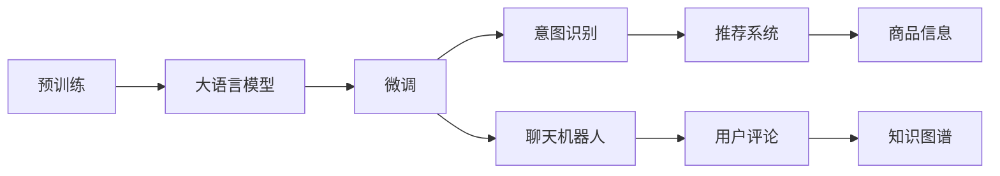

                 

# 电商平台中的自然语言处理：大模型的作用

> 关键词：自然语言处理, 大语言模型, 电商平台, 用户评论, 情感分析, 意图识别, 聊天机器人, 智能推荐, 知识图谱

## 1. 背景介绍

### 1.1 问题由来

随着电子商务的飞速发展，电商平台成为了全球最大的消费者互动平台之一。海量的用户评论、产品描述、交流对话等文本数据为电商平台提供了丰富的自然语言处理(NLP)应用场景。如何从中挖掘有价值的信息，提升用户购物体验和平台运营效率，成为了一个热门话题。传统的基于规则和统计的语言模型已无法满足日益复杂的业务需求，而大语言模型则为电商平台提供了新的解决方案。

### 1.2 问题核心关键点

1. **大语言模型的定义**：指以自回归或自编码模型为代表的大规模预训练语言模型，如BERT、GPT-3等。
2. **预训练与微调**：预训练指在大规模无标签文本语料上自监督学习任务，微调则是在预训练模型的基础上，通过有监督的微调来优化模型在特定任务上的性能。
3. **应用场景**：包括情感分析、意图识别、聊天机器人、智能推荐、知识图谱等，提升了电商平台的智能化水平。
4. **技术挑战**：文本数据的处理、模型的训练和优化、性能评估等。

### 1.3 问题研究意义

大语言模型在电商平台中的应用，能够帮助商家理解用户需求，优化商品推荐，提升客户服务质量，从而增强平台的竞争力和用户体验。研究大语言模型在电商平台中的应用，对推动NLP技术在电商领域的应用有重要意义。

## 2. 核心概念与联系

### 2.1 核心概念概述

#### 2.1.1 大语言模型

大语言模型（Large Language Model, LLM）是以自回归或自编码模型为代表的大规模预训练语言模型。通过在大规模无标签文本数据上进行预训练，学习到通用语言的表示，具备强大的语言理解和生成能力。

#### 2.1.2 预训练

预训练是指在大规模无标签文本语料上，通过自监督学习任务训练通用语言模型的过程。常见的预训练任务包括掩码语言模型、下一句预测等。

#### 2.1.3 微调

微调指在预训练模型的基础上，使用下游任务的少量标注数据，通过有监督学习优化模型在特定任务上的性能。通常只需要调整顶层分类器或解码器，并以较小的学习率更新全部或部分模型参数。

#### 2.1.4 意图识别

意图识别是指对用户的查询或评论进行语义理解，识别出用户的真正意图。例如，一个用户评论“这件衣服质量很差”，其意图可能是“退换货”或“给出差评”。

#### 2.1.5 聊天机器人

聊天机器人是一种基于自然语言处理的智能对话系统，可以自动回答用户的问题，提升客户服务效率和体验。

#### 2.1.6 知识图谱

知识图谱是将结构化的知识与自然语言文本相结合，构建起一个语义化的知识网络。在电商平台中，知识图谱可以用于商品信息的抽取和推荐。

### 2.2 核心概念原理和架构的 Mermaid 流程图



此图展示了预训练-微调流程以及各个概念之间的联系。

## 3. 核心算法原理 & 具体操作步骤

### 3.1 算法原理概述

基于大语言模型在电商平台中的应用，通常分为两个阶段：预训练和微调。

1. **预训练**：在大规模无标签文本数据上进行自监督学习任务，学习到通用的语言表示。
2. **微调**：使用下游任务的少量标注数据，通过有监督学习优化模型在特定任务上的性能。

### 3.2 算法步骤详解

#### 3.2.1 预训练阶段

1. **数据收集**：收集电商平台的文本数据，如商品描述、用户评论、聊天记录等。
2. **数据清洗**：去除噪声和低质量数据，提高数据质量。
3. **模型训练**：使用自监督学习任务，如掩码语言模型、下一句预测等，在大规模文本数据上预训练模型。
4. **模型保存**：将预训练好的模型保存到本地或云存储，以便后续微调使用。

#### 3.2.2 微调阶段

1. **数据准备**：根据具体任务需求，收集、处理和标注数据集。
2. **模型加载**：加载预训练好的模型，作为微调的初始化参数。
3. **模型微调**：使用少量标注数据，通过有监督学习优化模型在特定任务上的性能。
4. **模型评估**：在验证集上评估微调后的模型性能，调整参数和超参数。
5. **模型部署**：将微调好的模型部署到电商平台，提供实时服务。

### 3.3 算法优缺点

#### 3.3.1 优点

1. **通用性**：大语言模型可以应用于各种NLP任务，如意图识别、情感分析、聊天机器人等。
2. **高效性**：微调过程中只需要调整顶层部分参数，减少计算资源消耗。
3. **效果显著**：在少量标注数据下，微调模型能够快速提升任务性能。
4. **可扩展性**：大模型可以不断扩展和更新，提升其在复杂场景下的表现。

#### 3.3.2 缺点

1. **数据依赖**：微调效果依赖于标注数据的质量和数量，获取高质量标注数据的成本较高。
2. **过拟合风险**：在小规模数据集上微调，模型容易过拟合。
3. **推理成本**：大模型的推理计算成本较高，需要高性能的硬件支持。
4. **可解释性不足**：大模型通常被视为"黑盒"系统，难以解释其内部工作机制。

### 3.4 算法应用领域

#### 3.4.1 情感分析

通过分析用户评论的情感，电商平台可以及时了解用户对商品的满意程度，优化商品质量和服务流程。

#### 3.4.2 意图识别

意图识别可以帮助电商平台理解用户需求，提供更精准的推荐和服务。例如，当用户询问“这款手机在哪有卖？”时，系统可以识别出用户的意图是询问商品地点，从而提供相应的回答。

#### 3.4.3 聊天机器人

聊天机器人可以自动回答用户问题，提升客户服务效率和体验，尤其是在客服人员不足时，可以提供24小时不间断服务。

#### 3.4.4 智能推荐

基于用户评论和商品描述，电商平台的智能推荐系统可以分析用户偏好，提供个性化的商品推荐。

#### 3.4.5 知识图谱

知识图谱可以将商品信息结构化，构建起商品之间的关系网络，提升推荐系统的精准度。

## 4. 数学模型和公式 & 详细讲解 & 举例说明

### 4.1 数学模型构建

假设电商平台上的文本数据为 $D = \{(x_i, y_i)\}_{i=1}^N$，其中 $x_i$ 为文本，$y_i$ 为标签。大语言模型 $M_{\theta}$ 的预测输出为 $\hat{y}$，其损失函数为 $\ell$，则微调的优化目标为：

$$
\theta^* = \arg\min_\theta \frac{1}{N} \sum_{i=1}^N \ell(M_{\theta}(x_i), y_i)
$$

常见的损失函数包括交叉熵损失和均方误差损失。

### 4.2 公式推导过程

以二分类任务为例，假设模型 $M_{\theta}$ 在输入 $x$ 上的输出为 $\hat{y}=M_{\theta}(x)$，表示样本属于正类的概率。真实标签 $y \in \{0,1\}$。则二分类交叉熵损失函数定义为：

$$
\ell(M_{\theta}(x),y) = -[y\log \hat{y} + (1-y)\log(1-\hat{y})]
$$

将其代入经验风险公式，得：

$$
\mathcal{L}(\theta) = -\frac{1}{N}\sum_{i=1}^N [y_i\log M_{\theta}(x_i)+(1-y_i)\log(1-M_{\theta}(x_i))]
$$

根据链式法则，损失函数对参数 $\theta_k$ 的梯度为：

$$
\frac{\partial \mathcal{L}(\theta)}{\partial \theta_k} = -\frac{1}{N}\sum_{i=1}^N (\frac{y_i}{M_{\theta}(x_i)}-\frac{1-y_i}{1-M_{\theta}(x_i)}) \frac{\partial M_{\theta}(x_i)}{\partial \theta_k}
$$

其中 $\frac{\partial M_{\theta}(x_i)}{\partial \theta_k}$ 可进一步递归展开，利用自动微分技术完成计算。

### 4.3 案例分析与讲解

以情感分析任务为例，假设电商平台收集了1000条用户评论，其中500条标注为正面情感，500条标注为负面情感。使用BERT模型进行微调，首先加载BERT模型，然后根据评论情感标注数据进行微调。训练过程中，通过交叉熵损失函数进行优化，学习参数 $\theta$。

## 5. 项目实践：代码实例和详细解释说明

### 5.1 开发环境搭建

以下是使用PyTorch进行大语言模型微调的开发环境搭建步骤：

1. 安装Anaconda：
```bash
conda install anaconda
```

2. 创建并激活虚拟环境：
```bash
conda create -n nlp-env python=3.8 
conda activate nlp-env
```

3. 安装PyTorch和相关库：
```bash
pip install torch torchtext transformers
```

4. 安装其他必要工具：
```bash
pip install pandas numpy scikit-learn matplotlib tqdm jupyter notebook
```

### 5.2 源代码详细实现

以下是一个简单的情感分析微调代码示例：

```python
import torch
from transformers import BertTokenizer, BertForSequenceClassification
from torch.utils.data import DataLoader
from torch.nn import CrossEntropyLoss
from sklearn.metrics import accuracy_score, precision_recall_fscore_support

# 加载数据
train_data = ...
dev_data = ...
test_data = ...

# 定义模型
model = BertForSequenceClassification.from_pretrained('bert-base-cased', num_labels=2)
tokenizer = BertTokenizer.from_pretrained('bert-base-cased')
device = torch.device("cuda" if torch.cuda.is_available() else "cpu")

# 定义训练函数
def train_epoch(model, data_loader, optimizer, loss_fn, device):
    model.to(device)
    total_loss = 0
    for batch in data_loader:
        input_ids = batch['input_ids'].to(device)
        attention_mask = batch['attention_mask'].to(device)
        labels = batch['labels'].to(device)
        model.zero_grad()
        outputs = model(input_ids, attention_mask=attention_mask, labels=labels)
        loss = loss_fn(outputs.logits, labels)
        loss.backward()
        optimizer.step()
        total_loss += loss.item()
    return total_loss / len(data_loader)

# 定义评估函数
def evaluate(model, data_loader, loss_fn, device):
    model.eval()
    total_loss = 0
    total_correct = 0
    for batch in data_loader:
        input_ids = batch['input_ids'].to(device)
        attention_mask = batch['attention_mask'].to(device)
        labels = batch['labels'].to(device)
        with torch.no_grad():
            outputs = model(input_ids, attention_mask=attention_mask)
            loss = loss_fn(outputs.logits, labels)
            total_loss += loss.item()
            predictions = torch.argmax(outputs.logits, dim=1)
            total_correct += (predictions == labels).sum().item()
    acc = total_correct / len(data_loader.dataset)
    return acc, total_loss / len(data_loader)

# 训练模型
epochs = 3
batch_size = 32
optimizer = torch.optim.Adam(model.parameters(), lr=2e-5)
loss_fn = CrossEntropyLoss()

train_loader = DataLoader(train_data, batch_size=batch_size, shuffle=True)
dev_loader = DataLoader(dev_data, batch_size=batch_size, shuffle=False)
test_loader = DataLoader(test_data, batch_size=batch_size, shuffle=False)

for epoch in range(epochs):
    train_loss = train_epoch(model, train_loader, optimizer, loss_fn, device)
    dev_acc, dev_loss = evaluate(model, dev_loader, loss_fn, device)
    print(f"Epoch {epoch+1}, train loss: {train_loss:.3f}, dev acc: {dev_acc:.3f}, dev loss: {dev_loss:.3f}")

# 测试模型
test_acc, test_loss = evaluate(model, test_loader, loss_fn, device)
print(f"Test acc: {test_acc:.3f}, test loss: {test_loss:.3f}")
```

### 5.3 代码解读与分析

此代码实现了一个基于BERT模型的情感分析微调流程。其中：

- `train_epoch`函数：对训练集进行迭代，计算损失函数并更新模型参数。
- `evaluate`函数：对验证集和测试集进行评估，计算模型精度和损失。
- `train_loader`、`dev_loader`和`test_loader`：使用PyTorch的DataLoader加载数据集。

### 5.4 运行结果展示

运行上述代码，将输出每个epoch的训练损失、验证精度和损失。最终测试集上的精度和损失，可以帮助评估模型的性能。

## 6. 实际应用场景

### 6.1 电商平台中的情感分析

通过分析用户评论的情感，电商平台可以及时了解用户对商品的满意程度，优化商品质量和服务流程。例如，在商品评论中，如果负面情绪的评论增加，系统可以自动生成预警，提醒商家注意产品质量问题。

### 6.2 智能客服

聊天机器人可以自动回答用户问题，提升客户服务效率和体验，尤其是在客服人员不足时，可以提供24小时不间断服务。例如，当用户询问“退货流程是怎样的？”时，系统可以识别出用户的意图并给出详细回答。

### 6.3 智能推荐

基于用户评论和商品描述，电商平台的智能推荐系统可以分析用户偏好，提供个性化的商品推荐。例如，当用户浏览某类商品时，系统可以根据用户评论和商品描述生成推荐列表，提升购物体验。

### 6.4 未来应用展望

未来，大语言模型在电商平台中的应用将更加广泛和深入，具体方向包括：

1. **多模态数据融合**：将文本、图像、视频等多种数据类型融合，构建更加丰富的用户画像。
2. **知识图谱增强**：通过知识图谱提升商品推荐和搜索的精准度，为用户提供更全面的商品信息。
3. **个性化推荐**：结合用户行为数据和语义信息，实现更加精准的个性化推荐。
4. **自动化内容生成**：利用大模型自动生成商品描述、广告文案等文本内容，提升运营效率。
5. **反欺诈检测**：利用大模型对用户行为进行分析，检测异常交易，提升平台安全性。

## 7. 工具和资源推荐

### 7.1 学习资源推荐

1. **《自然语言处理入门》**：适合初学者入门，介绍了NLP的基本概念和常用技术。
2. **《深度学习》**：斯坦福大学课程，全面介绍了深度学习的基础和应用，包括自然语言处理。
3. **《Transformers从原理到实践》**：详细介绍了Transformer模型和大语言模型的原理及应用。
4. **《NLP圣经》**：全面介绍了NLP领域的研究进展和应用案例，是领域内的经典教材。
5. **CS224N课程**：斯坦福大学开设的NLP明星课程，有Lecture视频和配套作业，带你入门NLP领域的基本概念和经典模型。

### 7.2 开发工具推荐

1. **PyTorch**：基于Python的开源深度学习框架，适合快速迭代研究。
2. **TensorFlow**：由Google主导开发的开源深度学习框架，生产部署方便，适合大规模工程应用。
3. **Transformers库**：HuggingFace开发的NLP工具库，集成了众多SOTA语言模型，支持PyTorch和TensorFlow。
4. **TensorBoard**：TensorFlow配套的可视化工具，可实时监测模型训练状态，提供丰富的图表呈现方式。
5. **Weights & Biases**：模型训练的实验跟踪工具，可以记录和可视化模型训练过程中的各项指标。

### 7.3 相关论文推荐

1. **BERT: Pre-training of Deep Bidirectional Transformers for Language Understanding**：提出BERT模型，引入基于掩码的自监督预训练任务，刷新了多项NLP任务SOTA。
2. **Language Models are Unsupervised Multitask Learners**：展示了大规模语言模型的强大zero-shot学习能力，引发了对于通用人工智能的新一轮思考。
3. **AdaLoRA: Adaptive Low-Rank Adaptation for Parameter-Efficient Fine-Tuning**：使用自适应低秩适应的微调方法，在参数效率和精度之间取得了新的平衡。
4. **Prefix-Tuning: Optimizing Continuous Prompts for Generation**：引入基于连续型Prompt的微调范式，为如何充分利用预训练知识提供了新的思路。

## 8. 总结：未来发展趋势与挑战

### 8.1 研究成果总结

本文从大语言模型在电商平台中的应用出发，介绍了自然语言处理的原理和具体实现方法。通过情感分析、智能客服、智能推荐等实际应用场景，展示了大语言模型在电商平台中的强大潜力。

### 8.2 未来发展趋势

未来大语言模型在电商平台中的应用将更加广泛和深入，具体方向包括多模态数据融合、知识图谱增强、个性化推荐等。这些技术将提升电商平台的智能化水平，为用户提供更加优质的购物体验。

### 8.3 面临的挑战

虽然大语言模型在电商平台中的应用前景广阔，但也面临一些挑战，如数据隐私、计算成本、模型可解释性等。需要进一步研究并解决这些问题，才能将大语言模型更好地应用于电商平台中。

### 8.4 研究展望

未来的研究方向包括：

1. **多模态数据融合**：将文本、图像、视频等多种数据类型融合，构建更加丰富的用户画像。
2. **知识图谱增强**：通过知识图谱提升商品推荐和搜索的精准度。
3. **个性化推荐**：结合用户行为数据和语义信息，实现更加精准的个性化推荐。
4. **自动化内容生成**：利用大模型自动生成商品描述、广告文案等文本内容，提升运营效率。
5. **反欺诈检测**：利用大模型对用户行为进行分析，检测异常交易，提升平台安全性。

总之，大语言模型在电商平台中的应用前景广阔，未来的研究将进一步推动电商平台的智能化发展，提升用户体验和运营效率。

## 9. 附录：常见问题与解答

### Q1: 大语言模型微调是否适用于所有NLP任务？

A: 大语言模型微调在大多数NLP任务上都能取得不错的效果，特别是对于数据量较小的任务。但对于一些特定领域的任务，如医学、法律等，仅仅依靠通用语料预训练的模型可能难以很好地适应。此时需要在特定领域语料上进一步预训练，再进行微调，才能获得理想效果。

### Q2: 微调过程中如何选择合适的学习率？

A: 微调的学习率一般要比预训练时小1-2个数量级，如果使用过大的学习率，容易破坏预训练权重，导致过拟合。一般建议从1e-5开始调参，逐步减小学习率，直至收敛。也可以使用warmup策略，在开始阶段使用较小的学习率，再逐渐过渡到预设值。

### Q3: 采用大模型微调时会面临哪些资源瓶颈？

A: 目前主流的预训练大模型动辄以亿计的参数规模，对算力、内存、存储都提出了很高的要求。GPU/TPU等高性能设备是必不可少的，但即便如此，超大批次的训练和推理也可能遇到显存不足的问题。因此需要采用一些资源优化技术，如梯度积累、混合精度训练、模型并行等，来突破硬件瓶颈。

### Q4: 如何缓解微调过程中的过拟合问题？

A: 过拟合是微调面临的主要挑战，尤其是在标注数据不足的情况下。常见的缓解策略包括：数据增强、正则化、对抗训练、参数高效微调等。

### Q5: 微调模型在落地部署时需要注意哪些问题？

A: 将微调模型转化为实际应用，还需要考虑以下因素：模型裁剪、量化加速、服务化封装、弹性伸缩、监控告警、安全防护等。

---

作者：禅与计算机程序设计艺术 / Zen and the Art of Computer Programming

