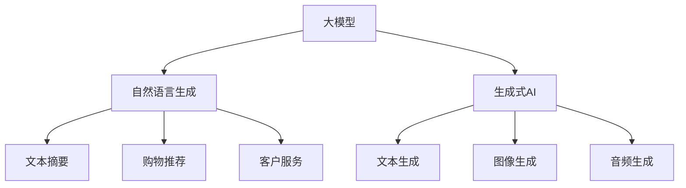

                 

# 电商平台中的自然语言生成报告：大模型的创新应用

> 关键词：电商平台, 自然语言处理, 大模型, 自然语言生成, 文本摘要, 购物推荐, 客户服务, 生成式AI

## 1. 背景介绍

### 1.1 问题由来

随着电商行业的发展，客户对购物体验的期望越来越高，他们不仅希望获得精准的商品推荐和即时客服服务，还需要易于理解的购物报告和个性化反馈。这些需求使得电商平台迫切需要强大的自然语言处理（NLP）能力，以提升用户体验和增加销售转化率。传统上，电商平台主要依赖人工客服和手动报告，但这种方式不仅效率低下，而且容易出错。

为了应对这些挑战，大模型在电商平台中的应用逐渐增多，特别是在自然语言生成（NLG）领域，大模型展示了强大的潜力。基于大模型的自然语言生成技术可以自动生成高质量的购物报告、客服回复、推荐文本等，大幅提升电商平台的运营效率和服务质量。本文将深入探讨大模型在电商平台中的应用，以及相关的核心概念和关键技术。

## 2. 核心概念与联系

### 2.1 核心概念概述

为更好地理解大模型在电商平台中的应用，本节将介绍几个密切相关的核心概念：

- **大模型(Large Model)**：指的是拥有大规模参数的深度学习模型，如GPT-3、BERT、T5等。这些模型通过在大规模无标签数据上进行预训练，学习到丰富的语言知识和语义表示。

- **自然语言生成(Natural Language Generation, NLG)**：指将结构化数据或知识转换为自然语言文本的过程，广泛应用于自动报告生成、客服对话、购物推荐等领域。

- **文本摘要(Text Summarization)**：指从长文本中提取关键信息，生成简洁的摘要文本。文本摘要在大模型中的应用，能够帮助用户快速了解商品详情和购物报告。

- **购物推荐(Shopping Recommendation)**：指根据用户历史行为和兴趣，生成个性化的商品推荐。大模型的自然语言生成能力，可以生成具有吸引力的推荐文本，提升转化率。

- **客户服务(Customer Service)**：指通过自动客服对话，解决用户疑问，提供个性化服务。大模型的自然语言生成技术，能够实现高效、友好的客户互动。

- **生成式AI(Generative AI)**：指能够生成创意内容（如图像、文本、音频等）的AI技术，大模型是生成式AI的重要组成部分。

这些核心概念之间的逻辑关系可以通过以下Mermaid流程图来展示：



这个流程图展示了大模型的核心概念及其之间的关系：

1. 大模型通过预训练获得基础能力。
2. 自然语言生成使得大模型能够生成具有一定语义和语法结构的文本。
3. 文本摘要和大模型结合，可以自动生成简洁的摘要文本。
4. 购物推荐和客户服务通过大模型的自然语言生成能力，生成个性化的推荐和客服回复。
5. 生成式AI将大模型的能力拓展到图像、音频等多种形式。

这些核心概念共同构成了大模型在电商平台中的应用框架，使其能够在各种场景下发挥强大的语言处理能力。通过理解这些核心概念，我们可以更好地把握大模型在电商平台中的应用前景。

## 3. 核心算法原理 & 具体操作步骤

### 3.1 算法原理概述

大模型在电商平台中的应用，主要基于自然语言生成技术。其核心思想是：将大模型的预训练权重作为初始化参数，通过微调（Fine-tuning）或微调加提示（Prompt Tuning）等方法，使其能够生成符合特定任务要求的自然语言文本。

在具体实现中，一般采用以下步骤：

1. **准备数据集**：收集电商平台相关的文本数据，如商品描述、购物报告、用户评论等。
2. **选择模型架构**：根据任务需求选择合适的模型架构，如GPT、BERT等。
3. **数据预处理**：对数据进行清洗、标注、划分训练集、验证集和测试集等预处理操作。
4. **模型训练**：使用微调或微调加提示的方法，训练模型生成自然语言文本。
5. **评估和优化**：在验证集和测试集上评估模型性能，根据结果优化模型参数或策略。

### 3.2 算法步骤详解

以下是基于大模型的自然语言生成在电商平台中的应用详细步骤：

**Step 1: 准备数据集**
- 收集电商平台相关的文本数据，如商品描述、购物报告、用户评论等。
- 将数据划分为训练集、验证集和测试集，确保各集数据分布一致。

**Step 2: 选择模型架构**
- 根据任务需求选择合适的模型架构，如GPT-3、BERT、T5等。
- 对于文本摘要和推荐任务，可以使用基于Transformer的模型。

**Step 3: 数据预处理**
- 对数据进行清洗，去除无关字符、噪声等。
- 对数据进行标注，如标记购物报告的类别、商品属性等。
- 使用分词器对文本进行分词，转换为模型可接受的格式。

**Step 4: 模型训练**
- 使用微调或微调加提示的方法，训练模型生成自然语言文本。
- 对于文本摘要，可以使用Transformer编码器，训练模型输出摘要长度。
- 对于购物推荐，可以使用GPT模型，训练模型生成推荐文本。

**Step 5: 评估和优化**
- 在验证集和测试集上评估模型性能，如BLEU、ROUGE等指标。
- 根据评估结果优化模型参数或训练策略，如调整学习率、使用正则化技术等。
- 在电商平台上进行实时测试，观察模型效果和用户体验。

### 3.3 算法优缺点

基于大模型的自然语言生成在电商平台中的应用具有以下优点：
1. **高效**：能够快速生成大量高质量的自然语言文本，节省人力和时间。
2. **个性化**：根据用户历史行为和兴趣，生成个性化的购物推荐和客服回复。
3. **可扩展**：适用于各种NLP任务，如购物报告、客服对话、推荐文本等。
4. **灵活性**：可以结合其他技术，如信息检索、机器翻译等，进一步提升用户体验。

同时，该方法也存在一定的局限性：
1. **依赖标注数据**：生成效果很大程度上依赖标注数据的质量和数量。
2. **复杂度较高**：需要处理大规模数据，训练和优化过程复杂。
3. **鲁棒性不足**：对噪声、错误数据较为敏感，容易产生不准确的结果。
4. **可解释性不足**：生成的文本可能缺乏逻辑和语义一致性。

尽管存在这些局限性，但大模型在电商平台中的应用已经取得了显著的效果，未来仍有巨大的潜力。

### 3.4 算法应用领域

大模型在电商平台中的应用主要集中在以下领域：

- **购物推荐**：根据用户历史行为和兴趣，生成个性化的推荐文本。
- **客户服务**：通过自动客服对话，解决用户疑问，提供个性化服务。
- **购物报告**：自动生成购物报告，帮助用户理解商品详情和购物体验。
- **商品描述**：生成商品描述，吸引用户注意力，提升转化率。
- **营销文案**：生成具有吸引力的营销文案，提升广告效果。

这些应用场景展示了大模型在电商平台中的强大功能，为提升用户体验和销售转化率提供了新的途径。

## 4. 数学模型和公式 & 详细讲解 & 举例说明

### 4.1 数学模型构建

在本节中，我们将以购物推荐任务为例，构建基于大模型的自然语言生成模型。假设我们要生成一个推荐文本，其形式为“推荐商品名称：[商品名称]，推荐理由：[理由]”。

定义模型为 $M_{\theta}$，其中 $\theta$ 为模型参数。假设训练集为 $\{(x_i,y_i)\}_{i=1}^N$，其中 $x_i$ 为商品信息，$y_i$ 为推荐文本。

定义损失函数 $\ell(M_{\theta}(x_i),y_i)$ 为生成文本与真实文本之间的差异，如交叉熵损失。

目标是最小化损失函数，即：

$$
\theta^* = \mathop{\arg\min}_{\theta} \sum_{i=1}^N \ell(M_{\theta}(x_i),y_i)
$$

### 4.2 公式推导过程

以购物推荐任务为例，推导基于大模型的自然语言生成模型的公式。

假设模型 $M_{\theta}$ 在输入 $x$ 上的输出为 $\hat{y}=M_{\theta}(x)$。对于每个样本 $(x,y)$，定义损失函数为：

$$
\ell(M_{\theta}(x),y) = -\log P(\hat{y}=y|x)
$$

其中 $P(\hat{y}=y|x)$ 为生成文本 $y$ 的条件概率，可以使用基于Transformer的解码器进行计算。

将上述损失函数代入目标函数，得：

$$
\theta^* = \mathop{\arg\min}_{\theta} \sum_{i=1}^N -\log P(\hat{y}=y_i|x_i)
$$

### 4.3 案例分析与讲解

以GPT-3为例，探讨其在电商平台中的具体应用。假设我们有一个电商平台，需要自动生成购物推荐文本。

首先，收集电商平台的商品信息，如商品名称、价格、销量等。将数据分为训练集、验证集和测试集，确保各集数据分布一致。

然后，使用GPT-3作为预训练模型，在商品信息上微调，使其能够生成推荐文本。微调过程分为以下步骤：

1. **准备数据集**：收集商品信息，将其转换为模型可接受的格式。
2. **模型选择**：选择GPT-3作为预训练模型。
3. **数据预处理**：对数据进行清洗和标注。
4. **模型训练**：使用微调的方法，训练模型生成推荐文本。
5. **评估和优化**：在验证集和测试集上评估模型性能，根据结果优化模型参数或策略。

在实际应用中，可以使用GPT-3的Tokenizer将商品信息转换为输入，使用其编码器进行编码，使用解码器生成推荐文本。最后，通过BLEU、ROUGE等指标评估生成文本的质量。

## 5. 项目实践：代码实例和详细解释说明

### 5.1 开发环境搭建

在进行自然语言生成实践前，我们需要准备好开发环境。以下是使用Python进行PyTorch开发的环境配置流程：

1. 安装Anaconda：从官网下载并安装Anaconda，用于创建独立的Python环境。

2. 创建并激活虚拟环境：
```bash
conda create -n pytorch-env python=3.8 
conda activate pytorch-env
```

3. 安装PyTorch：根据CUDA版本，从官网获取对应的安装命令。例如：
```bash
conda install pytorch torchvision torchaudio cudatoolkit=11.1 -c pytorch -c conda-forge
```

4. 安装Transformers库：
```bash
pip install transformers
```

5. 安装各类工具包：
```bash
pip install numpy pandas scikit-learn matplotlib tqdm jupyter notebook ipython
```

完成上述步骤后，即可在`pytorch-env`环境中开始自然语言生成实践。

### 5.2 源代码详细实现

下面我们以购物推荐任务为例，给出使用Transformers库对GPT-3模型进行自然语言生成的PyTorch代码实现。

首先，定义购物推荐任务的数据处理函数：

```python
from transformers import GPT2Tokenizer
from torch.utils.data import Dataset
import torch

class ShoppingRecommendationDataset(Dataset):
    def __init__(self, texts, labels, tokenizer, max_len=128):
        self.texts = texts
        self.labels = labels
        self.tokenizer = tokenizer
        self.max_len = max_len
        
    def __len__(self):
        return len(self.texts)
    
    def __getitem__(self, item):
        text = self.texts[item]
        label = self.labels[item]
        
        encoding = self.tokenizer(text, return_tensors='pt', max_length=self.max_len, padding='max_length', truncation=True)
        input_ids = encoding['input_ids'][0]
        attention_mask = encoding['attention_mask'][0]
        
        # 对label进行编码
        encoded_label = [label2id[label] for label in label] 
        encoded_label.extend([label2id['']]*(self.max_len - len(encoded_label)))
        labels = torch.tensor(encoded_label, dtype=torch.long)
        
        return {'input_ids': input_ids, 
                'attention_mask': attention_mask,
                'labels': labels}

# 标签与id的映射
label2id = {'推荐': 0, '不推荐': 1}
id2label = {v: k for k, v in label2id.items()}

# 创建dataset
tokenizer = GPT2Tokenizer.from_pretrained('gpt2')

train_dataset = ShoppingRecommendationDataset(train_texts, train_labels, tokenizer)
dev_dataset = ShoppingRecommendationDataset(dev_texts, dev_labels, tokenizer)
test_dataset = ShoppingRecommendationDataset(test_texts, test_labels, tokenizer)
```

然后，定义模型和优化器：

```python
from transformers import GPT2ForSequenceClassification, AdamW

model = GPT2ForSequenceClassification.from_pretrained('gpt2', num_labels=len(label2id))

optimizer = AdamW(model.parameters(), lr=2e-5)
```

接着，定义训练和评估函数：

```python
from torch.utils.data import DataLoader
from tqdm import tqdm
from sklearn.metrics import classification_report

device = torch.device('cuda') if torch.cuda.is_available() else torch.device('cpu')
model.to(device)

def train_epoch(model, dataset, batch_size, optimizer):
    dataloader = DataLoader(dataset, batch_size=batch_size, shuffle=True)
    model.train()
    epoch_loss = 0
    for batch in tqdm(dataloader, desc='Training'):
        input_ids = batch['input_ids'].to(device)
        attention_mask = batch['attention_mask'].to(device)
        labels = batch['labels'].to(device)
        model.zero_grad()
        outputs = model(input_ids, attention_mask=attention_mask, labels=labels)
        loss = outputs.loss
        epoch_loss += loss.item()
        loss.backward()
        optimizer.step()
    return epoch_loss / len(dataloader)

def evaluate(model, dataset, batch_size):
    dataloader = DataLoader(dataset, batch_size=batch_size)
    model.eval()
    preds, labels = [], []
    with torch.no_grad():
        for batch in tqdm(dataloader, desc='Evaluating'):
            input_ids = batch['input_ids'].to(device)
            attention_mask = batch['attention_mask'].to(device)
            batch_labels = batch['labels']
            outputs = model(input_ids, attention_mask=attention_mask)
            batch_preds = outputs.logits.argmax(dim=2).to('cpu').tolist()
            batch_labels = batch_labels.to('cpu').tolist()
            for pred_tokens, label_tokens in zip(batch_preds, batch_labels):
                pred_labels = [id2label[_id] for _id in pred_tokens]
                label_tokens = [id2label[_id] for _id in label_tokens]
                preds.append(pred_labels[:len(label_tokens)])
                labels.append(label_tokens)
                
    print(classification_report(labels, preds))
```

最后，启动训练流程并在测试集上评估：

```python
epochs = 5
batch_size = 16

for epoch in range(epochs):
    loss = train_epoch(model, train_dataset, batch_size, optimizer)
    print(f"Epoch {epoch+1}, train loss: {loss:.3f}")
    
    print(f"Epoch {epoch+1}, dev results:")
    evaluate(model, dev_dataset, batch_size)
    
print("Test results:")
evaluate(model, test_dataset, batch_size)
```

以上就是使用PyTorch对GPT-3进行购物推荐任务的自然语言生成完整代码实现。可以看到，得益于Transformers库的强大封装，我们可以用相对简洁的代码完成GPT-3模型的加载和微调。

### 5.3 代码解读与分析

让我们再详细解读一下关键代码的实现细节：

**ShoppingRecommendationDataset类**：
- `__init__`方法：初始化商品信息、标签、分词器等关键组件。
- `__len__`方法：返回数据集的样本数量。
- `__getitem__`方法：对单个样本进行处理，将商品信息输入编码为token ids，将标签编码为数字，并对其进行定长padding，最终返回模型所需的输入。

**label2id和id2label字典**：
- 定义了标签与数字id之间的映射关系，用于将预测结果解码回真实的标签。

**训练和评估函数**：
- 使用PyTorch的DataLoader对数据集进行批次化加载，供模型训练和推理使用。
- 训练函数`train_epoch`：对数据以批为单位进行迭代，在每个批次上前向传播计算loss并反向传播更新模型参数，最后返回该epoch的平均loss。
- 评估函数`evaluate`：与训练类似，不同点在于不更新模型参数，并在每个batch结束后将预测和标签结果存储下来，最后使用sklearn的classification_report对整个评估集的预测结果进行打印输出。

**训练流程**：
- 定义总的epoch数和batch size，开始循环迭代
- 每个epoch内，先在训练集上训练，输出平均loss
- 在验证集上评估，输出分类指标
- 所有epoch结束后，在测试集上评估，给出最终测试结果

可以看到，PyTorch配合Transformers库使得GPT-3微调的代码实现变得简洁高效。开发者可以将更多精力放在数据处理、模型改进等高层逻辑上，而不必过多关注底层的实现细节。

当然，工业级的系统实现还需考虑更多因素，如模型的保存和部署、超参数的自动搜索、更灵活的任务适配层等。但核心的微调范式基本与此类似。

## 6. 实际应用场景

### 6.1 智能客服系统

基于大模型的自然语言生成技术，可以广泛应用于智能客服系统的构建。传统客服往往需要配备大量人力，高峰期响应缓慢，且一致性和专业性难以保证。而使用微调后的自然语言生成模型，可以7x24小时不间断服务，快速响应客户咨询，用自然流畅的语言解答各类常见问题。

在技术实现上，可以收集企业内部的历史客服对话记录，将问题和最佳答复构建成监督数据，在此基础上对预训练自然语言生成模型进行微调。微调后的模型能够自动理解用户意图，匹配最合适的答案模板进行回复。对于客户提出的新问题，还可以接入检索系统实时搜索相关内容，动态组织生成回答。如此构建的智能客服系统，能大幅提升客户咨询体验和问题解决效率。

### 6.2 金融舆情监测

金融机构需要实时监测市场舆论动向，以便及时应对负面信息传播，规避金融风险。传统的人工监测方式成本高、效率低，难以应对网络时代海量信息爆发的挑战。基于大模型的自然语言生成技术，为金融舆情监测提供了新的解决方案。

具体而言，可以收集金融领域相关的新闻、报道、评论等文本数据，并对其进行主题标注和情感标注。在此基础上对预训练语言模型进行微调，使其能够自动判断文本属于何种主题，情感倾向是正面、中性还是负面。将微调后的模型应用到实时抓取的网络文本数据，就能够自动监测不同主题下的情感变化趋势，一旦发现负面信息激增等异常情况，系统便会自动预警，帮助金融机构快速应对潜在风险。

### 6.3 个性化推荐系统

当前的推荐系统往往只依赖用户的历史行为数据进行物品推荐，无法深入理解用户的真实兴趣偏好。基于大模型的自然语言生成技术，个性化推荐系统可以更好地挖掘用户行为背后的语义信息，从而提供更精准、多样的推荐内容。

在实践中，可以收集用户浏览、点击、评论、分享等行为数据，提取和用户交互的物品标题、描述、标签等文本内容。将文本内容作为模型输入，用户的后续行为（如是否点击、购买等）作为监督信号，在此基础上微调预训练语言模型。微调后的模型能够从文本内容中准确把握用户的兴趣点。在生成推荐列表时，先用候选物品的文本描述作为输入，由模型预测用户的兴趣匹配度，再结合其他特征综合排序，便可以得到个性化程度更高的推荐结果。

### 6.4 未来应用展望

随着大模型和自然语言生成技术的发展，基于自然语言生成技术的应用将越来越广泛，为各行各业带来新的变革。

在智慧医疗领域，基于自然语言生成技术的医疗问答、病历分析、药物研发等应用将提升医疗服务的智能化水平，辅助医生诊疗，加速新药开发进程。

在智能教育领域，自然语言生成技术可应用于作业批改、学情分析、知识推荐等方面，因材施教，促进教育公平，提高教学质量。

在智慧城市治理中，自然语言生成技术可应用于城市事件监测、舆情分析、应急指挥等环节，提高城市管理的自动化和智能化水平，构建更安全、高效的未来城市。

此外，在企业生产、社会治理、文娱传媒等众多领域，基于自然语言生成技术的AI应用也将不断涌现，为经济社会发展注入新的动力。相信随着技术的日益成熟，自然语言生成技术将成为人工智能落地应用的重要范式，推动人工智能技术更好地造福人类社会。

## 7. 工具和资源推荐
### 7.1 学习资源推荐

为了帮助开发者系统掌握大模型在电商平台中的应用，这里推荐一些优质的学习资源：

1. 《Transformer从原理到实践》系列博文：由大模型技术专家撰写，深入浅出地介绍了Transformer原理、GPT模型、自然语言生成等前沿话题。

2. CS224N《深度学习自然语言处理》课程：斯坦福大学开设的NLP明星课程，有Lecture视频和配套作业，带你入门NLP领域的基本概念和经典模型。

3. 《Natural Language Processing with Transformers》书籍：Transformers库的作者所著，全面介绍了如何使用Transformers库进行NLP任务开发，包括自然语言生成在内的诸多范式。

4. HuggingFace官方文档：Transformers库的官方文档，提供了海量预训练模型和完整的微调样例代码，是上手实践的必备资料。

5. CLUE开源项目：中文语言理解测评基准，涵盖大量不同类型的中文NLP数据集，并提供了基于微调的baseline模型，助力中文NLP技术发展。

通过对这些资源的学习实践，相信你一定能够快速掌握大模型在电商平台中的应用，并用于解决实际的NLP问题。
###  7.2 开发工具推荐

高效的开发离不开优秀的工具支持。以下是几款用于大模型在电商平台中自然语言生成应用的常用工具：

1. PyTorch：基于Python的开源深度学习框架，灵活动态的计算图，适合快速迭代研究。大部分预训练语言模型都有PyTorch版本的实现。

2. TensorFlow：由Google主导开发的开源深度学习框架，生产部署方便，适合大规模工程应用。同样有丰富的预训练语言模型资源。

3. Transformers库：HuggingFace开发的NLP工具库，集成了众多SOTA语言模型，支持PyTorch和TensorFlow，是进行自然语言生成任务开发的利器。

4. Weights & Biases：模型训练的实验跟踪工具，可以记录和可视化模型训练过程中的各项指标，方便对比和调优。与主流深度学习框架无缝集成。

5. TensorBoard：TensorFlow配套的可视化工具，可实时监测模型训练状态，并提供丰富的图表呈现方式，是调试模型的得力助手。

6. Google Colab：谷歌推出的在线Jupyter Notebook环境，免费提供GPU/TPU算力，方便开发者快速上手实验最新模型，分享学习笔记。

合理利用这些工具，可以显著提升大模型在电商平台中的应用效率，加快创新迭代的步伐。

### 7.3 相关论文推荐

大模型和自然语言生成技术的发展源于学界的持续研究。以下是几篇奠基性的相关论文，推荐阅读：

1. Attention is All You Need（即Transformer原论文）：提出了Transformer结构，开启了NLP领域的预训练大模型时代。

2. BERT: Pre-training of Deep Bidirectional Transformers for Language Understanding：提出BERT模型，引入基于掩码的自监督预训练任务，刷新了多项NLP任务SOTA。

3. Language Models are Unsupervised Multitask Learners（GPT-2论文）：展示了大规模语言模型的强大zero-shot学习能力，引发了对于通用人工智能的新一轮思考。

4. Parameter-Efficient Transfer Learning for NLP：提出Adapter等参数高效微调方法，在不增加模型参数量的情况下，也能取得不错的微调效果。

5. Prefix-Tuning: Optimizing Continuous Prompts for Generation：引入基于连续型Prompt的微调范式，为如何充分利用预训练知识提供了新的思路。

6. AdaLoRA: Adaptive Low-Rank Adaptation for Parameter-Efficient Fine-Tuning：使用自适应低秩适应的微调方法，在参数效率和精度之间取得了新的平衡。

这些论文代表了大模型在电商平台中的应用发展脉络。通过学习这些前沿成果，可以帮助研究者把握学科前进方向，激发更多的创新灵感。

## 8. 总结：未来发展趋势与挑战

### 8.1 总结

本文对基于大模型的自然语言生成技术在电商平台中的应用进行了全面系统的介绍。首先阐述了大模型和自然语言生成技术的研究背景和意义，明确了自然语言生成技术在提升电商用户体验和销售转化率方面的独特价值。其次，从原理到实践，详细讲解了自然语言生成模型的数学原理和关键步骤，给出了自然语言生成任务开发的完整代码实例。同时，本文还广泛探讨了自然语言生成技术在智能客服、金融舆情、个性化推荐等多个行业领域的应用前景，展示了自然语言生成技术的强大功能。

通过本文的系统梳理，可以看到，基于大模型的自然语言生成技术正在成为电商平台中的重要工具，为提升用户体验和销售转化率提供了新的途径。

### 8.2 未来发展趋势

展望未来，自然语言生成技术在电商平台中的应用将呈现以下几个发展趋势：

1. **高效化**：随着预训练模型的不断优化，自然语言生成模型的训练和推理速度将进一步提升，适应实时化、高并发的应用场景。

2. **个性化**：通过结合用户历史数据和实时反馈，自然语言生成模型将生成更加个性化、符合用户喜好的推荐和客服回复。

3. **多模态化**：结合图像、视频、音频等多模态数据，提升自然语言生成模型的表现力和交互体验。

4. **可解释化**：提升自然语言生成模型的可解释性，增加用户对系统决策的信任度和接受度。

5. **交互智能化**：通过自然语言理解技术，使自然语言生成模型能够理解用户意图，实现更加智能、人性化的交互体验。

6. **应用泛化**：自然语言生成技术将逐渐拓展到更多行业，如医疗、教育、金融等领域，带来更多创新应用。

以上趋势凸显了大模型在电商平台中的应用前景。这些方向的探索发展，必将进一步提升自然语言生成技术在电商领域的性能和应用范围，为消费者带来更加智能、便捷的购物体验。

### 8.3 面临的挑战

尽管自然语言生成技术在电商平台中的应用已经取得了显著效果，但在迈向更加智能化、普适化应用的过程中，它仍面临着诸多挑战：

1. **数据质量**：自然语言生成模型的性能很大程度上依赖于训练数据的质量和数量，而电商领域的数据往往存在噪声、缺失等问题。如何处理这些数据，提高模型泛化能力，是一大难题。

2. **模型鲁棒性**：自然语言生成模型在面对噪声、错误数据时，容易产生不准确的结果。如何增强模型的鲁棒性，避免误导性输出，还需要更多理论和实践的积累。

3. **计算资源**：自然语言生成模型的训练和推理需要大量的计算资源，特别是在大模型和实时化应用场景中，如何优化模型结构和计算图，减少资源消耗，是未来的重要研究方向。

4. **可解释性**：自然语言生成模型的决策过程缺乏可解释性，难以对其推理逻辑进行分析和调试。如何赋予模型更强的可解释性，是提高用户信任和接受度的关键。

5. **伦理道德**：自然语言生成模型可能学习到有偏见、有害的信息，通过客服对话等渠道传递给用户。如何从数据和算法层面消除模型偏见，避免恶意用途，确保输出的安全性，也是重要的研究课题。

6. **多样性**：自然语言生成模型在面对不同语言、文化背景的用户时，容易出现输出不当或不适。如何提高模型的多样性，避免文化偏见，需要更多跨文化数据和实验。

以上挑战需要研究者从数据、算法、工程、伦理等多个维度协同发力，才能确保自然语言生成技术在电商平台中的广泛应用和可持续性发展。

### 8.4 研究展望

面对自然语言生成技术所面临的挑战，未来的研究需要在以下几个方面寻求新的突破：

1. **数据增强**：结合数据生成技术，增强训练数据的多样性和质量，提高模型的泛化能力。

2. **模型优化**：通过模型压缩、稀疏化、量化等方法，优化模型结构和计算图，提高模型推理效率和资源利用率。

3. **跨文化建模**：开发跨文化适应的自然语言生成模型，提升模型的多样性和包容性。

4. **多模态融合**：结合图像、视频、音频等多模态数据，提升自然语言生成模型的表现力和交互体验。

5. **伦理约束**：引入伦理导向的评估指标，过滤和惩罚有偏见、有害的输出倾向，确保模型的伦理和安全。

6. **用户反馈机制**：引入用户反馈机制，动态优化模型，提升用户体验和满意度。

这些研究方向的探索，必将引领自然语言生成技术在电商平台中的应用走向新的高度，为电商平台的智能化和个性化发展注入新的动力。总之，自然语言生成技术是大模型在电商平台中的重要应用范式，通过不断创新和优化，必将在构建更加智能、便捷的电商平台上发挥重要作用。

## 9. 附录：常见问题与解答

**Q1：自然语言生成模型在电商平台中的应用是否受限于数据质量？**

A: 自然语言生成模型的性能很大程度上依赖于训练数据的质量和数量。电商领域的数据往往存在噪声、缺失等问题，但可以通过数据增强、正则化等技术提高模型泛化能力。未来，结合数据生成技术，进一步增强训练数据的多样性和质量，将是提升模型性能的重要方向。

**Q2：如何增强自然语言生成模型的鲁棒性？**

A: 增强自然语言生成模型的鲁棒性，需要从数据、算法和模型结构等多个层面进行优化。具体措施包括：
1. 数据清洗：去除噪声、异常数据，确保训练数据的质量。
2. 正则化：使用L2正则、Dropout等技术，防止模型过拟合。
3. 对抗训练：引入对抗样本，提高模型鲁棒性。
4. 模型压缩：通过剪枝、量化等方法，优化模型结构，减少资源消耗。

**Q3：自然语言生成模型在电商平台中的训练和推理速度如何优化？**

A: 优化自然语言生成模型的训练和推理速度，需要从模型压缩、稀疏化、量化等方法进行改进。具体措施包括：
1. 模型压缩：通过剪枝、量化等方法，优化模型结构，减少资源消耗。
2. 稀疏化：使用稀疏矩阵存储模型参数，减少存储空间和计算资源。
3. 多设备协同：结合GPU、TPU等设备，提高模型训练和推理速度。
4. 分布式训练：使用分布式训练技术，加速模型训练过程。

**Q4：自然语言生成模型的可解释性如何提升？**

A: 提升自然语言生成模型的可解释性，需要从模型设计、特征提取、后处理等多个层面进行改进。具体措施包括：
1. 特征解释：引入特征重要性评估方法，解释模型生成文本的关键特征。
2. 规则集成：结合规则库、知识图谱等专家知识，提高模型的可解释性。
3. 用户反馈：引入用户反馈机制，动态优化模型，提升用户体验和满意度。

**Q5：自然语言生成模型在电商平台中的应用是否存在伦理风险？**

A: 自然语言生成模型可能学习到有偏见、有害的信息，通过客服对话等渠道传递给用户。为避免伦理风险，可以采取以下措施：
1. 数据过滤：在训练数据中过滤掉有害、偏见的数据。
2. 模型监控：实时监控模型输出，及时发现和纠正有害输出。
3. 用户反馈：引入用户反馈机制，动态优化模型，提升用户体验和满意度。

综上所述，自然语言生成模型在电商平台中的应用面临着数据质量、鲁棒性、计算资源、可解释性、伦理道德等诸多挑战。但通过不断的技术创新和优化，这些挑战必将逐步得到解决，自然语言生成技术将在电商平台中发挥更加重要的作用。相信随着技术的日益成熟，自然语言生成技术必将成为电商平台的必备工具，为提升用户体验和销售转化率提供新的途径。

