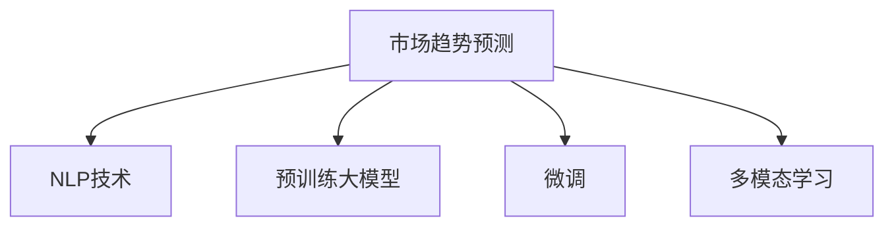

                 

# 电商平台如何利用AI大模型进行市场趋势预测

## 1. 背景介绍

在当今电子商务时代，电商平台需要实时了解市场动态，预测未来趋势，以便做出更精准的市场决策。传统的市场预测方法依赖于历史数据，面对日新月异的市场环境，预测的准确性往往受限。而随着人工智能和大模型的发展，通过先进的机器学习和自然语言处理技术，电商平台能够对市场趋势进行更为精准的预测，提升决策效率和业务收益。本文将介绍如何利用AI大模型进行市场趋势预测，并深入探讨其中的关键技术和应用场景。

## 2. 核心概念与联系

### 2.1 核心概念概述

为了更全面地理解如何利用AI大模型进行市场趋势预测，我们先简要介绍一下相关核心概念：

- **市场趋势预测**：指通过对历史市场数据和相关因素的分析，预测未来市场走势的过程。常见的预测目标包括商品销量、价格波动、用户行为变化等。
- **自然语言处理(NLP)**：涉及计算机对自然语言文本的自动化处理，包括分词、命名实体识别、情感分析、语义理解等技术，可以用于从新闻、社交媒体、评论等非结构化数据中提取有价值的信息。
- **预训练大模型(Pre-trained Large Models)**：指在无监督环境下，通过大规模数据集进行预训练，具备强大学习能力的大模型，如BERT、GPT等。
- **微调(Fine-tuning)**：在大模型基础上，通过有监督学习方法进行任务特定的训练，使其能够更准确地预测市场趋势。
- **多模态学习(Multimodal Learning)**：结合文本、图像、音频等多模态数据，从不同角度分析市场趋势，提升预测准确性。

这些核心概念通过一个简单的Mermaid流程图来展示：



### 2.2 核心概念原理和架构

1. **市场趋势预测原理**：
   - 利用机器学习模型，特别是大模型，通过分析历史市场数据和相关因素，预测未来趋势。常用模型包括线性回归、支持向量机、随机森林、神经网络等。

2. **NLP技术原理**：
   - 使用自然语言处理技术，提取文本信息，进行实体识别、情感分析、关键词提取等，从中获取有价值的市场特征。

3. **预训练大模型原理**：
   - 通过在大规模无标签数据上预训练，学习通用的语言表示，具备强大的语义理解和生成能力。常用模型包括BERT、GPT、RoBERTa等。

4. **微调原理**：
   - 在大模型基础上，通过有监督学习方法，针对具体预测任务进行训练，使模型能够更好地适应市场特征，提高预测准确性。

5. **多模态学习原理**：
   - 结合文本、图像、音频等多种数据模态，从不同角度分析市场趋势，提高预测的全面性和准确性。

## 3. 核心算法原理 & 具体操作步骤

### 3.1 算法原理概述

市场趋势预测的核心是构建一个能够准确预测未来市场变化的模型。本文将主要介绍基于深度学习的大模型在市场趋势预测中的应用，主要包括以下步骤：

1. **数据收集与预处理**：收集与市场相关的历史数据，包括商品销量、价格、用户行为等，并进行数据清洗和预处理。
2. **特征提取**：使用NLP技术从新闻、社交媒体等非结构化数据中提取市场特征。
3. **预训练大模型引入**：引入预训练大模型，作为初始化模型，具备通用的语言表示能力。
4. **微调过程**：在大模型基础上，通过微调过程，针对市场趋势预测任务进行训练，提升模型准确性。
5. **多模态数据融合**：结合文本、图像、音频等多种数据模态，进一步提升预测效果。

### 3.2 算法步骤详解

#### 3.2.1 数据收集与预处理

1. **数据来源**：
   - 历史销售数据：包括销售额、库存量、订单数量等。
   - 新闻和社交媒体：获取相关商品的新闻报道、社交媒体评论、用户评论等。
   - 经济指标：获取与市场相关的宏观经济指标，如GDP、失业率、通货膨胀率等。

2. **数据清洗**：
   - 处理缺失值：使用插值、均值填补等方法处理缺失数据。
   - 去除异常值：识别并去除明显异常的数据点。
   - 数据归一化：将不同维度的数据归一化到同一量级。

3. **特征提取**：
   - 利用NLP技术从新闻和社交媒体中提取情感、关键词等信息，作为市场特征。
   - 对经济指标进行标准化处理，转化为数值型特征。

#### 3.2.2 预训练大模型引入

1. **模型选择**：
   - 选择预训练大模型BERT、GPT等作为初始化模型。
   - 根据任务特点，选择相应的预训练模型，如情感分析使用BERT，文本分类使用GPT。

2. **模型加载**：
   - 使用相关库加载预训练模型，如利用Hugging Face的Transformers库加载BERT模型。
   - 冻结预训练模型的大部分参数，仅微调顶层，减少计算开销。

#### 3.2.3 微调过程

1. **任务适配层设计**：
   - 针对具体预测任务，设计合适的任务适配层。例如，对于价格预测任务，可以添加一个线性分类器。
   - 设计损失函数，如均方误差、交叉熵等。

2. **微调参数设置**：
   - 设置学习率、批大小、迭代轮数等超参数。
   - 使用AdamW、SGD等优化算法。
   - 应用正则化技术，如L2正则、Dropout等。

3. **模型训练与评估**：
   - 使用训练集进行模型训练，计算损失函数，反向传播更新模型参数。
   - 在验证集上评估模型性能，根据验证集损失调整学习率等参数。
   - 在测试集上最终评估模型预测性能，使用指标如RMSE、MAE等。

#### 3.2.4 多模态数据融合

1. **图像数据**：
   - 使用图像处理技术，如卷积神经网络(CNN)提取商品图片特征。
   - 将图像特征与文本特征融合，使用拼接、注意力机制等方法。

2. **音频数据**：
   - 使用音频处理技术，如隐马尔可夫模型(HMM)、卷积神经网络(CNN)提取音频特征。
   - 将音频特征与文本特征融合，使用拼接、注意力机制等方法。

### 3.3 算法优缺点

#### 3.3.1 优点

1. **高效性**：利用预训练大模型，能够快速适应新任务，减少从头训练的时间成本。
2. **准确性**：大模型具备强大的语义理解能力，能够从多角度提取市场特征，提高预测准确性。
3. **可解释性**：预训练模型和微调过程能够提供有价值的模型解释，帮助理解预测结果。
4. **可扩展性**：结合多模态数据，能够覆盖更广泛的市场特征，提高预测全面性。

#### 3.3.2 缺点

1. **数据依赖性**：微调过程依赖于标注数据，数据获取成本较高。
2. **模型复杂性**：大模型参数量庞大，计算资源消耗高。
3. **过拟合风险**：微调过程易受到数据分布偏差的影响，可能导致过拟合。
4. **隐私问题**：处理用户评论等敏感数据时，需要注意隐私保护。

## 4. 数学模型和公式 & 详细讲解 & 举例说明

### 4.1 数学模型构建

假设我们有n个市场样本数据$(x_i,y_i)$，其中$x_i$为市场特征，$y_i$为市场趋势（如价格、销量等）。设预训练大模型为$M_{\theta}$，其中$\theta$为预训练参数，任务适配层为$H_{\omega}$，其中$\omega$为适配层参数。微调的目标函数为：

$$
\min_{\omega} \frac{1}{N} \sum_{i=1}^N (y_i - H_{\omega}(M_{\theta}(x_i)))^2
$$

### 4.2 公式推导过程

假设$M_{\theta}$为预训练大模型，$H_{\omega}$为适配层，$L$为损失函数，则微调过程的损失函数为：

$$
\mathcal{L}(\theta,\omega) = \frac{1}{N} \sum_{i=1}^N L(y_i, H_{\omega}(M_{\theta}(x_i)))
$$

其中$L$为损失函数，如均方误差、交叉熵等。对于价格预测任务，$L$可定义为：

$$
L(y_i, \hat{y_i}) = (y_i - \hat{y_i})^2
$$

### 4.3 案例分析与讲解

以商品价格预测为例，分析微调过程。

1. **数据准备**：
   - 收集商品价格历史数据，使用时间序列方法处理，得到价格趋势。
   - 收集商品的新闻报道、社交媒体评论等，使用NLP技术提取情感、关键词等信息。
   - 将经济指标如GDP、失业率等转化为数值型特征。

2. **模型构建**：
   - 使用BERT模型作为预训练模型，冻结其底层参数，仅微调顶层。
   - 设计适配层$H_{\omega}$，将其与BERT模型输出拼接，添加线性分类器，计算预测价格。
   - 设置损失函数为均方误差，计算预测误差。

3. **训练与评估**：
   - 使用训练集训练模型，计算损失函数，反向传播更新适配层参数$\omega$。
   - 在验证集上评估模型性能，调整学习率等超参数。
   - 在测试集上最终评估模型预测性能，使用RMSE、MAE等指标。

## 5. 项目实践：代码实例和详细解释说明

### 5.1 开发环境搭建

1. **环境安装**：
   - 安装Python 3.8，使用Anaconda创建虚拟环境。
   - 安装TensorFlow、Keras、Pandas、Numpy等库。

2. **数据准备**：
   - 收集历史销售数据，新闻和社交媒体数据，经济指标数据。
   - 进行数据清洗、预处理、特征提取。

### 5.2 源代码详细实现

```python
import tensorflow as tf
from tensorflow.keras import layers, models
from transformers import TFBertForSequenceClassification
from sklearn.model_selection import train_test_split

# 加载数据
data = load_data()  # 自定义数据加载函数

# 特征处理
features = preprocess_data(data)  # 自定义特征处理函数

# 构建模型
model = models.Sequential()
model.add(tf.keras.layers.Input(shape=(特征维度,)))
model.add(tf.keras.layers.Dense(128, activation='relu'))
model.add(tf.keras.layers.Dense(1))

# 加载预训练模型
bert = TFBertForSequenceClassification.from_pretrained('bert-base-uncased')

# 微调过程
model.add(bert.layers)
model.compile(optimizer='adam', loss='mse')
history = model.fit(features_train, labels_train, epochs=10, validation_data=(features_val, labels_val))

# 预测与评估
y_pred = model.predict(features_test)
rmse = tf.keras.metrics.MeanAbsoluteError()
rmse.update_state(y_pred, labels_test)
print(f"RMSE: {rmse.result().numpy()}")
```

### 5.3 代码解读与分析

1. **数据加载**：
   - 使用自定义函数`load_data()`加载历史销售数据、新闻和社交媒体数据、经济指标数据。
   - 使用`preprocess_data()`函数进行数据预处理，包括清洗、特征提取等操作。

2. **模型构建**：
   - 使用`Sequential`模型，添加输入层、适配层、输出层。
   - 加载预训练BERT模型，将其添加到模型中。

3. **微调过程**：
   - 编译模型，设置优化器、损失函数。
   - 使用训练集训练模型，在验证集上评估性能，调整超参数。
   - 在测试集上最终评估模型预测性能，使用RMSE等指标。

## 6. 实际应用场景

### 6.1 电商销量预测

电商企业可以利用大模型进行商品销量预测，提前备货，减少库存积压，提升库存周转率。通过结合历史销售数据、用户评论、新闻报道等，构建预测模型，准确预测未来销量趋势，指导采购和库存管理。

### 6.2 价格动态调整

电商平台可以根据大模型预测的价格趋势，动态调整商品价格，提高销售额和利润率。利用大模型预测节假日、促销活动等特殊时期的价格波动，进行精准定价，提升用户满意度和购买意愿。

### 6.3 用户行为分析

电商平台可以利用大模型分析用户行为，了解用户偏好，优化推荐系统。通过分析用户浏览、购买、评论等数据，预测用户未来行为，推荐最适合的商品，提升用户粘性和转化率。

### 6.4 市场舆情监控

电商平台可以通过大模型监控市场舆情，识别负面信息，及时应对。利用新闻、社交媒体等非结构化数据，分析用户情绪、市场动态，提前预警潜在的市场风险，采取相应措施。

### 6.5 客户关系管理

电商平台可以利用大模型分析客户反馈，提升客户满意度。通过分析用户评论、客服聊天记录等数据，了解客户需求和痛点，优化产品和服务，提升客户忠诚度和口碑。

### 6.6 营销策略优化

电商平台可以利用大模型优化营销策略，提升广告投放效果。通过分析用户行为数据、市场趋势预测，制定精准的广告投放计划，提升广告点击率和转化率。

## 7. 工具和资源推荐

### 7.1 学习资源推荐

1. **《深度学习与人工智能应用》系列书籍**：介绍深度学习、自然语言处理等技术，涵盖市场预测、情感分析等实际应用。
2. **Coursera《自然语言处理》课程**：斯坦福大学教授讲授的NLP入门课程，涵盖文本处理、模型构建、微调等技术。
3. **Kaggle竞赛**：参加Kaggle比赛，获取实际市场数据，练习市场预测模型构建。
4. **ArXiv论文**：关注最新研究成果，学习前沿市场预测算法。

### 7.2 开发工具推荐

1. **TensorFlow**：强大的深度学习框架，支持分布式训练，适用于大规模模型微调。
2. **Keras**：高层次的深度学习API，简单易用，适用于快速原型开发。
3. **Scikit-learn**：机器学习库，支持多种模型训练和评估。
4. **Pandas**：数据处理库，支持大规模数据预处理。
5. **Numpy**：科学计算库，支持高效矩阵运算。

### 7.3 相关论文推荐

1. **《LSTM在电商领域的应用》**：介绍LSTM模型在电商预测中的应用，提升预测准确性。
2. **《预训练大模型在市场预测中的应用》**：分析预训练大模型在市场预测中的作用，提高预测全面性和准确性。
3. **《多模态学习在电商市场预测中的应用》**：结合文本、图像、音频等多种数据模态，提升电商市场预测效果。

## 8. 总结：未来发展趋势与挑战

### 8.1 研究成果总结

本文详细介绍了如何利用AI大模型进行市场趋势预测，探讨了核心算法原理和具体操作步骤，并通过实际应用场景分析，展示了其广阔前景。未来，随着大模型的不断发展，市场预测的准确性和效率将大幅提升。

### 8.2 未来发展趋势

1. **模型规模不断增大**：随着算力提升和数据规模的扩展，大模型参数量将持续增长，预测效果将更加准确。
2. **多模态融合不断深化**：结合文本、图像、音频等多种数据模态，从多个角度分析市场趋势，提升预测全面性。
3. **实时预测能力增强**：利用分布式计算和大模型推理优化，实现实时市场趋势预测，满足动态市场需求。
4. **模型可解释性增强**：引入因果分析、博弈论等工具，提升模型预测的解释性和可控性。
5. **数据隐私保护加强**：采用差分隐私、联邦学习等技术，保护用户隐私和数据安全。

### 8.3 面临的挑战

1. **数据获取成本高**：获取高质量的市场数据，成本较高，需要持续投入。
2. **计算资源消耗大**：大模型训练和推理消耗大量计算资源，需要优化资源使用。
3. **过拟合风险高**：市场预测易受到数据分布偏差的影响，可能导致过拟合。
4. **隐私和安全问题**：处理用户数据时，需要严格保护隐私和数据安全。
5. **模型复杂度高**：大模型参数量庞大，训练和推理过程复杂，需要优化模型结构。

### 8.4 研究展望

未来，在市场预测领域，需要从以下几个方向进行研究：

1. **无监督和半监督学习**：摆脱对大规模标注数据的依赖，利用自监督学习、主动学习等方法，提高数据利用率。
2. **多任务学习**：在预测一个任务的同时，预测其他相关任务，提升模型泛化性和实用性。
3. **持续学习**：利用新数据持续更新模型，保持模型时效性和适应性。
4. **联邦学习**：通过联邦学习技术，在分布式环境中训练大模型，保护数据隐私。
5. **因果分析**：引入因果分析方法，提升模型预测的因果性和逻辑性，增强预测的可解释性。

## 9. 附录：常见问题与解答

### Q1：如何选择合适的预训练大模型？

A：选择合适的预训练大模型需要考虑以下几个因素：
1. 任务类型：根据预测任务类型选择相应的大模型，如情感分析使用BERT，文本分类使用GPT。
2. 数据规模：选择数据规模与模型规模相匹配的大模型，避免过拟合或欠拟合。
3. 预训练任务：选择与任务相关性高的大模型，提升预测效果。

### Q2：微调过程中需要注意哪些问题？

A：微调过程中需要注意以下几个问题：
1. 学习率设置：根据任务复杂度和学习曲线，合理设置学习率，避免过拟合。
2. 数据平衡：确保训练集、验证集、测试集的数据分布平衡，避免模型过拟合。
3. 正则化技术：应用L2正则、Dropout等技术，防止模型过拟合。
4. 模型集成：通过模型集成技术，提升预测准确性，减少单模型过拟合风险。

### Q3：多模态数据如何融合？

A：多模态数据的融合可以通过以下几个步骤实现：
1. 特征提取：使用不同的特征提取模型（如CNN、LSTM）分别提取文本、图像、音频等特征。
2. 拼接：将不同模态的特征拼接在一起，形成高维特征向量。
3. 注意力机制：引入注意力机制，对不同模态的特征进行加权，提高融合效果。

### Q4：大模型在市场预测中的优势和局限性？

A：大模型在市场预测中的优势和局限性如下：
优势：
1. 强大的语义理解能力，能够从多角度提取市场特征。
2. 能够处理大规模数据，提升预测准确性。
3. 可以进行实时预测，满足动态市场需求。
局限性：
1. 数据依赖性强，获取高质量市场数据成本高。
2. 计算资源消耗大，需要优化资源使用。
3. 过拟合风险高，需要应用正则化技术。

### Q5：如何优化大模型的训练和推理过程？

A：优化大模型的训练和推理过程可以通过以下几个步骤实现：
1. 模型压缩：使用模型压缩技术，减小模型尺寸，提升推理速度。
2. 梯度累积：使用梯度累积技术，提高模型训练效率。
3. 混合精度训练：使用混合精度训练技术，减少计算资源消耗。
4. 分布式训练：使用分布式训练技术，提高模型训练速度。
5. 模型量化：使用模型量化技术，提升模型推理速度和资源利用率。

---
作者：禅与计算机程序设计艺术 / Zen and the Art of Computer Programming

