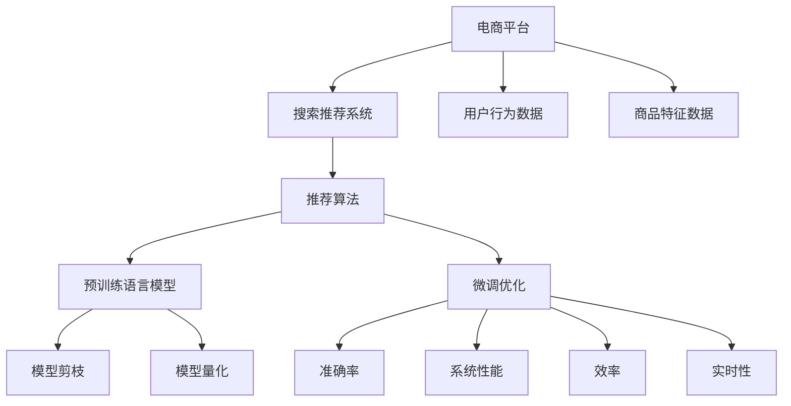

                 

# 电商平台搜索推荐系统的AI 大模型优化：提高系统性能、效率、准确率与实时性

> 关键词：电商平台,搜索推荐系统,大模型优化,系统性能,效率,准确率,实时性

## 1. 背景介绍

### 1.1 问题由来

随着电商平台用户数量和在线交易规模的持续增长，个性化推荐系统（Recommender System）已经成为平台提高用户体验、增加用户留存率、提升转化率的关键技术。传统的基于规则、协同过滤等推荐算法逐渐被基于深度学习的推荐算法所取代。其中，使用预训练语言模型进行推荐系统的微调，成为了当前研究的热点。

预训练语言模型，如BERT、GPT等，通过大规模无标签文本数据进行预训练，学习到了丰富的语言知识和语义表示。这些模型通过微调，能够适应电商平台的推荐任务，学习到用户行为与商品特征之间的映射关系。基于此，电商平台的搜索推荐系统可以快速响应用户需求，提供精准的商品推荐，显著提升用户的购物体验。

然而，电商推荐系统面临的挑战也日益严峻：用户多样性高、数据分布不均、实时性要求高。为了应对这些挑战，需要在大模型的基础上进行优化，以提高推荐系统的性能、效率、准确率和实时性。

## 2. 核心概念与联系

### 2.1 核心概念概述

为更好地理解如何优化基于大模型的电商平台搜索推荐系统，本节将介绍几个关键概念：

- **电商平台搜索推荐系统**：使用个性化推荐算法为用户推荐感兴趣的商品或内容。常见的算法包括基于内容的推荐、协同过滤、深度学习推荐等。

- **大模型优化**：在预训练大模型的基础上，通过微调、剪枝、量化等技术手段，对模型进行优化，以提高模型性能和效率。

- **系统性能**：指推荐系统的推荐准确率、覆盖率和用户满意度等关键指标。

- **效率**：指推荐系统的计算速度、内存占用和响应时间等技术指标。

- **准确率**：指推荐系统推荐商品的正确概率，即预测用户会点击或购买某商品的概率。

- **实时性**：指推荐系统能够实时响应用户请求，提供实时推荐的能力。

这些概念之间的逻辑关系可以通过以下Mermaid流程图来展示：



这个流程图展示了电商推荐系统的大致工作流程，以及如何通过大模型优化提升各个性能指标。

## 3. 核心算法原理 & 具体操作步骤
### 3.1 算法原理概述

基于大模型的电商平台搜索推荐系统优化，本质上是结合电商推荐算法和深度学习模型优化技术的融合应用。其核心思想是：将预训练语言模型视作一个强大的特征提取器，通过微调和优化，提高其在推荐任务上的性能。

具体而言，通过在电商推荐数据集上微调预训练语言模型，学习用户行为和商品特征之间的映射关系，并结合推荐算法进行优化。优化过程通常包括以下几个步骤：

1. **数据准备**：收集电商平台的搜索和购买数据，并进行数据清洗和标注。
2. **模型微调**：使用电商推荐数据集对预训练语言模型进行微调，学习用户行为和商品特征之间的映射关系。
3. **性能优化**：对微调后的模型进行剪枝、量化等优化操作，以提高模型的计算效率。
4. **实时优化**：结合推荐算法，进行实时推理，提升推荐系统的响应速度。

### 3.2 算法步骤详解

#### 3.2.1 数据准备

电商平台的推荐数据集通常包含以下关键信息：

- **用户行为数据**：用户的浏览历史、点击行为、购买记录等。
- **商品特征数据**：商品的分类、价格、评分、标签等信息。

为了构建高质量的电商推荐数据集，需要进行以下操作：

- **数据清洗**：去除噪声数据和异常值，提高数据质量。
- **数据标注**：对用户行为数据进行标注，如用户点击某商品或购买某商品等。
- **数据增强**：通过数据增强技术，扩充训练集，提高模型泛化能力。

#### 3.2.2 模型微调

电商平台的推荐任务通常包括以下两种形式：

- **基于用户行为推荐**：根据用户的历史行为数据，预测其感兴趣的商品。
- **基于商品特征推荐**：根据商品的特征数据，预测用户对该商品的需求。

因此，电商平台的推荐模型通常包括两个部分：

- **用户行为预测模型**：使用预训练语言模型，结合用户行为数据进行微调，学习用户行为的表示。
- **商品特征预测模型**：使用预训练语言模型，结合商品特征数据进行微调，学习商品特征的表示。

具体的微调过程包括：

- **模型选择**：选择合适的预训练语言模型，如BERT、GPT等。
- **任务适配**：根据推荐任务类型，设计合适的损失函数和优化目标。
- **微调训练**：使用电商推荐数据集对模型进行微调，学习用户行为和商品特征之间的映射关系。

#### 3.2.3 性能优化

微调后的模型通常包含大量的参数，为了提高模型的计算效率和响应速度，需要进行以下优化操作：

- **模型剪枝**：去除模型中的冗余参数，减少模型大小。
- **模型量化**：将浮点数参数转换为定点数参数，减少计算量和内存占用。
- **模型加速**：使用GPU、TPU等高性能计算设备，加速模型的推理过程。

#### 3.2.4 实时优化

为了提高推荐系统的实时性，需要在模型推理过程中进行优化：

- **动态图优化**：使用动态图技术，实时生成推荐结果。
- **增量更新**：使用增量更新技术，在模型推理过程中进行动态参数更新。
- **并行计算**：使用并行计算技术，提升模型的推理速度。

### 3.3 算法优缺点

基于大模型的电商平台搜索推荐系统优化方法具有以下优点：

1. **性能提升显著**：使用预训练语言模型进行微调，能够显著提高推荐系统的准确率和用户满意度。
2. **泛化能力强**：预训练语言模型具备较强的泛化能力，能够适应不同的推荐任务和数据分布。
3. **实时性高**：通过优化模型推理过程，能够实现实时推荐，提升用户体验。

同时，该方法也存在以下缺点：

1. **数据需求高**：电商推荐数据集需要大量标注，获取高质量数据成本较高。
2. **计算资源需求高**：模型参数量大，计算资源需求较高，对硬件设备要求高。
3. **模型复杂度高**：微调后的模型复杂度较高，维护和部署难度大。
4. **优化难度高**：优化过程需要多轮实验和调参，工作量大。

### 3.4 算法应用领域

基于大模型的电商平台搜索推荐系统优化方法，已经在多个电商平台的推荐系统中得到了广泛应用，如亚马逊、淘宝、京东等。具体的应用领域包括：

- **商品推荐**：根据用户的历史行为和商品特征，推荐用户可能感兴趣的商品。
- **个性化广告**：根据用户的行为和兴趣，推荐相关的广告内容。
- **搜索排序**：根据用户输入的查询词，推荐最相关的商品列表。
- **商品评论分析**：分析用户对商品的评论，进行情感分析，提供商品评分和评价。
- **库存管理**：根据用户的行为数据，预测商品的销售情况，进行库存管理。

除了上述这些经典应用外，基于大模型的电商平台搜索推荐系统优化方法，还在更多创新场景中得到应用，如语音搜索、多模态推荐、推荐系统优化等，为电商平台的智能化发展提供了新的技术路径。

## 4. 数学模型和公式 & 详细讲解
### 4.1 数学模型构建

电商平台的推荐系统通常包括用户行为预测模型和商品特征预测模型。以下以用户行为预测模型为例，介绍基于大模型的推荐系统数学模型构建方法。

设用户行为预测模型为 $M_{\theta}:\mathcal{X} \rightarrow \mathcal{Y}$，其中 $\mathcal{X}$ 为输入空间，$\mathcal{Y}$ 为输出空间，$\theta$ 为模型参数。电商推荐数据集为 $D=\{(x_i,y_i)\}_{i=1}^N, x_i \in \mathcal{X}, y_i \in \mathcal{Y}$。

定义模型 $M_{\theta}$ 在数据样本 $(x,y)$ 上的损失函数为 $\ell(M_{\theta}(x),y)$，则在数据集 $D$ 上的经验风险为：

$$
\mathcal{L}(\theta) = \frac{1}{N} \sum_{i=1}^N \ell(M_{\theta}(x_i),y_i)
$$

微调的目标是最小化经验风险，即找到最优参数：

$$
\theta^* = \mathop{\arg\min}_{\theta} \mathcal{L}(\theta)
$$

在实践中，我们通常使用基于梯度的优化算法（如SGD、Adam等）来近似求解上述最优化问题。设 $\eta$ 为学习率，$\lambda$ 为正则化系数，则参数的更新公式为：

$$
\theta \leftarrow \theta - \eta \nabla_{\theta}\mathcal{L}(\theta) - \eta\lambda\theta
$$

其中 $\nabla_{\theta}\mathcal{L}(\theta)$ 为损失函数对参数 $\theta$ 的梯度，可通过反向传播算法高效计算。

### 4.2 公式推导过程

以下我们以二分类任务为例，推导交叉熵损失函数及其梯度的计算公式。

假设模型 $M_{\theta}$ 在输入 $x$ 上的输出为 $\hat{y}=M_{\theta}(x) \in [0,1]$，表示用户点击某商品的概率。真实标签 $y \in \{0,1\}$。则二分类交叉熵损失函数定义为：

$$
\ell(M_{\theta}(x),y) = -[y\log \hat{y} + (1-y)\log (1-\hat{y})]
$$

将其代入经验风险公式，得：

$$
\mathcal{L}(\theta) = -\frac{1}{N}\sum_{i=1}^N [y_i\log M_{\theta}(x_i)+(1-y_i)\log(1-M_{\theta}(x_i))]
$$

根据链式法则，损失函数对参数 $\theta_k$ 的梯度为：

$$
\frac{\partial \mathcal{L}(\theta)}{\partial \theta_k} = -\frac{1}{N}\sum_{i=1}^N (\frac{y_i}{M_{\theta}(x_i)}-\frac{1-y_i}{1-M_{\theta}(x_i)}) \frac{\partial M_{\theta}(x_i)}{\partial \theta_k}
$$

其中 $\frac{\partial M_{\theta}(x_i)}{\partial \theta_k}$ 可进一步递归展开，利用自动微分技术完成计算。

在得到损失函数的梯度后，即可带入参数更新公式，完成模型的迭代优化。重复上述过程直至收敛，最终得到适应电商推荐任务的最优模型参数 $\theta^*$。

### 4.3 案例分析与讲解

假设电商平台的数据集 $D$ 中包含 $N$ 个样本 $(x_i,y_i)$，其中 $x_i$ 为用户的浏览历史，$y_i$ 为用户是否点击了该商品。定义模型 $M_{\theta}$ 为预训练语言模型BERT，其微调的目标是预测用户是否点击某商品。

#### 4.3.1 数据准备

首先，需要将用户的浏览历史 $x_i$ 转换为模型可以处理的格式。可以使用自然语言处理技术，如分词、编码等，将文本数据转换为模型可处理的向量形式。

#### 4.3.2 模型微调

将转换后的数据 $x_i$ 输入模型 $M_{\theta}$，得到预测结果 $\hat{y}=M_{\theta}(x_i) \in [0,1]$。定义损失函数 $\ell(M_{\theta}(x_i),y_i)$ 为二分类交叉熵，即：

$$
\ell(M_{\theta}(x_i),y_i) = -[y_i\log \hat{y} + (1-y_i)\log (1-\hat{y})]
$$

使用训练集 $D$ 上的数据进行微调，损失函数为：

$$
\mathcal{L}(\theta) = -\frac{1}{N}\sum_{i=1}^N [y_i\log M_{\theta}(x_i)+(1-y_i)\log(1-M_{\theta}(x_i))]
$$

使用基于梯度的优化算法，如AdamW，进行模型微调。优化目标是最小化损失函数 $\mathcal{L}(\theta)$，更新模型参数 $\theta$，直至收敛。

## 5. 项目实践：代码实例和详细解释说明
### 5.1 开发环境搭建

在进行电商平台搜索推荐系统的大模型优化实践前，我们需要准备好开发环境。以下是使用Python进行PyTorch开发的环境配置流程：

1. 安装Anaconda：从官网下载并安装Anaconda，用于创建独立的Python环境。

2. 创建并激活虚拟环境：
```bash
conda create -n pytorch-env python=3.8 
conda activate pytorch-env
```

3. 安装PyTorch：根据CUDA版本，从官网获取对应的安装命令。例如：
```bash
conda install pytorch torchvision torchaudio cudatoolkit=11.1 -c pytorch -c conda-forge
```

4. 安装Transformers库：
```bash
pip install transformers
```

5. 安装各类工具包：
```bash
pip install numpy pandas scikit-learn matplotlib tqdm jupyter notebook ipython
```

完成上述步骤后，即可在`pytorch-env`环境中开始大模型优化实践。

### 5.2 源代码详细实现

下面我们以电商平台搜索推荐系统为例，给出使用Transformers库对BERT模型进行大模型优化的PyTorch代码实现。

首先，定义电商推荐数据集和标签：

```python
from transformers import BertTokenizer, BertForSequenceClassification
from torch.utils.data import Dataset, DataLoader
import torch

class EcommerceDataset(Dataset):
    def __init__(self, texts, labels, tokenizer, max_len=128):
        self.texts = texts
        self.labels = labels
        self.tokenizer = tokenizer
        self.max_len = max_len
        
    def __len__(self):
        return len(self.texts)
    
    def __getitem__(self, item):
        text = self.texts[item]
        label = self.labels[item]
        
        encoding = self.tokenizer(text, return_tensors='pt', max_length=self.max_len, padding='max_length', truncation=True)
        input_ids = encoding['input_ids'][0]
        attention_mask = encoding['attention_mask'][0]
        
        # 对标签进行编码
        encoded_label = label2id[label] if label in label2id else 0
        
        return {'input_ids': input_ids, 
                'attention_mask': attention_mask,
                'labels': torch.tensor(encoded_label, dtype=torch.long)}
```

然后，定义模型和优化器：

```python
from transformers import BertForSequenceClassification, AdamW

model = BertForSequenceClassification.from_pretrained('bert-base-cased', num_labels=len(label2id))

optimizer = AdamW(model.parameters(), lr=2e-5)
```

接着，定义训练和评估函数：

```python
from sklearn.metrics import accuracy_score

device = torch.device('cuda') if torch.cuda.is_available() else torch.device('cpu')
model.to(device)

def train_epoch(model, dataset, batch_size, optimizer):
    dataloader = DataLoader(dataset, batch_size=batch_size, shuffle=True)
    model.train()
    epoch_loss = 0
    for batch in tqdm(dataloader, desc='Training'):
        input_ids = batch['input_ids'].to(device)
        attention_mask = batch['attention_mask'].to(device)
        labels = batch['labels'].to(device)
        model.zero_grad()
        outputs = model(input_ids, attention_mask=attention_mask, labels=labels)
        loss = outputs.loss
        epoch_loss += loss.item()
        loss.backward()
        optimizer.step()
    return epoch_loss / len(dataloader)

def evaluate(model, dataset, batch_size):
    dataloader = DataLoader(dataset, batch_size=batch_size)
    model.eval()
    preds, labels = [], []
    with torch.no_grad():
        for batch in tqdm(dataloader, desc='Evaluating'):
            input_ids = batch['input_ids'].to(device)
            attention_mask = batch['attention_mask'].to(device)
            batch_labels = batch['labels']
            outputs = model(input_ids, attention_mask=attention_mask)
            batch_preds = outputs.logits.argmax(dim=2).to('cpu').tolist()
            batch_labels = batch_labels.to('cpu').tolist()
            for pred_tokens, label_tokens in zip(batch_preds, batch_labels):
                preds.append(pred_tokens[:len(label_tokens)])
                labels.append(label_tokens)
                
    print('Accuracy:', accuracy_score(labels, preds))
```

最后，启动训练流程并在测试集上评估：

```python
epochs = 5
batch_size = 16

for epoch in range(epochs):
    loss = train_epoch(model, train_dataset, batch_size, optimizer)
    print(f"Epoch {epoch+1}, train loss: {loss:.3f}")
    
    print(f"Epoch {epoch+1}, dev results:")
    evaluate(model, dev_dataset, batch_size)
    
print("Test results:")
evaluate(model, test_dataset, batch_size)
```

以上就是使用PyTorch对BERT进行电商推荐系统大模型优化的完整代码实现。可以看到，得益于Transformers库的强大封装，我们可以用相对简洁的代码完成BERT模型的加载和微调。

### 5.3 代码解读与分析

让我们再详细解读一下关键代码的实现细节：

**EcommerceDataset类**：
- `__init__`方法：初始化文本、标签、分词器等关键组件。
- `__len__`方法：返回数据集的样本数量。
- `__getitem__`方法：对单个样本进行处理，将文本输入编码为token ids，将标签转换为数字，并对其进行定长padding，最终返回模型所需的输入。

**label2id字典**：
- 定义了标签与数字id之间的映射关系，用于将标签转换为数字，供模型进行预测。

**训练和评估函数**：
- 使用PyTorch的DataLoader对数据集进行批次化加载，供模型训练和推理使用。
- 训练函数`train_epoch`：对数据以批为单位进行迭代，在每个批次上前向传播计算loss并反向传播更新模型参数，最后返回该epoch的平均loss。
- 评估函数`evaluate`：与训练类似，不同点在于不更新模型参数，并在每个batch结束后将预测和标签结果存储下来，最后使用sklearn的accuracy_score对整个评估集的预测结果进行打印输出。

**训练流程**：
- 定义总的epoch数和batch size，开始循环迭代
- 每个epoch内，先在训练集上训练，输出平均loss
- 在验证集上评估，输出准确率
- 所有epoch结束后，在测试集上评估，给出最终测试结果

可以看到，PyTorch配合Transformers库使得BERT电商推荐系统的优化代码实现变得简洁高效。开发者可以将更多精力放在数据处理、模型改进等高层逻辑上，而不必过多关注底层的实现细节。

当然，工业级的系统实现还需考虑更多因素，如模型的保存和部署、超参数的自动搜索、更灵活的任务适配层等。但核心的微调范式基本与此类似。

## 6. 实际应用场景
### 6.1 智能客服系统

基于大语言模型微调的对话技术，可以广泛应用于智能客服系统的构建。传统客服往往需要配备大量人力，高峰期响应缓慢，且一致性和专业性难以保证。而使用微调后的对话模型，可以7x24小时不间断服务，快速响应客户咨询，用自然流畅的语言解答各类常见问题。

在技术实现上，可以收集企业内部的历史客服对话记录，将问题和最佳答复构建成监督数据，在此基础上对预训练对话模型进行微调。微调后的对话模型能够自动理解用户意图，匹配最合适的答案模板进行回复。对于客户提出的新问题，还可以接入检索系统实时搜索相关内容，动态组织生成回答。如此构建的智能客服系统，能大幅提升客户咨询体验和问题解决效率。

### 6.2 金融舆情监测

金融机构需要实时监测市场舆论动向，以便及时应对负面信息传播，规避金融风险。传统的人工监测方式成本高、效率低，难以应对网络时代海量信息爆发的挑战。基于大语言模型微调的文本分类和情感分析技术，为金融舆情监测提供了新的解决方案。

具体而言，可以收集金融领域相关的新闻、报道、评论等文本数据，并对其进行主题标注和情感标注。在此基础上对预训练语言模型进行微调，使其能够自动判断文本属于何种主题，情感倾向是正面、中性还是负面。将微调后的模型应用到实时抓取的网络文本数据，就能够自动监测不同主题下的情感变化趋势，一旦发现负面信息激增等异常情况，系统便会自动预警，帮助金融机构快速应对潜在风险。

### 6.3 个性化推荐系统

当前的推荐系统往往只依赖用户的历史行为数据进行物品推荐，无法深入理解用户的真实兴趣偏好。基于大语言模型微调技术，个性化推荐系统可以更好地挖掘用户行为背后的语义信息，从而提供更精准、多样的推荐内容。

在实践中，可以收集用户浏览、点击、评论、分享等行为数据，提取和用户交互的物品标题、描述、标签等文本内容。将文本内容作为模型输入，用户的后续行为（如是否点击、购买等）作为监督信号，在此基础上微调预训练语言模型。微调后的模型能够从文本内容中准确把握用户的兴趣点。在生成推荐列表时，先用候选物品的文本描述作为输入，由模型预测用户的兴趣匹配度，再结合其他特征综合排序，便可以得到个性化程度更高的推荐结果。

### 6.4 未来应用展望

随着大语言模型微调技术的发展，基于微调范式将在更多领域得到应用，为传统行业带来变革性影响。

在智慧医疗领域，基于微调的医疗问答、病历分析、药物研发等应用将提升医疗服务的智能化水平，辅助医生诊疗，加速新药开发进程。

在智能教育领域，微调技术可应用于作业批改、学情分析、知识推荐等方面，因材施教，促进教育公平，提高教学质量。

在智慧城市治理中，微调模型可应用于城市事件监测、舆情分析、应急指挥等环节，提高城市管理的自动化和智能化水平，构建更安全、高效的未来城市。

此外，在企业生产、社会治理、文娱传媒等众多领域，基于大模型微调的人工智能应用也将不断涌现，为经济社会发展注入新的动力。相信随着技术的日益成熟，微调方法将成为人工智能落地应用的重要范式，推动人工智能技术在各个垂直行业中的深入应用。

## 7. 工具和资源推荐
### 7.1 学习资源推荐

为了帮助开发者系统掌握大模型微调的理论基础和实践技巧，这里推荐一些优质的学习资源：

1. 《Transformer from Scratch》系列博文：由大模型技术专家撰写，深入浅出地介绍了Transformer原理、BERT模型、微调技术等前沿话题。

2. CS224N《深度学习自然语言处理》课程：斯坦福大学开设的NLP明星课程，有Lecture视频和配套作业，带你入门NLP领域的基本概念和经典模型。

3. 《Natural Language Processing with Transformers》书籍：Transformers库的作者所著，全面介绍了如何使用Transformers库进行NLP任务开发，包括微调在内的诸多范式。

4. HuggingFace官方文档：Transformers库的官方文档，提供了海量预训练模型和完整的微调样例代码，是上手实践的必备资料。

5. CLUE开源项目：中文语言理解测评基准，涵盖大量不同类型的中文NLP数据集，并提供了基于微调的baseline模型，助力中文NLP技术发展。

通过对这些资源的学习实践，相信你一定能够快速掌握大模型微调的精髓，并用于解决实际的NLP问题。
###  7.2 开发工具推荐

高效的开发离不开优秀的工具支持。以下是几款用于大语言模型微调开发的常用工具：

1. PyTorch：基于Python的开源深度学习框架，灵活动态的计算图，适合快速迭代研究。大部分预训练语言模型都有PyTorch版本的实现。

2. TensorFlow：由Google主导开发的开源深度学习框架，生产部署方便，适合大规模工程应用。同样有丰富的预训练语言模型资源。

3. Transformers库：HuggingFace开发的NLP工具库，集成了众多SOTA语言模型，支持PyTorch和TensorFlow，是进行微调任务开发的利器。

4. Weights & Biases：模型训练的实验跟踪工具，可以记录和可视化模型训练过程中的各项指标，方便对比和调优。与主流深度学习框架无缝集成。

5. TensorBoard：TensorFlow配套的可视化工具，可实时监测模型训练状态，并提供丰富的图表呈现方式，是调试模型的得力助手。

6. Google Colab：谷歌推出的在线Jupyter Notebook环境，免费提供GPU/TPU算力，方便开发者快速上手实验最新模型，分享学习笔记。

合理利用这些工具，可以显著提升大语言模型微调任务的开发效率，加快创新迭代的步伐。

### 7.3 相关论文推荐

大语言模型和微调技术的发展源于学界的持续研究。以下是几篇奠基性的相关论文，推荐阅读：

1. Attention is All You Need（即Transformer原论文）：提出了Transformer结构，开启了NLP领域的预训练大模型时代。

2. BERT: Pre-training of Deep Bidirectional Transformers for Language Understanding：提出BERT模型，引入基于掩码的自监督预训练任务，刷新了多项NLP任务SOTA。

3. Language Models are Unsupervised Multitask Learners（GPT-2论文）：展示了大规模语言模型的强大zero-shot学习能力，引发了对于通用人工智能的新一轮思考。

4. Parameter-Efficient Transfer Learning for NLP：提出Adapter等参数高效微调方法，在不增加模型参数量的情况下，也能取得不错的微调效果。

5. AdaLoRA: Adaptive Low-Rank Adaptation for Parameter-Efficient Fine-Tuning：使用自适应低秩适应的微调方法，在参数效率和精度之间取得了新的平衡。

这些论文代表了大语言模型微调技术的发展脉络。通过学习这些前沿成果，可以帮助研究者把握学科前进方向，激发更多的创新灵感。

## 8. 总结：未来发展趋势与挑战
### 8.1 总结

本文对基于大模型的电商平台搜索推荐系统优化方法进行了全面系统的介绍。首先阐述了大模型优化在电商平台推荐系统中的重要性和研究背景，明确了优化技术在提升系统性能、效率、准确率和实时性方面的独特价值。其次，从原理到实践，详细讲解了电商推荐系统的数学模型构建和优化算法步骤，给出了电商推荐系统的完整代码实例。同时，本文还广泛探讨了电商推荐系统在智能客服、金融舆情、个性化推荐等多个行业领域的应用前景，展示了微调范式的巨大潜力。此外，本文精选了微调技术的各类学习资源，力求为读者提供全方位的技术指引。

通过本文的系统梳理，可以看到，基于大模型的电商推荐系统优化方法正在成为推荐系统的重要范式，极大地拓展了电商平台的智能化水平，提升了用户体验。未来，伴随大模型微调技术的不断发展，推荐系统的性能和应用范围还将进一步提升。

### 8.2 未来发展趋势

展望未来，大模型优化技术在电商推荐系统中的应用将呈现以下几个发展趋势：

1. **深度融合更多数据源**：未来推荐系统将深度融合更多数据源，如社交媒体数据、用户评价数据、图像数据等，以提高推荐系统的个性化和多样性。

2. **跨领域知识迁移**：推荐系统将借鉴跨领域的知识迁移技术，如知识图谱、逻辑规则等，提高推荐的准确性和可信度。

3. **实时动态优化**：推荐系统将实现动态优化，根据用户行为实时调整推荐策略，提升推荐的实时性和响应速度。

4. **对抗训练和鲁棒性提升**：推荐系统将引入对抗训练等技术，提高模型的鲁棒性和抗干扰能力，确保推荐结果的稳定性和安全性。

5. **多模态数据融合**：推荐系统将融合多模态数据，如文本、图像、音频等，提高模型的感知能力和泛化能力。

6. **算法透明性和可解释性**：推荐系统将加强算法透明性和可解释性，提供推荐结果的解释机制，增强用户信任和接受度。

以上趋势凸显了大模型优化技术的广阔前景。这些方向的探索发展，必将进一步提升推荐系统的性能和应用范围，为电商平台的智能化发展提供新的技术路径。

### 8.3 面临的挑战

尽管大模型优化技术在电商推荐系统中取得了显著成效，但在迈向更加智能化、普适化应用的过程中，仍面临诸多挑战：

1. **数据隐私和安全**：电商推荐系统需要处理大量用户行为数据，涉及隐私保护和安全问题。如何在保护用户隐私的前提下，获取高质量数据，是大模型优化面临的主要挑战。

2. **计算资源消耗**：大模型优化通常需要高计算资源，对硬件设备要求高，可能面临计算成本高昂的问题。如何优化资源使用，提高计算效率，是大模型优化需要解决的难题。

3. **算法复杂度**：大模型优化过程涉及多轮微调、剪枝、量化等操作，工作量大，模型复杂度高，维护难度大。如何在保持模型性能的前提下，简化优化过程，是大模型优化需要考虑的因素。

4. **公平性和公正性**：电商推荐系统可能存在推荐偏差，导致部分用户群体被边缘化。如何确保推荐系统的公平性和公正性，是大模型优化需要解决的问题。

5. **跨域迁移能力**：推荐系统在不同领域和任务上的迁移能力不足，可能影响模型的泛化性能。如何在不同任务和领域间进行知识迁移，是大模型优化需要探索的方向。

6. **可解释性和可信任度**：推荐系统通常被视为"黑盒"系统，缺乏可解释性。如何提高模型的可解释性和可信任度，是大模型优化需要关注的问题。

这些挑战需要通过多学科的协同攻关，逐步解决。只有不断克服技术瓶颈，才能推动大模型优化技术在电商推荐系统中的广泛应用。

### 8.4 研究展望

面对电商推荐系统中的挑战，未来的研究需要在以下几个方面寻求新的突破：

1. **多源数据融合技术**：开发能够高效融合多种数据源的技术，如多模态数据融合、跨领域知识迁移等，提升推荐系统的多样性和泛化能力。

2. **模型压缩与量化**：研究高效压缩与量化技术，降低大模型的计算资源消耗，提升推荐系统的实时性和可部署性。

3. **动态优化算法**：开发能够动态优化推荐模型的算法，实时调整模型参数，提高推荐的实时性和响应速度。

4. **鲁棒性增强技术**：引入对抗训练等技术，增强推荐模型的鲁棒性和抗干扰能力，提高推荐的稳定性和安全性。

5. **算法透明性技术**：开发推荐系统的解释机制，提高推荐结果的可解释性和可信度，增强用户对推荐系统的信任和接受度。

6. **隐私保护与公平性**：研究推荐系统的隐私保护和公平性技术，确保用户隐私保护和推荐结果的公正性。

这些研究方向的探索，必将引领电商推荐系统迈向更高的台阶，为电商平台智能化发展提供新的技术路径。面向未来，电商推荐系统需要与其他人工智能技术进行更深入的融合，如知识表示、因果推理、强化学习等，多路径协同发力，共同推动推荐系统的发展和进步。只有勇于创新、敢于突破，才能不断拓展推荐系统的边界，让智能技术更好地造福电商平台用户。

## 9. 附录：常见问题与解答

**Q1：电商平台搜索推荐系统中的大模型微调和传统推荐算法有何区别？**

A: 电商平台搜索推荐系统中的大模型微调和传统推荐算法的主要区别在于模型结构和训练方式。传统推荐算法主要基于规则、协同过滤等方法，模型较为简单，训练过程直接优化推荐指标。而大模型微调则通过预训练语言模型进行微调，模型复杂度高，训练过程需要考虑模型参数优化和损失函数设计，但能够更好地捕捉用户和商品的语义关系。

**Q2：如何进行大模型的剪枝和量化操作？**

A: 大模型的剪枝和量化操作是提升模型效率的重要手段。剪枝操作主要通过去除冗余参数，减少模型大小。量化操作则将浮点数参数转换为定点数参数，减少计算量和内存占用。常用的剪枝方法包括结构剪枝、权值剪枝、通道剪枝等。常用的量化方法包括均匀量化、非均匀量化、混合量化等。

**Q3：如何评估推荐系统的推荐效果？**

A: 推荐系统的推荐效果通常通过以下指标进行评估：

1. **准确率**：推荐系统推荐商品的正确概率。
2. **覆盖率**：推荐系统推荐商品种类的丰富度。
3. **多样性**：推荐系统推荐商品的多样性。
4. **个性化**：推荐系统推荐商品的个性化程度。
5. **满意度**：用户对推荐结果的满意度。

在实际应用中，通常使用交叉验证、A/B测试等方法，评估推荐系统的综合性能。

**Q4：电商推荐系统的实时优化需要注意哪些问题？**

A: 电商推荐系统的实时优化需要注意以下问题：

1. **动态图优化**：使用动态图技术，实时生成推荐结果，提高推荐速度。
2. **增量更新**：使用增量更新技术，在模型推理过程中进行动态参数更新，减少计算量。
3. **并行计算**：使用并行计算技术，提升模型的推理速度，应对高并发请求。

这些技术措施可以显著提升电商推荐系统的实时性，满足用户对实时推荐的需求。

**Q5：大模型优化过程中如何避免模型过拟合？**

A: 大模型优化过程中，为了避免模型过拟合，可以采取以下措施：

1. **数据增强**：通过数据增强技术，扩充训练集，提高模型泛化能力。
2. **正则化**：使用L2正则、Dropout等正则化技术，防止模型过拟合。
3. **早停机制**：在验证集上监控模型性能，一旦性能不再提升，立即停止训练，避免过拟合。
4. **迁移学习**：在原有模型基础上进行微调，利用大模型的泛化能力，减少过拟合风险。

这些措施可以有效地避免大模型优化过程中的过拟合问题，提高模型的泛化能力和鲁棒性。

---

作者：禅与计算机程序设计艺术 / Zen and the Art of Computer Programming

