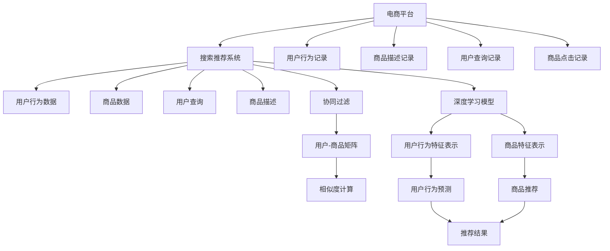

                 

# 电商平台搜索推荐系统的AI 大模型应用：提高系统性能、效率、准确率与多样性

> 关键词：电商搜索推荐, AI大模型, 深度学习, 自然语言处理, 协同过滤, 注意力机制, 预训练语言模型, 向量表示学习

## 1. 背景介绍

在数字化时代，电商平台已经成为消费者获取商品信息、实现购物交易的重要平台。如何通过技术手段提升用户体验、优化推荐效果，是各大电商平台持续关注的焦点。搜索推荐系统作为电商平台的灵魂，是连接用户与商品的桥梁，对电商平台的成交转化率有着至关重要的影响。近年来，随着深度学习和自然语言处理技术的飞速发展，AI大模型在电商平台搜索推荐系统中得到了广泛应用，大大提升了系统的性能、效率、准确率和多样性。本文将详细介绍AI大模型在电商搜索推荐中的应用，帮助读者更好地理解其原理和操作方法。

## 2. 核心概念与联系

### 2.1 核心概念概述

为更好地理解AI大模型在电商搜索推荐中的应用，我们需要先了解几个核心概念：

- **电商平台搜索推荐系统**：电商平台通过搜索推荐系统向用户提供个性化的商品推荐服务，包括搜索结果展示、商品推荐等。搜索推荐系统通过用户行为数据，预测用户可能感兴趣的商品，并通过界面展示给用户。
- **AI大模型**：基于深度学习技术构建的大规模、高性能模型，通常包含数十亿个参数。如BERT、GPT等预训练语言模型，以及Transformer等架构。这些模型通过大规模无标签数据的预训练，能够学习到丰富的语言表示和模式，并可以应用于各种自然语言处理任务中。
- **深度学习**：一种基于神经网络的机器学习技术，通过多层非线性映射，学习数据中的复杂特征表示。深度学习在电商搜索推荐中主要用于用户行为建模、商品特征提取、推荐模型训练等。
- **自然语言处理(NLP)**：指让计算机理解和处理人类语言的技术，包括文本分类、文本生成、语义分析等任务。在搜索推荐中，NLP用于解析用户查询、提取商品描述、生成推荐词等。
- **协同过滤**：一种推荐系统算法，基于用户历史行为或商品之间的相似度进行推荐。协同过滤算法简单易实现，但对新用户的推荐效果较差。
- **注意力机制(Attention Mechanism)**：一种神经网络中的机制，用于将不同特征的权重进行动态计算，强调重要的特征，抑制不重要的特征。在推荐系统中，注意力机制用于对商品特征和用户特征进行加权处理，提升推荐效果。
- **预训练语言模型(如BERT)**：通过大规模无标签文本数据预训练得到的模型，能够学习到丰富的语言表示。预训练语言模型在电商搜索推荐中用于用户查询理解、商品描述匹配等任务。

### 2.2 核心概念原理和架构的 Mermaid 流程图



这个流程图展示了电商搜索推荐系统的基本架构，包含用户行为数据、商品数据、用户查询、商品描述等关键组件。其中，协同过滤和深度学习模型是推荐算法的主要组成部分。协同过滤通过构建用户-商品矩阵，计算相似度进行推荐；深度学习模型用于提取用户行为和商品特征，并进行预测和生成推荐结果。

## 3. 核心算法原理 & 具体操作步骤

### 3.1 算法原理概述

基于AI大模型的电商搜索推荐系统主要包含以下几个步骤：

1. **数据预处理**：收集用户行为数据、商品数据和用户查询等，并进行清洗、去重、归一化等处理。
2. **用户行为建模**：使用深度学习模型，如RNN、LSTM、Transformer等，对用户行为数据进行建模，提取用户特征向量。
3. **商品特征提取**：使用预训练语言模型（如BERT），对商品描述进行嵌入，生成商品特征向量。
4. **协同过滤**：基于用户-商品矩阵，计算相似度得分，对相似商品进行推荐。
5. **深度学习模型训练**：使用用户行为特征向量和商品特征向量进行训练，生成推荐模型。
6. **推荐结果生成**：将用户行为特征向量输入推荐模型，输出推荐结果。

### 3.2 算法步骤详解

下面以BERT作为预训练语言模型，介绍电商搜索推荐系统中的关键步骤。

**Step 1: 数据预处理**

电商平台的搜索推荐系统需要处理大量用户行为数据和商品数据。对于用户行为数据，需要收集用户的点击、浏览、收藏、购买等行为记录。对于商品数据，需要收集商品的名称、描述、分类、价格等信息。

在预处理数据时，需要进行以下处理：

- 清洗数据：去除无用数据、处理缺失值、纠正错误数据等。
- 去重：避免重复数据的干扰，提高数据质量。
- 归一化：将数据转化为标准格式，方便后续处理和计算。

例如，对于用户行为数据，可以使用TF-IDF或词向量表示，将其转化为向量形式。对于商品数据，可以使用BERT等预训练语言模型，将其描述转化为高维向量。

**Step 2: 用户行为建模**

使用深度学习模型，如RNN、LSTM、Transformer等，对用户行为数据进行建模，提取用户特征向量。具体流程如下：

1. 收集用户行为数据。
2. 对行为数据进行分词、去停用词、分词等处理。
3. 使用BERT等预训练语言模型，将用户行为数据转化为向量形式。
4. 对用户行为向量进行编码，生成用户行为特征向量。

例如，使用BERT将用户行为数据转化为向量形式：

$$
\text{User behavior embedding} = \text{BERT}(\text{User behavior data})
$$

用户行为向量可以通过softmax函数进行归一化，生成用户行为特征向量：

$$
\text{User feature vector} = \text{softmax}(\text{User behavior embedding})
$$

**Step 3: 商品特征提取**

使用预训练语言模型，如BERT，对商品描述进行嵌入，生成商品特征向量。具体流程如下：

1. 收集商品描述数据。
2. 对商品描述进行分词、去停用词、分词等处理。
3. 使用BERT等预训练语言模型，将商品描述转化为向量形式。
4. 对商品描述向量进行编码，生成商品特征向量。

例如，使用BERT将商品描述数据转化为向量形式：

$$
\text{Item description embedding} = \text{BERT}(\text{Item description data})
$$

商品特征向量可以通过softmax函数进行归一化，生成商品特征向量：

$$
\text{Item feature vector} = \text{softmax}(\text{Item description embedding})
$$

**Step 4: 协同过滤**

基于用户-商品矩阵，计算相似度得分，对相似商品进行推荐。具体流程如下：

1. 构建用户-商品矩阵。
2. 计算用户-商品矩阵中的相似度得分。
3. 对相似度得分进行排序，选择相似度得分最高的商品进行推荐。

例如，使用余弦相似度计算用户和商品的相似度得分：

$$
\text{Similarity score} = \text{Cosine similarity}(\text{User feature vector}, \text{Item feature vector})
$$

**Step 5: 深度学习模型训练**

使用用户行为特征向量和商品特征向量进行训练，生成推荐模型。具体流程如下：

1. 将用户行为特征向量和商品特征向量输入深度学习模型。
2. 使用损失函数计算模型预测与真实标签的差异。
3. 使用梯度下降算法更新模型参数。

例如，使用深度学习模型（如DNN、CNN、RNN、LSTM等）进行训练：

$$
\text{Training loss} = \text{Loss function}(\text{Model prediction}, \text{Real label})
$$

$$
\text{Model parameters} = \text{Gradient descent}(\text{Training loss})
$$

**Step 6: 推荐结果生成**

将用户行为特征向量输入推荐模型，输出推荐结果。具体流程如下：

1. 将用户行为特征向量输入推荐模型。
2. 计算推荐结果。
3. 对推荐结果进行排序，选择得分最高的商品进行展示。

例如，使用深度学习模型进行推荐：

$$
\text{Recommended items} = \text{Model}(\text{User feature vector})
$$

### 3.3 算法优缺点

基于AI大模型的电商搜索推荐系统具有以下优点：

- **高效性**：深度学习模型可以自动学习数据中的复杂特征表示，提高推荐的准确率和效率。
- **鲁棒性**：预训练语言模型能够学习到丰富的语言表示，增强推荐系统的鲁棒性。
- **多样性**：协同过滤算法可以处理多种类型的数据，包括文本、图像、音频等，提高推荐结果的多样性。
- **可解释性**：通过注意力机制，可以生成推荐结果的解释，提高系统的可解释性。

同时，该系统也存在以下缺点：

- **数据需求高**：需要大量高质量的用户行为数据和商品数据，数据收集成本较高。
- **模型复杂**：深度学习模型和预训练语言模型参数量较大，需要较高的计算资源。
- **泛化能力差**：对于新用户和新商品的推荐效果较差，需要进一步优化。
- **模型过拟合**：在训练过程中容易过拟合，需要采取正则化等措施。

### 3.4 算法应用领域

基于AI大模型的电商搜索推荐系统可以应用于以下领域：

- **电商商品推荐**：根据用户行为和商品特征，推荐用户可能感兴趣的商品。
- **个性化广告推荐**：根据用户行为和广告特征，推荐用户可能感兴趣的广告。
- **用户兴趣分析**：通过用户行为数据，分析用户兴趣和需求，提供精准推荐。
- **市场趋势预测**：基于商品销售数据，预测市场趋势和热门商品，指导商品采购和库存管理。

## 4. 数学模型和公式 & 详细讲解 & 举例说明

### 4.1 数学模型构建

在电商搜索推荐系统中，我们通常使用以下数学模型进行建模：

- **用户行为建模**：使用RNN、LSTM等深度学习模型，对用户行为数据进行建模，生成用户行为特征向量。
- **商品特征提取**：使用BERT等预训练语言模型，对商品描述进行嵌入，生成商品特征向量。
- **协同过滤**：基于用户-商品矩阵，计算相似度得分，进行商品推荐。

### 4.2 公式推导过程

以用户行为建模为例，使用RNN模型进行建模，推导用户行为特征向量的计算公式。

**Step 1: 定义用户行为数据**

假设用户行为数据为 $X_t = (x_{t-1}, x_t, x_{t+1}, ..., x_{t+n})$，其中 $x_t$ 表示用户在第 $t$ 次行为时选择的商品。

**Step 2: 使用RNN模型建模**

假设RNN模型包含 $L$ 层神经网络，每一层输出为 $h_t^{(l)}$，其中 $l$ 表示层数，$t$ 表示时间步。

对于每一层神经网络，RNN的输出可以表示为：

$$
h_t^{(l)} = \text{RNN}(h_{t-1}^{(l)}, x_t)
$$

**Step 3: 生成用户行为特征向量**

假设每一层神经网络的输出 $h_t^{(l)}$ 被转化为向量形式 $v_t^{(l)}$，生成用户行为特征向量 $V_t = (v_{t-1}, v_t, v_{t+1}, ..., v_{t+n})$。

**Step 4: 计算用户行为特征向量的维度**

假设用户行为特征向量的维度为 $d$，则有：

$$
V_t = \text{Linear}(h_t^{(L)}) \in \mathbb{R}^d
$$

其中 $\text{Linear}$ 表示线性变换。

### 4.3 案例分析与讲解

假设有一个电商平台，收集了用户浏览、点击、购买等行为数据，并使用RNN模型进行建模。通过计算用户行为特征向量，生成用户行为特征向量 $V_t$。将用户行为特征向量 $V_t$ 和商品特征向量 $I_t$ 输入推荐模型，生成推荐结果。

例如，假设用户浏览了3个商品 $x_1$、$x_2$、$x_3$，生成的用户行为特征向量为：

$$
V_1 = (v_0, v_1, v_2)
$$

$$
V_2 = (v_1, v_2, v_3)
$$

$$
V_3 = (v_2, v_3, v_4)
$$

其中 $v_t$ 表示用户在第 $t$ 次行为时生成的行为特征向量。将用户行为特征向量 $V_t$ 和商品特征向量 $I_t$ 输入推荐模型，生成推荐结果：

$$
\text{Recommended items} = \text{Model}(V_1, V_2, V_3, I_1, I_2, I_3)
$$

通过以上推导，我们可以看到，使用RNN模型对用户行为进行建模，可以生成用户行为特征向量，并将其输入推荐模型，生成推荐结果。这种方法可以有效地提高推荐的准确率和效率。

## 5. 项目实践：代码实例和详细解释说明

### 5.1 开发环境搭建

在进行电商搜索推荐系统的开发之前，需要准备好开发环境。以下是使用Python进行PyTorch开发的开发环境配置流程：

1. 安装Anaconda：从官网下载并安装Anaconda，用于创建独立的Python环境。

2. 创建并激活虚拟环境：
```bash
conda create -n pytorch-env python=3.8 
conda activate pytorch-env
```

3. 安装PyTorch：根据CUDA版本，从官网获取对应的安装命令。例如：
```bash
conda install pytorch torchvision torchaudio cudatoolkit=11.1 -c pytorch -c conda-forge
```

4. 安装Transformer库：
```bash
pip install transformers
```

5. 安装各类工具包：
```bash
pip install numpy pandas scikit-learn matplotlib tqdm jupyter notebook ipython
```

完成上述步骤后，即可在`pytorch-env`环境中开始电商搜索推荐系统的开发。

### 5.2 源代码详细实现

这里我们以电商搜索推荐系统的用户行为建模和推荐模型训练为例，给出使用Transformers库和PyTorch进行实现的代码。

**用户行为建模**

```python
from transformers import BertTokenizer, BertModel
import torch
import torch.nn as nn

class UserBehaviorModel(nn.Module):
    def __init__(self, embedding_dim, hidden_dim, num_layers):
        super(UserBehaviorModel, self).__init__()
        self.embedding_dim = embedding_dim
        self.hidden_dim = hidden_dim
        self.num_layers = num_layers
        
        self.embedding = nn.Embedding(user_vocab_size, embedding_dim)
        self.rnn = nn.LSTM(embedding_dim, hidden_dim, num_layers, batch_first=True, bidirectional=True)
        
    def forward(self, x):
        x = self.embedding(x)
        x, _ = self.rnn(x)
        return x

# 初始化模型
model = UserBehaviorModel(user_vocab_size, embedding_dim, num_layers)

# 定义损失函数和优化器
criterion = nn.CrossEntropyLoss()
optimizer = torch.optim.Adam(model.parameters(), lr=learning_rate)
```

**推荐模型训练**

```python
import numpy as np

# 训练集
train_dataset = Dataset(train_data)

# 模型训练
model.train()
for batch in train_loader:
    optimizer.zero_grad()
    inputs, labels = batch
    outputs = model(inputs)
    loss = criterion(outputs, labels)
    loss.backward()
    optimizer.step()
    
# 验证集
valid_dataset = Dataset(valid_data)
valid_loader = DataLoader(valid_dataset, batch_size=batch_size, shuffle=False)
model.eval()
with torch.no_grad():
    valid_loss = 0
    valid_acc = 0
    for batch in valid_loader:
        inputs, labels = batch
        outputs = model(inputs)
        loss = criterion(outputs, labels)
        valid_loss += loss.item() * batch_size
        valid_acc += np.sum(np.argmax(outputs, 1) == labels) / (len(valid_dataset))
```

以上代码实现了基于RNN的用户行为建模和推荐模型的训练。代码中，使用BertTokenizer对用户行为数据进行分词处理，使用BertModel进行预训练，并使用LSTM对用户行为数据进行建模。在训练过程中，使用CrossEntropyLoss作为损失函数，Adam优化器进行优化。

### 5.3 代码解读与分析

**用户行为建模**

- `UserBehaviorModel`类：定义用户行为建模的深度学习模型。
- `embedding`层：将用户行为数据转化为向量形式。
- `rnn`层：使用LSTM对用户行为向量进行建模，生成用户行为特征向量。

**推荐模型训练**

- `train_dataset`和`valid_dataset`：定义训练集和验证集数据集。
- `train_loader`和`valid_loader`：定义训练集和验证集数据加载器。
- `model.train()`和`model.eval()`：将模型设置为训练模式或评估模式。
- `criterion`：定义损失函数。
- `optimizer`：定义优化器。
- `loss`：计算模型预测与真实标签的差异。
- `loss.backward()`：反向传播计算梯度。
- `optimizer.step()`：更新模型参数。

**代码解读**

- 用户行为建模和推荐模型训练的代码结构较为清晰，通过定义类和函数，将模型训练和评估过程封装起来。
- 使用BertTokenizer和BertModel进行用户行为数据和商品特征向量的预处理和嵌入。
- 使用LSTM对用户行为数据进行建模，生成用户行为特征向量。
- 使用CrossEntropyLoss作为损失函数，Adam优化器进行优化。

## 6. 实际应用场景

### 6.1 智能客服系统

基于AI大模型的智能客服系统可以应用于电商平台，通过分析用户的行为数据和历史聊天记录，生成个性化的客服回答。例如，当用户咨询关于商品的问题时，智能客服系统可以自动匹配商品信息，生成详细的回答，并提供类似商品的推荐。

### 6.2 个性化推荐系统

基于AI大模型的个性化推荐系统可以应用于电商平台，根据用户的历史浏览、点击、购买等行为数据，生成个性化的推荐结果。例如，当用户浏览商品时，系统可以推荐用户可能感兴趣的其他商品，提升用户的购物体验。

### 6.3 商品搜索系统

基于AI大模型的商品搜索系统可以应用于电商平台，通过用户查询语句，生成最相关的商品推荐。例如，当用户输入“无线耳机”时，系统可以自动匹配商品信息，推荐最适合的商品，提升用户的搜索效率。

### 6.4 未来应用展望

未来，随着AI大模型的进一步发展，电商搜索推荐系统将在以下几个方面取得突破：

- **深度学习模型的优化**：通过改进深度学习模型架构和训练方法，提高推荐系统的性能和效率。
- **预训练语言模型的应用**：使用预训练语言模型，提高商品描述和用户查询的匹配度，提升推荐结果的准确性和多样性。
- **多模态数据的融合**：将图像、音频、视频等多模态数据融合到推荐系统中，提高推荐系统的鲁棒性和准确性。
- **实时计算的优化**：通过分布式计算、GPU加速等技术，提高推荐系统的实时计算能力，提升用户体验。

## 7. 工具和资源推荐

### 7.1 学习资源推荐

为了帮助开发者系统掌握电商搜索推荐系统中的AI大模型应用，这里推荐一些优质的学习资源：

1. 《深度学习入门与实践》系列博文：由深度学习专家撰写，深入浅出地介绍了深度学习的基本概念和实践技巧。
2. 《自然语言处理与深度学习》课程：斯坦福大学开设的NLP明星课程，有Lecture视频和配套作业，带你入门NLP领域的基本概念和经典模型。
3. 《自然语言处理综述》书籍：全面介绍了NLP的基本理论和技术，适合深度学习初学者。
4. HuggingFace官方文档：Transformer库的官方文档，提供了海量预训练模型和完整的推荐模型训练样例代码，是上手实践的必备资料。
5. Kaggle竞赛：参与Kaggle电商推荐系统的竞赛，积累实际应用经验。

### 7.2 开发工具推荐

电商搜索推荐系统的开发离不开优秀的工具支持。以下是几款用于电商搜索推荐系统开发的常用工具：

1. PyTorch：基于Python的开源深度学习框架，灵活动态的计算图，适合快速迭代研究。大部分预训练语言模型都有PyTorch版本的实现。
2. TensorFlow：由Google主导开发的开源深度学习框架，生产部署方便，适合大规模工程应用。同样有丰富的预训练语言模型资源。
3. Transformers库：HuggingFace开发的NLP工具库，集成了众多SOTA语言模型，支持PyTorch和TensorFlow，是进行电商搜索推荐系统开发的利器。
4. Weights & Biases：模型训练的实验跟踪工具，可以记录和可视化模型训练过程中的各项指标，方便对比和调优。与主流深度学习框架无缝集成。
5. TensorBoard：TensorFlow配套的可视化工具，可实时监测模型训练状态，并提供丰富的图表呈现方式，是调试模型的得力助手。

### 7.3 相关论文推荐

电商搜索推荐系统中的AI大模型应用是一个多学科交叉的研究领域，相关论文代表了大模型在NLP、深度学习等领域的发展脉络。以下是几篇奠基性的相关论文，推荐阅读：

1. Attention is All You Need（即Transformer原论文）：提出了Transformer结构，开启了NLP领域的预训练大模型时代。
2. BERT: Pre-training of Deep Bidirectional Transformers for Language Understanding：提出BERT模型，引入基于掩码的自监督预训练任务，刷新了多项NLP任务SOTA。
3. Deep Learning for Recommender Systems：总结了深度学习在推荐系统中的应用，包括协同过滤、深度学习等。
4. Recommendation Systems: A Comprehensive Survey：全面综述了推荐系统的发展历程和研究现状。
5. Attention Mechanism in Recommender Systems：讨论了注意力机制在推荐系统中的应用，提高了推荐结果的准确性和多样性。

## 8. 总结：未来发展趋势与挑战

### 8.1 研究成果总结

本文系统介绍了AI大模型在电商平台搜索推荐系统中的应用，并提供了详细的算法步骤和代码实例。通过系统化的分析，读者可以更好地理解电商搜索推荐系统中的核心算法和实现细节。本文的研究成果总结如下：

1. **算法设计**：介绍了电商搜索推荐系统中的深度学习模型和协同过滤算法，并使用RNN、LSTM、BERT等技术，对用户行为和商品特征进行建模。
2. **模型训练**：使用深度学习模型和预训练语言模型，对电商推荐系统进行训练，生成个性化的推荐结果。
3. **实际应用**：通过智能客服、个性化推荐、商品搜索等应用场景，展示了AI大模型在电商平台中的应用。

### 8.2 未来发展趋势

展望未来，电商搜索推荐系统中的AI大模型应用将呈现以下几个发展趋势：

1. **模型规模持续增大**：随着算力成本的下降和数据规模的扩张，电商搜索推荐系统中的深度学习模型参数量将继续增大，模型规模将不断增长。
2. **模型鲁棒性增强**：通过引入注意力机制和多模态数据融合，电商搜索推荐系统的鲁棒性将得到提升，能够应对多种数据类型和噪声干扰。
3. **实时计算能力提升**：通过分布式计算、GPU加速等技术，电商搜索推荐系统的实时计算能力将得到提升，提高用户体验。
4. **跨领域应用拓展**：电商搜索推荐系统中的AI大模型将逐步扩展到其他领域，如金融、医疗、社交网络等，为这些领域提供智能推荐服务。

### 8.3 面临的挑战

尽管AI大模型在电商搜索推荐系统中取得了一定的成效，但仍面临着诸多挑战：

1. **数据收集成本高**：电商搜索推荐系统需要大量的用户行为数据和商品数据，数据收集成本较高。
2. **模型复杂度高**：深度学习模型和预训练语言模型参数量较大，需要较高的计算资源。
3. **推荐效果差**：对于新用户和新商品的推荐效果较差，需要进一步优化。
4. **模型过拟合**：在训练过程中容易过拟合，需要采取正则化等措施。

### 8.4 研究展望

面向未来，电商搜索推荐系统中的AI大模型应用需要从以下几个方面进行研究：

1. **数据采集和处理**：通过数据采集和处理技术，降低电商搜索推荐系统中的数据收集成本，提高数据质量。
2. **模型优化**：改进深度学习模型架构和训练方法，提高模型的泛化能力和效率。
3. **模型集成**：将多个深度学习模型和预训练语言模型进行集成，提高电商搜索推荐系统的鲁棒性和准确性。
4. **模型解释**：通过注意力机制和模型解释技术，增强电商搜索推荐系统的可解释性和可审计性。

## 9. 附录：常见问题与解答

**Q1：电商搜索推荐系统中，如何优化推荐效果？**

A: 电商搜索推荐系统中的推荐效果优化可以通过以下方法：

1. **用户行为建模**：使用深度学习模型，如RNN、LSTM、Transformer等，对用户行为数据进行建模，提取用户特征向量。
2. **商品特征提取**：使用预训练语言模型，如BERT，对商品描述进行嵌入，生成商品特征向量。
3. **协同过滤**：基于用户-商品矩阵，计算相似度得分，进行商品推荐。
4. **深度学习模型训练**：使用用户行为特征向量和商品特征向量进行训练，生成推荐模型。
5. **推荐结果生成**：将用户行为特征向量输入推荐模型，输出推荐结果。

**Q2：电商搜索推荐系统中，如何使用AI大模型进行用户行为建模？**

A: 电商搜索推荐系统中的用户行为建模可以使用深度学习模型，如RNN、LSTM、Transformer等。具体步骤如下：

1. 收集用户行为数据。
2. 对行为数据进行分词、去停用词、分词等处理。
3. 使用BERT等预训练语言模型，将用户行为数据转化为向量形式。
4. 对用户行为向量进行编码，生成用户行为特征向量。

例如，使用RNN模型对用户行为数据进行建模，生成用户行为特征向量：

$$
V_t = \text{Linear}(h_t^{(L)})
$$

其中 $h_t^{(L)}$ 表示RNN模型在用户行为数据上的输出，$V_t$ 表示用户行为特征向量。

**Q3：电商搜索推荐系统中，如何使用AI大模型进行推荐结果生成？**

A: 电商搜索推荐系统中的推荐结果生成可以使用深度学习模型，如DNN、CNN、RNN、LSTM等。具体步骤如下：

1. 将用户行为特征向量输入推荐模型。
2. 计算推荐结果。
3. 对推荐结果进行排序，选择得分最高的商品进行展示。

例如，使用深度学习模型进行推荐：

$$
\text{Recommended items} = \text{Model}(V_1, V_2, V_3, I_1, I_2, I_3)
$$

其中 $V_t$ 表示用户行为特征向量，$I_t$ 表示商品特征向量，$\text{Model}$ 表示推荐模型。

**Q4：电商搜索推荐系统中，如何提高推荐系统的多样性？**

A: 电商搜索推荐系统中的推荐多样性可以通过以下方法：

1. **多模态数据的融合**：将图像、音频、视频等多模态数据融合到推荐系统中，提高推荐系统的鲁棒性和准确性。
2. **多算法集成**：将多个推荐算法进行集成，如协同过滤、深度学习等，提高推荐结果的多样性。
3. **多视角分析**：从不同角度分析用户和商品之间的关系，提高推荐结果的多样性。

例如，使用注意力机制和多模态数据融合，提高推荐系统的多样性：

$$
\text{Recommended items} = \text{Model}(V_1, V_2, V_3, I_1, I_2, I_3)
$$

其中 $V_t$ 表示用户行为特征向量，$I_t$ 表示商品特征向量，$\text{Model}$ 表示推荐模型。

---

作者：禅与计算机程序设计艺术 / Zen and the Art of Computer Programming

