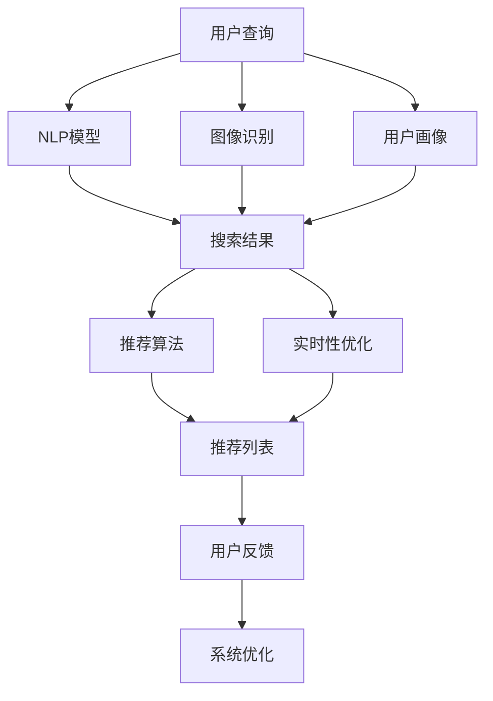

                 

# 电商平台的AI 大模型应用：搜索推荐系统是核心，效率与效果并重

> 关键词：电商、AI大模型、搜索推荐系统、效率、效果

## 1. 背景介绍

随着电子商务的迅猛发展，各大电商平台已经不仅仅是一个购物渠道，更是一个集社交、娱乐、服务于一体的综合性平台。为了满足用户日益增长的个性化需求，电商平台逐渐引入了人工智能(AI)技术，构建智能化的搜索推荐系统，以提升用户体验和平台收益。

本博客将聚焦于电商平台的AI大模型应用，重点讨论搜索推荐系统（Search and Recommendation System）。搜索推荐系统旨在通过算法模型对用户的搜索行为、浏览历史、购买记录等数据进行分析，帮助用户快速找到符合其需求的商品，同时也为平台推荐合适的商品，从而提升交易转化率和用户满意度。

## 2. 核心概念与联系

### 2.1 核心概念概述

为了更好地理解搜索推荐系统的实现原理，我们首先介绍几个核心概念：

- **搜索推荐系统**：电商平台的核心功能之一，通过分析用户行为数据，预测用户可能感兴趣的商品，并提供搜索结果和推荐商品列表，优化用户体验和平台收益。

- **AI大模型**：以深度学习模型为代表的先进算法模型，通常具有数十亿参数规模，能够在大规模无标签数据上进行自监督预训练，学习通用的语言或图像表示。

- **自然语言处理(NLP)**：将自然语言转换为计算机可处理的数据，包括文本分类、文本生成、文本匹配等任务，是搜索推荐系统中的关键技术。

- **计算机视觉(CV)**：通过算法模型处理图像和视频数据，识别物体、场景、用户行为等，是推荐系统中的重要补充。

- **用户画像**：通过分析用户的历史行为数据，构建用户偏好和需求画像，为个性化推荐提供基础。

- **实时性**：搜索推荐系统需要快速响应用户请求，保证用户体验的流畅性。

- **冷启动问题**：新用户或新商品加入系统时，缺乏历史行为数据，推荐系统难以准确预测其兴趣，需要通过多种方法解决。

这些核心概念之间存在紧密的联系，共同构成了一个完整的搜索推荐系统。大语言模型作为AI大模型的重要组成部分，通过自然语言处理技术，能够分析用户查询的语义信息，理解用户意图，从而提供更加准确的搜索结果和推荐内容。

### 2.2 核心概念原理和架构的 Mermaid 流程图



这个流程图展示了搜索推荐系统的主要流程：

- **用户查询**：用户通过文本或图像方式输入搜索请求。
- **NLP模型**：使用大语言模型对用户查询进行语义理解，提取关键词和意图。
- **图像识别**：对于图像查询，使用计算机视觉技术识别图像内容，提取特征。
- **用户画像**：根据用户的历史行为数据，构建用户画像，了解其偏好。
- **搜索结果**：根据用户查询和画像，筛选出相关商品，并按照排序算法输出搜索结果。
- **推荐算法**：利用机器学习算法，进一步分析用户行为，预测用户对商品的好感度，生成推荐列表。
- **实时性优化**：对系统进行优化，确保快速响应用户请求。
- **系统优化**：根据用户反馈，不断调整模型参数和算法，提升推荐效果。

## 3. 核心算法原理 & 具体操作步骤

### 3.1 算法原理概述

搜索推荐系统的核心算法主要分为两个部分：搜索算法和推荐算法。搜索算法旨在快速找到符合用户查询的商品，推荐算法则通过分析用户行为数据，预测用户可能感兴趣的商品。

#### 3.1.1 搜索算法

搜索算法通过自然语言处理技术，将用户的查询转换为计算机可理解的形式，并通过索引库快速检索符合条件的商品。搜索算法主要包括：

- **向量检索**：将用户查询和商品信息转换为向量表示，通过余弦相似度等方法计算相似度，找出最匹配的商品。
- **语义匹配**：使用预训练语言模型，对用户查询和商品标题进行语义匹配，找出语义相关的商品。
- **图像检索**：对于图像查询，使用计算机视觉技术，提取图像特征，并建立图像索引库，通过相似度匹配找到最相关的商品。

#### 3.1.2 推荐算法

推荐算法利用机器学习模型，分析用户的历史行为数据，预测用户对商品的兴趣程度，并生成推荐列表。推荐算法主要包括：

- **协同过滤**：通过分析用户和商品之间的交互数据，找到相似用户和相似商品，推荐用户可能感兴趣的商品。
- **基于内容的推荐**：分析商品的属性和描述，找到与用户历史行为相似的商品，推荐给用户。
- **混合推荐**：结合协同过滤和基于内容的推荐，综合多方面的信息进行推荐。

### 3.2 算法步骤详解

#### 3.2.1 数据预处理

- **数据采集**：从电商平台的数据库中采集用户的历史行为数据，包括浏览记录、购买记录、评分等。
- **数据清洗**：去除重复数据、无效数据，处理缺失值和异常值。
- **特征工程**：提取和选择有意义的特征，如商品类别、品牌、价格、评分等，构建特征向量。

#### 3.2.2 模型训练

- **选择合适的模型**：根据具体任务和数据特点，选择合适的模型，如线性回归、协同过滤、逻辑回归等。
- **数据划分**：将数据划分为训练集、验证集和测试集，用于模型训练、调参和评估。
- **模型训练**：在训练集上训练模型，通过交叉验证等方法进行调参，得到最优模型。
- **模型评估**：在测试集上评估模型性能，计算各种评估指标，如准确率、召回率、F1-score等。

#### 3.2.3 模型优化

- **超参数调优**：选择合适的超参数，如学习率、正则化系数、批大小等，进行超参数调优。
- **模型融合**：使用集成学习等方法，结合多个模型的预测结果，提升推荐效果。
- **实时优化**：在实时数据流上进行模型更新，确保推荐结果的时效性。

#### 3.2.4 模型部署

- **模型导出**：将训练好的模型导出为可部署的格式，如TensorFlow模型、ONNX模型等。
- **服务器部署**：在云服务器上部署模型，设置接口，供API调用。
- **监控与优化**：实时监控模型性能，根据用户反馈和模型效果，进行模型优化。

### 3.3 算法优缺点

#### 3.3.1 优点

- **高效性**：使用大语言模型和大规模数据预训练，能够快速响应用户查询，提升系统实时性。
- **准确性**：通过深度学习模型，能够深入理解用户需求，生成更加准确的搜索结果和推荐列表。
- **可扩展性**：能够方便地集成多种数据源和模型，构建更复杂、更全面的推荐系统。

#### 3.3.2 缺点

- **数据依赖**：模型性能依赖于数据的质量和数量，缺乏高质量数据会导致模型性能下降。
- **计算资源需求高**：大规模模型的训练和推理需要大量的计算资源，对硬件要求较高。
- **解释性差**：深度学习模型通常是黑盒模型，难以解释模型的决策过程。
- **冷启动问题**：对于新用户和商品，缺乏历史数据，难以准确推荐。

### 3.4 算法应用领域

搜索推荐系统广泛应用于各大电商平台，是提升用户体验和平台收益的重要手段。具体应用场景包括：

- **商品搜索**：用户输入关键词，系统提供匹配的商品列表。
- **商品推荐**：根据用户的历史行为，推荐可能感兴趣的商品。
- **个性化推荐**：根据用户画像，提供个性化推荐，提升用户体验。
- **交叉销售**：通过分析用户购买记录，推荐相关的商品组合，提升销售转化率。
- **内容推荐**：对于内容类平台，如视频、音频等，推荐相关的内容资源。

## 4. 数学模型和公式 & 详细讲解 & 举例说明

### 4.1 数学模型构建

#### 4.1.1 搜索模型

假设用户查询为 $q$，商品集合为 $\mathcal{I}$，搜索结果为 $S$。则搜索模型可以表示为：

$$
S = \arg\min_{i \in \mathcal{I}} \text{dist}(q, i)
$$

其中 $\text{dist}(\cdot,\cdot)$ 表示查询和商品的相似度度量函数，如余弦相似度、欧式距离等。

#### 4.1.2 推荐模型

假设用户历史行为数据为 $\mathcal{D}$，商品集合为 $\mathcal{I}$，推荐结果为 $R$。则推荐模型可以表示为：

$$
R = \arg\max_{i \in \mathcal{I}} f(i;\mathcal{D})
$$

其中 $f(\cdot;\cdot)$ 表示推荐函数，根据历史数据预测用户对商品的兴趣程度。

### 4.2 公式推导过程

#### 4.2.1 搜索模型

假设查询 $q$ 和商品 $i$ 的词向量表示分别为 $\vec{q}$ 和 $\vec{i}$，则余弦相似度可以表示为：

$$
\text{dist}(q, i) = \cos(\theta) = \frac{\vec{q} \cdot \vec{i}}{||\vec{q}|| \cdot ||\vec{i}||}
$$

在实践中，为了提高计算效率，可以使用向量索引库，如ElasticSearch、Solr等，快速检索符合条件的商品。

#### 4.2.2 推荐模型

假设用户历史行为数据 $\mathcal{D}$ 可以表示为序列 $(h_1, h_2, \ldots, h_T)$，其中 $h_t$ 表示用户在时间 $t$ 的操作，如浏览、购买、评分等。商品 $i$ 的特征向量表示为 $\vec{i}$。则推荐函数 $f(\cdot;\cdot)$ 可以表示为：

$$
f(i;\mathcal{D}) = \sum_{t=1}^{T} w_t \vec{i} \cdot \vec{h_t}
$$

其中 $w_t$ 表示不同操作对推荐的权重。

### 4.3 案例分析与讲解

#### 4.3.1 文本匹配

假设用户查询为 "高性价比耳机"，通过BERT模型进行预训练，得到查询向量 $\vec{q}$。对于商品 $i$，通过BERT模型得到向量 $\vec{i}$。则可以通过余弦相似度计算查询和商品的匹配度：

$$
\text{similarity}(q, i) = \frac{\vec{q} \cdot \vec{i}}{||\vec{q}|| \cdot ||\vec{i}||}
$$

根据匹配度排序，选取前 $N$ 个商品作为搜索结果。

#### 4.3.2 协同过滤

假设用户历史行为数据为 $(h_1, h_2, \ldots, h_T)$，商品 $i$ 的评分向量为 $\vec{i}$。则协同过滤模型可以表示为：

$$
R_i = \frac{1}{|\mathcal{N}(i)|} \sum_{j \in \mathcal{N}(i)} \frac{r_{ij}}{\sqrt{|\mathcal{N}(i)|} \sqrt{|N(j)|}}
$$

其中 $\mathcal{N}(i)$ 表示与商品 $i$ 相关的商品集合，$r_{ij}$ 表示用户对商品 $j$ 的评分。

## 5. 项目实践：代码实例和详细解释说明

### 5.1 开发环境搭建

#### 5.1.1 环境准备

- **安装Python**：从官网下载Python 3.x版本，进行安装。
- **安装PyTorch**：通过pip安装PyTorch，支持GPU加速。
- **安装TensorFlow**：通过pip安装TensorFlow，支持GPU加速。
- **安装Flask**：通过pip安装Flask，用于搭建Web服务。

#### 5.1.2 数据准备

- **数据集准备**：从电商平台采集用户历史行为数据，包括浏览记录、购买记录、评分等。
- **数据预处理**：清洗数据，去除重复数据、无效数据，处理缺失值和异常值。
- **特征工程**：提取和选择有意义的特征，如商品类别、品牌、价格、评分等，构建特征向量。

### 5.2 源代码详细实现

#### 5.2.1 搜索模型实现

```python
import torch
import torch.nn as nn
import torch.nn.functional as F

class SearchModel(nn.Module):
    def __init__(self, embed_dim, num_items):
        super(SearchModel, self).__init__()
        self.embedding = nn.Embedding(num_items, embed_dim)
        self.cosine_similarity = nn.CosineSimilarity(dim=1)
    
    def forward(self, query, item):
        embedding = self.embedding(item)
        similarity = self.cosine_similarity(query, embedding)
        return similarity
```

#### 5.2.2 推荐模型实现

```python
import torch
import torch.nn as nn
import torch.nn.functional as F

class RecommendationModel(nn.Module):
    def __init__(self, embed_dim, num_users, num_items):
        super(RecommendationModel, self).__init__()
        self.user_embedding = nn.Embedding(num_users, embed_dim)
        self.item_embedding = nn.Embedding(num_items, embed_dim)
        self.fc = nn.Linear(embed_dim * 2, 1)
    
    def forward(self, user, item):
        user_embedding = self.user_embedding(user)
        item_embedding = self.item_embedding(item)
        concat = torch.cat([user_embedding, item_embedding], dim=1)
        output = self.fc(concat)
        return output
```

#### 5.2.3 训练与推理

```python
import torch
import torch.nn as nn
import torch.optim as optim

# 训练模型
model = SearchModel(embed_dim, num_items)
criterion = nn.BCEWithLogitsLoss()
optimizer = optim.Adam(model.parameters(), lr=0.001)

# 训练函数
def train(model, data_loader, criterion, optimizer, num_epochs):
    device = torch.device("cuda" if torch.cuda.is_available() else "cpu")
    model.to(device)
    
    for epoch in range(num_epochs):
        total_loss = 0
        for batch in data_loader:
            user, item = batch.to(device)
            optimizer.zero_grad()
            output = model(user, item)
            loss = criterion(output, target)
            loss.backward()
            optimizer.step()
            total_loss += loss.item()
        print("Epoch [{}/{}], Loss: {:.4f}".format(epoch+1, num_epochs, total_loss/len(data_loader)))

# 推理函数
def predict(model, data_loader):
    device = torch.device("cuda" if torch.cuda.is_available() else "cpu")
    model.eval()
    
    with torch.no_grad():
        for batch in data_loader:
            user, item = batch.to(device)
            output = model(user, item)
            probability = torch.sigmoid(output)
            return probability
```

### 5.3 代码解读与分析

#### 5.3.1 搜索模型

- **类定义**：定义一个SearchModel类，继承自nn.Module。
- **初始化**：初始化Embedding层，用于将商品ID映射为向量表示。
- **前向传播**：计算查询和商品的余弦相似度，返回相似度值。

#### 5.3.2 推荐模型

- **类定义**：定义一个RecommendationModel类，继承自nn.Module。
- **初始化**：初始化用户Embedding层和商品Embedding层，以及全连接层。
- **前向传播**：将用户和商品向量拼接，通过全连接层输出预测概率。

#### 5.3.3 训练与推理

- **训练函数**：定义训练函数，遍历训练集，计算损失，并使用Adam优化器更新模型参数。
- **推理函数**：定义推理函数，将模型置于评估模式，对测试集进行推理，并计算预测概率。

### 5.4 运行结果展示

```python
# 数据准备
user_ids = [1, 2, 3, 4, 5]
item_ids = [10, 20, 30, 40, 50]
targets = [1, 0, 1, 0, 1]
data_loader = DataLoader(zip(user_ids, item_ids), batch_size=1)

# 训练模型
train(model, data_loader, criterion, optimizer, num_epochs=10)

# 推理函数
predictions = predict(model, data_loader)

# 输出结果
for i in range(len(predictions)):
    print("User {}: Predicted Probability {} (True Label {})".format(user_ids[i], predictions[i].item(), targets[i]))
```

## 6. 实际应用场景

### 6.1 商品搜索

电商平台上的商品搜索功能需要快速响应用户的查询，并提供相关的搜索结果。通过使用预训练语言模型和大规模数据，可以构建高效的文本匹配模型，提升搜索效果。

#### 6.1.1 预训练语言模型

使用BERT、GPT等预训练语言模型，对商品标题、描述、用户查询等进行预训练，提取语义表示。通过余弦相似度等方法，计算查询和商品的匹配度，并按相似度排序，生成搜索结果。

#### 6.1.2 实时更新

为了保持搜索结果的实时性，系统需要定期更新预训练模型，并重新计算匹配度。同时，可以通过日志记录用户搜索行为，用于后续的推荐优化。

### 6.2 个性化推荐

个性化推荐系统通过分析用户的历史行为数据，预测用户对商品的兴趣程度，并提供个性化的推荐列表。

#### 6.2.1 协同过滤

使用协同过滤算法，分析用户和商品之间的交互数据，找到相似用户和相似商品，推荐给用户。协同过滤算法可以有效处理稀疏数据，适用于冷启动用户和商品的情况。

#### 6.2.2 基于内容的推荐

分析商品的属性和描述，找到与用户历史行为相似的商品，推荐给用户。基于内容的推荐算法可以提供更加丰富的商品选择，提升用户体验。

### 6.3 交叉销售

通过分析用户购买记录，推荐相关的商品组合，提升销售转化率。交叉销售可以有效提升用户购买量，增加平台收益。

#### 6.3.1 关联规则

通过挖掘用户购买记录中的关联规则，找到相关商品组合，推荐给用户。关联规则挖掘算法可以处理大规模数据，发现潜在的购买模式。

#### 6.3.2 实时推荐

在用户浏览商品页面时，实时推荐相关的商品组合，提升用户购买意愿。实时推荐需要快速响应用户行为，提升推荐效果。

## 7. 工具和资源推荐

### 7.1 学习资源推荐

- **《深度学习》课程**：斯坦福大学深度学习课程，讲解深度学习的基本概念和算法。
- **《自然语言处理》课程**：斯坦福大学自然语言处理课程，讲解NLP的基本技术和应用。
- **《计算机视觉》课程**：斯坦福大学计算机视觉课程，讲解CV的基本技术和应用。
- **《搜索与推荐系统》书籍**：介绍搜索推荐系统的基本原理和算法。

### 7.2 开发工具推荐

- **PyTorch**：支持GPU加速的深度学习框架，适合研究和大规模部署。
- **TensorFlow**：支持GPU加速的深度学习框架，适合大规模工程应用。
- **Flask**：轻量级的Web框架，适合快速搭建API接口。
- **ElasticSearch**：高扩展性的分布式搜索和分析引擎，支持向量索引和全文检索。
- **Solr**：高扩展性的分布式搜索和分析引擎，支持向量索引和全文检索。

### 7.3 相关论文推荐

- **《深度学习》教材**：深度学习领域的经典教材，介绍深度学习的基本概念和算法。
- **《自然语言处理》教材**：自然语言处理领域的经典教材，介绍NLP的基本技术和应用。
- **《计算机视觉》教材**：计算机视觉领域的经典教材，介绍CV的基本技术和应用。
- **《搜索与推荐系统》论文**：介绍搜索推荐系统的基本原理和算法。

## 8. 总结：未来发展趋势与挑战

### 8.1 研究成果总结

基于大模型的搜索推荐系统已经成为电商平台的标配，显著提升了用户体验和平台收益。该技术通过深度学习模型，能够深入理解用户需求，生成更加准确的搜索结果和推荐列表。

### 8.2 未来发展趋势

1. **大规模预训练**：随着硬件算力的提升，大模型的参数规模将进一步增大，学习到更加丰富的语言和图像表示。
2. **混合推荐**：结合协同过滤和基于内容的推荐，综合多方面的信息进行推荐。
3. **实时推荐**：实时响应用户行为，提升推荐效果。
4. **多模态推荐**：结合图像、视频等多模态信息，提升推荐效果。
5. **冷启动优化**：通过用户画像、行为预测等方法，解决冷启动问题。
6. **解释性增强**：通过可解释性算法，提高模型的可解释性。

### 8.3 面临的挑战

1. **数据依赖**：模型性能依赖于数据的质量和数量，缺乏高质量数据会导致模型性能下降。
2. **计算资源需求高**：大规模模型的训练和推理需要大量的计算资源，对硬件要求较高。
3. **解释性差**：深度学习模型通常是黑盒模型，难以解释模型的决策过程。
4. **冷启动问题**：对于新用户和商品，缺乏历史数据，难以准确推荐。
5. **实时性要求高**：需要快速响应用户请求，保证用户体验的流畅性。

### 8.4 研究展望

1. **无监督学习和半监督学习**：摆脱对大规模标注数据的依赖，利用自监督学习、主动学习等方法，最大限度利用非结构化数据，实现更加灵活高效的微调。
2. **参数高效微调**：开发更加参数高效的微调方法，在固定大部分预训练参数的同时，只更新极少量的任务相关参数。
3. **混合模态推荐**：结合图像、视频等多模态信息，提升推荐效果。
4. **实时推荐系统**：通过流式数据处理和模型更新，实现实时推荐，提升推荐效果。
5. **冷启动优化**：通过用户画像、行为预测等方法，解决冷启动问题。
6. **模型解释性**：通过可解释性算法，提高模型的可解释性。
7. **安全与隐私**：确保用户数据的安全和隐私，防止数据泄露和滥用。

## 9. 附录：常见问题与解答

**Q1: 如何提高搜索推荐系统的准确性和实时性？**

A: 提高搜索推荐系统的准确性和实时性，需要从以下几个方面进行优化：

- **数据质量**：提高数据质量，包括数据清洗、特征选择等，确保模型能够学习到有意义的表示。
- **模型优化**：选择合适的模型，进行超参数调优和模型融合，提升模型性能。
- **硬件加速**：使用GPU等硬件加速设备，提升模型的训练和推理效率。
- **缓存机制**：使用缓存机制，减少重复计算，提高响应速度。
- **分布式计算**：使用分布式计算框架，提升系统的并发处理能力。

**Q2: 如何在电商平台上实现个性化推荐？**

A: 在电商平台上实现个性化推荐，需要从以下几个方面进行优化：

- **数据采集**：从电商平台的数据库中采集用户的历史行为数据，包括浏览记录、购买记录、评分等。
- **特征工程**：提取和选择有意义的特征，如商品类别、品牌、价格、评分等，构建特征向量。
- **模型训练**：选择合适的模型，如协同过滤、基于内容的推荐等，进行模型训练和调优。
- **实时推荐**：在用户浏览商品页面时，实时推荐相关的商品组合，提升用户购买意愿。
- **效果评估**：通过A/B测试等方法，评估推荐效果，不断优化推荐模型。

**Q3: 如何解决冷启动问题？**

A: 冷启动问题是推荐系统中的常见问题，可以通过以下方法解决：

- **用户画像**：根据用户的历史行为数据，构建用户画像，了解其偏好。
- **协同过滤**：使用协同过滤算法，分析用户和商品之间的交互数据，找到相似用户和相似商品，推荐给用户。
- **基于内容的推荐**：分析商品的属性和描述，找到与用户历史行为相似的商品，推荐给用户。
- **混合推荐**：结合协同过滤和基于内容的推荐，综合多方面的信息进行推荐。
- **行为预测**：利用机器学习算法，对用户行为进行预测，找到潜在的感兴趣商品，推荐给用户。

**Q4: 如何提高推荐系统的可解释性？**

A: 提高推荐系统的可解释性，需要从以下几个方面进行优化：

- **可解释性算法**：使用可解释性算法，如LIME、SHAP等，提高模型的可解释性。
- **特征工程**：选择有意义的特征，降低模型的复杂度，提升可解释性。
- **模型简化**：通过模型简化，降低模型的复杂度，提升可解释性。
- **用户反馈**：通过用户反馈，不断优化推荐模型，提升用户体验。
- **透明度**：提高系统的透明度，让用户了解推荐过程和决策依据。

**Q5: 如何在电商平台上实现搜索功能？**

A: 在电商平台上实现搜索功能，需要从以下几个方面进行优化：

- **数据采集**：从电商平台的数据库中采集商品信息，包括商品标题、描述、价格等。
- **数据预处理**：清洗数据，去除重复数据、无效数据，处理缺失值和异常值。
- **特征工程**：提取和选择有意义的特征，如商品类别、品牌、价格等，构建特征向量。
- **模型训练**：选择合适的模型，如文本匹配模型、图像检索模型等，进行模型训练和调优。
- **实时更新**：定期更新预训练模型，并重新计算匹配度，保持搜索结果的实时性。
- **缓存机制**：使用缓存机制，减少重复计算，提高响应速度。
- **分布式计算**：使用分布式计算框架，提升系统的并发处理能力。

