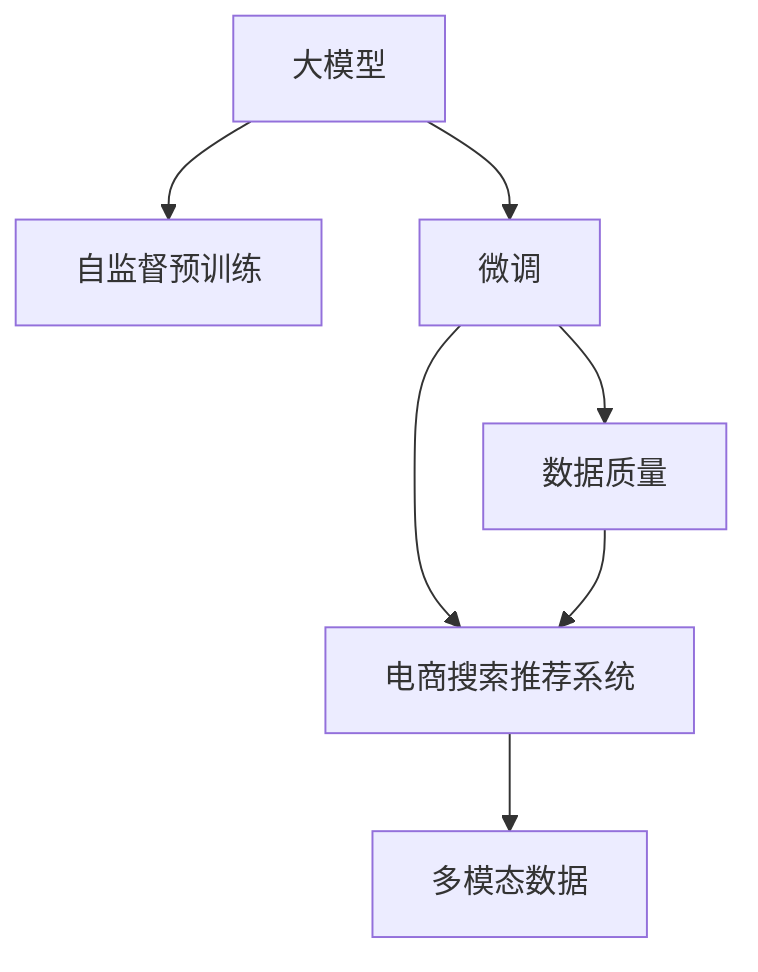

                 

# 电商平台的AI 大模型应用：搜索推荐系统是核心，数据质量是关键

> 关键词：人工智能, 电商搜索, 推荐系统, 大模型, 数据质量, 深度学习

## 1. 背景介绍

随着电子商务的迅猛发展，电商平台的个性化推荐系统已成为提升用户体验、提高交易转化率的关键技术。通过精准匹配用户需求，推荐系统能够极大地提升电商平台的商业价值，实现用户的精准营销。然而，传统的推荐算法往往依赖于复杂的特征工程和人工规则，难以应对动态市场环境下的复杂需求。

近年来，人工智能技术的大规模发展，尤其是深度学习模型在电商搜索推荐领域的应用，彻底颠覆了传统推荐系统。基于深度学习的大模型（如BERT、GPT-3等），通过自监督预训练和任务微调，能够学习到丰富的用户行为特征和商品属性，从而实现更加精准的个性化推荐。

本博文将从背景介绍开始，全面梳理大模型在电商搜索推荐系统中的应用现状和未来趋势，并结合实践案例，探讨数据质量对于大模型应用的重要影响，希望能为电商平台的AI应用提供实用的技术参考。

## 2. 核心概念与联系

### 2.1 核心概念概述

为了更好地理解大模型在电商搜索推荐系统中的应用，本节将介绍几个密切相关的核心概念：

- **大模型(Large Model)**：指的是具有大量参数（通常以亿计）的深度学习模型，如BERT、GPT-3等。通过在大规模无标签数据上进行预训练，学习到丰富的语言或视觉表示，具备强大的泛化能力。

- **自监督预训练(Self-Supervised Pre-training)**：指在大规模无标签数据上，通过设计自监督任务（如掩码语言模型、自回归预测等）训练模型的过程。通过预训练，模型能够学习到通用的特征表示。

- **微调(Fine-tuning)**：指在自监督预训练的基础上，使用特定任务的标注数据，通过有监督学习优化模型在该任务上的性能。微调是使得通用模型适应特定任务的有效方法。

- **电商搜索推荐系统(E-commerce Search and Recommendation System)**：指电商平台上的搜索和推荐系统，通过分析用户行为数据和商品属性信息，提供精准的搜索结果和推荐内容。

- **数据质量(Data Quality)**：指数据集中的错误、缺失、冗余和噪声的多少，数据质量的高低直接影响到机器学习模型的训练效果和最终应用效果。

- **多模态数据(Multimodal Data)**：指包括文本、图像、音频等多类型数据，在电商推荐系统中，多模态数据能够提供更全面、更丰富的用户行为和商品特征信息。

这些核心概念之间的逻辑关系可以通过以下Mermaid流程图来展示：



这个流程图展示了大模型在电商推荐系统中的应用流程：

1. 大模型通过自监督预训练获得基础能力。
2. 通过微调，大模型适应特定任务，如电商搜索和推荐。
3. 电商推荐系统利用大模型进行个性化推荐，需要考虑数据质量。
4. 电商推荐系统同时考虑多模态数据，以提升推荐效果。

## 3. 核心算法原理 & 具体操作步骤

### 3.1 算法原理概述

基于深度学习的大模型，如BERT、GPT-3等，通过自监督预训练和微调，能够学习到丰富的用户行为特征和商品属性，从而实现更加精准的个性化推荐。以下将详细介绍这一过程。

假设电商平台的推荐系统包含一个多模态数据集 $D = \{ (x_i, y_i) \}_{i=1}^N$，其中 $x_i$ 表示用户行为数据和商品属性，$y_i$ 表示用户对于该商品的评价或购买行为。

大模型 $M_\theta$ 通过以下步骤实现推荐：

1. **自监督预训练**：在大规模无标签数据上，设计自监督任务，如掩码语言模型、自回归预测等，训练模型。

2. **微调**：在电商推荐任务上，使用标注数据集 $D$ 对大模型进行微调，以学习到用户行为特征和商品属性之间的映射关系。

3. **多模态融合**：将文本、图像等多模态数据融合到模型输入中，提升推荐效果。

### 3.2 算法步骤详解

以下将详细介绍大模型在电商推荐系统中微调的具体操作步骤。

#### 3.2.1 数据准备

1. **数据收集**：收集电商平台的搜索数据、点击数据、购买数据等，形成多模态数据集 $D = \{ (x_i, y_i) \}_{i=1}^N$，其中 $x_i$ 包括用户搜索历史、浏览历史、购买历史等。

2. **数据预处理**：对数据进行清洗、归一化、标签化等预处理操作，形成可供模型训练的标注数据集 $D_{train} = \{ (x_i, y_i) \}_{i=1}^N$ 和验证集 $D_{val} = \{ (x_i, y_i) \}_{i=1}^N$。

3. **多模态融合**：将文本、图像等多模态数据融合到模型输入中，提升推荐效果。例如，将用户搜索历史、浏览历史和商品图片特征合并到模型输入中。

#### 3.2.2 模型选择与微调

1. **选择预训练模型**：选择合适的预训练模型 $M_{\theta}$，如BERT、GPT-3等，作为初始化参数。

2. **任务适配层设计**：根据电商推荐任务，设计合适的输出层和损失函数。例如，对于二分类任务，可以设计输出层为二分类交叉熵。

3. **设置微调超参数**：选择合适的优化算法及其参数，如 AdamW、SGD 等，设置学习率、批大小、迭代轮数等。

4. **微调过程**：使用标注数据集 $D_{train}$ 对模型进行微调，使用验证集 $D_{val}$ 评估模型性能，根据性能指标决定是否触发 Early Stopping。

5. **多模态特征融合**：在模型输入中融合多模态数据，提升模型对不同类型数据的适应能力。例如，在输入中加入商品图片特征向量。

#### 3.2.3 结果评估与部署

1. **模型评估**：在测试集上评估微调后模型的性能，对比微调前后的效果。

2. **部署**：使用微调后的模型对新样本进行推理预测，集成到电商平台的搜索推荐系统中。

3. **持续学习**：随着新数据的到来，定期重新微调模型，以适应数据分布的变化。

### 3.3 算法优缺点

基于深度学习的大模型在电商推荐系统中的应用具有以下优点：

- **效果显著**：通过微调，大模型能够学习到用户行为特征和商品属性之间的复杂映射关系，提升推荐效果。

- **可解释性强**：大模型的预训练过程和微调过程都有理论支持，模型决策过程可解释性强，便于调试和优化。

- **数据驱动**：通过大量标注数据，大模型能够自动学习到用户行为和商品属性的映射关系，减少人工干预。

- **多模态融合**：能够融合文本、图像等多类型数据，提升推荐效果。

但大模型应用也存在一些缺点：

- **计算资源需求高**：大模型通常具有大量参数，计算资源需求高，部署成本大。

- **数据依赖性强**：模型性能依赖于标注数据的质量和数量，标注数据不足时，模型性能可能下降。

- **泛化能力有待提高**：大模型在小样本情况下可能出现泛化能力不足的问题。

- **模型复杂度高**：大模型结构复杂，难以解释和调试。

### 3.4 算法应用领域

基于深度学习的大模型在电商推荐系统中的应用主要包括以下几个领域：

- **电商搜索**：通过用户搜索历史和商品属性，推荐最相关的商品，提升搜索体验。

- **商品推荐**：根据用户浏览历史和购买历史，推荐用户可能感兴趣的商品。

- **个性化广告**：根据用户行为数据，推荐个性化广告，提升广告转化率。

- **内容推荐**：根据用户阅读历史和评价，推荐相关内容，提升用户粘性。

以上领域中，电商搜索和商品推荐是核心，数据质量和模型性能对用户体验和平台收益有直接的影响。

## 4. 数学模型和公式 & 详细讲解 & 举例说明

### 4.1 数学模型构建

假设电商平台推荐任务为二分类任务，即判断用户是否购买了某商品。使用大模型 $M_\theta$ 进行微调，目标是最小化损失函数 $\mathcal{L}$。

- **输入表示**：将用户行为数据和商品属性数据转换为向量表示，记为 $x$。
- **模型表示**：使用预训练模型 $M_\theta$ 对输入 $x$ 进行编码，输出表示为 $h$。
- **输出表示**：根据输出 $h$ 和标签 $y$，使用二分类交叉熵损失函数 $L$ 计算损失。
- **优化目标**：最小化损失函数 $\mathcal{L}$，即：
$$
\mathcal{L} = \frac{1}{N} \sum_{i=1}^N L(y_i, M_\theta(x_i))
$$

### 4.2 公式推导过程

#### 4.2.1 损失函数推导

假设输入 $x$ 表示用户行为数据和商品属性，输出 $h$ 表示大模型对输入 $x$ 的编码，标签 $y$ 表示用户是否购买了某商品。

- **二分类交叉熵损失**：
$$
L(y, h) = -[y\log\sigma(h) + (1-y)\log(1-\sigma(h))]
$$
其中 $\sigma(h) = \frac{1}{1+e^{-h}}$ 为sigmoid函数。

- **平均损失**：
$$
\mathcal{L} = \frac{1}{N} \sum_{i=1}^N L(y_i, M_\theta(x_i))
$$

### 4.3 案例分析与讲解

以电商平台的商品推荐系统为例，具体分析大模型的应用过程。

假设有一个电商平台，用户浏览了商品A和商品B，但最终购买了商品B。通过大模型的微调，可以预测用户是否购买商品A的概率。

1. **数据收集**：收集用户浏览历史 $x_1=[A,B]$，购买历史 $y_1=1$，生成标注数据集 $D_1 = \{(x_1, y_1)\}$。

2. **预训练模型选择**：选择BERT作为预训练模型，使用掩码语言模型进行预训练。

3. **任务适配层设计**：设计二分类交叉熵输出层，以判断用户是否购买了商品A。

4. **微调过程**：使用标注数据集 $D_1$ 对BERT进行微调，得到微调后的模型 $M_{\theta'}$。

5. **推荐预测**：使用微调后的模型 $M_{\theta'}$ 对用户浏览历史 $x_2=[B,C]$ 进行编码，得到输出 $h_2$，根据 sigmoid 函数输出概率 $P(y_2=1|h_2)$，判断用户是否购买商品C。

通过以上步骤，电商平台可以基于用户历史行为，预测用户购买意向，实现个性化的商品推荐。

## 5. 项目实践：代码实例和详细解释说明

### 5.1 开发环境搭建

在进行大模型应用实践前，需要准备以下开发环境：

1. **安装Python环境**：
```bash
pip install python=3.8
```

2. **安装深度学习框架**：
```bash
pip install torch torchvision torchaudio
```

3. **安装深度学习库**：
```bash
pip install transformers
```

4. **安装电商推荐库**：
```bash
pip install elasticsearch pandas
```

### 5.2 源代码详细实现

以下以电商平台的商品推荐系统为例，提供PyTorch代码实现。

```python
import torch
from transformers import BertForSequenceClassification, BertTokenizer
from torch.utils.data import DataLoader, Dataset

# 定义商品数据
data = [
    ("A", "B", 1),  # 用户浏览A、B，购买B
    ("B", "C", 0)   # 用户浏览B、C，未购买C
]

# 定义商品推荐模型
class ItemRecommendationModel:
    def __init__(self):
        self.model = BertForSequenceClassification.from_pretrained("bert-base-cased", num_labels=2)
        self.tokenizer = BertTokenizer.from_pretrained("bert-base-cased")
        
    def encode(self, sequence):
        return self.tokenizer(sequence, return_tensors="pt", padding=True, truncation=True)["input_ids"]

    def classify(self, sequence_ids):
        with torch.no_grad():
            sequence = self.encode(sequence_ids)
            logits = self.model(sequence).logits
            probability = torch.sigmoid(logits)
            return probability.tolist()

# 创建数据集
class ItemRecommendationDataset(Dataset):
    def __init__(self, data):
        self.data = data
        
    def __len__(self):
        return len(self.data)
    
    def __getitem__(self, idx):
        return self.data[idx]

# 创建数据加载器
dataset = ItemRecommendationDataset(data)
dataloader = DataLoader(dataset, batch_size=2, shuffle=True)

# 定义模型训练函数
def train(model, dataloader, device, num_epochs):
    model.to(device)
    optimizer = torch.optim.Adam(model.parameters(), lr=2e-5)
    loss_fn = torch.nn.BCELoss()
    
    for epoch in range(num_epochs):
        model.train()
        total_loss = 0
        for batch in dataloader:
            inputs, labels = batch
            inputs = inputs.to(device)
            labels = labels.to(device)
            optimizer.zero_grad()
            outputs = model(inputs)
            loss = loss_fn(outputs, labels)
            total_loss += loss.item()
            loss.backward()
            optimizer.step()
        
        print(f"Epoch {epoch+1}, Loss: {total_loss/len(dataloader)}")
    
    return model

# 训练模型
model = ItemRecommendationModel()
device = torch.device("cuda" if torch.cuda.is_available() else "cpu")
model = model.to(device)
num_epochs = 5
train(model, dataloader, device, num_epochs)

# 测试模型
test_input = "C"
sequence = model.encode(test_input)
probability = model.classify(sequence)
print(f"Prediction for '{test_input}': {probability}")
```

### 5.3 代码解读与分析

以上代码展示了基于BERT模型实现电商商品推荐系统的基本流程。具体解读如下：

1. **数据定义**：定义商品数据，包含用户浏览和购买历史。

2. **模型定义**：定义一个商品推荐模型，包括预训练模型和tokenizer。

3. **编码函数**：将用户浏览历史编码成BERT模型的输入序列。

4. **分类函数**：使用模型对输入序列进行编码和分类，输出概率值。

5. **数据集和加载器**：创建数据集和加载器，用于模型训练和推理。

6. **模型训练函数**：定义模型训练函数，使用Adam优化器进行训练，输出每个epoch的损失值。

7. **模型测试**：使用训练好的模型对新商品进行分类预测，输出概率值。

## 6. 实际应用场景

### 6.1 电商搜索推荐系统

基于大模型的电商搜索推荐系统已经广泛应用于各大电商平台。通过大模型的微调，电商推荐系统能够更好地理解用户行为和商品属性，实现更加精准的推荐。

具体应用场景包括：

- **商品推荐**：根据用户浏览历史和购买历史，推荐用户可能感兴趣的商品。
- **个性化广告**：根据用户行为数据，推荐个性化广告，提升广告转化率。
- **内容推荐**：根据用户阅读历史和评价，推荐相关内容，提升用户粘性。

### 6.2 未来应用展望

未来，大模型在电商推荐系统中的应用将更加广泛，以下是对未来趋势的展望：

1. **多模态融合**：融合文本、图像、视频等多模态数据，提升推荐效果。

2. **实时推荐**：通过实时收集用户行为数据，实现动态推荐，提升用户体验。

3. **个性化推荐**：利用用户画像和行为数据，实现更加个性化的推荐，提升用户满意度和平台收益。

4. **跨平台推荐**：实现跨平台推荐，将用户的购买历史和行为数据整合，提供一致的推荐体验。

## 7. 工具和资源推荐

### 7.1 学习资源推荐

为了帮助开发者掌握大模型在电商推荐系统中的应用，推荐以下学习资源：

1. **《Transformers in Practice》系列博文**：详细讲解大模型的原理和应用方法。

2. **《Deep Learning for NLP》课程**：斯坦福大学开设的深度学习课程，涵盖NLP基本概念和经典模型。

3. **《Building AI Recommendation Systems》书籍**：详细介绍推荐系统理论和实践，涵盖电商推荐、内容推荐等领域。

4. **HuggingFace官方文档**：提供丰富的预训练模型和微调样例，是学习大模型的重要资源。

5. **Kaggle竞赛平台**：参与电商推荐系统的Kaggle竞赛，实践大模型的微调和应用。

### 7.2 开发工具推荐

以下推荐几个常用的电商推荐系统开发工具：

1. **PyTorch**：开源深度学习框架，支持动态计算图和GPU加速，适合大模型应用。

2. **TensorFlow**：Google主导的深度学习框架，生产部署方便，支持大规模模型训练和推理。

3. **Elasticsearch**：高可扩展的分布式搜索引擎，适合存储和管理电商数据。

4. **Apache Kafka**：高效的消息队列系统，支持实时数据收集和处理。

5. **Pandas**：数据分析和处理库，适合电商数据的清洗和预处理。

### 7.3 相关论文推荐

以下推荐几篇经典的大模型应用论文，供深入学习和参考：

1. **BERT: Pre-training of Deep Bidirectional Transformers for Language Understanding**：提出BERT模型，通过自监督预训练和微调，取得SOTA性能。

2. **Attention is All You Need**：提出Transformer结构，开创大模型预训练范式，成为NLP领域的重要里程碑。

3. **GPT-3: Language Models are Unsupervised Multitask Learners**：提出GPT-3模型，展示大模型在多任务学习和零样本学习方面的强大能力。

4. **AdaLoRA: Adaptive Low-Rank Adaptation for Parameter-Efficient Fine-Tuning**：提出AdaLoRA方法，实现参数高效的微调。

5. **Prompt Tuning: Optimizing Continuous Prompts for Generation**：提出Prompt Tuning方法，通过提示模板实现高效的零样本和少样本学习。

## 8. 总结：未来发展趋势与挑战

### 8.1 研究成果总结

大模型在电商搜索推荐系统中的应用，已经取得了显著的成果。通过微调，大模型能够学习到用户行为和商品属性之间的复杂映射关系，提升推荐效果。未来，随着大模型和微调技术的进一步发展，电商推荐系统将实现更精准、更个性化的推荐。

### 8.2 未来发展趋势

未来，大模型在电商推荐系统中的应用将呈现以下趋势：

1. **多模态融合**：融合文本、图像、视频等多类型数据，提升推荐效果。

2. **实时推荐**：通过实时收集用户行为数据，实现动态推荐，提升用户体验。

3. **个性化推荐**：利用用户画像和行为数据，实现更加个性化的推荐，提升用户满意度和平台收益。

4. **跨平台推荐**：实现跨平台推荐，将用户的购买历史和行为数据整合，提供一致的推荐体验。

### 8.3 面临的挑战

大模型在电商推荐系统中的应用还面临着以下挑战：

1. **计算资源需求高**：大模型通常具有大量参数，计算资源需求高，部署成本大。

2. **数据依赖性强**：模型性能依赖于标注数据的质量和数量，标注数据不足时，模型性能可能下降。

3. **泛化能力有待提高**：大模型在小样本情况下可能出现泛化能力不足的问题。

4. **模型复杂度高**：大模型结构复杂，难以解释和调试。

### 8.4 研究展望

为了应对上述挑战，未来研究需要在以下几个方面寻求新的突破：

1. **探索参数高效和计算高效的微调方法**：开发更加参数高效的微调方法，在固定大部分预训练参数的同时，只更新极少量的任务相关参数。

2. **融合因果和对比学习范式**：通过引入因果推断和对比学习思想，增强模型的泛化能力和鲁棒性。

3. **结合因果分析和博弈论工具**：将因果分析方法引入微调模型，识别模型决策的关键特征，增强输出解释的因果性和逻辑性。

4. **纳入伦理道德约束**：在模型训练目标中引入伦理导向的评估指标，过滤和惩罚有偏见、有害的输出倾向。

5. **研究多模态融合技术**：利用多模态数据，提升推荐系统的性能和鲁棒性。

这些研究方向将引领大模型在电商推荐系统中的应用走向更高的台阶，为构建安全、可靠、可解释、可控的智能系统铺平道路。

## 9. 附录：常见问题与解答

### 9.1 常见问题

1. **大模型如何选择合适的学习率？**

答：大模型微调的学习率通常要比从头训练时小1-2个数量级，以保证模型不会因为学习率过大而破坏预训练权重。建议从1e-5开始调参，逐步减小学习率，直至收敛。

2. **大模型如何处理数据质量问题？**

答：数据质量是大模型应用的关键因素之一。为了保证数据质量，可以采用以下方法：

- **数据清洗**：去除噪声、异常值和重复数据。
- **数据增强**：通过回译、近义替换等方式扩充训练集。
- **数据筛选**：根据业务需求和用户行为特征，筛选高质量的数据。

3. **大模型在电商推荐系统中如何实现实时推荐？**

答：实现实时推荐需要以下几个步骤：

- **实时数据收集**：通过实时数据流技术，收集用户行为数据。
- **数据处理**：对实时数据进行清洗、预处理和编码。
- **模型推理**：使用大模型对实时数据进行推理，输出推荐结果。
- **实时响应**：将推荐结果实时推送给用户。

4. **大模型如何提高泛化能力？**

答：提高泛化能力需要以下方法：

- **多模态融合**：融合文本、图像、视频等多类型数据，提升模型的泛化能力。
- **对抗训练**：引入对抗样本，提高模型的鲁棒性和泛化能力。
- **知识图谱整合**：将外部知识图谱与模型融合，提升模型对知识的应用能力。

这些方法可以结合使用，从不同维度提升大模型的泛化能力。

---

作者：禅与计算机程序设计艺术 / Zen and the Art of Computer Programming

