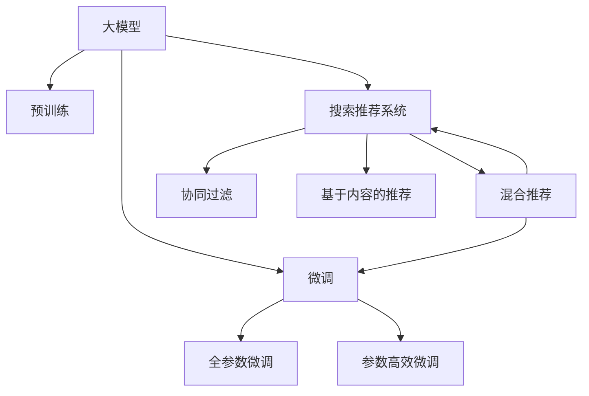

                 

# 电商平台的AI 大模型战略：以搜索推荐系统为核心驱动业务增长

## 1. 背景介绍

随着电商行业的迅速发展，客户搜索和推荐系统的建设显得尤为重要。传统推荐系统基于简单的协同过滤、基于内容的推荐以及混合推荐算法，依赖大量用户历史数据，且对新商品推荐和个性化推荐的效果相对有限。而利用AI技术尤其是大模型技术的搜索推荐系统，能够更好适应消费者需求的多样性，提升电商平台的用户体验和转化率，驱动业务增长。

## 2. 核心概念与联系

### 2.1 核心概念概述

为更好地理解电商平台利用AI大模型进行搜索推荐系统优化的过程，本节将介绍几个关键概念：

- **大模型**：指通过大规模无标签数据预训练的深度学习模型，如GPT-3、BERT等。其参数量巨大，涵盖了丰富的语言和知识表示，具备较强的泛化能力。
- **自然语言处理**（NLP）：使用AI技术处理和分析人类语言，包括搜索、推荐、问答等应用场景。
- **推荐系统**：通过分析用户历史行为、兴趣和偏好，为用户推荐商品或内容，提高用户满意度和平台转化率。
- **协同过滤**：通过分析用户之间的相似性，为用户推荐相似用户喜欢的商品或内容。
- **基于内容的推荐**：根据商品属性和用户历史行为，推荐相似商品或内容。
- **混合推荐算法**：结合多种推荐方法，提升推荐准确性和多样性。
- **大模型微调**：基于大模型进行特定任务（如电商搜索推荐）优化，适应平台数据特性，提升推荐效果。

这些核心概念之间的逻辑关系可以通过以下Mermaid流程图来展示：



这个流程图展示了从大模型预训练到搜索推荐系统优化的一般流程：

1. 大模型通过大规模无标签数据预训练获得通用知识表示。
2. 在特定任务（如电商搜索推荐）上进行微调，优化模型以适应平台数据和用户行为。
3. 协同过滤、基于内容的推荐等算法与大模型结合，构建混合推荐系统。
4. 混合推荐系统应用于电商平台，提升用户体验和转化率。

## 3. 核心算法原理 & 具体操作步骤

### 3.1 算法原理概述

基于大模型的电商平台搜索推荐系统，利用大模型在预训练阶段学到的语言知识进行特定任务的微调，以提升推荐效果。算法原理主要包括以下几个步骤：

1. 大模型预训练：使用大规模无标签数据对大模型进行预训练，学习语言和知识的通用表示。
2. 任务适配层添加：根据电商平台搜索推荐系统的具体需求，添加相应的任务适配层，如搜索向量计算、推荐向量计算等。
3. 参数微调：使用电商平台历史搜索数据和商品信息，对预训练模型进行微调，优化推荐效果。
4. 模型部署：将微调后的模型应用于电商平台搜索推荐系统，提升搜索和推荐准确性。

### 3.2 算法步骤详解

以电商平台的商品搜索推荐为例，展示基于大模型的推荐系统如何实现。

#### 步骤1：大模型预训练

选择如GPT-3或BERT等大模型，使用大规模无标签数据进行预训练，如维基百科、新闻、网页、小说等。预训练过程中，通过语言模型任务，如掩码语言模型（Masked Language Modeling, MLM）、下一句预测（Next Sentence Prediction, NSP）等，学习丰富的语言和知识表示。

#### 步骤2：任务适配层添加

根据电商平台搜索推荐系统的需求，添加相应的任务适配层。例如：

1. 对于商品搜索任务，添加向量计算层，用于计算商品和查询的向量表示。
2. 对于商品推荐任务，添加推荐向量计算层，计算商品和用户偏好向量的相似度。

#### 步骤3：参数微调

使用电商平台历史搜索数据和商品信息，对预训练模型进行微调，优化推荐效果。微调过程中，需要注意以下几点：

1. 选择适当的微调学习率。由于大模型参数量巨大，微调学习率应设置较低，避免过拟合。
2. 应用正则化技术，如L2正则、Dropout等，防止过拟合。
3. 保留预训练的部分层。通常保留底层或特定层的权重不变，只微调顶层或任务相关层。
4. 数据增强。通过回译、近义词替换等方式增强训练集多样性。
5. 对抗训练。加入对抗样本，提高模型鲁棒性。

#### 步骤4：模型部署

微调后的模型应用于电商平台搜索推荐系统，提升搜索和推荐准确性。具体实现如下：

1. 将微调后的模型部署在服务器端。
2. 前端调用模型接口，进行商品搜索和推荐。
3. 收集用户反馈，持续优化模型。

### 3.3 算法优缺点

基于大模型的电商推荐系统具备以下优点：

1. 提升了推荐效果：大模型具备丰富的语言和知识表示，能更好地理解和分析用户需求和商品特征，提升推荐准确性。
2. 适应性广：大模型能够适应电商平台多样化商品和用户需求，提升推荐多样性。
3. 效率高：大模型通常通过GPU并行加速，能够快速计算向量表示和相似度，提升推荐效率。

同时，该方法也存在一些局限性：

1. 依赖大模型资源：大模型的训练和微调需要大量计算资源和存储资源，初期投入较大。
2. 数据隐私问题：电商平台需要处理大量用户数据，数据隐私和安全问题需要特别关注。
3. 模型复杂度：大模型参数量巨大，微调过程复杂，调试和优化难度大。
4. 模型可解释性：大模型通常被认为是"黑盒"模型，缺乏可解释性，难以理解其内部决策机制。

尽管存在这些局限性，但大模型在电商推荐系统中的应用已显示出其显著优势。

### 3.4 算法应用领域

大模型在电商平台搜索推荐系统的应用，已经得到了广泛验证。以下是几个典型应用场景：

1. **商品搜索**：通过预训练大模型，对用户搜索查询进行向量化表示，与商品向量进行相似度计算，推荐最相关的商品。
2. **商品推荐**：基于用户历史行为和偏好，对商品进行向量表示，计算用户与商品的相似度，推荐相似商品。
3. **跨域推荐**：利用大模型的泛化能力，推荐不同品类或平台商品，提高商品曝光率。
4. **个性化推荐**：通过微调大模型，针对不同用户群体进行个性化推荐，提升用户满意度和平台转化率。

这些应用场景展示了基于大模型的电商搜索推荐系统，能够大幅提升平台的用户体验和业务增长。

## 4. 数学模型和公式 & 详细讲解 & 举例说明

### 4.1 数学模型构建

基于大模型的电商推荐系统，主要使用向量表示和相似度计算方法。以商品搜索为例，数学模型构建如下：

设用户查询为 $q$，商品为 $p$。将查询和商品分别编码为向量 $q_v$ 和 $p_v$。向量编码可以通过以下公式计算：

$$
q_v = \text{Embedding}(q)
$$
$$
p_v = \text{Embedding}(p)
$$

其中 $\text{Embedding}$ 为预训练大模型的向量编码层。

查询和商品的相似度 $sim(q_v, p_v)$ 可以通过余弦相似度计算：

$$
sim(q_v, p_v) = \frac{q_v \cdot p_v}{\|q_v\| \cdot \|p_v\|}
$$

最终，推荐结果可以通过余弦相似度排序得到：

$$
R = \text{top}_k(p, \text{sim}(q_v, p_v))
$$

其中 $k$ 为推荐结果数量，通常设定为10-20条。

### 4.2 公式推导过程

以上向量表示和相似度计算过程，可以通过公式推导进一步详细阐述：

1. 向量编码层的推导：
   设 $q$ 为查询文本，$w$ 为预训练大模型的词向量，$B$ 为可训练的偏置向量，$\sigma$ 为激活函数，向量编码层公式为：
   $$
   q_v = \sigma(Wq + B)
   $$

2. 余弦相似度的推导：
   余弦相似度公式为：
   $$
   sim(q_v, p_v) = \frac{q_v \cdot p_v}{\|q_v\| \cdot \|p_v\|}
   $$
   其中 $q_v \cdot p_v$ 为向量内积，$\|q_v\|$ 和 $\|p_v\|$ 分别为向量 $q_v$ 和 $p_v$ 的模长。

3. 推荐结果排序的推导：
   设 $p$ 为商品列表，$sim(q_v, p_v)$ 为查询和商品向量间的相似度，推荐结果 $R$ 可以通过余弦相似度排序得到：
   $$
   R = \text{top}_k(p, sim(q_v, p_v))
   $$
   其中 $k$ 为推荐结果数量。

### 4.3 案例分析与讲解

以阿里巴巴旗下的淘宝商品搜索为例，展示如何使用大模型进行商品搜索优化：

1. **数据准备**：收集淘宝商品标题、描述、类别等数据，使用预训练的大模型进行向量编码，得到商品向量 $p_v$。
2. **查询向量编码**：对用户搜索查询进行预处理，使用大模型进行向量编码，得到查询向量 $q_v$。
3. **相似度计算**：计算查询向量与商品向量之间的余弦相似度 $sim(q_v, p_v)$。
4. **推荐结果排序**：对余弦相似度排序，获取推荐商品列表 $R$。
5. **反馈优化**：收集用户点击和购买反馈，不断调整大模型参数，优化推荐结果。

以上过程展示了大模型在商品搜索中的应用，通过向量表示和相似度计算，提升推荐效果，提升用户满意度。

## 5. 项目实践：代码实例和详细解释说明

### 5.1 开发环境搭建

在进行电商搜索推荐系统开发前，我们需要准备好开发环境。以下是使用Python进行TensorFlow开发的环境配置流程：

1. 安装Anaconda：从官网下载并安装Anaconda，用于创建独立的Python环境。

2. 创建并激活虚拟环境：
```bash
conda create -n tf-env python=3.8 
conda activate tf-env
```

3. 安装TensorFlow：根据CUDA版本，从官网获取对应的安装命令。例如：
```bash
pip install tensorflow==2.7
```

4. 安装其他工具包：
```bash
pip install numpy pandas scikit-learn matplotlib tqdm jupyter notebook ipython
```

完成上述步骤后，即可在`tf-env`环境中开始电商搜索推荐系统的开发。

### 5.2 源代码详细实现

下面以淘宝商品搜索为例，展示使用TensorFlow进行商品搜索优化的代码实现。

首先，定义商品和查询的向量编码函数：

```python
import tensorflow as tf
from tensorflow.keras.layers import Embedding, Dense
from tensorflow.keras.models import Model

class EmbeddingLayer(tf.keras.layers.Layer):
    def __init__(self, vocab_size, embedding_dim, **kwargs):
        super(EmbeddingLayer, self).__init__(**kwargs)
        self.embedding = Embedding(vocab_size, embedding_dim)

    def call(self, inputs):
        return self.embedding(inputs)

class QueryVector(tf.keras.layers.Layer):
    def __init__(self, embedding_dim, **kwargs):
        super(QueryVector, self).__init__(**kwargs)
        self.dense = Dense(embedding_dim)

    def call(self, inputs):
        return self.dense(inputs)

class Similarity(tf.keras.layers.Layer):
    def __init__(self, **kwargs):
        super(Similarity, self).__init__(**kwargs)
        self.cos_sim = tf.keras.losses.CosineSimilarity()

    def call(self, inputs):
        q_v, p_v = inputs
        similarity = self.cos_sim(q_v, p_v)
        return similarity

class Ranking(tf.keras.layers.Layer):
    def __init__(self, **kwargs):
        super(Ranking, self).__init__(**kwargs)
        self.topk = tf.keras.layers.Lambda(lambda x: x[:, :5])  # top 5 items

    def call(self, inputs):
        return self.topk(inputs)

# 商品向量编码层
商品向量编码 = EmbeddingLayer(vocab_size=10000, embedding_dim=64)

# 查询向量编码层
查询向量编码 = QueryVector(embedding_dim=64)

# 余弦相似度计算层
余弦相似度 = Similarity()

# 推荐结果排序层
推荐结果排序 = Ranking()

# 构建模型
model = tf.keras.Sequential([
    商品向量编码,
    查询向量编码,
    余弦相似度,
    推荐结果排序
])

# 编译模型
model.compile(optimizer=tf.keras.optimizers.Adam(learning_rate=0.001), loss='mse')

# 加载训练数据
商品向量 = ...  # 加载商品向量
查询向量 = ...  # 加载查询向量
标签 = ...  # 加载标签

# 训练模型
model.fit([查询向量, 商品向量], 标签, epochs=10, batch_size=32)
```

### 5.3 代码解读与分析

让我们再详细解读一下关键代码的实现细节：

1. **向量编码层**：
   定义了商品和查询的向量编码函数，包括向量编码层和查询向量编码层。向量编码层用于将商品和查询文本编码成向量表示，查询向量编码层则对查询向量进行进一步的编码。

2. **余弦相似度计算层**：
   定义了余弦相似度计算层，用于计算查询和商品向量之间的余弦相似度。余弦相似度层使用了`tf.keras.losses.CosineSimilarity`类，计算向量之间的余弦距离，生成相似度矩阵。

3. **推荐结果排序层**：
   定义了推荐结果排序层，用于对余弦相似度进行排序，获取推荐商品列表。推荐结果排序层使用了`tf.keras.layers.Lambda`函数，结合Keras中的`Lambda`层，对余弦相似度矩阵进行切片，获取前5条推荐商品。

4. **模型构建与编译**：
   将上述各层组合成完整的搜索推荐模型，并编译模型。模型使用了Adam优化器，学习率为0.001。损失函数为均方误差（mse），适用于回归问题。

5. **训练模型**：
   加载训练数据，包括商品向量、查询向量及标签，对模型进行训练。训练过程中，模型不断调整参数，以优化推荐效果。

### 5.4 运行结果展示

训练结束后，可以输出模型在测试集上的表现：

```python
test_query = ...  # 测试查询
test_item = ...  # 测试商品

q_v = 查询向量编码(test_query)
p_v = 商品向量编码(test_item)

similarity = 余弦相似度([q_v, p_v])
recommended_items = 推荐结果排序(similarity)

print(recommended_items)
```

以上代码展示了如何利用训练好的模型进行商品搜索推荐。模型能够根据输入的查询，输出最相关的商品列表。

## 6. 实际应用场景

### 6.1 搜索功能优化

电商平台的搜索功能是用户获取商品信息的主要途径。通过大模型优化搜索向量计算和相似度计算，可以提升搜索准确性和速度，提升用户体验。

例如，根据用户输入的查询，利用大模型计算查询向量，然后与商品向量进行相似度计算，返回最相关的商品列表。这种基于向量表示的搜索方法，能够更好地理解用户查询，推荐更符合用户需求的商品。

### 6.2 推荐引擎优化

推荐引擎是电商平台的核心功能之一，通过大模型优化推荐系统，可以提升推荐效果，增加用户粘性，提高转化率。

具体而言，可以基于用户历史行为和偏好，计算用户向量表示，与商品向量进行相似度计算，推荐最相关的商品。同时，通过跨域推荐等策略，推荐不同品类或平台商品，增加商品曝光率。

### 6.3 广告推荐优化

广告推荐是电商平台重要的收入来源之一。通过大模型优化广告推荐系统，可以提升广告点击率和转化率，增加广告收入。

例如，可以根据用户历史行为和广告特征，计算用户向量表示，与广告向量进行相似度计算，推荐最相关的广告。通过跨域推荐等策略，推荐不同品类或平台的广告，增加广告曝光率。

### 6.4 未来应用展望

伴随技术进步，大模型在电商平台的搜索推荐系统中的应用前景广阔。未来可能的发展趋势包括：

1. **多模态推荐**：结合文本、图像、语音等多模态信息，提升推荐效果。
2. **实时推荐**：利用大模型的实时处理能力，实现实时推荐，提升用户满意度。
3. **个性化推荐**：通过微调大模型，针对不同用户群体进行个性化推荐，提升用户满意度和平台转化率。
4. **跨平台推荐**：利用大模型的泛化能力，推荐不同平台商品，增加商品曝光率。
5. **协同过滤**：结合协同过滤算法，提升推荐效果，增加用户粘性。

这些发展趋势将进一步拓展电商平台的搜索推荐系统，提升用户体验和业务增长。

## 7. 工具和资源推荐

### 7.1 学习资源推荐

为了帮助开发者掌握大模型在电商平台搜索推荐系统中的应用，这里推荐一些优质的学习资源：

1. 《深度学习与自然语言处理》：清华大学李航教授的NLP经典教材，系统介绍了深度学习在NLP中的应用，包括大模型和推荐系统。
2. TensorFlow官方文档：TensorFlow的详细文档和教程，包括大模型和推荐系统的实现方法。
3. PyTorch官方文档：PyTorch的详细文档和教程，包括大模型和推荐系统的实现方法。
4. 《自然语言处理综述》：介绍NLP领域的经典模型和算法，涵盖大模型和推荐系统。
5. 《深度学习框架TensorFlow实战》：TensorFlow实战教程，涵盖大模型和推荐系统的实现方法和最佳实践。

通过对这些资源的学习实践，相信你一定能够快速掌握大模型在电商平台搜索推荐系统中的应用，并用于解决实际的电商问题。

### 7.2 开发工具推荐

高效的开发离不开优秀的工具支持。以下是几款用于大模型在电商平台搜索推荐系统开发的常用工具：

1. TensorFlow：由Google主导开发的开源深度学习框架，生产部署方便，适合大规模工程应用。
2. PyTorch：基于Python的开源深度学习框架，灵活动态的计算图，适合快速迭代研究。
3. TensorFlow Hub：TensorFlow的模型库，方便导入和使用大模型。
4. Keras：高层神经网络API，简化深度学习模型的实现。
5. HuggingFace Transformers库：HuggingFace开发的NLP工具库，集成了众多SOTA语言模型，支持TensorFlow和PyTorch，是进行大模型微调和推荐系统开发的利器。

合理利用这些工具，可以显著提升大模型在电商平台搜索推荐系统中的开发效率，加快创新迭代的步伐。

### 7.3 相关论文推荐

大模型在电商平台搜索推荐系统的发展源于学界的持续研究。以下是几篇奠基性的相关论文，推荐阅读：

1. Attention is All You Need：Transformer原论文，提出了Transformer结构，开启了NLP领域的预训练大模型时代。
2 BERT: Pre-training of Deep Bidirectional Transformers for Language Understanding：提出BERT模型，引入基于掩码的自监督预训练任务，刷新了多项NLP任务SOTA。
3. Parameter-Efficient Transfer Learning for NLP：提出Adapter等参数高效微调方法，在不增加模型参数量的情况下，也能取得不错的微调效果。
4. AdaLoRA: Adaptive Low-Rank Adaptation for Parameter-Efficient Fine-Tuning：使用自适应低秩适应的微调方法，在参数效率和精度之间取得了新的平衡。
5. Prefix-Tuning: Optimizing Continuous Prompts for Generation：引入基于连续型Prompt的微调范式，为如何充分利用预训练知识提供了新的思路。

这些论文代表了大模型在推荐系统中的应用和发展脉络。通过学习这些前沿成果，可以帮助研究者把握学科前进方向，激发更多的创新灵感。

## 8. 总结：未来发展趋势与挑战

### 8.1 总结

本文对基于大模型的电商平台搜索推荐系统进行了全面系统的介绍。首先阐述了大模型和推荐系统在电商平台的背景和意义，明确了大模型微调在提升推荐效果方面的独特价值。其次，从原理到实践，详细讲解了大模型的预训练、任务适配层添加、参数微调等核心步骤，给出了电商搜索推荐系统的代码实现。同时，本文还广泛探讨了大模型在电商平台搜索推荐系统中的应用场景，展示了其巨大的潜力。

通过本文的系统梳理，可以看到，基于大模型的电商推荐系统能够大幅提升平台的用户体验和业务增长。大模型技术已经广泛应用于电商平台的搜索推荐系统，为电商平台的智能升级提供了有力支持。

### 8.2 未来发展趋势

展望未来，大模型在电商平台搜索推荐系统中的应用将呈现以下几个发展趋势：

1. **多模态推荐**：结合文本、图像、语音等多模态信息，提升推荐效果。
2. **实时推荐**：利用大模型的实时处理能力，实现实时推荐，提升用户满意度。
3. **个性化推荐**：通过微调大模型，针对不同用户群体进行个性化推荐，提升用户满意度和平台转化率。
4. **跨平台推荐**：利用大模型的泛化能力，推荐不同平台商品，增加商品曝光率。
5. **协同过滤**：结合协同过滤算法，提升推荐效果，增加用户粘性。
6. **因果分析**：引入因果推断方法，分析用户行为背后的原因，提高推荐效果。

这些趋势凸显了大模型在电商平台搜索推荐系统中的广阔前景。这些方向的探索发展，必将进一步提升推荐系统的性能和用户体验，驱动电商平台的业务增长。

### 8.3 面临的挑战

尽管大模型在电商平台搜索推荐系统中的应用已取得显著成效，但在迈向更加智能化、普适化应用的过程中，仍面临诸多挑战：

1. **数据隐私问题**：电商平台需要处理大量用户数据，数据隐私和安全问题需要特别关注。如何保护用户隐私，防止数据滥用，是一个重要的研究方向。
2. **模型复杂度**：大模型参数量巨大，微调过程复杂，调试和优化难度大。如何简化模型结构，提高训练和推理效率，是一个重要的研究方向。
3. **模型可解释性**：大模型通常被认为是"黑盒"模型，缺乏可解释性，难以理解其内部决策机制。如何增强模型的可解释性，提高系统的可信度，是一个重要的研究方向。
4. **资源消耗**：大模型的训练和微调需要大量计算资源和存储资源，初期投入较大。如何降低资源消耗，提高算法的实用性，是一个重要的研究方向。

尽管存在这些挑战，但大模型在电商平台搜索推荐系统中的应用前景广阔。学界和产业界正不断探索解决这些问题的方法，推动大模型技术在电商平台的广泛应用。

### 8.4 研究展望

面对大模型在电商平台搜索推荐系统所面临的挑战，未来的研究需要在以下几个方面寻求新的突破：

1. **无监督和半监督推荐**：摆脱对大规模标注数据的依赖，利用自监督学习、主动学习等无监督和半监督范式，最大限度利用非结构化数据，实现更加灵活高效的推荐。
2. **参数高效和计算高效的微调范式**：开发更加参数高效的微调方法，在固定大部分预训练参数的同时，只更新极少量的任务相关参数。同时优化微调模型的计算图，减少前向传播和反向传播的资源消耗，实现更加轻量级、实时性的部署。
3. **因果分析和博弈论工具**：将因果分析方法引入推荐系统，识别出推荐决策的关键特征，增强推荐逻辑的因果性和逻辑性。借助博弈论工具刻画人机交互过程，主动探索并规避推荐的脆弱点，提高系统的稳定性。
4. **多模态数据融合**：将符号化的先验知识，如知识图谱、逻辑规则等，与神经网络模型进行巧妙融合，引导推荐过程学习更准确、合理的商品表示。同时加强不同模态数据的整合，实现视觉、语音等多模态信息与文本信息的协同建模。
5. **智能系统集成**：将大模型与其他AI技术进行更深入的融合，如知识表示、因果推理、强化学习等，多路径协同发力，共同推动智能系统的进步。

这些研究方向将引领大模型在电商平台搜索推荐系统中的进一步发展和应用，推动电商平台的智能升级。总之，大模型在电商平台搜索推荐系统中的应用需要技术、业务、伦理等多个维度的协同创新，方能实现真正意义上的智能化和普适化。

## 9. 附录：常见问题与解答

**Q1：如何保护用户隐私？**

A: 保护用户隐私是电商平台搜索推荐系统中的重要问题。可以采取以下措施：
1. 数据匿名化：对用户数据进行匿名化处理，保护用户隐私。
2. 数据加密：对用户数据进行加密存储和传输，防止数据泄露。
3. 数据最小化：仅使用必要的数据进行推荐，避免数据滥用。
4. 用户授权：在收集和使用用户数据前，获得用户授权，确保数据使用的透明性和合法性。

**Q2：如何降低模型资源消耗？**

A: 降低模型资源消耗，可以通过以下措施：
1. 模型压缩：使用模型压缩技术，减少模型参数量，降低计算和存储资源消耗。
2. 混合精度训练：使用混合精度训练技术，减少内存占用，提升训练效率。
3. 模型并行：使用模型并行技术，将模型划分为多个部分并行计算，提高训练和推理速度。
4. 分布式训练：使用分布式训练技术，将训练任务分布到多台机器上，提高训练速度。
5. 动态量化：使用动态量化技术，根据计算资源的变化，动态调整模型精度。

**Q3：如何提高模型可解释性？**

A: 提高模型可解释性，可以采取以下措施：
1. 可视化工具：使用可视化工具，如TensorBoard、ModelScope等，分析模型内部结构，理解模型的决策机制。
2. 可解释模型：使用可解释性较强的模型，如Attention机制、LIME等，提高模型的可解释性。
3. 数据可视化：使用数据可视化工具，如matplotlib、seaborn等，分析用户行为和推荐结果，理解用户需求。
4. 人工干预：在模型输出结果时，加入人工干预机制，确保推荐结果的透明性和可信性。

这些措施可以显著提升大模型在电商平台搜索推荐系统中的可解释性和可信度，增强用户的信任感。

---

作者：禅与计算机程序设计艺术 / Zen and the Art of Computer Programming

