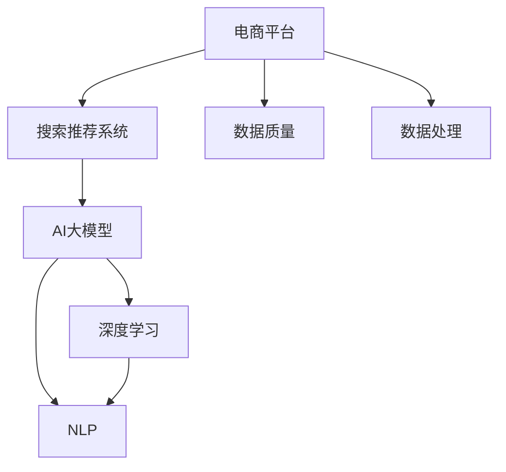

                 

# 电商平台的AI 大模型战略：搜索推荐系统是核心，数据质量与处理能力

> 关键词：电商、AI大模型、搜索推荐、数据质量、数据处理、深度学习、自然语言处理

## 1. 背景介绍

### 1.1 问题由来

在电商行业，用户体验和客户转化率一直是至关重要的指标。随着在线购物的普及，电商平台面临着流量获取、商品展示、购买转化等多方面的挑战。如何通过智能化手段提升用户购物体验，增加销售额，成为了电商平台亟需解决的难题。

为此，电商平台引入了人工智能技术，特别是基于大模型的搜索推荐系统。大模型如BERT、GPT等，通过预训练和微调，能够理解和生成自然语言，构建用户与商品的语义连接，从而为用户提供更加个性化的购物体验。然而，要想充分发挥大模型的潜力，不仅需要先进的算法技术，还需要高质量的数据和高效的数据处理能力。

### 1.2 问题核心关键点

大模型在电商搜索推荐中的应用，关键在于以下几点：

- **数据质量**：高质量、多样化的标注数据是提升模型性能的基础。
- **数据处理能力**：高效的数据清洗、预处理和特征提取，能够减少模型过拟合风险，提升模型泛化能力。
- **算法技术**：合适的算法设计和优化策略，可以进一步提升模型精度和效率。

本文将从数据质量与处理能力两个维度，系统阐述AI大模型在电商平台搜索推荐系统中的应用，并探讨如何构建有效的电商AI战略。

## 2. 核心概念与联系

### 2.1 核心概念概述

为更好地理解AI大模型在电商平台搜索推荐中的应用，本节将介绍几个密切相关的核心概念：

- **电商平台**：指通过互联网提供商品和服务，并促进交易的平台。
- **搜索推荐系统**：指在电商平台上，通过分析用户行为数据和商品信息，智能推荐商品或搜索结果的系统。
- **AI大模型**：指通过预训练和微调得到的大规模、高性能的深度学习模型，如BERT、GPT等。
- **深度学习**：一种基于多层神经网络的机器学习方法，通过训练得到能够自动学习和提取数据的模型。
- **自然语言处理(NLP)**：指使计算机能够理解、处理和生成人类语言的技术，是AI大模型的重要应用领域。
- **数据质量**：指数据的准确性、完整性和一致性，是模型训练和评估的基础。
- **数据处理**：指对数据进行清洗、预处理、特征提取等操作，以提升数据质量和可用性。

这些核心概念之间的逻辑关系可以通过以下Mermaid流程图来展示：



这个流程图展示了大模型在电商搜索推荐系统中的应用流程：

1. 电商平台通过用户行为数据和商品信息，调用AI大模型进行推荐或搜索。
2. AI大模型基于深度学习技术和NLP模型，能够理解自然语言并提取特征。
3. 深度学习提供模型训练和优化算法，提升模型精度和泛化能力。
4. 数据质量和处理能力直接影响大模型的训练效果和推荐准确性。

## 3. 核心算法原理 & 具体操作步骤
### 3.1 算法原理概述

基于大模型的搜索推荐系统，本质上是一种基于深度学习技术的语义匹配和排序系统。其核心思想是通过构建用户与商品的语义连接，在大量商品中筛选出与用户需求最匹配的商品。

具体来说，搜索推荐系统一般分为以下几个步骤：

1. **用户输入处理**：将用户输入的自然语言查询，转换为模型可接受的向量表示。
2. **商品数据处理**：对商品信息进行编码和特征提取，转换为向量表示。
3. **匹配与排序**：通过计算用户输入和商品向量的相似度，对商品进行排序。
4. **推荐与展示**：根据排序结果，推荐最匹配的商品给用户。

形式化地，假设用户输入查询为 $q$，商品信息为 $d$，设 $f$ 为用户查询的特征提取函数，$g$ 为商品信息的特征提取函数。则推荐系统的一般流程如下：

1. $q_{vec} = f(q)$ ：将用户查询转换为向量表示。
2. $d_{vec} = g(d)$ ：对商品信息进行编码，转换为向量表示。
3. $s = \text{similarity}(q_{vec}, d_{vec})$ ：计算用户查询与商品的相似度。
4. $d_{ranked} = \text{rank}(d_{vec})$ ：对商品进行排序，生成推荐列表。

其中，相似度函数 $\text{similarity}$ 和排序函数 $\text{rank}$ 是关键组件，需根据具体任务选择合适的算法。

### 3.2 算法步骤详解

以下是搜索推荐系统的主要算法步骤：

**Step 1: 数据准备**

- 收集用户行为数据，包括浏览历史、点击行为、购买记录等。
- 收集商品信息，包括商品描述、属性、类别等。
- 清洗数据，处理缺失值、异常值，去除重复数据。
- 将数据划分为训练集、验证集和测试集。

**Step 2: 特征提取与预处理**

- 对用户行为数据进行向量化处理，生成用户嵌入向量。
- 对商品信息进行编码和特征提取，生成商品嵌入向量。
- 进行数据增强，如回译、拼接、截断等，丰富训练集多样性。
- 应用数据增强技术，如正则化、对抗训练等，防止模型过拟合。

**Step 3: 模型训练与优化**

- 选择合适的深度学习框架（如TensorFlow、PyTorch等），实现推荐系统模型。
- 设置模型的超参数，如学习率、批大小、迭代轮数等。
- 应用优化算法，如Adam、SGD等，更新模型参数。
- 在验证集上评估模型性能，调整超参数。
- 在测试集上测试模型效果，对比微调前后的性能提升。

**Step 4: 模型部署与监控**

- 将训练好的模型部署到实际系统中，提供推荐服务。
- 实时监控模型性能，收集系统指标。
- 定期更新模型，重新训练以适应新的数据分布。

### 3.3 算法优缺点

基于大模型的搜索推荐系统，具有以下优点：

1. **高效性**：大模型能够高效处理大规模数据，提升推荐效率。
2. **泛化能力强**：大模型具有强大的语义理解能力，能够应对多样化、复杂的查询。
3. **可解释性**：大模型提供了特征向量，便于解释模型的推理过程。

然而，也存在一些局限性：

1. **数据依赖性强**：模型的性能高度依赖于数据的质量和多样性。
2. **计算资源需求高**：大模型需要大量的计算资源进行训练和推理。
3. **模型解释性不足**：大模型的内部决策过程难以解释，难以调试和优化。
4. **数据隐私问题**：用户行为数据涉及隐私问题，需要严格的数据保护措施。

### 3.4 算法应用领域

基于大模型的搜索推荐系统，已经在电商、社交、新闻推荐等多个领域得到了广泛应用，并取得了显著效果。具体应用场景包括：

- **商品推荐**：根据用户浏览历史和行为数据，推荐相关商品。
- **个性化推荐**：基于用户偏好，推荐个性化商品。
- **搜索优化**：优化搜索算法，提升搜索结果的相关性。
- **广告投放**：根据用户行为和商品信息，优化广告投放策略。
- **内容推荐**：推荐新闻、视频、音乐等内容。

这些应用场景充分展示了大模型在推荐系统中的强大能力，为电商平台的个性化服务提供了有力支持。

## 4. 数学模型和公式 & 详细讲解
### 4.1 数学模型构建

本节将使用数学语言对搜索推荐系统的核心算法进行更加严格的刻画。

假设用户输入为 $q$，商品信息为 $d$，设 $f$ 为用户查询的特征提取函数，$g$ 为商品信息的特征提取函数。推荐系统的一般流程如下：

1. $q_{vec} = f(q)$ ：将用户查询转换为向量表示。
2. $d_{vec} = g(d)$ ：对商品信息进行编码，转换为向量表示。
3. $s = \text{similarity}(q_{vec}, d_{vec})$ ：计算用户查询与商品的相似度。
4. $d_{ranked} = \text{rank}(d_{vec})$ ：对商品进行排序，生成推荐列表。

其中，相似度函数 $\text{similarity}$ 和排序函数 $\text{rank}$ 是关键组件，需根据具体任务选择合适的算法。

### 4.2 公式推导过程

以下我们以二分类任务为例，推导相似度函数和排序函数的计算公式。

假设用户查询和商品信息的向量表示为 $q_{vec} \in \mathbb{R}^n$ 和 $d_{vec} \in \mathbb{R}^n$，定义余弦相似度函数为：

$$
\text{similarity}(q_{vec}, d_{vec}) = \frac{q_{vec}^T \cdot d_{vec}}{\|q_{vec}\|_2 \cdot \|d_{vec}\|_2}
$$

其中 $\cdot$ 表示向量点积，$\|\cdot\|_2$ 表示向量欧几里得范数。

排序函数 $\text{rank}(d_{vec})$ 需要根据相似度值对商品进行排序，可以采用不同的排序算法，如冒泡排序、快速排序等。但在大规模数据集上，更常用基于堆的排序算法，如Top-k排序，以提升效率。

### 4.3 案例分析与讲解

以电商平台商品推荐系统为例，分析推荐过程的关键步骤和数学模型。

假设电商平台有 $N$ 个商品，每个商品有 $d$ 个特征，用户在查询框输入 $q$，系统会首先对查询和商品进行特征提取：

1. 对用户查询 $q$ 进行分词和词向量化，生成向量表示 $q_{vec}$。
2. 对商品 $d$ 进行编码，生成向量表示 $d_{vec}$。

然后计算查询和商品的相似度 $s$，并根据相似度值对商品进行排序，生成推荐列表。假设商品 $i$ 的相似度为 $s_i$，则推荐算法可以定义为：

$$
\text{rank}_i = \frac{1}{1+e^{-s_i}}
$$

其中 $e$ 为自然对数的底数。

根据排序结果，推荐系统将最匹配的商品推荐给用户。为了提高推荐效果，可以在相似度计算中加入用户特征、时间特征等，进一步提升推荐精度。

## 5. 项目实践：代码实例和详细解释说明
### 5.1 开发环境搭建

在进行搜索推荐系统开发前，我们需要准备好开发环境。以下是使用Python进行PyTorch开发的环境配置流程：

1. 安装Anaconda：从官网下载并安装Anaconda，用于创建独立的Python环境。

2. 创建并激活虚拟环境：
```bash
conda create -n pytorch-env python=3.8 
conda activate pytorch-env
```

3. 安装PyTorch：根据CUDA版本，从官网获取对应的安装命令。例如：
```bash
conda install pytorch torchvision torchaudio cudatoolkit=11.1 -c pytorch -c conda-forge
```

4. 安装TensorFlow：由Google主导开发的开源深度学习框架，生产部署方便，适合大规模工程应用。同样有丰富的预训练语言模型资源。

5. 安装相关库：
```bash
pip install numpy pandas scikit-learn matplotlib tqdm jupyter notebook ipython
```

完成上述步骤后，即可在`pytorch-env`环境中开始搜索推荐系统的开发。

### 5.2 源代码详细实现

这里我们以电商平台商品推荐系统为例，给出使用PyTorch和Transformers库实现搜索推荐系统的PyTorch代码实现。

首先，定义推荐系统的数据处理函数：

```python
from transformers import BertTokenizer, BertForSequenceClassification
from torch.utils.data import Dataset, DataLoader
import torch

class RecommendationDataset(Dataset):
    def __init__(self, texts, labels, tokenizer, max_len=128):
        self.texts = texts
        self.labels = labels
        self.tokenizer = tokenizer
        self.max_len = max_len
        
    def __len__(self):
        return len(self.texts)
    
    def __getitem__(self, item):
        text = self.texts[item]
        label = self.labels[item]
        
        encoding = self.tokenizer(text, return_tensors='pt', max_length=self.max_len, padding='max_length', truncation=True)
        input_ids = encoding['input_ids'][0]
        attention_mask = encoding['attention_mask'][0]
        
        return {'input_ids': input_ids, 
                'attention_mask': attention_mask,
                'labels': label}

# 创建dataset
tokenizer = BertTokenizer.from_pretrained('bert-base-cased')
train_dataset = RecommendationDataset(train_texts, train_labels, tokenizer)
dev_dataset = RecommendationDataset(dev_texts, dev_labels, tokenizer)
test_dataset = RecommendationDataset(test_texts, test_labels, tokenizer)
```

然后，定义模型和优化器：

```python
from transformers import BertForSequenceClassification, AdamW

model = BertForSequenceClassification.from_pretrained('bert-base-cased', num_labels=2)

optimizer = AdamW(model.parameters(), lr=2e-5)
```

接着，定义训练和评估函数：

```python
from torch.utils.data import DataLoader
from tqdm import tqdm
from sklearn.metrics import classification_report

device = torch.device('cuda') if torch.cuda.is_available() else torch.device('cpu')
model.to(device)

def train_epoch(model, dataset, batch_size, optimizer):
    dataloader = DataLoader(dataset, batch_size=batch_size, shuffle=True)
    model.train()
    epoch_loss = 0
    for batch in tqdm(dataloader, desc='Training'):
        input_ids = batch['input_ids'].to(device)
        attention_mask = batch['attention_mask'].to(device)
        labels = batch['labels'].to(device)
        model.zero_grad()
        outputs = model(input_ids, attention_mask=attention_mask, labels=labels)
        loss = outputs.loss
        epoch_loss += loss.item()
        loss.backward()
        optimizer.step()
    return epoch_loss / len(dataloader)

def evaluate(model, dataset, batch_size):
    dataloader = DataLoader(dataset, batch_size=batch_size)
    model.eval()
    preds, labels = [], []
    with torch.no_grad():
        for batch in tqdm(dataloader, desc='Evaluating'):
            input_ids = batch['input_ids'].to(device)
            attention_mask = batch['attention_mask'].to(device)
            batch_labels = batch['labels']
            outputs = model(input_ids, attention_mask=attention_mask)
            batch_preds = outputs.logits.argmax(dim=2).to('cpu').tolist()
            batch_labels = batch_labels.to('cpu').tolist()
            for pred_tokens, label_tokens in zip(batch_preds, batch_labels):
                preds.append(pred_tokens[:len(label_tokens)])
                labels.append(label_tokens)
                
    print(classification_report(labels, preds))
```

最后，启动训练流程并在测试集上评估：

```python
epochs = 5
batch_size = 16

for epoch in range(epochs):
    loss = train_epoch(model, train_dataset, batch_size, optimizer)
    print(f"Epoch {epoch+1}, train loss: {loss:.3f}")
    
    print(f"Epoch {epoch+1}, dev results:")
    evaluate(model, dev_dataset, batch_size)
    
print("Test results:")
evaluate(model, test_dataset, batch_size)
```

以上就是使用PyTorch和Transformers库实现商品推荐系统的完整代码实现。可以看到，得益于Transformers库的强大封装，我们可以用相对简洁的代码完成BERT模型的加载和微调。

### 5.3 代码解读与分析

让我们再详细解读一下关键代码的实现细节：

**RecommendationDataset类**：
- `__init__`方法：初始化文本、标签、分词器等关键组件。
- `__len__`方法：返回数据集的样本数量。
- `__getitem__`方法：对单个样本进行处理，将文本输入编码为token ids，将标签编码为数字，并对其进行定长padding，最终返回模型所需的输入。

**模型和优化器**：
- 使用BertForSequenceClassification实现推荐模型，其中`num_labels`参数设置为2，表示二分类任务。
- 使用AdamW优化器，学习率为2e-5，在微调过程中确保参数更新速度适中。

**训练和评估函数**：
- 使用PyTorch的DataLoader对数据集进行批次化加载，供模型训练和推理使用。
- 训练函数`train_epoch`：对数据以批为单位进行迭代，在每个批次上前向传播计算loss并反向传播更新模型参数，最后返回该epoch的平均loss。
- 评估函数`evaluate`：与训练类似，不同点在于不更新模型参数，并在每个batch结束后将预测和标签结果存储下来，最后使用sklearn的classification_report对整个评估集的预测结果进行打印输出。

**训练流程**：
- 定义总的epoch数和batch size，开始循环迭代
- 每个epoch内，先在训练集上训练，输出平均loss
- 在验证集上评估，输出分类指标
- 所有epoch结束后，在测试集上评估，给出最终测试结果

可以看到，PyTorch配合Transformers库使得BERT微调的代码实现变得简洁高效。开发者可以将更多精力放在数据处理、模型改进等高层逻辑上，而不必过多关注底层的实现细节。

当然，工业级的系统实现还需考虑更多因素，如模型的保存和部署、超参数的自动搜索、更灵活的任务适配层等。但核心的微调范式基本与此类似。

## 6. 实际应用场景
### 6.1 智能客服系统

基于大模型的智能客服系统，可以广泛应用于电商平台的客户服务。传统客服往往需要配备大量人力，高峰期响应缓慢，且一致性和专业性难以保证。而使用微调后的智能客服系统，可以7x24小时不间断服务，快速响应客户咨询，用自然流畅的语言解答各类常见问题。

在技术实现上，可以收集企业内部的历史客服对话记录，将问题和最佳答复构建成监督数据，在此基础上对预训练模型进行微调。微调后的模型能够自动理解用户意图，匹配最合适的答案模板进行回复。对于客户提出的新问题，还可以接入检索系统实时搜索相关内容，动态组织生成回答。如此构建的智能客服系统，能大幅提升客户咨询体验和问题解决效率。

### 6.2 个性化推荐系统

当前的推荐系统往往只依赖用户的历史行为数据进行物品推荐，无法深入理解用户的真实兴趣偏好。基于大模型的个性化推荐系统，可以更好地挖掘用户行为背后的语义信息，从而提供更精准、多样的推荐内容。

在实践中，可以收集用户浏览、点击、评论、分享等行为数据，提取和用户交互的物品标题、描述、标签等文本内容。将文本内容作为模型输入，用户的后续行为（如是否点击、购买等）作为监督信号，在此基础上微调预训练语言模型。微调后的模型能够从文本内容中准确把握用户的兴趣点。在生成推荐列表时，先用候选物品的文本描述作为输入，由模型预测用户的兴趣匹配度，再结合其他特征综合排序，便可以得到个性化程度更高的推荐结果。

### 6.3 未来应用展望

随着大模型和微调方法的不断发展，基于微调范式将在更多领域得到应用，为传统行业带来变革性影响。

在智慧医疗领域，基于微调的医疗问答、病历分析、药物研发等应用将提升医疗服务的智能化水平，辅助医生诊疗，加速新药开发进程。

在智能教育领域，微调技术可应用于作业批改、学情分析、知识推荐等方面，因材施教，促进教育公平，提高教学质量。

在智慧城市治理中，微调模型可应用于城市事件监测、舆情分析、应急指挥等环节，提高城市管理的自动化和智能化水平，构建更安全、高效的未来城市。

此外，在企业生产、社会治理、文娱传媒等众多领域，基于大模型微调的人工智能应用也将不断涌现，为NLP技术带来全新的突破。相信随着预训练语言模型和微调方法的持续演进，大语言模型微调必将在构建人机协同的智能时代中扮演越来越重要的角色。

## 7. 工具和资源推荐
### 7.1 学习资源推荐

为了帮助开发者系统掌握大语言模型微调的理论基础和实践技巧，这里推荐一些优质的学习资源：

1. 《Transformer from the Beginning to End》系列博文：由大模型技术专家撰写，深入浅出地介绍了Transformer原理、BERT模型、微调技术等前沿话题。

2. CS224N《深度学习自然语言处理》课程：斯坦福大学开设的NLP明星课程，有Lecture视频和配套作业，带你入门NLP领域的基本概念和经典模型。

3. 《Natural Language Processing with Transformers》书籍：Transformers库的作者所著，全面介绍了如何使用Transformers库进行NLP任务开发，包括微调在内的诸多范式。

4. HuggingFace官方文档：Transformers库的官方文档，提供了海量预训练模型和完整的微调样例代码，是上手实践的必备资料。

5. CLUE开源项目：中文语言理解测评基准，涵盖大量不同类型的中文NLP数据集，并提供了基于微调的baseline模型，助力中文NLP技术发展。

通过对这些资源的学习实践，相信你一定能够快速掌握大语言模型微调的精髓，并用于解决实际的NLP问题。
### 7.2 开发工具推荐

高效的开发离不开优秀的工具支持。以下是几款用于大语言模型微调开发的常用工具：

1. PyTorch：基于Python的开源深度学习框架，灵活动态的计算图，适合快速迭代研究。大部分预训练语言模型都有PyTorch版本的实现。

2. TensorFlow：由Google主导开发的开源深度学习框架，生产部署方便，适合大规模工程应用。同样有丰富的预训练语言模型资源。

3. Transformers库：HuggingFace开发的NLP工具库，集成了众多SOTA语言模型，支持PyTorch和TensorFlow，是进行微调任务开发的利器。

4. Weights & Biases：模型训练的实验跟踪工具，可以记录和可视化模型训练过程中的各项指标，方便对比和调优。与主流深度学习框架无缝集成。

5. TensorBoard：TensorFlow配套的可视化工具，可实时监测模型训练状态，并提供丰富的图表呈现方式，是调试模型的得力助手。

6. Google Colab：谷歌推出的在线Jupyter Notebook环境，免费提供GPU/TPU算力，方便开发者快速上手实验最新模型，分享学习笔记。

合理利用这些工具，可以显著提升大语言模型微调任务的开发效率，加快创新迭代的步伐。

### 7.3 相关论文推荐

大语言模型和微调技术的发展源于学界的持续研究。以下是几篇奠基性的相关论文，推荐阅读：

1. Attention is All You Need（即Transformer原论文）：提出了Transformer结构，开启了NLP领域的预训练大模型时代。

2. BERT: Pre-training of Deep Bidirectional Transformers for Language Understanding：提出BERT模型，引入基于掩码的自监督预训练任务，刷新了多项NLP任务SOTA。

3. Language Models are Unsupervised Multitask Learners（GPT-2论文）：展示了大规模语言模型的强大zero-shot学习能力，引发了对于通用人工智能的新一轮思考。

4. Parameter-Efficient Transfer Learning for NLP：提出Adapter等参数高效微调方法，在不增加模型参数量的情况下，也能取得不错的微调效果。

5. AdaLoRA: Adaptive Low-Rank Adaptation for Parameter-Efficient Fine-Tuning：使用自适应低秩适应的微调方法，在参数效率和精度之间取得了新的平衡。

这些论文代表了大语言模型微调技术的发展脉络。通过学习这些前沿成果，可以帮助研究者把握学科前进方向，激发更多的创新灵感。

## 8. 总结：未来发展趋势与挑战

### 8.1 总结

本文对基于大模型的搜索推荐系统进行了全面系统的介绍。首先阐述了大语言模型和微调技术的研究背景和意义，明确了微调在拓展预训练模型应用、提升下游任务性能方面的独特价值。其次，从原理到实践，详细讲解了微调的数学原理和关键步骤，给出了微调任务开发的完整代码实例。同时，本文还广泛探讨了微调方法在智能客服、个性化推荐等多个领域的应用前景，展示了微调范式的巨大潜力。此外，本文精选了微调技术的各类学习资源，力求为读者提供全方位的技术指引。

通过本文的系统梳理，可以看到，基于大模型的搜索推荐系统正在成为电商平台的智能化核心技术，其高效、泛化、可解释等特点，为电商平台的个性化服务提供了有力支持。未来，伴随大模型和微调方法的持续演进，基于微调范式将在更多领域得到应用，为传统行业带来变革性影响。

### 8.2 未来发展趋势

展望未来，大模型微调技术将呈现以下几个发展趋势：

1. **模型规模持续增大**：随着算力成本的下降和数据规模的扩张，预训练语言模型的参数量还将持续增长。超大规模语言模型蕴含的丰富语言知识，有望支撑更加复杂多变的搜索推荐任务。

2. **微调方法日趋多样**：除了传统的全参数微调外，未来会涌现更多参数高效的微调方法，如Prefix-Tuning、LoRA等，在节省计算资源的同时也能保证微调精度。

3. **持续学习成为常态**：随着数据分布的不断变化，微调模型也需要持续学习新知识以保持性能。如何在不遗忘原有知识的同时，高效吸收新样本信息，将成为重要的研究课题。

4. **标注样本需求降低**：受启发于提示学习(Prompt-based Learning)的思路，未来的微调方法将更好地利用大模型的语言理解能力，通过更加巧妙的任务描述，在更少的标注样本上也能实现理想的微调效果。

5. **多模态微调崛起**：当前的微调主要聚焦于纯文本数据，未来会进一步拓展到图像、视频、语音等多模态数据微调。多模态信息的融合，将显著提升语言模型对现实世界的理解和建模能力。

6. **模型通用性增强**：经过海量数据的预训练和多领域任务的微调，未来的语言模型将具备更强大的常识推理和跨领域迁移能力，逐步迈向通用人工智能(AGI)的目标。

以上趋势凸显了大模型微调技术的广阔前景。这些方向的探索发展，必将进一步提升搜索推荐系统的性能和应用范围，为电商平台的智能化服务提供更全面的技术支持。

### 8.3 面临的挑战

尽管大模型微调技术已经取得了瞩目成就，但在迈向更加智能化、普适化应用的过程中，它仍面临着诸多挑战：

1. **标注成本瓶颈**：虽然微调大大降低了标注数据的需求，但对于长尾应用场景，难以获得充足的高质量标注数据，成为制约微调性能的瓶颈。如何进一步降低微调对标注样本的依赖，将是一大难题。

2. **模型鲁棒性不足**：当前微调模型面对域外数据时，泛化性能往往大打折扣。对于测试样本的微小扰动，微调模型的预测也容易发生波动。如何提高微调模型的鲁棒性，避免灾难性遗忘，还需要更多理论和实践的积累。

3. **推理效率有待提高**：大规模语言模型虽然精度高，但在实际部署时往往面临推理速度慢、内存占用大等效率问题。如何在保证性能的同时，简化模型结构，提升推理速度，优化资源占用，将是重要的优化方向。

4. **可解释性亟需加强**：当前微调模型更像是"黑盒"系统，难以解释其内部工作机制和决策逻辑。对于医疗、金融等高风险应用，算法的可解释性和可审计性尤为重要。如何赋予微调模型更强的可解释性，将是亟待攻克的难题。

5. **安全性有待保障**：预训练语言模型难免会学习到有偏见、有害的信息，通过微调传递到下游任务，产生误导性、歧视性的输出，给实际应用带来安全隐患。如何从数据和算法层面消除模型偏见，避免恶意用途，确保输出的安全性，也将是重要的研究课题。

6. **知识整合能力不足**：现有的微调模型往往局限于任务内数据，难以灵活吸收和运用更广泛的先验知识。如何让微调过程更好地与外部知识库、规则库等专家知识结合，形成更加全面、准确的信息整合能力，还有很大的想象空间。

正视微调面临的这些挑战，积极应对并寻求突破，将是大模型微调走向成熟的必由之路。相信随着学界和产业界的共同努力，这些挑战终将一一被克服，大语言模型微调必将在构建安全、可靠、可解释、可控的智能系统铺平道路。

### 8.4 研究展望

面对大模型微调所面临的种种挑战，未来的研究需要在以下几个方面寻求新的突破：

1. **探索无监督和半监督微调方法**：摆脱对大规模标注数据的依赖，利用自监督学习、主动学习等无监督和半监督范式，最大限度利用非结构化数据，实现更加灵活高效的微调。

2. **研究参数高效和计算高效的微调范式**：开发更加参数高效的微调方法，在固定大部分预训练参数的同时，只更新极少量的任务相关参数。同时优化微调模型的计算图，减少前向传播和反向传播的资源消耗，实现更加轻量级、实时性的部署。

3. **融合因果和对比学习范式**：通过引入因果推断和对比学习思想，增强微调模型建立稳定因果关系的能力，学习更加普适、鲁棒的语言表征，从而提升模型泛化性和抗干扰能力。

4. **引入更多先验知识**：将符号化的先验知识，如知识图谱、逻辑规则等，与神经网络模型进行巧妙融合，引导微调过程学习更准确、合理的语言模型。同时加强不同模态数据的整合，实现视觉、语音等多模态信息与文本信息的协同建模。

5. **结合因果分析和博弈论工具**：将因果分析方法引入微调模型，识别出模型决策的关键特征，增强输出解释的因果性和逻辑性。借助博弈论工具刻画人机交互过程，主动探索并规避模型的脆弱点，提高系统稳定性。

6. **纳入伦理道德约束**：在模型训练目标中引入伦理导向的评估指标，过滤和惩罚有偏见、有害的输出倾向。同时加强人工干预和审核，建立模型行为的监管机制，确保输出符合人类价值观和伦理道德。

这些研究方向的探索，必将引领大语言模型微调技术迈向更高的台阶，为构建安全、可靠、可解释、可控的智能系统铺平道路。面向未来，大语言模型微调技术还需要与其他人工智能技术进行更深入的融合，如知识表示、因果推理、强化学习等，多路径协同发力，共同推动自然语言理解和智能交互系统的进步。只有勇于创新、敢于突破，才能不断拓展语言模型的边界，让智能技术更好地造福人类社会。

## 9. 附录：常见问题与解答

**Q1：大语言模型微调是否适用于所有NLP任务？**

A: 大语言模型微调在大多数NLP任务上都能取得不错的效果，特别是对于数据量较小的任务。但对于一些特定领域的任务，如医学、法律等，仅仅依靠通用语料预训练的模型可能难以很好地适应。此时需要在特定领域语料上进一步预训练，再进行微调，才能获得理想效果。此外，对于一些需要时效性、个性化很强的任务，如对话、推荐等，微调方法也需要针对性的改进优化。

**Q2：微调过程中如何选择合适的学习率？**

A: 微调的学习率一般要比预训练时小1-2个数量级，如果使用过大的学习率，容易破坏预训练权重，导致过拟合。一般建议从1e-5开始调参，逐步减小学习率，直至收敛。也可以使用warmup策略，在开始阶段使用较小的学习率，再逐渐过渡到预设值。需要注意的是，不同的优化器(如AdamW、Adafactor等)以及不同的学习率调度策略，可能需要设置不同的学习率阈值。

**Q3：采用大模型微调时会面临哪些资源瓶颈？**

A: 目前主流的预训练大模型动辄以亿计的参数规模，对算力、内存、存储都提出了很高的要求。GPU/TPU等高性能设备是必不可少的，但即便如此，超大批次的训练和推理也可能遇到显存不足的问题。因此需要采用一些资源优化技术，如梯度积累、混合精度训练、模型并行等，来突破硬件瓶颈。同时，模型的存储和读取也可能占用大量时间和空间，需要采用模型压缩、稀疏化存储等方法进行优化。

**Q4：如何缓解微调过程中的过拟合问题？**

A: 过拟合是微调面临的主要挑战，尤其是在标注数据不足的情况下。常见的缓解策略包括：
1. 数据增强：通过回译、拼接、截断等方式扩充训练集
2. 正则化：使用L2正则、Dropout、Early Stopping等防止模型过拟合
3. 对抗训练：引入对抗样本，提高模型鲁棒性
4. 参数高效微调：只调整少量参数(如Adapter、Prefix等)，减小过拟合风险
5. 多模型集成：训练多个微调模型，取平均输出，抑制过拟合

这些策略往往需要根据具体任务和数据特点进行灵活组合。只有在数据、模型、训练、推理等各环节进行全面优化，才能最大限度地发挥大模型微调的威力。

**Q5：微调模型在落地部署时需要注意哪些问题？**

A: 将微调模型转化为实际应用，还需要考虑以下因素：
1. 模型裁剪：去除不必要的层和参数，减小模型尺寸，加快推理速度
2. 量化加速：将浮点模型转为定点模型，压缩存储空间，提高计算效率
3. 服务化封装：将模型封装为标准化服务接口，便于集成调用
4. 弹性伸缩：根据请求流量动态调整资源配置，平衡服务质量和成本
5. 监控告警：实时采集系统指标，设置异常告警阈值，确保服务稳定性
6. 安全防护：采用访问鉴权、数据脱敏等措施，保障数据和模型安全

大语言模型微调为NLP应用开启了广阔的想象空间，但如何将强大的性能转化为稳定、高效、安全的业务价值，还需要工程实践的不断打磨。唯有从数据、算法、工程、业务等多个维度协同发力，才能真正实现人工智能技术在垂直行业的规模化落地。总之，微调需要开发者根据具体任务，不断迭代和优化模型、数据和算法，方能得到理想的效果。

---

作者：禅与计算机程序设计艺术 / Zen and the Art of Computer Programming

