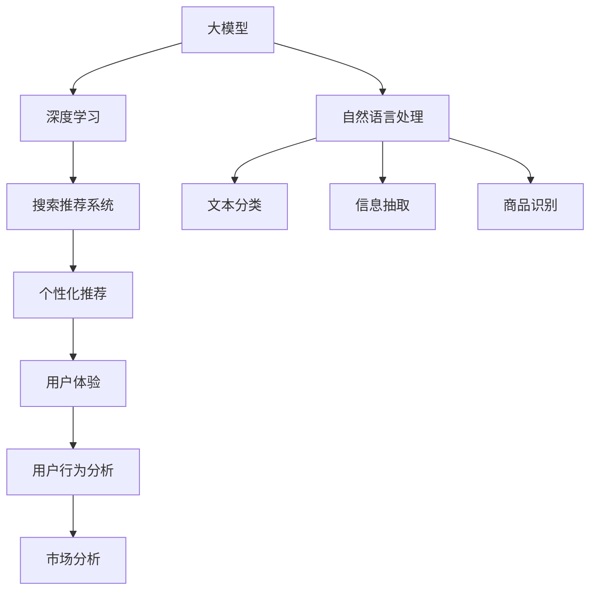

                 

# 电商平台的AI 大模型战略：搜索推荐系统是核心，用户体验优化与数据质量

> 关键词：人工智能,大模型,电商平台,搜索推荐系统,用户体验,数据质量,深度学习,自然语言处理,推荐算法,图像识别,市场分析

## 1. 背景介绍

随着互联网电商的迅猛发展，用户对购物体验的期望不断提升。平台需要在海量商品中高效匹配用户需求，同时为用户提供个性化、精准化的推荐服务。面对这一挑战，大模型技术成为电商平台的利器。通过使用深度学习和大规模预训练模型，电商平台能够构建智能搜索推荐系统，提升用户满意度，同时提高运营效率。本文将介绍大模型在电商平台中的战略部署，重点探讨搜索推荐系统的实现与优化。

## 2. 核心概念与联系

### 2.1 核心概念概述

- **大模型**：指的是采用深度学习技术，基于大规模数据预训练得到的语言模型或视觉模型，如BERT、GPT、ViT等。这些模型能够自动学习到丰富的语言或图像知识，具备强大的表征能力和推理能力。

- **搜索推荐系统**：基于用户的查询或行为数据，智能匹配商品，并提供个性化推荐的技术系统。它通过分析用户的历史行为、兴趣和即时搜索意图，实时生成商品列表，提升用户体验和转化率。

- **用户体验(UX)**：指用户与电商平台互动时的整体感受。通过智能搜索推荐系统，平台能够快速响应用户需求，减少搜索时间，提供个性化推荐，从而提升用户满意度。

- **数据质量**：数据质量直接影响到搜索推荐系统的性能。高质量的数据需要确保数据多样性、准确性和及时性，以避免模型偏差和误导性。

- **深度学习(Deep Learning)**：一种基于神经网络的机器学习技术，能够处理大规模复杂数据，适用于构建智能搜索推荐系统。

- **自然语言处理(NLP)**：专注于让计算机理解和处理人类语言的技术，包括语言模型、文本分类、信息抽取等任务。

- **推荐算法(Recommendation Algorithms)**：包括协同过滤、内容过滤、基于规则等方法，用于生成个性化的商品推荐。

- **图像识别(Image Recognition)**：使用深度学习模型处理图像数据，用于识别商品特征，如颜色、形状、品牌等。

- **市场分析(Market Analysis)**：通过分析用户行为和市场趋势，预测商品需求和用户偏好，优化搜索推荐策略。

这些概念之间存在紧密联系。大模型通过深度学习技术，可以构建智能搜索推荐系统，处理用户输入的自然语言或图像信息，并基于推荐算法提供个性化推荐。用户体验优化和数据质量是搜索推荐系统成功的关键因素，需要通过持续的数据分析和模型优化来实现。

### 2.2 核心概念原理和架构的 Mermaid 流程图



此流程图展示了核心概念之间的联系和数据流向。大模型通过深度学习技术，能够处理自然语言和图像信息，并通过搜索推荐系统提供个性化推荐。用户体验、用户行为分析和市场分析能够进一步优化推荐策略和系统性能。

## 3. 核心算法原理 & 具体操作步骤

### 3.1 算法原理概述

基于大模型的搜索推荐系统，通常采用监督学习和迁移学习的思想。通过在用户行为数据上进行有监督学习，模型能够学习到用户的兴趣和行为模式，并进行个性化推荐。同时，由于大模型已经在大规模无标签数据上进行了预训练，具备丰富的通用语言和图像知识，因此在微调过程中可以迁移到特定领域，提升推荐效果。

### 3.2 算法步骤详解

1. **数据准备**：收集用户的历史行为数据，如浏览、点击、购买记录等，同时获取商品的元数据，如标题、描述、价格、评分等。

2. **数据预处理**：对数据进行清洗、去重、归一化等预处理，确保数据质量。

3. **模型选择**：选择合适的预训练模型，如BERT、GPT、ViT等，作为初始化参数。

4. **微调模型**：在用户行为数据上进行微调，学习用户的兴趣和行为模式，并生成个性化推荐。

5. **推荐策略优化**：根据推荐效果，调整推荐算法参数，优化推荐策略，提高用户体验。

6. **部署与监控**：将微调后的模型部署到线上系统，实时响应用户请求，并通过监控系统追踪模型性能。

### 3.3 算法优缺点

**优点**：
- 利用大模型的预训练知识，提升推荐准确性和效率。
- 能够处理复杂的用户行为和商品特征，提供个性化推荐。
- 数据驱动，能够实时响应市场变化和用户需求。

**缺点**：
- 对数据质量要求高，数据偏差可能导致模型偏见。
- 模型复杂，需要大量的计算资源和存储资源。
- 模型训练和部署周期长，需要持续迭代优化。

### 3.4 算法应用领域

搜索推荐系统在电商平台中的应用非常广泛，涵盖以下领域：

- **个性化推荐**：根据用户的历史行为和即时搜索，提供个性化商品推荐。
- **智能搜索**：通过自然语言处理技术，理解用户查询意图，快速返回相关商品。
- **实时广告投放**：基于用户行为数据，实时推送个性化广告，提升转化率。
- **库存管理**：通过分析用户需求和销售趋势，优化库存结构，提高库存周转率。
- **市场分析**：通过用户行为数据和市场趋势，预测商品需求和用户偏好。

## 4. 数学模型和公式 & 详细讲解 & 举例说明

### 4.1 数学模型构建

基于大模型的推荐系统，通常采用深度学习模型，如Bert、GPT等。推荐模型的输入为用户的查询或行为数据，输出为商品的推荐列表。模型的目标是最大化用户满意度，即推荐与用户兴趣最匹配的商品。

### 4.2 公式推导过程

假设推荐模型为 $M_{\theta}$，输入为用户的查询或行为数据 $x$，输出为商品的推荐列表 $y$。则推荐模型的目标函数为：

$$
\max_{\theta} \sum_{i=1}^N (y_i \log M_{\theta}(x_i)) - \lambda \sum_{i=1}^N ||\nabla M_{\theta}(x_i)||^2
$$

其中，$y_i$ 表示商品 $i$ 是否被推荐，$\lambda$ 为正则化系数，$\nabla M_{\theta}(x_i)$ 为模型对输入 $x_i$ 的梯度。

### 4.3 案例分析与讲解

以基于BERT的推荐模型为例，其推荐过程可以分为以下几个步骤：

1. **输入编码**：使用BERT将用户的查询或行为数据编码为向量表示。

2. **商品表示**：同样使用BERT将商品元数据编码为向量表示。

3. **相似度计算**：计算用户查询向量与商品向量之间的相似度，生成推荐列表。

4. **排名优化**：使用排序算法（如TopK排序）对推荐列表进行排序，提升推荐效果。

## 5. 项目实践：代码实例和详细解释说明

### 5.1 开发环境搭建

在Python环境中，推荐系统可以使用PyTorch或TensorFlow等深度学习框架实现。以下是使用PyTorch的示例：

```python
import torch
import torch.nn as nn
import torch.optim as optim
from torch.utils.data import DataLoader
```

### 5.2 源代码详细实现

```python
class RecommendationModel(nn.Module):
    def __init__(self, emb_dim, hidden_dim):
        super(RecommendationModel, self).__init__()
        self.encoder = nn.Embedding(1000, emb_dim)  # 商品嵌入层
        self.linear1 = nn.Linear(emb_dim, hidden_dim)
        self.linear2 = nn.Linear(hidden_dim, 1)
    
    def forward(self, x):
        x = self.encoder(x)
        x = torch.relu(self.linear1(x))
        x = torch.sigmoid(self.linear2(x))
        return x

# 定义模型
model = RecommendationModel(128, 64)
model = model.to(device)

# 定义优化器和损失函数
optimizer = optim.Adam(model.parameters(), lr=0.001)
criterion = nn.BCELoss()

# 训练过程
for epoch in range(10):
    for batch in train_loader:
        optimizer.zero_grad()
        y_pred = model(batch.x)
        loss = criterion(y_pred, batch.y)
        loss.backward()
        optimizer.step()

    print('Epoch [{}/{}], Loss: {:.4f}'.format(epoch+1, epochs, loss.item()))

# 测试过程
for batch in test_loader:
    y_pred = model(batch.x)
    y_prob = torch.sigmoid(y_pred)
    y_prob = y_prob.round()
```

### 5.3 代码解读与分析

**RecommendationModel**类：
- `__init__`方法：初始化模型参数，包括商品嵌入层、线性层等。
- `forward`方法：定义前向传播过程，将用户输入编码，并通过多层线性层生成推荐分数。

**训练过程**：
- 在每个epoch内，对训练集进行迭代，计算损失函数并更新模型参数。
- 使用Adam优化器进行梯度下降。

**测试过程**：
- 对测试集进行前向传播，计算预测概率，并通过阈值决定推荐或不推荐。

## 6. 实际应用场景

### 6.1 个性化推荐

个性化推荐是推荐系统的核心功能。通过分析用户的历史行为和即时搜索，推荐系统能够提供精准的商品推荐，提升用户体验和转化率。例如，电商平台可以根据用户浏览记录，推荐可能感兴趣的商品。

### 6.2 智能搜索

智能搜索系统能够理解自然语言查询，快速返回相关商品。用户可以通过简单搜索语句，找到所需商品，提升搜索效率。例如，用户输入“红色运动鞋”，推荐系统会返回所有红色运动鞋的相关商品。

### 6.3 实时广告投放

基于用户行为数据，推荐系统可以实时推送个性化广告，提升广告投放效果。例如，针对用户的搜索记录，投放相关商品广告，吸引用户点击。

### 6.4 未来应用展望

未来，电商平台将进一步利用大模型技术，提升搜索推荐系统的性能和效果。以下是一些可能的发展趋势：

1. **多模态推荐**：结合图像、视频等多模态信息，提升推荐效果。例如，基于商品图片和用户偏好，推荐相关商品。

2. **跨领域推荐**：将推荐系统扩展到更多领域，如金融、医疗等，提供综合性的推荐服务。

3. **联邦学习**：通过分布式训练，提高数据隐私保护和推荐效果。例如，多平台联合训练推荐模型，提升模型泛化能力。

4. **持续学习**：实时更新推荐模型，持续优化推荐效果。例如，通过在线学习算法，不断调整模型参数。

## 7. 工具和资源推荐

### 7.1 学习资源推荐

- **《深度学习与推荐系统》**：深入介绍推荐系统原理和实践，涵盖协同过滤、内容过滤等方法。
- **Coursera《深度学习专项课程》**：由斯坦福大学开设，涵盖深度学习基础和推荐系统等内容。
- **Kaggle推荐系统竞赛**：通过参与实际竞赛，提升推荐系统设计和优化能力。

### 7.2 开发工具推荐

- **PyTorch**：深度学习框架，支持自然语言处理和推荐系统开发。
- **TensorFlow**：Google开发的深度学习框架，支持分布式训练和多模态数据处理。
- **Hugging Face Transformers**：提供预训练语言模型和工具库，支持自然语言处理任务。
- **Scikit-learn**：机器学习库，支持推荐算法和数据处理。

### 7.3 相关论文推荐

- **"Learning Deep Structured Models for Recommender Systems"**：介绍深度学习在推荐系统中的应用。
- **"Attention Is All You Need"**：提出Transformer结构，广泛应用于推荐系统。
- **"Advances in Personalized Recommendation"**：综述推荐系统的前沿进展。

## 8. 总结：未来发展趋势与挑战

### 8.1 研究成果总结

本文介绍了基于大模型的电商平台搜索推荐系统。通过深度学习和自然语言处理技术，平台能够提供个性化推荐和智能搜索服务，提升用户体验和转化率。未来，大模型技术将进一步扩展到多模态推荐、跨领域推荐等领域，带来更多创新应用。

### 8.2 未来发展趋势

1. **多模态推荐**：结合图像、视频等多模态信息，提升推荐效果。
2. **跨领域推荐**：将推荐系统扩展到更多领域，如金融、医疗等。
3. **联邦学习**：通过分布式训练，提高数据隐私保护和推荐效果。
4. **持续学习**：实时更新推荐模型，持续优化推荐效果。

### 8.3 面临的挑战

1. **数据质量**：高质量数据需要确保数据多样性、准确性和及时性，避免模型偏差。
2. **模型复杂度**：大模型结构复杂，需要大量计算资源和存储资源。
3. **用户隐私**：推荐系统需要保护用户隐私，避免数据泄露。
4. **模型泛化**：模型在特定领域的泛化能力需要进一步提升。

### 8.4 研究展望

1. **数据增强**：通过数据增强技术，提升数据多样性和丰富度。
2. **模型压缩**：通过模型压缩技术，降低模型复杂度，提升推理效率。
3. **隐私保护**：通过差分隐私等技术，保护用户隐私，避免数据泄露。
4. **多领域融合**：将推荐系统与其他技术结合，实现跨领域协同。

## 9. 附录：常见问题与解答

**Q1: 推荐系统的核心是什么？**

A: 推荐系统的核心是通过分析用户的历史行为和即时搜索，生成个性化推荐列表。通常包括协同过滤、内容过滤、基于规则等方法，用于生成个性化的商品推荐。

**Q2: 大模型在推荐系统中的作用是什么？**

A: 大模型通过深度学习技术，可以处理大规模复杂数据，提升推荐准确性和效率。大模型能够理解自然语言和图像信息，并基于推荐算法提供个性化推荐。

**Q3: 推荐系统的数据质量如何影响性能？**

A: 数据质量直接影响推荐系统的性能。高质量数据需要确保数据多样性、准确性和及时性，以避免模型偏差和误导性。

**Q4: 推荐系统的训练和部署需要注意哪些问题？**

A: 推荐系统的训练和部署需要注意以下问题：
1. 数据增强：通过数据增强技术，提升数据多样性和丰富度。
2. 模型压缩：通过模型压缩技术，降低模型复杂度，提升推理效率。
3. 隐私保护：通过差分隐私等技术，保护用户隐私，避免数据泄露。
4. 多领域融合：将推荐系统与其他技术结合，实现跨领域协同。

**Q5: 推荐系统在电商平台的实际应用有哪些？**

A: 推荐系统在电商平台中的实际应用包括：
1. 个性化推荐：根据用户的历史行为和即时搜索，提供个性化商品推荐。
2. 智能搜索：通过自然语言处理技术，理解用户查询意图，快速返回相关商品。
3. 实时广告投放：基于用户行为数据，实时推送个性化广告，提升转化率。
4. 库存管理：通过分析用户需求和销售趋势，优化库存结构，提高库存周转率。
5. 市场分析：通过用户行为数据和市场趋势，预测商品需求和用户偏好。

---

作者：禅与计算机程序设计艺术 / Zen and the Art of Computer Programming

