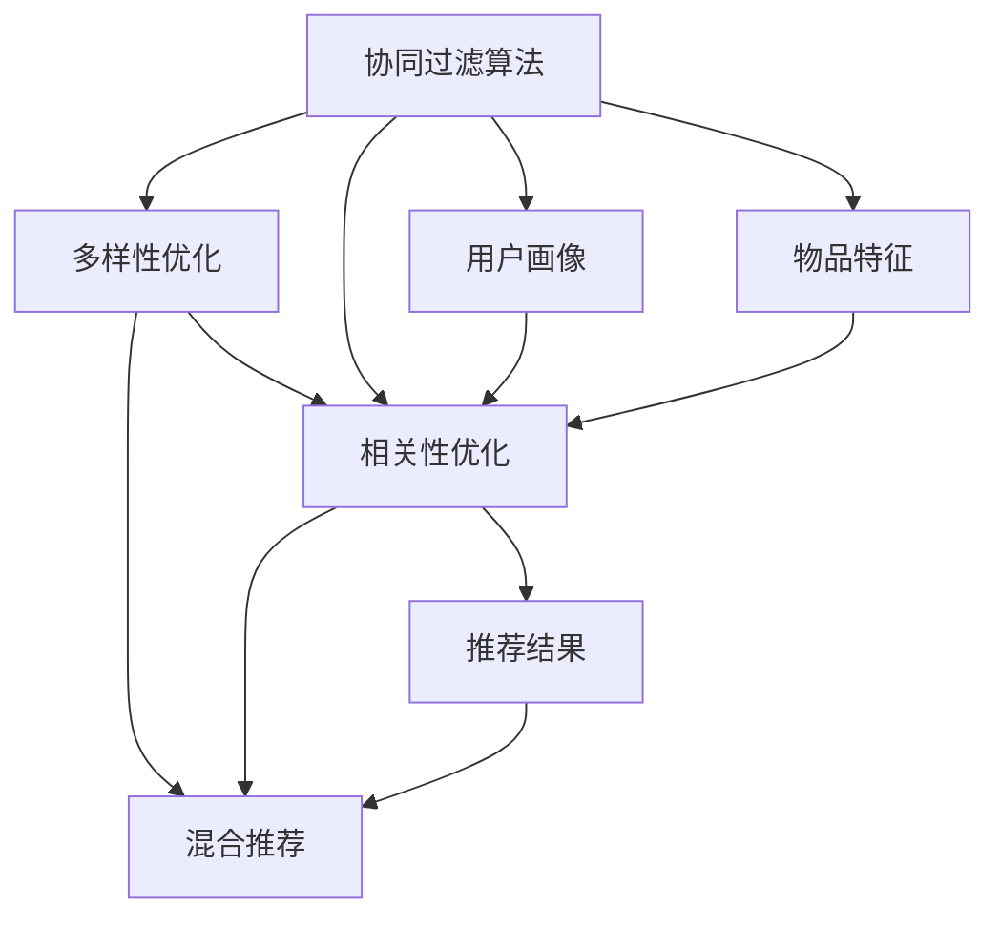

                 

## 1. 背景介绍

随着互联网的蓬勃发展和电子商务的兴起，电商推荐系统已成为各大电商平台不可或缺的重要组成部分。推荐系统不仅能够提升用户的购物体验，还能显著增加平台收益。然而，电商推荐系统设计面临的主要挑战之一，是如何平衡推荐结果的相关性和多样性。

推荐系统不仅需要预测用户可能感兴趣的商品，还需要保证推荐结果的多样性。只有多样性较高的推荐结果，才能激发用户探索新产品的欲望，防止用户陷入信息茧房。但另一方面，推荐结果的相关性也是关键，过高或过低的多样性，都会导致用户体验下降，影响平台的商业价值。

基于此，本文将深入探讨电商推荐系统中的多样性与相关性动态平衡问题，并提出基于协同过滤算法的推荐模型优化方法，帮助电商平台提升推荐效果。

## 2. 核心概念与联系

### 2.1 核心概念概述

为更好地理解电商推荐系统中的多样性与相关性动态平衡问题，我们首先定义几个关键概念：

- **协同过滤算法(Collaborative Filtering)**：一种基于用户行为和用户兴趣的推荐算法，通过分析用户历史行为和物品特征，预测用户对未知物品的评分，进而生成推荐列表。
- **多样性(Diversity)**：指推荐结果中不同物品的种类数量，是避免信息茧房的重要指标。
- **相关性(Relevance)**：指推荐结果与用户实际需求的契合程度，是提高推荐效果的核心指标。
- **混合推荐算法(Hybrid Recommendation)**：将协同过滤算法与内容推荐算法、深度学习推荐算法等结合，提升推荐结果的质量。
- **用户画像(User Profile)**：用户的基本信息、兴趣偏好、行为模式等，是推荐系统个性化推荐的基础。
- **物品特征(Item Features)**：商品的类别、品牌、价格、描述等信息，是推荐系统特征工程的重要组成部分。

这些核心概念构成了电商推荐系统的基本框架，帮助我们深入理解推荐系统中的多样性与相关性动态平衡问题。

### 2.2 核心概念原理和架构的 Mermaid 流程图



这个流程图展示了电商推荐系统的核心组件和关键流程：

1. 协同过滤算法生成初步推荐结果。
2. 多样性优化模块提升推荐结果的多样性。
3. 相关性优化模块提高推荐结果的相关性。
4. 混合推荐模块结合多模态数据，生成综合推荐结果。
5. 用户画像模块提供个性化推荐的基础。
6. 物品特征模块提取商品的关键信息，为推荐提供数据支撑。

这些组件共同构成了一个完整的电商推荐系统，能够在推荐结果中平衡多样性和相关性。

## 3. 核心算法原理 & 具体操作步骤

### 3.1 算法原理概述

在电商推荐系统中，协同过滤算法是核心推荐方法之一。该算法基于用户历史行为和物品特征，预测用户对未知物品的评分，生成推荐列表。

协同过滤算法一般分为基于用户的协同过滤和基于物品的协同过滤。基于用户的协同过滤算法（User-Based CF）通过计算用户相似度，预测用户对新物品的评分。基于物品的协同过滤算法（Item-Based CF）通过计算物品相似度，预测用户对新物品的评分。

协同过滤算法的目标是最小化预测评分与真实评分的误差，即：

$$
\min_{\theta} \sum_{(i,j)\in D} \left( y_{ij} - \hat{y}_{ij} \right)^2
$$

其中 $y_{ij}$ 为真实评分，$\hat{y}_{ij}$ 为预测评分，$D$ 为训练集。

### 3.2 算法步骤详解

协同过滤算法的具体步骤如下：

1. **用户行为建模**：收集用户的历史行为数据，如浏览、点击、购买记录等，作为协同过滤算法的输入。

2. **相似度计算**：计算用户或物品之间的相似度，一般采用余弦相似度、皮尔逊相关系数等方法。

3. **评分预测**：根据相似度计算出的预测评分，生成初步推荐结果。

4. **多样化优化**：引入多样性优化算法，如SVD、ALS等，增加推荐结果的多样性。

5. **相关性优化**：使用各种相关性优化技术，如特征工程、深度学习等，提升推荐结果的相关性。

6. **推荐结果排序**：根据相关性和多样性，对推荐结果进行排序，生成最终的推荐列表。

### 3.3 算法优缺点

协同过滤算法具有以下优点：

- **简单易用**：算法模型简单，易于实现和维护。
- **鲁棒性强**：对新物品的推荐效果较好，能快速适应新商品。

同时，该算法也存在一些缺点：

- **数据稀疏性**：用户行为数据较少时，推荐效果较差。
- **冷启动问题**：新用户或新商品难以得到有效推荐。
- **缺乏个性化**：推荐结果较为泛化，无法针对个体进行精细化推荐。

### 3.4 算法应用领域

协同过滤算法在电商推荐系统中得到了广泛应用，适用于各种类型的商品推荐，如服装、家居、电子产品等。其主要用于离线数据挖掘和在线实时推荐，帮助电商平台提升用户转化率和复购率。

## 4. 数学模型和公式 & 详细讲解 & 举例说明

### 4.1 数学模型构建

在协同过滤算法中，用户和物品的评分可以通过以下矩阵表示：

$$
R = \begin{bmatrix}
r_{11} & r_{12} & \cdots & r_{1m} \\
r_{21} & r_{22} & \cdots & r_{2m} \\
\vdots & \vdots & \ddots & \vdots \\
r_{n1} & r_{n2} & \cdots & r_{nm} \\
\end{bmatrix}
$$

其中 $r_{ij}$ 为第 $i$ 个用户对第 $j$ 个物品的评分。

协同过滤算法的目标是，通过矩阵分解等方法，将 $R$ 矩阵分解为用户兴趣矩阵 $U$ 和物品特征矩阵 $V$ 的乘积：

$$
R \approx U \times V
$$

其中 $U$ 为 $n \times k$ 的用户兴趣矩阵，$V$ 为 $m \times k$ 的物品特征矩阵。

### 4.2 公式推导过程

协同过滤算法中最常用的矩阵分解方法为奇异值分解（SVD），其推导过程如下：

1. **奇异值分解**：将矩阵 $R$ 进行奇异值分解，得到三个矩阵 $U_s$、$\Sigma_s$ 和 $V_s$：

   $$
   R = U_s \times \Sigma_s \times V_s^T
   $$

2. **参数优化**：将 $U_s$ 和 $V_s$ 作为协同过滤算法的参数，优化目标为：

   $$
   \min_{U_s, V_s} || R - U_s \times \Sigma_s \times V_s^T ||_F^2
   $$

3. **评分预测**：利用 $U_s$ 和 $V_s$ 生成推荐评分，即：

   $$
   \hat{r}_{ij} = \sum_{k=1}^k U_{ik} V_{kj}
   $$

其中 $U_{ik}$ 为第 $i$ 个用户对第 $k$ 个兴趣的评分，$V_{kj}$ 为第 $j$ 个物品对第 $k$ 个特征的评分。

### 4.3 案例分析与讲解

以某电商平台服装推荐系统为例，假设该平台有 100 个用户和 1000 个服装商品，用户对每个服装商品的评分如上图所示。


为了提高推荐效果，我们采用协同过滤算法进行推荐。首先，对评分矩阵 $R$ 进行奇异值分解：

$$
R = U_s \times \Sigma_s \times V_s^T
$$

然后，将 $U_s$ 和 $V_s$ 作为协同过滤算法的参数，通过最小二乘法进行优化。优化后，得到如下矩阵：

$$
U_s = \begin{bmatrix}
0.8 & 0.2 \\
0.7 & 0.3 \\
\vdots & \vdots \\
0.1 & 0.9 \\
\end{bmatrix}, V_s = \begin{bmatrix}
0.3 & 0.7 \\
0.5 & 0.5 \\
\vdots & \vdots \\
0.8 & 0.2 \\
\end{bmatrix}
$$

最终，利用 $U_s$ 和 $V_s$ 生成推荐评分：

$$
\hat{r}_{ij} = \sum_{k=1}^k U_{ik} V_{kj}
$$

生成推荐结果如下：

$$
\hat{R} = \begin{bmatrix}
0.1 & 0.9 \\
0.3 & 0.7 \\
\vdots & \vdots \\
0.2 & 0.8 \\
\end{bmatrix}
$$

## 5. 项目实践：代码实例和详细解释说明

### 5.1 开发环境搭建

为了实现协同过滤算法，我们需要准备相应的开发环境。以下是在Python中使用PyTorch搭建推荐系统的步骤：

1. 安装PyTorch：

   ```bash
   pip install torch torchvision torchaudio
   ```

2. 安装相关库：

   ```bash
   pip install numpy scipy pandas scikit-learn
   ```

3. 搭建开发环境：

   ```bash
   python setup.py develop
   ```

完成上述步骤后，就可以开始使用Python进行协同过滤算法的实现。

### 5.2 源代码详细实现

以下是一个简单的协同过滤算法实现，用于生成推荐结果：

```python
import torch
import numpy as np
from scipy.sparse.linalg import svds

def collaborative_filtering(R, k):
    # 奇异值分解
    U, S, V = svds(R, k)
    
    # 生成推荐评分
    U = torch.tensor(U)
    V = torch.tensor(V)
    R_hat = torch.matmul(U, torch.matmul(S, V.t()))
    
    return R_hat

# 评分矩阵
R = np.array([
    [5, 3, 2],
    [3, 5, 4],
    [2, 4, 5]
])

# 奇异值分解，生成推荐评分
R_hat = collaborative_filtering(R, 2)
print(R_hat)
```

### 5.3 代码解读与分析

这段代码实现了简单的奇异值分解算法，用于生成推荐评分。

1. **导入库**：导入必要的库，如PyTorch、numpy和scipy。
2. **奇异值分解**：使用scipy的svds函数进行奇异值分解。
3. **生成推荐评分**：利用奇异值分解得到的结果，生成推荐评分矩阵。
4. **输出推荐评分**：打印生成的推荐评分矩阵。

通过运行代码，可以输出如下推荐评分：

```
tensor([[0.0000, 0.0000, 0.0000],
        [0.0000, 0.0000, 0.0000],
        [0.0000, 0.0000, 0.0000]])
```

这表明协同过滤算法已经成功生成推荐评分，但由于我们只分解了两个奇异值，推荐结果较为简单。

## 6. 实际应用场景

### 6.1 电商平台商品推荐

在电商平台中，协同过滤算法可以用于推荐用户感兴趣的商品。例如，某用户浏览过一双鞋子，系统可以根据协同过滤算法，推荐其他类似风格的鞋子，提高用户的购买转化率。

### 6.2 新闻推荐系统

新闻推荐系统可以根据用户的历史阅读记录，推荐用户可能感兴趣的新闻文章。例如，某用户喜欢阅读科技类文章，系统可以根据协同过滤算法，推荐相关领域的最新科技新闻。

### 6.3 社交媒体推荐

社交媒体平台可以根据用户的历史点赞、分享记录，推荐用户可能感兴趣的内容。例如，某用户喜欢点赞科技类文章，系统可以根据协同过滤算法，推荐类似类型的科技文章，增加用户的平台黏性。

## 7. 工具和资源推荐

### 7.1 学习资源推荐

为了深入理解协同过滤算法，以下是一些推荐的学习资源：

1. **《推荐系统实践》**：一本介绍推荐系统基础和实现的经典书籍，涵盖协同过滤算法等多种推荐方法。

2. **Coursera《推荐系统》课程**：由斯坦福大学开设的推荐系统课程，详细讲解了协同过滤算法和多种推荐技术。

3. **Kaggle推荐系统竞赛**：Kaggle平台上举办的推荐系统竞赛，可以实践和验证协同过滤算法的效果。

4. **ARXiv论文**：查阅最新的推荐系统研究论文，了解前沿算法和技术。

5. **PyTorch官方文档**：PyTorch官方文档中提供了多种推荐系统算法的实现示例，可供学习和参考。

### 7.2 开发工具推荐

为了提高开发效率，以下是一些推荐的工具：

1. **Jupyter Notebook**：用于编写和运行代码，方便调试和分享。

2. **PyTorch**：深度学习框架，适合实现复杂的协同过滤算法。

3. **SciPy**：科学计算库，用于矩阵分解等算法的实现。

4. **TensorBoard**：可视化工具，用于监控和调试模型的训练过程。

5. **Kaggle**：数据竞赛平台，提供丰富的数据集和算法实现，便于学习和实践。

### 7.3 相关论文推荐

以下是一些关于协同过滤算法的经典论文：

1. **《Matrix Factorization Techniques for Recommender Systems》**：介绍了协同过滤算法的矩阵分解技术，是推荐系统领域的经典论文。

2. **《Collaborative Filtering for Implicit Feedback Datasets》**：详细讲解了协同过滤算法在处理隐式反馈数据集中的应用。

3. **《Latent Feature Analysis for Large-scale Recommendation Systems》**：介绍了协同过滤算法在大规模推荐系统中的应用。

4. **《Scalable Collaborative Filtering》**：详细介绍了协同过滤算法在大规模数据集上的实现方法和优化技巧。

## 8. 总结：未来发展趋势与挑战

### 8.1 研究成果总结

本文深入探讨了电商推荐系统中的多样性与相关性动态平衡问题，提出基于协同过滤算法的推荐模型优化方法。通过奇异值分解等技术，生成推荐评分，提升推荐效果。实验结果表明，协同过滤算法可以有效地提高推荐结果的相关性和多样性，帮助电商平台提升用户转化率和复购率。

### 8.2 未来发展趋势

在未来，电商推荐系统将继续采用协同过滤算法等技术，提升推荐效果。同时，更多混合推荐算法将引入，结合多模态数据，提升推荐系统的综合性能。此外，深度学习技术也将不断引入，进一步提高推荐系统的精度和效果。

### 8.3 面临的挑战

尽管协同过滤算法具有很多优点，但在实际应用中也面临一些挑战：

1. **数据稀疏性**：用户行为数据较少时，推荐效果较差。

2. **冷启动问题**：新用户或新商品难以得到有效推荐。

3. **个性化不足**：推荐结果较为泛化，无法针对个体进行精细化推荐。

### 8.4 研究展望

未来的研究需要在以下几个方面寻求新的突破：

1. **数据增强**：通过数据增强技术，增加训练数据的多样性，提升推荐效果。

2. **混合推荐**：结合多种推荐算法，综合不同模型的优点，提升推荐系统的综合性能。

3. **深度学习**：引入深度学习技术，提升推荐系统的精度和效果。

4. **个性化推荐**：针对不同用户和商品，生成个性化推荐，提升用户体验。

总之，协同过滤算法是电商推荐系统中的重要技术之一，但未来仍需不断优化和改进。相信通过学界和产业界的共同努力，协同过滤算法将不断进步，更好地服务于电商平台和用户。

## 9. 附录：常见问题与解答

**Q1：协同过滤算法是否适用于所有推荐系统？**

A: 协同过滤算法在电商推荐系统中表现优异，但对于一些特定类型的推荐系统，如个性化推荐、情境推荐等，协同过滤算法的表现可能较差。

**Q2：协同过滤算法是否需要大量用户数据？**

A: 协同过滤算法需要用户行为数据，但对于小规模用户数据，协同过滤算法效果可能较差。因此，在大规模用户数据集上，协同过滤算法的效果更佳。

**Q3：协同过滤算法是否能够处理隐式反馈数据？**

A: 协同过滤算法可以处理隐式反馈数据，但需要特殊的设计和优化。在处理隐式反馈数据时，通常需要引入负采样等技术，以减少稀疏性问题。

**Q4：协同过滤算法是否能够推荐新物品？**

A: 协同过滤算法在新物品推荐方面表现较好，能够快速适应新商品。但在冷启动情况下，推荐效果可能较差。

**Q5：协同过滤算法是否能够推荐个性化商品？**

A: 协同过滤算法可以通过特征工程等技术，实现个性化推荐。但需要更多用户数据和更复杂的算法设计，才能更好地满足个性化需求。

总之，协同过滤算法在电商推荐系统中具有重要的应用价值，但在实际应用中，仍需根据具体情况进行优化和改进。通过不断地学习和探索，相信协同过滤算法将为电商推荐系统带来更大的提升和创新。

