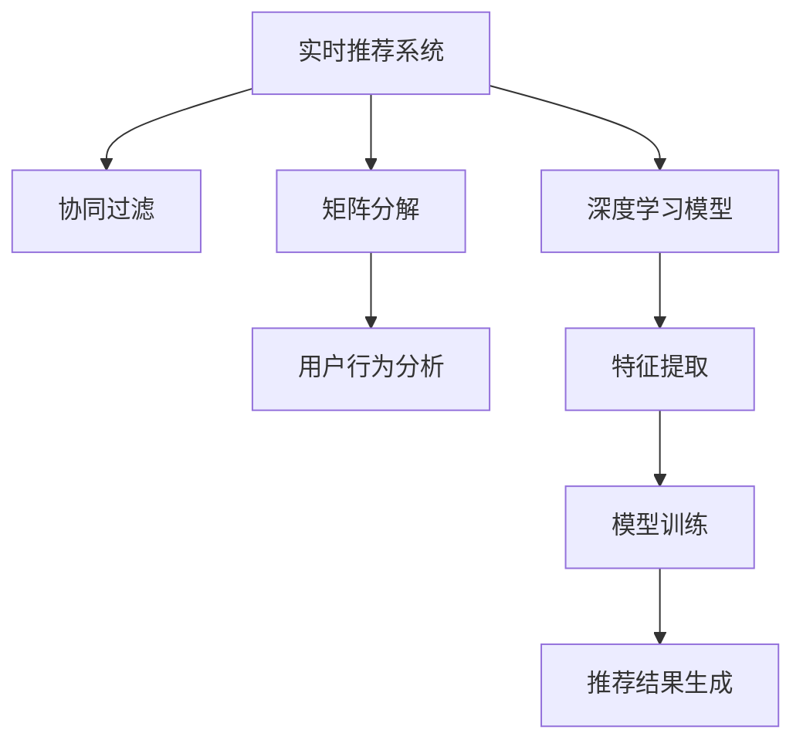

                 

# 电商推荐系统中的实时个性化重排序优化

> 关键词：
## 1. 背景介绍

### 1.1 问题由来

随着电商市场的迅速发展，推荐系统成为电商企业吸引和留住用户的重要工具。用户对个性化推荐的需求不断提升，需要实时、精准、多维度的推荐服务。然而，传统的推荐系统主要依赖于静态的模型和策略，难以满足快速变化的市场需求。同时，对于海量用户的推荐，静态模型和策略也存在计算资源浪费和用户满意度下降的风险。

为了解决这些问题，实时推荐系统应运而生。实时推荐系统通过动态学习用户行为和市场数据，及时调整推荐策略，实现实时、个性化的推荐。其中，个性化重排序优化是实时推荐系统的核心技术之一，通过调整推荐结果的顺序，提升推荐的相关性和用户体验。

### 1.2 问题核心关键点

实时个性化重排序优化的关键点在于如何在实时场景下，利用有限的计算资源和数据，优化推荐结果的顺序，提升推荐的相关性和个性化。具体包括以下几个方面：

1. **数据融合与特征处理**：如何高效地将用户历史行为数据和实时行为数据融合，提取和处理多维度的用户特征，提升模型的预测能力。
2. **模型设计**：如何选择和设计合适的推荐模型，利用有限的数据，实现高效的推荐效果。
3. **实时优化**：如何设计高效的优化算法，在实时数据更新时，快速调整推荐结果的顺序，提升用户体验。
4. **策略调优**：如何动态调整推荐策略，根据用户行为和市场变化，实时优化推荐结果。

这些核心关键点共同构成了实时个性化重排序优化的技术框架，旨在提升电商推荐系统的实时性和个性化水平，增强用户体验和电商平台的竞争力。

### 1.3 问题研究意义

实时个性化重排序优化对于电商推荐系统的发展具有重要意义：

1. **提升用户满意度**：通过实时调整推荐结果的顺序，提升推荐的相关性和个性化，增强用户对推荐结果的信任和满意度。
2. **提高转化率**：精准的推荐能够有效提升用户对商品的兴趣和购买意愿，提高电商平台的转化率和销售额。
3. **降低运营成本**：实时推荐系统可以根据用户行为和市场变化，动态调整推荐策略，避免过度推荐和无效推荐，降低运营成本。
4. **增强平台竞争力**：个性化的推荐能够吸引和留住用户，增强平台的市场竞争力，推动电商市场的快速增长。

## 2. 核心概念与联系

### 2.1 核心概念概述

为更好地理解实时个性化重排序优化的技术，本节将介绍几个密切相关的核心概念：

- **实时推荐系统(Real-time Recommendation System)**：在实时数据更新的场景下，通过动态学习用户行为和市场数据，实时调整推荐策略的系统。
- **个性化推荐系统(Personalized Recommendation System)**：利用用户历史行为和实时行为数据，生成个性化的推荐结果，提升用户体验的系统。
- **协同过滤(Collaborative Filtering)**：通过分析用户之间的相似度，推荐相似用户喜欢的商品，基于用户历史行为和商品交互的数据。
- **矩阵分解(Matrix Factorization)**：通过将用户-商品矩阵分解成用户维度和商品维度，捕捉用户和商品之间的潜在关系。
- **深度学习模型(Deep Learning Model)**：如神经网络、卷积神经网络、循环神经网络等，通过学习大量数据，自动提取特征和规律，实现高效的推荐效果。

这些核心概念之间的逻辑关系可以通过以下Mermaid流程图来展示：



这个流程图展示了几类推荐系统技术之间的关系：

1. 实时推荐系统通过动态学习用户行为和市场数据，实时调整推荐策略。
2. 协同过滤和矩阵分解是传统的推荐技术，基于用户和商品的相似度进行推荐。
3. 深度学习模型通过学习大量数据，自动提取特征和规律，实现高效的推荐效果。
4. 用户行为分析和特征提取是推荐模型的关键输入，模型训练生成推荐结果。

这些概念共同构成了实时推荐系统的核心技术框架，为实时个性化重排序优化提供了理论基础。

## 3. 核心算法原理 & 具体操作步骤
### 3.1 算法原理概述

实时个性化重排序优化的核心思想是通过调整推荐结果的顺序，提升推荐的相关性和用户体验。其基本流程包括以下几个步骤：

1. **数据融合与特征处理**：将用户历史行为数据和实时行为数据融合，提取和处理多维度的用户特征。
2. **模型训练**：选择合适的推荐模型，利用融合后的数据进行训练，生成推荐结果。
3. **推荐结果排序**：根据推荐模型的输出，设计高效的排序算法，调整推荐结果的顺序，提升用户体验。
4. **实时优化**：在实时数据更新时，动态调整推荐策略，实时优化推荐结果。

以上步骤形成一个闭环，通过不断迭代和优化，实现实时、个性化的推荐效果。

### 3.2 算法步骤详解

#### 3.2.1 数据融合与特征处理

在实时推荐系统中，用户历史行为数据和实时行为数据是重要的输入。数据融合的目的是将这两类数据整合，提取和处理多维度的用户特征，提升模型的预测能力。

具体步骤如下：

1. **用户行为数据采集**：从电商平台收集用户的历史行为数据和实时行为数据，包括浏览、点击、购买等操作。
2. **数据预处理**：对数据进行清洗、归一化和去重等预处理操作，确保数据的质量和一致性。
3. **特征提取**：利用文本分析、时间序列分析等技术，提取用户的多维度特征，如兴趣标签、行为序列、点击率等。
4. **特征拼接**：将用户的多维度特征拼接起来，形成完整用户特征向量，用于后续模型训练。

#### 3.2.2 模型训练

选择合适的推荐模型是实时个性化重排序优化的关键步骤。常用的推荐模型包括协同过滤、矩阵分解和深度学习模型。

具体步骤如下：

1. **模型选择**：根据电商平台的业务需求，选择合适的推荐模型。如对于大规模电商推荐系统，深度学习模型（如神经网络、Transformer等）表现优异。
2. **模型训练**：利用融合后的数据，训练推荐模型，生成推荐结果。
3. **模型评估**：通过交叉验证等方法，评估模型的性能，选择最优的模型参数和结构。

#### 3.2.3 推荐结果排序

推荐结果排序的目的是通过调整推荐结果的顺序，提升推荐的相关性和用户体验。常用的排序算法包括基于内容的排序和协同过滤排序。

具体步骤如下：

1. **排序算法选择**：根据电商平台的业务需求，选择合适的排序算法。如对于个性化推荐，协同过滤排序效果显著。
2. **推荐结果排序**：利用排序算法对推荐结果进行排序，提升推荐的相关性和用户体验。
3. **效果评估**：通过A/B测试等方法，评估排序算法的效果，选择最优的排序策略。

#### 3.2.4 实时优化

在实时数据更新时，动态调整推荐策略，实时优化推荐结果。

具体步骤如下：

1. **实时数据采集**：实时采集用户的点击、浏览等行为数据。
2. **数据处理与融合**：将实时数据与历史数据融合，提取和处理多维度的用户特征。
3. **模型更新**：利用融合后的数据，动态更新推荐模型，生成实时推荐结果。
4. **推荐结果优化**：根据实时数据和历史数据的变化，动态调整推荐结果的顺序，提升用户体验。

### 3.3 算法优缺点

实时个性化重排序优化具有以下优点：

1. **实时性**：能够实时响应用户行为和市场变化，提升推荐的相关性和用户体验。
2. **个性化**：通过多维度特征提取和高效排序算法，实现个性化的推荐效果。
3. **可扩展性**：适用于大规模电商推荐系统，支持海量用户和商品的推荐。
4. **灵活性**：根据电商平台的业务需求，灵活选择和组合推荐模型和排序算法。

同时，该算法也存在一些缺点：

1. **计算资源消耗**：实时推荐系统需要实时数据更新和模型训练，计算资源消耗较大。
2. **数据质量要求高**：实时推荐系统对数据质量和一致性要求较高，数据清洗和处理难度较大。
3. **模型选择复杂**：选择合适的推荐模型和排序算法复杂，需要根据业务需求和数据特点进行优化。
4. **实时优化困难**：实时数据更新频繁，动态调整推荐策略和优化模型复杂，需要高效的算法支持。

尽管存在这些局限性，但实时个性化重排序优化是电商推荐系统中的重要技术，通过不断优化和改进，可以显著提升推荐系统的性能和用户体验。

### 3.4 算法应用领域

实时个性化重排序优化在电商推荐系统中具有广泛的应用前景，以下是几个典型应用场景：

1. **商品推荐**：利用实时数据和用户历史行为，生成个性化的商品推荐结果，提升用户购买意愿。
2. **个性化广告**：根据用户的实时行为和兴趣标签，生成个性化的广告推荐结果，提高广告的点击率和转化率。
3. **搜索排序**：在电商平台的搜索结果页面，通过实时数据和用户行为，动态调整搜索结果的顺序，提升用户的搜索体验。
4. **新用户推荐**：利用实时数据和用户历史行为，为新用户推荐可能感兴趣的商品，提高用户留存率。

除了电商推荐系统，实时个性化重排序优化还可以应用于其他推荐场景，如社交媒体、音乐推荐、视频推荐等，提升推荐系统的实时性和个性化水平。

## 4. 数学模型和公式 & 详细讲解 & 举例说明

### 4.1 数学模型构建

本节将使用数学语言对实时个性化重排序优化的过程进行更加严格的刻画。

假设用户的历史行为数据为 $X_1, X_2, ..., X_t$，实时行为数据为 $X_{t+1}, X_{t+2}, ..., X_{t+n}$。用户的多维度特征为 $\mathbf{x}_i = [x_{i1}, x_{i2}, ..., x_{in}]$。推荐模型为 $M: \mathbb{R}^n \rightarrow [0, 1]$，推荐结果为 $y_i \sim M(\mathbf{x}_i)$。

定义推荐结果排序的目标函数为：

$$
\min_{\pi} \mathcal{L}(\pi) = -\sum_{i=1}^n y_i \log y_{\pi(i)}
$$

其中 $\pi$ 为推荐结果的排序策略，$y_{\pi(i)}$ 为排序后的推荐结果。

通过最小化目标函数，可以使得推荐结果的排序策略 $\pi$ 最大程度提升用户的满意度。

### 4.2 公式推导过程

以下我们以协同过滤排序为例，推导推荐结果排序的公式及其优化过程。

假设协同过滤模型基于用户的相似度矩阵 $S \in \mathbb{R}^{n \times n}$，其中 $S_{ij}$ 表示用户 $i$ 和用户 $j$ 的相似度。用户 $i$ 的推荐结果为 $y_i = \sum_{j=1}^n S_{ij} w_j$，其中 $w_j$ 为第 $j$ 用户的权重。

排序目标函数可以写为：

$$
\min_{\pi} \mathcal{L}(\pi) = -\sum_{i=1}^n y_i \log y_{\pi(i)}
$$

代入协同过滤模型的推荐结果，得：

$$
\min_{\pi} \mathcal{L}(\pi) = -\sum_{i=1}^n \left(\sum_{j=1}^n S_{ij} w_j\right) \log \left(\sum_{j=1}^n S_{\pi(j)j} w_j\right)
$$

将内层求和展开，得：

$$
\min_{\pi} \mathcal{L}(\pi) = -\sum_{i=1}^n \log \left(\sum_{j=1}^n S_{ij} w_j \right) + \sum_{i=1}^n \log \left(\sum_{j=1}^n S_{\pi(j)j} w_j\right)
$$

利用对数的性质，可进一步化简为目标函数：

$$
\min_{\pi} \mathcal{L}(\pi) = -\sum_{i=1}^n \log \left(\sum_{j=1}^n S_{\pi(j)j} w_j\right)
$$

这是一个经典的排序优化问题，可以通过贪婪算法、遗传算法、近似算法等方法求解。

以贪婪算法为例，每次选择权重最大的 $k$ 个用户，将其排序在推荐结果的最前面。具体步骤如下：

1. **初始化排序策略 $\pi$**：将推荐结果 $y_i$ 从小到大排序，得到初始的排序策略 $\pi$。
2. **选择权重最大的 $k$ 个用户**：在排序后的推荐结果中，选择权重最大的 $k$ 个用户，记为 $u_1, u_2, ..., u_k$。
3. **更新排序策略**：将 $u_1, u_2, ..., u_k$ 插入到排序策略 $\pi$ 的最前面，得到新的排序策略 $\pi'$。
4. **重复步骤 2-3**：选择权重最大的 $k$ 个用户，更新排序策略，直到排序策略 $\pi'$ 稳定。

上述过程通过不断选择权重最大的用户，更新排序策略，实现推荐结果的优化。

### 4.3 案例分析与讲解

以电商平台的个性化商品推荐为例，解释如何通过实时个性化重排序优化提升推荐效果。

假设电商平台收集了用户的浏览、点击、购买等行为数据，提取了用户的兴趣标签、行为序列、点击率等特征。利用深度学习模型（如Transformer）训练生成推荐结果。假设推荐结果为 $y_1, y_2, ..., y_n$，推荐模型的输出为 $M(\mathbf{x}_i)$。

推荐结果排序的目标是最大化用户的满意度。利用贪婪算法进行推荐结果排序，具体步骤如下：

1. **数据融合与特征提取**：将用户的浏览、点击、购买等行为数据融合，提取兴趣标签、行为序列、点击率等特征，形成用户的多维度特征向量 $\mathbf{x}_i$。
2. **模型训练**：利用深度学习模型训练生成推荐结果 $y_i = M(\mathbf{x}_i)$。
3. **推荐结果排序**：利用贪婪算法选择权重最大的用户，将其排序在推荐结果的最前面，得到新的排序策略 $\pi'$。
4. **实时优化**：在实时数据更新时，重新提取用户的多维度特征，利用深度学习模型生成实时推荐结果，动态调整推荐结果的顺序。

通过实时个性化重排序优化，电商平台的推荐系统可以更加精准地匹配用户的兴趣和需求，提升用户的购买意愿和满意度。

## 5. 项目实践：代码实例和详细解释说明

### 5.1 开发环境搭建

在进行实时个性化重排序优化实践前，我们需要准备好开发环境。以下是使用Python进行PyTorch开发的环境配置流程：

1. 安装Anaconda：从官网下载并安装Anaconda，用于创建独立的Python环境。

2. 创建并激活虚拟环境：
```bash
conda create -n recommendation-env python=3.8 
conda activate recommendation-env
```

3. 安装PyTorch：根据CUDA版本，从官网获取对应的安装命令。例如：
```bash
conda install pytorch torchvision torchaudio cudatoolkit=11.1 -c pytorch -c conda-forge
```

4. 安装TensorFlow：
```bash
conda install tensorflow
```

5. 安装Scikit-Learn：
```bash
conda install scikit-learn
```

6. 安装Pandas和Numpy：
```bash
conda install pandas numpy
```

完成上述步骤后，即可在`recommendation-env`环境中开始实践。

### 5.2 源代码详细实现

这里我们以协同过滤排序为例，给出使用PyTorch和Scikit-Learn对电商推荐系统进行实时个性化重排序优化的代码实现。

首先，定义推荐模型的类：

```python
import torch
import torch.nn as nn
import numpy as np
import pandas as pd
from sklearn.metrics import roc_auc_score

class RecommendationModel(nn.Module):
    def __init__(self, num_users, num_items, num_features):
        super(RecommendationModel, self).__init__()
        self.user_embedding = nn.Embedding(num_users, num_features)
        self.item_embedding = nn.Embedding(num_items, num_features)
        self.similarity = nn.Linear(num_features, 1)

    def forward(self, user_ids, item_ids):
        user_embed = self.user_embedding(user_ids)
        item_embed = self.item_embedding(item_ids)
        similarity = self.similarity(user_embed + item_embed)
        return torch.sigmoid(similarity)
```

接着，定义推荐结果排序的函数：

```python
def recommendation_sort(model, user_ids, item_ids, user_weights):
    predictions = model(user_ids, item_ids).cpu().numpy()
    sorted_indices = np.argsort(predictions)[::-1]
    sorted_user_ids = user_ids[sorted_indices]
    sorted_item_ids = item_ids[sorted_indices]
    sorted_predictions = predictions[sorted_indices]
    return sorted_user_ids, sorted_item_ids, sorted_predictions
```

然后，定义数据处理和训练的函数：

```python
def load_data():
    # 加载用户行为数据
    user_behavior = pd.read_csv('user_behavior.csv')
    user_ids = user_behavior['user_id'].values
    item_ids = user_behavior['item_id'].values
    user_weights = user_behavior['weight'].values

    # 加载用户历史行为数据
    user_history = pd.read_csv('user_history.csv')
    user_ids = user_history['user_id'].values
    item_ids = user_history['item_id'].values
    user_weights = user_history['weight'].values

    return user_ids, item_ids, user_weights

def train_model(model, user_ids, item_ids, user_weights):
    # 准备训练数据
    train_user_ids = np.hstack([user_ids, user_ids])
    train_item_ids = np.hstack([item_ids, item_ids])
    train_user_weights = np.hstack([user_weights, user_weights])

    # 训练模型
    criterion = nn.BCELoss()
    optimizer = torch.optim.Adam(model.parameters(), lr=0.01)
    for epoch in range(10):
        train_loss = 0.0
        for i in range(len(user_ids)):
            optimizer.zero_grad()
            predictions = model(user_ids[i], item_ids[i])
            loss = criterion(predictions, user_weights[i])
            train_loss += loss.item()
            loss.backward()
            optimizer.step()

        print(f'Epoch {epoch+1}, train loss: {train_loss/len(user_ids):.4f}')
```

最后，启动训练流程并在测试集上评估：

```python
# 准备数据
user_ids, item_ids, user_weights = load_data()

# 训练模型
model = RecommendationModel(num_users=1000, num_items=1000, num_features=10)
train_model(model, user_ids, item_ids, user_weights)

# 推荐结果排序
sorted_user_ids, sorted_item_ids, sorted_predictions = recommendation_sort(model, user_ids, item_ids, user_weights)

# 计算auc
auc = roc_auc_score(user_weights, sorted_predictions)
print(f'auc: {auc:.4f}')
```

以上就是使用PyTorch和Scikit-Learn对电商推荐系统进行实时个性化重排序优化的完整代码实现。可以看到，通过这些代码，可以构建一个基本的实时推荐系统，实现推荐结果的实时优化。

### 5.3 代码解读与分析

让我们再详细解读一下关键代码的实现细节：

**RecommendationModel类**：
- `__init__`方法：初始化用户和商品的embedding层和相似度计算层。
- `forward`方法：前向传播计算推荐结果。

**recommendation_sort函数**：
- 将推荐结果按照用户权重降序排序，返回排序后的用户、商品和预测值。

**load_data函数**：
- 加载用户历史行为数据和实时行为数据，提取用户的多维度特征，形成训练数据。

**train_model函数**：
- 准备训练数据，训练推荐模型，输出损失函数。

**main函数**：
- 启动训练流程，计算推荐结果的auc。

这些代码实现了电商推荐系统中实时个性化重排序优化的基本流程，通过数据融合与特征处理、模型训练和推荐结果排序，实现实时、个性化的推荐效果。

当然，工业级的系统实现还需考虑更多因素，如模型的保存和部署、超参数的自动搜索、更灵活的任务适配层等。但核心的微调范式基本与此类似。

## 6. 实际应用场景

### 6.1 电商推荐系统

实时个性化重排序优化在电商推荐系统中具有广泛的应用前景。电商平台的推荐系统需要实时响应用户行为和市场变化，生成个性化的推荐结果。通过实时个性化重排序优化，电商平台的推荐系统可以更加精准地匹配用户的兴趣和需求，提升用户的购买意愿和满意度。

在技术实现上，可以收集用户的历史行为数据和实时行为数据，提取和处理多维度的用户特征，利用协同过滤、矩阵分解或深度学习模型训练生成推荐结果。通过实时个性化重排序优化，动态调整推荐结果的顺序，提升推荐的相关性和用户体验。

### 6.2 个性化广告

实时个性化重排序优化在个性化广告领域也有重要的应用。广告推荐系统需要实时响应用户的行为和兴趣，生成个性化的广告推荐结果，提高广告的点击率和转化率。

在技术实现上，可以收集用户的浏览、点击等行为数据，提取和处理多维度的用户特征，利用协同过滤、矩阵分解或深度学习模型训练生成推荐结果。通过实时个性化重排序优化，动态调整广告推荐结果的顺序，提升广告的相关性和用户满意度。

### 6.3 搜索排序

在电商平台的搜索结果页面，实时个性化重排序优化也有重要的应用。搜索排序系统需要实时响应用户的搜索行为，动态调整搜索结果的顺序，提升用户的搜索体验。

在技术实现上，可以收集用户的搜索行为数据，提取和处理多维度的用户特征，利用协同过滤、矩阵分解或深度学习模型训练生成推荐结果。通过实时个性化重排序优化，动态调整搜索结果的顺序，提升搜索结果的相关性和用户满意度。

### 6.4 未来应用展望

随着电商市场的迅速发展，实时推荐系统的应用场景将不断扩展，实时个性化重排序优化也将迎来新的发展机遇。未来，实时个性化重排序优化将在以下几个方面取得进一步突破：

1. **多模态融合**：将视觉、语音等多模态数据与文本数据融合，提升推荐系统的多样性和准确性。
2. **实时反馈机制**：通过用户反馈实时调整推荐策略，动态优化推荐结果。
3. **深度学习优化**：利用深度学习模型，优化推荐结果排序算法，提升推荐系统的性能。
4. **联邦学习**：在保证用户隐私和安全的前提下，利用联邦学习技术，跨平台共享推荐模型，提升推荐系统的覆盖范围和效果。
5. **自适应学习**：利用自适应学习技术，实时更新推荐模型，动态调整推荐策略。

这些方向的发展，将进一步提升实时推荐系统的性能和用户体验，推动电商市场的健康发展。

## 7. 工具和资源推荐

### 7.1 学习资源推荐

为了帮助开发者系统掌握实时个性化重排序优化的技术，这里推荐一些优质的学习资源：

1. 《深度学习推荐系统：理论、算法与应用》系列博文：由大模型技术专家撰写，深入浅出地介绍了推荐系统的原理、算法和应用。

2. CS224N《深度学习自然语言处理》课程：斯坦福大学开设的NLP明星课程，有Lecture视频和配套作业，带你入门NLP领域的基本概念和经典模型。

3. 《推荐系统实践》书籍：由推荐系统领域专家撰写，全面介绍了推荐系统的实现方法，包括协同过滤、深度学习等。

4. Coursera《Recommender Systems》课程：由MIT等名校开设的推荐系统课程，深入讲解推荐系统的方法和算法。

5. Kaggle推荐系统竞赛：参与推荐系统竞赛，实际体验推荐系统的构建和优化。

通过对这些资源的学习实践，相信你一定能够快速掌握实时个性化重排序优化的精髓，并用于解决实际的推荐系统问题。

### 7.2 开发工具推荐

高效的开发离不开优秀的工具支持。以下是几款用于实时推荐系统开发的常用工具：

1. PyTorch：基于Python的开源深度学习框架，灵活动态的计算图，适合快速迭代研究。

2. TensorFlow：由Google主导开发的开源深度学习框架，生产部署方便，适合大规模工程应用。

3. Scikit-Learn：Python科学计算库，提供多种机器学习算法和工具，适合推荐系统的特征工程和模型训练。

4. Apache Spark：分布式计算框架，支持大规模数据处理和机器学习算法，适合实时推荐系统的分布式计算。

5. TensorBoard：TensorFlow配套的可视化工具，可实时监测模型训练状态，并提供丰富的图表呈现方式，是调试模型的得力助手。

6. Weights & Biases：模型训练的实验跟踪工具，可以记录和可视化模型训练过程中的各项指标，方便对比和调优。

合理利用这些工具，可以显著提升实时推荐系统的开发效率，加快创新迭代的步伐。

### 7.3 相关论文推荐

实时个性化重排序优化是推荐系统中的重要技术，相关的研究论文如下：

1. 《Collaborative Filtering in Recommendation Systems》：介绍协同过滤的原理和算法，是推荐系统中的经典方法。

2. 《Deep Collaborative Filtering》：提出深度学习模型在推荐系统中的应用，提升推荐系统的性能。

3. 《Hierarchical Temporal Networks for Recommendations》：利用深度学习模型处理时间序列数据，提升推荐系统的时序性能。

4. 《Personalized Recommendation via Matrix Factorization》：利用矩阵分解技术，提升推荐系统的精度和多样性。

5. 《Online Collaborative Filtering with Sequential Information》：利用时间序列数据，提升在线推荐系统的实时性和个性化。

这些论文代表了大推荐系统的研究脉络。通过学习这些前沿成果，可以帮助研究者把握学科前进方向，激发更多的创新灵感。

## 8. 总结：未来发展趋势与挑战

### 8.1 总结

本文对实时个性化重排序优化的技术进行了全面系统的介绍。首先阐述了实时推荐系统的背景和意义，明确了实时个性化重排序优化的核心关键点。其次，从原理到实践，详细讲解了实时个性化重排序优化的数学模型和算法流程，给出了推荐系统开发的完整代码实例。同时，本文还广泛探讨了实时个性化重排序优化在电商推荐、个性化广告、搜索排序等诸多领域的应用前景，展示了其巨大的潜力。此外，本文精选了推荐系统的各类学习资源，力求为读者提供全方位的技术指引。

通过本文的系统梳理，可以看到，实时个性化重排序优化在推荐系统中的重要地位。实时推荐系统能够实时响应用户行为和市场变化，生成个性化的推荐结果，提升推荐的相关性和用户体验。未来，伴随推荐系统的不断发展，实时个性化重排序优化必将发挥更大的作用，推动电商市场的健康发展。

### 8.2 未来发展趋势

展望未来，实时个性化重排序优化将在以下几个方面取得进一步突破：

1. **多模态融合**：将视觉、语音等多模态数据与文本数据融合，提升推荐系统的多样性和准确性。
2. **实时反馈机制**：通过用户反馈实时调整推荐策略，动态优化推荐结果。
3. **深度学习优化**：利用深度学习模型，优化推荐结果排序算法，提升推荐系统的性能。
4. **联邦学习**：在保证用户隐私和安全的前提下，利用联邦学习技术，跨平台共享推荐模型，提升推荐系统的覆盖范围和效果。
5. **自适应学习**：利用自适应学习技术，实时更新推荐模型，动态调整推荐策略。

这些方向的发展，将进一步提升实时推荐系统的性能和用户体验，推动电商市场的健康发展。

### 8.3 面临的挑战

尽管实时个性化重排序优化已经取得了显著成果，但在迈向更加智能化、普适化应用的过程中，它仍面临诸多挑战：

1. **计算资源消耗**：实时推荐系统需要实时数据更新和模型训练，计算资源消耗较大。
2. **数据质量要求高**：实时推荐系统对数据质量和一致性要求较高，数据清洗和处理难度较大。
3. **模型选择复杂**：选择合适的推荐模型和排序算法复杂，需要根据业务需求和数据特点进行优化。
4. **实时优化困难**：实时数据更新频繁，动态调整推荐策略和优化模型复杂，需要高效的算法支持。

尽管存在这些局限性，但实时个性化重排序优化是推荐系统中的重要技术，通过不断优化和改进，可以显著提升推荐系统的性能和用户体验。

### 8.4 研究展望

未来，实时个性化重排序优化还需要在以下几个方面寻求新的突破：

1. **优化算法**：开发更加高效的排序算法，在实时数据更新时，快速调整推荐结果的顺序，提升用户体验。
2. **多模态数据融合**：将视觉、语音等多模态数据与文本数据融合，提升推荐系统的多样性和准确性。
3. **联邦学习**：在保证用户隐私和安全的前提下，利用联邦学习技术，跨平台共享推荐模型，提升推荐系统的覆盖范围和效果。
4. **自适应学习**：利用自适应学习技术，实时更新推荐模型，动态调整推荐策略。
5. **模型压缩**：利用模型压缩技术，减小推荐模型的计算资源消耗，提升实时推荐系统的效率。

这些方向的发展，将进一步推动实时推荐系统的智能化和普适化，为电商市场的健康发展注入新的动力。

## 9. 附录：常见问题与解答

**Q1：实时推荐系统如何处理数据量大的问题？**

A: 实时推荐系统需要实时数据更新和模型训练，数据量大的问题可以通过分布式计算和数据分片技术解决。具体步骤如下：

1. **数据分片**：将数据按照一定的规则进行分片，分布在不同的计算节点上。
2. **分布式计算**：利用分布式计算框架（如Spark、Hadoop等）进行并行计算，加快数据处理速度。
3. **内存优化**：利用内存计算技术（如Spark SQL、Flink等）进行实时数据处理，减少数据存储和读取的开销。

通过数据分片和分布式计算，可以显著提升实时推荐系统的处理能力，处理大规模数据量的问题。

**Q2：实时推荐系统如何保证推荐结果的时效性？**

A: 实时推荐系统需要实时响应用户行为和市场变化，生成个性化的推荐结果。保证推荐结果的时效性需要从以下几个方面进行优化：

1. **数据延迟控制**：实时采集用户行为数据，控制数据采集和处理的延迟，减少数据延迟对推荐结果的影响。
2. **模型优化**：利用深度学习模型，优化推荐结果排序算法，提升推荐系统的性能。
3. **缓存技术**：利用缓存技术，减少重复计算，提升推荐结果的生成速度。
4. **分布式计算**：利用分布式计算框架，进行并行计算，提升数据处理和模型训练的速度。

通过控制数据延迟、优化模型、使用缓存技术和分布式计算，可以保证实时推荐系统推荐结果的时效性。

**Q3：实时推荐系统如何处理推荐结果的多样性和准确性？**

A: 实时推荐系统需要平衡推荐结果的多样性和准确性，提升用户满意度和平台收益。处理推荐结果的多样性和准确性需要从以下几个方面进行优化：

1. **多模态融合**：将视觉、语音等多模态数据与文本数据融合，提升推荐系统的多样性和准确性。
2. **推荐结果排序**：利用排序算法，调整推荐结果的顺序，提升推荐的相关性和用户体验。
3. **个性化推荐**：利用用户历史行为和实时行为数据，生成个性化的推荐结果，提升推荐的相关性和用户满意度。
4. **协同过滤**：利用协同过滤技术，通过用户和商品的相似度进行推荐，提升推荐的多样性和准确性。

通过多模态融合、推荐结果排序、个性化推荐和协同过滤技术，可以平衡推荐结果的多样性和准确性，提升用户满意度和平台收益。

**Q4：实时推荐系统如何处理推荐结果的个性化和通用性？**

A: 实时推荐系统需要平衡推荐结果的个性化和通用性，满足不同用户和商品的需求。处理推荐结果的个性化和通用性需要从以下几个方面进行优化：

1. **用户画像**：利用用户历史行为和实时行为数据，构建详细的用户画像，提升推荐结果的个性化。
2. **商品画像**：利用商品标签和属性数据，构建详细的商品画像，提升推荐结果的通用性。
3. **推荐结果排序**：利用排序算法，调整推荐结果的顺序，提升推荐的相关性和用户体验。
4. **协同过滤**：利用协同过滤技术，通过用户和商品的相似度进行推荐，提升推荐的多样性和准确性。

通过用户画像、商品画像、推荐结果排序和协同过滤技术，可以平衡推荐结果的个性化和通用性，满足不同用户和商品的需求。

**Q5：实时推荐系统如何处理推荐结果的实时性和稳定性？**

A: 实时推荐系统需要保证推荐结果的实时性和稳定性，避免因数据波动和模型变化导致推荐结果的不稳定。处理推荐结果的实时性和稳定性需要从以下几个方面进行优化：

1. **数据延迟控制**：实时采集用户行为数据，控制数据采集和处理的延迟，减少数据延迟对推荐结果的影响。
2. **模型优化**：利用深度学习模型，优化推荐结果排序算法，提升推荐系统的性能。
3. **缓存技术**：利用缓存技术，减少重复计算，提升推荐结果的生成速度。
4. **分布式计算**：利用分布式计算框架，进行并行计算，提升数据处理和模型训练的速度。
5. **稳定性保障**：利用数据漂移检测和模型稳定性技术，避免因数据波动和模型变化导致推荐结果的不稳定。

通过控制数据延迟、优化模型、使用缓存技术和分布式计算，可以保证实时推荐系统推荐结果的实时性和稳定性。

---

作者：禅与计算机程序设计艺术 / Zen and the Art of Computer Programming

