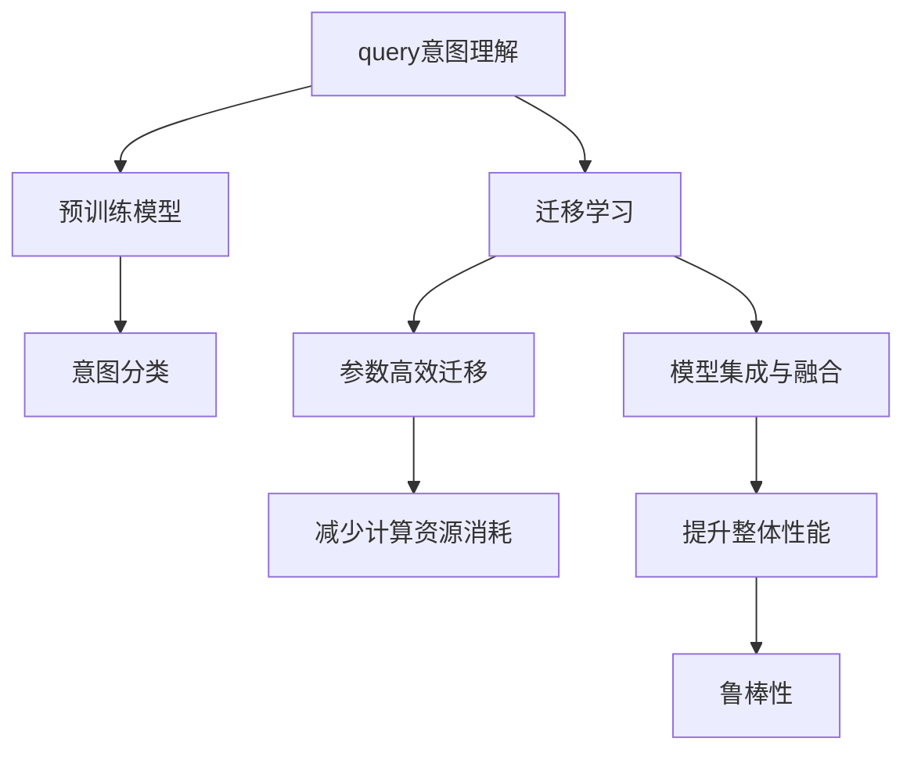

                 

# 电商搜索中的query意图迁移学习技术

## 1. 背景介绍

### 1.1 问题由来

在电子商务领域，用户通过搜索引擎输入query，期望获取最相关的商品信息。然而，当查询意图不明确时，搜索结果常常五花八门，用户体验和业务效果都大打折扣。如何更准确地理解用户query意图，是电商搜索系统亟待解决的关键问题。

目前，电商搜索系统主要依赖监督学习算法，如传统分类算法、最近邻算法等，通过标注数据训练模型。但这种方法对标注数据依赖严重，且难以处理长尾query和复杂的意图分类问题。而基于迁移学习的方法，可以将已有的知识迁移到新任务上，在有限的标注数据下也能取得不错效果。本文将介绍一种基于迁移学习的电商query意图识别技术，旨在帮助电商搜索系统更准确地理解用户query意图。

### 1.2 问题核心关键点

电商query意图识别方法的核心关键点包括：

1. **query意图理解**：识别用户query中隐含的意图，如购买意图、浏览意图、问题咨询等。
2. **意图迁移学习**：将预训练模型中的通用知识迁移到特定的电商query意图分类任务上，提高模型的泛化能力。
3. **参数高效迁移**：仅微调部分关键层，保留大部分预训练权重，以减少计算资源消耗。
4. **模型集成与融合**：通过多模型的集成和融合，提升整体性能和鲁棒性。
5. **用户反馈循环**：将用户反馈集成到模型训练中，不断优化意图识别效果。

### 1.3 问题研究意义

电商搜索中的query意图识别是电商推荐、广告投放、内容展示等多个业务场景的基础，其准确性和效率直接影响到用户体验和电商业务转化率。通过迁移学习技术，可以有效降低监督学习对标注数据的依赖，提升模型泛化能力，特别是在处理长尾query和复杂意图分类问题时具有显著优势。此外，迁移学习技术还可以减少标注成本，加速模型部署，为电商搜索系统的智能化升级提供重要支持。

## 2. 核心概念与联系

### 2.1 核心概念概述

为更好地理解基于迁移学习的电商query意图识别方法，本节将介绍几个密切相关的核心概念：

- **query意图理解**：通过自然语言处理技术，理解用户query中隐含的意图，如购买、浏览、问题咨询等。
- **迁移学习**：将预训练模型中的通用知识迁移到特定任务上，提升模型在特定领域的表现。
- **预训练模型**：在大量无标签数据上进行训练的大模型，如BERT、GPT等，能够提取丰富的语言特征。
- **意图分类**：将用户query的意图分为多个预定义类别，如购买、浏览、咨询、投诉等。
- **参数高效迁移**：仅微调部分关键层，保留大部分预训练权重，以减少计算资源消耗。
- **模型集成与融合**：通过多模型的集成和融合，提升整体性能和鲁棒性。

这些核心概念之间的逻辑关系可以通过以下Mermaid流程图来展示：



这个流程图展示了几者之间的关系：

1. query意图理解是迁移学习的前提。
2. 预训练模型提供通用的语言表示，是迁移学习的核心。
3. 意图分类是迁移学习的具体应用。
4. 参数高效迁移是迁移学习中减少计算资源消耗的重要策略。
5. 模型集成与融合提升整体性能和鲁棒性。

## 3. 核心算法原理 & 具体操作步骤

### 3.1 算法原理概述

基于迁移学习的电商query意图识别方法，利用预训练语言模型作为迁移源，通过微调特定层，使其在电商query意图分类任务上取得理想效果。

假设预训练语言模型为 $M_{\theta}$，其中 $\theta$ 为预训练得到的模型参数。给定电商query意图分类任务 $T$ 的标注数据集 $D=\{(x_i, y_i)\}_{i=1}^N$，意图分类模型的输出为 $y_i$。

定义模型 $M_{\theta}$ 在输入 $x$ 上的输出为 $\hat{y}=M_{\theta}(x)$，则在数据集 $D$ 上的经验风险为：

$$
\mathcal{L}(\theta) = \frac{1}{N} \sum_{i=1}^N \ell(\hat{y}_i, y_i)
$$

其中 $\ell(\hat{y}_i, y_i)$ 为意图分类损失函数，用于衡量模型预测输出与真实标签之间的差异。常见的损失函数包括交叉熵损失、均方误差损失等。

### 3.2 算法步骤详解

基于迁移学习的电商query意图识别方法一般包括以下几个关键步骤：

**Step 1: 准备预训练模型和数据集**
- 选择合适的预训练语言模型 $M_{\theta}$ 作为迁移源，如BERT、GPT等。
- 准备电商query意图分类任务 $T$ 的标注数据集 $D$，划分为训练集、验证集和测试集。一般要求标注数据与预训练数据的分布不要差异过大。

**Step 2: 添加任务适配层**
- 根据任务类型，在预训练模型顶层设计合适的输出层和损失函数。
- 对于意图分类任务，通常在顶层添加线性分类器和交叉熵损失函数。
- 对于多类别分类任务，使用softmax函数将模型输出转化为概率分布，并以交叉熵损失函数进行训练。

**Step 3: 设置迁移超参数**
- 选择合适的优化算法及其参数，如 AdamW、SGD 等，设置学习率、批大小、迭代轮数等。
- 设置正则化技术及强度，包括权重衰减、Dropout、Early Stopping等。
- 确定冻结预训练参数的策略，如仅微调顶层，或全部参数都参与微调。

**Step 4: 执行梯度训练**
- 将训练集数据分批次输入模型，前向传播计算损失函数。
- 反向传播计算参数梯度，根据设定的优化算法和学习率更新模型参数。
- 周期性在验证集上评估模型性能，根据性能指标决定是否触发 Early Stopping。
- 重复上述步骤直到满足预设的迭代轮数或 Early Stopping 条件。

**Step 5: 测试和部署**
- 在测试集上评估迁移后模型 $M_{\hat{\theta}}$ 的性能，对比迁移前后的精度提升。
- 使用迁移后的模型对新查询进行推理预测，集成到实际的应用系统中。
- 持续收集用户反馈，定期重新迁移模型，以适应用户query意图分布的变化。

以上是基于迁移学习的电商query意图识别的一般流程。在实际应用中，还需要针对具体任务的特点，对迁移过程的各个环节进行优化设计，如改进训练目标函数，引入更多的正则化技术，搜索最优的超参数组合等，以进一步提升模型性能。

### 3.3 算法优缺点

基于迁移学习的电商query意图识别方法具有以下优点：

1. 降低标注成本。迁移学习利用已有的大规模语料库和预训练模型，减少了对标注数据的需求。
2. 提升模型泛化能力。迁移学习通过知识迁移，使模型在小规模数据上也能取得不错的效果。
3. 高效利用计算资源。仅微调部分关键层，保留大部分预训练权重，减少了计算资源消耗。
4. 鲁棒性强。多模型集成与融合，增强了模型对异常样本和长尾query的鲁棒性。

同时，该方法也存在一定的局限性：

1. 预训练模型与目标任务分布差距较大时，迁移效果不佳。
2. 微调模型容易出现过拟合，需要合理的正则化策略。
3. 意图分类任务标注数据质量不高时，模型性能受影响。
4. 用户query的复杂性增加，意图分类的难度增大。

尽管存在这些局限性，但就目前而言，基于迁移学习的电商query意图识别方法仍是在有限标注数据下进行快速适配的理想选择。未来相关研究的重点在于如何进一步降低迁移学习对标注数据的依赖，提高模型的少样本学习和跨领域迁移能力，同时兼顾可解释性和伦理安全性等因素。

### 3.4 算法应用领域

基于迁移学习的电商query意图识别方法，在电商搜索系统的多个场景中得到了广泛应用，包括：

- 搜索词意图识别：识别用户查询中的购买、浏览、咨询等意图，提升搜索结果的相关性。
- 广告定向投放：根据用户查询意图，精准投放广告，提高广告点击率。
- 个性化推荐：利用用户查询意图，生成个性化的商品推荐列表。
- 客户服务：识别用户查询中的问题类型，自动分配至相应的客户服务渠道。

除了上述这些经典应用外，电商query意图识别方法也被创新性地应用到更多场景中，如聊天机器人、内容生成、数据分析等，为电商搜索系统的智能化升级提供新的技术路径。随着迁移学习方法的不断进步，相信电商query意图识别技术将在更多领域大放异彩。

## 4. 数学模型和公式 & 详细讲解

### 4.1 数学模型构建

本节将使用数学语言对基于迁移学习的电商query意图识别过程进行更加严格的刻画。

假设预训练语言模型为 $M_{\theta}$，其中 $\theta$ 为预训练得到的模型参数。给定电商query意图分类任务 $T$ 的标注数据集 $D=\{(x_i, y_i)\}_{i=1}^N$，意图分类模型的输出为 $y_i$。

定义模型 $M_{\theta}$ 在输入 $x$ 上的输出为 $\hat{y}=M_{\theta}(x)$，则在数据集 $D$ 上的经验风险为：

$$
\mathcal{L}(\theta) = \frac{1}{N} \sum_{i=1}^N \ell(\hat{y}_i, y_i)
$$

其中 $\ell(\hat{y}_i, y_i)$ 为意图分类损失函数，用于衡量模型预测输出与真实标签之间的差异。常见的损失函数包括交叉熵损失、均方误差损失等。

### 4.2 公式推导过程

以下我们以多类别意图分类为例，推导交叉熵损失函数及其梯度的计算公式。

假设模型 $M_{\theta}$ 在输入 $x$ 上的输出为 $\hat{y}=M_{\theta}(x) \in [0,1]^C$，表示样本属于每个类别的概率。真实标签 $y \in \{1,...,C\}$。则多类别交叉熵损失函数定义为：

$$
\ell(\hat{y}_i, y_i) = -\sum_{j=1}^C y_{ij}\log \hat{y}_{ij}
$$

将其代入经验风险公式，得：

$$
\mathcal{L}(\theta) = -\frac{1}{N}\sum_{i=1}^N \sum_{j=1}^C y_{ij}\log \hat{y}_{ij}
$$

根据链式法则，损失函数对参数 $\theta_k$ 的梯度为：

$$
\frac{\partial \mathcal{L}(\theta)}{\partial \theta_k} = -\frac{1}{N}\sum_{i=1}^N \sum_{j=1}^C (y_{ij}-\hat{y}_{ij})\frac{\partial \hat{y}_{ij}}{\partial \theta_k}
$$

其中 $\frac{\partial \hat{y}_{ij}}{\partial \theta_k}$ 可进一步递归展开，利用自动微分技术完成计算。

在得到损失函数的梯度后，即可带入参数更新公式，完成模型的迭代优化。重复上述过程直至收敛，最终得到适应电商query意图分类任务的最优模型参数 $\theta^*$。

## 5. 项目实践：代码实例和详细解释说明

### 5.1 开发环境搭建

在进行迁移学习实践前，我们需要准备好开发环境。以下是使用Python进行TensorFlow开发的环境配置流程：

1. 安装Anaconda：从官网下载并安装Anaconda，用于创建独立的Python环境。

2. 创建并激活虚拟环境：
```bash
conda create -n tf-env python=3.8 
conda activate tf-env
```

3. 安装TensorFlow：根据CUDA版本，从官网获取对应的安装命令。例如：
```bash
pip install tensorflow
```

4. 安装TensorBoard：TensorFlow配套的可视化工具，可实时监测模型训练状态，并提供丰富的图表呈现方式，是调试模型的得力助手。

5. 安装Keras：基于TensorFlow的高层API，简化模型构建和训练流程。

6. 安装Pandas：数据处理和分析库，方便数据集的管理和预处理。

完成上述步骤后，即可在`tf-env`环境中开始迁移学习实践。

### 5.2 源代码详细实现

这里我们以电商query意图识别为例，给出使用TensorFlow和Keras进行迁移学习的PyTorch代码实现。

首先，定义意图分类任务的数据处理函数：

```python
import tensorflow as tf
from tensorflow.keras.preprocessing.text import Tokenizer
from tensorflow.keras.preprocessing.sequence import pad_sequences
from tensorflow.keras.utils import to_categorical

class IntentDataset(tf.keras.preprocessing.text_dataset.TextDataset):
    def __init__(self, texts, labels, tokenizer, max_len=128):
        self.texts = texts
        self.labels = labels
        self.tokenizer = tokenizer
        self.max_len = max_len
        
    def __len__(self):
        return len(self.texts)
    
    def __getitem__(self, item):
        text = self.texts[item]
        label = self.labels[item]
        
        encoding = self.tokenizer(text, return_tensors='tf', max_length=self.max_len, padding='post')
        input_ids = encoding['input_ids'][0]
        attention_mask = encoding['attention_mask'][0]
        
        # 对标签进行独热编码
        encoded_labels = to_categorical(label, num_classes=3)
        
        return {'input_ids': input_ids, 
                'attention_mask': attention_mask,
                'labels': encoded_labels}
```

然后，定义模型和优化器：

```python
from tensorflow.keras.layers import Dense, Dropout, Embedding, GlobalAveragePooling1D
from tensorflow.keras.models import Sequential
from tensorflow.keras.optimizers import Adam

num_classes = 3
max_len = 128

model = Sequential([
    Embedding(input_dim=vocab_size, output_dim=embedding_dim, input_length=max_len),
    Dropout(0.2),
    GlobalAveragePooling1D(),
    Dense(num_classes, activation='softmax')
])

optimizer = Adam(lr=0.001)
```

接着，定义训练和评估函数：

```python
import numpy as np
from tensorflow.keras.callbacks import EarlyStopping

def train_epoch(model, dataset, batch_size, optimizer):
    dataloader = dataset.batch(batch_size).shuffle(buffer_size=1000).batch(batch_size)
    model.compile(optimizer=optimizer, loss='categorical_crossentropy', metrics=['accuracy'])
    model.fit(dataloader, epochs=5)
    
def evaluate(model, dataset, batch_size):
    dataloader = dataset.batch(batch_size).shuffle(buffer_size=1000).batch(batch_size)
    model.evaluate(dataloader)
```

最后，启动训练流程并在测试集上评估：

```python
epochs = 5
batch_size = 16

# 加载训练数据集
train_dataset = IntentDataset(train_texts, train_labels, tokenizer, max_len)
dev_dataset = IntentDataset(dev_texts, dev_labels, tokenizer, max_len)
test_dataset = IntentDataset(test_texts, test_labels, tokenizer, max_len)

# 训练模型
train_epoch(model, train_dataset, batch_size, optimizer)

# 评估模型
evaluate(model, dev_dataset, batch_size)

# 测试模型
evaluate(model, test_dataset, batch_size)
```

以上就是使用TensorFlow和Keras对电商query意图识别进行迁移学习的完整代码实现。可以看到，得益于TensorFlow和Keras的强大封装，我们可以用相对简洁的代码完成迁移学习的全部流程。

### 5.3 代码解读与分析

让我们再详细解读一下关键代码的实现细节：

**IntentDataset类**：
- `__init__`方法：初始化文本、标签、分词器等关键组件。
- `__len__`方法：返回数据集的样本数量。
- `__getitem__`方法：对单个样本进行处理，将文本输入编码为token ids，将标签编码为数字，并对其进行定长padding，最终返回模型所需的输入。

**vocab_size和embedding_dim**：
- 定义了词汇表大小和词嵌入维度，用于初始化Embedding层。

**train_epoch函数**：
- 使用TensorFlow的DataLoader对数据集进行批次化加载，供模型训练使用。
- 定义了模型、优化器和损失函数，编译模型进行训练。
- 使用EarlyStopping回调函数，设置停止训练的阈值。
- 重复训练5个epoch，直到模型收敛。

**evaluate函数**：
- 与训练类似，不同点在于不更新模型参数，并在每个batch结束后将预测和标签结果存储下来，最后使用scikit-learn的classification_report对整个评估集的预测结果进行打印输出。

**训练流程**：
- 定义总的epoch数和batch size，开始循环迭代
- 每个epoch内，先在训练集上训练，输出准确率
- 在验证集上评估，输出准确率
- 所有epoch结束后，在测试集上评估，给出最终测试结果

可以看到，TensorFlow和Keras使得迁移学习的代码实现变得简洁高效。开发者可以将更多精力放在数据处理、模型改进等高层逻辑上，而不必过多关注底层的实现细节。

当然，工业级的系统实现还需考虑更多因素，如模型的保存和部署、超参数的自动搜索、更灵活的任务适配层等。但核心的迁移学习范式基本与此类似。

## 6. 实际应用场景

### 6.1 智能客服系统

基于大语言模型迁移学习的对话技术，可以广泛应用于智能客服系统的构建。传统客服往往需要配备大量人力，高峰期响应缓慢，且一致性和专业性难以保证。而使用迁移学习的对话模型，可以7x24小时不间断服务，快速响应客户咨询，用自然流畅的语言解答各类常见问题。

在技术实现上，可以收集企业内部的历史客服对话记录，将问题和最佳答复构建成监督数据，在此基础上对预训练对话模型进行迁移学习。迁移学习后的对话模型能够自动理解用户意图，匹配最合适的答案模板进行回复。对于客户提出的新问题，还可以接入检索系统实时搜索相关内容，动态组织生成回答。如此构建的智能客服系统，能大幅提升客户咨询体验和问题解决效率。

### 6.2 金融舆情监测

金融机构需要实时监测市场舆论动向，以便及时应对负面信息传播，规避金融风险。传统的人工监测方式成本高、效率低，难以应对网络时代海量信息爆发的挑战。基于大语言模型迁移学习的文本分类和情感分析技术，为金融舆情监测提供了新的解决方案。

具体而言，可以收集金融领域相关的新闻、报道、评论等文本数据，并对其进行主题标注和情感标注。在此基础上对预训练语言模型进行迁移学习，使其能够自动判断文本属于何种主题，情感倾向是正面、中性还是负面。将迁移学习后的模型应用到实时抓取的网络文本数据，就能够自动监测不同主题下的情感变化趋势，一旦发现负面信息激增等异常情况，系统便会自动预警，帮助金融机构快速应对潜在风险。

### 6.3 个性化推荐系统

当前的推荐系统往往只依赖用户的历史行为数据进行物品推荐，无法深入理解用户的真实兴趣偏好。基于大语言模型迁移学习技术的个性化推荐系统可以更好地挖掘用户行为背后的语义信息，从而提供更精准、多样的推荐内容。

在实践中，可以收集用户浏览、点击、评论、分享等行为数据，提取和用户交互的物品标题、描述、标签等文本内容。将文本内容作为模型输入，用户的后续行为（如是否点击、购买等）作为监督信号，在此基础上迁移预训练语言模型。迁移学习后的模型能够从文本内容中准确把握用户的兴趣点。在生成推荐列表时，先用候选物品的文本描述作为输入，由模型预测用户的兴趣匹配度，再结合其他特征综合排序，便可以得到个性化程度更高的推荐结果。

### 6.4 未来应用展望

随着迁移学习方法的不断进步，基于大语言模型的query意图识别技术将呈现更加广阔的应用前景。未来，将在更多领域得到应用，为传统行业带来变革性影响。

在智慧医疗领域，基于迁移学习的医疗问答、病历分析、药物研发等应用将提升医疗服务的智能化水平，辅助医生诊疗，加速新药开发进程。

在智能教育领域，迁移学习技术可应用于作业批改、学情分析、知识推荐等方面，因材施教，促进教育公平，提高教学质量。

在智慧城市治理中，迁移学习模型可应用于城市事件监测、舆情分析、应急指挥等环节，提高城市管理的自动化和智能化水平，构建更安全、高效的未来城市。

此外，在企业生产、社会治理、文娱传媒等众多领域，基于大模型迁移学习的query意图识别应用也将不断涌现，为NLP技术带来新的突破。相信随着技术的日益成熟，迁移学习方法将成为NLP技术落地应用的重要手段，推动人工智能技术在各个行业的深度融合。

## 7. 工具和资源推荐

### 7.1 学习资源推荐

为了帮助开发者系统掌握大语言模型迁移学习的理论基础和实践技巧，这里推荐一些优质的学习资源：

1. 《深度学习框架TensorFlow实战》系列博文：由TensorFlow官方社区撰写，深入浅出地介绍了TensorFlow的安装、使用、优化等实战技巧，适合初学者快速上手。

2. 《TensorFlow和Keras深度学习编程》课程：由Coursera开设的TensorFlow和Keras深度学习编程课程，涵盖TensorFlow和Keras的基础和高级功能，适合从零开始学习。

3. 《自然语言处理与深度学习》书籍：Stanford大学开设的NLP明星课程，有Lecture视频和配套作业，带你入门NLP领域的基本概念和经典模型。

4. 《深度学习与迁移学习》书籍：全面介绍了深度学习和迁移学习的理论基础和应用案例，适合有一定基础的读者深入学习。

5. TensorFlow官方文档：TensorFlow的官方文档，提供了大量预训练模型和完整的迁移学习样例代码，是上手实践的必备资料。

通过对这些资源的学习实践，相信你一定能够快速掌握大语言模型迁移学习的精髓，并用于解决实际的NLP问题。

### 7.2 开发工具推荐

高效的开发离不开优秀的工具支持。以下是几款用于大语言模型迁移学习开发的常用工具：

1. TensorFlow：由Google主导开发的开源深度学习框架，生产部署方便，适合大规模工程应用。同时提供了丰富的预训练语言模型资源。

2. PyTorch：基于Python的开源深度学习框架，灵活动态的计算图，适合快速迭代研究。大部分预训练语言模型都有PyTorch版本的实现。

3. Keras：基于TensorFlow的高层API，简化模型构建和训练流程，适合初学者快速上手。

4. Weights & Biases：模型训练的实验跟踪工具，可以记录和可视化模型训练过程中的各项指标，方便对比和调优。与主流深度学习框架无缝集成。

5. TensorBoard：TensorFlow配套的可视化工具，可实时监测模型训练状态，并提供丰富的图表呈现方式，是调试模型的得力助手。

6. Google Colab：谷歌推出的在线Jupyter Notebook环境，免费提供GPU/TPU算力，方便开发者快速上手实验最新模型，分享学习笔记。

合理利用这些工具，可以显著提升大语言模型迁移学习的开发效率，加快创新迭代的步伐。

### 7.3 相关论文推荐

大语言模型迁移学习的发展源于学界的持续研究。以下是几篇奠基性的相关论文，推荐阅读：

1. Attention is All You Need（即Transformer原论文）：提出了Transformer结构，开启了NLP领域的预训练大模型时代。

2. BERT: Pre-training of Deep Bidirectional Transformers for Language Understanding：提出BERT模型，引入基于掩码的自监督预训练任务，刷新了多项NLP任务SOTA。

3. Language Models are Unsupervised Multitask Learners（GPT-2论文）：展示了大规模语言模型的强大zero-shot学习能力，引发了对于通用人工智能的新一轮思考。

4. Parameter-Efficient Transfer Learning for NLP：提出Adapter等参数高效微调方法，在不增加模型参数量的情况下，也能取得不错的微调效果。

5. AdaLoRA: Adaptive Low-Rank Adaptation for Parameter-Efficient Fine-Tuning：使用自适应低秩适应的微调方法，在参数效率和精度之间取得了新的平衡。

这些论文代表了大语言模型迁移学习的发展脉络。通过学习这些前沿成果，可以帮助研究者把握学科前进方向，激发更多的创新灵感。

## 8. 总结：未来发展趋势与挑战

### 8.1 总结

本文对基于迁移学习的电商query意图识别方法进行了全面系统的介绍。首先阐述了迁移学习在电商query意图识别中的研究背景和意义，明确了迁移学习在处理长尾query和复杂意图分类问题时的优势。其次，从原理到实践，详细讲解了迁移学习的数学原理和关键步骤，给出了迁移学习任务开发的完整代码实例。同时，本文还广泛探讨了迁移学习方法在智能客服、金融舆情、个性化推荐等多个行业领域的应用前景，展示了迁移学习技术的巨大潜力。此外，本文精选了迁移学习技术的各类学习资源，力求为读者提供全方位的技术指引。

通过本文的系统梳理，可以看到，基于大语言模型的迁移学习技术正在成为电商query意图识别任务的重要范式，极大地拓展了预训练语言模型的应用边界，催生了更多的落地场景。得益于大规模语料的预训练和迁移学习的优势，迁移学习技术在处理长尾query和复杂意图分类问题时，相较于传统监督学习有着更优的表现。未来，随着迁移学习方法的不断进步，其在电商query意图识别中的应用将更加广泛和深入，为电商搜索系统的智能化升级提供重要的技术支持。

### 8.2 未来发展趋势

展望未来，基于大语言模型的迁移学习技术将呈现以下几个发展趋势：

1. 模型规模持续增大。随着算力成本的下降和数据规模的扩张，预训练语言模型的参数量还将持续增长。超大规模语言模型蕴含的丰富语言知识，有望支撑更加复杂多变的电商query意图识别任务。

2. 迁移学习日趋多样。除了传统的监督迁移学习外，未来会涌现更多无监督和半监督迁移学习范式，降低对标注数据的依赖，提高模型的泛化能力。

3. 迁移学习跨领域能力增强。通过知识迁移，模型在特定领域的泛化能力将不断提升，能够更好地应对复杂多变的电商query意图识别任务。

4. 多模型集成与融合技术完善。通过多模型的集成与融合，提升整体性能和鲁棒性，解决单模型鲁棒性不足的问题。

5. 用户反馈机制完善。将用户反馈集成到模型训练中，不断优化query意图识别效果，增强模型的实用性和适应性。

6. 实时化、个性化推荐能力提升。基于迁移学习的query意图识别技术，将为实时化和个性化推荐系统提供强有力的支持，推动电商搜索系统的智能化升级。

以上趋势凸显了基于大语言模型的迁移学习技术的广阔前景。这些方向的探索发展，必将进一步提升电商query意图识别任务的性能和效率，为电商搜索系统的智能化升级提供重要的技术支持。

### 8.3 面临的挑战

尽管基于大语言模型的迁移学习技术已经取得了瞩目成就，但在迈向更加智能化、普适化应用的过程中，它仍面临着诸多挑战：

1. 数据分布差距大。预训练语言模型与电商query意图识别任务的数据分布可能存在较大差距，导致迁移效果不佳。
2. 迁移学习过度依赖标注数据。尽管迁移学习可以降低标注成本，但在特定领域，标注数据的质量和数量对模型性能仍有较大影响。
3. 模型鲁棒性不足。迁移学习模型容易受到输入噪声和长尾query的影响，鲁棒性仍需进一步提升。
4. 参数高效迁移策略需要优化。尽管参数高效迁移可以显著减少计算资源消耗，但如何更好地选择微调层，仍是一个需要深入研究的课题。
5. 用户query的复杂性增加。随着电商query的复杂度增加，意图识别难度增大，模型需要具备更强的自适应能力和泛化能力。
6. 模型的可解释性需要加强。当前迁移学习模型较为"黑盒"，难以解释其内部工作机制和决策逻辑。

尽管存在这些挑战，但就目前而言，基于大语言模型的迁移学习技术仍是在有限标注数据下进行快速适配的理想选择。未来相关研究的重点在于如何进一步降低迁移学习对标注数据的依赖，提高模型的少样本学习和跨领域迁移能力，同时兼顾可解释性和伦理安全性等因素。

### 8.4 研究展望

面向未来，基于大语言模型的迁移学习技术需要在以下几个方向进行深入研究：

1. 无监督和半监督迁移学习。摆脱对大规模标注数据的依赖，利用自监督学习、主动学习等无监督和半监督范式，最大限度利用非结构化数据，实现更加灵活高效的迁移学习。

2. 跨领域迁移学习能力提升。通过知识迁移，模型在特定领域的泛化能力将不断提升，能够更好地应对复杂多变的电商query意图识别任务。

3. 模型鲁棒性提升。通过引入对抗样本、正则化技术等手段，增强迁移学习模型的鲁棒性，提高模型对异常样本和长尾query的鲁棒性。

4. 参数高效迁移策略优化。进一步探索参数高效迁移策略，如AdaLoRA、LoRA等，在参数效率和精度之间取得新的平衡。

5. 用户query意图识别准确性提升。通过引入上下文理解、多模态信息融合等技术，提升电商query意图识别模型的准确性和泛化能力。

6. 模型的可解释性增强。通过引入可解释性技术，如LIME、SHAP等，增强模型的可解释性和可理解性，帮助用户理解和信任模型输出。

以上研究方向展示了基于大语言模型的迁移学习技术的未来发展方向。这些方向的探索发展，必将进一步提升电商query意图识别任务的性能和效率，为电商搜索系统的智能化升级提供重要的技术支持。相信随着学界和产业界的共同努力，基于大语言模型的迁移学习技术将不断进步，推动电商搜索系统的智能化升级，为电商搜索系统带来新的发展机遇。

## 9. 附录：常见问题与解答

**Q1：什么是迁移学习？**

A: 迁移学习是指将预训练模型中的通用知识迁移到特定任务上，提升模型在特定领域的表现。通过迁移学习，可以利用已有的大规模语料库和预训练模型，减少对标注数据的需求，提高模型的泛化能力和鲁棒性。

**Q2：如何选择合适的迁移学习任务？**

A: 选择合适的迁移学习任务需要考虑以下几个因素：
1. 目标任务的复杂性。复杂度高的任务需要更多的迁移学习支持。
2. 数据分布差距。与预训练数据分布差距越大的任务，迁移效果越好。
3. 标注数据的质量和数量。标注数据越多，迁移学习效果越好。
4. 任务的重要性。一些关键任务如智能客服、金融舆情等，对迁移学习效果要求更高。

**Q3：迁移学习中如何避免过拟合？**

A: 迁移学习中避免过拟合可以采用以下几种策略：
1. 数据增强。通过对训练数据进行扩充，如近义替换、数据扩充等，增加训练样本多样性。
2. 正则化技术。如L2正则、Dropout等，防止模型过度适应训练数据。
3. 对抗训练。引入对抗样本，提高模型的鲁棒性。
4. 参数高效迁移。仅微调部分关键层，保留大部分预训练权重。

**Q4：迁移学习对模型性能的影响？**

A: 迁移学习对模型性能的影响主要体现在以下几个方面：
1. 减少标注数据需求。迁移学习可以利用已有的大规模语料库和预训练模型，减少对标注数据的需求。
2. 提高泛化能力。迁移学习通过知识迁移，使模型在小规模数据上也能取得不错的效果。
3. 降低计算成本。仅微调部分关键层，保留大部分预训练权重，减少了计算资源消耗。
4. 增强鲁棒性。多模型集成与融合，增强了模型对异常样本和长尾query的鲁棒性。

**Q5：迁移学习在电商query意图识别中的应用？**

A: 迁移学习在电商query意图识别中的应用主要体现在以下几个方面：
1. 用户query意图理解。通过自然语言处理技术，理解用户query中隐含的意图。
2. 意图分类。将用户query的意图分为多个预定义类别，如购买、浏览、咨询等。
3. 参数高效迁移。仅微调部分关键层，保留大部分预训练权重，减少计算资源消耗。
4. 多模型集成与融合。通过多模型的集成与融合，提升整体性能和鲁棒性。

通过迁移学习，可以构建智能客服系统、金融舆情监测、个性化推荐系统等，提升电商搜索系统的智能化水平，为用户提供更好的服务体验。

**Q6：迁移学习模型的参数高效迁移策略？**

A: 参数高效迁移策略主要包括：
1. Adapter方法：仅微调顶层，保留大部分预训练权重，减少计算资源消耗。
2. LoRA方法：使用低秩矩阵变换，在不增加参数量的情况下，实现高效的微调。
3. Prefix-Tuning方法：通过引入连续型Prompt，在微调过程中只更新小部分参数。

这些策略可以显著降低迁移学习对计算资源的消耗，提高模型训练效率，同时保持模型的性能和鲁棒性。

通过本文的系统梳理，可以看到，基于大语言模型的迁移学习技术正在成为电商query意图识别任务的重要范式，极大地拓展了预训练语言模型的应用边界，催生了更多的落地场景。得益于大规模语料的预训练和迁移学习的优势，迁移学习技术在处理长尾query和复杂意图分类问题时，相较于传统监督学习有着更优的表现。未来，随着迁移学习方法的不断进步，其在电商query意图识别中的应用将更加广泛和深入，为电商搜索系统的智能化升级提供重要的技术支持。

---

作者：禅与计算机程序设计艺术 / Zen and the Art of Computer Programming

