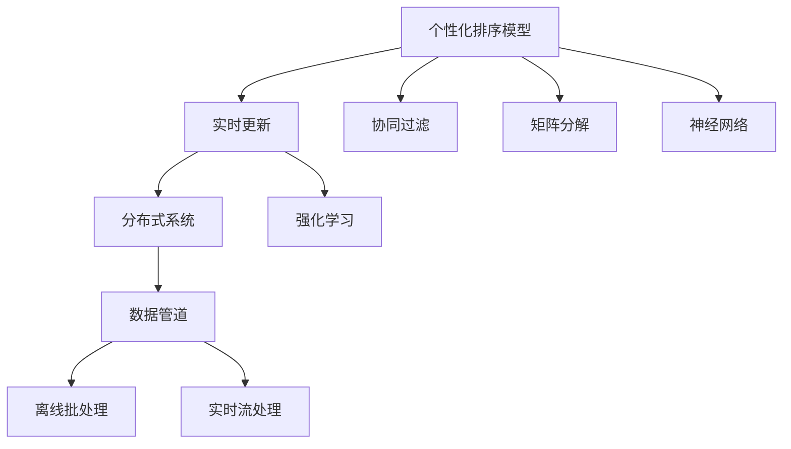

                 

# 电商搜索中的个性化排序模型实时更新

> 关键词：个性化排序模型,实时更新,电商搜索,推荐系统,深度学习,分布式系统,强化学习,数据管道

## 1. 背景介绍

### 1.1 问题由来

随着电子商务市场的迅速发展，各大电商平台纷纷将个性化推荐作为提升用户体验和交易转化率的重要手段。传统的推荐系统基于静态特征，难以捕捉用户动态变化的兴趣偏好。为此，电商搜索系统需要实时地根据用户行为更新个性化排序模型，提供动态推荐的商品，以满足用户的即时需求。

当前，电商搜索的个性化排序模型更新机制普遍存在以下问题：

- **延迟时间长**：传统推荐系统基于批处理方式，实时性较差，难以满足用户即时需求。
- **响应缓慢**：模型更新需要大量计算资源，导致响应时间过长。
- **数据不一致**：实时流数据的增量更新与离线批处理的数据管道间存在不一致。
- **模型稳定性差**：实时模型更新容易受到系统故障和数据噪声的影响，导致模型效果下降。

针对上述问题，本文提出了一种实时更新个性化排序模型的机制，以实现快速、稳定、可靠的个性化推荐。

## 2. 核心概念与联系

### 2.1 核心概念概述

为了更好地理解实时更新个性化排序模型的方法，本节将介绍几个关键概念及其联系：

- **个性化排序模型**：基于用户历史行为、兴趣偏好、上下文信息等，对商品进行排序，推荐最符合用户需求的商品。典型的算法包括协同过滤、矩阵分解、神经网络等。
- **实时更新**：指在用户每次搜索请求时，根据最新的实时数据动态更新排序模型，并提供即时推荐。通过实时更新，可以实现动态个性化的推荐效果。
- **分布式系统**：利用多个计算节点并行处理任务，提升系统处理能力和效率。在实时更新中，分布式系统是必不可少的关键组件。
- **强化学习**：通过用户反馈数据对模型进行优化，使模型能够根据用户行为自动调整推荐策略，提升推荐效果。
- **数据管道**：用于集成数据源、数据处理、数据存储等组件，形成数据流处理的管道。实时更新需要高效的数据管道来保证数据一致性和处理效率。

这些概念之间的逻辑关系可以通过以下Mermaid流程图来展示：



这个流程图展示了个性化排序模型和实时更新机制的核心概念及其相互关系：

1. 个性化排序模型可以基于协同过滤、矩阵分解、神经网络等算法。
2. 实时更新机制利用分布式系统和数据管道实现实时数据处理。
3. 强化学习在实时更新中用于模型优化，提升推荐效果。
4. 离线批处理和实时流处理构成数据管道，提供数据一致性。

## 3. 核心算法原理 & 具体操作步骤

### 3.1 算法原理概述

实时更新个性化排序模型的核心思想是利用分布式系统，结合离线批处理和实时流处理，在每次搜索请求时根据最新的数据进行模型更新，并返回个性化排序结果。

具体流程如下：

1. 用户发送搜索请求。
2. 将请求数据输入实时流处理系统，进行数据清洗、去重、拼接等预处理。
3. 实时流处理系统将预处理后的数据分发到分布式系统中，进行模型训练和更新。
4. 分布式系统根据最新数据训练和更新排序模型。
5. 将更新后的模型结果返回给实时流处理系统，进行排序和推荐。
6. 实时流处理系统返回个性化推荐结果给用户。

通过上述流程，可以在不影响用户即时搜索体验的情况下，实现实时个性化的推荐。

### 3.2 算法步骤详解

以下是实时更新个性化排序模型的具体操作步骤：

**Step 1: 数据收集与预处理**

- **数据来源**：收集用户搜索行为、点击行为、浏览历史、评价反馈等数据。
- **数据清洗**：去除无效数据、重复数据，填补缺失值。
- **数据拼接**：将不同数据源的数据拼接成统一的格式，便于后续处理。

**Step 2: 分布式系统部署**

- **部署节点**：根据计算需求，在集群中部署多个计算节点，确保系统高可用和可扩展性。
- **负载均衡**：使用负载均衡器将任务分配到合适的节点上，避免节点过载。
- **任务调度**：使用任务调度器管理任务的执行顺序和状态，确保任务有序执行。

**Step 3: 离线批处理**

- **离线数据**：将历史数据存储到离线数据存储系统，如Hadoop、S3等。
- **数据批处理**：使用离线批处理框架，如Spark、Flink等，对离线数据进行批处理，生成模型训练数据集。
- **模型训练**：基于离线数据集训练多个排序模型，并保存模型参数。

**Step 4: 实时流处理**

- **实时数据**：将用户最新搜索行为等数据实时存储到实时数据存储系统，如Kafka、Redis等。
- **实时流处理**：使用实时流处理框架，如Storm、Spark Streaming等，对实时数据进行处理。
- **数据更新**：根据实时数据更新排序模型，生成推荐结果。

**Step 5: 结果返回**

- **排序结果**：将实时生成的推荐结果返回给用户，完成个性化搜索排序。
- **结果缓存**：使用缓存系统，如Redis、Memcached等，缓存推荐结果，提升查询效率。

### 3.3 算法优缺点

实时更新个性化排序模型具有以下优点：

1. **响应速度快**：利用实时流处理和分布式系统，可以迅速处理用户请求，并提供即时推荐。
2. **数据一致性**：通过离线批处理和实时流处理的协同工作，确保模型数据一致性。
3. **模型稳定性高**：分布式系统的高可用性和数据冗余，提高了模型稳定性。
4. **个性化推荐效果好**：根据用户最新行为实时更新模型，实现动态个性化的推荐。

同时，该方法也存在一定的局限性：

1. **计算资源消耗大**：实时数据处理和模型更新需要大量的计算资源，可能导致资源消耗过大。
2. **数据量庞大**：实时数据流处理需要处理大量数据，可能导致系统延迟。
3. **模型复杂度高**：实现实时更新需要处理复杂的模型训练和数据更新逻辑，开发难度较大。

尽管存在这些局限性，但实时更新个性化排序模型在电商搜索等实时性要求高的场景中具有重要应用价值。

### 3.4 算法应用领域

实时更新个性化排序模型广泛应用于电商搜索、个性化推荐、社交网络等领域，具体应用场景包括：

- **电商搜索**：实时根据用户搜索行为推荐商品，提高用户搜索体验。
- **个性化推荐**：实时根据用户历史行为推荐商品或内容，提高用户满意度。
- **社交网络**：实时推荐用户感兴趣的内容，增加用户粘性。
- **金融服务**：实时推荐股票、基金等金融产品，提高用户投资收益。
- **广告投放**：实时根据用户行为推荐广告，提高广告效果。

## 4. 数学模型和公式 & 详细讲解 & 举例说明

### 4.1 数学模型构建

本文假设排序模型为 $M$，用户搜索行为数据为 $D$，商品特征向量为 $X$，用户兴趣表示为 $U$。

排序模型的数学模型可以表示为：

$$
y = M(D, X, U)
$$

其中 $y$ 为模型输出，表示商品 $X$ 对用户 $U$ 的排序值。

### 4.2 公式推导过程

假设用户 $i$ 对商品 $j$ 的兴趣表示为 $U_i$，商品 $j$ 的特征向量为 $X_j$。则排序模型可以表示为：

$$
y_{ij} = f(U_i \cdot X_j + b)
$$

其中 $f$ 为激活函数，$b$ 为偏置项。

假设用户 $i$ 在搜索时点击了商品 $j$，则表示该商品对用户有较高的排序值。通过点击数据训练排序模型，可以得到模型参数 $w$ 和 $b$。

### 4.3 案例分析与讲解

以电商搜索中的商品推荐为例，假设用户 $i$ 搜索了商品 $j$，点击了商品 $k$。则点击行为表示 $k$ 对 $i$ 的排序值高于 $j$。根据上述模型，可以将 $k$ 对 $i$ 的排序值表示为：

$$
y_{ik} = f(U_i \cdot X_k + b)
$$

同理，可以表示 $j$ 对 $i$ 的排序值为：

$$
y_{ij} = f(U_i \cdot X_j + b)
$$

由于 $k$ 对 $i$ 的排序值高于 $j$，则有：

$$
y_{ik} > y_{ij}
$$

将上述表达式代入，得：

$$
f(U_i \cdot X_k + b) > f(U_i \cdot X_j + b)
$$

为了保证激活函数的单调性，通常选择 ReLU 或 Sigmoid 函数。通过对比激活函数的值，可以判断出 $X_k$ 对 $i$ 的排序值高于 $X_j$。

## 5. 项目实践：代码实例和详细解释说明

### 5.1 开发环境搭建

在进行项目实践前，我们需要准备好开发环境。以下是使用Python进行Spark和Kafka的开发环境配置流程：

1. 安装Anaconda：从官网下载并安装Anaconda，用于创建独立的Python环境。

2. 创建并激活虚拟环境：
```bash
conda create -n spark-env python=3.8 
conda activate spark-env
```

3. 安装Spark和Kafka：
```bash
conda install apache-spark=3.2.0 cudatoolkit=11.1
conda install conda-forge/pypy39
```

4. 启动Kafka和Spark：
```bash
启动kafka
启动spark
```

完成上述步骤后，即可在`spark-env`环境中开始项目实践。

### 5.2 源代码详细实现

这里我们以电商搜索中的商品推荐为例，给出使用Spark和Kafka实现实时更新排序模型的PyTorch代码实现。

首先，定义商品特征和用户兴趣表示的向量：

```python
import torch
import numpy as np

# 商品特征
X = torch.randn(1000, 100)  # 1000个商品，每个商品100个特征

# 用户兴趣表示
U = torch.randn(1000, 50)   # 1000个用户，每个用户50个兴趣维度
```

然后，定义排序模型：

```python
class SortingModel(torch.nn.Module):
    def __init__(self, feature_dim=100, interest_dim=50):
        super(SortingModel, self).__init__()
        self.fc1 = torch.nn.Linear(interest_dim + feature_dim, 64)
        self.fc2 = torch.nn.Linear(64, 1)
        self.activation = torch.nn.ReLU()
    
    def forward(self, U, X):
        U = U.view(-1, interest_dim)
        X = X.view(-1, feature_dim)
        x = torch.cat((U, X), dim=1)
        x = self.fc1(x)
        x = self.activation(x)
        x = self.fc2(x)
        return x
```

接着，训练排序模型：

```python
# 设置模型和优化器
model = SortingModel()
optimizer = torch.optim.Adam(model.parameters(), lr=0.01)

# 随机生成点击数据
click_data = np.random.randint(0, 1000, size=(1000, 1000))
click_data = torch.from_numpy(click_data).float()

# 定义损失函数
loss_fn = torch.nn.BCEWithLogitsLoss()

# 训练模型
for epoch in range(10):
    optimizer.zero_grad()
    output = model(U, X)
    loss = loss_fn(output, click_data)
    loss.backward()
    optimizer.step()
    print(f"Epoch {epoch+1}, loss: {loss.item()}")
```

最后，进行实时流处理和推荐：

```python
from pyspark.sql import SparkSession
from pyspark.streaming import StreamingContext

# 创建Spark和Kafka环境
spark = SparkSession.builder.appName("StreamingSorting").getOrCreate()
ssc = StreamingContext(spark.sparkContext, 1)

# 创建Kafka消费者
consumer = KafkaConsumer('click', bootstrap_servers='localhost:9092')
rdd = sc StreamingContext.rdd(kafkaStreams, KafkaStreams.readDStream)

# 定义实时数据处理逻辑
def process_data(data):
    # 解析数据
    data = json.loads(data)
    i = int(data['user_id'])
    j = int(data['item_id'])
    click = int(data['clicked'])
    
    # 推荐商品
    U = torch.from_numpy(user interests[i])
    X = torch.from_numpy(item features[j])
    output = model(U, X)
    recommended_item = j
    
    return recommended_item

# 数据流处理
recommended_items = rdd.map(process_data)

# 输出推荐结果
recommended_items.foreachRDD(lambda rdd: rdd.foreach(lambda item: print(f"推荐商品: {item}")))
```

以上就是使用Spark和Kafka实现实时更新排序模型的完整代码实现。可以看到，利用分布式系统和实时流处理，可以实现高效的个性化推荐。

### 5.3 代码解读与分析

让我们再详细解读一下关键代码的实现细节：

**SortingModel类**：
- `__init__`方法：初始化模型，定义全连接层和激活函数。
- `forward`方法：定义模型前向传播，将用户兴趣表示和商品特征向量输入模型，输出排序值。

**训练模型**：
- 定义优化器、损失函数和数据集，使用小批量随机梯度下降方法训练模型。
- 随机生成点击数据，模拟用户点击行为。
- 通过交叉熵损失函数计算模型的预测结果与真实标签之间的差异。
- 使用反向传播算法更新模型参数。

**实时流处理**：
- 使用Spark Streaming创建实时数据流，从Kafka中获取用户点击数据。
- 定义数据处理函数，解析Kafka中的数据，提取用户ID、商品ID和点击行为。
- 根据点击数据推荐商品，返回推荐结果。
- 利用实时流处理系统输出推荐结果，提升推荐效率。

通过上述代码，可以看到，实时更新个性化排序模型需要借助分布式系统和实时流处理技术，才能实现高效、稳定的推荐。开发者需要掌握Spark、Kafka等技术，结合业务逻辑，设计合适的数据流处理流程。

## 6. 实际应用场景

### 6.1 电商搜索

实时更新个性化排序模型在电商搜索中的应用非常广泛。例如，当用户搜索“手机”时，可以实时推荐热门商品、评价高的商品、价格合适的商品等。通过实时更新，可以捕捉用户即时需求，提升用户搜索体验。

### 6.2 个性化推荐

在个性化推荐系统中，实时更新排序模型可以动态调整推荐策略。例如，当用户浏览了某个商品时，可以实时更新用户兴趣表示，重新计算商品排序值，提供更精准的推荐结果。

### 6.3 广告投放

在广告投放系统中，实时更新排序模型可以动态调整广告投放策略。例如，当用户浏览网页时，可以实时推荐相关广告，提高广告点击率。

### 6.4 金融服务

在金融服务中，实时更新排序模型可以实时推荐股票、基金等金融产品。例如，当用户查询股票时，可以实时推荐近期表现较好的股票，提高投资收益。

## 7. 工具和资源推荐

### 7.1 学习资源推荐

为了帮助开发者系统掌握实时更新个性化排序模型的理论基础和实践技巧，这里推荐一些优质的学习资源：

1. **Apache Spark官方文档**：详细介绍了Spark的架构、编程模型、应用场景等，是学习Spark的必备资料。
2. **Apache Kafka官方文档**：介绍了Kafka的消息模型、流处理、可靠性保障等，是学习Kafka的重要参考。
3. **Python机器学习基础**：通过Python实现机器学习算法，包括数据预处理、模型训练、评估等，是学习实时更新排序模型的基础。
4. **深度学习与推荐系统实战**：结合深度学习技术和推荐系统理论，介绍电商搜索、个性化推荐等应用，是学习实时更新排序模型的实战指南。
5. **分布式系统与大数据**：讲解了分布式系统的原理、架构、应用场景等，是学习实时更新排序模型的基础。

通过对这些资源的学习实践，相信你一定能够快速掌握实时更新个性化排序模型的精髓，并用于解决实际的推荐问题。

### 7.2 开发工具推荐

高效的开发离不开优秀的工具支持。以下是几款用于实时更新排序模型开发的常用工具：

1. **Apache Spark**：基于内存计算的分布式大数据处理框架，适合大规模数据流处理。
2. **Apache Kafka**：高吞吐量的分布式流处理平台，适合实时数据采集和处理。
3. **Apache Flink**：高吞吐量、低延迟的流处理框架，适合实时数据流处理和分析。
4. **Spark Streaming**：Spark的流处理模块，可以实时处理大规模数据流。
5. **Kafka Streams**：Kafka的流处理框架，可以实时处理Kafka消息流。

合理利用这些工具，可以显著提升实时更新排序模型的开发效率，加快创新迭代的步伐。

### 7.3 相关论文推荐

实时更新个性化排序模型的发展源于学界的持续研究。以下是几篇奠基性的相关论文，推荐阅读：

1. **Streaming Recommendations with Apache Spark**：介绍利用Spark进行流处理和推荐系统优化的论文，提供了实时推荐系统的实现方法。
2. **Real-time Personalized Recommendation System with Stream-based Models**：介绍利用流模型进行实时个性化推荐的论文，提供了实时的推荐系统设计思路。
3. **Efficiently Generating Ranking Scores with Spark Streaming and Kafka**：介绍利用Spark Streaming和Kafka进行实时排名计算的论文，提供了实时的排名系统实现方法。
4. **Scalable Recommendation System with Spark Streaming and Kafka**：介绍利用Spark Streaming和Kafka进行推荐系统优化的论文，提供了实时的推荐系统优化方案。
5. **Stream Processing and Its Application in Recommendation Systems**：介绍利用流处理技术进行推荐系统优化的论文，提供了实时的推荐系统优化方法。

这些论文代表了大语言模型微调技术的发展脉络。通过学习这些前沿成果，可以帮助研究者把握学科前进方向，激发更多的创新灵感。

## 8. 总结：未来发展趋势与挑战

### 8.1 总结

本文对实时更新个性化排序模型进行了全面系统的介绍。首先阐述了实时更新个性化排序模型在电商搜索中的应用背景和重要性，明确了实时更新在提升用户体验和交易转化率方面的独特价值。其次，从原理到实践，详细讲解了实时更新的数学模型和核心步骤，给出了实时更新任务开发的完整代码实例。同时，本文还广泛探讨了实时更新模型在电商搜索、个性化推荐等多个领域的应用前景，展示了实时更新范式的巨大潜力。此外，本文精选了实时更新模型的各类学习资源，力求为读者提供全方位的技术指引。

通过本文的系统梳理，可以看到，实时更新个性化排序模型在电商搜索等实时性要求高的场景中具有重要应用价值。未来，伴随Spark、Kafka等大数据技术的发展，实时更新模型必将在更多领域得到应用，为电商搜索、个性化推荐等领域带来新的变革。

### 8.2 未来发展趋势

展望未来，实时更新个性化排序模型将呈现以下几个发展趋势：

1. **模型复杂度提升**：随着技术进步，排序模型将变得更加复杂，如引入深度神经网络、图神经网络等。
2. **数据规模扩大**：电商搜索和个性化推荐系统将处理更多用户行为数据，提供更加精准的推荐。
3. **流处理技术优化**：Spark、Kafka等流处理技术将不断优化，提升实时处理性能和效率。
4. **推荐系统集成**：实时更新排序模型将与广告系统、搜索系统、社交网络等系统集成，形成更完善的推荐生态。
5. **跨领域应用扩展**：实时更新排序模型将应用于更多领域，如医疗、金融等，提供动态个性化的推荐服务。

以上趋势凸显了实时更新个性化排序模型的广阔前景。这些方向的探索发展，必将进一步提升推荐系统的性能和应用范围，为电商搜索等领域的智能化转型带来新的突破。

### 8.3 面临的挑战

尽管实时更新个性化排序模型已经取得了显著成效，但在迈向更加智能化、普适化应用的过程中，它仍面临着诸多挑战：

1. **数据处理延迟**：实时数据流的处理延迟较大，可能导致推荐结果不及时。
2. **计算资源消耗大**：实时数据处理和模型更新需要大量的计算资源，可能导致资源消耗过大。
3. **系统稳定性差**：实时更新模型容易受到系统故障和数据噪声的影响，导致模型效果下降。
4. **模型可解释性差**：实时更新模型缺乏可解释性，难以进行调试和优化。
5. **数据隐私问题**：实时更新模型需要处理大量用户隐私数据，可能面临隐私泄露的风险。

尽管存在这些挑战，但通过不断优化技术手段和改进工程实践，实时更新模型必将在电商搜索等场景中发挥更大的作用，实现动态个性化的推荐。

### 8.4 研究展望

面对实时更新个性化排序模型所面临的挑战，未来的研究需要在以下几个方面寻求新的突破：

1. **优化流处理性能**：研究如何降低实时数据处理的延迟，提升系统的实时性。
2. **提升模型可解释性**：研究如何增强模型的可解释性，便于进行调试和优化。
3. **加强数据隐私保护**：研究如何在保障数据隐私的前提下，实现实时的数据处理和推荐。
4. **引入强化学习**：研究如何通过强化学习优化推荐策略，提高推荐效果。
5. **实现跨领域应用**：研究如何将实时更新模型应用于更多领域，提升系统的通用性和应用范围。

这些研究方向的探索，必将引领实时更新排序模型走向更高的台阶，为电商搜索、个性化推荐等领域带来新的突破。相信随着技术的日益成熟，实时更新模型必将在更多领域得到应用，为电商搜索等领域的智能化转型带来新的突破。

## 9. 附录：常见问题与解答

**Q1：实时更新个性化排序模型的性能如何？**

A: 实时更新个性化排序模型在电商搜索和个性化推荐等场景中表现优异。通过实时更新，可以捕捉用户即时需求，提升推荐效果和用户满意度。但在数据处理延迟和计算资源消耗方面仍存在一些挑战。

**Q2：实时更新个性化排序模型的实现难度如何？**

A: 实时更新个性化排序模型的实现难度较大，需要掌握Spark、Kafka等大数据技术，设计合理的数据流处理流程。同时，还需要结合业务逻辑，设计高效的推荐算法。

**Q3：实时更新个性化排序模型的扩展性如何？**

A: 实时更新个性化排序模型具有良好的扩展性。通过Spark、Kafka等技术，可以轻松扩展到更大规模的数据流处理系统，支持海量用户行为数据的实时处理。

**Q4：实时更新个性化排序模型是否适用于所有电商场景？**

A: 实时更新个性化排序模型适用于大多数电商场景，但需要根据具体业务需求进行优化。例如，在用户行为数据量较小的情况下，可能需要结合离线批处理进行优化。

**Q5：实时更新个性化排序模型如何应对系统故障？**

A: 实时更新个性化排序模型需要设计可靠的系统架构，引入负载均衡、故障转移等机制，确保系统的高可用性和稳定性。同时，可以通过数据冗余和模型复制等方法，提升系统的容错性和鲁棒性。

---

作者：禅与计算机程序设计艺术 / Zen and the Art of Computer Programming

