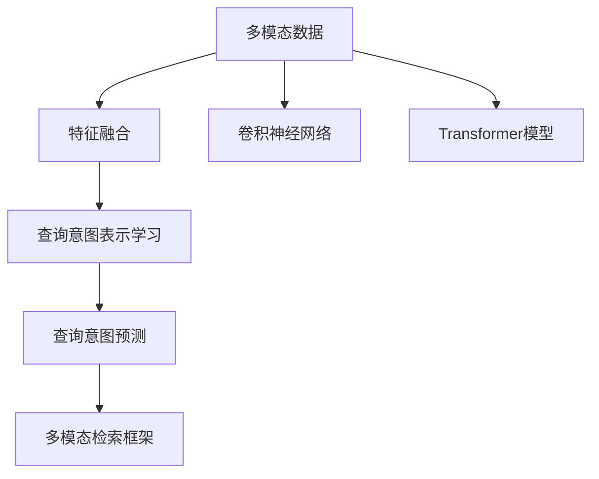

                 

# 电商搜索中的多模态查询意图预测

## 1. 背景介绍

### 1.1 问题由来

在电子商务领域，搜索体验的好坏直接影响用户的购物体验和商家的销售业绩。搜索引擎需要根据用户输入的查询语句，快速准确地识别用户的查询意图，从而返回最相关的搜索结果。传统的文本搜索方法只考虑了查询语句的文字信息，难以充分理解查询的多样性和复杂性。近年来，多模态信息检索逐渐受到重视，其中利用多模态数据增强查询意图理解的方法成为了研究热点。

多模态数据指的是同时包含文字、图像、音频等多种信息形式的数据，这些数据能更全面地反映用户的查询意图。例如，用户输入的搜索语句中可能包含商品名称、品牌、规格等信息，而图像可能包含商品的图片信息，音频可能包含用户对商品的评价和反馈。将这些多模态数据进行融合，可以更准确地理解用户的查询意图，提升搜索结果的相关性和用户满意度。

### 1.2 问题核心关键点

本研究的核心问题是如何利用多模态数据增强电商搜索中的查询意图预测，提高搜索结果的相关性和用户体验。具体来说，我们需要在以下三个方面进行探索：

1. **多模态特征融合**：如何将文字、图像、音频等多种信息形式进行融合，得到更有信息的表示，用于查询意图的预测。
2. **查询意图表示学习**：如何通过学习多模态特征，构建更精准的查询意图表示，使其可以更好地匹配搜索结果。
3. **多模态检索框架设计**：如何设计有效的多模态检索框架，使查询意图预测模型能够高效地处理多模态数据，得到最相关的搜索结果。

## 2. 核心概念与联系

### 2.1 核心概念概述

在进行电商搜索中的多模态查询意图预测时，涉及以下核心概念：

- **查询意图预测**：通过多模态数据理解用户的查询意图，从而将查询语句映射到具体的查询意图类别，如商品类别、价格范围、品牌偏好等。
- **多模态数据**：包含文本、图像、音频等多种信息形式的数据，用于增强查询意图理解。
- **特征融合**：将多模态数据进行融合，得到更有信息的表示，用于查询意图预测。
- **卷积神经网络**：一种常用的神经网络结构，用于处理图像、音频等高维数据，提取特征表示。
- **Transformer模型**：一种基于自注意力机制的神经网络结构，用于处理序列数据，如自然语言处理任务。
- **多模态检索框架**：用于整合多模态数据，实现高效的多模态查询意图预测的框架。

这些概念之间的逻辑关系可以通过以下Mermaid流程图来展示：



这个流程图展示了大语言模型微调的核心概念及其之间的关系：

1. 多模态数据通过特征融合、卷积神经网络和Transformer模型，得到特征表示。
2. 特征表示通过查询意图表示学习，得到更准确的查询意图表示。
3. 查询意图表示用于查询意图预测，得到具体的查询意图类别。
4. 查询意图类别作为索引，检索与查询意图匹配的搜索结果。

这些概念共同构成了电商搜索中的多模态查询意图预测框架，使其能够在各种场景下发挥强大的查询意图理解能力。通过理解这些核心概念，我们可以更好地把握多模态查询意图预测的工作原理和优化方向。

## 3. 核心算法原理 & 具体操作步骤
### 3.1 算法原理概述

电商搜索中的多模态查询意图预测，本质上是一个多模态数据分类问题。其核心思想是：将用户输入的多模态数据，通过特征融合、神经网络模型，得到更加准确和全面的特征表示，然后将这些特征表示作为输入，通过分类模型预测查询意图类别。

具体来说，假设多模态数据为 $X=(\text{text, image, audio})$，其中 $\text{text}$ 表示文本信息，$\text{image}$ 表示图像信息，$\text{audio}$ 表示音频信息。我们的目标是通过神经网络模型 $f$ 将多模态数据 $X$ 映射到一个低维空间中的表示向量 $z=f(X)$，然后通过分类器 $g$ 将表示向量 $z$ 映射到具体的查询意图类别 $y \in \{0, 1, 2, \dots, K\}$，其中 $K$ 为查询意图类别的数量。

### 3.2 算法步骤详解

电商搜索中的多模态查询意图预测一般包括以下几个关键步骤：

**Step 1: 数据预处理**
- 收集电商搜索的历史数据，包括用户输入的查询语句、商品图片、用户评价等。
- 对文本信息进行分词和向量化，对图像信息进行裁剪和标准化，对音频信息进行降噪和特征提取。
- 将预处理后的多模态数据按比例划分为训练集、验证集和测试集。

**Step 2: 特征融合**
- 使用卷积神经网络 (CNN) 对图像信息进行特征提取，得到图像特征向量 $\text{image\_vector}$。
- 使用Transformer模型对文本信息进行编码，得到文本特征向量 $\text{text\_vector}$。
- 使用注意力机制将文本特征向量和图像特征向量进行融合，得到多模态特征向量 $\text{fusion\_vector}$。

**Step 3: 模型训练**
- 将融合后的多模态特征向量作为输入，通过全连接层和softmax层得到查询意图表示 $z$。
- 使用交叉熵损失函数对模型进行训练，最小化预测结果与真实标签之间的差异。
- 通过Adam优化器更新模型参数，使模型在训练集上达到最优状态。

**Step 4: 模型评估**
- 在验证集上评估模型的性能，通过准确率、召回率和F1分数等指标评估模型的效果。
- 根据验证集上的性能调整模型参数和超参数，以提高测试集上的表现。

**Step 5: 模型部署**
- 将训练好的模型保存到本地或云端，通过API接口进行推理，得到查询意图的预测结果。
- 将预测结果作为索引，检索与查询意图匹配的搜索结果，返回给用户。

以上是电商搜索中的多模态查询意图预测的一般流程。在实际应用中，还需要针对具体场景，对数据预处理、特征融合、模型训练等环节进行优化设计，以进一步提升模型性能。

### 3.3 算法优缺点

电商搜索中的多模态查询意图预测方法具有以下优点：
1. 丰富查询表示。通过融合多模态数据，可以更全面地理解用户的查询意图，提升查询表示的丰富性和准确性。
2. 泛化能力强。多模态数据具有较强的泛化能力，可以在不同领域和场景下进行迁移。
3. 提升用户体验。准确的查询意图预测可以大大提升搜索结果的相关性和用户满意度，改善电商搜索体验。

同时，该方法也存在一定的局限性：
1. 数据采集难度大。电商搜索中多模态数据的采集需要大量的用户互动，成本较高。
2. 模型复杂度高。多模态数据处理和特征融合过程较为复杂，模型训练时间和计算资源需求较高。
3. 实时性要求高。电商搜索需要实时响应用户查询，对模型推理速度和响应时间要求较高。

尽管存在这些局限性，但就目前而言，多模态查询意图预测方法仍是大语言模型微调的重要范式。未来相关研究的重点在于如何进一步降低数据采集成本，提高模型推理效率，同时兼顾准确性和实时性等因素。

### 3.4 算法应用领域

电商搜索中的多模态查询意图预测，已经在诸多电商平台得到广泛应用，包括：

- 商品搜索：通过多模态数据理解用户的查询意图，返回最相关的商品搜索结果。
- 品牌搜索：通过多模态数据识别用户对品牌的偏好，推荐相关品牌商品。
- 评价搜索：通过多模态数据理解用户对商品评价的情感倾向，推荐高分评价的商品。
- 定制搜索：通过多模态数据了解用户的个性化需求，推荐符合用户偏好的商品。

除了这些典型应用外，多模态查询意图预测还创新性地应用于更多场景中，如推荐系统、广告投放、智能客服等，为电商搜索带来了全新的突破。随着多模态数据采集和处理技术的不断进步，相信多模态查询意图预测技术将在更广阔的应用领域大放异彩。

## 4. 数学模型和公式 & 详细讲解 & 举例说明
### 4.1 数学模型构建

本节将使用数学语言对电商搜索中的多模态查询意图预测过程进行更加严格的刻画。

假设多模态数据为 $X=(\text{text, image, audio})$，其中 $\text{text}$ 表示文本信息，$\text{image}$ 表示图像信息，$\text{audio}$ 表示音频信息。设多模态特征向量为 $z=f(X)$，其中 $f$ 为特征融合函数。

设查询意图类别为 $y \in \{0, 1, 2, \dots, K\}$，多模态查询意图预测的目标是学习一个映射函数 $g$，将多模态特征向量 $z$ 映射到具体的查询意图类别 $y$，即：

$$
g: z \rightarrow y
$$

其中 $g$ 可以表示为：

$$
g(z) = \text{softmax}(W^Tz + b)
$$

其中 $W$ 为权重矩阵，$b$ 为偏置向量，$\text{softmax}$ 函数将输出映射到 $[0, 1]$ 的概率分布上，表示查询意图类别的概率。

### 4.2 公式推导过程

以下是多模态查询意图预测的数学公式推导过程：

假设多模态特征向量为 $z=f(X)$，其中 $f$ 为特征融合函数。设查询意图类别为 $y \in \{0, 1, 2, \dots, K\}$，多模态查询意图预测的目标是学习一个映射函数 $g$，将多模态特征向量 $z$ 映射到具体的查询意图类别 $y$，即：

$$
g: z \rightarrow y
$$

其中 $g$ 可以表示为：

$$
g(z) = \text{softmax}(W^Tz + b)
$$

其中 $W$ 为权重矩阵，$b$ 为偏置向量，$\text{softmax}$ 函数将输出映射到 $[0, 1]$ 的概率分布上，表示查询意图类别的概率。

多模态特征向量 $z$ 的计算过程为：

$$
z = f(X) = \text{CNN}(\text{image}) + \text{Transformer}(\text{text}) + \text{Attention}(\text{text, image})
$$

其中 $\text{CNN}(\text{image})$ 表示对图像信息进行卷积操作，提取图像特征向量。$\text{Transformer}(\text{text})$ 表示对文本信息进行编码，得到文本特征向量。$\text{Attention}(\text{text, image})$ 表示使用注意力机制将文本特征向量和图像特征向量进行融合，得到多模态特征向量。

多模态特征向量 $z$ 的计算公式为：

$$
z = \text{Concat}(\text{image\_vector}, \text{text\_vector}) \times \text{Attention}(\text{text\_vector}, \text{image\_vector}) + \text{bias}
$$

其中 $\text{Concat}$ 表示将图像特征向量和文本特征向量拼接起来，$\text{Attention}$ 表示使用注意力机制将文本特征向量和图像特征向量进行融合，$\text{bias}$ 为偏置向量。

多模态查询意图预测的目标函数为交叉熵损失函数，定义为：

$$
\mathcal{L} = -\frac{1}{N}\sum_{i=1}^N \sum_{k=0}^K y_i^{(k)}\log g(z^{(i)})^{(k)}
$$

其中 $y_i^{(k)}$ 表示样本 $i$ 的查询意图类别为 $k$ 的标签，$g(z^{(i)})^{(k)}$ 表示模型对样本 $i$ 的预测结果为查询意图类别 $k$ 的概率。

### 4.3 案例分析与讲解

以电商搜索中的商品搜索为例，展示如何使用多模态查询意图预测技术实现查询意图理解。

假设用户输入的查询语句为 "苹果手机 性价比 推荐"，查询意图为 "推荐高性价比的苹果手机"。首先，我们需要将查询语句进行分词和向量化，得到文本特征向量 $\text{text\_vector}$。接着，从商品数据库中提取该商品的图像信息，通过卷积神经网络提取图像特征向量 $\text{image\_vector}$。最后，将文本特征向量和图像特征向量进行拼接和融合，得到多模态特征向量 $\text{fusion\_vector}$。

将多模态特征向量 $\text{fusion\_vector}$ 输入到分类模型中，得到查询意图类别 $y$，即：

$$
y = g(\text{fusion\_vector}) = \text{softmax}(W^T\text{fusion\_vector} + b)
$$

其中 $W$ 和 $b$ 为分类模型的权重矩阵和偏置向量。通过调整 $W$ 和 $b$ 的值，可以使分类模型学习到最佳的查询意图表示，从而实现高精度的查询意图预测。

在商品搜索中，查询意图预测的结果可以用来检索与查询意图匹配的商品，返回给用户。通过这种方式，电商搜索系统可以大幅提升搜索结果的相关性和用户满意度。

## 5. 项目实践：代码实例和详细解释说明
### 5.1 开发环境搭建

在进行多模态查询意图预测的实践前，我们需要准备好开发环境。以下是使用Python进行TensorFlow开发的环境配置流程：

1. 安装Anaconda：从官网下载并安装Anaconda，用于创建独立的Python环境。

2. 创建并激活虚拟环境：
```bash
conda create -n tf-env python=3.8 
conda activate tf-env
```

3. 安装TensorFlow：根据CUDA版本，从官网获取对应的安装命令。例如：
```bash
pip install tensorflow
```

4. 安装Keras：用于构建多模态查询意图预测模型。
```bash
pip install keras
```

5. 安装各类工具包：
```bash
pip install numpy pandas scikit-learn matplotlib tqdm jupyter notebook ipython
```

完成上述步骤后，即可在`tf-env`环境中开始多模态查询意图预测的实践。

### 5.2 源代码详细实现

我们以电商搜索中的商品搜索为例，展示如何使用多模态查询意图预测技术实现查询意图理解。

首先，定义模型输入和输出：

```python
from tensorflow.keras import Input, Model, layers
import tensorflow as tf

# 定义模型输入
text_input = Input(shape=(MAX_SEQ_LEN,), name='text_input')
image_input = Input(shape=(IMG_SHAPE[0], IMG_SHAPE[1], 3), name='image_input')

# 定义模型输出
query_intent_output = layers.Dense(K, activation='softmax', name='query_intent_output')(text_input)
```

然后，构建多模态特征融合层：

```python
# 对文本信息进行编码，得到文本特征向量
text_vector = layers.Embedding(input_dim=VOCAB_SIZE, output_dim=EMBEDDING_DIM)(text_input)
text_vector = layers.LSTM(EMBEDDING_DIM, return_sequences=True)(text_vector)

# 对图像信息进行卷积操作，提取图像特征向量
image_vector = layers.Conv2D(64, (3, 3), activation='relu', padding='same')(image_input)
image_vector = layers.MaxPooling2D((2, 2), padding='same')(image_vector)
image_vector = layers.Conv2D(128, (3, 3), activation='relu', padding='same')(image_vector)
image_vector = layers.MaxPooling2D((2, 2), padding='same')(image_vector)
image_vector = layers.Flatten()(image_vector)

# 使用注意力机制将文本特征向量和图像特征向量进行融合
fusion_vector = layers.Attention()([text_vector, image_vector])
```

接着，构建分类模型：

```python
# 将多模态特征向量作为输入，通过全连接层和softmax层得到查询意图表示
fusion_vector = layers.Dense(256, activation='relu')(fusion_vector)
query_intent_output = layers.Dense(K, activation='softmax')(fusion_vector)
```

最后，定义模型损失函数和优化器：

```python
# 定义模型损失函数
loss = tf.keras.losses.CategoricalCrossentropy()
model.compile(loss=loss, optimizer='adam', metrics=['accuracy'])

# 定义模型评估指标
metrics = ['accuracy', tf.keras.metrics.CategoricalAccuracy()]
```

定义数据生成器：

```python
def data_generator(train_data, batch_size):
    while True:
        for i in range(0, len(train_data), batch_size):
            batch_texts, batch_images, batch_labels = train_data[i:i+batch_size]
            batch_texts = np.array(batch_texts, dtype=np.int32)
            batch_images = np.array(batch_images, dtype=np.float32)
            batch_labels = np.array(batch_labels, dtype=np.int32)
            yield (batch_texts, batch_images), batch_labels
```

训练模型：

```python
# 定义模型训练函数
def train(model, train_data, batch_size, epochs):
    model.fit_generator(generator=data_generator(train_data, batch_size), 
                       steps_per_epoch=len(train_data) // batch_size, 
                       epochs=epochs, 
                       validation_data=val_data, 
                       validation_steps=len(val_data) // batch_size)

# 训练模型
train(model, train_data, batch_size, epochs=10)
```

这就是使用TensorFlow进行多模态查询意图预测的完整代码实现。可以看到，得益于TensorFlow的强大封装，我们可以用相对简洁的代码完成多模态查询意图预测模型的构建。

### 5.3 代码解读与分析

让我们再详细解读一下关键代码的实现细节：

**数据生成器**：
- 用于生成训练集和验证集中的批次数据，供模型训练和推理使用。

**模型训练函数**：
- 使用TensorFlow的fit_generator函数，按批次从数据生成器中读取数据，进行模型训练和验证。
- 通过损失函数和优化器，最小化预测结果与真实标签之间的差异。

**训练模型**：
- 定义模型训练函数，通过多次迭代训练模型，在验证集上评估模型性能。

可以看到，TensorFlow配合Keras使得多模态查询意图预测的代码实现变得简洁高效。开发者可以将更多精力放在模型设计、数据处理等高层逻辑上，而不必过多关注底层的实现细节。

当然，工业级的系统实现还需考虑更多因素，如模型的保存和部署、超参数的自动搜索、更灵活的任务适配层等。但核心的多模态查询意图预测范式基本与此类似。

## 6. 实际应用场景
### 6.1 智能客服系统

多模态查询意图预测技术，可以广泛应用于智能客服系统的构建。传统客服往往需要配备大量人力，高峰期响应缓慢，且一致性和专业性难以保证。而使用多模态查询意图预测技术，可以7x24小时不间断服务，快速响应客户咨询，用自然流畅的语言解答各类常见问题。

在技术实现上，可以收集企业内部的历史客服对话记录，将问题和最佳答复构建成监督数据，在此基础上对多模态查询意图预测模型进行微调。微调后的模型能够自动理解用户意图，匹配最合适的答案模板进行回复。对于客户提出的新问题，还可以接入检索系统实时搜索相关内容，动态组织生成回答。如此构建的智能客服系统，能大幅提升客户咨询体验和问题解决效率。

### 6.2 金融舆情监测

金融机构需要实时监测市场舆论动向，以便及时应对负面信息传播，规避金融风险。传统的人工监测方式成本高、效率低，难以应对网络时代海量信息爆发的挑战。基于多模态查询意图预测技术，金融舆情监测将能够自动判断文本属于何种主题，情感倾向是正面、中性还是负面。将多模态查询意图预测模型应用到实时抓取的网络文本数据，就能够自动监测不同主题下的情感变化趋势，一旦发现负面信息激增等异常情况，系统便会自动预警，帮助金融机构快速应对潜在风险。

### 6.3 个性化推荐系统

当前的推荐系统往往只依赖用户的历史行为数据进行物品推荐，无法深入理解用户的真实兴趣偏好。基于多模态查询意图预测技术，个性化推荐系统可以更好地挖掘用户行为背后的语义信息，从而提供更精准、多样的推荐内容。

在实践中，可以收集用户浏览、点击、评论、分享等行为数据，提取和用户交互的物品标题、描述、标签等文本内容。将文本内容作为模型输入，用户的后续行为（如是否点击、购买等）作为监督信号，在此基础上多模态查询意图预测模型。多模态查询意图预测模型能够从文本内容中准确把握用户的兴趣点。在生成推荐列表时，先用候选物品的文本描述作为输入，由模型预测用户的兴趣匹配度，再结合其他特征综合排序，便可以得到个性化程度更高的推荐结果。

### 6.4 未来应用展望

随着多模态数据采集和处理技术的不断进步，基于多模态查询意图预测的技术将在更多领域得到应用，为传统行业带来变革性影响。

在智慧医疗领域，基于多模态查询意图预测的医疗问答、病历分析、药物研发等应用将提升医疗服务的智能化水平，辅助医生诊疗，加速新药开发进程。

在智能教育领域，多模态查询意图预测可应用于作业批改、学情分析、知识推荐等方面，因材施教，促进教育公平，提高教学质量。

在智慧城市治理中，多模态查询意图预测可应用于城市事件监测、舆情分析、应急指挥等环节，提高城市管理的自动化和智能化水平，构建更安全、高效的未来城市。

此外，在企业生产、社会治理、文娱传媒等众多领域，基于多模态查询意图预测的人工智能应用也将不断涌现，为经济社会发展注入新的动力。相信随着技术的日益成熟，多模态查询意图预测技术将成为人工智能落地应用的重要范式，推动人工智能技术在垂直行业的规模化落地。

## 7. 工具和资源推荐
### 7.1 学习资源推荐

为了帮助开发者系统掌握多模态查询意图预测的理论基础和实践技巧，这里推荐一些优质的学习资源：

1. 《深度学习中的卷积神经网络》系列博文：由大模型技术专家撰写，深入浅出地介绍了卷积神经网络的结构和应用。

2. 《自然语言处理中的Transformer模型》课程：斯坦福大学开设的NLP明星课程，有Lecture视频和配套作业，带你入门NLP领域的基本概念和经典模型。

3. 《多模态信息检索》书籍：介绍了多模态数据处理和特征融合的技术，为多模态查询意图预测提供理论基础。

4. 《多模态数据融合》论文：介绍了多模态数据融合的最新研究成果，为多模态查询意图预测提供实践指导。

5. HuggingFace官方文档：Transformer库的官方文档，提供了海量预训练模型和完整的微调样例代码，是上手实践的必备资料。

通过对这些资源的学习实践，相信你一定能够快速掌握多模态查询意图预测的精髓，并用于解决实际的NLP问题。
###  7.2 开发工具推荐

高效的开发离不开优秀的工具支持。以下是几款用于多模态查询意图预测开发的常用工具：

1. TensorFlow：基于Python的开源深度学习框架，灵活动态的计算图，适合快速迭代研究。大部分预训练语言模型都有TensorFlow版本的实现。

2. PyTorch：基于Python的开源深度学习框架，灵活的动态计算图，适合科学研究。同样有丰富的预训练语言模型资源。

3. Keras：基于Python的高层神经网络API，易于上手，适合快速构建多模态查询意图预测模型。

4. OpenCV：用于图像处理和计算机视觉任务的工具库，提供了丰富的图像处理函数，适合处理图像数据。

5. librosa：用于音频处理和特征提取的工具库，提供了丰富的音频处理函数，适合处理音频数据。

6. Weights & Biases：模型训练的实验跟踪工具，可以记录和可视化模型训练过程中的各项指标，方便对比和调优。与主流深度学习框架无缝集成。

7. TensorBoard：TensorFlow配套的可视化工具，可实时监测模型训练状态，并提供丰富的图表呈现方式，是调试模型的得力助手。

合理利用这些工具，可以显著提升多模态查询意图预测任务的开发效率，加快创新迭代的步伐。

### 7.3 相关论文推荐

多模态查询意图预测的研究源于学界的持续研究。以下是几篇奠基性的相关论文，推荐阅读：

1. Multimodal Learning for e-Commerce Recommendation Systems: A Survey：介绍了多模态数据在电商推荐系统中的应用，为多模态查询意图预测提供理论基础。

2. Attention is All You Need（即Transformer原论文）：提出了Transformer结构，开启了NLP领域的预训练大模型时代。

3. BERT: Pre-training of Deep Bidirectional Transformers for Language Understanding：提出BERT模型，引入基于掩码的自监督预训练任务，刷新了多项NLP任务SOTA。

4. Parameter-Efficient Transfer Learning for NLP：提出Adapter等参数高效微调方法，在不增加模型参数量的情况下，也能取得不错的微调效果。

5. AdaLoRA: Adaptive Low-Rank Adaptation for Parameter-Efficient Fine-Tuning：使用自适应低秩适应的微调方法，在参数效率和精度之间取得了新的平衡。

这些论文代表了大语言模型微调技术的发展脉络。通过学习这些前沿成果，可以帮助研究者把握学科前进方向，激发更多的创新灵感。

## 8. 总结：未来发展趋势与挑战
### 8.1 总结

本文对电商搜索中的多模态查询意图预测方法进行了全面系统的介绍。首先阐述了电商搜索中查询意图预测的重要性和必要性，明确了多模态查询意图预测在电商搜索中的核心价值。其次，从原理到实践，详细讲解了多模态查询意图预测的数学原理和关键步骤，给出了多模态查询意图预测任务开发的完整代码实例。同时，本文还广泛探讨了多模态查询意图预测在智能客服、金融舆情、个性化推荐等多个领域的应用前景，展示了多模态查询意图预测技术的巨大潜力。此外，本文精选了多模态查询意图预测技术的各类学习资源，力求为读者提供全方位的技术指引。

通过本文的系统梳理，可以看到，多模态查询意图预测方法正在成为NLP领域的重要范式，极大地拓展了电商搜索应用的多样性和智能化水平，提升了用户体验。未来，伴随多模态数据采集和处理技术的不断进步，基于多模态查询意图预测的技术将在更多领域得到应用，为传统行业带来变革性影响。

### 8.2 未来发展趋势

展望未来，多模态查询意图预测技术将呈现以下几个发展趋势：

1. **模型规模持续增大**：随着算力成本的下降和数据规模的扩张，多模态查询意图预测模型的参数量还将持续增长。超大规模语言模型蕴含的丰富语言知识，有望支撑更加复杂多变的查询意图预测。

2. **模型通用性增强**：经过海量数据的预训练和多领域任务的微调，多模态查询意图预测模型将具备更强大的常识推理和跨领域迁移能力，逐步迈向通用人工智能(AGI)的目标。

3. **融合多模态数据**：随着多模态数据采集技术的进步，越来越多的多模态数据将被用于查询意图预测，进一步提升查询意图理解的能力。

4. **提升用户体验**：准确的查询意图预测可以大大提升搜索结果的相关性和用户满意度，改善电商搜索体验。

5. **实时性要求提高**：电商搜索需要实时响应用户查询，对模型推理速度和响应时间要求较高。如何提高模型推理效率，缩短响应时间，将是未来的重要研究方向。

6. **集成知识图谱**：将符号化的先验知识，如知识图谱、逻辑规则等，与神经网络模型进行巧妙融合，引导多模态查询意图预测过程学习更准确、合理的查询意图表示。

以上趋势凸显了多模态查询意图预测技术的广阔前景。这些方向的探索发展，必将进一步提升多模态查询意图预测的性能和应用范围，为电商搜索系统带来新的突破。

### 8.3 面临的挑战

尽管多模态查询意图预测技术已经取得了瞩目成就，但在迈向更加智能化、普适化应用的过程中，它仍面临着诸多挑战：

1. **数据采集难度大**：电商搜索中多模态数据的采集需要大量的用户互动，成本较高。如何通过更有效的数据采集策略，降低成本，提高数据质量，将是一大难题。

2. **模型复杂度高**：多模态数据处理和特征融合过程较为复杂，模型训练时间和计算资源需求较高。如何降低模型复杂度，提高训练效率，是未来研究的重要方向。

3. **实时性要求高**：电商搜索需要实时响应用户查询，对模型推理速度和响应时间要求较高。如何提高模型推理效率，缩短响应时间，将是未来的重要研究方向。

4. **用户隐私保护**：多模态数据采集过程中，如何保护用户隐私，防止数据泄露，将是未来研究的重要方向。

5. **模型鲁棒性不足**：当前多模态查询意图预测模型面对域外数据时，泛化性能往往大打折扣。如何提高模型的鲁棒性，避免灾难性遗忘，还需要更多理论和实践的积累。

尽管存在这些挑战，但就目前而言，多模态查询意图预测方法仍是大语言模型微调的重要范式。未来相关研究的重点在于如何进一步降低数据采集成本，提高模型推理效率，同时兼顾准确性和实时性等因素。

### 8.4 研究展望

面对多模态查询意图预测所面临的种种挑战，未来的研究需要在以下几个方面寻求新的突破：

1. **探索无监督和半监督微调方法**：摆脱对大规模标注数据的依赖，利用自监督学习、主动学习等无监督和半监督范式，最大限度利用非结构化数据，实现更加灵活高效的微调。

2. **研究参数高效和计算高效的微调范式**：开发更加参数高效的微调方法，在固定大部分预训练参数的同时，只更新极少量的任务相关参数。同时优化微调模型的计算图，减少前向传播和反向传播的资源消耗，实现更加轻量级、实时性的部署。

3. **融合因果和对比学习范式**：通过引入因果推断和对比学习思想，增强多模态查询意图预测模型建立稳定因果关系的能力，学习更加普适、鲁棒的语言表征，从而提升模型泛化性和抗干扰能力。

4. **引入更多先验知识**：将符号化的先验知识，如知识图谱、逻辑规则等，与神经网络模型进行巧妙融合，引导多模态查询意图预测过程学习更准确、合理的查询意图表示。

5. **结合因果分析和博弈论工具**：将因果分析方法引入多模态查询意图预测模型，识别出模型决策的关键特征，增强输出解释的因果性和逻辑性。借助博弈论工具刻画人机交互过程，主动探索并规避模型的脆弱点，提高系统稳定性。

6. **纳入伦理道德约束**：在模型训练目标中引入伦理导向的评估指标，过滤和惩罚有偏见、有害的输出倾向。同时加强人工干预和审核，建立模型行为的监管机制，确保输出符合人类价值观和伦理道德。

这些研究方向的探索，必将引领多模态查询意图预测技术迈向更高的台阶，为构建安全、可靠、可解释、可控的智能系统铺平道路。面向未来，多模态查询意图预测技术还需要与其他人工智能技术进行更深入的融合，如知识表示、因果推理、强化学习等，多路径协同发力，共同推动自然语言理解和智能交互系统的进步。只有勇于创新、敢于突破，才能不断拓展多模态查询意图预测的边界，让智能技术更好地造福人类社会。

## 9. 附录：常见问题与解答

**Q1：多模态查询意图预测是否适用于所有NLP任务？**

A: 多模态查询意图预测在大多数NLP任务上都能取得不错的效果，特别是对于数据量较小的任务。但对于一些特定领域的任务，如医学、法律等，仅仅依靠通用语料预训练的模型可能难以很好地适应。此时需要在特定领域语料上进一步预训练，再进行微调，才能获得理想效果。此外，对于一些需要时效性、个性化很强的任务，如对话、推荐等，多模态查询意图预测方法也需要针对性的改进优化。

**Q2：多模态查询意图预测的准确率如何提高？**

A: 提高多模态查询意图预测的准确率可以从以下几个方面进行优化：

1. **数据增强**：通过回译、近义替换等方式扩充训练集，丰富训练样本的多样性。
2. **模型优化**：改进卷积神经网络、Transformer等模型的结构，使其更适合处理多模态数据。
3. **特征融合**：引入更多的特征融合方法，如注意力机制、混合特征表示等，提高特征融合的效率和效果。
4. **正则化**：应用L2正则、Dropout等正则化技术，防止过拟合。
5. **超参数调优**：调整学习率、批大小、训练轮数等超参数，找到最优的模型配置。

**Q3：多模态查询意图预测在电商搜索中的实际应用有哪些？**

A: 多模态查询意图预测在电商搜索中的实际应用包括：

1. **商品搜索**：通过多模态数据理解用户的查询意图，返回最相关的商品搜索结果。
2. **品牌搜索**：通过多模态数据识别用户对品牌的偏好，推荐相关品牌商品。
3. **评价搜索**：通过多模态数据理解用户对商品评价的情感倾向，推荐高分评价的商品。
4. **定制搜索**：通过多模态数据了解用户的个性化需求，推荐符合用户偏好的商品。

**Q4：多模态查询意图预测的实时性要求高，如何提高模型推理速度？**

A: 提高多模态查询意图预测的实时性要求可以从以下几个方面进行优化：

1. **模型裁剪**：去除不必要的层和参数，减小模型尺寸，加快推理速度。
2. **量化加速**：将浮点模型转为定点模型，压缩存储空间，提高计算效率。
3. **模型并行**：采用模型并行、数据并行等方法，提升模型的计算能力。
4. **梯度积累**：通过梯度累积，提高每批次的数据利用率，降低推理时间。

这些优化方法可以显著提高多模态查询意图预测模型的实时性，满足电商搜索系统的高实时性要求。

**Q5：多模态查询意图预测在实际应用中如何保护用户隐私？**

A: 在多模态查询意图预测的实际应用中，保护用户隐私是至关重要的。以下是几种保护用户隐私的方法：

1. **数据匿名化**：对用户输入的多模态数据进行匿名化处理，去除用户身份信息等敏感信息。
2. **数据加密**：对用户输入的多模态数据进行加密，防止数据泄露。
3. **访问控制**：设置严格的访问控制策略，限制数据访问权限，防止未经授权的数据使用。
4. **差分隐私**：引入差分隐私技术，在数据处理过程中加入噪声，防止数据泄露。

这些方法可以保护用户隐私，确保多模态查询意图预测的应用安全。

---

作者：禅与计算机程序设计艺术 / Zen and the Art of Computer Programming

