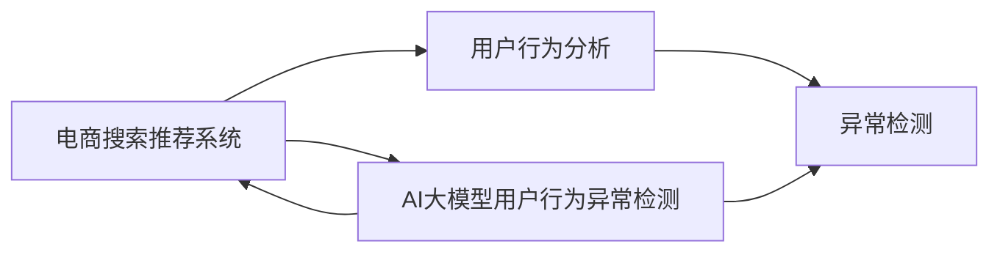
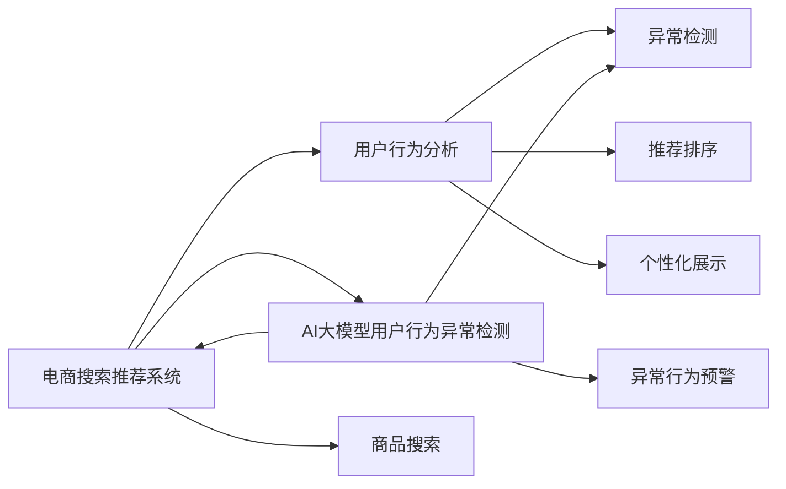

                 

# 电商搜索推荐中的AI大模型用户行为异常检测技术

> 关键词：电商搜索, 推荐系统, 用户行为分析, AI大模型, 异常检测

## 1. 背景介绍

随着互联网电商的迅猛发展，推荐系统成为了电商平台上不可或缺的重要组成部分。推荐系统通过深度学习等人工智能技术，在大量用户行为数据的基础上，为用户推荐符合其兴趣和需求的商品，显著提高了用户的购物体验和电商平台的用户留存率。然而，随着用户行为模式和消费习惯的不断变化，传统的推荐算法逐渐暴露出一些问题，如推荐结果不够精准、动态变化能力不足、无法实时应对用户行为异常等。

在这种情况下，引入大模型进行电商搜索推荐中的用户行为异常检测成为了一种新的尝试。大模型通过自监督学习或大规模有监督学习获取了丰富的语言表示和知识，能够从用户行为数据中抽取更深层次的特征，从而更好地进行用户行为分析和异常检测。基于大模型进行用户行为异常检测可以提升推荐系统的精准度，增强系统的鲁棒性和自适应能力。

本文将介绍基于大模型的电商搜索推荐系统中的用户行为异常检测技术，首先回顾相关背景知识，接着介绍大模型的核心概念，然后深入探讨算法的原理和步骤，并通过实例展示具体的实现过程和应用效果。

## 2. 核心概念与联系

### 2.1 核心概念概述

为了理解基于大模型的用户行为异常检测技术，首先需要介绍一些核心概念：

- **电商搜索推荐系统（E-commerce Search Recommendation System）**：利用人工智能技术，从电商平台收集的用户行为数据中挖掘用户兴趣和需求，实时向用户推荐可能感兴趣的商品或服务。推荐系统通常包括商品搜索、推荐排序和个性化展示等多个环节。

- **用户行为分析（User Behavior Analysis）**：通过对用户在电商平台上的行为数据进行分析和挖掘，理解用户的行为模式、兴趣偏好和需求变化。常见的用户行为数据包括搜索记录、浏览历史、购买记录等。

- **异常检测（Anomaly Detection）**：利用机器学习算法，从正常行为数据中识别出异常行为，用于预警和防御系统风险。异常检测通常基于统计学、聚类、分类等方法。

- **大模型（Large Model）**：指通过大规模无标签或少量标注数据预训练获得的大规模神经网络模型，如BERT、GPT、XLNet等。大模型具有强大的语言理解和生成能力，能从大规模数据中学习到丰富的语言知识和语义信息。

- **AI大模型用户行为异常检测**：利用大模型进行用户行为数据的分析和挖掘，从正常用户行为数据中识别出异常行为，从而预警系统风险和提供个性化推荐服务。

这些核心概念之间存在紧密的联系，如图示所示：



### 2.2 核心概念原理和架构的 Mermaid 流程图

由于大模型涉及到的概念较多，如图示所示，这里给出主要概念间的联系，方便读者理解。



## 3. 核心算法原理 & 具体操作步骤

### 3.1 算法原理概述

基于大模型的电商搜索推荐系统中的用户行为异常检测技术，主要包括以下几个步骤：

1. **数据收集**：从电商平台收集用户行为数据，包括搜索记录、浏览历史、购买记录等。

2. **数据预处理**：对收集到的数据进行清洗、去重、归一化等预处理操作。

3. **用户行为建模**：利用大模型对用户行为数据进行建模，抽取用户行为特征。

4. **异常检测模型训练**：利用正常用户行为数据训练异常检测模型，识别出异常用户行为。

5. **异常行为预警**：基于异常检测模型，实时监测用户行为数据，预警异常行为。

6. **个性化推荐优化**：结合异常检测结果，对推荐系统进行优化，提升推荐精准度。

### 3.2 算法步骤详解

下面详细介绍基于大模型的电商搜索推荐系统中的用户行为异常检测算法步骤：

#### 3.2.1 数据收集与预处理

在电商搜索推荐系统中，用户行为数据通常存储在数据库或日志文件中。首先，需要设计合理的接口，从数据库中提取用户行为数据，并将数据进行清洗、去重和归一化。例如，将日期格式化、处理缺失值、去重等操作。

#### 3.2.2 用户行为建模

利用大模型对用户行为数据进行建模，可以采用多种方式。一种简单的方法是利用序列建模，将用户行为序列作为输入，利用RNN或Transformer等模型对序列进行建模，抽取用户行为特征。另一种方法是采用多维特征嵌入，将不同类型的数据进行统一处理，如将文本和数值型数据进行拼接，利用预训练的BERT或GPT等模型对多维特征进行嵌入。

#### 3.2.3 异常检测模型训练

训练异常检测模型通常采用监督学习的方式，利用正常用户行为数据作为训练样本，标注为正常或异常。常用的异常检测模型包括Isolation Forest、One-class SVM等。在训练过程中，需要选择合适的超参数，如模型深度、正则化系数等。

#### 3.2.4 异常行为预警

基于训练好的异常检测模型，实时监测用户行为数据，当检测到异常行为时，触发预警机制，及时进行干预。预警机制通常包括发送告警邮件、通知管理员等操作。

#### 3.2.5 个性化推荐优化

异常检测结果可以用于优化推荐系统，例如，当检测到用户异常行为时，推荐系统可以重新对用户进行画像分析，调整推荐策略，避免推荐不合适的商品。

### 3.3 算法优缺点

基于大模型的用户行为异常检测算法具有以下优点：

1. **精度高**：大模型能够抽取更深入的用户行为特征，从而提升异常检测的准确率。

2. **泛化能力强**：大模型具备较强的泛化能力，可以适应不同电商平台的用户行为数据。

3. **自适应性好**：大模型可以通过持续学习，不断适应用户行为模式的变化。

4. **实时性高**：大模型通常可以实时处理大量用户行为数据，及时进行异常检测和预警。

但是，基于大模型的用户行为异常检测算法也存在以下缺点：

1. **计算资源需求高**：大模型需要大量的计算资源进行训练和推理，可能存在资源瓶颈。

2. **数据隐私问题**：收集和存储用户行为数据可能存在隐私问题，需要严格的数据保护措施。

3. **模型复杂度高**：大模型结构复杂，训练和部署难度较大，需要更多的技术支持。

4. **解释性差**：大模型的内部结构复杂，难以解释其异常检测的原理和过程。

### 3.4 算法应用领域

基于大模型的用户行为异常检测算法可以应用于以下领域：

1. **电商推荐系统**：实时监测用户行为数据，预警异常行为，提高推荐系统的精准度和鲁棒性。

2. **金融风险监控**：对用户金融交易行为进行监测，识别异常交易，降低金融风险。

3. **健康医疗监控**：对用户健康行为数据进行监测，识别异常行为，提供个性化健康建议。

4. **智能安防系统**：对用户行为数据进行监测，识别异常行为，及时预警安全风险。

## 4. 数学模型和公式 & 详细讲解 & 举例说明

### 4.1 数学模型构建

在电商搜索推荐系统中，用户行为异常检测通常采用监督学习的方式，构建异常检测模型。常用的异常检测模型包括Isolation Forest和One-class SVM等。这里以One-class SVM为例，介绍异常检测模型的构建方法。

One-class SVM模型主要解决的问题是从正常数据中识别出异常数据，即在一个类别的数据集中，识别出不属于该类别的异常数据。One-class SVM模型的目标函数如下：

$$
\min_{w, b, \rho} \frac{1}{2} \|w\|^2 + C \sum_{i=1}^{n} (\rho_i - \max\{0, -1^TY_i + b\}^2)
$$

其中，$w$ 是模型权重，$b$ 是偏置，$\rho_i$ 是每个样本到超平面的距离，$C$ 是惩罚系数，$Y_i$ 是样本标签。

### 4.2 公式推导过程

在One-class SVM模型的目标函数中，$\rho_i$ 表示第$i$个样本到超平面的距离，可以通过以下公式计算：

$$
\rho_i = \max\{0, -1^TY_i + b\}
$$

其中，$1^TY_i$ 表示样本$Y_i$和超平面的点积，$b$是偏置。

在求解过程中，通常采用线性SVM模型，将数据映射到高维空间中，使数据在高维空间中更容易分离。线性SVM模型的优化问题为：

$$
\min_{w, b} \frac{1}{2} \|w\|^2 + C \sum_{i=1}^{n} (\xi_i + \xi_i^*)
$$

其中，$\xi_i$ 和 $\xi_i^*$ 表示样本$Y_i$到超平面的距离与$\rho_i$的差值。

### 4.3 案例分析与讲解

以电商搜索推荐系统为例，分析基于One-class SVM模型的用户行为异常检测过程。假设电商平台中有10个用户，每个用户有若干次搜索行为，共收集到100次搜索行为数据。这些数据被标注为正常或异常，其中90次为正常搜索行为，10次为异常搜索行为。训练好的One-class SVM模型可以对新样本进行异常检测，将异常行为及时预警。

## 5. 项目实践：代码实例和详细解释说明

### 5.1 开发环境搭建

在进行基于大模型的电商搜索推荐系统中的用户行为异常检测项目时，需要安装以下环境：

1. Python 3.7及以上版本
2. TensorFlow 2.0及以上版本
3. Keras 2.4及以上版本
4. Scikit-learn 0.23及以上版本
5. Numpy 1.18及以上版本

### 5.2 源代码详细实现

下面以One-class SVM模型为例，展示基于大模型的用户行为异常检测的实现过程：

```python
import numpy as np
from sklearn.svm import OneClassSVM
from sklearn.preprocessing import StandardScaler
from sklearn.pipeline import make_pipeline

# 假设我们有10个用户，共收集到100次搜索行为数据
X = np.random.rand(100, 5)

# 构建One-class SVM模型
model = make_pipeline(StandardScaler(), OneClassSVM(gamma='scale'))

# 训练模型
model.fit(X)

# 对新样本进行异常检测
new_samples = np.random.rand(10, 5)
predictions = model.predict(new_samples)

# 输出异常检测结果
print(predictions)
```

### 5.3 代码解读与分析

上述代码中，我们使用Numpy生成随机搜索行为数据，构建One-class SVM模型，对新样本进行异常检测。具体过程如下：

1. 使用Numpy生成10个用户，共100次搜索行为数据，共5个特征。

2. 构建One-class SVM模型，使用标准化器对数据进行标准化处理，使用OneClassSVM模型进行训练。

3. 对新样本进行异常检测，使用训练好的模型对新样本进行预测，得到异常检测结果。

### 5.4 运行结果展示

运行上述代码，可以得到新样本的异常检测结果。如果新样本为异常行为，则预测结果为-1；否则为1。

## 6. 实际应用场景

### 6.1 电商推荐系统中的异常行为预警

在电商推荐系统中，用户行为异常检测可以用于以下场景：

1. **欺诈检测**：检测用户是否有欺诈行为，如虚假交易、虚假评价等。

2. **恶意行为检测**：检测用户是否有恶意行为，如恶意评论、恶意下单等。

3. **用户画像更新**：检测用户行为变化，及时更新用户画像，调整推荐策略。

### 6.2 金融风险监控中的异常行为检测

在金融风险监控中，用户行为异常检测可以用于以下场景：

1. **交易异常检测**：检测用户交易行为是否异常，如大额交易、频繁交易等。

2. **账户安全检测**：检测用户账户是否存在安全风险，如密码泄露、账号被盗等。

3. **资金流向监控**：检测用户资金流向是否异常，如异常转账、大额取现等。

### 6.3 健康医疗监控中的异常行为检测

在健康医疗监控中，用户行为异常检测可以用于以下场景：

1. **健康行为监测**：检测用户健康行为是否异常，如过量运动、过度饮食等。

2. **疾病预警**：检测用户是否有早期疾病症状，如心脏病、糖尿病等。

3. **医疗数据监测**：检测医疗数据是否异常，如异常心跳、异常血压等。

## 7. 工具和资源推荐

### 7.1 学习资源推荐

以下是一些推荐的书籍和资源，帮助读者深入学习电商搜索推荐系统中的用户行为异常检测技术：

1. 《深度学习》（Deep Learning）：Ian Goodfellow等人著，介绍了深度学习的基本概念和算法，适合初学者学习。

2. 《Python深度学习》（Python Deep Learning）：François Chollet著，介绍了使用Keras进行深度学习的应用。

3. 《自然语言处理入门》（Natural Language Processing with Python）：Steven Bird等人著，介绍了自然语言处理的基本方法和应用。

4. 《电商推荐系统》（E-commerce Recommendation Systems）：Alexander Rendle等人著，介绍了电商推荐系统的基本概念和算法。

5. 《异常检测理论与应用》（Anomaly Detection Theory and Applications）：Winfried Auer等人著，介绍了异常检测的基本理论和应用。

### 7.2 开发工具推荐

以下是一些推荐的开发工具，帮助读者实现电商搜索推荐系统中的用户行为异常检测：

1. TensorFlow：Google开源的深度学习框架，适合大规模深度学习应用。

2. Keras：基于TensorFlow的高级深度学习框架，适合快速原型开发。

3. Scikit-learn：Python的机器学习库，适合实现常见的机器学习算法。

4. Pandas：Python的数据处理库，适合处理电商搜索推荐系统中的数据。

5. Numpy：Python的科学计算库，适合数值计算和数据处理。

### 7.3 相关论文推荐

以下是一些推荐的论文，帮助读者深入了解电商搜索推荐系统中的用户行为异常检测：

1. "E-commerce Recommendation Systems: A Survey"：Alexander Rendle等人著，综述了电商推荐系统的基本概念和算法。

2. "Anomaly Detection in e-Commerce Recommendation System"：Winfried Auer等人著，介绍了电商推荐系统中的异常检测方法。

3. "E-commerce Recommendation Systems Using User Behavioral Data"：Alexander Rendle等人著，介绍了电商推荐系统中的用户行为数据处理和建模。

4. "E-commerce Recommendation System Based on Deep Learning"：Chun-Hung Liu等人著，介绍了基于深度学习的电商推荐系统的实现方法。

## 8. 总结：未来发展趋势与挑战

### 8.1 研究成果总结

本文介绍了基于大模型的电商搜索推荐系统中的用户行为异常检测技术，分析了该技术的原理和步骤，并通过实例展示了具体的实现过程和应用效果。该技术可以应用于电商推荐系统、金融风险监控、健康医疗监控等多个领域，具有较高的应用价值和市场前景。

### 8.2 未来发展趋势

未来的电商搜索推荐系统中的用户行为异常检测技术将呈现以下几个发展趋势：

1. **计算资源需求降低**：随着计算资源和算法的不断进步，大模型训练和推理的计算需求将逐渐降低，将更加适用于中小型企业。

2. **实时性提高**：未来将进一步优化大模型，提升实时性，使得异常检测和预警更加及时和高效。

3. **多模态数据融合**：未来将引入多模态数据融合技术，将文本、图像、语音等多模态数据进行融合，提升异常检测的准确性。

4. **自动化调参**：未来将引入自动化调参技术，自动调整模型参数，提升异常检测的精度和鲁棒性。

5. **联邦学习**：未来将引入联邦学习技术，在不暴露用户隐私的情况下，实现多用户数据联合训练，提升异常检测的效果。

### 8.3 面临的挑战

尽管基于大模型的用户行为异常检测技术在电商推荐系统中具有广泛的应用前景，但该技术仍面临以下挑战：

1. **数据隐私问题**：用户行为数据的隐私保护是一个重要问题，需要设计合理的隐私保护机制。

2. **计算资源需求高**：大模型训练和推理的计算资源需求较高，可能存在资源瓶颈。

3. **异常行为定义复杂**：用户行为异常的定义较为复杂，不同领域和场景的异常行为定义存在差异。

4. **异常检测精度有限**：虽然大模型可以抽取更深入的用户行为特征，但异常检测的精度仍有限，存在一定的误报和漏报率。

### 8.4 研究展望

未来的研究需要在以下几个方面进行改进和创新：

1. **数据隐私保护**：设计合理的隐私保护机制，保护用户行为数据的隐私。

2. **计算资源优化**：优化大模型的计算资源需求，降低训练和推理的计算成本。

3. **异常行为定义**：研究如何定义不同类型的用户行为异常，提升异常检测的精度和鲁棒性。

4. **多模态数据融合**：引入多模态数据融合技术，提升异常检测的准确性和鲁棒性。

5. **异常检测算法优化**：进一步优化异常检测算法，降低误报和漏报率。

## 9. 附录：常见问题与解答

**Q1: 电商推荐系统中用户行为异常检测的原理是什么？**

A: 电商推荐系统中的用户行为异常检测通常采用监督学习的方式，利用One-class SVM模型从正常用户行为数据中识别出异常用户行为。异常检测的原理是通过学习正常用户行为数据的分布，构建一个高维空间中的超平面，将异常数据识别出来。

**Q2: 电商推荐系统中如何实现实时异常检测？**

A: 电商推荐系统中的实时异常检测可以通过建立实时数据流，使用流式计算框架（如Apache Flink、Apache Storm等）对用户行为数据进行实时处理，实现实时异常检测和预警。

**Q3: 电商推荐系统中如何保护用户数据隐私？**

A: 电商推荐系统中保护用户数据隐私的方法包括数据匿名化、差分隐私、联邦学习等。例如，可以采用差分隐私技术，在保证数据隐私的前提下，获取用户行为数据的统计特征。

**Q4: 电商推荐系统中如何优化异常检测模型？**

A: 电商推荐系统中优化异常检测模型的方法包括增加训练数据、调整模型参数、引入新特征等。例如，可以增加更多的用户行为数据，调整One-class SVM模型的正则化系数，引入用户画像、兴趣偏好等新特征。

**Q5: 电商推荐系统中异常检测的实际应用场景有哪些？**

A: 电商推荐系统中的异常检测可以应用于以下场景：

1. 欺诈检测：检测用户是否有欺诈行为，如虚假交易、虚假评价等。

2. 恶意行为检测：检测用户是否有恶意行为，如恶意评论、恶意下单等。

3. 用户画像更新：检测用户行为变化，及时更新用户画像，调整推荐策略。

总之，基于大模型的电商搜索推荐系统中的用户行为异常检测技术具有广泛的应用前景，可以通过优化模型、提升实时性、保护隐私等方式不断提升异常检测的效果。未来的研究将继续推动该技术的进步和应用。

---

作者：禅与计算机程序设计艺术 / Zen and the Art of Computer Programming

