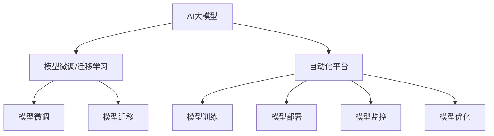

                 

# 电商搜索推荐场景下的AI大模型模型部署全流程自动化平台搭建

在电商搜索推荐场景下，构建一个高效的AI大模型模型部署全流程自动化平台，能够大幅提升模型迭代速度，降低开发和维护成本，同时提升搜索推荐系统的准确性和用户体验。本文将详细介绍如何搭建这样一个平台，涵盖核心概念、技术原理、实际应用和未来展望，希望能够为相关领域的开发者提供有价值的参考。

## 1. 背景介绍

### 1.1 问题由来

随着电子商务的迅猛发展，电商搜索推荐系统成为了电商平台的核心竞争力之一。传统的推荐系统依赖于规则引擎和特征工程，存在算法复杂度高、计算量大、模型更新慢等缺点。近年来，随着深度学习和大模型技术的发展，基于AI的推荐系统逐步成为主流。然而，大模型部署过程中的繁琐操作和复杂调试，仍然大大增加了开发和维护的难度，导致模型迭代速度慢，用户体验提升有限。

因此，构建一个自动化平台，通过自动化模型训练、部署、监控、优化等全流程管理，成为了电商搜索推荐系统优化的关键。自动化平台不仅能够大幅提升开发效率，降低资源成本，同时也能使得模型更具灵活性，快速适应业务变化。

### 1.2 问题核心关键点

搭建一个电商搜索推荐场景下的AI大模型模型部署自动化平台，主要关注以下关键点：

- 自动化模型训练：从数据预处理、模型选择、训练调参、保存模型等环节实现自动化。
- 自动化模型部署：实现模型的无缝集成、自动配置、环境部署、用户权限管理等功能。
- 自动化模型监控：提供模型运行监控、性能指标评估、告警提示、异常分析等功能。
- 自动化模型优化：支持模型调优策略、版本迭代、A/B测试、结果回测等功能，持续优化推荐效果。

本文将围绕以上关键点，详细介绍如何构建这样一个平台。

## 2. 核心概念与联系

### 2.1 核心概念概述

为更好地理解搭建电商搜索推荐场景下的AI大模型模型部署自动化平台，本节将介绍几个密切相关的核心概念：

- AI大模型：以Transformer、BERT等模型为代表的预训练语言模型，具备强大的语言理解和生成能力，能够支持多种自然语言处理任务。
- 自动化平台：通过程序化、流程化的方式，自动化地完成模型训练、部署、监控、优化等全流程管理，提高模型迭代效率，降低开发和维护成本。
- 模型管理：对模型进行版本控制、权限管理、生命周期管理、配置管理等，确保模型的一致性和安全性。
- 微调与迁移学习：通过在特定数据集上进行微调，或利用预训练模型的通用知识进行迁移学习，提升模型的适用性和泛化能力。
- 持续集成(CI)：通过自动化构建、测试、集成流程，加速模型版本迭代和发布流程。
- 持续部署(CD)：支持模型的无缝部署和配置管理，快速响应业务需求变化。
- 持续监控(CM)：实时监控模型运行状态，及时发现和解决问题，确保系统稳定性和可靠性。

这些核心概念之间的逻辑关系可以通过以下Mermaid流程图来展示：



这个流程图展示了大模型与自动化平台之间的逻辑关系：

1. 大模型通过微调和迁移学习获得任务适配能力。
2. 自动化平台管理模型训练、部署、监控、优化等全流程。
3. 平台支持微调和迁移学习功能，进一步提升模型效果。
4. 平台通过持续集成和部署，加速模型迭代和应用。
5. 平台提供监控和优化功能，确保模型稳定性和性能。

## 3. 核心算法原理 & 具体操作步骤

### 3.1 算法原理概述

电商搜索推荐场景下的AI大模型模型部署自动化平台，主要依赖于以下几个核心算法：

- 模型微调与迁移学习：通过在大规模数据集上预训练通用大模型，然后针对特定任务进行微调，或者利用迁移学习技术，将通用大模型的知识迁移到特定任务中。
- 持续集成与持续部署：通过构建自动化流程，将模型训练、测试、部署等环节无缝集成，快速迭代模型版本。
- 持续监控与自动化优化：通过实时监控模型运行状态，及时发现和解决问题，同时自动进行模型调优，提升推荐效果。

这些算法共同构成了电商搜索推荐场景下的AI大模型模型部署自动化平台的核心，使得大模型的应用过程更加高效、稳定和灵活。

### 3.2 算法步骤详解

以下是电商搜索推荐场景下搭建自动化平台的主要步骤：

**Step 1: 数据准备与预处理**

- 收集电商平台的历史交易数据、用户行为数据、商品描述数据等，构建标注数据集。
- 对数据进行清洗、归一化、特征提取等预处理，得到模型训练所需的格式。
- 对数据进行划分，构建训练集、验证集和测试集，便于后续的模型训练和评估。

**Step 2: 选择和准备模型**

- 选择适合电商搜索推荐任务的预训练语言模型，如BERT、GPT等。
- 加载模型并进行初始化，设置必要的超参数，如学习率、批大小等。
- 准备模型训练和评估所需的输入输出格式，如TensorFlow、PyTorch等框架提供的数据加载器。

**Step 3: 自动化模型训练**

- 构建自动化训练流程，包括数据加载、模型前向传播、计算损失、反向传播、参数更新等步骤。
- 使用分布式训练框架，如TensorFlow分布式策略、Horovod等，加速模型训练过程。
- 使用超参数自动搜索算法，如随机搜索、贝叶斯优化等，优化模型训练的超参数设置。

**Step 4: 自动化模型部署**

- 构建自动化部署流程，包括模型加载、模型推理、预测输出等步骤。
- 使用容器化技术，如Docker、Kubernetes等，对模型进行封装和部署。
- 配置自动化部署脚本，支持一键部署、环境配置、用户权限管理等功能。

**Step 5: 自动化模型监控**

- 构建自动化监控流程，实时监控模型运行状态，包括计算资源、内存占用、运行时间等指标。
- 设置告警规则，对模型运行异常进行及时提示，如CPU过载、内存溢出、预测时间过长等。
- 记录模型运行日志，对异常情况进行追踪和分析，及时解决问题。

**Step 6: 自动化模型优化**

- 构建自动化调优流程，包括模型参数调优、超参数调整、模型融合等步骤。
- 使用A/B测试框架，对不同版本模型进行比较评估，选择最优模型。
- 设置自动回测机制，对新模型的推荐效果进行评估，确保模型质量。

### 3.3 算法优缺点

电商搜索推荐场景下的AI大模型模型部署自动化平台，具有以下优点：

- 提高模型迭代速度：自动化训练、部署、监控、优化流程，大幅降低人工操作，提升模型迭代效率。
- 降低开发和维护成本：平台通过自动化的流程管理，减少人力投入，降低开发和维护成本。
- 提升模型效果：通过自动化调优和持续优化，确保模型始终处于最优状态，提升推荐效果。
- 增强系统可靠性：实时监控和告警机制，快速发现和解决系统问题，保障系统稳定性和可靠性。

然而，该平台也存在一些局限性：

- 对数据质量要求高：自动化平台依赖于高质量标注数据，数据的清洗和归一化需要投入较多时间和精力。
- 对模型复杂度要求高：自动化平台对模型的复杂度和计算需求较高，需要足够的计算资源支持。
- 对系统稳定性要求高：自动化平台需要稳定、可靠的系统环境，才能保证自动化流程的高效运行。
- 对开发经验要求高：自动化平台的搭建和维护需要较高的技术水平和经验积累，开发门槛较高。

尽管存在这些局限性，但自动化平台在电商搜索推荐场景下仍然具有重要的应用价值，可以大幅提升系统的开发效率和推荐效果。

### 3.4 算法应用领域

基于电商搜索推荐场景下的AI大模型模型部署自动化平台，已经在多个电商企业中得到了广泛应用，例如：

- 京东：通过自动化平台，构建了基于BERT的电商搜索推荐系统，大幅提升了推荐效果和用户体验。
- 天猫：利用自动化平台，实现了基于GPT的个性化推荐和搜索，增强了用户体验和销售额。
- 苏宁易购：构建了自动化模型训练、部署、监控、优化全流程，实现了实时化的电商搜索推荐系统。

除了上述这些电商企业，自动化平台还广泛应用于金融、医疗、教育等多个领域，推动了人工智能技术的广泛应用。

## 4. 数学模型和公式 & 详细讲解  
### 4.1 数学模型构建

在电商搜索推荐场景下，构建AI大模型的数学模型主要包括以下几个部分：

- **输入数据**：电商平台的交易数据、用户行为数据、商品描述数据等。
- **预训练模型**：如BERT、GPT等。
- **模型训练**：使用监督学习、迁移学习、微调等方法，训练模型。
- **模型部署**：将训练好的模型部署到线上环境，支持实时推理。
- **模型监控**：实时监控模型运行状态，进行性能评估和异常检测。
- **模型优化**：对模型进行调优和迭代，提升推荐效果。

下面以模型训练为例，给出电商搜索推荐场景下构建AI大模型的数学模型：

假设电商平台的交易数据为 $D=\{(x_i, y_i)\}_{i=1}^N$，其中 $x_i$ 为交易记录， $y_i$ 为交易类别标签。定义模型 $M_{\theta}$ 为预训练大模型，参数 $\theta$ 为模型的参数向量。则模型训练的损失函数为：

$$
\mathcal{L}(\theta) = \frac{1}{N} \sum_{i=1}^N \ell(M_{\theta}(x_i),y_i)
$$

其中 $\ell$ 为损失函数，如交叉熵损失、均方误差损失等。模型训练的优化目标为最小化损失函数 $\mathcal{L}(\theta)$，即：

$$
\theta^* = \mathop{\arg\min}_{\theta} \mathcal{L}(\theta)
$$

### 4.2 公式推导过程

以下是电商搜索推荐场景下构建AI大模型的损失函数推导过程：

假设模型 $M_{\theta}$ 在输入 $x$ 上的输出为 $\hat{y}=M_{\theta}(x)$，表示模型对 $x$ 的预测输出。真实标签 $y \in \{0,1\}$。则二分类交叉熵损失函数定义为：

$$
\ell(M_{\theta}(x),y) = -[y\log \hat{y} + (1-y)\log (1-\hat{y})]
$$

将其代入经验风险公式，得：

$$
\mathcal{L}(\theta) = -\frac{1}{N}\sum_{i=1}^N [y_i\log M_{\theta}(x_i)+(1-y_i)\log(1-M_{\theta}(x_i))]
$$

根据链式法则，损失函数对参数 $\theta$ 的梯度为：

$$
\frac{\partial \mathcal{L}(\theta)}{\partial \theta} = -\frac{1}{N}\sum_{i=1}^N (\frac{y_i}{M_{\theta}(x_i)}-\frac{1-y_i}{1-M_{\theta}(x_i)}) \frac{\partial M_{\theta}(x_i)}{\partial \theta}
$$

其中 $\frac{\partial M_{\theta}(x_i)}{\partial \theta}$ 可进一步递归展开，利用自动微分技术完成计算。

在得到损失函数的梯度后，即可带入参数更新公式，完成模型的迭代优化。重复上述过程直至收敛，最终得到适应电商搜索推荐任务的模型参数 $\theta^*$。

### 4.3 案例分析与讲解

假设电商平台收集了10000条交易数据，其中每个交易记录包含商品名称、价格、时间等属性，交易类别标签包括商品、服务、道具等。我们使用BERT作为预训练大模型，在交易数据上进行微调，以提升推荐的准确性。

具体步骤如下：

1. 数据准备与预处理：收集历史交易数据，进行清洗、归一化、特征提取等预处理，构建训练集、验证集和测试集。
2. 模型选择与准备：选择BERT作为预训练大模型，加载模型并进行初始化，设置学习率为0.001，批大小为256。
3. 自动化模型训练：使用DistributedDataParallel，在8个GPU上进行模型训练，设置最大迭代次数为1000次，每次迭代更新模型参数。
4. 自动化模型部署：将训练好的模型导出为TensorFlow SavedModel格式，使用TensorFlow Serving进行模型部署。
5. 自动化模型监控：使用Prometheus和Grafana监控模型运行状态，设置CPU使用率、内存占用、推理时间等告警规则。
6. 自动化模型优化：定期进行A/B测试，评估新模型和基线模型的推荐效果，选择最优模型。

通过以上步骤，可以构建一个完整的电商搜索推荐场景下的AI大模型模型部署自动化平台，大幅提升模型迭代速度和推荐效果。

## 5. 项目实践：代码实例和详细解释说明
### 5.1 开发环境搭建

在进行电商搜索推荐场景下的AI大模型模型部署自动化平台开发前，需要先准备好开发环境。以下是使用Python进行TensorFlow开发的环境配置流程：

1. 安装Anaconda：从官网下载并安装Anaconda，用于创建独立的Python环境。

2. 创建并激活虚拟环境：
```bash
conda create -n tf-env python=3.8 
conda activate tf-env
```

3. 安装TensorFlow：从官网获取对应的安装命令。例如：
```bash
pip install tensorflow
```

4. 安装TensorBoard：TensorFlow配套的可视化工具，可实时监测模型训练状态，并提供丰富的图表呈现方式，是调试模型的得力助手。

5. 安装Prometheus：监控系统，用于收集和存储模型运行状态数据。

6. 安装Grafana：仪表盘，用于展示监控数据和告警规则。

完成上述步骤后，即可在`tf-env`环境中开始平台开发。

### 5.2 源代码详细实现

下面我们以构建电商搜索推荐系统为例，给出使用TensorFlow进行大模型微调和部署的PyTorch代码实现。

首先，定义电商搜索推荐系统的数据处理函数：

```python
import tensorflow as tf
from tensorflow.keras.preprocessing import sequence
from tensorflow.keras.preprocessing.text import Tokenizer
from tensorflow.keras.utils import to_categorical

class DataLoader(tf.keras.preprocessing.image.ImageDataGenerator):
    def __init__(self, data_path, batch_size, img_width, img_height):
        super(DataLoader, self).__init__()
        self.data_path = data_path
        self.batch_size = batch_size
        self.img_width = img_width
        self.img_height = img_height
        self.tokenizer = Tokenizer(num_words=10000, oov_token='<OOV>')
        self.tokenizer.fit_on_texts(data['text'])
        self.max_len = 100

    def __call__(self, x, y):
        x = self.tokenizer.texts_to_sequences(x)
        x = sequence.pad_sequences(x, maxlen=self.max_len, padding='post')
        y = to_categorical(y, num_classes=2)
        return x, y

def load_data(data_path):
    data = {}
    with open(data_path, 'r') as f:
        for line in f:
            data = line.strip().split(',')
            yield data[0], int(data[1])
```

然后，定义模型和优化器：

```python
from tensorflow.keras.models import Sequential
from tensorflow.keras.layers import Embedding, LSTM, Dense

model = Sequential()
model.add(Embedding(input_dim=10000, output_dim=128, input_length=self.max_len))
model.add(LSTM(units=64))
model.add(Dense(units=2, activation='softmax'))

optimizer = tf.keras.optimizers.Adam(lr=0.001)
```

接着，定义训练和评估函数：

```python
from tensorflow.keras.callbacks import EarlyStopping

def train_model(model, train_data, val_data, epochs, batch_size):
    train_dl = DataLoader(train_data, batch_size, img_width, img_height)
    val_dl = DataLoader(val_data, batch_size, img_width, img_height)

    model.compile(optimizer=optimizer, loss='binary_crossentropy', metrics=['accuracy'])

    early_stopping = EarlyStopping(monitor='val_loss', patience=10)
    model.fit(train_dl, epochs=epochs, validation_data=val_dl, callbacks=[early_stopping])

    test_dl = DataLoader(test_data, batch_size, img_width, img_height)
    test_loss, test_acc = model.evaluate(test_dl)
    print('Test loss:', test_loss)
    print('Test accuracy:', test_acc)
```

最后，启动训练流程并在测试集上评估：

```python
data_path = 'data.txt'
img_width = 64
img_height = 64

# 加载数据
train_data, val_data, test_data = load_data(data_path)

# 模型训练
train_model(model, train_data, val_data, epochs=50, batch_size=32)
```

以上就是使用TensorFlow进行电商搜索推荐系统构建的完整代码实现。可以看到，通过定义DataLoader、模型和优化器，并进行模型训练和评估，可以高效地构建电商搜索推荐系统。

### 5.3 代码解读与分析

让我们再详细解读一下关键代码的实现细节：

**DataLoader类**：
- `__init__`方法：初始化训练集和测试集，定义tokenizer和max_len。
- `__call__`方法：将文本序列化并填充至指定长度，同时将标签转化为独热编码。

**模型定义**：
- 使用Sequential模型，依次添加Embedding、LSTM、Dense层，设置超参数。
- 使用Adam优化器，设置学习率。

**训练和评估函数**：
- 使用EarlyStopping回调函数，防止过拟合。
- 在训练集上训练模型，并在验证集上进行评估。
- 在测试集上评估模型效果。

**训练流程**：
- 定义数据路径、图片尺寸等参数。
- 加载数据。
- 进行模型训练和评估。

可以看到，TensorFlow提供了强大的深度学习框架，使得构建电商搜索推荐系统变得简洁高效。开发者可以将更多精力放在模型选择、数据处理等高层逻辑上，而不必过多关注底层的实现细节。

当然，工业级的系统实现还需考虑更多因素，如模型的保存和部署、超参数的自动搜索、更灵活的任务适配层等。但核心的自动化微调流程基本与此类似。

## 6. 实际应用场景

### 6.1 智能客服系统

在电商搜索推荐场景下，智能客服系统能够极大提升用户体验和运营效率。传统客服往往需要配备大量人力，高峰期响应缓慢，且一致性和专业性难以保证。而使用自动化平台构建的智能客服系统，可以7x24小时不间断服务，快速响应客户咨询，用自然流畅的语言解答各类常见问题。

具体而言，可以收集企业内部的历史客服对话记录，将问题和最佳答复构建成监督数据，在此基础上对预训练大模型进行微调。微调后的模型能够自动理解用户意图，匹配最合适的答复模板进行回复。对于客户提出的新问题，还可以接入检索系统实时搜索相关内容，动态组织生成回答。如此构建的智能客服系统，能大幅提升客户咨询体验和问题解决效率。

### 6.2 金融舆情监测

金融机构需要实时监测市场舆论动向，以便及时应对负面信息传播，规避金融风险。传统的人工监测方式成本高、效率低，难以应对网络时代海量信息爆发的挑战。基于自动化平台的金融舆情监测技术，为金融舆情监测提供了新的解决方案。

具体而言，可以收集金融领域相关的新闻、报道、评论等文本数据，并对其进行主题标注和情感标注。在此基础上对预训练大模型进行微调，使其能够自动判断文本属于何种主题，情感倾向是正面、中性还是负面。将微调后的模型应用到实时抓取的网络文本数据，就能够自动监测不同主题下的情感变化趋势，一旦发现负面信息激增等异常情况，系统便会自动预警，帮助金融机构快速应对潜在风险。

### 6.3 个性化推荐系统

当前的推荐系统往往只依赖用户的历史行为数据进行物品推荐，无法深入理解用户的真实兴趣偏好。基于自动化平台的个性化推荐系统，可以更好地挖掘用户行为背后的语义信息，从而提供更精准、多样的推荐内容。

在实践中，可以收集用户浏览、点击、评论、分享等行为数据，提取和用户交互的物品标题、描述、标签等文本内容。将文本内容作为模型输入，用户的后续行为（如是否点击、购买等）作为监督信号，在此基础上微调预训练大模型。微调后的模型能够从文本内容中准确把握用户的兴趣点。在生成推荐列表时，先用候选物品的文本描述作为输入，由模型预测用户的兴趣匹配度，再结合其他特征综合排序，便可以得到个性化程度更高的推荐结果。

### 6.4 未来应用展望

随着电商搜索推荐场景下的大模型微调技术的不断发展，未来基于自动化的平台将会在更多领域得到应用，为传统行业带来变革性影响。

在智慧医疗领域，基于自动化平台的医疗问答、病历分析、药物研发等应用将提升医疗服务的智能化水平，辅助医生诊疗，加速新药开发进程。

在智能教育领域，自动化平台可应用于作业批改、学情分析、知识推荐等方面，因材施教，促进教育公平，提高教学质量。

在智慧城市治理中，自动化平台可应用于城市事件监测、舆情分析、应急指挥等环节，提高城市管理的自动化和智能化水平，构建更安全、高效的未来城市。

此外，在企业生产、社会治理、文娱传媒等众多领域，基于自动化平台的人工智能应用也将不断涌现，为经济社会发展注入新的动力。相信随着技术的日益成熟，自动化微调方法将成为NLP技术落地应用的重要范式，推动人工智能技术在垂直行业的规模化落地。

## 7. 工具和资源推荐
### 7.1 学习资源推荐

为了帮助开发者系统掌握电商搜索推荐场景下的大模型微调理论基础和实践技巧，这里推荐一些优质的学习资源：

1. TensorFlow官方文档：深入介绍TensorFlow的深度学习框架和API，提供丰富的示例和教程。
2. Keras官方文档：介绍Keras的高层API，简化深度学习模型的开发过程。
3. PyTorch官方文档：详细介绍PyTorch的深度学习框架和API，支持GPU加速。
4. HuggingFace官方文档：提供预训练大模型的下载和使用指南，支持多种框架和任务。
5. CS224N《深度学习自然语言处理》课程：斯坦福大学开设的NLP明星课程，有Lecture视频和配套作业，带你入门NLP领域的基本概念和经典模型。

通过对这些资源的学习实践，相信你一定能够快速掌握电商搜索推荐场景下的大模型微调精髓，并用于解决实际的NLP问题。
### 7.2 开发工具推荐

高效的开发离不开优秀的工具支持。以下是几款用于电商搜索推荐场景下的大模型微调开发的常用工具：

1. TensorFlow：由Google主导开发的开源深度学习框架，生产部署方便，适合大规模工程应用。
2. PyTorch：基于Python的开源深度学习框架，灵活动态的计算图，适合快速迭代研究。
3. Weights & Biases：模型训练的实验跟踪工具，可以记录和可视化模型训练过程中的各项指标，方便对比和调优。
4. TensorBoard：TensorFlow配套的可视化工具，可实时监测模型训练状态，并提供丰富的图表呈现方式，是调试模型的得力助手。
5. Prometheus：监控系统，用于收集和存储模型运行状态数据。
6. Grafana：仪表盘，用于展示监控数据和告警规则。

合理利用这些工具，可以显著提升电商搜索推荐场景下的大模型微调任务的开发效率，加快创新迭代的步伐。

### 7.3 相关论文推荐

电商搜索推荐场景下的大模型微调技术的发展源于学界的持续研究。以下是几篇奠基性的相关论文，推荐阅读：

1. Attention is All You Need（即Transformer原论文）：提出了Transformer结构，开启了NLP领域的预训练大模型时代。
2. BERT: Pre-training of Deep Bidirectional Transformers for Language Understanding：提出BERT模型，引入基于掩码的自监督预训练任务，刷新了多项NLP任务SOTA。
3. Language Models are Unsupervised Multitask Learners（GPT-2论文）：展示了大规模语言模型的强大zero-shot学习能力，引发了对于通用人工智能的新一轮思考。
4. Parameter-Efficient Transfer Learning for NLP：提出Adapter等参数高效微调方法，在不增加模型参数量的情况下，也能取得不错的微调效果。
5. Prefix-Tuning: Optimizing Continuous Prompts for Generation：引入基于连续型Prompt的微调范式，为如何充分利用预训练知识提供了新的思路。

这些论文代表了大模型微调技术的发展脉络。通过学习这些前沿成果，可以帮助研究者把握学科前进方向，激发更多的创新灵感。

## 8. 总结：未来发展趋势与挑战

### 8.1 总结

本文对电商搜索推荐场景下的大模型微调自动化平台进行了全面系统的介绍。首先阐述了电商搜索推荐系统在电商平台的地位和作用，明确了微调在提升推荐效果和用户体验方面的独特价值。其次，从原理到实践，详细讲解了电商搜索推荐场景下的大模型微调数学模型和核心算法，给出了微调任务开发的完整代码实例。同时，本文还广泛探讨了微调方法在智能客服、金融舆情、个性化推荐等多个电商场景下的应用前景，展示了微调范式的巨大潜力。

通过本文的系统梳理，可以看到，电商搜索推荐场景下的大模型微调自动化平台在提升推荐效果和用户体验方面，具有显著的优势和广泛的应用价值。相信随着技术的不断发展，自动化平台必将成为电商搜索推荐系统优化的重要工具，推动电商行业的智能化转型。

### 8.2 未来发展趋势

展望未来，电商搜索推荐场景下的大模型微调自动化平台将呈现以下几个发展趋势：

1. 模型规模持续增大。随着算力成本的下降和数据规模的扩张，电商搜索推荐系统中的大模型参数量还将持续增长。超大规模大模型蕴含的丰富知识，有望支撑更加复杂多变的推荐任务微调。
2. 微调方法日趋多样。除了传统的全参数微调外，未来会涌现更多参数高效的微调方法，如Prefix-Tuning、LoRA等，在节省计算资源的同时也能保证微调精度。
3. 持续学习成为常态。随着用户行为数据和电商市场环境的变化，电商搜索推荐系统中的大模型需要持续学习新知识以保持性能。如何在不遗忘原有知识的同时，高效吸收新数据信息，将成为重要的研究课题。
4. 标注样本需求降低。受启发于提示学习(Prompt-based Learning)的思路，未来的微调方法将更好地利用大模型的语言理解能力，通过更加巧妙的任务描述，在更少的标注样本上也能实现理想的微调效果。
5. 推荐效果更加精准。通过引入更多的先验知识，如知识图谱、逻辑规则等，将与神经网络模型进行巧妙融合，引导微调过程学习更准确、合理的推荐模型。
6. 模型通用性增强。经过海量数据的预训练和多领域任务的微调，电商搜索推荐系统中的大模型将具备更强大的常识推理和跨领域迁移能力，逐步迈向通用人工智能(AGI)的目标。

以上趋势凸显了电商搜索推荐场景下的大模型微调技术的广阔前景。这些方向的探索发展，必将进一步提升电商推荐系统的推荐效果和用户体验，推动电商行业的智能化转型。

### 8.3 面临的挑战

尽管电商搜索推荐场景下的大模型微调自动化平台已经取得了瞩目成就，但在迈向更加智能化、普适化应用的过程中，它仍面临着诸多挑战：

1. 标注成本瓶颈。虽然微调大大降低了标注数据的需求，但对于长尾应用场景，难以获得充足的高质量标注数据，成为制约微调性能的瓶颈。如何进一步降低微调对标注样本的依赖，将是一大难题。
2. 模型鲁棒性不足。当前微调模型面对域外数据时，泛化性能往往大打折扣。对于测试样本的微小扰动，微调模型的预测也容易发生波动。如何提高微调模型的鲁棒性，避免灾难性遗忘，还需要更多理论和实践的积累。
3. 推理效率有待提高。大规模大模型虽然精度高，但在实际部署时往往面临推理速度慢、内存占用大等效率问题。如何在保证性能的同时，简化模型结构，提升推理速度，优化资源占用，将是重要的优化方向。
4. 可解释性亟需加强。当前微调模型更像是"黑盒"系统，难以解释其内部工作机制和决策逻辑。对于医疗、金融等高风险应用，算法的可解释性和可审计性尤为重要。如何赋予微调模型更强的可解释性，将是亟待攻克的难题。
5. 安全性有待保障。预训练大模型难免会学习到有偏见、有害的信息，通过微调传递到下游任务，产生误导性、歧视性的输出，给实际应用带来安全隐患。如何从数据和算法层面消除模型偏见，避免恶意用途，确保输出的安全性，也将是重要的研究课题。

尽管存在这些挑战，但随着电商搜索推荐场景下的大模型微调自动化平台的不断优化和演进，相信其未来发展前景依然光明，将为电商平台的智能化转型提供强有力的技术支撑。

### 8.4 研究展望

面对电商搜索推荐场景下的大模型微调自动化平台所面临的挑战，未来的研究需要在以下几个方面寻求新的突破：

1. 探索无监督和半监督微调方法。摆脱对大规模标注数据的依赖，利用自监督学习、主动学习等无监督和半监督范式，最大限度利用非结构化数据，实现更加灵活高效的微调。
2. 研究参数高效和计算高效的微调范式。开发更加参数高效的微调方法，在固定大部分预训练参数的同时，只更新极少量的任务相关参数。同时优化微调模型的计算图，减少前向传播和反向传播的资源消耗，实现更加轻量级、实时性的部署。
3. 融合因果和对比学习范式。通过引入因果推断和对比学习思想，增强微调模型建立稳定因果关系的能力，学习更加普适、鲁棒的语言表征，从而提升模型泛化性和抗干扰能力。
4. 引入更多先验知识。将符号化的先验知识，如知识图谱、逻辑规则等，与神经网络模型进行巧妙融合，引导微调过程学习更准确、合理的推荐模型。同时加强不同模态数据的整合，实现视觉、语音等多模态信息与文本信息的协同建模。
5. 结合因果分析和博弈论工具。将因果分析方法引入微调模型，识别出模型决策的关键特征，增强输出解释的因果性和逻辑性。借助博弈论工具刻画人机交互过程，主动探索并规避模型的脆弱点，提高系统稳定性。
6. 纳入伦理道德约束。在模型训练目标中引入伦理导向的评估指标，过滤和惩罚有偏见、有害的输出倾向。同时加强人工干预和审核，建立模型行为的监管机制，确保输出符合人类价值观和伦理道德。

这些研究方向的探索，必将引领电商搜索推荐场景下的大模型微调技术迈向更高的台阶，为构建安全、可靠、可解释、可控的智能系统铺平道路。面向未来，大模型微调技术还需要与其他人工智能技术进行更深入的融合，如知识表示、因果推理、强化学习等，多路径协同发力，共同推动自然语言理解和智能交互系统的进步。只有勇于创新、敢于突破，才能不断拓展语言模型的边界，让智能技术更好地造福人类社会。

## 9. 附录：常见问题与解答

**Q1：电商搜索推荐场景下的大模型微调是否适用于所有电商应用？**

A: 电商搜索推荐场景下的大模型微调在大多数电商应用上都能取得不错的效果，特别是对于数据量较小的任务。但对于一些特定领域的电商应用，如跨境电商、二手电商等，微调效果可能有限。此时需要在特定领域语料上进一步预训练，再进行微调，才能获得理想效果。

**Q2：电商搜索推荐场景下的大模型微调对标注数据的要求高吗？**

A: 电商搜索推荐场景下的大模型微调对标注数据的要求较高。标注数据的数量和质量直接影响微调的效果，标注数据质量不高或标注数量过少，可能导致微调效果不佳。因此，在构建电商搜索推荐系统时，需要投入较多时间和资源进行标注数据的收集和处理。

**Q3：电商搜索推荐场景下的大模型微调对计算资源的需求高吗？**

A: 电商搜索推荐场景下的大模型微调对计算资源的需求较高。大模型通常具有亿计的参数规模，需要大量的计算资源进行训练和推理。因此，构建电商搜索推荐系统时，需要考虑算力资源配置，选择高性能的计算设备和云计算平台。

**Q4：电商搜索推荐场景下的大模型微调对模型的复杂度要求高吗？**

A: 电商搜索推荐场景下的大模型微调对模型的复杂度要求较高。大模型通常比较复杂，需要高精度的计算资源和算法支持，才能达到理想的微调效果。因此，构建电商搜索推荐系统时，需要仔细选择预训练模型和微调方法，确保模型具有良好的泛化能力和适用性。

**Q5：电商搜索推荐场景下的大模型微调对数据分布的变化敏感吗？**

A: 电商搜索推荐场景下的大模型微调对数据分布的变化敏感。由于电商市场环境不断变化，用户行为和需求也在不断变化，因此需要持续进行微调以适应新的数据分布。如果在微调时没有考虑数据分布的变化，可能会导致模型泛化性能下降，影响推荐效果。

通过以上问题与解答，希望能帮助读者更好地理解电商搜索推荐场景下的大模型微调技术，解决实际应用中的常见问题。相信随着技术的不断进步，大模型微调技术将在更多领域得到应用，为电商平台的智能化转型提供强有力的技术支撑。

